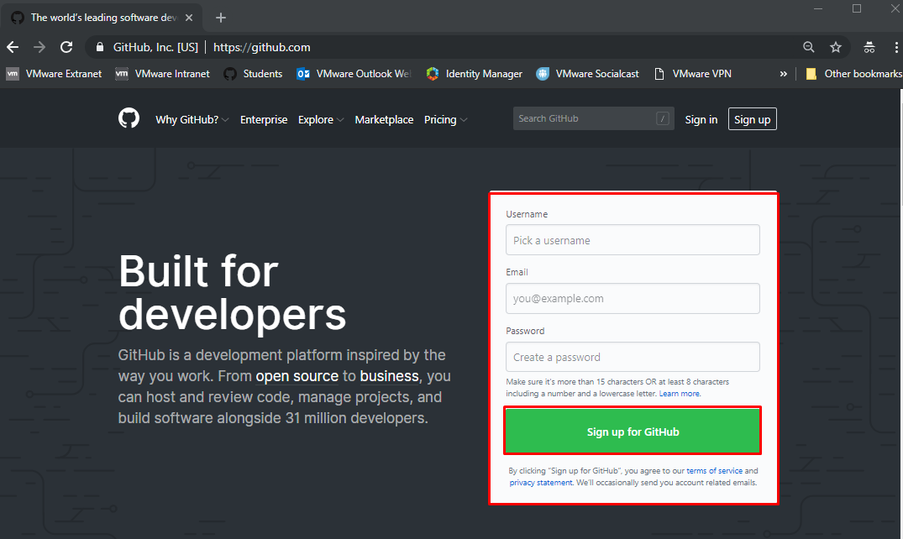

# Git Learning Path

- [Git Learning Path](#git-learning-path)
  - [Introduction](#introduction)
  - [Prerequisites](#prerequisites)
    - [Setting up a Github Account](#setting-up-a-github-account)
    - [Installing Git](#installing-git)
  - [Git Basics](#git-basics)
    - [Github Hello World](#github-hello-world)
    - [Commit a Validation Stamp](#commit-a-validation-stamp)
    - [Intro to Git CLI](#intro-to-git-cli)
    - [Github Flow](#github-flow)
  - [Create your student folder](#create-your-student-folder)
  - [Explore Branching and Forking](#explore-branching-and-forking)
  - [Create your contributor workspace](#create-your-contributor-workspace)

## Introduction

Git is a version control system that is used to provide a central repository for code and related files such as configuration files, infrastructure code, documentation and more.

If your new to git, its multitude of flexible and advanced capabilities can seem very intimidating at first, but it is important to remember that you do not need to understand complex or advanced git topics to be productive in using git to get started supporting production devops and cloud native projects.

**Tip: Don't get hung up on trying to fully understand git when you are getting started, the best way is to learn how to use the most common use cases, more advanced understanding will come naturally after you get more experience with the basic common use cases**

Most of the most powerful use cases for git involve common workflows that may require a little getting used to, but once you get a little hands on practice become second nature quickly. Whether you want to use git or github to save your own files, use the tons of free code available on github, participate or provide infrastructure/ops support for devops or cloud native projects, all these can be accomplished without git skills.

If you do not have a developer background, git can seem especially intimidating, but remember that on any complex development project, most roles only work on their respective part of the project, and just need to check in the files they are working on to the git repository to fulfill the need of their role.

The exercises in this course are designed to get you introduced to git, and familiar with the GitHub workflow, the process used by most github projects for participants to contribute to a git repository.

## Prerequisites

You will need access to a Ninja Lab Environment to complete this course. If you have not yet setup lab access, please see the [Getting Access to a PKS Ninja Lab Environment](../GetLabAccess-LA8528/readme.md) for further instructions

You will also need a github account and access to a workstation with git installed. The PKS Ninja Lab Environment has git pre-installed, but for your reference instructions on setting up a github account and installing git can be found below.

### Setting up a Github Account

In general it is a good practice to use a long-term personal email address when creating your account, as your github account and contributions you make reflect your professional profile and reputation. When possible you should keep your account in the event of a change of employment as you would with a Linkedin account or resume. If you plan to become a regular practitioner in container and cloud native technologies, regardless of whether you have a developer or infrastructure focus, you should plan and make goals for yourself to become a regular contributor on github.

Github is not just for coders, there is a huge need for non-code and code contributions alike. As organizations evolve even traditional developement towards agile practices, the same exact types of configuration files that sysadmins have historically provided are being moved to git repositories. Further, Documentation, Reference architectures, tutorials, even fixing typos and so on are all needed on git repos, and each time you do your github profile reports the amount of contributions you make. Over time, this can become a huge enabler for achieving career goals and enhancing your professional and community reputation.

In a web browser go to github.com, fill in the fields and click `Sign up for GitHub`. You do not need to use a corporate email or any special account settings to complete PKS Ninja Courses.

Github Sign Up Screenshot

 

### Installing Git

The PKS Ninja Lab Environment has git pre-installed, but it is a good practice to install git on any workstation where you regularly do developement and operations work.

Please see the [Installing Git](https://git-scm.com/book/en/v2/Getting-Started-Installing-Git) page in the official git documentation for instructions on installing git on supported client operating systems.

## Git Basics

Before proceeding, please review [The Git Handbook](https://guides.github.com/introduction/git-handbook/) from the beginning until you finish `The GitHub Flow` section.

### Github Hello World

Please complete the [Github Hello World GitHub Guide](https://guides.github.com/activities/hello-world/), this can be completed on the control center in the PKS Ninja lab or using any web browser with access to github. When finished, return to this guide and proceed with the next step below.

### Commit a Validation Stamp

The validation stamp lab is your first opportunity to learn the easy way to commit updates to public git repositories like PKS-Ninja. The exercise will show you how you can easily use githubs in-browser editor add your name to a simple text file to indicate that you completed the lab guide successfuly.

This method also is a valid method to submit simple updates to nearly any public repo on github and it automates most steps of the pull request process behind the scenes for you. This method is so simple that even after you become more comfortable with more advanced git methods, it is still generally the easiest method to commit simple updates.

Please Complete the [Commit a Validation Stamp Lab Guide](https://github.com/CNA-Tech/PKS-Ninja/tree/Pks1.4/LabGuides/ValidationStamp-VS9927) and when finished, return to this guide and proceed with the next step below.

### Intro to Git CLI

Please complete the [Intro to Git CLI Lab Guide](https://github.com/CNA-Tech/PKS-Ninja/tree/Pks1.4/LabGuides/IntroToGit-IG9099) and when finished, return to this guide and proceed with the next step below.

### Github Flow

Please complete the [Understanding the Github Flow Github guide](https://guides.github.com/introduction/flow/) and when finished, return to this guide and proceed with the next step below.

## Create your student folder

The Create Your Student Folder teaches how to do the complete pull request process, which you will need to learn and become comfortable with if you plan to work on agile, devops and cloud native projects. If you are new to pull requests, the process can seem tricky at first, but once you go through the steps a few times they can become second nature very quickly. The student folder exercise is designed to help make your first complete pull request process a comfortable and smooth experience. 

Once you create your student folder, it is important that you proactively remember to use it. While most lab guides wont remind you,  every time you modify a file as part of any lab guide exercise, remember to 'save your homework' by doing a pull request to save a copy of your modified files in the student folder. If you make a practice of this, the complete git pull request process will become very comfortable and familar to you very quickly.

Please complete the [Create your Student Folder Lab Guide](https://github.com/CNA-Tech/PKS-Ninja/tree/Pks1.4/LabGuides/CreateStudentFolder-SF6361) and when finished, return to this guide and proceed with the next step below.

## Explore Branching and Forking

Please complete the [Explore Git Branching and Forking Lab guide](https://github.com/CNA-Tech/PKS-Ninja/tree/Pks1.4/LabGuides/GitBranchingForking-EG7025)

## Create your contributor workspace

The Create your Student Folder exercise has you practice the pull request process on the seperate CNA-Tech/Students repository, which we strongly recommend to all participants who are not already very comfortable with the complete pull request process.

Once you have gotten comfortable with the full PR process, the next step is get setup to do the full PR process to commit updates to the PKS-Ninja repo!

Please complete the [Setting up your Contributor Repository](https://github.com/CNA-Tech/PKS-Ninja/tree/Pks1.4/LabGuides/ContributorWorkspace-CW4267) and when finished, return to this guide and proceed with the next step below.

**You have now completed the PKS the Easy Way Course! Thank you for participating!**