# Set up a bosh tunnel to be able to run bosh cli commands from the cli-vm

## Overview

The following lab guide provides the procedures to set up the cli-vm so that you can run bosh cli commands from there.  This would also enable the cli-vm to be a bbr jumpbox, in case you would want to execute a bbr backup or restore.

## Prerequisites

- Please see [Getting Access to a PKS Ninja Lab Environment](https://github.com/CNA-Tech/PKS-Ninja/tree/Pks1.4/Courses/GetLabAccess-LA8528) to learn about how to access or build a compatible lab environment

## Installation Notes

Anyone who implements any software used in this lab must provide their own licensing and ensure that their use of all software is in accordance with the software's licensing. This guide provides no access to any software licenses.

### Overview of Tasks Covered in this Lab Guide

- [Step 1: Set up the ssh keys between the cli-vm and the Ops Manager VM](#step-1-set-up-the-ssh-keys-between-the-cli-vm-and-the-ops-manager-vm)
- [Step 2: Install the bosh cli](#step-2-install-the-bosh-cli)
- [Step 3: Set up the bosh tunnel](#step-3-set-up-the-bosh-tunnel)
- [Step 4: Run bosh commands](#step-4-run-bosh-commands)

-----------------------

## Step 1: Set up the ssh keys between the cli-vm and the Ops Manager VM

Note: You should skip this step if you can already ssh from the cli-vm into the Ops Manager using a ssh key file and not using a password.  If you're using Ops Manager v2.6.x or above, then you probably have the ssh key as it is a requirement in that version.  If you already have the ssh key, then proceed to step 2.

1.0 From the `cli-vm`, run `ssh-keygen`.  When prompted to enter file name to save the key, enter `opsman-ssh-key`.  Press `Enter` on all other prompts.  Once the `ssh-keygen` has completed generating the keys, list the files generated by running `ls -l opsman-ssh-key*`.

<Details><Summary>Screenshot 1.0.1</Summary>
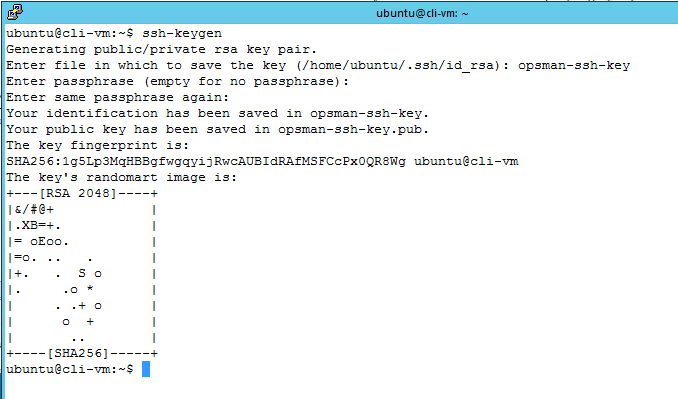
</Details>
<br/>

<Details><Summary>Screenshot 1.0.2</Summary>
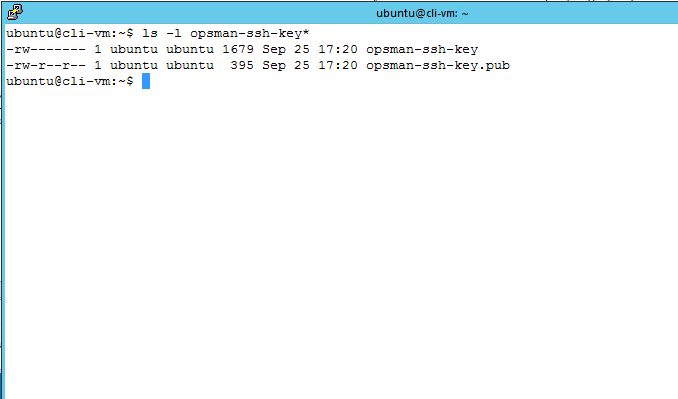
</Details>
<br/>

1.1 Show the contents of the `opsman-ssh-key.pub` file by running `cat opsman-ssh-key.pub`.  Then, copy all of the contents.

<Details><Summary>Screenshot 1.1</Summary>
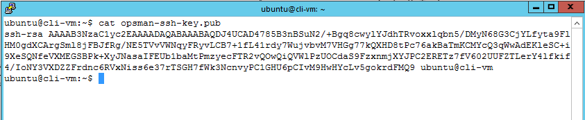
</Details>
<br/>

1.2 Log in as the `ubuntu` user into the Ops Manager VM as you normally would.  Then, paste the contents you copied from step 1.1 into the `~/.ssh/authorized_keys` file.  You can do this via `cat >> ~/.ssh/authorized_keys` and then paste the contents of opsman-ssh-key.pub, then press Ctrl-D to end the input.

<details><summary>Screenshot 1.2</summary>
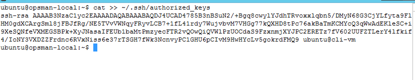
</details>
<br/>

1.3 Test if you can ssh into the Ops Manager VM from the cli-vm just by using the ssh key file. Run `ssh -i opsman-ssh-key ubuntu@opsman.corp.local`.  You should be able to log in without using any password.

<details><summary>Screenshot 1.3</summary>
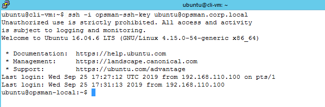
</details>
<br/>


## Step 2: Install the bosh cli

This step is to make sure that the bosh cli binary is installed in the `cli-vm`.

 2.1 From the `cli-vm`, run `bosh --version`.  If the bosh cli binary is installed, then you'll get the version number info, and if so, you can proceed to step 3.

<details><summary>Screenshot 2.1</summary>
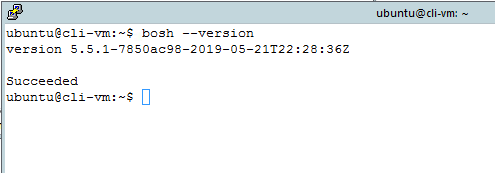
</details>
<br/>

 2.2 If you don't have the bosh cli binary installed, then download from github by running `wget https://github.com/cloudfoundry/bosh-cli/releases/download/v5.5.1/bosh-cli-5.5.1-linux-amd64`

<details><summary>Screenshot 2.2</summary>
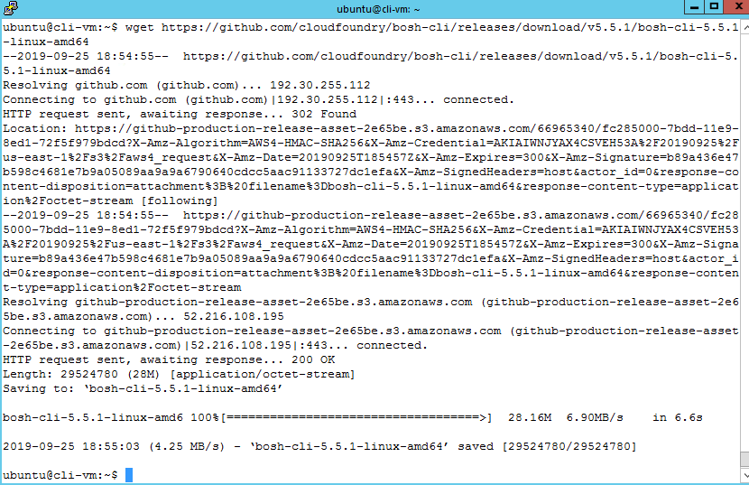
</details>
<br/>

 2.3 Copy the bosh cli binary into `/usr/local/bin/` with file name as `bosh`.  You can run the following commands to copy the binary and make it executable, and verify bosh version.

```
cp bosh-cli-5.5.1-linux-amd64 /usr/local/bin/bosh
chmod 755 /usr/local/bin/bosh
bosh --version
```

<details><summary>Screenshot 2.3</summary>
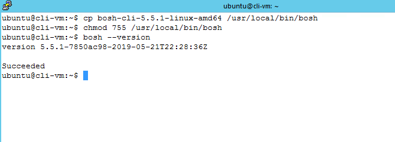
</details>
<br/>

## Step 3: Set up the bosh tunnel

 3.1 From the Ops Manager UI, click the Bosh Director Tile, then click Credentials tab, then click `Link to Credential` of Bosh Commandline Credentials.  The credential page will be loaded.  Copy the value excluding the last word (`bosh`) and then save it somewhere as it will be used in later steps.

<details><summary>Screenshot 3.1.1</summary>
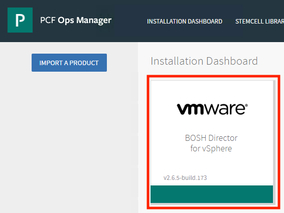
</details>

<details><summary>Screenshot 3.1.2</summary>

</details>

<details><summary>Screenshot 3.1.3</summary>
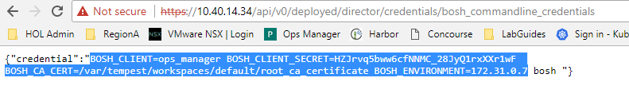
</details>
<br/>


 3.2 From the Ops Manager UI, click `admin` in the upper right corner and then click `Settings` from the drop-down menu.  Then, in the Settings page, click `Advanced Options` and then click `DOWNLOAD ROOT CA CERT`.  This will download a file named `root_ca_certificate` into your Downloads folder.  We will use this file in later steps.

<details><summary>Screenshot 3.2</summary>
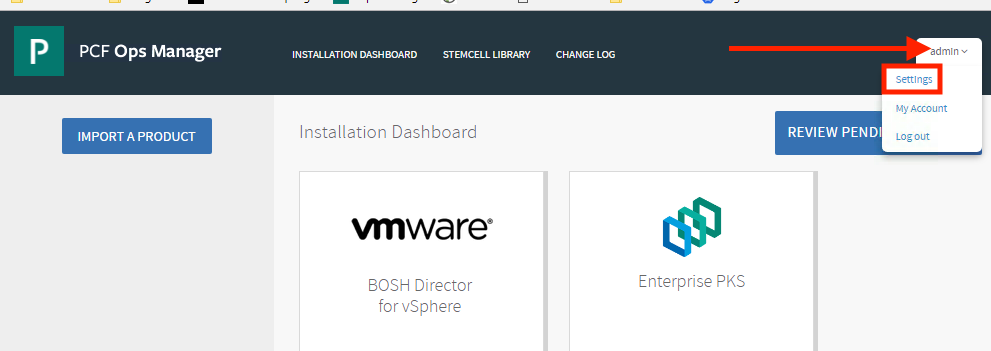
</details>

<details><summary>Screenshot 3.2</summary>
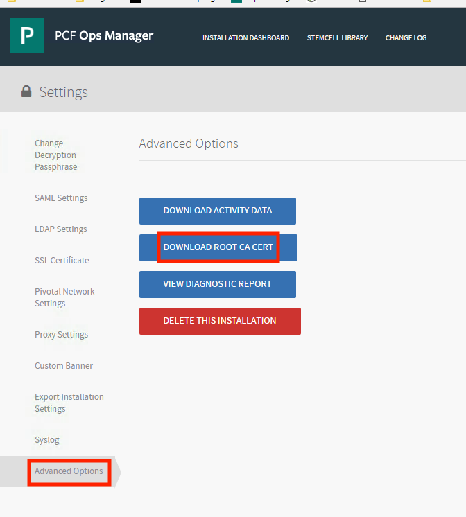
</details>
<br/>

 3.3 Transfer the `root_ca_certificate` into the `cli-vm`.  You can do this by opening the file in Notepad++ and then copying all the contents, and then pasting the contents into a file in `cli-vm`.

<details><summary>Screenshot 3.3.1</summary>
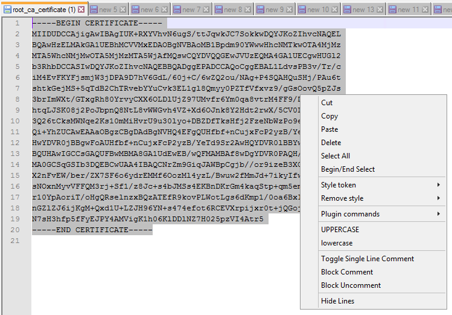
</details>

<details><summary>Screenshot 3.3.2</summary>
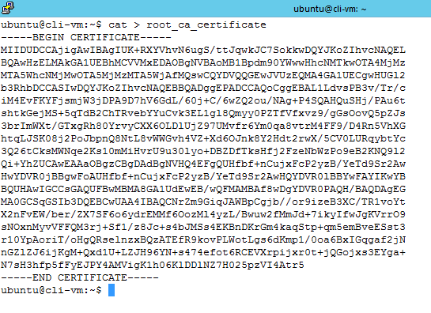
</details>
<br/>

 3.4 In the `cli-vm`, create a file named `env.sh` that will contain all the Bosh environment variables that will be used in the tunnel and environment.  You can run the following commands but make sure you replace the placeholder in the line 3 with the value you get from step 3.1.  See screenshot for more context.

```
cat > env.sh
export BOSH_ALL_PROXY=ssh+socks5://ubuntu@opsman.corp.local:22?private-key=/home/ubuntu/opsman-ssh-key
export <replace with the value you got from step 3.1>
```

<details><summary>Screenshot 3.4</summary>
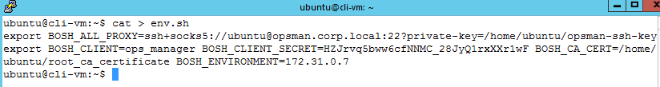
</details>
<br/>

## Step 4: Run bosh commands

 4.1 Source the `env.sh` file to export the needed environment variables.  You can run `source env.sh`.

<details><summary>Screenshot 4.1</summary>
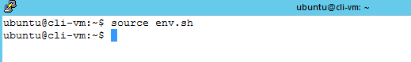
</details>
<br/>

 4.2 You should now be able to run bosh cli commands from the `cli-vm`.  You can run the following bosh commands if you wish:

```
bosh env
bosh vms
bosh instances -p
bosh deployments
bosh deployments --column=name
```

<details><summary>Screenshot 4.2.1</summary>
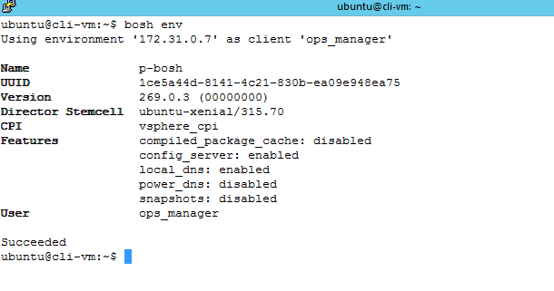
</details>

<details><summary>Screenshot 4.2.2</summary>
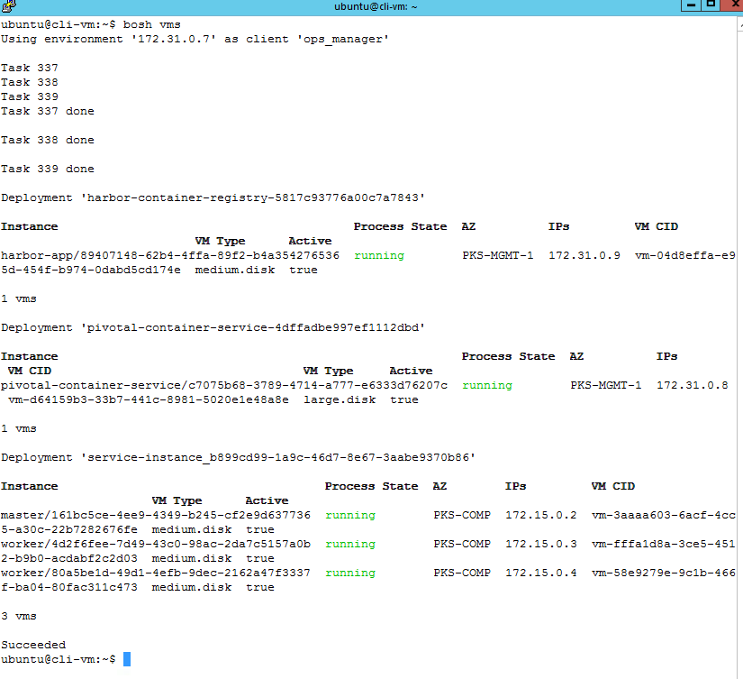
</details>
<br/>

***End of lab***
