# Hands On Intro to Devops & Cloud Native with PKS

## 1.0 Consuming Containerized Applications with Docker

### 1.1 Running Nginx with Docker

In this section you will use docker to run both a default and a customized ngninx server.

1.1.1 From the Main Console (ControlCenter) desktop, open putty and under saved sessions, open a ssh connection to `cli-vm`

<details><summary>Screenshot 1.1.1</summary>

</details>
<br/>

1.1.2 From the `cli-vm` prompt, enter the command `docker run -p 8080:80 --name=my-nginx -d nginx` and observe the command output

<details><summary>Screenshot 1.1.2</summary>

</details>
<br/>

1.1.3 From the `cli-vm` prompt, enter the command `docker ps` and observe the command output

<details><summary>Screenshot 1.1.3</summary>

</details>
<br/>

1.1.4 From the Main Console (ControlCenter) desktop, open the chrome browser and navigate to `http://cli-vm.corp.local:8080/`. Your NGINX Server should now be running

<details><summary>Screenshot 1.1.4</summary>
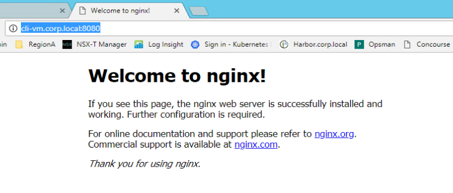
</details>
<br/>

1.1.5 Resume your putty session with `cli-vm` and from the prompt, enter the command `docker exec -it my-nginx /bin/bash` to open a bash shell on your nginx container

<details><summary>Screenshot 1.1.5</summary>
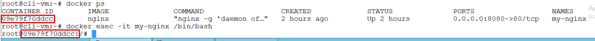
</details>
<br/>

1.1.6 From the prompt, enter the following commands and observe the output

```bash
echo "to be or not to be, that is the question" >> /usr/share/nginx/html/index.html
cat /usr/share/nginx/html/index.html
```

<details><summary>Screenshot 1.1.6</summary>
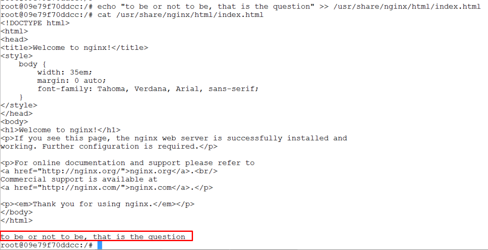
</details>
<br/>

1.1.7 From the prompt, install the curl utility with the following commands - you will use this in the next step to verify your nginx web server response

```bash
curl
apt-get update
apt-get install curl
```

<details><summary>Screenshot 1.1.7</summary>

</details>
<br/>

1.1.8 From the prompt, enter the command `curl http://localhost` verify that your nginx server response includes the additional line of text you added to the index.html file

<details><summary>Screenshot 1.1.8</summary>

</details>
<br/>

1.1.9 From the Main Console (ControlCenter) desktop, resume your chrome browser session with `http://cli-vm.corp.local:8080/` and refresh the page. You should now see the text you added to the index.html file on the page per the screenshot below

<details><summary>Screenshot 1.1.9</summary>
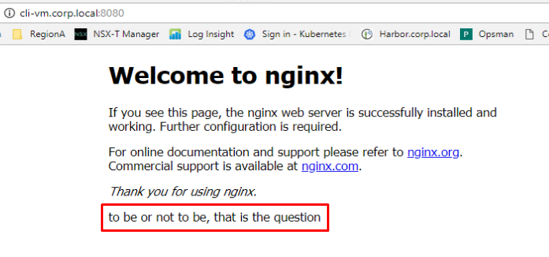
</details>
<br/>

1.1.10 Resume your putty session with `cli-vm`. If you are still logged into the bash prompt for your my-nginx container, enter the `exit` command and ensure you return to the `cli-vm` prompt. Enter the following commands to stop and delete your my-nginx container:

```bash
docker stop my-nginx
docker ps
docker rm my-nginx
```

<details><summary>Screenshot 1.1.10</summary>

</details>
<br/>

1.1.11 From the Main Console (ControlCenter) desktop, open a new tab in the chrome browser and connect to `https://github.com/nginxinc/docker-nginx/blob/master/mainline/alpine-perl/Dockerfile/` to observe a sample dockerfile maintained by the nginx community to build a complete nginx image from the ground up, starting with a minimal alpine container, and then installing only the dependencies and default configurations required to run an nginx server. As you saw earlier in step 1.1.2, you were able to deploy this entire configuration by running the `docker run nginx` command with a few configuration flags. The ability to download a pre-configured image is similar to downloading an ova file, except containerized formats are generally simpler, smaller and faster.

<details><summary>Screenshot 1.1.11</summary>

</details>
<br/>

### 1.2 Create a custom Docker Image

1.2.1 In this step you will create a dockerfile which you will build to create a new nginx container named `custom-nginx` that includes the configuration you created for the `my-nginx` container in the previous steps

Make the `~/custom-nginx` directory and use the nano text editor to create the `~/custom-nginx/dockerfile` file with the following commands:

```bash
mkdir ~/custom-nginx
cd ~/custom-nginx
nano dockerfile
```

In the nano text editor, enter or copy and paste the following text:

```text
FROM nginx

RUN apt-get update
RUN apt-get install -y curl
RUN echo 'to be or not to be, that is the question' >> /usr/share/nginx/html/index.html
```

Press the `ctrl + o` keys and hit the `Enter` key to save the file, and then press `ctrl + x` keys to exit nano

<details><summary>Screenshot 1.2.1.1</summary>

</details>

<details><summary>Screenshot 1.2.1.2</summary>

</details>
<br/>

1.2.3 From the `cli-vm` prompt, enter the command `docker build . -t custom-nginx-image` to build an image using the dockerfile you created in the previous step, using the `-t` flag to tag the image with the name `custom-nginx-image`. 

Observe that in the output, the docker build process will go through each of the commands in the dockerfile you created in the previous step, as shown in the following screenshot

<details><summary>Screenshot 1.2.3</summary>


***Output Abbreviated for Brevity***

</details>
<br/>

1.2.4 From the `cli-vm` prompt, enter the command `docker images` and observe that you can see the `custom-nginx-image` you just created

<details><summary>Screenshot 1.2.4</summary>
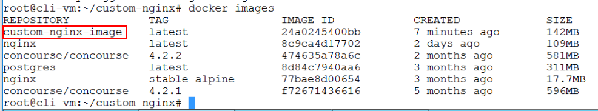
</details>
<br/>

1.2.5 From the `cli-vm` prompt, enter the command `docker run -p 8080:80 --name=custom-nginx -d custom-nginx-image` to start a new container named `custom-nginx` based on the `custom-nginx-image` you created in the previous steps, and enter the command `docker ps` to confirm the container is running

<details><summary>Screenshot 1.2.5</summary>

</details>
<br/>

1.2.6 From the `cli-vm` prompt, verify that your new image includes the curl utility, and that your nginx server is serving your modified index.html page with the following commands:

```bash
docker exec -it custom-nginx /bin/bash
curl http://localhost
```

As the output validates, the `custom-nginx-image` container image includes the curl utility and custom nginx configuration you specified in the dockerfile you created

<details><summary>Screenshot 1.2.6</summary>
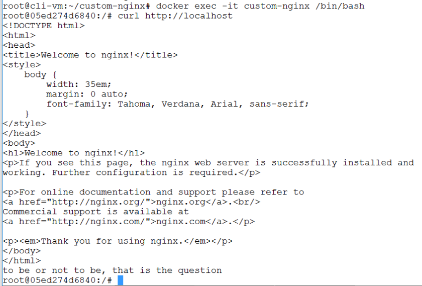
</details>
<br/>

1.2.7 Resume your putty session with `cli-vm`. If you are still logged into the bash prompt for your my-nginx container, enter the `exit` command and ensure you return to the `cli-vm` prompt. From the `cli-vm` prompt, stop your `custom-nginx` container with the command `docker stop custom-nginx`, and verify your container has stopped with the `docker ps` command

<details><summary>Screenshot 1.2.7</summary>

</details>
<br/>

### 1.3 Distributing your images with docker hub

1.3.1 From the Main Console (ControlCenter) desktop, open a new tab in the chrome browser and connect to `https://hub.docker.com/` and login. If you do not have a docker hub account, create one now.

Once you are logged into docker hub, click the `Create Repository +` link, and create a new repository with the following values:

- Name: `custom-nginx-image`
- Visibility: `Public`
- click `Create` to create the repository

<details><summary>Screenshot 1.3.1.1</summary>

</details>

<details><summary>Screenshot 1.3.1.2</summary>

</details>

<details><summary>Screenshot 1.3.1.3</summary>
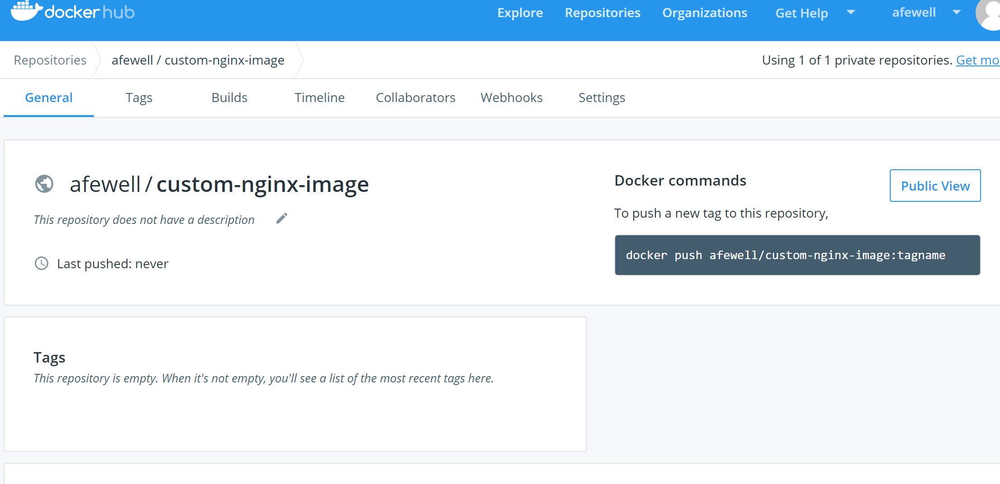
</details>
<br/>

1.3.2 Resume your putty session with `cli-vm`, from the prompt, add a tag to your `custom-nginx-image` to prepare it for upload, and then push your image to the new repository you created on docker hub with the following commands:

**Note: Be sure to replace the string `YourDockerhubUsername` in the command below with your docker hub username**

```bash
docker tag custom-nginx-image YourDockerhubUsername/custom-nginx-image:v1
docker login #follow the prompts to log into your docker account
docker push YourDockerhubUsername/custom-nginx-image:v1
```

<details><summary>Screenshot 1.3.2</summary>

</details>
<br/>

1.3.3 From the Main Console (ControlCenter) desktop, resume your chrome browser connection `https://hub.docker.com/`, return to your `custom-nginx-image` repository page, and observe that the image you uploaded with the `v1` tag is now available in the repository. As this is a public repo, you can now use this repository to distribute your custom image to any docker client with access to docker hub.

<details><summary>Screenshot 1.3.3</summary>
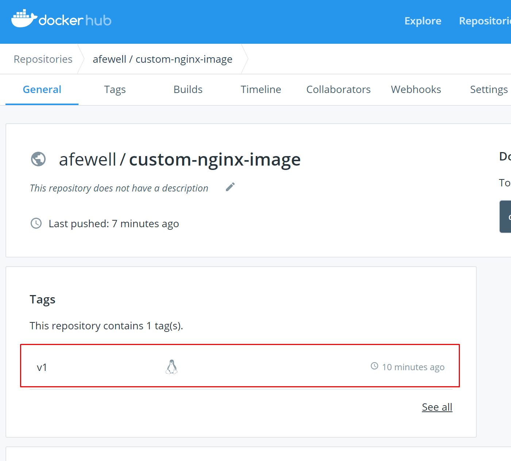
</details>
<br/>

1.3.4 Delete the local copies of your `custom-nginx-image` with the following commands:

**Note: Be sure to replace the string `YourDockerhubUsername` in the command below with your docker hub username**

```bash
docker images
docker rmi -f YourDockerhubUsername/custom-nginx-image:v1
docker rmi -f custom-nginx-image
docker images
docker rm custom-nginx
docker ps -a
```

<details><summary>Screenshot 1.3.4</summary>


</details>
<br/>

1.3.5 Enter the command `docker run -p 8080:80 --name=custom-nginx -d YourDockerhubUsername/custom-nginx-image:v1` which will first check to see if your custom image is in your local docker cache, and since it is not will search the default search location (docker hub), pull the image to the local image cache, and run a container from the image.

**Note: Be sure to replace the string `YourDockerhubUsername` in the `docker run` command with your docker hub username**

<details><summary>Screenshot 1.3.5</summary>
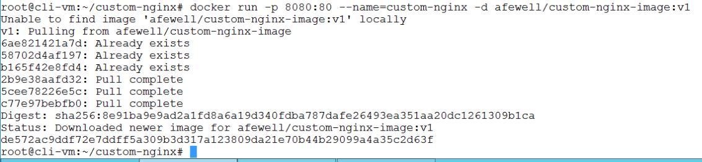
</details>
<br/>

1.3.6 Confirm that your `custom-nginx-image` that you pulled from docker hub is working as expected, and clean up your environment with the following commands:

**Note: Be sure to replace the string `YourDockerhubUsername` in the command below with your docker hub username**

```bash
docker ps
docker exec -it custom-nginx /bin/bash
curl http://localhost
exit
docker stop custom-nginx
```

<details><summary>Screenshot 1.3.6</summary>

</details>
<br/>

### 1.4 Consuming containerized applications from github

A large number of popular applications are hosted on github, many of which are well maintained by vendors or communities. End users can utilize popular github repositories to access a broad array of software and put it to use to provide value for organizational or personal projects

1.4.1 From the `cli-vm` prompt, enter the following commands to clone the planespotter application files from github.com to a local directory:

*Note: you can view the planespotter repository in a browser at [https://github.com/CNA-Tech/planespotter](https://github.com/CNA-Tech/planespotter)*

```bash
mkdir ~/cloned
cd ~cloned
git clone https://github.com/CNA-Tech/planespotter.git
```

<details><summary>Screenshot 1.4.1</summary>
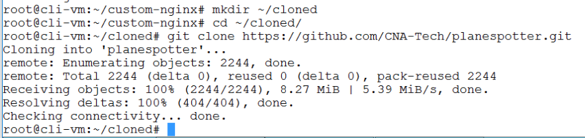
</details>
<br/>

1.4.2 Navigate to the subdirectory for the planespotter frontend application, which provides the files to build a custom nginx based frontend for the planespotter app, and review the Dockerfile for the frontend app with the following commands:

```bash
cd ~/cloned
ls planespotter/
cd planespotter/frontend
ls
cat dockerfile
```

<details><summary>Screenshot 1.4.2</summary>

</details>
<br/>

1.4.3 From the `cli-vm` prompt, build the planespotter frontend container image and tag it with the name `planespotter-frontend` with the command `docker build . -t planespotter-frontend`

<details><summary>Screenshot 1.4.3</summary>
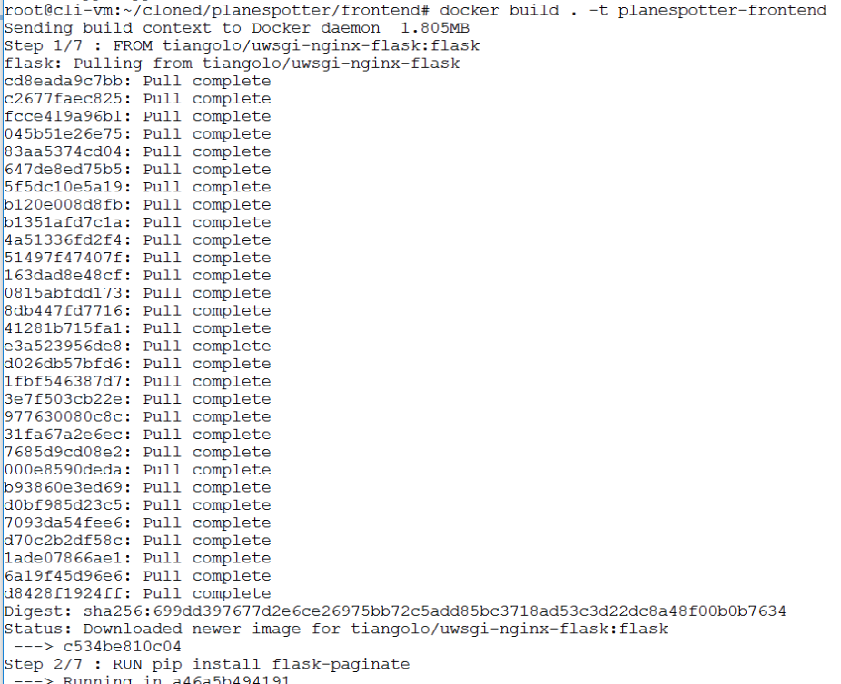

***Output Abbreviated for Brevity***

</details>
<br/>

1.4.4 Run the planespotter-frontend server with the command `docker run -p 8080:80 --name=planespotter-frontend-container -d planespotter-frontend` and verify it is running with the `docker ps` command.

<details><summary>Screenshot 1.4.4</summary>

</details>
<br/>

1.4.5 From the Main Console (ControlCenter) desktop, open a chrome browser session with `http://cli-vm.corp.local:8080/` and refresh the page. You should now see the planesotter frontend page.

<details><summary>Screenshot 1.4.5</summary>
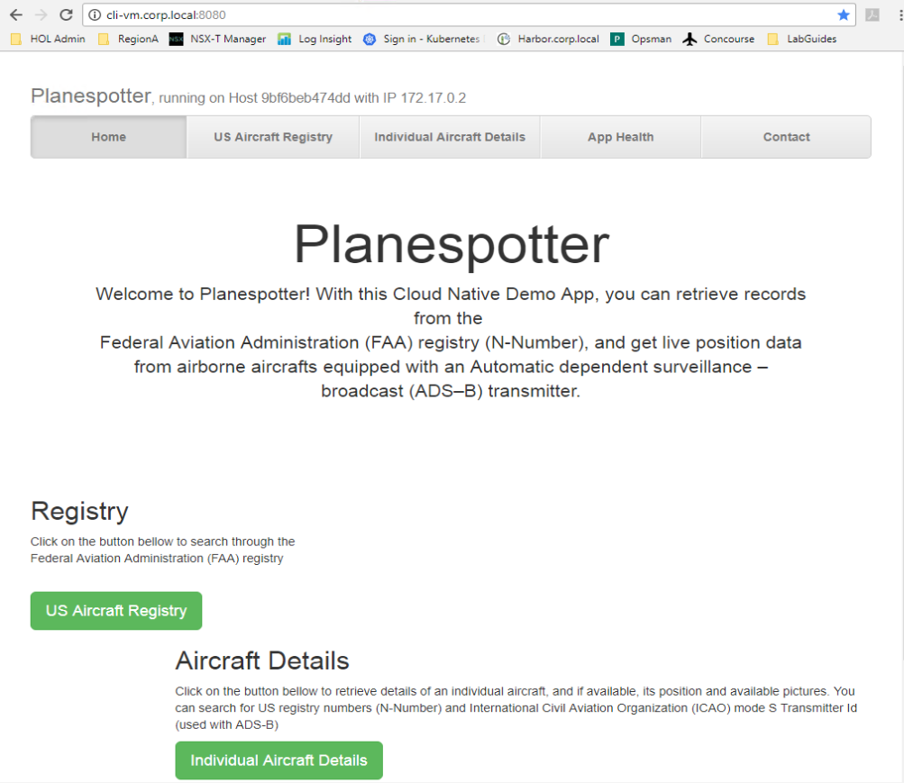
</details>
<br/>

1.4.6 Enter the following commands to clean up your `planespotter-frontend` containers in preparation for the following exercises

```bash
docker stop planespotter-frontend-container
docker rm planespotter-frontend-container
docker rmi -f planespotter-frontend
docker ps -a
docker images
```

<details><summary>Screenshot 1.4.6</summary>
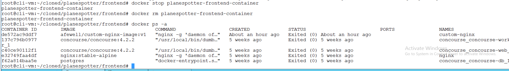
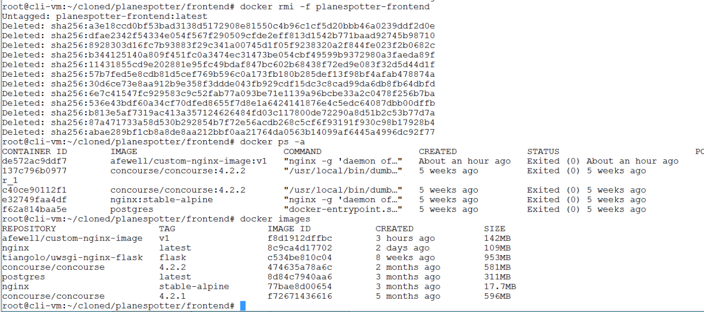
</details>
<br/>

## 2.0  Consuming Containerized and Cloud Native Applications with Kubernetes

### 2.1 Review Planespotter Frontend Kubernetes Deployment

2.1.1 Resume your ssh session with `cli-vm` and from the prompt, enter the following commands to review the kubernetes manifest for the planespotter frontend application and edit the file to change the ingress host value from `planespotter.demo.yves.local` to `planespotter.corp.local` as shown in the following screenshot:

```bash
cd ~/cloned/planespotter/kubernetes/
nano frontend-deployment_all_k8s.yaml
```

<details><summary>Screenshot 2.1.1</summary>
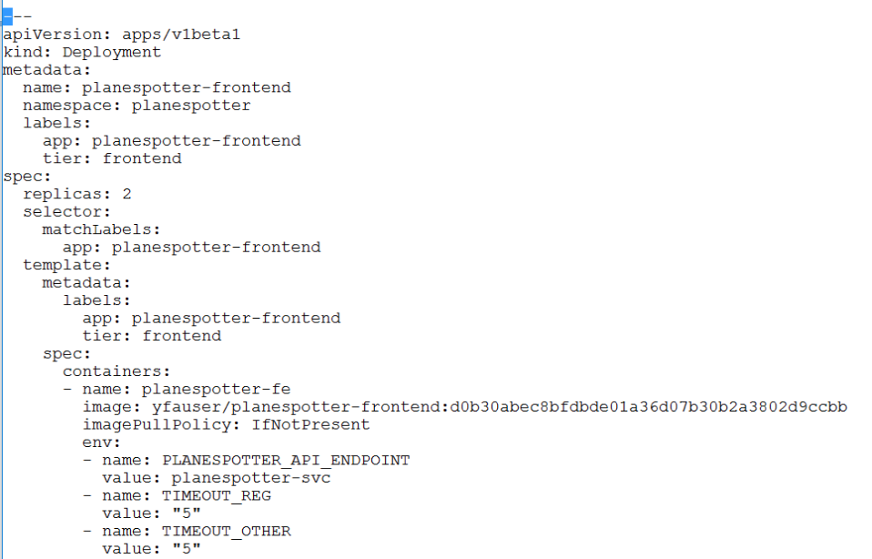
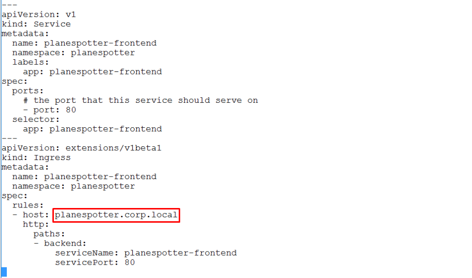
</details>
<br/>

2.1.2 Resume your ssh session with `cli-vm` and from the prompt, enter the following commands to deploy the planespotter frontend application using its kubernetes manifest:

```bash
pks login -a pks.corp.local -u pksadmin -k -p VMware1!
pks get-credentials my-cluster
kubectl create ns planespotter
kubectl config set-context my-cluster --namespace planespotter
kubectl create -f frontend-deployment_all_k8s.yaml
```

<details><summary>Screenshot 2.1.2</summary>

</details>
<br/>

2.1.3 Review the objects created by the planespotter `frontend-deployment_all_k8s.yaml` manifest with the following commands:

```bash
kubectl get ns
kubectl get deployments
kubectl get pods
kubectl get services
kubectl get ingress
```

Gather the ip address shown in the output of the `kubectl get ingress` command as shown in the screenshot below. The address in the screenshot below is `10.40.14.36`, the ip address of your ingress service may be different but should still be in the 10.40.14.x/24 subnet, if the ip address for your ingress is different, please use the ip address from your environment in the next step.

<details><summary>Screenshot 2.1.3</summary>

</details>
<br/>

2.1.4 From the Main Console (ControlCenter) desktop, click the windows button, enter the value `dns` in the search box, and select the top result `DNS` as shown in the following screenshot to open DNS Manager.

<details><summary>Screenshot 2.1.4</summary>

</details>
<br/>

2.1.5 In DNS Manager, expand `ControlCenter > Forward Lookup Zones`, right click on `corp.local`, and select `New Host (A or AAAA)...`

<details><summary>Screenshot 2.1.5</summary>

</details>
<br/>

2.1.6 In the `New Host` window, enter the following values to create an dns A record for planespotter.corp.local:

- Name: `planespotter`
- *Please be sure to use the ip address from your deployment from the output of `kubectl get ingress` in the preceeding steps*
- IP Address: `10.40.14.36`
- Uncheck `Create associated pointer (PTR) record
- Click `Add Host` to add the new dns record for `planespotter.corp.local`

<details><summary>Screenshot 2.1.6</summary>

</details>

2.1.7 From the Main Console (ControlCenter) desktop, open a https browser session to `http://planespotter.corp.local` to see the planespotter frontend page.

<details><summary>Screenshot 2.1.4.2</summary>

</details>
<br/>

### 2.2 Deploy the complete planespotter application with Kubernetes

In addition to the frontend app, planespotter has 3 additional microservice applications that must be deployed to enable the complete planespotter application features. In this section, you will execute the additional commands required to deploy the remaining planespotter components, review the objects created to support the deployement, and review the planespotter application to validate its successful deployment and operation.

2.2.1 Resume your ssh session with `cli-vm` and from the prompt, enter the following commands to deploy the remaining components in the planespotter application:

```bash
cd ~/cloned/planespotter/kubernetes
kubectl create -f storage_class.yaml
kubectl create -f mysql_claim.yaml
kubectl create -f mysql_pod.yaml
kubectl create -f app-server-deployment_all_k8s.yaml
kubectl create -f redis_and_adsb_sync_all_k8s.yaml
```

<details><summary>Screenshot 2.2.1</summary>
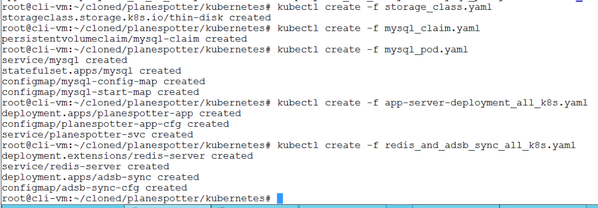
</details>
<br/>

2.2.2 Review the objects created by the planespotter manifests with the following commands:

```bash
kubectl get pvc
kubectl get deployments
kubectl get pods
kubectl get services
kubectl get ingress
```

<details><summary>Screenshot 2.2.2</summary>

</details>
<br/>

2.2.3 From the Main Console (ControlCenter) desktop, open a https browser session to `http://planespotter.corp.local` to see the fully functional planespotter web app, click around on the various links to explore

<details><summary>Screenshot 2.2.3.1</summary>

</details>

<details><summary>Screenshot 2.2.3.2</summary>
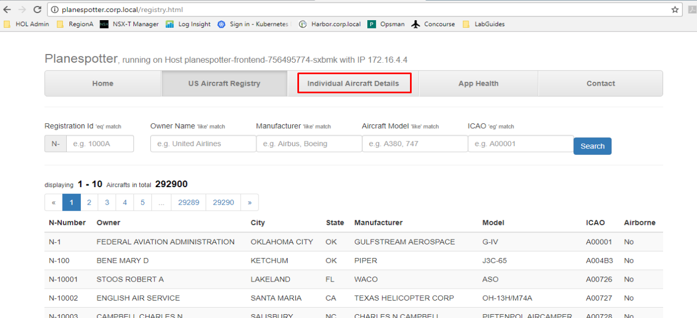
</details>

<details><summary>Screenshot 2.2.3.3</summary>
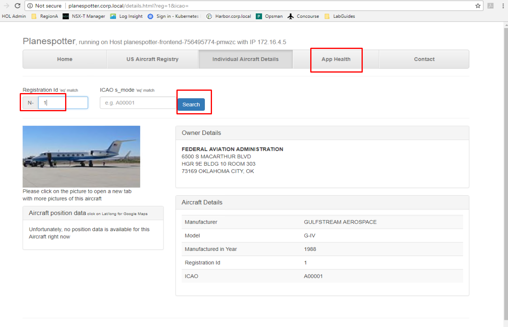
</details>

<details><summary>Screenshot 2.2.3.4</summary>

</details>
<br/>

2.2.4 Resume your ssh session with `cli-vm` and from the prompt, enter the following commands to clean up the planespotter application deployment in preparation for the subsequent exercises:

```bash
cd ~/cloned/planespotter/kubernetes
kubectl delete -f frontend-deployment_all_k8s.yaml
kubectl delete -f mysql_pod.yaml
kubectl delete -f storage_class.yaml
kubectl delete -f mysql_claim.yaml
kubectl delete -f app-server-deployment_all_k8s.yaml
kubectl delete -f redis_and_adsb_sync_all_k8s.yaml
kubectl delete ns planespotter
```

<details><summary>Screenshot 2.2.4</summary>
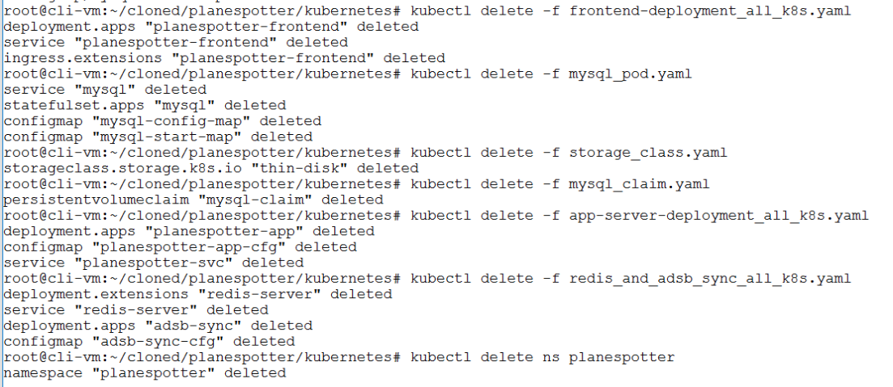
</details>
<br/>

#### 2.3 Deploying Kubernetes Applications with Helm

Please complete the [Introduction to Helm](https://github.com/CNA-Tech/PKS-Ninja/tree/Pks1.4/LabGuides/IntroToHelm-HE4490) lab to satisfy the requirements for this section.

**Thank you for completing the Hands On Intro to Devops & Cloud Native with PKS Lab!**
