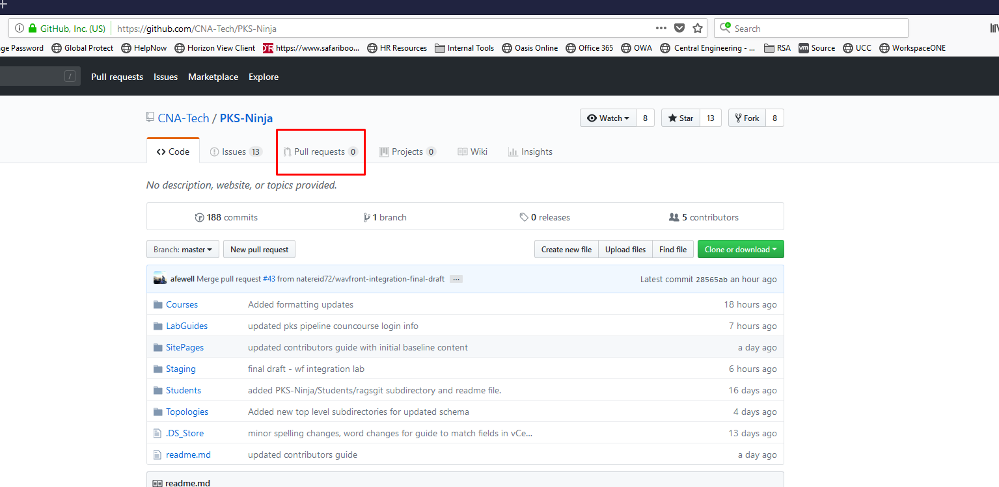
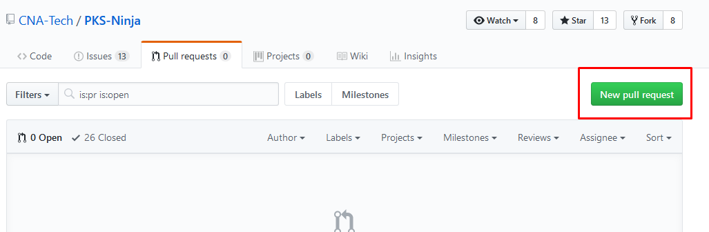
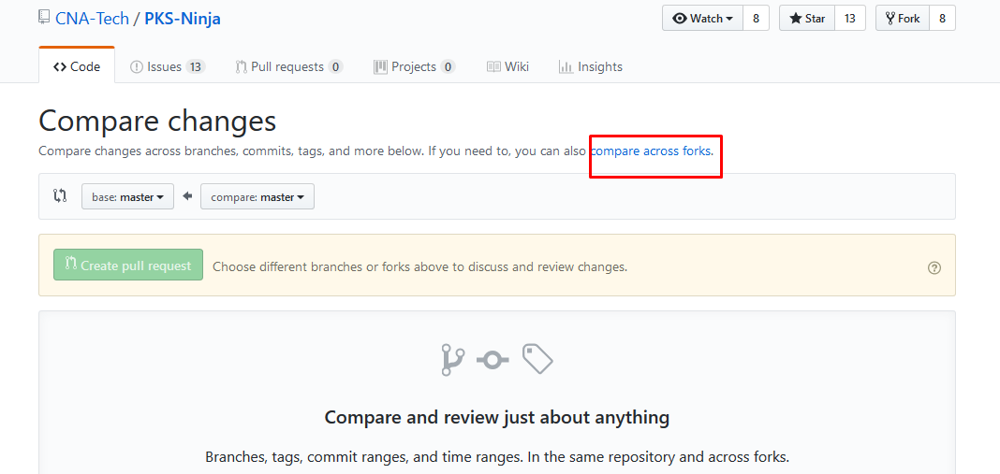

# Setting up your Contributor Repository

## Prerequisites

Before proceeding with this guide, please complete the [Community Getting Started Guide](https://github.com/CNA-Tech/PKS-Ninja/tree/master/Courses/GettingStarted-GS3861), most importantly the [Creating Your Student Folder](https://github.com/CNA-Tech/PKS-Ninja/tree/master/LabGuides/CreateStudentFolder-SF6361) lab guide. Also please be sure to review the [Contributors Guide](https://github.com/CNA-Tech/PKS-Ninja/tree/master/Courses/ContributorsGuide-CG2415)

The steps you take to create your student folder are the same steps you will take to create your contributor repository, with the main exception that you will use your contributor repository to make changes to existing content or add new content on the official PKS Ninja repo

With your student folder you still go through the same process for forking and pull requests, but because each student only commits updates to their own folder, it is an optimal experience for new students or any community member that wants to test a commit in their own student folder before directly updating a community page

You do not need to have much git experience to commit simple updates to the pks-ninja repo, but if you have never done a pull request before, please do so with your student folder first before attempting to make a pull request for the pks-ninja repo

## Introduction

Contributing to the PKS-Ninja repository uses the same git pull request process that is the standard model for contributing to most open source and private cloud native development projects

This pull request process, which is detailed in the instructions below, starts by making a fork of the pks-ninja repository, which creates a copy of the repository on the github account you are logged in with when you create the fork

If you are new to git, this process may seem intimidating at first, but if you follow the detailed instructions it should be a very straightforward process, and once you have done it a few times it will become very comfortable and familiar

While cloning a git repository downloads a copy of it to your local system, a fork makes an online copy of the source repository on your github account with the format `www.github.com/{your github ID}/{Name of repo you are forking}`

After you have forked the repo, you will clone your fork to download a copy of your fork to the `cli-vm` local filesystem, and configure the local git settings so your fork is set with the official pks-ninja as its upstream. This allows you to keep your fork in sync with the official repo

You can then make edits to your forked repository directly in the same way you would to any of your own repos, the forked copy is your personal copy

Once you have made updates to your copy of the repository, you will open a pull request on the official PKS repository to pull the changes from your fork into the master repository

## 1.0 One-Time Setup Instructions

Most of the setup steps only need to be done one time, it is important to note that when you first fork the repo, you get a copy of the latest updates, but at any subsequent time you want to make updates you will need to follow the steps in the [Keeping your fork up to date]() section below

1.1 From the control center desktop, open a web browser, log into your github.com account and from the same tab, navigate to the PKS Ninja Repo at [https://github.com/cna-tech/pks-ninja](https://github.com/cna-tech/pks-ninja). Click the `Fork` button on the upper right hand corner of the page as shown in the screenshot below

<details><summary>Screenshot 1.1</summary>

</details>
<br/>

1.2 After the fork is completed, your browser will be redirected to the github page for your new forked repo. Click the `Clone or download' link and copy the url as shown in the screenshot below. Please be sure to go to the URL of your github account and not the example shown in the screenshot, which is an example using the course author's github account

<details><summary>Screenshot 1.2</summary>

</details>
<br/>

1.3 From the control center destop use putty to connect to `cli-vm` and enter the following commands to clone your forked version of the pks-ninja repository to cli-vm

Note: Be sure to replace the URL in the `git clone` command with the URL of your fork of the PKS-Ninja repo

```bash
mkdir ~/Forked
cd ~/Forked
git clone https://github.com/{yourAccountName}/PKS-Ninja.git # replace this url with the url to your fork of the PKS-Ninja repo
cd PKS-Ninja
```

<details><summary>Screenshot 1.3</summary>


</details>
<br/>

1.4 From the `cli-vm` prompt ensure you are in the `/root/Forked/PKS-Ninja` directory with the command `pwd`, then connect your forked clone back to the source PKS-Ninja repository with the command `git remote add upstream https://github.com/CNA-Tech/PKS-Ninja.git`, and finally, validate the upstream configuration with the command `git remote -v`

<details><summary>Screenshot 1.4</summary>

</details>
<br/>

**You have now completed the one-time setup steps. Please proceed through the following steps to ensure your local copy is up-to-date with the latest updates to the official pks-ninja repo before you make any edits or updates to your fork**

## 2.0 Keeping your Fork up to date and executing pull requests

Whenever you start working on any update you would like to submit to the PKS-Ninja repo, you will first want to ensure your fork is up to date with the official repo. If you start making updates without first syncing, you may include outdated content in your updates, which may need to be rejected if they cause conflicts

Another essential factor is making sure you keep your commits small and frequent, and do pull requests frequently. This will help prevent conflicts and ensure your updates are processed as smoothly as possible

To keep your fork in sync with the official repo, you will login to the clone of your fork that you downloaded the your local filesystem in the previous section. You will update your local clone from the upstream offical pks-ninja repo, and then commit and push any updates from your local cone to your fork on github

2.1 From the `cli-vm` prompt, enter the following commands to pull down the latest updates from the official pks-ninja repo and then merge them into your local clone of your fork

```bash
cd ~/Forked/PKS-Ninja/
git remote add upstream https://github.com/CNA-Tech/PKS-Ninja.git
git fetch upstream # This command pulls down the latest updates from the upstream repo 
git merge upstream/master # This command merges any updates from the upstream repo into your local clone of your fork
git add . # Adds any files in your local clone of the repo that you have updated to staging so they get commited in the following command
git commit -m "syncing fork with upstream/master"
git push #follow the prompts to login and push any needed updates to your fork
```

2.2 After you make any updates to your local clone of your fork of the pks-ninja repo and commit and push the updates to your fork, check on your github,com/{your github id}/pks-ninja site to ensure that your expected changes are visible on your fork

2.3 Next, go the the https://github.com/CNA-Tech/PKS-Ninja website, click on the pull request tab and select `New pull request`

<details><summary>Screenshot 2.3.1</summary>

</details>

<details><summary>Screenshot 2.3.2</summary>

</details>
<br/>

2.4 On the line beneath `Compare Changes` click on `compare across forks`

<details><summary>Screenshot 2.4</summary>

</details>
<br/>

2.5 With this request, you are trying to update the offical CNA-Tech/PKS-Ninja repo with updates from your fork. Accordingly the `base fork` should be set to `CNA-Tech/PKS-Ninja`, and the `head fork` should be set to `{your github id}/PKS-Ninja`, follow the remaining steps to complete the merge request

### You now know how to contribute to CNABU, VMware and other Github repos, we need your contribution to build the best learning community we can! Using the fork/pull request process you executed in the above steps, you could even post updates as simple as correcting a typo you find on a page or making bigger contributions! We can definitely use your help and look forward to growing VMware CNA learning communities together!

### Thank you for completing the PKS Ninja Intro to Git lab!
