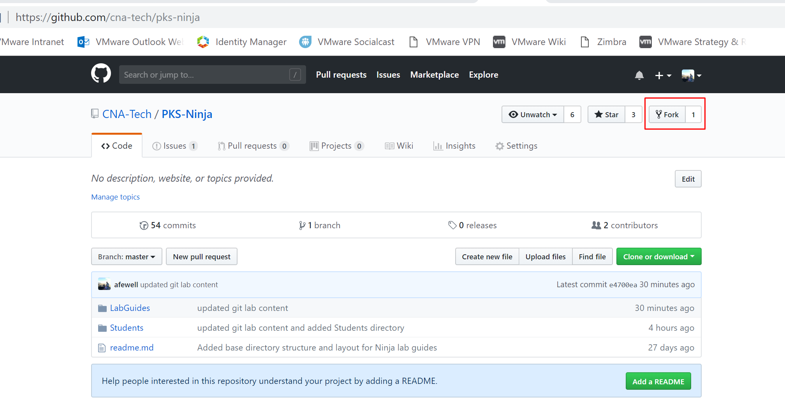
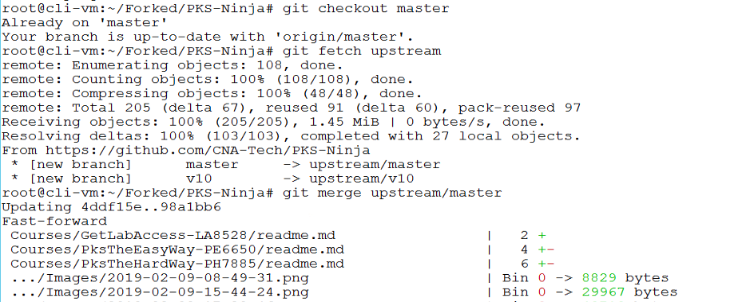
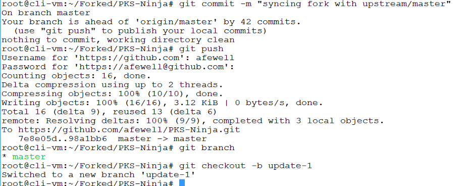
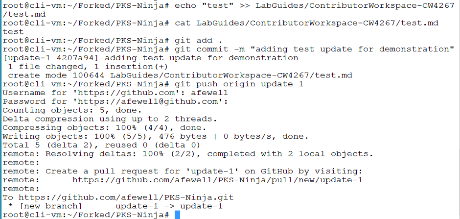
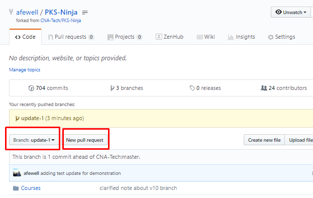
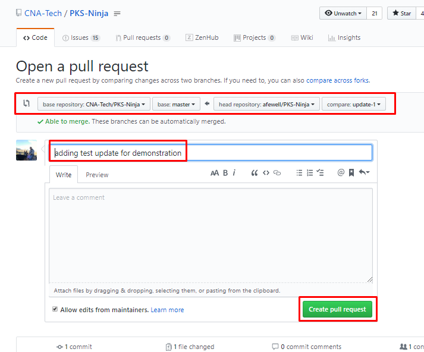
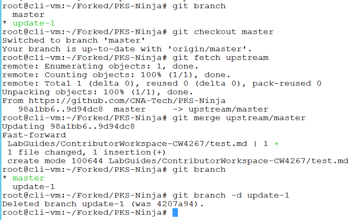

# Setting up your Contributor Repository

## Prerequisites

Before proceeding with this guide, please complete the [Community Getting Started Guide](https://github.com/CNA-Tech/PKS-Ninja/tree/Pks1.4/Courses/GettingStarted-GS3861), most importantly the [Creating Your Student Folder](https://github.com/CNA-Tech/PKS-Ninja/tree/Pks1.4/LabGuides/CreateStudentFolder-SF6361) lab guide. Also please be sure to review the [Contributors Guide](https://github.com/CNA-Tech/PKS-Ninja/tree/Pks1.4/Courses/ContributorsGuide-CG2415)

The steps you take to create your student folder are the same steps you will take to create your contributor repository, with the main exception that you will use your contributor repository to make changes to existing content or add new content on the official PKS Ninja repo

With your student folder you still go through the same process for forking and pull requests, but because each student only commits updates to their own folder, it is an optimal experience for new students or any community member that wants to test a commit in their own student folder before directly updating a community page

You do not need to have much git experience to commit simple updates to the pks-ninja repo, but if you have never done a complete pull request before, please do so with your student folder first before attempting to make a pull request for the pks-ninja repo

## Introduction

Contributing to the PKS-Ninja repository uses the same git pull request process that is the standard model for contributing to most open source and private cloud native development projects

If you are new to the pull request process, please complete the [Creating Your Student Folder](https://github.com/CNA-Tech/PKS-Ninja/tree/Pks1.4/LabGuides/CreateStudentFolder-SF6361) lab guide and reference this guide as needed for additional detail in understanging the pull request process.

## 1.0 One-Time Setup Instructions

Most of the setup steps only need to be done one time, it is important to note that when you first fork the repo, you get a copy of the latest updates, but at any subsequent time you want to make updates you will need to follow the steps in the [Keeping your fork up to date](#20-keeping-your-fork-up-to-date-and-executing-pull-requests) section below

1.1 From the control center desktop, open a web browser, log into your github.com account and from the same tab, navigate to the PKS Ninja Repo at [https://github.com/cna-tech/pks-ninja](https://github.com/cna-tech/pks-ninja). Click the `Fork` button on the upper right hand corner of the page as shown in the screenshot below

<details><summary>Screenshot 1.1</summary>

</details>
<br/>

1.2 After the fork is completed, your browser will be redirected to the github page for your new forked repo. Click the `Clone or download' link and copy the url as shown in the screenshot below. Please be sure to go to the URL of your github account and not the example shown in the screenshot, which is an example using the course author's github account

<details><summary>Screenshot 1.2</summary>

</details>
<br/>

1.3 From the control center destop use putty to connect to `cli-vm` and enter the following commands to clone your forked version of the pks-ninja repository to cli-vm

Note: Be sure to replace the URL in the `git clone` command with the URL of your fork of the PKS-Ninja repo

```bash
mkdir ~/Forked
cd ~/Forked
git clone https://github.com/{yourAccountName}/PKS-Ninja.git # replace this url with the url to your fork of the PKS-Ninja repo
cd PKS-Ninja
```

<details><summary>Screenshot 1.3</summary>


</details>
<br/>

1.4 From the `cli-vm` prompt ensure you are in the `~/Forked/PKS-Ninja` directory, then connect your forked clone back to the source PKS-Ninja repository with the command `git remote add upstream https://github.com/CNA-Tech/PKS-Ninja.git`, and finally, validate the upstream configuration with the command `git remote -v`

<details><summary>Screenshot 1.4</summary>

</details>
<br/>

**You have now completed the one-time setup steps. Please proceed through the following steps to ensure your local copy is up-to-date with the latest updates to the official pks-ninja repo before you make any edits or updates to your fork**

## 2.0 Keeping your Fork up to date and executing pull requests

Whenever you start working on any update you would like to submit to the PKS-Ninja repo, you will first want to ensure your fork is up to date with the official repo. If you start making updates without first syncing, you may include outdated content in your updates, which may need to be rejected if they cause conflicts

Another essential factor is making sure you keep your commits small and frequent, and do pull requests frequently. This will help prevent conflicts and ensure your updates are processed as smoothly as possible

To keep your fork in sync with the official repo, you will login to the clone of your fork that you downloaded the your local filesystem in the previous section. You will update your local clone from the upstream offical pks-ninja repo, and then commit and push any updates from your local cone to your fork on github

2.1 From the `cli-vm` prompt, enter the following commands to pull down the latest updates from the upstream CNA-Tech/PKS-Ninja repo and then merge them into your local clone of your fork. Normally you will follow these exact steps including the commit step even if you havent made any local changes as this will ensure that any updates you download from the upstream master get pushed back into your fork on github, otherwise your fork on github will remain out of sync. Then create and checkout a branch for the updates you would like to make.

```bash
cd ~/Forked/PKS-Ninja/
git checkout master #ensure you are on the master branch
git fetch upstream # This command pulls down the latest updates from the upstream repo
git merge upstream/master # This command merges any updates from the upstream repo into the master of your local clone of your fork
git commit -m "syncing fork with upstream/master"
git push #follow the prompts to login and push any needed updates to your fork
git branch
git checkout -b update-1 #creates and switches the local context to the update-1 branch
```

<details><summary>Screenshot 2.1</summary>


</details>
<br/>

2.2 If you have any additional updates to make to files you want in your student directory,  make and save the any local file changes and then enter the following commands to push the additional updates to your fork.

```bash
git add . # Adds any files in your local clone of the repo that you have updated to staging so they get commited in the following command
git commit -m "type a relevant message desribing your update here"
git push origin update-1 #follow the prompts to login and push any needed updates to your fork
```

<details><summary>Screenshot 2.2</summary>

</details>
<br/>

2.3 Next, go the the https://github.com/yourGithubUsername/PKS-Ninja website be sure to replace yourGithubUsername in the url, click the `Branch:` pulldown menu and select the `update-1` branch, wait for the page to load the update-1 branch and click on `New pull request`

<details><summary>Screenshot 2.3</summary>

</details>
<br/>

2.4 On the `Open a pull request` page verify the request has the base set to CNA-Tech/PKS-Ninja: master and the head is set to yourGithubUsername/PKS-Ninja: update-1 as shown in the following screenshot, ensure you enter a comment and click `Create pull request`

<details><summary>Screenshot 2.4</summary>

</details>
<br/>

2.5 After an admin approves and merges your pull request you should recieve an email to the address associated with your github account similar to the screenshot below. Click on the PR number as highlighted in the image below to be directed to the page for the pull request

<details><summary>Screenshot 2.5</summary>

</details>
<br/>

2.6 If your pull request is accepted, you should see a screen similar to the screenshot below. Observe that there is a button that allows you to delete the update branch you used on your fork as the source of the pull request

Deleting your update branch after an update is accepted is a good practice, but whether you do this or not can depend on the specific processes of the project you are working on or your personal preferred workflow.

Unless you are already a git expert or are following requirements for another project, it is a good practice to us the method as shown in the steps above.

Click `Delete branch` to delete the `yourGithubUsername:update-1` branch

<details><summary>Screenshot 2.6</summary>

</details>
<br/>

2.7 From the `cli-vm` prompt ensure you are in the `~/Forked/PKS-Ninja` directory and enter the following commands to fetch and then merge the latest updates from the upstream repository (CNA-Tech/PKS-Ninja: master) to the local clone of your fork. Delete the update-1 branch from your local clone.

```bash
git branch #observe that while you deleted your branch from your fork, it is still present in your local clone
git checkout master
git fetch upstream #this downloads the latest updates from the upstream but does not merge or apply them into your local branches
git merge upstream/master #this merges the latest updates from the upstream CNA-Tech/PKS-Ninja repo master branch into the master branch of your local clone to bring it up to date
git branch #observe that merging the lastest updates to upstream does not automatically delete your local branches
git branch -d update-1
```

<details><summary>Screenshot 2.7</summary>

</details>
<br/>

2.8 From the `cli-vm` prompt ensure you are in the `~/Forked/PKS-Ninja` directory and enter the following commands to push the updates you just merged from upstream back to your origin fork on github, this will update your github fork of the PKS-Ninja repo with upstream

```bash
git commit -m "syncing fork with upstream/master"
git push #enter your username and password as prompted
```

<details><summary>Screenshot 2.8</summary>

</details>
<br/>

**You now know how to contribute to CNABU, VMware and other Github repos, we need your contribution to build the best learning community we can! Using the fork/pull request process you executed in the above steps, you could even post updates as simple as correcting a typo you find on a page or making bigger contributions! We can definitely use your help and look forward to growing VMware CNA learning communities together!**

**Thank you for completing the PKS Ninja Intro to Git lab!**
