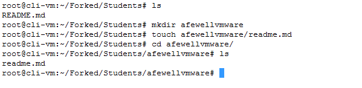
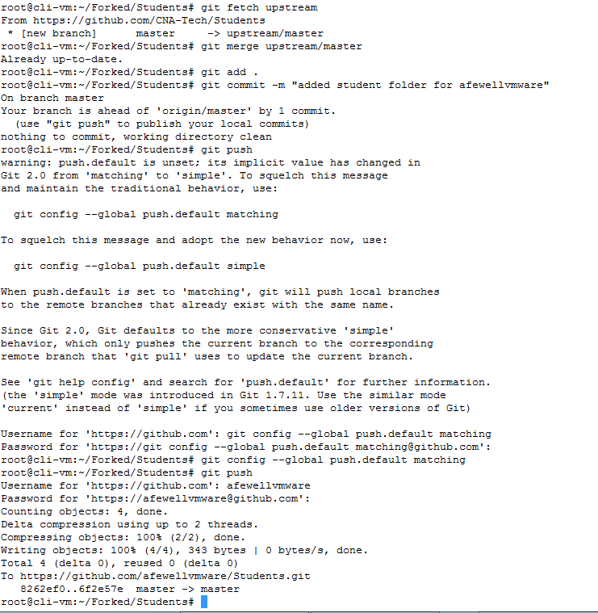
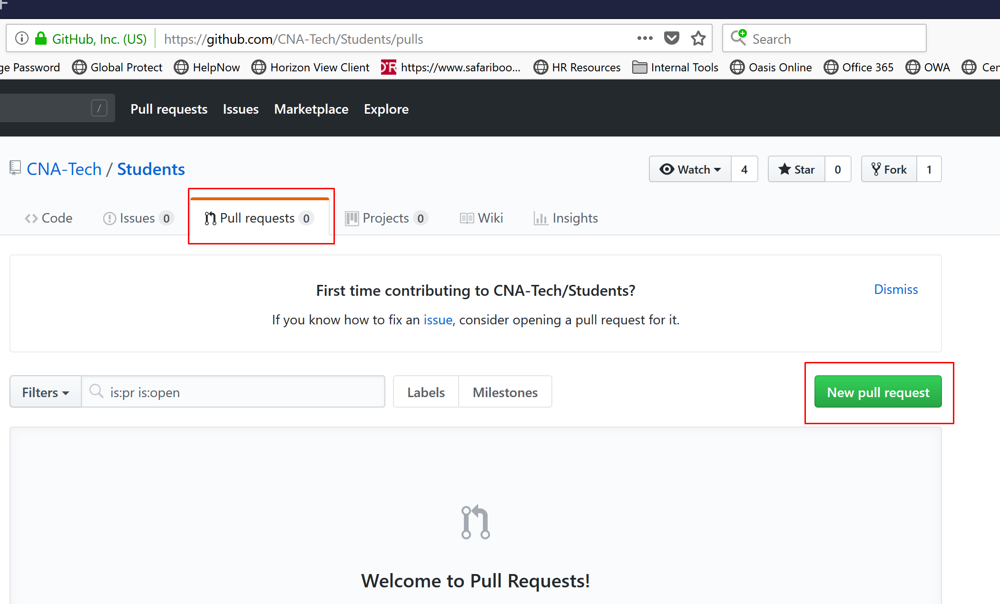
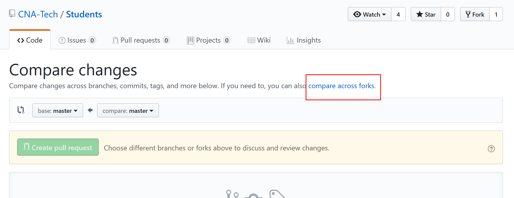
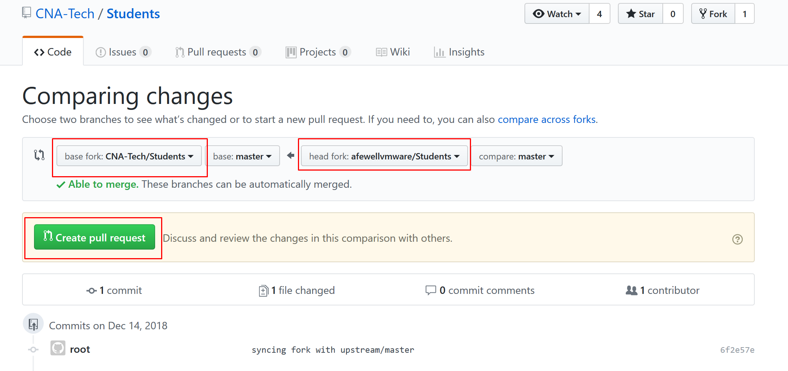
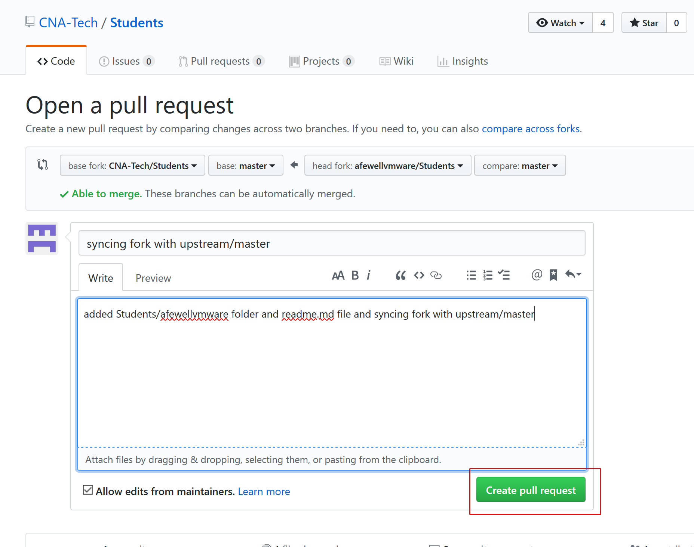
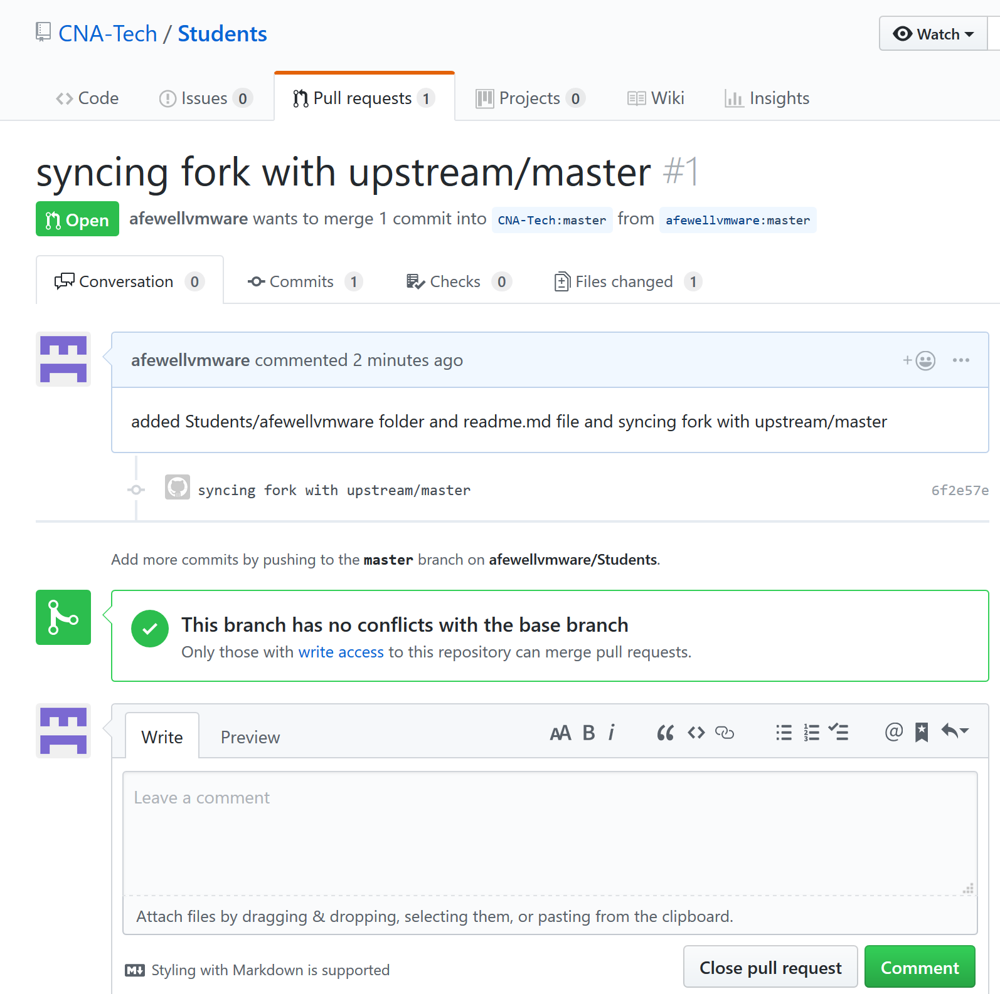
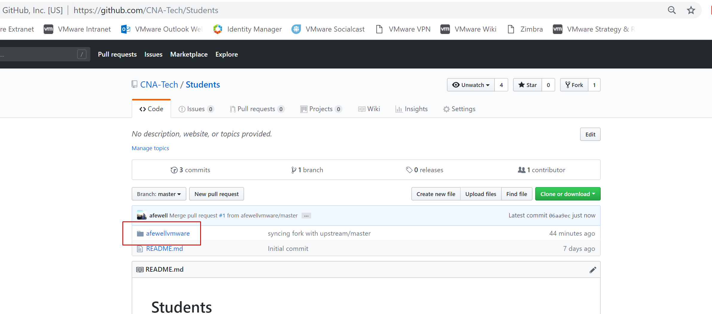

# Creating your Student Folder

The first thing all new participants in the pks-ninja community should do is create a student folder on the [https://github.com/CNA-Tech/Students](https://github.com/CNA-Tech/Students) repo using your github ID as the folder name to ensure unique values for all participants.

Most courses should include steps to save any files you create or modify as part of any exercise, you should save your work to your student folder, make this a regular habit in cases where a lab guide may have missed adding a step to remind you

Because your student folder is on a community repository, you will use the same industry standard process to load your updates into the repository that you would use in most devops/cloud native projects and open source communities

If you are already experienced and comfortable with the github pull request process, please proceed to the [Prerequisites]() section below, otherwise please read the [Introduction]() section before proceeding with the prerequisites and instructions

## Introduction

Git is the industry standard version control system used in modern devops and cloud native projects. Whenever someone makes an update to a file in a git repository, git keeps track of anything that has changed and assigns an updated version number automatically. It provides tools in case there is a problem with an update and an administrator needs to roll back to a previous version, along with other features that help manage frequent updates at an agile or CI/CD cadence

While basic familiarity with linux systems administration is a prerequisite for this exercise and most courses,all beginner to intermediate level courses should include detailed step by step instructions with exact commands that work in the standard Ninja lab environment, enabling students with limited linux or git experience to successfully complete exercises and gain familiarity and comfort in a gradual manner towards increasing expertise

Git is being introduced as a foundational element for all courses on the PKS Ninja community because it is a foundational and necessary skill for modern IT and devops environments. Git was created by Linus Torvalds, and much like Linux it has become an industry standard tool for modern infrastructure and devops projects

If you are new to git or not experienced with pull requests, the process can seem a little intimidating and unfamiliar at first. Most courses teach this as part of a larger git course, but the truth is that you dont need to know much about git to become comfortable and take advantage of its most common and powerful uses

The method used here will walk new students through the unfamiliar process of the pull request. This exercise is carefully designed to be simple and straightforward to help students get comfortable with this process, and as students gain comfort and proceed from basic to more advanced courses, additional common git skills will be gradually introduced to help students gain comfort and practical skills through hands-on exposure

## Prerequisites

You can complete the exercises in this section from any computer with git installed and with access to github.com

All steps were prepared using the standard Ninja Lab environment, and some steps may specify lab specific components like control center vm or cli-vm. 

**This exercise can also be completed with nearly identical steps from any computer, however the student will need to adapt some steps to their environment with the understanding that any step that says to use control center vm or cli-vm can be done on any prepared workstation.**

The instructions and examples provided in this guide use a standard linux bash prompt. All steps can be completed with standard windows and mac clients, however exact instructions and commands while very similar are currently only provided for linux

## One-time setup steps

The pull request process starts with you creating a fork of the repository you want to contribute to, in this exercise that will be the cna-tech/students repository. A fork is a copy of the repository that is saved to your online github account, it is effectively your personal copy of the repository where you can make and test desired updates before you submit them back to the main repository you want to update

Once you make updates to your forked copy of the repository, you can then create a pull request that submits your updates to the cna-tech/students repository administrator for approval. Git will compare your fork with the main repository, find the differences between the two repositories, which are the updates you made to your repository, and if your request is approved, your updates are merged into the main repository

In the steps below, you will create a fork, and in your forked copy of the repository you will create a /Students/{your github id} folder, commit this update to your fork, and then open a pull request to have your folder added to the official repository. Be sure to use your github ID as this will allow all students to create unique folders, which is a great way to get started with simple pull requests since students will only modify their own folder, there should be no conflicts and easy or even automated merge requests for proctors and repo admins

Creating and cloning your fork only needs to be done one time, once you have cloned your fork to your workstation, you can continue to synchronize you fork, make updates and open a pull request without needing to recreate or reclone repeatedly, but it is important that whenever you plan to make an update, you always sync your fork before making updates to ensure you are working from the latest version

You can review section 2 below, [Keeping your fork in sync and making pull request]() and use it as a reference for the steps you should do every time you prepare an update you want to pull into the official repository

1.1 Open a web browser, log into your github.com account and from the same tab, navigate to the PKS Ninja Repo at [https://github.com/CNA-Tech/Students](https://github.com/CNA-Tech/Students). Click the `Fork` button on the upper right hand corner of the page as shown in the screenshot below

<details><summary>Screenshot 1.1.1</summary>

</details>

<details><summary>Screenshot 1.1.2</summary>

</details>
<br/>

1.2 After the fork is completed, your browser will be redirected to the github page for the new forked repo. Click the `Clone or download' link and copy the url as shown in the screenshot below

<details><summary>Screenshot 1.2</summary>

</details>
<br/>

1.3 From the control center desktop use putty to connect to `cli-vm` and enter the following commands to clone your forked repo. This will download your forked copy of the repository from github to your local computer where you can make local updates and edits

**Make sure to replace the URL in the `git clone` command with the URL of your fork of the Students repo**

```bash
mkdir ~/Forked
cd ~/Forked
git clone https://github.com/yourGithubId/Students.git # replace the url with the url to your fork of the Students repo
cd Students/
```

<details><summary>Screenshot 1.3</summary>

</details>
<br/>

1.4 From the `cli-vm` prompt ensure you are in the `~/Forked/Students` directory and connect your forked clone back to the source PKS-Ninja repository with the command `git remote add upstream https://github.com/CNA-Tech/Students.git`. Validate the upstream configuration with the command `git remote -v`

<details><summary>Screenshot 1.4</summary>

</details>
<br/>

1.5 From the `cli-vm` prompt, enter the following commands to create a new folder with your github username under the students directory and initialize a readme file in that folder. When you create a new folder in a git repository, the folder will not be added to the repository until you have a file in it. The `touch` command included below creates an empty file named readme.md in your directory, even if it is empty, the presence of the file is enough for git to include your new student folder when you commit the update to your repository in subsequent steps

**Make sure you replace the string "yourGithubId" in the commands below with your unique github Id**

```bash
ls
cd Students
mkdir yourGithubUsername # Replace every instance of "yourGithubId" with your unique github.com account id
touch yourGithubUsername/readme.md
cd yourGithubUsername/
ls
```

<details><summary>Screenshot 1.5</summary>

</details>
<br/>

## 2.0 Keeping your Fork up to date and executing pull requests

Whenever you start working on any update you would like to submit to a shared community repo, you will first want to ensure your fork is up to date with the official repo. If you start making updates without first syncing, you may include outdated content in your updates, which could create unnecessary complexities

It is unlikely when you commit to your own student folder that you will have conflicts, but it is still really crucial to follow this guidance to get used to the standard best practices, you should always use these best practices so they become second nature to you

Another essential factor is making sure you keep your commits small and frequent, and do pull requests frequently. This will help prevent conflicts and ensure your updates are processed as smoothly as possible

To keep your fork in sync with the official repo, you will login to the clone of your fork that you downloaded to your local filesystem in the previous section. You will update your local clone from the upstream offical pks-ninja repo, and then commit and push any updates from your local clone to your fork on github

2.1 From the `cli-vm` prompt, enter the following commands to pull down the latest updates from the official pks-ninja repo and then merge them into your local clone of your fork. Normally you will follow these exact steps including the commit step even if you havent made any local changes as this will ensure that any updates you download from the upstream master get pushed back into your fork on github, otherwise your fork on github will remain out of sync.

In this specific example the following steps will also add the new student folder you created in the previous step to your commit, which we can do without syncing the repo first in this case since you just barely forked the repo and it should still be current

```bash
cd ~/Forked/Students/
git fetch upstream # This command pulls down the latest updates from the upstream repo
git merge upstream/master # This command merges any updates from the upstream repo into your local clone of your fork
git add . # Adds any files in your local clone of the repo that you have updated to staging so they get commited in the following command
git commit -m "syncing fork with upstream/master"
git config --global push.default matching
git push #follow the prompts to login and push any needed updates to your fork
```

<details><summary>Screenshot 2.1</summary>

</details>
<br/>

2.2 If you have any additional updates to make to files you want in your student directory, make and save the any local file changes and then enter the following commands to push the additional updates to your fork

```bash
git add . # Adds any files in your local clone of the repo that you have updated to staging so they get commited in the following command
git commit -m "type a relevant message desribing your update here"
git push #follow the prompts to login and push any needed updates to your fork
```

2.3 Next, go the the https://github.com/CNA-Tech/Students website, click on the pull request tab and select `New pull request`

<details><summary>Screenshot 2.3</summary>

</details>
<br/>

2.4 On the line beneath `Compare Changes` click on `compare across forks`

<details><summary>Screenshot 2.4</summary>

</details>
<br/>

2.5 With this request, you are trying to update the offical CNA-Tech/Students repo with updates from your fork. Set `base fork` to `CNA-Tech/Students`, and `head fork` to `yourGithubId/PKS-Ninja`. Click `Create Pull Request`

<details><summary>Screenshot 2.5</summary>

</details>
<br/>

2.6 On the `Open a pull request` screen, add a comment to describe your update and click `Create pull request`, and observe that your browser redirects you to details page for your pull request where you can observe the details and state of your request

<details><summary>Screenshot 2.6.1</summary>

</details>

<details><summary>Screenshot 2.6.2</summary>

</details>
<br/>

2.7 After you have submitted your pull request, you will have to wait for an administrator to approve the request. Currently this is typically done within a day and sometimes much faster, but it could take up to a few days under the worse case scenario. You do not need to wait for the pull request to complete in order to proceed, but keep an eye on your email and check back to the pull requests page on the cna-tech/students github site periodically so you can observe your new student folder on the offical repo

<details><summary>Screenshot 2.7</summary>

</details>
<br/>

### You now know how to contribute to CNABU, VMware and other Github repos, we need your contribution to build the best learning community we can! Using the fork/pull request process you executed in the above steps, you could even post updates as simple as correcting a typo you find on a page or making bigger contributions! We can definitely use your help and look forward to growing VMware CNA learning communities together!

### Thank you for completing the Create your Student Folder lab!
