# Creating your Student Folder

Once you get acclimated to the pks-ninja site, one of the first things all new participants in the pks-ninja community should do is create a student folder on the [https://github.com/CNA-Tech/Students](https://github.com/CNA-Tech/Students) repo using your github ID as the folder name to ensure unique values for all participants.

Most courses should include steps to save any files you create or modify as part of any exercise, you should save your work to your student folder, make this a regular habit in cases where a lab guide may have missed adding a step to remind you

Because your student folder is on a community repository, you will use the same industry standard process to load your updates into the repository that you would use in most devops/cloud native projects and open source communities

If you are already experienced and comfortable with the github pull request process, please proceed to the [Prerequisites](#prerequisites) section below, otherwise please read the [Introduction](#introduction) section before proceeding with the prerequisites and instructions

## Introduction

If you have taken introductory linux training, there is a good chance you have have heard or been exposed to git, a version control system created by Linux founder Linus Torvalds. Most courses introduce features of the git toolset, many of which are not necessary to understand to get started using the most important workflows to support infrastructure as code, and the infrastructure support roles needed within modern devops and cloud native projects.

For infrastructure specialists supporting devops projects, git plays an especially crucial role. VMware provides modern user interfaces and tools for highly automated and efficent IaaS platform management. While many VMware admins are trained in taking full advantage of VMware's applications, git represents a sort of bridge that connects infrastructure components with software development projects.

Many aspects of cloud native development do not need to be deeply understood by all participants in a agile development project, for example any organization embarking on an agile development project will need to implement complex pipelines that automate all the end-to-end processes in building a software deliverable. Most of these functions are led by software development leaders, and the infrastructure support roles, like most other participants in the project, need primarily to check in their work into the repository using the git workflow.

As infrastructure-centric workers mature in their devops skills, more advanced git skills become increasingly relevant, but to get production services off the ground, being able to participate in the git workflow is among the most critical skills beyond vmware product configuration needed to successfully support the implementation of devops and cloud native processes.

For your reference, the image below from the [Kubernetes Contributor Guide](https://github.com/kubernetes/community/blob/master/contributors/guide/README.md#github-workflow) provides a visual overview of the full pull request process. Please note that to commit a validation stamp, you will be using a highly simplified version of this process:

<a href="https://github.com/kubernetes/community/blob/master/contributors/guide/github-workflow.md">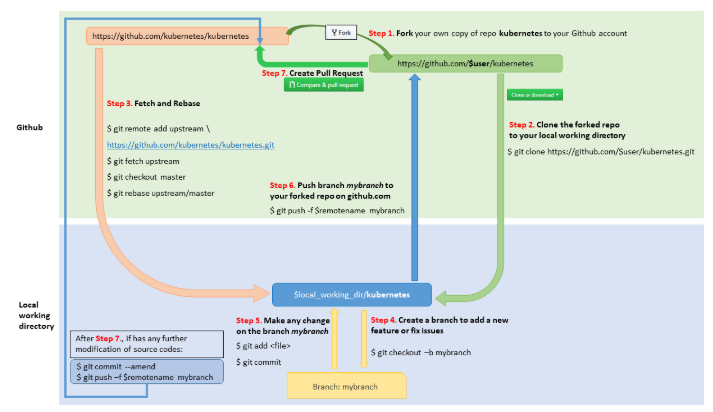</a>

Git is being introduced as a foundational element for all courses on the PKS Ninja community because it is a foundational and necessary skill for modern IT and devops environments.

If you are new to git or not experienced with pull requests, the process can seem a little intimidating and unfamiliar at first. Most courses teach this as part of a larger git course, but the truth is that you dont need to know much about git to become comfortable and take advantage of its most common and powerful uses

The method used here will walk new students through the unfamiliar process of the pull request. This exercise is carefully designed to be simple and straightforward to help students get comfortable with this process, and as students gain comfort and proceed from basic to more advanced courses, additional common git skills will be gradually introduced to help students gain comfort and practical skills through hands-on exposure

## Prerequisites

You can complete the exercises in this section from any computer with git locally installed and with access to github.com.

All steps were prepared using the standard Ninja Lab environment, and some steps may specify lab specific components like control center vm or cli-vm.

**This exercise can also be completed with nearly identical steps from any computer, however the student will need to adapt some steps to their environment with the understanding that any step that says to use control center vm or cli-vm can be done on any prepared workstation.**

Git is pre-installed in the ninja lab environment, if you complete this exercise from another workstation, git will needed to be installed, per the [Git Install Documentation Here](https://git-scm.com/book/en/v2/Getting-Started-Installing-Git)

The instructions and examples provided in this guide use a standard linux bash prompt. All steps can be completed with standard windows and mac clients, however exact instructions and commands while very similar are currently only provided for linux

## One-time setup and first time pull request

The pull request process starts with you creating a fork of the repository you want to contribute to, in this exercise you will create a fork of the he cna-tech/students repository. A fork is a copy of the repository that is saved to your online github account, it is effectively your personal copy of the repository where you can make and test desired updates before you submit them back to the main "upstream" repository you want to update

Once you have a fork of the repo on your online github account, you need to clone your fork of the repository to your local workstation. As you will see when you go through the exercises below, your local clone of the repository is just like any other subdirectory in your local filesytem.

Next, once you have cloned a local copy of your forked repository, you will want to make a branch for your updates. By default when you view or update files on a git repository, you use the "Master" branch, which usually includes all the complete and current files in the repository. If you edit a file while you are on the master branch, your updates are entertwined into your master branch, and it is more optimal to isolate only the files you have updated. If you only submit the files you have updated with your pull request, it helps ensure there are no conflicts if other people have updated other files on the repository that may be completely different from the file you updated.

When you create a new branch for an update, it creates a snapshot of the main branch that just captures the lines that you have changed from the master in your update branch, which keeps your update smaller, simpler and smoother. After you checkout the new branch you create for your update, you will edit any local files you want to update, save the files, add them to staging, commit the updates to your local clone, push the updates to your fork on github, and then open a pull request which sends a request to the admin of the upstream (CNA-tech/Students) repository requesting them to pull the updates from your update branch into the main branch of the upstream CNA-Tech/Students repository.

Once you submit the pull request, git will compare your fork with the main repository, find the differences between the two repositories, which are the updates you made to your repository, and if your request is approved, your updates are merged into the main repository.

In the steps below, you will create a fork, clone your fork to your workstation and create an update branch, create a /Students/{your github id} folder in your update branch, commit and push this update to your fork, and then open a pull request to have the content from your update branch pulled into the official repository.

The name of your student folder will be your github ID, as this will allow all students to create unique folders, which is a great way to get started with simple pull requests as students will only modify their own folder, there should be no conflicts and easy or even automated merge requests for proctors and repo admins.

Creating and cloning your fork only needs to be done one time, once you have cloned your fork to your workstation, you can continue to synchronize you fork, make updates and open a pull request without needing to recreate or reclone repeatedly, but ***it is critical that whenever you plan to make an update, you always sync your fork before making updates to ensure you are working from the latest version***

You can review section 2 below, [Keeping your fork in sync and making pull request](#20-keeping-your-fork-up-to-date-and-executing-pull-requests) and use it as a reference for the steps you should do every time you prepare an update you want to pull into the official repository

1.1 Open a web browser, log into your github.com account and from the same tab, navigate to the PKS Ninja Repo at [https://github.com/CNA-Tech/Students](https://github.com/CNA-Tech/Students). Click the `Fork` button on the upper right hand corner of the page as shown in the screenshot below

<details><summary>Screenshot 1.1.1</summary>
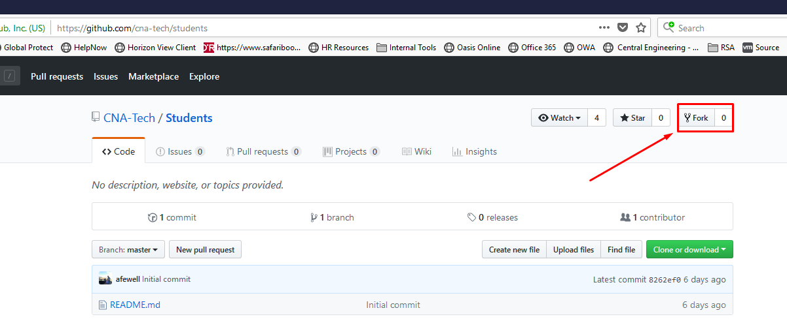
</details>

<details><summary>Screenshot 1.1.2</summary>
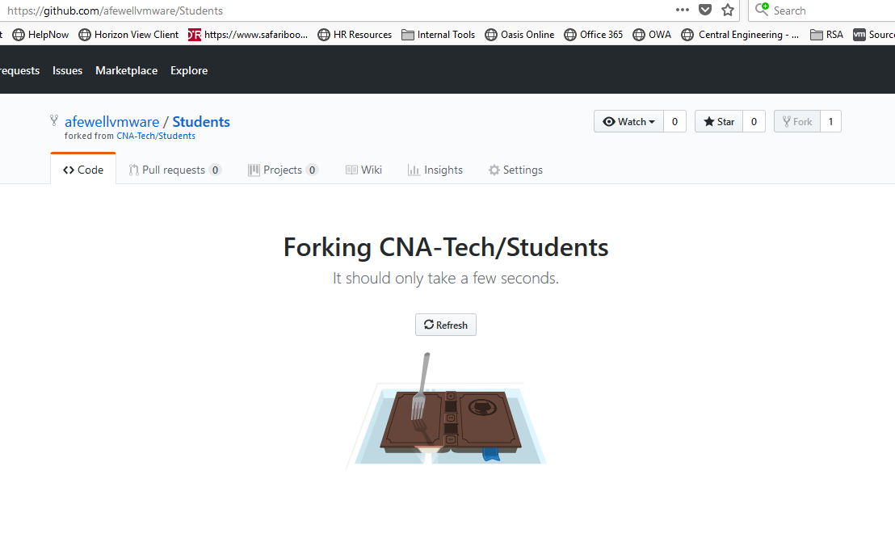
</details>
<br/>

1.2 After the fork is completed, your browser will be redirected to the github page for the new forked repo. Click the `Clone or download` link and copy the url as shown in the screenshot below

<details><summary>Screenshot 1.2</summary>

</details>
<br/>

1.3 From the control center desktop use putty to connect to `cli-vm` and enter the following commands to clone your forked repo. This will download your forked copy of the repository from github to your local computer where you can make local updates and edits

**Make sure to replace the URL in the `git clone` command with the URL of your fork of the Students repo**

```bash
mkdir ~/Forked
cd ~/Forked
git clone https://github.com/yourGithubId/Students.git # replace the url with the url to your fork of the Students repo
cd Students/
```

<details><summary>Screenshot 1.3</summary>
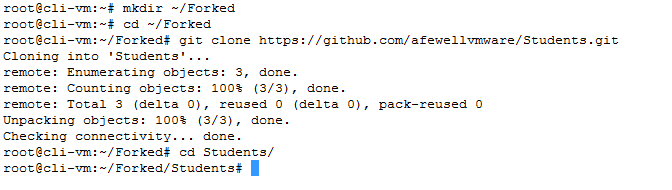
</details>
<br/>

1.4 Create and checkout a new branch to make your updates on. It is a common practice on github to create a temporary branch to submit your update, and then later after your update is accepted, you can delete the update branch as it will be no longer needed and it helps ensure a clean process if you make a new temporary update branch each time you plan to make updates and do a pull request.

In this example you can use `update-1` as the branch name, the name you use doesnt matter but if in the future you create an update branch and find it already exists, it may mean you forgot to delete it after a previous update so be sure to create a new branch and if needed delete any existing temporary branches that may be leftover from previous updates.

Enter the followwing commands to create and checkout a new `update-1` branch

```bash
git branch
git checkout -b update-1
git branch
```

<details><summary>Screenshot 1.4</summary>
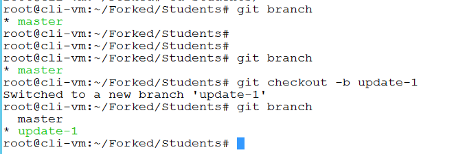
</details>
<br/>

1.5 From the `cli-vm` prompt, enter the following commands to create a new folder with your github username under the students directory and initialize a readme file in that folder.

When you create a new folder in a git repository, the folder will not be added to the repository until you have a file in it. The `echo` command included below passes the text in quotations and if not present create a file named readme.md in your directory. You can replace the text "my snarky comment" with any string you would like.

**Make sure you replace the string "yourGithubUsername" in the commands below with your unique github username**

```bash
ls
mkdir yourGithubUsername # Replace every instance of "yourGithubUsername" with your unique github.com ausername
echo "my snarky comment" > yourGithubUsername/readme.md
cat yourGithubUsername/readme.md
cd yourGithubUsername/
ls
```

<details><summary>Screenshot 1.5</summary>
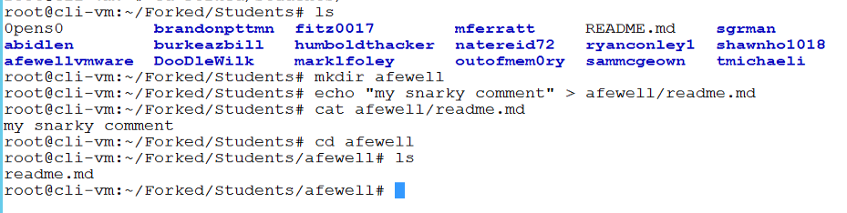
</details>
<br/>

1.6 From the `cli-vm` prompt ensure you are in the `~/Forked/Students` directory and connect your forked clone back to the source PKS-Ninja repository, then validate the upstream configuration is correct.  If your shell prompt does not show current directory, use command `pwd` to show your current working directory.

```bash
pwd
git remote add upstream https://github.com/CNA-Tech/Students.git
git remote -v
```

<details><summary>Screenshot 1.6</summary>
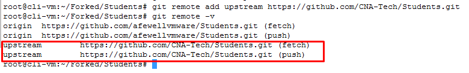
</details>
<br/>

1.7 From the `cli-vm` prompt ensure you are in the `~/Forked/Students` directory and of you have not already, ensure your standard git defaults are set with the following commands, being sure to use your github username and the email associated with your github account.  If your shell prompt does not show current directory, use command `pwd` to show your current working directory.

```bash
pwd
git config --global user.name "Your Name"
git config --global user.email you@example.com
git config --global push.default simple
```

<details><summary>Screenshot 1.7</summary>
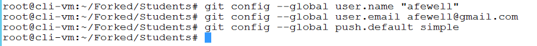
</details>
<br/>

1.8 From the `cli-vm` prompt ensure you are in the `~/Forked/Students` directory and, add your updates to staging, commit your updates and then push the contents of your `update-1` branch from your local clone to your fork of the students repo with the following commands.  If your shell prompt does not show current directory, use command `pwd` to show your current working directory.

```bash
pwd
git add .
git commit -m "adding my student folder"
git push -u origin update-1
```

<details><summary>Screenshot 1.8</summary>
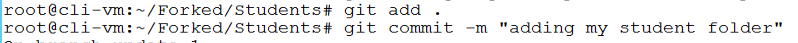
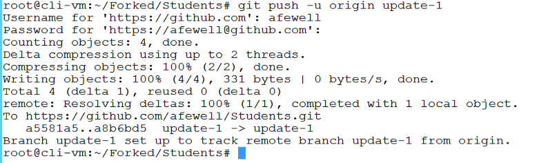
</details>
<br/>

1.9 Open a web browser to your fork of the `CNA-Tech/Students` repo at `https://github.com/yourGithubUsername/Students`, be sure to replace your github username in the url. Observe that you should not see the new directory you created with your github username. Observe that there are now 2 branches, and that you are currently viewing the `master` branch

<details><summary>Screenshot 1.9</summary>
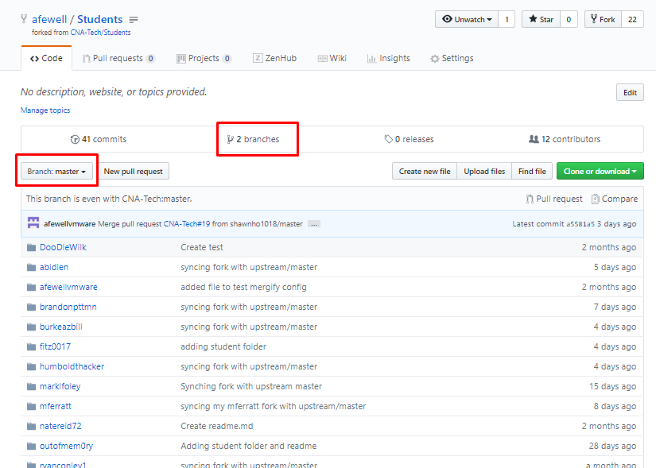
</details>
<br/>

1.10 On the `update-1` branch, you should now be able to see the new folder with your github username in your fork of the `Students` repository. Click on `New Pull Request`

<details><summary>Screenshot 1.10</summary>
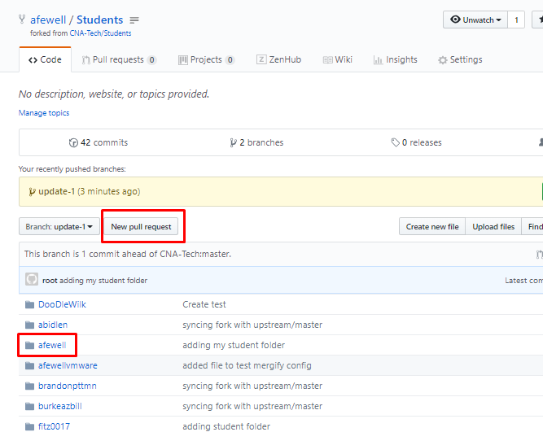
</details>
<br/>

1.11 Observe that after clicking on `New Pull Request` in the previous step, your browser was redirected to the `Open a pull request` page on the `CNA-Tech/Students` github page. Observe that in the middle gray bar under the `Open a pull request` header, there is a directional arrow pointing from the head repository to the base repository, indicating that a pull request pulls updates from a head into a base.

Since you have put your updates into the `update-1` branch on your fork, the `head repository` should be set to `yourGithubUsername/Students` and `compare: update-1`. The `base repository` should be set to `CNA-Tech/Students` with `base: master`.

Cick on the `Create pull request` button

<details><summary>Screenshot 1.11.1</summary>
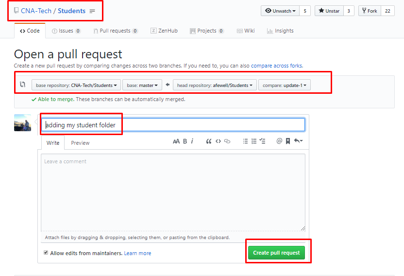
</details>

<details><summary>Screenshot 1.11.2</summary>
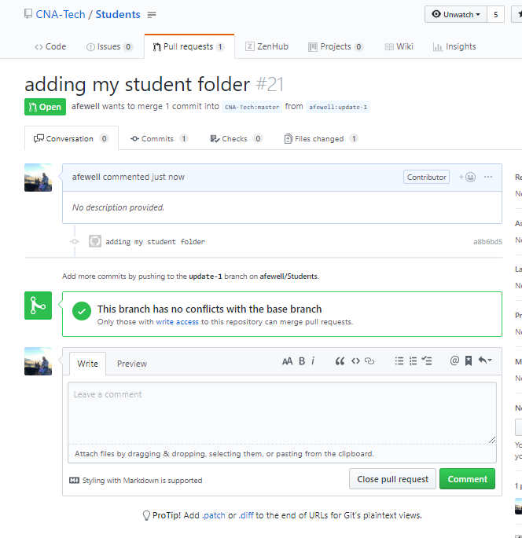
</details>
<br/>

1.12 Your pull request has now been submitted, and you can proceed with additional exercises while you wait for your request to be approved and merged, which usually happens within a few hours but could take up to a few days worse case.

The screenshot below is from an administrator view of the pull request review and approval screens, this is for your reference only:

<details><summary>Screenshot 1.12.1</summary>
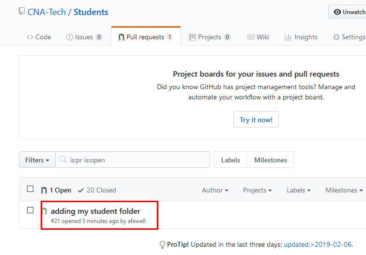
</details>

<details><summary>Screenshot 1.12.2</summary>
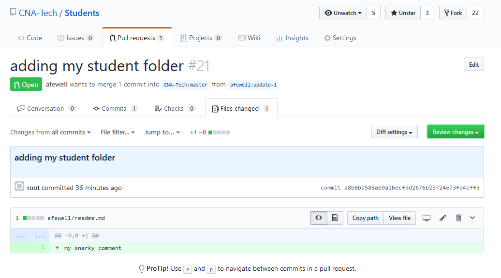
</details>

<details><summary>Screenshot 1.12.3</summary>
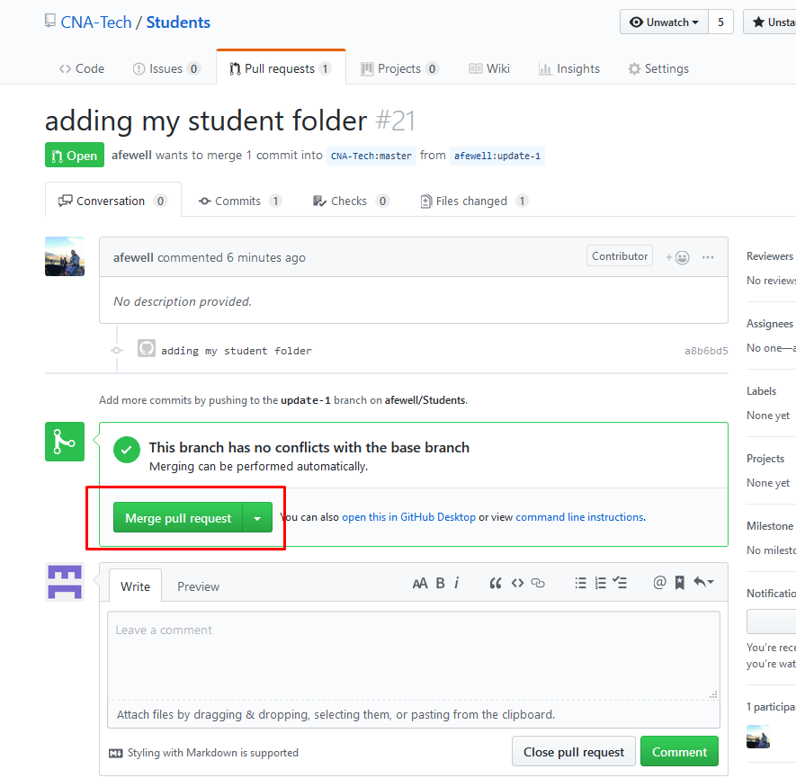
</details>

<details><summary>Screenshot 1.12.4</summary>
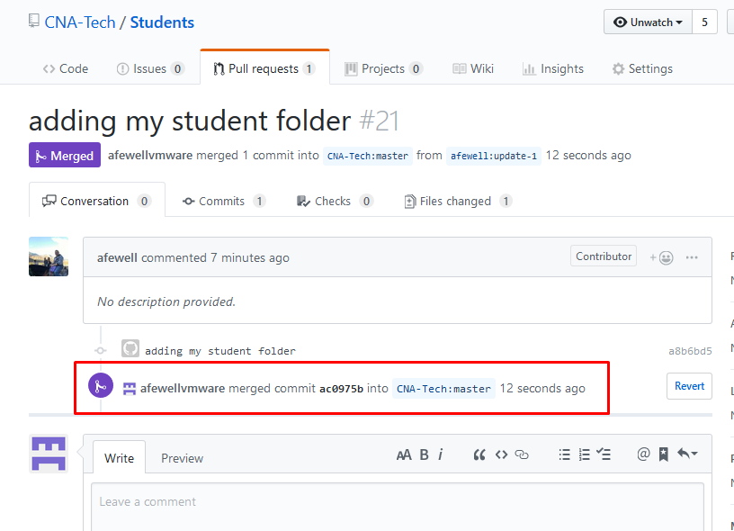
</details>
<br/>

1.13 After an admin approves and merges your pull request you should recieve an email to the address associated with your github account similar to the screenshot below. Click on the PR number as highlighted in the image below to be directed to the page for the pull request

<details><summary>Screenshot 1.13</summary>
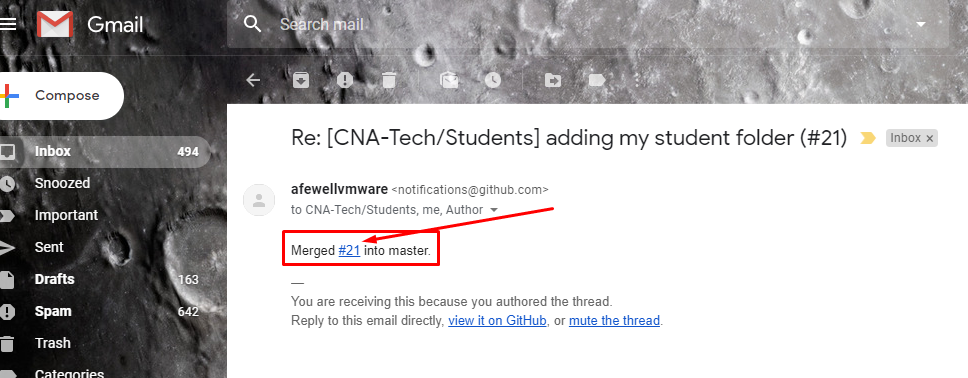
</details>
<br/>

1.14 If your pull request is accepted, you should see a screen similar to the screenshot below. Observe that there is a button that allows you to delete the update branch you used on your fork as the source of the pull request

Deleting your update branch after an update is accepted is a good practice, but whether you do this or not can depend on the specific processes of the project you are working on or your personal preferred workflow.

Unless you are already a git expert or are following requirements for another project, it is a good practice to us the method as shown in the steps above.

Click `Delete branch` to delete the `yourGithubUsername:update-1` branch

<details><summary>Screenshot 1.14</summary>
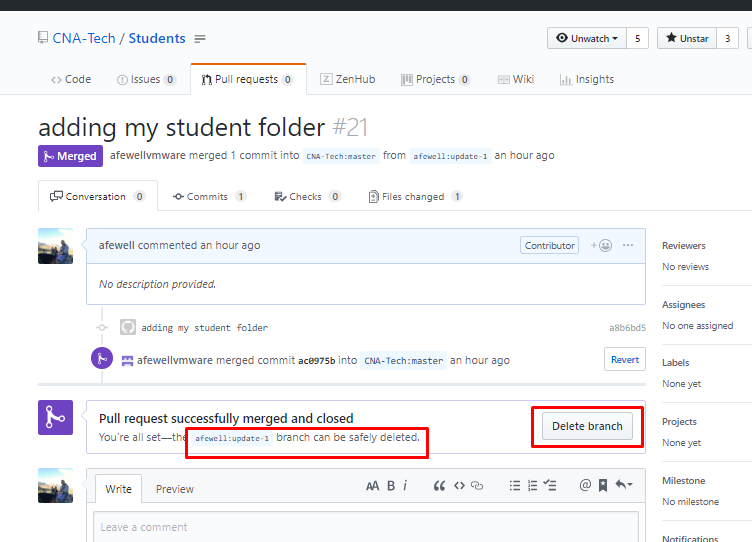
</details>
<br/>

1.15 Open a web browser to your fork of the `CNA-Tech/Students` repo at `https://github.com/yourGithubUsername/Students`, be sure to replace your github username in the url, and ensure you are viewing the master branch.

Observe that the new folder you created is not yet available on your fork. Also observe that there is now only 1 branch, as you deleted the update-1 branch in the previous step.

Review that in the steps above, you only edited files on your update branch and never edited the master branch of the local clone of your fork. In this workflow, the master branch of your clone of your fork only recieves updates from the upstream repository, ensuring that your local master stays clean and easy to maintain.

<details><summary>Screenshot 1.15</summary>
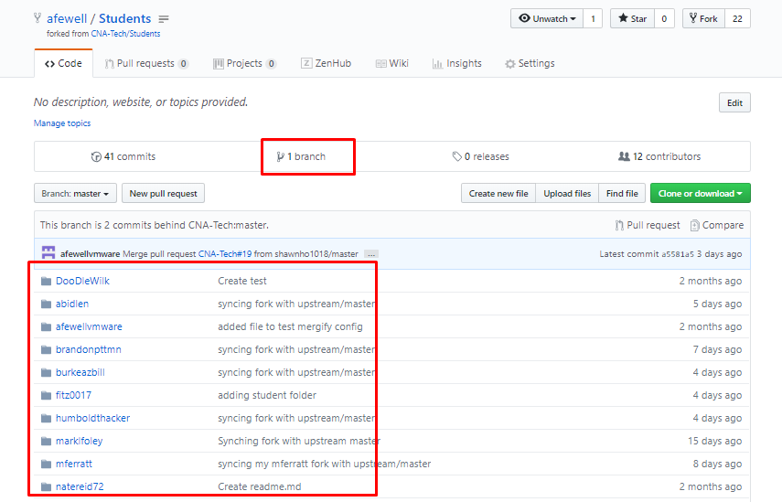
</details>
<br/>

1.16 From the `cli-vm` prompt ensure you are in the `~/Forked/Students` directory and enter the following commands to fetch and then merge the latest updates from the upstream repository (CNA-Tech/Students: master) to the local clone of your fork. Delete the update-1 branch from your local clone.  If your shell prompt does not show current directory, use command `pwd` to show your current working directory.

```bash
pwd
git branch #observe that while you deleted your branch from your fork, it is still present in your local clone
git checkout master
git fetch upstream #this downloads the latest updates from the upstream but does not merge or apply them into your local branches
git merge upstream/master #this merges the latest updates from the upstream CNA-Tech/Students repo master branch into the master branch of your local clone to bring it up to date
git branch #observe that merging the lastest updates to upstream does not automatically delete your local branches
git branch -d update-1
```

<details><summary>Screenshot 1.16</summary>
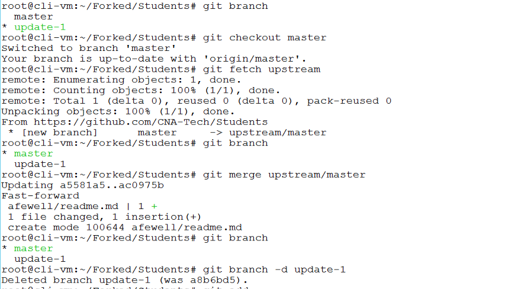
</details>
<br/>

1.17 From the `cli-vm` prompt ensure you are in the `~/Forked/Students` directory and enter the following commands to push the updates you just merged from upstream back to your origin fork on github, this will update your github fork of the Students repo with upstream.  If your shell prompt does not show current directory, use command `pwd` to show your current working directory.

```bash
pwd
git commit -m "syncing fork with upstream/master"
git push #enter your username and password as prompted
```

<details><summary>Screenshot 1.17</summary>

</details>
<br/>

1.18 Open a web browser to your fork of the `CNA-Tech/Students` repo at `https://github.com/yourGithubUsername/Students`, be sure to replace your github username in the url, and ensure you are viewing the master branch.

Observe that you can now see the new folder you created with your github username on your fork, and that your fork is up to date with the upstream CNA-Tech/Students repo

<details><summary>Screenshot 1.18</summary>
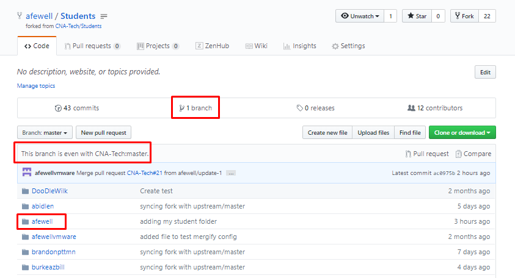
</details>
<br/>

## 2.0 Keeping your Fork up to date and repeating pull requests

Whenever you start working on any update you would like to submit to a shared community repo, you will first want to ensure your fork is up to date with the official repo. If you start making updates without first syncing, you may include outdated content in your updates, which could create unnecessary complexities

It is unlikely when you commit to your own student folder that you will have conflicts, but it is still really crucial to follow this guidance to get used to the standard best practices, you should always use these best practices so they become second nature to you

Another essential factor is making sure you keep your commits small and frequent, and do pull requests frequently. This will help prevent conflicts and ensure your updates are processed as smoothly as possible

To keep your fork in sync with the official repo, you will login to the clone of your fork that you downloaded to your local filesystem in the previous section. You will update your local clone from the upstream offical pks-ninja repo, and then commit and push any updates from your local clone to your fork on github

2.1 From the `cli-vm` prompt, enter the following commands to pull down the latest updates from the upstream CNA-Tech/Students repo and then merge them into your local clone of your fork. Normally you will follow these exact steps including the commit step even if you havent made any local changes as this will ensure that any updates you download from the upstream master get pushed back into your fork on github, otherwise your fork on github will remain out of sync. Then create and checkout a branch for the updates you would like to make.

```bash
cd ~/Forked/Students/
git checkout master #ensure you are on the master branch
git fetch upstream # This command pulls down the latest updates from the upstream repo
git merge upstream/master # This command merges any updates from the upstream repo into the master of your local clone of your fork
git commit -m "syncing fork with upstream/master"
git push #follow the prompts to login and push any needed updates to your fork
git branch
git checkout -b update-1 #creates and switches the local context to the update-1 branch
```

<details><summary>Screenshot 2.1</summary>
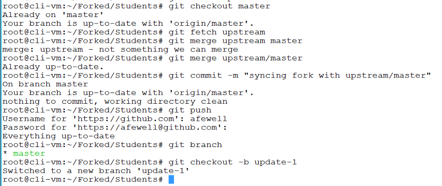
</details>
<br/>

2.2 If you have any additional updates to make to files you want in your student directory,  make and save the any local file changes and then enter the following commands to push the additional updates to your fork. Be sure to change "yourGithubUsername" in any commands below with your github username.

```bash
echo "</br>another snarky comment</br>" >> ~/Forked/yourGithubUsername/readme.md
cat ~/Forked/yourGithubUsername/readme.md
git add . # Adds any files in your local clone of the repo that you have updated to staging so they get commited in the following command
git commit -m "type a relevant message describing your update here"
git push origin update-1 #follow the prompts to login and push any needed updates to your fork
```

<details><summary>Screenshot 2.2</summary>
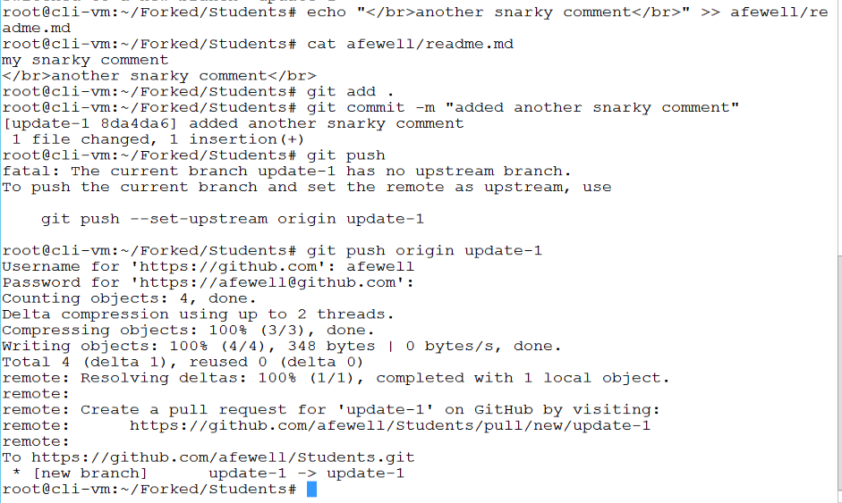
</details>
<br/>

2.3 Next, go the the https://github.com/yourGithubUsername/Students website be sure to replace yourGithubUsername in the url, click the `Branch:` pulldown menu and select the `update-1` branch and click on `New pull request`

<details><summary>Screenshot 2.3</summary>
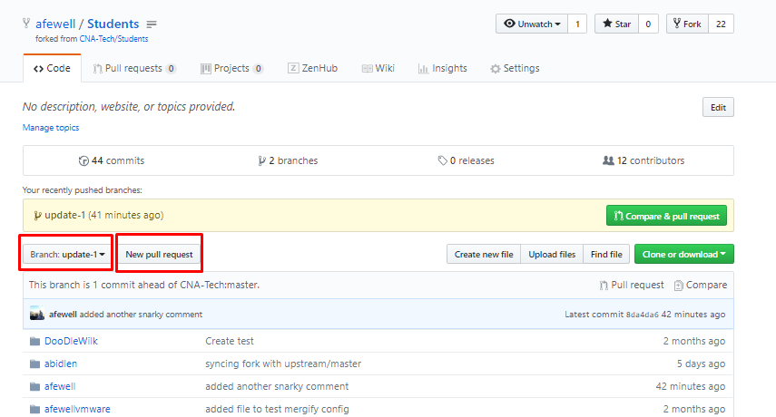
</details>
<br/>

2.4 On the `Open a pull request` page verify the request has the base set to CNA-Tech/Students: master and the head is set to yourGithubUsername/Students: update-1 as shown in the following screenshot, ensure you enter a comment and click `Create pull request`

<details><summary>Screenshot 2.4</summary>
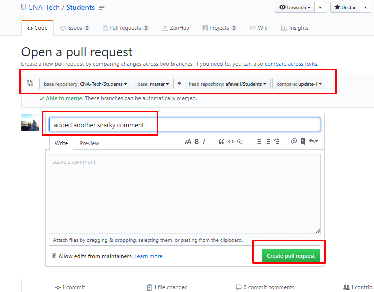
</details>
<br/>

2.5 After an admin approves and merges your pull request you should recieve an email to the address associated with your github account similar to the screenshot below. Click on the PR number as highlighted in the image below to be directed to the page for the pull request

<details><summary>Screenshot 2.5</summary>

</details>
<br/>

2.6 If your pull request is accepted, you should see a screen similar to the screenshot below. Observe that there is a button that allows you to delete the update branch you used on your fork as the source of the pull request

Deleting your update branch after an update is accepted is a good practice, but whether you do this or not can depend on the specific processes of the project you are working on or your personal preferred workflow.

Unless you are already a git expert or are following requirements for another project, it is a good practice to us the method as shown in the steps above.

Click `Delete branch` to delete the `yourGithubUsername:update-1` branch

<details><summary>Screenshot 2.6</summary>

</details>
<br/>

2.7 From the `cli-vm` prompt ensure you are in the `~/Forked/Students` directory and enter the following commands to fetch and then merge the latest updates from the upstream repository (CNA-Tech/Students: master) to the local clone of your fork. Delete the update-1 branch from your local clone.  If your shell prompt does not show current directory, use command `pwd` to show your current working directory.

```bash
pwd
git branch #observe that while you deleted your branch from your fork, it is still present in your local clone
git checkout master
git fetch upstream #this downloads the latest updates from the upstream but does not merge or apply them into your local branches
git merge upstream/master #this merges the latest updates from the upstream CNA-Tech/Students repo master branch into the master branch of your local clone to bring it up to date
git branch #observe that merging the lastest updates to upstream does not automatically delete your local branches
git branch -d update-1
```

<details><summary>Screenshot 2.7</summary>

</details>
<br/>

2.8 From the `cli-vm` prompt ensure you are in the `~/Forked/Students` directory and enter the following commands to push the updates you just merged from upstream back to your origin fork on github, this will update your github fork of the Students repo with upstream.  If your shell prompt does not show current directory, use command `pwd` to show your current working directory.

```bash
pwd
git commit -m "syncing fork with upstream/master"
git push #enter your username and password as prompted
```

<details><summary>Screenshot 2.8</summary>

</details>
<br/>

2.9 Open a web browser to your fork of the `CNA-Tech/Students` repo at `https://github.com/yourGithubUsername/Students`, be sure to replace your github username in the url, and ensure you are viewing the master branch.

Observe that you can now see the new folder you created with your github username on your fork, and that your fork is up to date with the upstream CNA-Tech/Students repo

<details><summary>Screenshot 2.9</summary>

</details>
<br/>

**You now know how to contribute to CNABU, VMware and other Github repos, we need your contribution to build the best learning community we can! Using the fork/pull request process you executed in the above steps, you could even post updates as simple as correcting a typo you find on a page or making bigger contributions! We can definitely use your help and look forward to growing VMware CNA learning communities together!**

**Thank you for completing the Create your Student Folder lab!**
