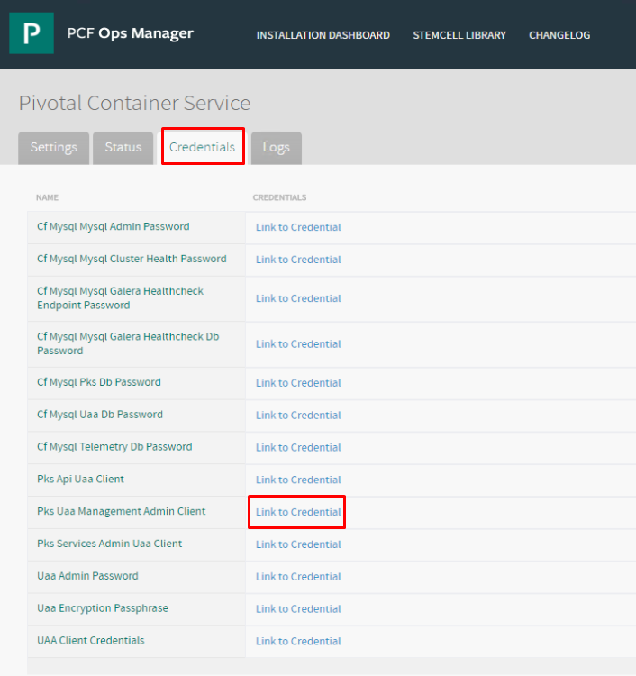
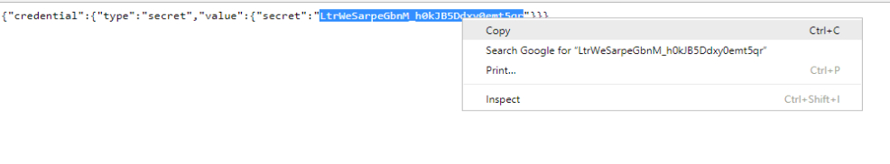
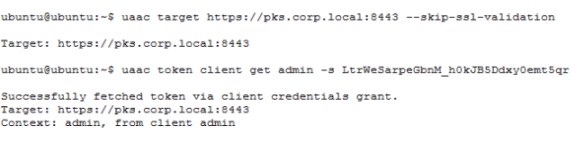
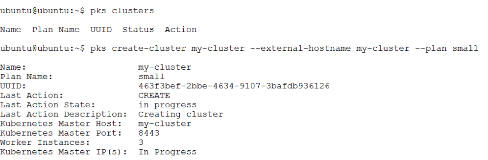
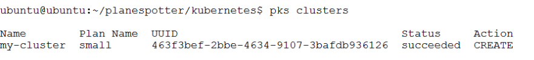

# Lab 5: Deploy First PKS Cluster & Planespotter

## Step 1: Create UAA Account for PKS User

1.1 Login to Ops Manager UI, Click on the PKS tile and then click on the `Credentials` tab, look for `Pks Uaa Management Admin Client` , click `Link to Credential`

- From the control center, open a browser and navigate to https://opsman.corp.local
- User name / password: admin / VMware1!

<details><summary>Screenshot 1.1 </summary>

</details>
<br/>

1.2 Copy the value of the secret to the clipboard as shown in Screenshot 1.2

<details><summary>Screenshot 1.2 </summary>

</details>
<br/>

1.3 Create a SSH session profile for connection to the Ops Manager VM and establish a connection with the UAA service

- From the control center desktop, open putty, define, save, and open a session for `ubuntu@opsman.corp.local`. Login with password: `VMware1!`

<details><summary>Screenshot 1.3.1</summary></details><br>

_NOTE: You are using the `ubuntu` username for this session. This is the default SSH user for opsman._

 - From the OpsMan CLI, target your UAA server and request a token with the following commands. (Be sure to replace the string `LtrWeSarpeGbnM_h0kJB5Ddxy0emt5qr` with the secret that you gathered in the previous step 1.2)

```bash:
uaac target https://pks.corp.local:8443 --skip-ssl-validation
uaac token client get admin -s LtrWeSarpeGbnM_h0kJB5Ddxy0emt5qr
```

<details><summary>Screenshot 1.3.2 </summary>

</details><br/>

1.4 From `OpsMan`, enter the following commands to create a UAA account and assign admin rights to new user `pks-admin`:

```bash:
uaac user add pks-admin --emails pks-admin@corp.local -p VMware1!
uaac member add pks.clusters.admin pks-admin
```

<details><summary>Screenshot 1.4</summary></details><br>

## Step 2 Login to PKS CLI and Create Cluster

2.1 From `cli-vm`, Login to the PKS CLI with the following command:

```
pks login -a pks.corp.local -u pks-admin --skip-ssl-validation
```

- Password: `VMware1!`

<details><summary>Screenshot 2.1</summary></details><br>

2.2 From `cli-vm`, verify there are no existing clusters

```bash
pks clusters
```

<details><summary>Screenshot 2.2</summary></details><br>
 
 2.3 Display available plans

 ```
 pks plans
 ```

 <details><summary>Screenshot 2.3</summary></details><br>
 
 2.4 Create a Kubernetes cluster

```
pks create-cluster my-cluster --external-hostname my-cluster.corp.local --plan small
```

_Note: It will take ~10 minutes for the cluster to deploy, you may proceed with step 3 while the cluster deployment is in progress, however do not proceed to step 4 until the cluster deployment status is `succeeded`_

_Also, it may be interesting for you to look at the `Tasks` menu in vCenter to observe some of the vSphere tasks that occur on cluster creation_

<details><summary>Screenshot 2.4 </summary>

</details>
<br/>

## Step 3: Prepare Planespotter K8s Manifests for Deployment

3.1 From `cli-vm`, use nano or another text editor to change the image pull location in the frontend deployment manifest to pull the image you, created and pushed to harbor in the Harbor Lab, from  `harbor.corp.local/library/frontend:v1`. Use the following commands to open the manifest in nano and then reference Screenshot 3.1 as needed to complete the update and save the file

_Note: If you have no `/planespotter/kuberenetes/` directory, complete the Harbor lab_

```bash
cd ~/planespotter/kubernetes
nano frontend-deployment_all_k8s.yaml
# update file per image 3.1, save and close
```

<details><summary>Screenshot 3.1 </summary>

</details>
<br/>

3.2 View the `app-server-deployment_all_k8s.yaml` file, observe the container image value is `yfauser/planespotter-app-server:1508888202fc85246248c0892c0d27dda34de8e1` which is a working configuration. You may notice this does not specify the location of the registry it is using, and that is because this container is located on docker hub, which is a default search location for docker hosts including PKS deployed K8s nodes

<details><summary>Screenshot 3.2 </summary>

</details>
<br/>

You should now understand the differences in how to configure a kubernetes manifest to pull from docker hub or from Harbor

## Step 4: Deploy Planespotter App

4.1 Before proceeding, verify that your cluster has successfully deployed by entering the command `pks clusters` from `cli-vm`. If your PKS CLI session has timed out, login again using the command provided in step 2.1

<details><summary>Screenshot 4.1 </summary>

</details>
<br/>

4.2 Pull down the kubernetes config and credentials for `my-cluster` with the command 

```
pks get-credentials my-cluster
```


<details><summary>Screenshot 4.2 </summary>

</details>
<br/>

Please use the instructions at [this link](https://github.com/CNA-Tech/PKS-Ninja/tree/master/LabGuides/BonusLabs/Deploy%20Planespotter%20Lab) to complete deployment of the planespotter app
