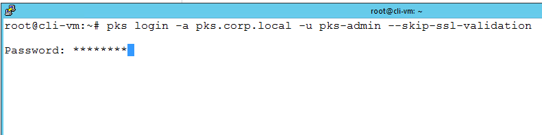
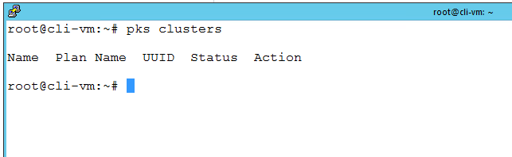
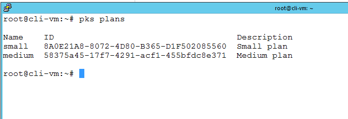

# Deploy First PKS Cluster

## Step 1: Create UAA Account for PKS User

**Note: If you completed your PKS installation using the concourse pipeline, or if you started with a fullyInstalled lab template, the UAA account has already been created for you by the pipeline, and you can skip to step 2. Please review Step1 so you have an understanding of how to create UAA accounts, as this is a regular, ongoing task for PKS administration that needs to be done using the manual procedure documented here to add additional user accounts after initial installation.**

1.1 Login to Ops Manager UI, Click on the PKS tile and then click on the `Credentials` tab, look for `Pks Uaa Management Admin Client` , click `Link to Credential`

- From the control center, open a browser and navigate to https://opsman.corp.local
- User name / password: admin / VMware1!

<details><summary>Screenshot 1.1 </summary>

</details>
<br/>

1.2 Copy the value of the secret to the clipboard as shown in the Screenshot below

<details><summary>Screenshot 1.2 </summary>

</details>
<br/>

1.3 Create a SSH session profile for connection to the Ops Manager VM and establish a connection with the UAA service

- From the control center desktop, open putty, define, save, and open a session for `ubuntu@opsman.corp.local`. Login with password: `VMware1!`

<details><summary>Screenshot 1.3.1</summary></details><br>

_NOTE: You are using the `ubuntu` username for this session. This is the default SSH user for opsman._

- From the OpsMan CLI, target your UAA server and request a token with the following commands. (Be sure to replace the string `LtrWeSarpeGbnM_h0kJB5Ddxy0emt5qr` with the secret that you gathered in the previous step 1.2)

```bash:
uaac target https://pks.corp.local:8443 --skip-ssl-validation
uaac token client get admin -s LtrWeSarpeGbnM_h0kJB5Ddxy0emt5qr
```

<details><summary>Screenshot 1.3.2 </summary>

</details><br/>

1.4 From `OpsMan` putty session, enter the following commands to create a UAA account and assign admin rights to new user `pks-admin`:

```bash:
uaac user add pks-admin --emails pks-admin@corp.local -p VMware1!
uaac member add pks.clusters.admin pks-admin
```

<details><summary>Screenshot 1.4</summary></details><br>

## Step 2 Login to PKS CLI and Create Cluster

2.1 From `cli-vm`, Login to the PKS CLI with the following command:

```bash
pks login -a pks.corp.local -u pks-admin --skip-ssl-validation
```

- Password: `VMware1!`

<details><summary>Screenshot 2.1</summary></details><br>

2.2 From `cli-vm`, verify there are no existing clusters

```bash
pks clusters
```

<details><summary>Screenshot 2.2</summary></details><br>

 2.3 Display available plans

 ```bash
 pks plans
 ```

 <details><summary>Screenshot 2.3</summary></details><br>

 2.4 Create a Kubernetes cluster

```bash
pks create-cluster my-cluster --external-hostname my-cluster.corp.local --plan small
```

_Note: It will take several minutes for the cluster to deploy, you may proceed with step 3 while the cluster deployment is in progress, however do not proceed to step 4 until the cluster deployment status is `succeeded`_

_Also, it may be interesting for you to look at the `Tasks` menu in vCenter to observe some of the vSphere tasks that occur on cluster creation_

<details><summary>Screenshot 2.4 </summary>

</details>
<br/>

2.5 Enter the command `pks clusters my-cluster` to check on your cluster deployment status, once your cluster deployment has completed, the _Status_ column should say `succeeded` as shown in the following screenshot

<details><summary>Screenshot 2.5 </summary>

</details>
<br/>

**You have now completed your first cluster deployment, please return to your course guide for details on additional steps and exercises for your course**
