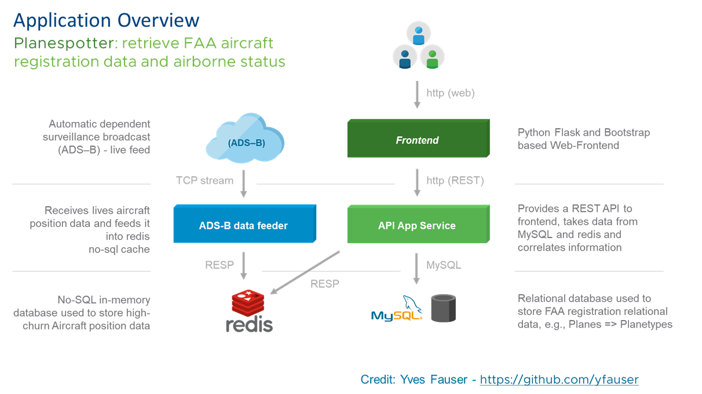

# Deploy PlaneSpotter App

--------------

### This Lab Supports the HOL-2031 lab template, along with the v12 Baseline, NsxtReady, PksInstalled and ClusterReady templates - however please note you will need PKS and a Kubernetes cluster deployed before proceeding

## Overview of App

Now that we have a Kubernetes cluster, let's look at the magic of Kubernetes by deploying an application. For this exercise we will be using an app called 'planespotter' developed by the very talented @yfauser [here](https://github.com/yfauser/planespotter). Planespotter lets you query Aircraft data from the FAA Registry. It has the following components (Please note that at the time of writing, Planespotters connection to )

1. Front-end: User interface to take queries and showcase results
2. API App server: to retrieve data from DB
3. MySQL DB: Stores Aircraft registration data from FAA
4. Redis-server: Memory cache server to fetch data of Aircrafts currently airborne

<details><summary>Planespotter Overview Image</summary>

</details>

If you would like you can explore the [YAML files that will be used for the deployments](https://github.com/CNA-Tech/planespotter/tree/master/kubernetes), or just proceed through the steps and watch the deployments in action - some times it helps the understanding of the deployment files to watch the deployment first and then revisit looking at the yaml files. For example look at the front-end deployment YAML file to see how many pods and replicas the deployment YAML has specified. The deployment YAML for planespotter-frontend has specified 2 replica sets, hence post deployment you should see two pods deployed for the frontend app. 

Similarly, take a note of the labels the frontend service has been allocated. These labels will be used to built the frontend loadbalancer when we expose the app. Kubernetes will understand which pods to route the incoming traffic for the front-end loadbalancer. The traffic is routed via pod labels, hence there is no need to configure IP addresses, host names etc.

With Kubernetes, each component needed for the app is defined in the deployment YAML. The deployment YAML identifies the base container image , the dependencies needed from the infrastructure etc. The yaml files also create an API service that frontends the component-pod.

## Overview of Steps

- [Deploy PlaneSpotter App](#deploy-planespotter-app)
    - [This Lab Supports the HOL-2031 lab template, along with the v12 Baseline, NsxtReady, PksInstalled and ClusterReady templates - however please note you will need PKS and a Kubernetes cluster deployed before proceeding](#this-lab-supports-the-hol-2031-lab-template-along-with-the-v12-baseline-nsxtready-pksinstalled-and-clusterready-templates---however-please-note-you-will-need-pks-and-a-kubernetes-cluster-deployed-before-proceeding)
  - [Overview of App](#overview-of-app)
  - [Overview of Steps](#overview-of-steps)
  - [Step 1: Configure K8s Cluster for App Deployment](#step-1-configure-k8s-cluster-for-app-deployment)
  - [Step 2: Deploy Planespotter](#step-2-deploy-planespotter)
  - [Step 3: Publish the Planespotter app to expose it to the outside world](#step-3-publish-the-planespotter-app-to-expose-it-to-the-outside-world)
  - [Step 4: Understanding how Kubernetes Maintains state by looking at an example of ReplicaSets.](#step-4-understanding-how-kubernetes-maintains-state-by-looking-at-an-example-of-replicasets)

-------------

**Note that in the above command you are cloning the CNA-Tech fork of the original Planespotter application, as we have modified the deployment specs to pull planespotter images from our public harbor repository, which is accessible from the HOL-2031 environment.**

--------------

## Step 1: Configure K8s Cluster for App Deployment

**HOL-2031 Users, Please Complete [HOL POD Prep for PKS Ninja Lab Guides](../HOLPodPrep-HP3631/readme.md) Before Proceeding**

1.0 From the control-center desktop, open a putty/ssh session to `ubuntu@cli-vm` and login with the password `VMware1!`, login to the PKS API and get your Kubernetes cluster credentials with the following commands:

```bash
pks login -a pks.corp.local -u pks-admin -p  --skip-ssl-validation
pks get-credentials my-cluster
```

Clone the planespotter repository and navigate to the kubernetes directory with the following commands

```bash
cd /home/ubuntu
git clone https://github.com/cna-tech/planespotter.git
cd planespotter/kubernetes
```

1.1 Create namespace "planespotter" and set the namespace as your default

```bash
  kubectl create ns planespotter
  kubectl config set-context my-cluster --namespace planespotter
```

1.2 Verify your namespace has been created

- `kubectl get namespaces`

1.3 Create a storage class

- `kubectl create -f ~/planespotter/kubernetes/storage_class.yaml`

1.3 Create a persistent volume claim for MySQL 

- `kubectl create -f ~/planespotter/kubernetes/mysql_claim.yaml`

_The above commands will create a storage class and generate a persistent volume claim needed to store data for the MySQl server , this claim will generate a 2 GB volume. Explore the YAML files to see what will be claimed, the volume type, the amount of storage needed etc._

1.4 Verify the persistent volume has been generated.
 
- `kubectl get pv`

## Step 2: Deploy Planespotter

2.1  Deploy the MySQL Pod

- `kubectl create -f ~/planespotter/kubernetes/mysql_pod.yaml`

2.2 Verify the MySQL pod has deployed

- `kubectl get pods --namespace planespotter`

_You should see the pod created with name 'mysql-0'_

2.3 Deploy the App-Server Pod 

- `kubectl create -f ~/planespotter/kubernetes/app-server-deployment_all_k8s.yaml`

2.4 Deploy the Frontend

- `kubectl create -f ~/planespotter/kubernetes/frontend-deployment_all_k8s.yaml`

2.5 Deploy Redis and the ADSB Sync Service

- `kubectl create -f ~/planespotter/kubernetes/redis_and_adsb_sync_all_k8s.yaml`

2.6 Verify all the pods needed for front-end, redis, DBC Sync services and App server (7 total) have been deployed and have entered Running state

- `kubectl get pods --namespace planespotter`
- `kubectl get services --namespace planespotter`

## Step 3: Publish the Planespotter app to expose it to the outside world

The planespotter app has been deployed with micro-services created for each sub-components; however, if you take a closer look at the services created, you will see they are all using IP addresses from the k8s cluster pool. These are not routable outside of the cluster. In order to expose a service to external connections, we can create a node-port service type or a Load Balancer service type. For the plane spotter app we will be exposing the 'frontend' service with a load balancer. PKS utilizes an automatically created NSX Load Balancer in this case.

3.1 Expose the planespotter-frontend with the following command

```
kubectl expose deployment planespotter-frontend \
--name=planespotter-frontend-lb --port=80 --target-port=80 --type=LoadBalancer --namespace=planespotter
```

3.2 Check the external URL/IP address assigned to the service (make note of the first IP addres under External-IP).

- `kubectl get service planespotter-frontend-lb -n planespotter`

3.3 Copy the IP under the "External-IP" section and point your browser to that location.

A freshly deployed app based on 4 micro-services is ready!

## Step 4: Understanding how Kubernetes Maintains state by looking at an example of ReplicaSets. 

4.1 Replicasets in Kubernetes make sure that when a deployment is made 'x' number of pods for that deployment are always running. For the Planespotter frontend deployment we specified '2' replicas to always run, take a look at the deployment YAML for Palanespotter frontend here

- `nano ~/planespotter/kubernetes/frontend-deployment_all_k8s.yaml`

Notice where it states _replicas: 2_ under the _spec:_ heading.

4.2 Look at the number of pods running for the frontend service. You should see 2 replicas of the planespotter-frontend running.

- `kubectl get pods -n planespotter`

4.3 Delete one of the Pods running the frontend service

- Copy the name of one of the pods that starts with 'planespotter-frontent-' and delete it

- `kubectl delete pod <name of your planespotter-frontend-pod> -n planespotter`

4.4 List the Pods still running for frontend

- `kubectl get pods -n planespotter`

Notice the count of pods for planespotter-frontend has not changed, there are still 2 pods. The name of one of the pods is now different than before ( the unique number in the name) and the age is more recent than the other. Kubernetes just created a new pod after the original pod was deleted in order to maintain declared state.


