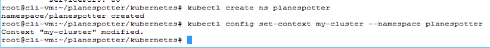
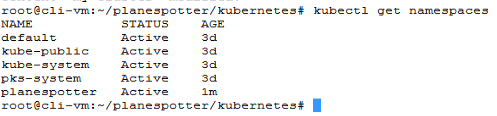
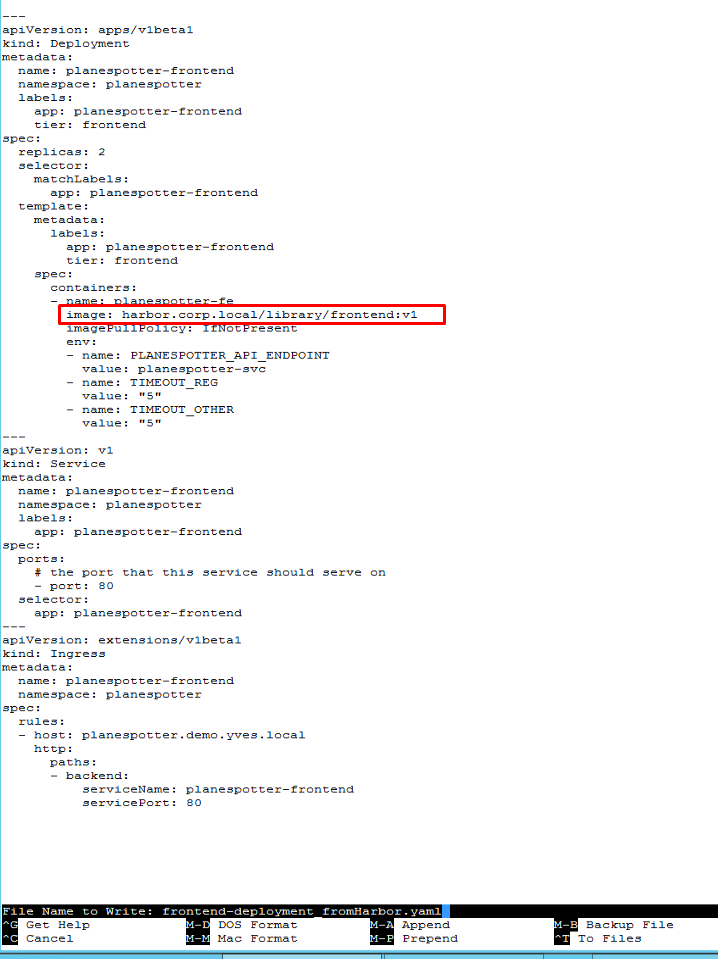
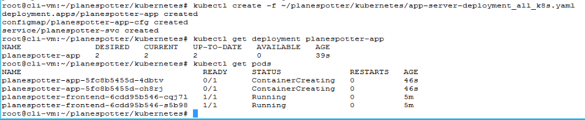
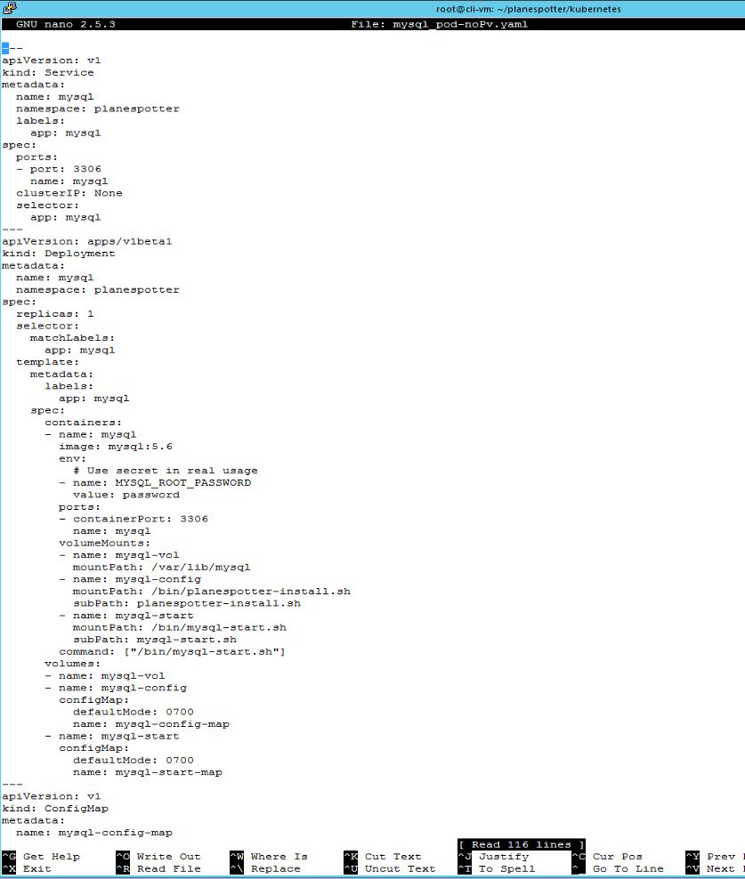

# Deploy Planespotter without Persistence
--------------
### This lab requires a working Kubernetes cluster. If you haven't completed the Deploy  Your First Cluster Lab, do that now.

This lab guide provides instructions to deploy a slightly modified version of the Planespotter application. The standard version of Planespotter uses a MySQL Database with an attached persistent volume. In this guide, you will modify the standard deployment manifest to remove the persistent volume. This is done to support exercises that demonstrate the impact persistence has on application behavior

The next lab guide in the Ninja SE course sequence, [PKS Storage and Persistence 1]() is designed to compliment this guide, and if you follow along, the storage and persistence lab guide will update will provide instructions to upgrade your planespotter deployment with persistent storage and walk through examples demonstrating the impact on application behavior

If you are looking for instructions to deploy the standard planespotter app, please see the [Deploy Planespotter App](https://github.com/CNA-Tech/PKS-Ninja/blob/master/LabGuides/BonusLabs/Deploy%20Planespotter%20Lab/readme.md) lab guide

## Overview of App

Now that we have a Kubernetes cluster, let's look at the magic of Kubernetes by deploying an application. For this exercise we will be using an app called 'planespotter' developed by the very talented @yfauser [here](https://github.com/yfauser/planespotter). Planespotter essentially lets you query Aircraft data from the FAA Registry. It has the following components

1. Front-end: User interface to take queries and showcase results
2. API App server: to retrieve data from DB
3. MySQL DB: Stores Aircraft registration data from FAA
4. Redis-server: Memory cache server to fetch data of Aircrafts currently airborne

<details><summary>Planespotter Overview Image</summary>

</details>
<br/>

Explore the YAML files that will be used for the deployments (Located in ~/planespotter/kubernetes). For example look at the front-end deployment YAML file to see how many pods and replicas the deployment YAML has specified. The deployment YAML for planespotter-frontend has specified 2 replica sets, hence post deployment you should see two pods deployed for the frontend app

Similarly, take a note of the labels the frontend service has been allocated. These labels will be used to built the frontend loadbalancer when we expose the app. Kubernetes will understand which pods to route the incoming traffic for the front-end loadbalancer. The traffic is routed via pod labels, hence there is no need to configure IP addresses, host names etc.

With Kubernetes, each component needed for the app is defined in the deployment YAML. The deployment YAML identifies the base container image , the dependencies needed from the infrastructure etc. The yaml files also create an API service that frontends the component-pod.

In the Intro to Harbor lab, we modified one of the manifests (.yaml file) to pull an image from our private Harbor registry.If you haven't completed the Intro to Harbor lab, all images will be pulled from the remote registry.

## Overview of Steps

- [# Deploy Planespotter without Persistence](#deploy-planespotter-without-persistence)
  - [This lab requires a working Kubernetes cluster. If you haven't completed the Deploy Your First Cluster Lab, do that now.](#this-lab-requires-a-working-kubernetes-cluster-if-you-havent-completed-the-deploy-your-first-cluster-lab-do-that-now)
- [Overview of App](#overview-of-app)
- [Overview of Steps](#overview-of-steps)
- [Step 1: Configure K8s Cluster for App Deployment](#step-1-configure-k8s-cluster-for-app-deployment)
- [Step 2: Deploy Planespotter](#step-2-deploy-planespotter)
- [Step 3: Publish the Planespotter app to expose it to the outside world](#step-3-publish-the-planespotter-app-to-expose-it-to-the-outside-world)
- [Step 4: Understanding how Kubernetes Maintains state by looking at an example of ReplicaSets.](#step-4-understanding-how-kubernetes-maintains-state-by-looking-at-an-example-of-replicasets)

-------------
_If you've completed the Intro to Intro to Harbor lab, you'll already have the Planespotter repo cloned locally; If you haven't, you will need to clone it. Follow the directions below from the `cli-vm` to clone the repo for this lab:_

- `cd ~`
- `git clone https://github.com/yfauser/planespotter.git`

Before proceeding, verify that your cluster has successfully deployed by entering the command `pks clusters` from `cli-vm`

Pull down the kubernetes config and credentials for `my-cluster` with the command 

```
pks get-credentials my-cluster
```

--------------

## Step 1: Configure K8s Cluster for App Deployment

1.1 Create namespace "planespotter" and set the namespace as your default

```bash
kubectl create ns planespotter
kubectl config set-context my-cluster --namespace planespotter
```

<details><summary>Screenshot 1.1 </summary>

</details>
<br/>

1.2 Verify your namespace has been created

- `kubectl get namespaces`

<details><summary>Screenshot 1.2 </summary>

</details>
<br/>

## Step 2: Deploy Planespotter

2.1 From `cli-vm`, use the following commands to open the k8s deployment manifest for the frontend in nano, find the value for the `Image:` for the `planespotter-fe` container in the file, and replace the value ` yfauser/planespotter-frontend:d0b30abec8bfdbde01a36d07b30b2a3802d9ccbb` with the tag of your harbor frontend image `harbor.corp.local/library/frontend:v1`

_Note: If you have no `/planespotter/kuberenetes/` directory, complete the [Intro to Harbor with Planespotter](https://github.com/CNA-Tech/PKS-Ninja/tree/master/LabGuides/IntroToHarbor-IH7914) lab_

```bash
cd ~/planespotter/kubernetes
cp frontend-deployment_all_k8s.yaml frontend-deployment_fromHarbor.yaml
nano frontend-deployment_fromHarbor.yaml
# update file per image 1.1, save and close
```

<details><summary>Screenshot 2.1.1 </summary>

</details>

<details><summary>Screenshot 2.1.2 </summary>

</details>
<br/>

2.2 Deploy the Frontend and verify successful deployment with the following commands

```bash
kubectl create -f ~/planespotter/kubernetes/frontend-deployment_fromHarbor.yaml
kubectl get deployments
kubectl get pods
```

<details><summary>Screenshot 2.2 </summary>

</details>
<br/>

2.3 Deploy the App-Server Pod

```bash
kubectl create -f ~/planespotter/kubernetes/app-server-deployment_all_k8s.yaml
kubectl get deployment planespotter-app
kubectl get pods
```

<details><summary>Screenshot 2.3 </summary>

</details>
<br/>

2.4 Deploy Redis and the ADSB Sync Service

```bash
kubectl create -f ~/planespotter/kubernetes/redis_and_adsb_sync_all_k8s.yaml
kubectl get deployment planespotter-app
kubectl get pods
```

<details><summary>Screenshot 2.4 </summary>

</details>
<br/>

2.5 From `cli-vm`, use the command `cat mysql_pod.yaml` to review the standard planespotter-mysql deployment manifest which includes persistent volume attachments

<details><summary>Screenshot 2.5 </summary>

</details>
<br/>

2.6 Expand the mysql_pod-noPv.yaml section below, review the differences between the files, and copy all the text from the mysql_pod-noPv.yaml section

<details><summary>mysql_pod-noPv.yaml</summary>

```yaml
---
apiVersion: v1
kind: Service
metadata:
  name: mysql
  namespace: planespotter
  labels:
    app: mysql
spec:
  ports:
  - port: 3306
    name: mysql
  clusterIP: None
  selector:
    app: mysql
---
apiVersion: apps/v1beta1
kind: Deployment
metadata:
  name: mysql
  namespace: planespotter
spec:
  replicas: 1
  selector:
    matchLabels:
      app: mysql
  template:
    metadata:
      labels:
        app: mysql
    spec:
      containers:
      - name: mysql
        image: mysql:5.6
        env:
          # Use secret in real usage
        - name: MYSQL_ROOT_PASSWORD
          value: password
        ports:
        - containerPort: 3306
          name: mysql
        volumeMounts:
        - name: mysql-vol
          mountPath: /var/lib/mysql
        - name: mysql-config
          mountPath: /bin/planespotter-install.sh
          subPath: planespotter-install.sh
        - name: mysql-start
          mountPath: /bin/mysql-start.sh
          subPath: mysql-start.sh
        command: ["/bin/mysql-start.sh"]
      volumes:
      - name: mysql-vol
      - name: mysql-config
        configMap:
          defaultMode: 0700
          name: mysql-config-map
      - name: mysql-start
        configMap:
          defaultMode: 0700
          name: mysql-start-map
---
apiVersion: v1
kind: ConfigMap
metadata:
  name: mysql-config-map
  namespace: planespotter
data:
  planespotter-install.sh: |
    #!/bin/sh
    # sleep while mysql is starting up
    while [ -z "$ALIVE" ] || [ "$ALIVE" != 'mysqld is alive' ]
    do
      echo "waiting for mysql..."
      sleep 3
      ALIVE=`mysqladmin ping --user=root --password=$MYSQL_ROOT_PASSWORD`
      echo "status: $ALIVE"
    done
    echo "MYSQL is alive, checking database..."
    DBEXIST=`mysql --user=root --password=$MYSQL_ROOT_PASSWORD -e 'show databases;' | grep planespotter`
    if ! [ -z "$DBEXIST" ]
    then
      echo "planespotter db already installed."
    else
      echo "------- MYSQL DATABASE SETUP -------"
      echo "updating apt-get..."
      apt-get update
      echo "apt-get installing curl..."
      apt-get --assume-yes install curl
      apt-get --assume-yes install wget
      apt-get --assume-yes install unzip
      echo "downloading planespotter scripts..."
      mkdir ~/planespotter
      mkdir ~/planespotter/db-install
      cd ~/planespotter/db-install
      curl -L -o create-planespotter-db.sh https://github.com/yfauser/planespotter/raw/master/db-install/create-planespotter-db.sh
      curl -L -o create-planespotter-db.sql https://github.com/yfauser/planespotter/raw/master/db-install/create-planespotter-db.sql
      curl -L -o delete-planespotter-db.sh https://github.com/yfauser/planespotter/raw/master/db-install/delete-planespotter-db.sh
      curl -L -o delete-planespotter-db.sql https://github.com/yfauser/planespotter/raw/master/db-install/delete-planespotter-db.sql
      echo "creating a new planespotter db"
      chmod +x create-planespotter-db.sh
      ./create-planespotter-db.sh
    fi
---
apiVersion: v1
kind: ConfigMap
metadata:
  name: mysql-start-map
  namespace: planespotter
data:
  mysql-start.sh: |
    #!/bin/sh
    echo "starting planespotter-installer in background"
    /bin/planespotter-install.sh &
    echo "starting mysqld.."
    /entrypoint.sh mysqld
```

</details>
<br/>

2.7 From the `cli-vm` prompt, enter the command `nano mysql_pod-noPv.yaml` which will create a new file with nano, paste the contents you copied from the previous steps into nano, save and close the file

<details><summary>Screenshot 2.7 </summary>

</details>
<br/>

2.8 Enter the following commands to deploy the updated mysql deployment and validate

```bash
kubectl create -f ~/planespotter/kubernetes/mysql_pod-noPv.yaml
kubectl get deployment mysql
```

<details><summary>Screenshot 2.8 </summary>

</details>
<br/>

2.6 Verify all the pods needed for front-end, redis, DBC Sync services and App server (7 total) have been deployed and have entered Running state

- `kubectl get pods --namespace planespotter`
- `kubectl get services --namespace planespotter`

## Step 3: Publish the Planespotter app to expose it to the outside world

The planespotter app has been deployed with micro-services created for each sub-components; however, if you take a closer look at the services created, you will see they are all using IP addresses from the k8s cluster pool. These are not routable outside of the cluster. In order to expose a service to external connections, we can create a node-port service type or a Load Balancer service type. For the plane spotter app we will be exposing the 'frontend' service with a load balancer. PKS utilizes an automatically created NSX Load Balancer in this case.

3.1 Expose the planespotter-frontend with the following command

```
kubectl expose deployment planespotter-frontend \
--name=planespotter-frontend-lb --port=80 --target-port=80 --type=LoadBalancer --namespace=planespotter
```

3.2 Check the external URL/IP address assigned to the service (make note of the first IP addres under External-IP).

- `kubectl get service planespotter-frontend-lb`

3.3 Copy the IP under the "External-IP" section and point your browser to that location.

A freshly deployed app based on 4 micro-services is ready!

## Step 4: Understanding how Kubernetes Maintains state by looking at an example of ReplicaSets. 

4.1 Replicasets in Kubernetes make sure that when a deployment is made 'x' number of pods for that deployment are always running. For the Planespotter frontend deployment we specified '2' replicas to always run, take a look at the deployment YAML for Palanespotter frontend here

- `nano ~/planespotter/kubernetes/frontend-deployment_all_k8s.yaml`

Notice where it states _replicas: 2_ under the _spec:_ heading.

4.2 Look at the number of pods running for the frontend service. You should see 2 replicas of the planespotter-frontend running.

- `kubectl get pods -n planespotter`

4.3 Delete one of the Pods running the frontend service

- Copy the name of one of the pods that starts with 'planespotter-frontent-' and delete it

- `kubectl delete pod <name of your planespotter-frontend-pod> -n planespotter`

4.4 List the Pods still running for frontend

- `kubectl get pods -n planespotter`

Notice the count of pods for planespotter-frontend has not changed, there are still 2 pods. The name of one of the pods is now different than before ( the unique number in the name) and the age is more recent than the other. Kubernetes just created a new pod after the original pod was deleted in order to maintain declared state.

View the `app-server-deployment_all_k8s.yaml` file, observe the container image value is `yfauser/planespotter-app-server:1508888202fc85246248c0892c0d27dda34de8e1` which is a working configuration. You may notice this does not specify the location of the registry it is using, and that is because this container is located on docker hub, which is a default search location for hosts using docker engine including PKS deployed K8s nodes

<details><summary>Screenshot 1.2 </summary>

</details>
<br/>

You should now understand the differences in how to configure a kubernetes manifest to pull from docker hub or from Harbor

