# Introduction to VMware Enterprise PKS

In this lab you will see how to operationalize Kubernetes through VMware Enterprise PKS.  What does that mean?  Let's start by looking at what Kubernetes does well.  It allows developers to easily deploy applications at scale.  It handles the scheduling of workloads (via pods) across a set of infrastructure nodes.  It provides an easy to use mechanism to increase availability and scale by allowing multiple replicas of application pods, while monitoring those replicas to ensure that the desired state (number of replicas) and the actual state of the application coincide.  Kubernetes also facilitates reduced application downtime through rolling upgrades of application pods.  VMware Enterprise PKS is providing similar capabilities for the Kubernetes platform itself.  Platform engineering teams are becoming tasked with providing a Kubernetes "Dialtone" service for their development teams.  Kubernetes is not a simple platform to manage, so the challenge becomes how to accomplish this without architect level knowledge of the platform.  Through VMware Enterprise PKS, platform engineering teams can deliver Kubernetes clusters through a single API call or CLI command.  Health monitoring is built into the platform, so if a service fails or a VM crashes, VMware Enterprise PKS detects that outage and rebuilds the cluster.  As resources become constrained, clusters can be scaled out to relieve the pressure.  Upgrading Kubernetes is not as easy as upgrading the application pods running on the cluster.  VMware Enterprise PKS provides rolling upgrades to the Kubernetes cluster itself.  The platform is integrated with the vSphere ecosystem, so platform engineers can use the tools they are familiar with to manage these new environments.  Lastly, VMware Enterprise PKS includes licensed and supported Kubernetes, Harbor Enterprise Container Registry and NSX-T - and is available on vSphere and public cloud platforms.

Let's net this out.   VMware Enterprise PKS gives you the latest version of Kubernetes - we have committed to constant compatibility with Google Container Engine (GKE), so you can always be up to date - an easy to consume interface for deploying Kubernetes clusters, scale out capability, Health Monitoring and automated remediation, Rolling upgrade, enterprise container registry with Notary image signing  and Clair vulnerability scanning.  All of this deployed while leveraging NSX-T logical networking from the VMs down to the Kubernetes pods.  Let's jump in.


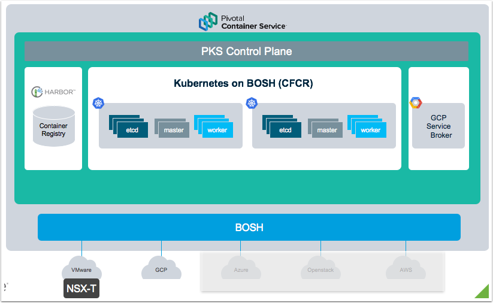

### Our Lab Environment and Deployed Kubernetes Cluster

In this lab we have done the PKS installation and deployed a small Kubernetes cluster for you to work on.  Because of latency concerns in the nested infrastructure we use for these labs, we try not to create VMs as part of the lab.  The Kubernetes cluster in your lab took about 15 minutes to deploy and be up and running.  We will start by looking at some of the components of the cluster and then PKS.


Login into Ops Manager, as shown in the screenshot below. Use "VMware1!" as the decryption passphrase and login to Ops Manager using admin/VMware1! credentials. Familiarize your self with different tile as shown in the second screenshot. There are 3 main tile

1. BOSH Tile: This is the first tile. It contains the IAAS configuration for bosh to communicate to different IAAS platforms. This BOSH tile is vShere specific and contains creds and other configuration to talk to vCenter in this environment.
2. PKS Tile: This is the middle tile and contains all Enterprise PKS specific configuration.
3. harbor Tile: This tile is used to configure and deploy Harbor(Private container registry) in this environment.

<details><summary>Screenshots</summary>
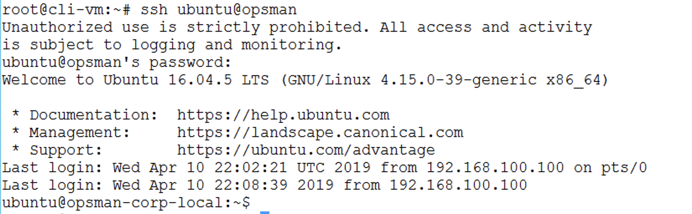
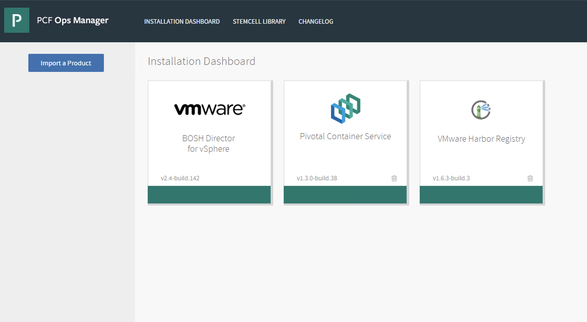
</details>
<br/>

### Connect to Enterprise PKS
We need the PKS cli to log into PKS. The PKS CLI is distributed for Linux, Windows and MAC. In this lab, we will use the cli-vm(ubuntu) to log into PKS as shown in the screenshot below.

1. Click on *Putty*
2. Click on *cli-vm*
3. Click on *Load*
4. Click on *Open*

<details><summary>Login to cli-vm</summary>
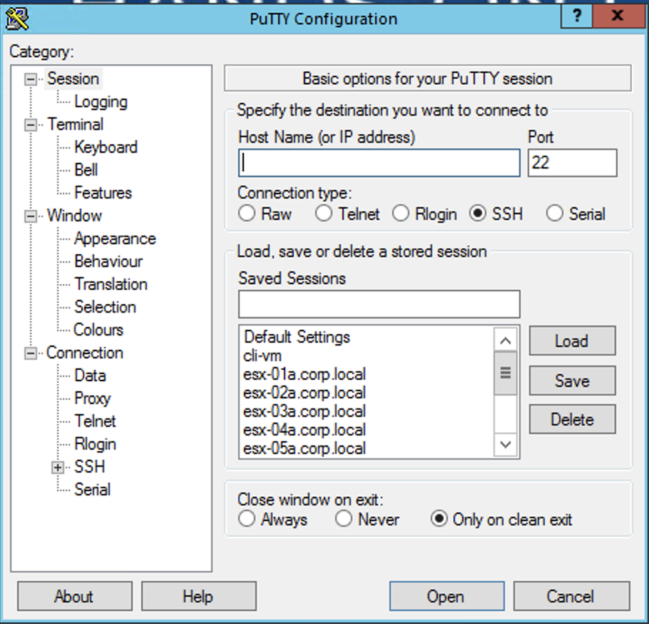
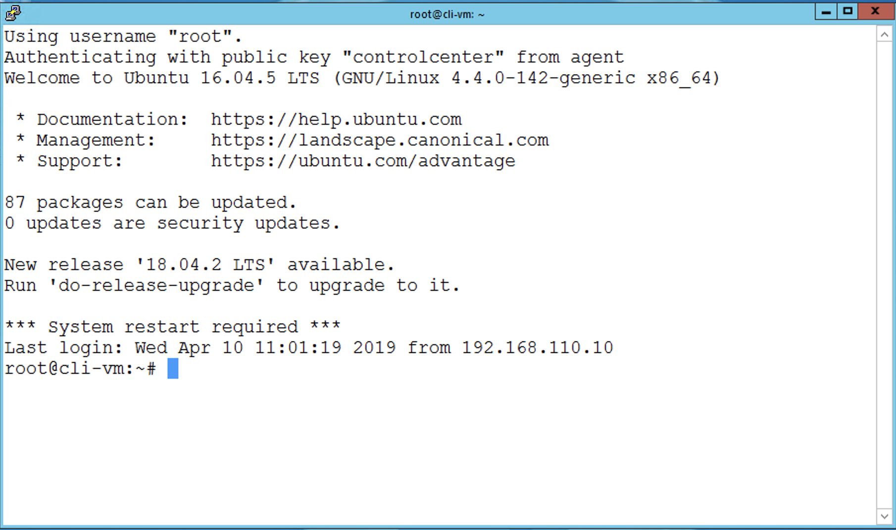
</details>
<br/>

### Login to Enterprise PKS

Run the following command to authenticate to PKS

```
$ pks login -a pks.corp.local -u pksadmin -k -p VMware1!
```
<details><summary>Login to PKS</summary>

</details>
<br/>

### Showing Kubernetes Cluster Details
The PKS CLI is designed to provide Kubernetes specific abstractions to the underlying Bosh API. Bosh is an opensource project that provides IaaS, as well as day 2 operations for Cloud platforms.  It is what is used by PKS to deploy and monitor Kubernetes clusters.  Bosh has tremendous capability in managing many different types of applications.   That capability is available through the Bosh CLI where it has not yet been surfaced through the PKS CLI.

You will see how to use some of those Bosh commands further on in the lab.

```
$ pks clusters

$ pks cluster my-cluster
```
<details><summary>PKS Login and PKS CLusters</summary>
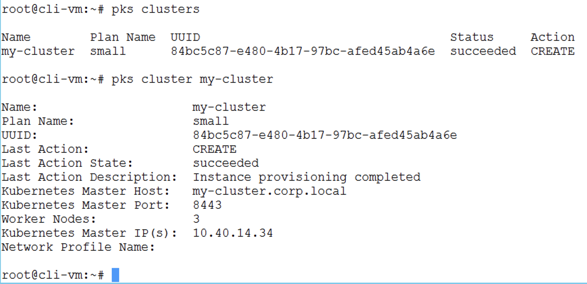
</details>
<br/>


### Deploy a Kubernetes Cluster **(Do Not Execute)**
The following command shows you how to deploy a k8s cluster. **(This command will fail if you run it.)**  Due to time and resource constraints, only one cluster can be created in this environment.
```
pks create-cluster  my-cluster --external-hostname my-cluster.corp.local -p small -n 2
```
The IP address (10.40.14.34) comes from a pool of routable IPs that are defined at PKS deployment.  It is the endpoint API for the created cluster.   Note the Plan Name: "small". Administrators can create plans that will define the resources and configuration for the VMs that make up the cluster nodes.  Plans can also include Kubernetes Yaml specification files to automatically deploy specific configuration to the cluster at deployment time.  As an example, if you wanted to configure a specific monitoring or logging solution, you could include its yaml specification in the Plan.


# Cluster Scale, Health Monitoring and Troubleshooting
In this section we will see how PKS allows the addition of more resources to a cluster by scaling out the number of Worker nodes.  We will test cluster resiliency by killing one of the nodes and dig into some Bosh commands to monitor and troubleshoot the cluster.

Finally, you will see the integration between PKS deployed clusters and vRealize Log Insight.  PKS deployed cluster events are tagged with relevant information that can then be used in searches once the events are aggregated into Log Insight.

### Scale Cluster With PKS **(Do Not Execute)**
PKS allows clusters to be scaled out with a single CLI command.  In this lab environment we will not execute the command because of resource and time constraints.  So please do not execute!!
<details><summary>Resize Cluster</summary>
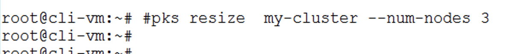
</details>
This command will cause a new worker node VM to be provisioned and the kubelet will be registered with the kubernetes master.  It becomes very easy to add resources on demand.

### Health Monitoring
PKS provides monitoring of services running in the Cluster VMs, as well as the VMs themselves.  Let's see what happens when we power off one of the worker nodes.

We are going to use the Bosh CLI directly to monitor this activity.

1. ssh into ops manager using the following command. The password is "VMware1!"
    ```
    $ ssh ubuntu@opsman
    ```
    <details><summary>Ops Manager login</summary>
    
    </details>
2. export bosh credentials ( you may need to update the client secret from ops manager credentials https://opsman.corp.local/api/v0/deployed/director/credentials/bosh_commandline_credentials )
    ```
    $ export BOSH_CLIENT=ops_manager BOSH_CLIENT_SECRET=w6b4Hkp_JoJv2iGA6x4WF3MnciQJHXQQ BOSH_CA_CERT=/var/tempest/workspaces/default/root_ca_certificate BOSH_ENVIRONMENT=172.31.0.2 bosh
    ```
    <details><summary>Export BOSH Credentials</summary>
    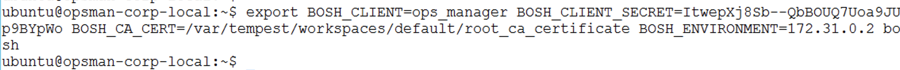
    </details>
3. list bosh deployments
    ```
    $ bosh deployments
    ```
    <details><summary>BOSH Deployments</summary>
    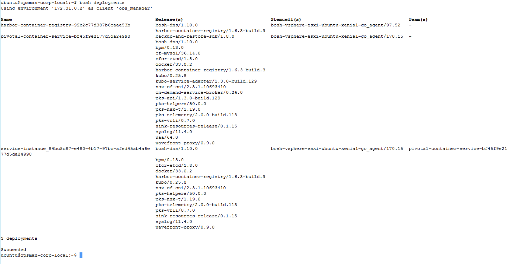
    </details>
    </br>

Each Kubernetes cluster that we create is considered a Bosh deployment.  A detailed discussion of Bosh is beyond the scope of this lab, but it's important to know that the PKS api is abstracting calls to the underlying Bosh api.   The deployment that starts with "Service-instance" is our cluster.  Note that both Harbor and PKS itself are bosh deployments and can be monitored as well.

Now we want to see the individual instances (VMs) that make up this deployment.
1. Run the following command to list the VMs created for your deployment.
    ```
    $ bosh -d service-instance_<insert your service instance from previous command> instances
    e.g. bosh -d service-instance_cfc60a5a-1022-4c9a-ac22-8e9aeffca169 instances
    ```
    <details><summary>BOSH Instances</summary>
    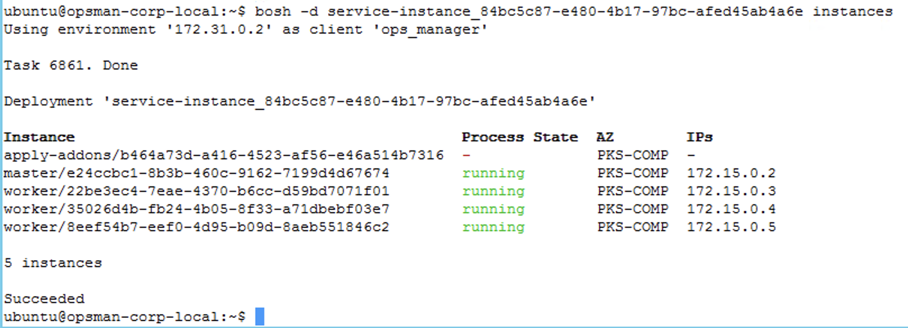
    </details>
2. Choose the last worker node and Note the IP address(172.15.0.5) so you can find the VM in vCenter.

    Notice that all of the VMs are "Running".  We are going to power one of the worker nodes down.


### Connect to vCenter UI
1. Click on *Google Chrome*
2. Select *HTML5 Client*
3. Check *Use Windows session authentication*
4. Click *Login*

    <details><summary>Login to vCenter</summary>
    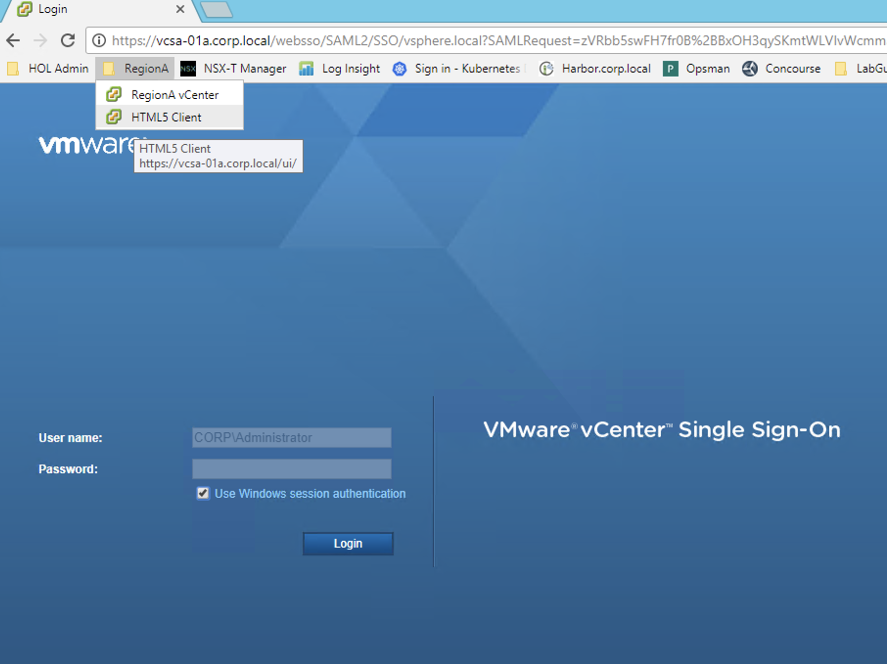
    </details>

### Find Worker VM To Power Off
1. Click *Hosts and Clusters View*
2. Expand *PKS Resource Pool*
3. Find VM that matches the IP

    <details><summary>Find VM</summary>
    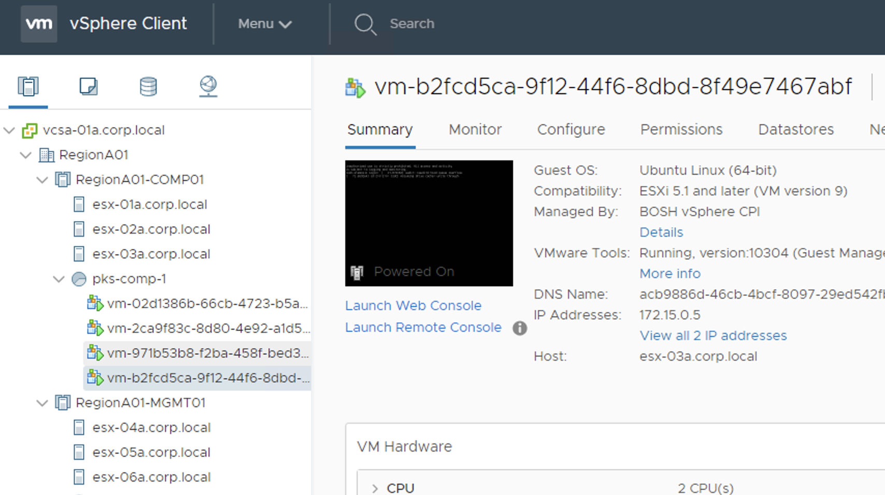
    </details>

### Power Off VM
Now we will power off the VM.  Note: In this lab environment you must power off a Worker node, not the Master node.  PKS supports recovering the Master but we have not set that up in this lab.
1. Right click on the *VM*, select *Power*, then *Power Off*
    <details><summary>Power off VM</summary>
    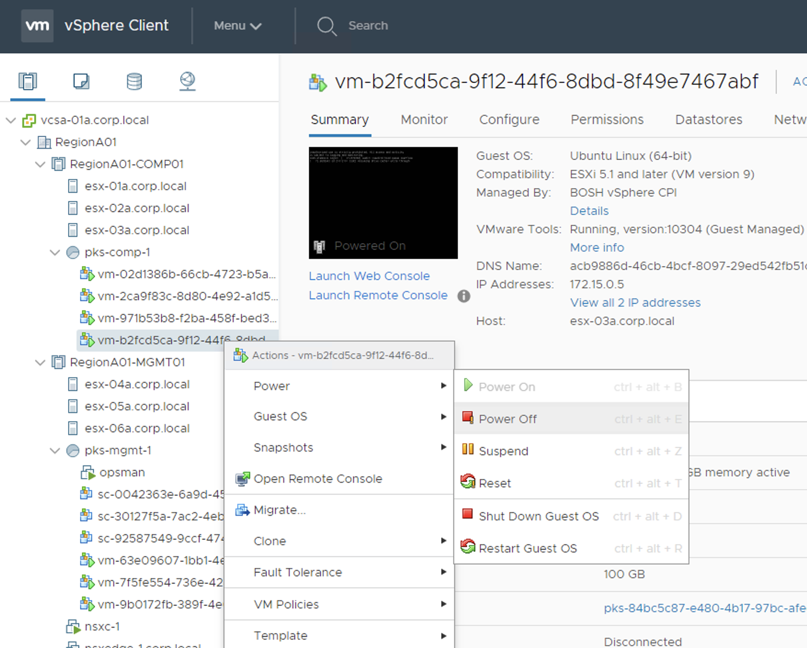
    </details>

### Monitor With Bosh
Return to the cli-vm you were using previously

1. Run the following command to monitor the status of the deployment
    ```
    $ bosh -d service-instance_84bc5c87-e480-4b17-97bc-afed45ab4a6e instances
    ```
    In a few seconds after the power off, Bosh detects that the Agent running on that VM is unresponsive. It should take about 5 minutes to restart the VM, start the kubernetes services and register the kubelet with the master.  You can return to vCenter and watch recent tasks to see the VM Power On and Reconfig tasks
    <details><summary>Deployment Status</summary>
    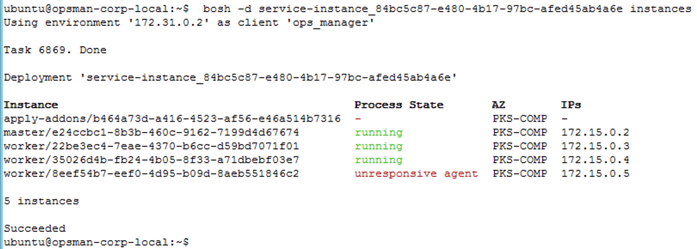
    </details>


### Find The Bosh Task
1. Execute the following command to fetch the task ID of the currently running bosh task
    ```
    $  bosh tasks
    ```
2. Use the task ID from 1 to check exactly what bosh is doing. In your case, the task id might be different than 6867
    ```
    $  bosh task 6867
    ```
    <details><summary>BOSH task</summary>
    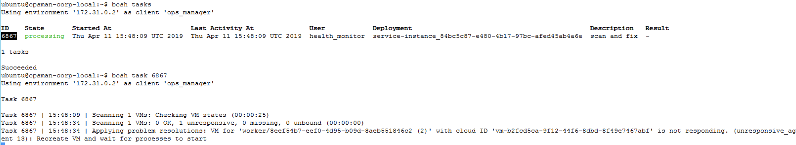
    </details>
3. After waiting couple of minutes, check the status of the deployment again to verify the worker node has been automatically repaired by BOSH
    ```
    $ bosh -d service-instance_84bc5c87-e480-4b17-97bc-afed45ab4a6e instances
    ```
    <details><summary>Deployment Status</summary>
    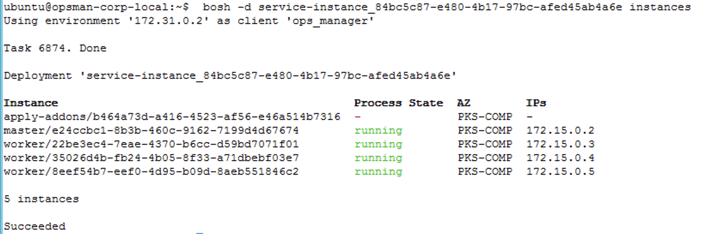
    </details>

### Additional Troubleshooting With Bosh
```
$ bosh ssh -d service-instance_84bc5c87-e480-4b17-97bc-afed45ab4a6e worker/01

$ bosh logs -d service-instance_84bc5c87-e480-4b17-97bc-afed45ab4a6e

$ bosh instances -i

$ bosh instances -p
```

### vRealize Log Insight
Pivotal Container Service (PKS) can be configured to forward logs to any syslog endpoint, but using vRealize Log Insight provides additional integration.  Logs are aggregated via FluentD, tagged with relevant information - like Bosh deployment, namespace, pod, container - and shipped to Log Insight.  PKS supports capturing the Node system logs, Kubernetes cluster events and Stderr/Stdout from the pods themselves. In this lab, LogInsight is disabled. Please ask the instructor for further information on turning on vRLI Integration.


# NSX Networks
PKS includes software defined networking with NSX.  NSX supports logical networking from the Kubernetes cluster VMs to the pods themselves providing a single network management and control plane for your container based applications.  This section will not be an exhaustive look at all of the NSX Kubernetes integration - for that check our lab HOL-1926-02-NET - but will focus on a few examples.  

### Get Kubernetes Credentials
The login credentials for our cluster are stored in PKS.  The get credentials command updates the kubectl CLI config file with the correct context for your cluster. Run the following command on the cli-vm(You might need to exit from opsman).
```
$ pks get-credentials my-cluster
```
<details><summary>Get Kubernetes Credentials</summary>
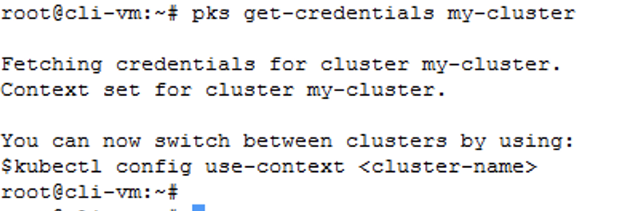
</details>


### Namespaces
PKS deployed clusters include an NSX system component that is watching for new namespaces to be created.  When that happens, NSX creates a new Logical Switch and Logical Router, and allocates a private network for pods that will later be attached to that switch.  Note that the default is to create a NAT'd network, however you can override that when creating the namespace to specify a routed network.  Let's see what happens when we create a namespace.
<details><summary>NSX/k8s High level Topology</summary>
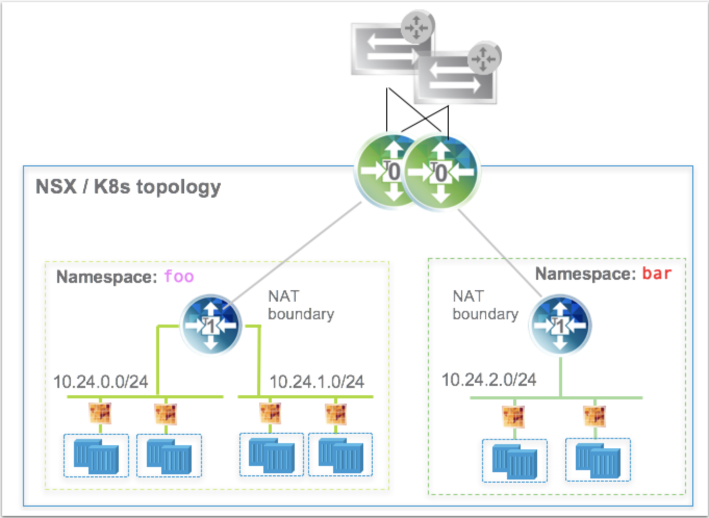
</details>
 
 ### Create Namespace
 We will now create a new namespace

```
$ kubectl create namespace demo

$ kubectl get namespaces
```
<details><summary>Create k8s namespaces</summary>
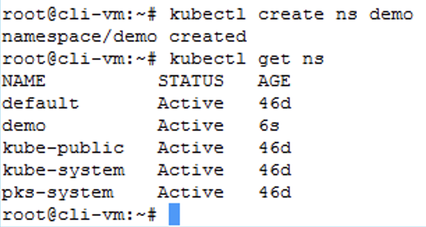
</details>

### View New Objects With NSX-Mgr
1. Click on Google Chrome Browser
2. Click on NSX-Mgr bookmark
3. Enter **Username**: *admin*  **Password**:  *VMware1!*
4. Click Log in
<details><summary>NSX Login</summary>
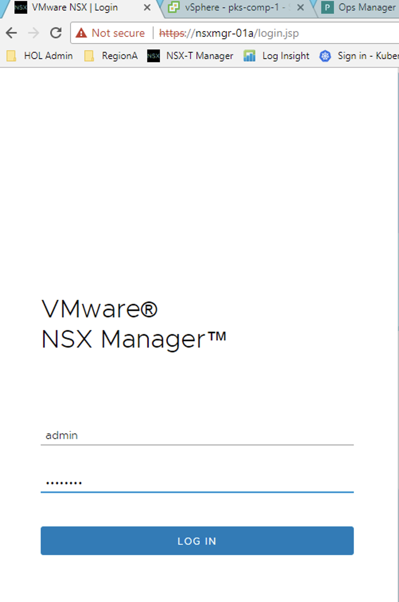
</details>


### View Automatically Created Logical Router
The T1 routers are created for each k8s namespaces and the *demo* T1 router was automatically added when we created the *demo* Namespace.  If you click on Switching you would see a similar list of Logical Switches.  When pods are deployed, Ports are created on the appropriate switch and an IP from the pool is assigned to the pod.  Also note that each PKS deployed Kubernetes cluster gets its own T1 Router/Switch and Network segment for the cluster nodes.

1. <details><summary>Click on Routing</summary>
    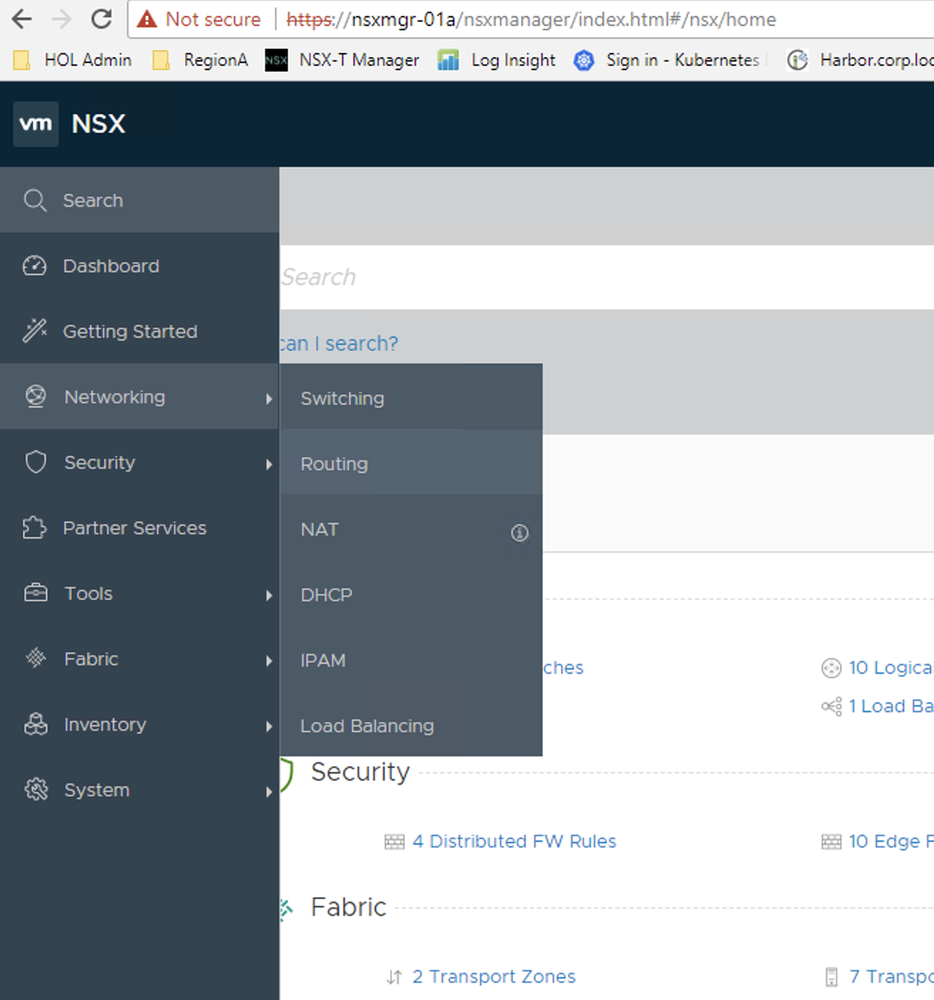
    </details>
2. <details><summary>Click on T1 Router created for the demo namespace</summary>
    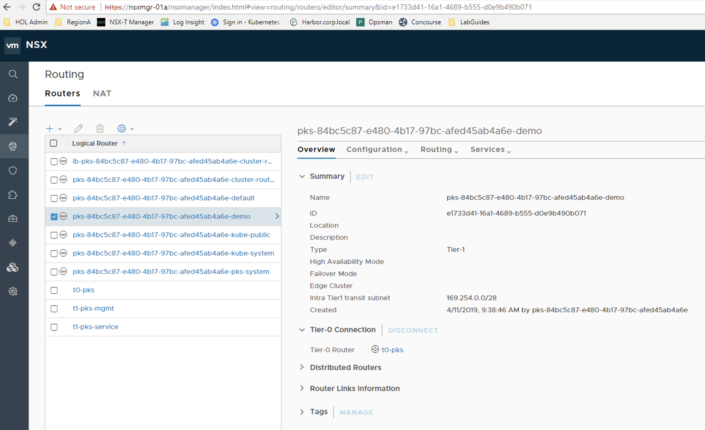
    </details>

 
#  Consuming Containerized Applications with Docker
### Running Nginx with Docker
1. From the `cli-vm` prompt, enter the command below and observe the command output
    ```bash
    docker run -p 8080:80 --name=my-nginx -d nginx
    ```

    <details><summary>Screenshot 1</summary>
    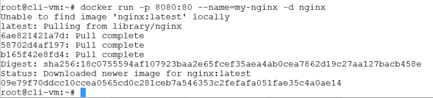
    </details>
    <br/>

2. From the Main Console (ControlCenter) desktop, open the chrome browser and navigate to `http://cli-vm.corp.local:8080/`. Your NGINX Server should now be running

    <details><summary>Screenshot 1.2</summary>
    
    </details>
    <br/>

3. Resume your putty session with `cli-vm` and from the prompt, enter the command `docker exec -it my-nginx /bin/bash` to open a bash shell on your nginx container

    <details><summary>Screenshot 3</summary>
    
    </details>
    <br/>

4. From the prompt, enter the following commands and observe the output

    ```bash
    echo "to be or not to be, that is the question" >> /usr/share/nginx/html/index.html
    cat /usr/share/nginx/html/index.html
    ```

    <details><summary>Screenshot 4</summary>
    
    </details>
    <br/>

5. From the prompt, install the curl utility with the following commands - you will use this in the next step to verify your nginx web server response

    ```bash
    curl
    apt-get update
    apt-get install curl
    ```

    <details><summary>Screenshot 5</summary>
    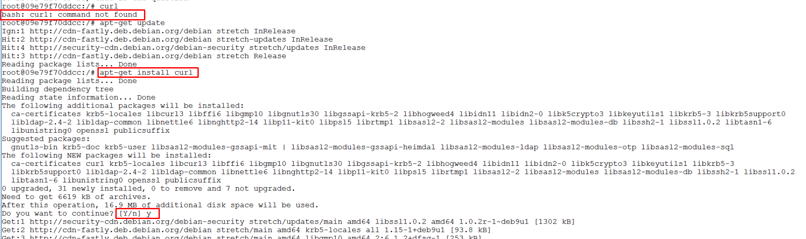
    </details>
    <br/>

6. From the prompt, enter the command `curl http://localhost` verify that your nginx server response includes the additional line of text you added to the index.html file

    <details><summary>Screenshot 6</summary>
    
    </details>
    <br/>

7. From the Main Console (ControlCenter) desktop, resume your chrome browser session with `http://cli-vm.corp.local:8080/` and refresh the page. You should now see the text you added to the index.html file on the page per the screenshot below

    <details><summary>Screenshot 7</summary>
    
    </details>
    <br/>

8. Resume your putty session with `cli-vm`. If you are still logged into the bash prompt for your my-nginx container, enter the `exit` command and ensure you return to the `cli-vm` prompt. Enter the following commands to stop and delete your my-nginx container:

    ```bash
    docker stop my-nginx
    docker ps
    docker rm my-nginx
    ```

    <details><summary>Screenshot 8</summary>
    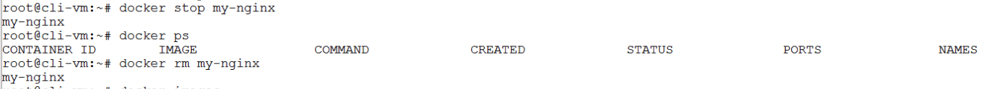
    </details>
    <br/>

9. From the Main Console (ControlCenter) desktop, open a new tab in the chrome browser and connect to `https://github.com/nginxinc/docker-nginx/blob/master/mainline/alpine-perl/Dockerfile/` to observe a sample dockerfile maintained by the nginx community to build a complete nginx image from the ground up, starting with a minimal alpine container, and then installing only the dependencies and default configurations required to run an nginx server. As you saw earlier in step 1.1.2, you were able to deploy this entire configuration by running the `docker run nginx` command with a few configuration flags. The ability to download a pre-configured image is similar to downloading an ova file, except containerized formats are generally simpler, smaller and faster.

    <details><summary>Screenshot 9</summary>
    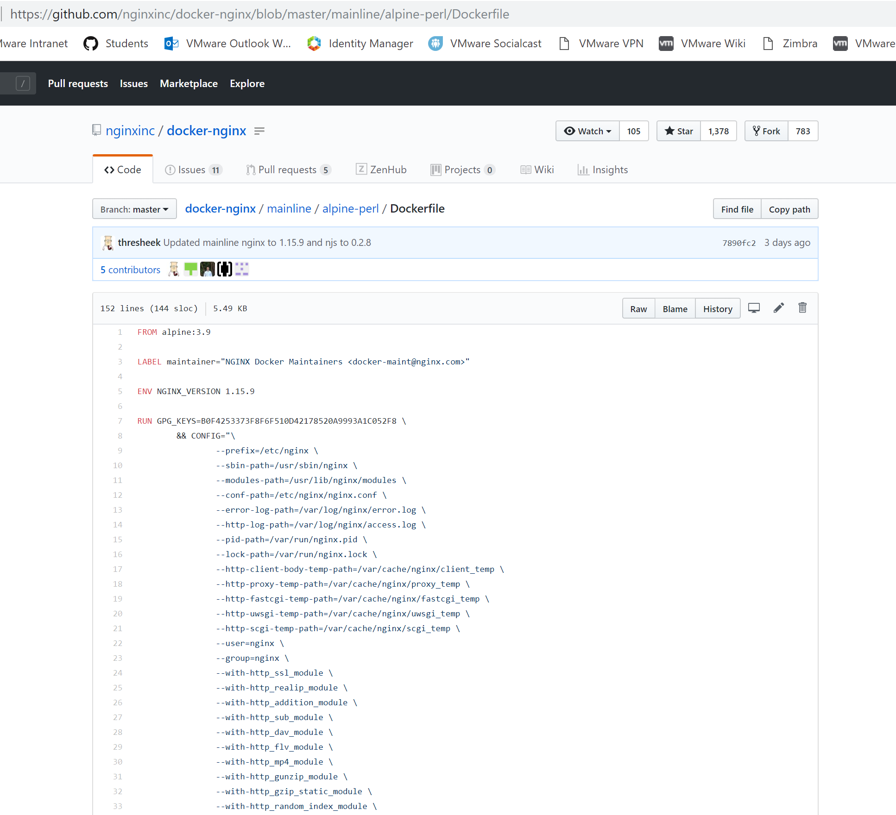
    </details>
    <br/>


#  Create a custom Docker Image

1. In this step you will create a dockerfile which you will build to create a new nginx container named `custom-nginx` that includes the configuration you created for the `my-nginx` container in the previous steps

    <details><summary>Using Nano text editor</summary>
    
    Make the `~/custom-nginx` directory and use the nano text editor to create the `~/custom-nginx/dockerfile` file with the following commands:

    ```bash
    mkdir ~/custom-nginx
    cd ~/custom-nginx
    nano dockerfile
    ```

    In the nano text editor, enter or copy and paste the following text:

    ```text
    FROM nginx

    RUN apt-get update
    RUN apt-get install -y curl
    RUN echo 'to be or not to be, that is the question' >> /usr/share/nginx/html/index.html
    ```

    Press the `ctrl + o` keys and hit the `Enter` key to save the file, and then press `ctrl + x` keys to exit nano

    Confirm the newly created dockerfile was updated and saved correctly with the `cat dockerfile` command.
    The contents of the dockerfile will print to the terminal.
    
    ```bash
    cat dockerfile
    ```
    The `cat dockerfile` command will print the contents of the dockerfile to the terminal.

    <details><summary>Nano Screenshots</summary>
    Launch nano
    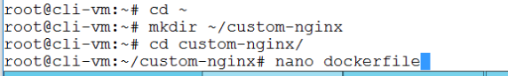
    Type or paste new text
    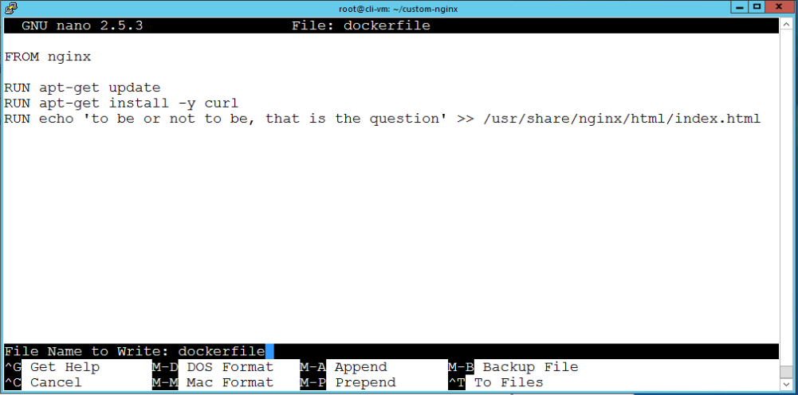
    cat command to verify contents of dockerfile
    
    </details>
    <br/>

    </details>
    Optional method
    <details><summary>Using vi text editor</summary>
    
    Make the `~/custom-nginx` directory and use the vi text editor to create the `~/custom-nginx/dockerfile` file with the following commands:

    ```bash
    mkdir ~/custom-nginx
    cd ~/custom-nginx
    vi dockerfile
    ```

    In the vi text editor, press the `i` key to enter insert mode. Type or copy and paste the following text:

    ```text
    FROM nginx

    RUN apt-get update
    RUN apt-get install -y curl
    RUN echo 'to be or not to be, that is the question' >> /usr/share/nginx/html/index.html
    ```

    Press the `esc` key to exit insert mode.  Type `:wq!` to save the file and exit vi editor.

    Confirm the newly created dockerfile was updated and saved correctly with the `cat dockerfile` command.
    The contents of the dockerfile will print to the terminal.

    ```bash
    cat dockerfile
    ```
    <details><summary>vi Screenshots</summary>
    Launch vi
    
    New empty file named dockerfile
    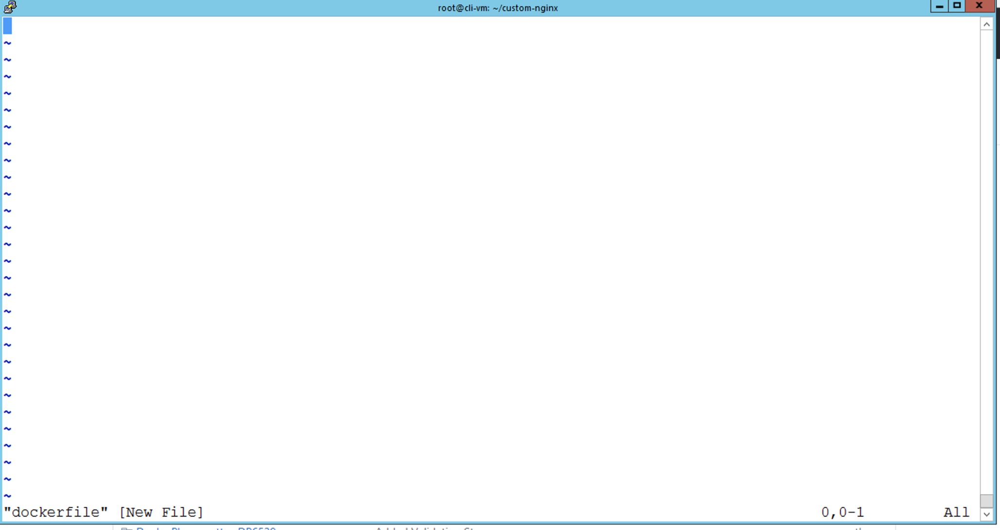
    i key puts vi in insert mode, type or paste new text in file
    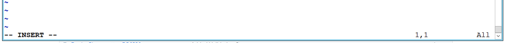
    Type :wq! to save file and quit vi editor
    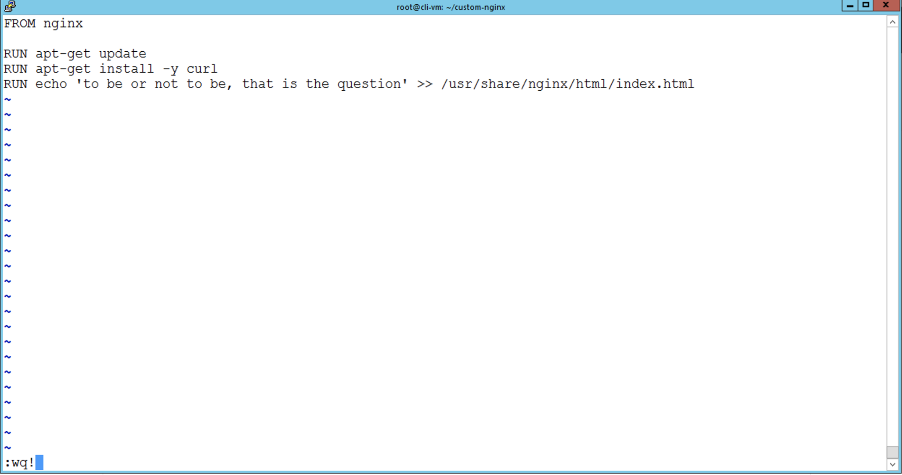
    cat command to verify contents of dockerfile
    
    </details>
    <br/>

    </details>
    <br/>

2. From the `cli-vm` prompt, enter the command `docker build . -t custom-nginx-image` to build an image using the dockerfile you created in the previous step, using the `-t` flag to tag the image with the name `custom-nginx-image`. 

    Observe that in the output, the docker build process will go through each of the commands in the dockerfile you created in the previous step, as shown in the following screenshot

    <details><summary>Screenshot 2</summary>
    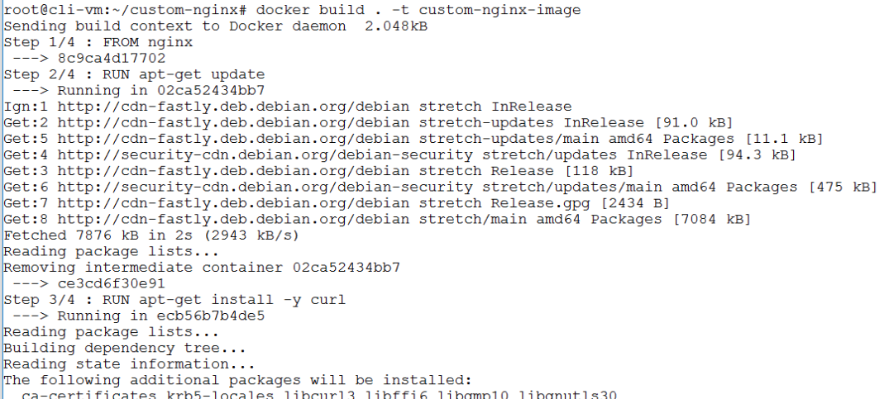

    ***Output Abbreviated for Brevity***
    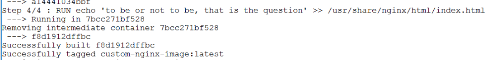
    </details>
    <br/>

3. From the `cli-vm` prompt, enter the command `docker images` and observe that you can see the `custom-nginx-image` you just created

    <details><summary>Screenshot 3</summary>
    
    </details>
    <br/>

4. From the `cli-vm` prompt, enter the command `docker run -p 8080:80 --name=custom-nginx -d custom-nginx-image` to start a new container named `custom-nginx` based on the `custom-nginx-image` you created in the previous steps, and enter the command `docker ps` to confirm the container is running

    <details><summary>Screenshot 4</summary>
    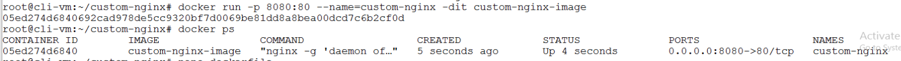
    </details>
    <br/>

5. From the `cli-vm` prompt, verify that your new image includes the curl utility, and that your nginx server is serving your modified index.html page with the following commands:

    ```bash
    docker exec -it custom-nginx /bin/bash
    curl http://localhost
    ```

    As the output validates, the `custom-nginx-image` container image includes the curl utility and custom nginx configuration you specified in the dockerfile you created

    <details><summary>Screenshot 5</summary>
    
    </details>
    <br/>

6. Resume your putty session with `cli-vm`. If you are still logged into the bash prompt for your my-nginx container, enter the `exit` command and ensure you return to the `cli-vm` prompt. From the `cli-vm` prompt, stop your `custom-nginx` container with the command `docker stop custom-nginx`, and verify your container has stopped with the `docker ps` command

    <details><summary>Screenshot 6</summary>
    
    </details>
    <br/>

### Distributing your images to docker hub

1. From the Main Console (ControlCenter) desktop, open a new tab in the chrome browser and connect to `https://hub.docker.com/` and login. If you do not have a docker hub account, create one now.

    Once you are logged into docker hub, click the `Create Repository +` link, and create a new repository with the following values:

    - Name: `custom-nginx-image`
    - Visibility: `Public`
    - click `Create` to create the repository

    <details><summary>Screenshot 1.3.1.1</summary>
    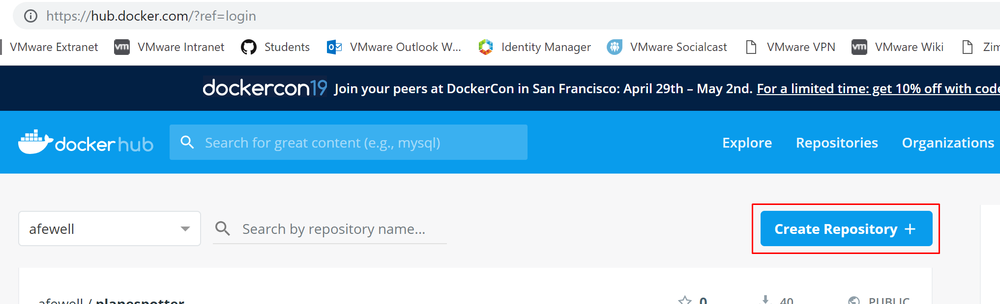
    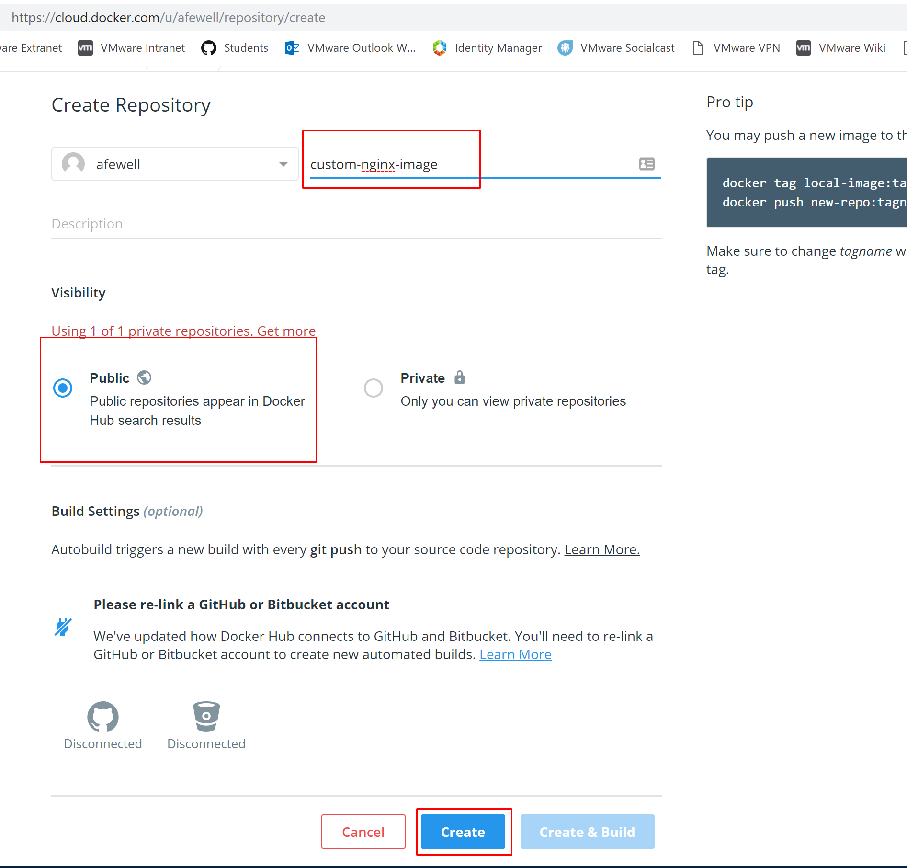
    
    </details>

2. Resume your putty session with `cli-vm`, from the prompt, add a tag to your `custom-nginx-image` to prepare it for upload, and then push your image to the new repository you created on docker hub with the following commands:

    **Note: Be sure to replace the string `YourDockerhubUsername` in the command below with your docker hub username**

    ```bash
    docker tag custom-nginx-image YourDockerhubUsername/custom-nginx-image:v1
    docker login #follow the prompts to log into your docker account
    docker push afewell/custom-nginx-image:v1
    ```

    <details><summary>Screenshot 2</summary>
    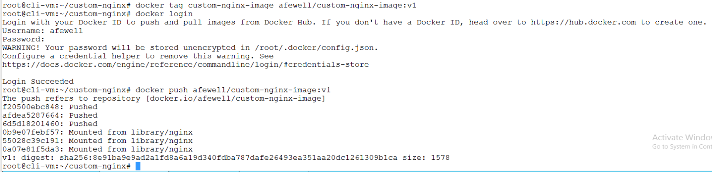
    </details>
    <br/>

3. From the Main Console (ControlCenter) desktop, resume your chrome browser connection `https://hub.docker.com/`, return to your `custom-nginx-image` repository page, and observe that the image you uploaded with the `v1` tag is now available in the repository. As this is a public repo, you can now use this repository to distribute your custom image to any docker client with access to docker hub.

    <details><summary>Screenshot 3</summary>
    
    </details>
    <br/>

4. Delete the local copies of your `custom-nginx-image` with the following commands:

    **Note: Be sure to replace the string `YourDockerhubUsername` in the command below with your docker hub username**

    ```bash
    docker images
    docker rmi -f YourDockerhubUsername/custom-nginx-image:v1
    docker rmi -f custom-nginx-image
    docker images
    docker rm custom-nginx
    docker ps -a
    ```

    <details><summary>Screenshot 4</summary>
    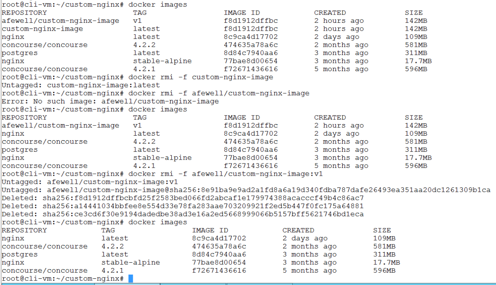
    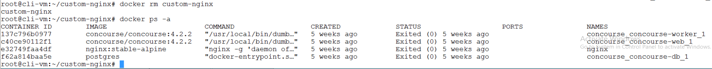
    </details>
    <br/>

5. Enter the command `docker run -p 8080:80 --name=custom-nginx -d YourDockerhubUsername/custom-nginx-image:v1` which will first check to see if your custom image is in your local docker cache, and since it is not will search the default search location (docker hub), pull the image to the local image cache, and run a container from the image.

    **Note: Be sure to replace the string `YourDockerhubUsername` in the `docker run` command with your docker hub username**

    <details><summary>Screenshot 5</summary>
    
    </details>
    <br/>

6. Confirm that your `custom-nginx-image` that you pulled from docker hub is working as expected, and clean up your environment with the following commands:

    **Note: Be sure to replace the string `YourDockerhubUsername` in the command below with your docker hub username**

    ```bash
    docker ps
    docker exec -it custom-nginx /bin/bash
    curl http://localhost
    exit
    docker stop custom-nginx
    ```

    <details><summary>Screenshot 6</summary>
    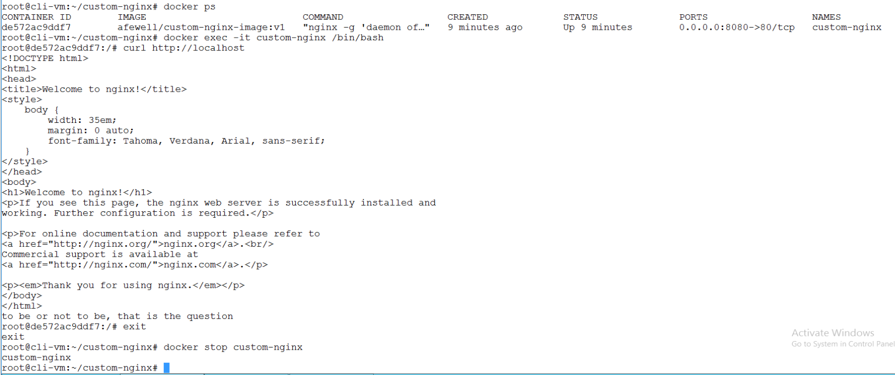
    </details>
    <br/>

### Consuming containerized applications from github

A large number of popular applications are hosted on github, many of which are well maintained by vendors or communities. End users can utilize popular github repositories to access a broad array of software and put it to use to provide value for organizational or personal projects

1. From the `cli-vm` prompt, enter the following commands to clone the planespotter application files from github.com to a local directory:

    *Note: you can view the planespotter repository in a browser at [https://github.com/CNA-Tech/planespotter](https://github.com/CNA-Tech/planespotter)*

    ```bash
    mkdir ~/cloned
    cd ~cloned
    git clone https://github.com/CNA-Tech/planespotter.git
    ```

    <details><summary>Screenshot 1</summary>
    
    </details>
    <br/>

2. Navigate to the subdirectory for the planespotter frontend application, which provides the files to build a custom nginx based frontend for the planespotter app, and review the Dockerfile for the frontend app with the following commands:

    ```bash
    cd ~/cloned
    ls planespotter/
    cd planespotter/frontend
    ls
    cat Dockerfile
    ```

    <details><summary>Screenshot 2</summary>
    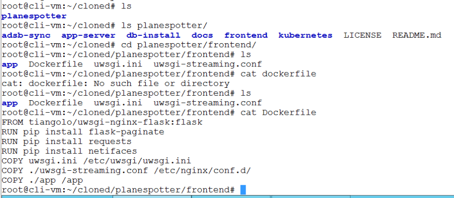
    </details>
    <br/>

3. From the `cli-vm` prompt, build the planespotter frontend container image and tag it with the name `planespotter-frontend` with the command `docker build . -t planespotter-frontend`

    <details><summary>Screenshot 3</summary>
    

    ***Output Abbreviated for Brevity***
    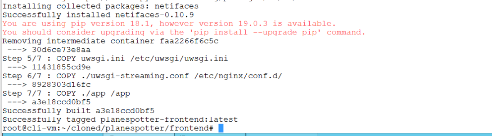
    </details>
    <br/>

4. Run the planespotter-frontend server with the command `docker run -p 8080:80 --name=planespotter-frontend-container -d planespotter-frontend` and verify it is running with the `docker ps` command.

    <details><summary>Screenshot 4</summary>
    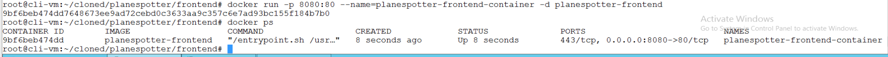
    </details>
    <br/>

5. From the Main Console (ControlCenter) desktop, open a chrome browser session with `http://cli-vm.corp.local:8080/` and refresh the page. You should now see the planesotter frontend page.

    <details><summary>Screenshot 5</summary>
    
    </details>
    <br/>

6. Enter the following commands to clean up your `planespotter-frontend` containers in preparation for the following exercises

    ```bash
    docker stop planespotter-frontend-container
    docker rm planespotter-frontend-container
    docker rmi -f planespotter-frontend
    docker ps -a
    docker images
    ```

    <details><summary>Screenshot 6</summary>
    
    
    </details>
    <br/>

# Consuming Containerized and Cloud Native Applications with Kubernetes

### Review Planespotter Frontend Kubernetes Deployment

1. Resume your ssh session with `cli-vm` and from the prompt, enter the following commands to review the kubernetes manifest for the planespotter frontend application and edit the file to change the ingress host value from `planespotter.demo.yves.local` to `planespotter.corp.local` as shown in the following screenshot:

    ```bash
    cd ~/cloned/planespotter/kubernetes/
    nano frontend-deployment_all_k8s.yaml
    ```

    <details><summary>Screenshot 1</summary>
    
    
    </details>
    <br/>

2. Resume your ssh session with `cli-vm` and from the prompt, enter the following commands to deploy the planespotter frontend application using its kubernetes manifest:

    ```bash
    pks login -a pks.corp.local -u pksadmin -k -p VMware1!
    pks get-credentials my-cluster
    kubectl create ns planespotter
    kubectl config set-context my-cluster --namespace planespotter
    kubectl create -f frontend-deployment_all_k8s.yaml
    ```

    <details><summary>Screenshot 2</summary>
    
    </details>
    <br/>

3. Review the objects created by the planespotter `frontend-deployment_all_k8s.yaml` manifest with the following commands:

    ```bash
    kubectl get ns
    kubectl get deployments
    kubectl get pods
    kubectl get services
    kubectl get ingress
    ```

    Gather the ip address shown in the output of the `kubectl get ingress` command as shown in the screenshot below. The address in the screenshot below is `10.40.14.36`, the ip address of your ingress service may be different but should still be in the 10.40.14.x/24 subnet, if the ip address for your ingress is different, please use the ip address from your environment in the next step.

    <details><summary>Screenshot 3</summary>
    
    </details>
    <br/>

4. From the Main Console (ControlCenter) desktop, click the windows button, enter the value `dns` in the search box, and select the top result `DNS` as shown in the following screenshot to open DNS Manager.

    <details><summary>Screenshot 4</summary>
    
    </details>
    <br/>

5. In DNS Manager, expand `ControlCenter > Forward Lookup Zones`, right click on `corp.local`, and select `New Host (A or AAAA)...`

    <details><summary>Screenshot 5</summary>
    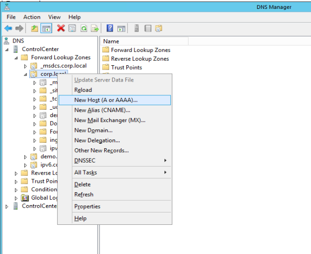
    </details>
    <br/>

6. In the `New Host` window, enter the following values to create an dns A record for planespotter.corp.local:

    - Name: `planespotter`
    - *Please be sure to use the ip address from your deployment from the output of `kubectl get ingress` in the preceeding steps*
    - IP Address: `10.40.14.36`
    - Uncheck `Create associated pointer (PTR) record
    - Click `Add Host` to add the new dns record for `planespotter.corp.local`

    <details><summary>Screenshot 6</summary>
    
    </details>

7. From the Main Console (ControlCenter) desktop, open a https browser session to `http://planespotter.corp.local` to see the planespotter frontend page.

    <details><summary>Screenshot 7</summary>
    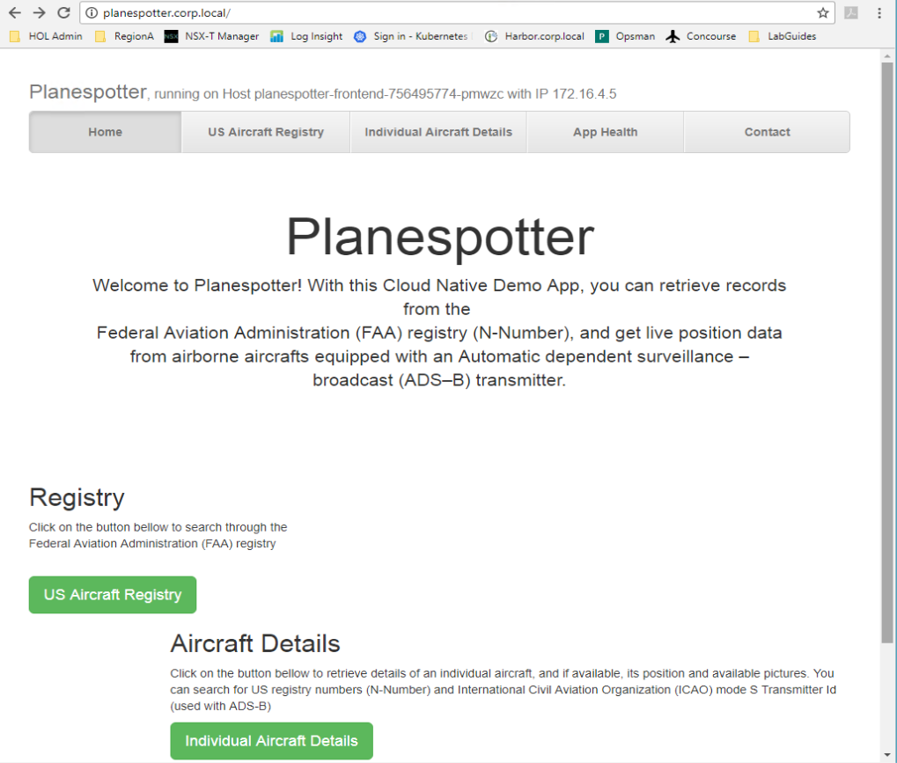
    </details>
    <br/>

### Deploy the complete planespotter application with Kubernetes

In addition to the frontend app, planespotter has 3 additional microservice applications that must be deployed to enable the complete planespotter application features. In this section, you will execute the additional commands required to deploy the remaining planespotter components, review the objects created to support the deployement, and review the planespotter application to validate its successful deployment and operation.

1. Resume your ssh session with `cli-vm` and from the prompt, enter the following commands to deploy the remaining components in the planespotter application:

    ```bash
    cd ~/cloned/planespotter/kubernetes
    kubectl create -f storage_class.yaml
    kubectl create -f mysql_claim.yaml
    kubectl create -f mysql_pod.yaml
    kubectl create -f app-server-deployment_all_k8s.yaml
    kubectl create -f redis_and_adsb_sync_all_k8s.yaml
    ```

    <details><summary>Screenshot 1</summary>
    
    </details>
    <br/>

2. Review the objects created by the planespotter manifests with the following commands:

    ```bash
    kubectl get pvc
    kubectl get deployments
    kubectl get pods
    kubectl get services
    kubectl get ingress
    ```

    <details><summary>Screenshot 2</summary>
    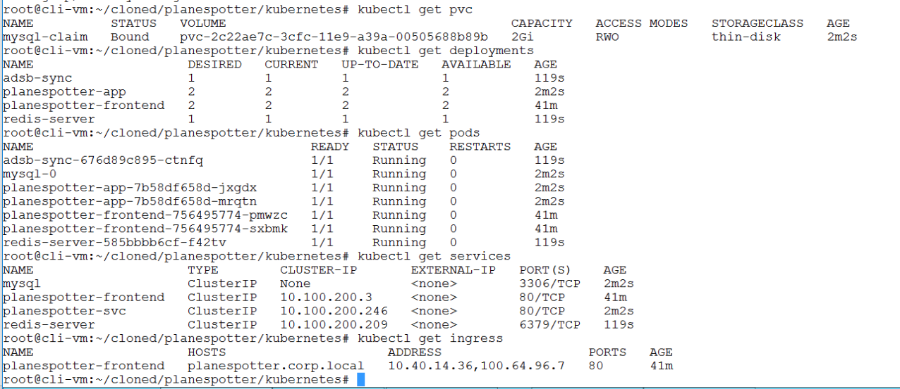
    </details>
    <br/>

3. From the Main Console (ControlCenter) desktop, open a https browser session to `http://planespotter.corp.local` to see the fully functional planespotter web app, click around on the various links to explore

    <details><summary>Screenshot 3</summary>
    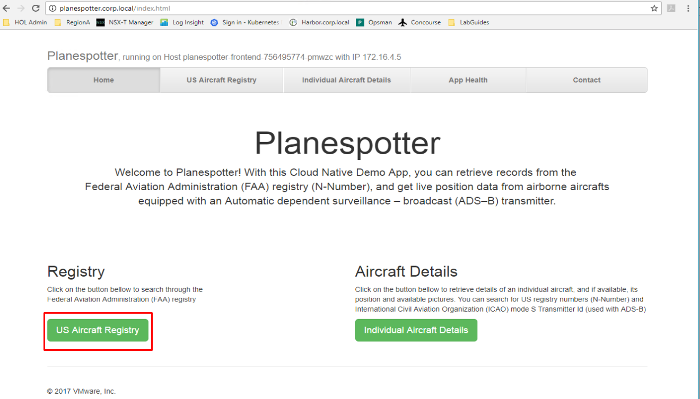
    
    
    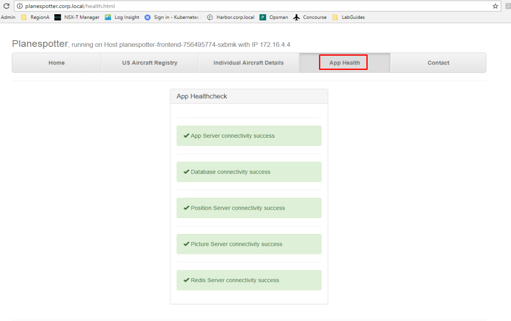
    </details>
    <br/>


4. Resume your ssh session with `cli-vm` and from the prompt, enter the following commands to clean up the planespotter application deployment in preparation for the subsequent exercises:

    ```bash
    cd ~/cloned/planespotter/kubernetes
    kubectl delete -f frontend-deployment_all_k8s.yaml
    kubectl delete -f mysql_pod.yaml
    kubectl delete -f storage_class.yaml
    kubectl delete -f mysql_claim.yaml
    kubectl delete -f app-server-deployment_all_k8s.yaml
    kubectl delete -f redis_and_adsb_sync_all_k8s.yaml
    kubectl delete ns planespotter
    ```

    <details><summary>Screenshot 2.2.4</summary>
    
    </details>
    <br/>


**Thank you for completing the Hands On Intro to PKS 101 Lab!**

- This Lab is Build on CNABU-PKS-Ninja-v11-clusterReady template
