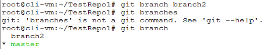
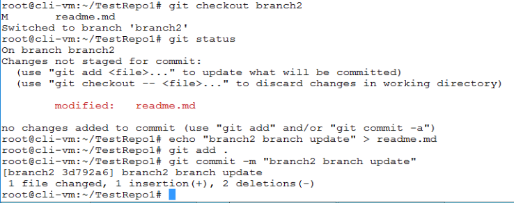
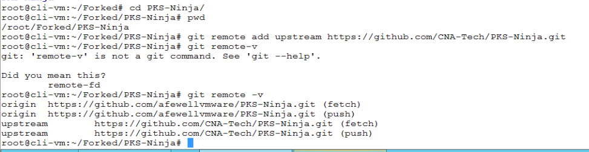
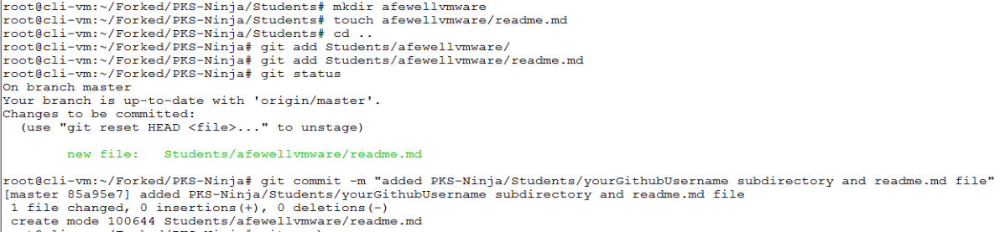

## Explore Git Branching, Merging and Forking 

1.1 Branching and Merging

New branches are typically used when 2 variations of the same file(s) are needed to be maintained for some reason. In some cases branches are used to seperate a simple update from main and may be deleted immediately. In other cases forks can be used to maintain files for older version of code, for example with PKS Ninja at the time of writing the current ninja template and the main branch of the ninja repo are on lab template version 11 for PKS 1.3, and there is a seperate v10 branch to maintain materials for the v10 template. There are a number of other cases where branchs can come in handy. As you will see in the following steps, the process of branching and merging provides powerful tools to simplify conflict resolution when merging branches and updating repositories.

1.1.1 From the `cli-vm` prompt enter the following commands to navigate to the `TestRepo1` directory, create create a new branch, and then view a list of branches to confirm the current branch set for your context

```bash
cd ~/TestRepo1
git branch branch2
git branch
```

Observe in the output of the `git branch` command that the new branch you created is listed. Also observe that there is an asterisk next to the `master` branch, which indicates your local context is still using the master branch

<details><summary>Screenshot 1.1.1</summary>

</details>
<br/>

1.1.2 From the `cli-vm` prompt, enter the following commands to create a new branch2.txt file in the `branch2` branch, stage and commit changes

```bash
git checkout branch2
git status
echo "branch2 branch update" > branch2.txt
git add .
git commit -m "added branch2.txt"
ls
```

<details><summary>Screenshot 1.1.2</summary>

</details>
<br/>

1.1.3 From the `cli-vm` prompt, enter the following commands to switch your context back to the master, create a master.txt file, stage and commit it, and view the `ls` command to show that the branch2.txt file is not present on the master branch

```bash
git checkout master
git status
echo "master branch update" > master.txt
git add .
git commit -m "master branch update"
ls
```

<details><summary>Screenshot 1.1.3</summary>

</details>
<br/>

1.1.4 From the `cli-vm` prompt, enter the following commands to merge branch2 back into the master branch

Note: After you enter the `git merge branch2` command, the nano text editor will launch automatically to prompt you to leave a commit message. You dont need to change any text in nano, simply save and close the file

```bash
git merge branch2
git status
ls
git push
```

Observe in the output of the `ls` command that the master branch now contains both the branch2.txt and the master.txt files

<details><summary>Screenshot 1.1.4</summary>

</details>
<br/>

1.1.5 Open a web browser connection to the root github page for your `TestRepo1` repository at `https://github.com/yourAccountName/TestRepo1`, and observe that you can now see the master.txt and branch2.txt files in the github repository

<details><summary>Screenshot 1.1.5</summary>

</details>
<br/>

### 1.2 Forking and Pull requests

The main use case for github is for users to be able to clone remote repositories and use the code for something or contribute code to a central repository

In step 1.2, you created a repository on github.com, cloned it to cli-vm, created and modified files locally and pushed them back to the repository in a very simple fashion. You were able to simply push to your repository because its yours and you dont have to worry about numerous different people trying to make commits, often without knowledge or coordination with one another

In shared repositories the maintainers generally cant allow any number of people to randomly commit updates to the repository, but often users want to save and distribute a version of the source project with some level of customization.  

Forking allows users to make their own seperate copy of a git repository with customizations both locally and to their own seperate github repo. Git also provides tools to keep a fork in sync with an upstream source repository

To fork or not to fork, that is the question
--

First, if you dont need to customize any files, you dont need to fork - simple

Next, when contributing to a shared github repository, there are generally requirements for any contributors to make any updates to their own forked copy and submit changes for central review via a "pull request" process. Regardless of whether contribution guidelines require forking or some other process, when contributing to a shared community you generally need to follow their defined process  

For many of the most common github use cases, there may be no need to push to a repository back to github. Even in cases where you need to modify files, it often works to clone a remote repository, make any needed changes to the local copy of the repository, and rely on the local copies without needing to push back to github

However there are many cases where a user benefits from maintaining a seperate customized copy or even a forked distribution

For example, typically when a user deploys github based code into runtime environments, the user needs to make some modification to the provided files. For example, the planespotter, nsx-t-datacenter and nsx-t-ci pipeline repositories all include sample parameter files that are meant to be customized even for standard deployments

Whether you simply want to keep an online github backup, leverage the central repository so you can easily access your fork from anywhere, or perhaps you may host a workshop or share a reference use case with others who may benefit from your customizations, forks are a great option. For many use cases, maintaining a fork can be as simple and reliable as cloning while offering a host of additional powerful benefits

While there are powerful simple use cases for forking, maintaining forked distributions of complex software can get extremely challenging. Complex use cases should not be entered into without thorough analysis and careful planning

So when should I fork?
--

The primary challenge in maintaining a forked distribution is the extent to which you may need to modify the source files, and there are many use cases where modifying source files is unnecessary

In many cases applications hosted in github repositories provide parameter or configuration files that need to be customized prior to deployment. Generaly these sorts of files are provided as sample templates, allowing the user to save a and use a local copy of the file saved under a unique filename

If your modifications fit these parameters, it is very straightforward to maintain as you can easily pull from upstream without directly forcing any updates or changes to your customized files. It is always possible that an update to source could impact any customized files you use so careful consideration should always be taken, however it is a best practice in cloud native development to minimize changes to configuration and parameter files in effort to simplify upgrades and code maintenance

In some cases, a repo may host code that requires users to modify parameters in a file that has to have a specific name and location in the repo. In cases like this, a user may be forced to modify source files to deploy the distribution, and in the event of updates it may be required to overwrite modified copies in your fork without a greater modification to the code base. This type of situation is not a best practice and should likely not be encountered in popular and well-maintained repositories

In other cases, you may desire to make other modifications, perhaps to source code or dependency files, to a forked repository that you intend to maintain over time. There is no simple yardstick for measuring the complexity of maintaining this type of fork as user experience can vary dramatically based on how each individual project is designed and maintained.

A good general rule of thumb however is that the more modifications, the more there is to maintain, and with more modifications its more likely that additional complexities may be encountered for code maintenance. A key consideration here are the developer practices of the project you want to fork, some projects have well-defined standards for developer integrations and modifications that can help to provide planning, awareness and support to help prepare and minimize the impact of code updates

Forking and Pull requests lab exercises
--

1.2.1 Open a web browser,  log into your github.com account and from the same tab, navigate to the PKS Ninja Repo at [https://github.com/cna-tech/pks-ninja](https://github.com/cna-tech/pks-ninja). Click the `Fork` button on the upper right hand corner of the page as shown in the screenshot below

Note to lab proctors: If your account is listed as an admin for the CNA-Tech or PKS-Ninja repos, you will not be able to fork the repo unless you login with a different account

<details><summary>Screenshot 1.2.1</summary>

</details>
<br/>

1.2.2 After the fork is completed, your browser will be redirected to the github page for the new forked repo. Click the `Clone or download' link and copy the url as shown in the screenshot below

<details><summary>Screenshot 1.2.2</summary>

</details>
<br/>

1.2.3 From the control center destop use putty to connect to `cli-vm` and enter the following commands to clone the repo. Note that first you will create a seperate directory for the forked clone in case anyone has cloned the source repo to their environment, this will prevent confusion. There is no requirement to have any special naming of folders where forked directories are cloned. 

Note: Be sure to replace the URL in the `git clone` command with the URL of your fork of the PKS-Ninja repo

```bash
mkdir ~/Forked
cd ~/Forked
git clone https://github.com/yourAccountName/PKS-Ninja.git # replace the url with the url to your fork of the PKS-Ninja repo
cd PKS-Ninja
```

<details><summary>Screenshot 1.2.3</summary>


</details>
<br/>

1.2.4 From the `cli-vm` prompt ensure you are in the `/root/Forked/PKS-Ninja` dirctory with the command `pwd` and connect your forked clone back to the source PKS-Ninja repository with the command `git remote add upstream https://github.com/CNA-Tech/PKS-Ninja.git`, and validate the upstream configuration with the command `git remote -v`

<details><summary>Screenshot 1.2.4</summary>

</details>
<br/>

1.2.5 From the `cli-vm` prompt, enter the following commands to create a new folder with your github username under the students directory and initialize a readme file in that folder

**Make sure you replace the string "yourGithubUsername" in the commands below with your unique github username**

```bash
ls
cd Students
mkdir yourGithubUsername
touch yourGithubUsername/readme.md
cd ~/Forked/PKS-Ninja/
```

<details><summary>Screenshot 1.2.5</summary>

</details>
<br/>

1.2.6 From the `cli-vm` prompt, enter the following commands to stage, commit and push these changes up to your forked github repository

**Make sure you replace the string "yourGithubUsername" in the commands below with your unique github username**

```bash
git add Students/yourGithubUsername/
git add Students/yourGithubUsername/readme.md
git commit -m "added PKS-Ninja/Students/yourGithubUsername subdirectory and readme. file"
git push origin master
```

<details><summary>Screenshot 1.2.6</summary>


</details>
<br/>

1.2.7 Open a web browser connection to the source PKS-Ninja repo at `https://github.com/cna-tech/pks-ninja` and click on `New Pull Request` as shown in the image below

<details><summary>Screenshot 1.2.7</summary>

</details>
<br/>

1.2.8 On the `Open a pull request` page, click on the `compare across forks` link and select CNA-Tech/PKS-Ninja as the `base fork` on the left and yourGithubUsername/PKS-Ninja as the head fork on the right and click `create pull request` as shown in the screenshot below

<details><summary>Screenshot 1.2.8</summary>

</details>
<br/>

1.2.9 After you submit the pull request, an administrator of the PKS-Ninja repo can visit the pull requests tab and merge the requested changes. The screenshot below shows an administrator-level view, you should also be able to view the pull request in the CNA-Tech/PKS-Ninja repository on the pull requests tab, but you will not have the rights to merge the pull request

<details><summary>Screenshot 1.2.9</summary>

</details>
<br/>

1.2.10 From your web browser, navigate to the [https://github.com/CNA-Tech/PKS-Ninja/tree/Pks1.4/Students](https://github.com/CNA-Tech/PKS-Ninja/tree/Pks1.4/Students) page. After an administrator merges your pull request, you should see a folder with yourGitHubUsername on this page

<details><summary>Screenshot 1.2.10</summary>

</details>
<br/>

**Thank you for completing the Exploring Git Branching, Merging and Forking Lab Guide!**