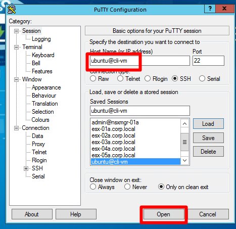
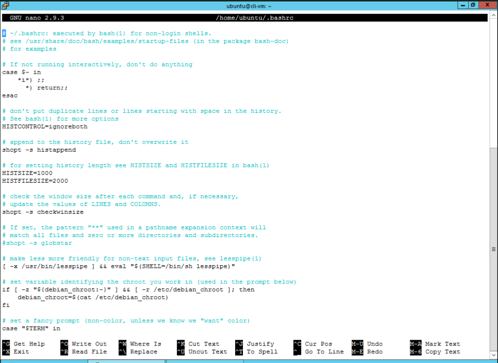
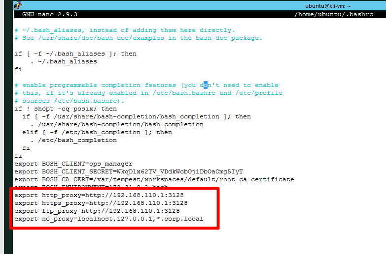
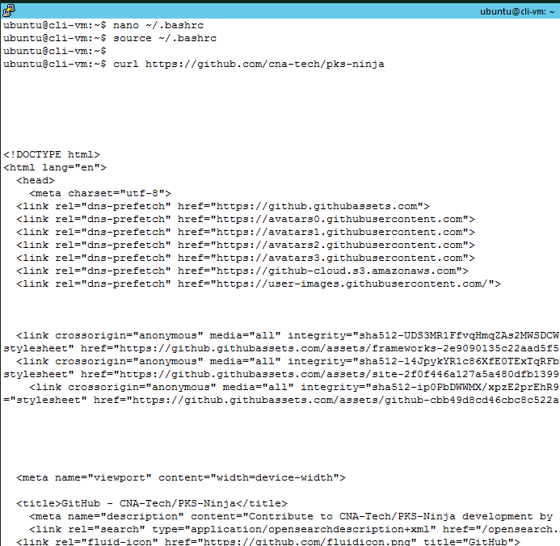
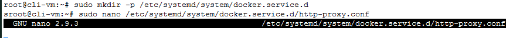
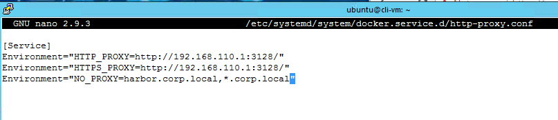
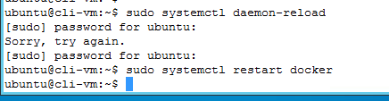
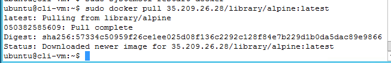

# HOL Pod Prep for PKS Ninja Labs

Many PKS Ninja Lab Guides that have been validated for the HOL-2031 lab environment require a common set of preparatory steps. Please follow the steps below to prepare your lab environment to enable successful completion of any guides that reference or link to this document. 

## 1.0 Prepare `cli-vm` to use the required HTTP/s Proxy

The HOL lab environment only permits limited internet access sufficient to complete exercises in any lab guides that have been prepared for HOL-2031 compatibility. Any host in the lab environment that needs to access the limited internet resources must use the lab proxy server. The following steps will show how to prepare the `cli-vm` ubuntu host to use the labs internet proxy. (The Control Center server is already preconfigured with the proxy server configuration)

1.1 From the Main Console (ControlCenter) desktop, open putty and under saved sessions, open a ssh connection to `ubuntu@cli-vm`

<details><summary>Screenshot 1.1</summary>

</details>
<br/>

1.2 From the `cli-vm` prompt, enter the commans `nano /home/ubuntu/.bashrc` to use the nano text editor to edit the .bashrc file for the ubuntu user on cli-vm. 

<details><summary>Expand to see explanation of this exercise</summary>
The .bashrc file is a special file that loads commands and environmental variables into the bash shell each time you open a new shell session (including ssh sessions) for the specified user with `cli-vm`. 

While it is possible to export the required environmental variables directly from the `cli-vm` prompt, exporting directly from the bash prompt only loads the environmental variables in the currently running session, so if you were to close your ssh session to `cli-vm`, or if the ssh session were to timeout, the environmental variables would no longer be populated the next time you connected to `cli-vm`. 

By placing the required environmental variables in the .bashrc file, it will ensure that the proxy configuration is still present each time you connect to `cli-vm` during your active session with a HOL-2031 pod. If at any point you end your HOL-2031 session or your lease times out and you need to re-enroll to launch a new HOL-2031 session, you will need to repeat these steps. (If your HOL-2031 session has a temporary timeout and allows you to "Resume your lab", you do not need to repeat these steps)
</details>

<details><summary>Screenshot 1.1</summary>

</details>
<br/>

1.3 In the nano editor, scroll to the very bottom of the .bashrc file, and enter the following lines at the very end of the file. After you have entered the following lines, enter the key combination `ctrl o` then hit the `enter` key to save the file, and then enter the key combination `ctrl x`to close the file.

```text
export http_proxy=http://192.168.110.1:3128
export https_proxy=http://192.168.110.1:3128
export ftp_proxy=http://192.168.110.1:3128
export no_proxy=pks.corp.local,localhost,127.0.0.1,*.corp.local
```

<details><summary>Screenshot 1.3</summary>

</details>
<br/>

1.4 From the `cli-vm` prompt, enter the command `source /home/ubuntu/.bashrc` to reload your updated .bashrc file, and then enter the command `curl https://github.com/cna-tech/pks-ninja` to verify that you can recieve http/s traffic from an approved site. 

Note that the exact output from the curl command is not important, it only matters that you are getting output and not an error message.

<details><summary>Screenshot 1.4</summary>

</details>
<br/>

**You have now setup the http/https/ftp proxy configuration for `cli-vm`**

## 2.0 Setup http proxy on docker client

In many PKS Ninja Lab Guides you will need to pull images to the PKS Ninja Labs public harbor server. In order to do this, you need to install the CA cert, Server cert and public key for the harbor server in specific locations to enable the docker client on `cli-vm` to be able to access the public harbor registry.

2.1 From the control center desktop, open a putty session to `ubuntu@cli-vm` and enter the following commands to make the required directory and file needed to configure the proxy settings:

```bash
sudo mkdir -p /etc/systemd/system/docker.service.d
sudo nano /etc/systemd/system/docker.service.d/http-proxy.conf
```

If needed enter the sudo password `VMware1!` when prompted.

<details><summary>Screenshot 2.1</summary>

</details>
<br/>

2.2  Paste the text below into the nano text editor on `cli-vm`

```text
[Service]
Environment="HTTP_PROXY=http://192.168.110.1:3128/"
Environment="HTTPS_PROXY=http://192.168.110.1:3128/"
Environment="NO_PROXY=harbor.corp.local,*.corp.local"
```

<details><summary>Screenshot 2.2</summary>

</details>
<br/>

2.3 From your putty session to `ubuntu@cli-vm` enter the following commands to apply the updated proxy settings:

```bash
sudo systemctl daemon-reload
sudo systemctl restart docker
```

<details><summary>Screenshot 2.3</summary>

</details>
<br/>

2.4 From your putty session to `ubuntu@cli-vm` enter the command `sudo docker pull 35.209.26.28/library/alpine:latest`  which pulls an apline image from the public harbor server to verify that your proxy configuration applied successfuly.

<details><summary>Screenshot 2.4</summary>

</details>
<br/>

**You have now setup the docker proxy configuration for `cli-vm`**