# Harbor Pipeline Install

The Harbor pipeline install generally follows the PKS pipeline install. If you have recently completed the pks pipeline install and still have a web browser to concourse open you can simply click on the `harbor-install-standalone` pipeline and kick it off, as detailed in the steps below

## Harbor Pipeline Kickoff

In this guide you will navigate to the Harbor Installation Pipeline in Concourse and start the pipeline

1.0 Before launching the Harbor install pipeline, configure the bosh trusted certificate service with the opsman root certificate, which will sign any bosh-deployed VMs including harbor with the opsman root ca, which ensures that PKS deployed K8s nodes will have the needed certificate installed to communicate with harbor automatically. 

From the Control Center desktop, open a web browser connection to Ops Manager and log in. Click on the `Bosh Director for vSphere` tile and navigate to the `Security` tab in the left hand column. On the `Security` tab, check the box for `Include OpsManager Root CA in Trusted Certs` and click save. Next go to the Opsman HomePage, click on `Review Pending Changes`, uncheck the box next to `Pivotal Container Service` and click `Apply Changes` per the screenshots below. 

You will need to wait until the bosh deployment is complete before you proceed to the next step.

<details><summary>Screenshot 1.0</summary>
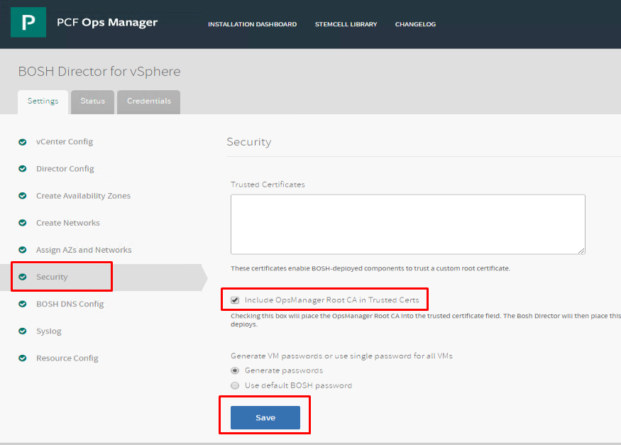
</details>
<br/>

1.1 From control center open a web browser navigate to the concourse URL

Note: If you are already logged in, your screen should resemble screenshot 1.1.2, and you can skip ahead to step 1.3. If you are not logged in your screen should resemble screenshot 1.1.1, then proceed with step 1.2

`http://cli-vm.corp.local:8080`

<details><summary>Screenshot 1.1.1</summary>

</details>

<details><summary>Screenshot 1.1.2</summary>
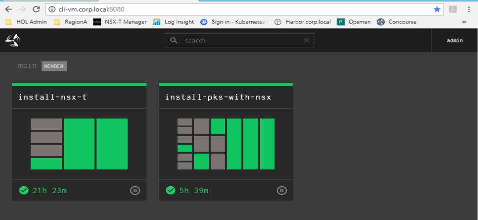
</details>
<br/>

1.2 If you are not already logged in, in the upper right-hand corner login to Concourse

```yaml
Username: admin
Password: VMware1!
```

Note: Early versions of the lab template used login `Username: nsx Password: vmware`

<details><summary>Screenshot 1.2.1</summary>

</details>

<details><summary>Screenshot 1.2.2</summary>
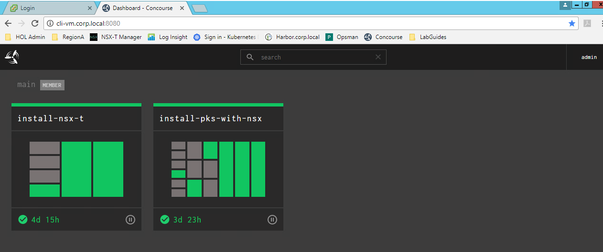
</details>
<br/>

1.3 Click on `install-pks-with-nsx` tile, click on the `harbor-install-standalone` pipeline, and then click on the `upload-harbor` task as shown in the following screenshots

<details><summary>Screenshot 1.3.1</summary>
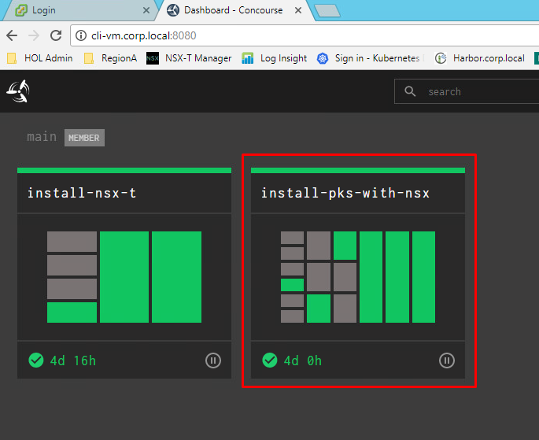
</details>

<details><summary>Screenshot 1.3.2</summary>
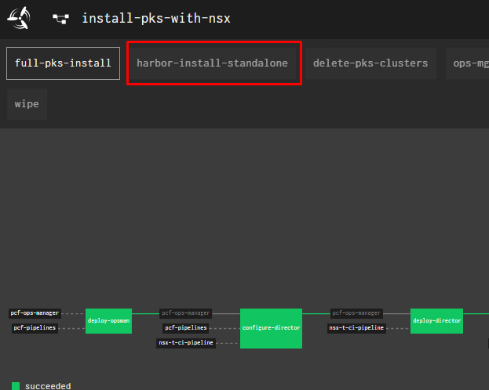
</details>

<details><summary>Screenshot 1.3.3</summary>
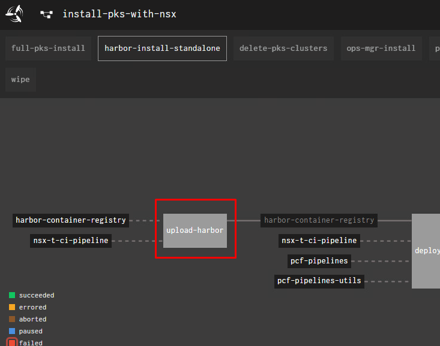
</details>
<br/>

1.4 On the upper right hand corner of the upload-harbor task screen, click the plus + icon to kick off the pipeline which only takes about 5 minutes to run, but it kicks off another ops manager deployment which takes ~45 minutes to run in the reference lab

<details><summary>Screenshot 1.4.1</summary>
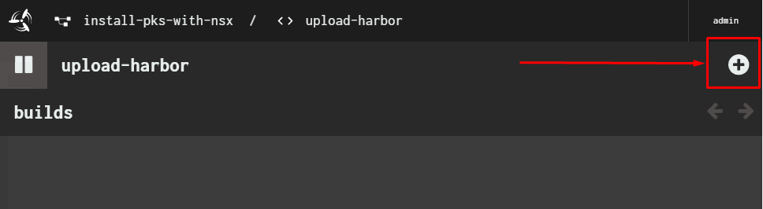
</details>

<details><summary>Screenshot 1.4.2</summary>
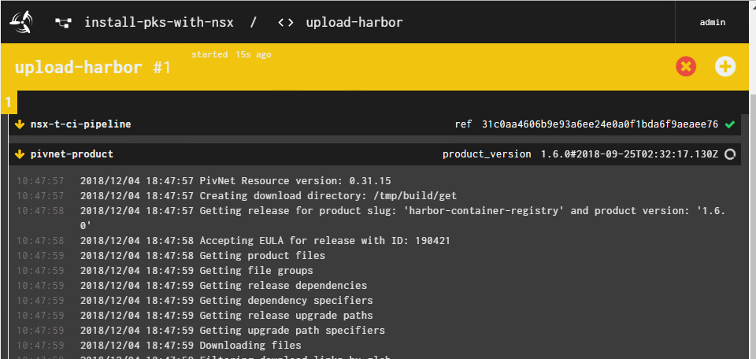
</details>

<details><summary>Screenshot 1.4.3</summary>
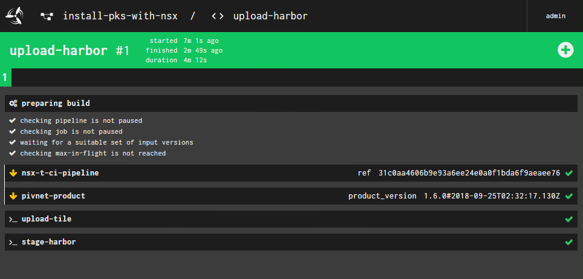
</details>
<br/>

1.5 Open a web browser connection to the Ops Manager UI using the Opsman bookmark in Chrome. Login using the following credentials:

```yaml
Username: admin
Password: VMware1!
```

You should see a blue bar that says `Applying Changes`.

Click on `Show Progress`. Note that the harbor installation will be complete once the changes are complete

<details><summary>Screenshot 1.5.1</summary>
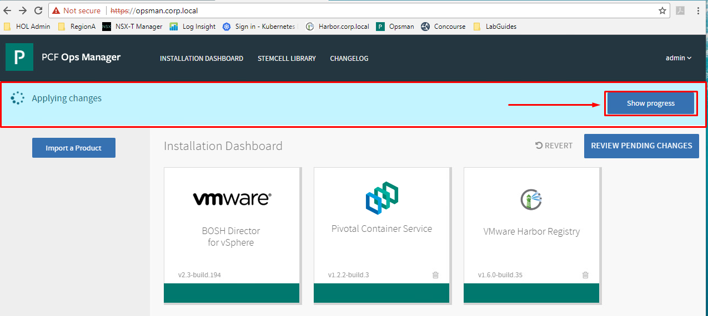
</details>

<details><summary>Screenshot 1.5.2</summary>

</details>

<details><summary>Screenshot 1.5.3</summary>
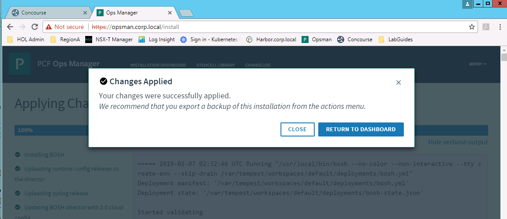
</details>
<br/>

Note: Early versions of the harbor pipeline staged the deployment in opsmanager, but did not start the deployment. If when you log into opsmanager the harbor deployment has not started, you may need to manually start the deployment by clicking on `Review Pending Changes` and then `Apply Changes`

## Troubleshooting

In some cases, the pipeline may encounter issues that prevent it from completing successfully. This may simply be due to resource limitations or other temporary environment constraints. An example of such a failure is shown in the following screenshot:

<details><summary>Screenshot 1.5.4</summary>
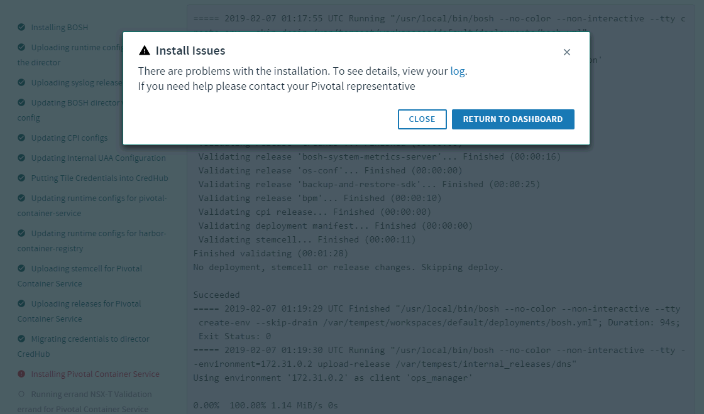
</details>
<br/>

If this screen appears for you, click the CLOSE button and scroll down to the end of the logs to review the issue. Here's a sample of the log file for the above screenshot:

```plain
===== 2019-02-07 01:26:40 UTC Running "/usr/local/bin/bosh --no-color --non-interactive --tty --environment=172.31.0.2 --deployment=pivotal-container-service-16049eb7b0e1b46de1a9 deploy /var/tempest/workspaces/default/deployments/pivotal-container-service-16049eb7b0e1b46de1a9.yml"
Using environment '172.31.0.2' as client 'ops_manager'

Using deployment 'pivotal-container-service-16049eb7b0e1b46de1a9'

 releases:
+ - name: harbor-container-registry
+   version: 1.6.3-build.3
 
 addons:
+ - jobs:
+   - name: harbor-dns-aliases
+     properties:
+       aliases:
+         harbor.corp.local:
+         - "<redacted>"
+         pks-uaa:
+         - "<redacted>"
+     release: harbor-container-registry
+   name: harbor-bosh-dns
+ - include:
+     deployments:
+     - harbor-container-registry-31d2d2540fb9f22c2d45
+   jobs:
+   - name: enable-bosh-dns
+     release: harbor-container-registry
+   name: enable-bosh-dns
Task 56
Task 56 | 01:26:42 | Preparing deployment: Preparing deployment (00:00:10)
Task 56 | 01:27:05 | Preparing package compilation: Finding packages to compile (00:00:00)
Task 56 | 01:27:06 | Updating instance pivotal-container-service: pivotal-container-service/084e0a90-bbcb-43e9-a434-56c3420608f4 (0) (canary) (00:02:49)
                  L Error: Action Failed get_task: Task 50a175b0-26ec-4d01-650c-4102b94e93be result: Stopping Monitored Services: Stopping services '[telemetry-server]' errored
Task 56 | 01:29:55 | Error: Action Failed get_task: Task 50a175b0-26ec-4d01-650c-4102b94e93be result: Stopping Monitored Services: Stopping services '[telemetry-server]' errored

Task 56 Started  Thu Feb  7 01:26:42 UTC 2019
Task 56 Finished Thu Feb  7 01:29:55 UTC 2019
Task 56 Duration 00:03:13
Task 56 error
Updating deployment:
 Expected task '56' to succeed but state is 'error'
Exit code 1
===== 2019-02-07 01:29:56 UTC Finished "/usr/local/bin/bosh --no-color --non-interactive --tty --environment=172.31.0.2 --deployment=pivotal-container-service-16049eb7b0e1b46de1a9 deploy /var/tempest/workspaces/default/deployments/pivotal-container-service-16049eb7b0e1b46de1a9.yml"; Duration: 195s; Exit Status: 1
Exited with 1.
```


If you experience a failure similar to the above, try applying changes again as follows:
1) Click INSTALLATION DASHBOARD
2) Click REVIEW PENDING CHANGES
3) Click APPLY CHANGES

If the problem persists, further troubleshooting may be required.