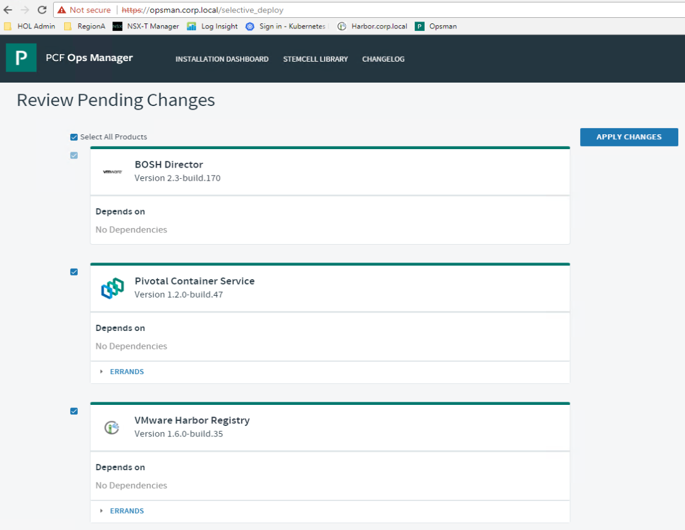

# Harbor Tile Installation

## Install Harbor

1.1 On a new browser tab, open a connection to the Ops Manager UI, click on `Import a Product` select the Harbor file and click `Open`. It can take a few minutes to import the Harbor file

Screenshot 1.1.1 

Screenshot 1.1.2 

 

1.2 In the left hand column of the Ops Manager homepage under `VMware Harbor Registry`, click on the `+` icon to add the Harbor tile to the `Installation Dashboard`

Screenshot 1.2 

 

1.3 Click on the `VMware Harbor Registry` tile to open its configuration settings

Screenshot 1.3 

 

1.4 Select the `Assign AZs and Networks` tab and enter the following values:

- Singleton Availability Zone: PKS-MGMT-1
- Balance other jobs in: PKS-MGMT-1
- Network: PKS-MGMT
- Click `Save`

Screenshot 1.4

 

1.5 Select the `General` tab and set the `Hostname` to `harbor.corp.local` , Click `Save`

Screenshot 1.5

 

1.6 Select the `Certificate` tab, select `Generate RSA Certificate`, enter `harbor.corp.local` and click `Generate`

Screenshot 1.6

 

1.7 On the `Certificate` tab, click `Save`

Screenshot 1.7

 

1.8 On the `Credentials` tab, set the `Admin Password` to `VMware1!` and click `Save`

Screenshot 1.8

 

1.9 On the `Resource Config` tab, set the `Persistent Disk Type` to `20 GB`

Screenshot 1.9

 

**STOP**: Before proceeding, ensure that the PKS tile deployment has completed.  There will be a blue bar across the top that will show `Applying Changes` and a button for `Show Progress` as it continues to apply

1.10 In the Ops Manager UI on the top menu bar click `Installation Dashboard`, next select `Review Pending Changes` and on the `Review Pending Changes`, select `Apply Changes`. Monitor the `Applying Changes` screen until the deployment is complete

Screenshot 1.10

 

**You have now completed the Harbor installation**

***End of lab***