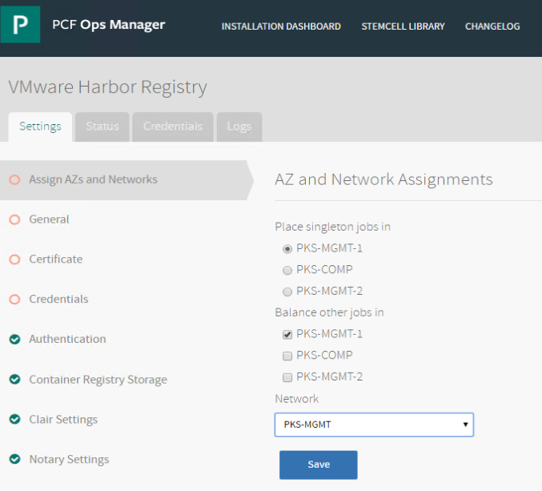
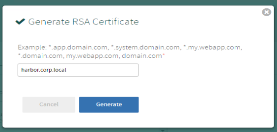
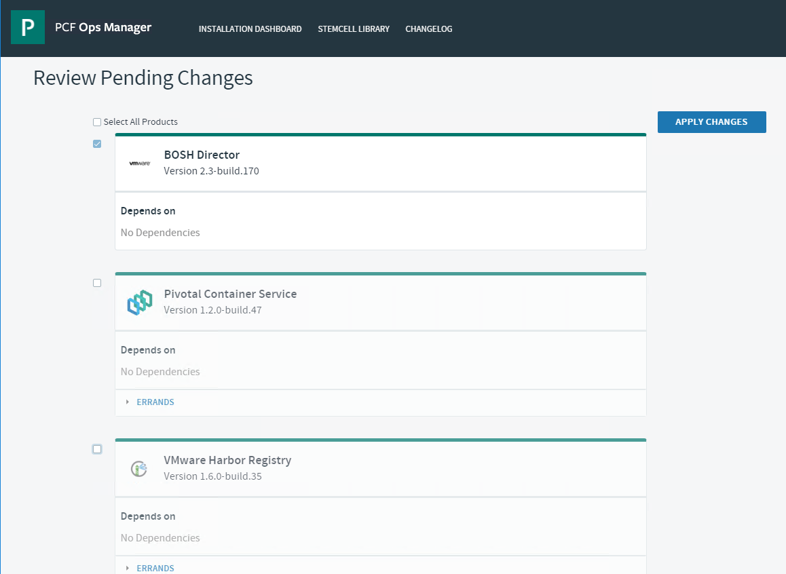

# Harbor Tile Installation

- [Step 1: Install Harbor]()
- [Step 2: Enable Harbor Client Secure Connections]()

## Install Harbor

1.1 On a new browser tab, open a connection to the Ops Manager UI, click on `Import a Product` select the Harbor file and click `Open`. It can take a few minutes to import the Harbor file

<details><summary>Screenshot 1.1.1 </summary>

</details>

<details><summary>Screenshot 1.1.2 </summary>

</details>
<br/>

1.2 In the left hand column of the Ops Manager homepage under `VMware Harbor Registry`, click on the `+` icon to add the Harbor tile to the `Installation Dashboard`

<details><summary>Screenshot 1.2 </summary>

</details>
<br/>

1.3 Click on the `VMware Harbor Registry` tile to open its configuration settings

<details><summary>Screenshot 1.3 </summary>

</details>
<br/>

1.4 Select the `Assign AZs and Networks` tab and enter the following values:

- Singleton Availability Zone: PKS-MGMT-1
- Balance other jobs in: PKS-MGMT-1
- Network: PKS-MGMT
- Click `Save`

<details><summary>Screenshot 1.4</summary>

</details>
<br/>

1.5 Select the `General` tab and set the `Hostname` to `harbor.corp.local` , Click `Save`

<details><summary>Screenshot 1.5</summary>

</details>
<br/>

1.6 Select the `Certificate` tab, select `Generate RSA Certificate`, enter `harbor.corp.local` and click `Generate`

<details><summary>Screenshot 1.6</summary>

</details>
<br/>

1.7 On the `Certificate` tab, click `Save`

<details><summary>Screenshot 1.7</summary>

</details>
<br/>

1.8 On the `Credentials` tab, set the `Admin Password` to `VMware1!` and click `Save`

<details><summary>Screenshot 1.8</summary>

</details>
<br/>

1.8 On the `Clair Settings` tab, set the `Updater Interval` to `1` and click `Save`

<details><summary>Screenshot 1.8</summary>

</details>
<br/>

1.9 On the `Resource Config` tab, set the `Persistent Disk Type` to `20 GB`

<details><summary>Screenshot 1.9</summary>

</details>
<br/>

**STOP**: Before proceeding, ensure that the PKS tile deployment has completed.  There will be a blue bar across the top that will show `Applying Changes` and a button for `Show Progress` as it continues to apply

1.10 In the Ops Manager UI on the top menu bar click `Installation Dashboard`, next select `Review Pending Changes`. Uncheck the checkbox by `Pivotal Container Service` and click `Apply Changes`. Monitor the `Applying Changes` screen until the deployment is complete

**Please proceed with Step 2 below while Harbor is deploying, you do not need the Harbor deployment to finish to complete the remaining steps in this guide**

<details><summary>Screenshot 1.10</summary>

</details>

#### You have now completed the Harbor installation

## Enable Harbor Client Secure Connections

Harbor's integration with PKS natively enables the PKS Control Plane hosts and Kubernetes nodes for certificate based communications with Harbor, but most environments have additional external hosts that need to negotiate communication with harbor other than just K8s nodes. For example, developer workstations, pipeline tools,etc

To ensure developer and automated workflows can have secure interaction with Harbor, a certificate should be installed on the client machine

In the following exercise, you install Harbor self-signed certificate on the `cli-vm` host preparing it to interact with Harbor services

2.1 From the Ops Manager homepage, click on the `VMware Harbor Registry` tile, go to the `Certificate` tab and copy the SSL certificate text from the top textbox

<details><summary>Screenshot 2.1.1</summary>

</details>

<details><summary>Screenshot 2.1.2</summary>

</details>
<br/>

2.2 From the ControlCenter Desktop, open putty and under `Saved Sessions` connect to `cli-vm`.

<details><summary>Screenshot 2.2 </summary>

</details>
<br/>

2.3 Install the cert as a trusted source on the cli-vm by navigating to the `/etc/docker/certs.d/harbor.corp.local` directory (create this directory if i doesn't already exist) and creating a `ca.crt` file with the certificate text you copied in the previous step using the following commands:

```bash
mkdir -p /etc/docker/certs.d/harbor.corp.local
nano /etc/docker/certs.d/harbor.corp.local/ca.crt
# Paste the certificate text into nano, save and close the file
mkdir -p ~/.docker/tls/harbor.corp.local\:4443/
cp /etc/docker/certs.d/harbor.corp.local/ca.crt ~/.docker/tls/harbor.corp.local\:4443/
cp /etc/docker/certs.d/harbor.corp.local/ca.crt /usr/local/share/ca-certificates/
update-ca-certificates
service docker restart
```

<details><summary>Screenshot 2.3.1</summary>

</details>

<details><summary>Screenshot 2.3.2</summary>

</details>

**STOP - Make sure Harbor tile has succesfully completed installation before continuing**

PKS automatically configures certificate based trust between PKS components during deployment. To achieve this, we must conifgure Bosh with a trusted CA certificate to use.

3.1 Prep OpsMan Root Certificate on BOSH

- From the Ops Manager dashboard, go to `Admin > Settings > Advanced` and click `Download Root CA Cert` as shown in Screenshot 2.10

<details><summary>Screenshot 3.1</summary>

</details>
<br/>

3.2 From the ControlCenter desktop Notepad++, select `File > Open` and select the `root_ca_certificate` from the `E:\Downloads` directory, and copy the contents of the file to the clipboard.

<details><summary>Screenshot 3.2.1</summary>

</details>

<details><summary>Screenshot 3.2.2</summary>

</details>
<br/>

3.3 Return to your web browser connection, go to the homepage ands click on the Bosh Director tile, Select the `Security` tab, paste the certificate in the `Trusted Certificates` textbox and click `Save`.

<details><summary>Screenshot 3.3</summary>

</details>
<br/>

3.4 From the Ops Man installation dashboard, click `Review Pending Changes`, uncheck PKS and Harbor tiles as per `Screenshot 2.4`, click apply changes

<details><summary>Screenshot 3.4</summary></details><br>

This lab guide does not include steps to validate the Bosh update installation because it takes time to deploy, so after installation and client prep is a good natural break. To continue with validation, please continue with the next step from your course guide, or refer to the [PKS Ninja SE course guide agenda](https://github.com/CNA-Tech/PKS-Ninja/tree/master/Courses/PksNinjaSe-NI6310#ninja-labs-part-1-agenda) for next steps

***End of lab***