# Infrastructure support for Devops & Cloud Native Operations with PKS

## 1.0 Review Devops and Cloud Native Application Support & Operations

A large number of popular applications are hosted on github, many of which are well maintained by vendors or communities. End users can utilize popular github repositories to access a broad array of software and put it to use to provide value for organizational or personal projects.

Whether you are consuming an application from github, or if you are supporting the infrastructure needs of a modern cloud native development project, the skills needed are about the same.

If you work for an organization that is actively implementing devops projects, chances are your organization already has a team that can plan and lead devops initiatives. Organizations at this stage need support from infrastructure operations teams, but in this use case the infrastructure roles do not need to be devops gurus to bring the needed support to make the devops project successful.

If you work for an organization that is starting to plan or just getting started with early attempts at implementing devops projects, at this stage organizations should start with entry level projects, and grow in sophistication as milestones are reached and the overall devops teams and project constituents learn and grow through a phased approach.

VMware PKS with vSphere delivers a modern cloud native platform that fully leverages the years of experience and valuable VMware skills common among enterprise IT workers, providing an agile and proven pathway for enterprise IT workers to successfully implement cloud native applications and platforms.

With PKS, enterprise IT staff does not need to learn fundamentally different tools and methods to successfully deliver cloud native projects. This lab guide will focus on the most common use cases needed for infrastructure roles new to cloud native technologies - these use cases do not require massive amounts of retraining to be able to deliver significant value with cloud native technologies.

### 1.1 Explore Cloud Native Application Architecture

Most cloud native applications are made up of several distinct applications commonly called microservices that run in independent containers and work together to provide compisite application features and services.

For example, the [Planespotter](https://github.com/CNA-Tech/PKS-Ninja/blob/Pks1.4/LabGuides/BonusLabs/Deploy%20Planespotter%20Lab/readme.md) application used as an example in many PKS Ninja lab guides consists of 5 different distinct microservices as shown in the screenshot below:

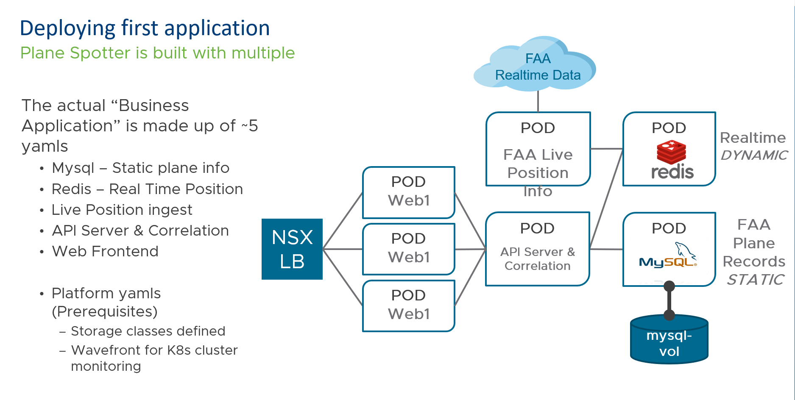

Each of the individual microservice applications that represent part of the overall planespotter app require a kubernetes deployment spec, service spec and possibly network specs, configmaps, persistent volume claims and other artifacts required to deploy the application.

As you will see with the planespotter application, anyone can download, run or modify planespotter and simply take advantage of the tremendous work that has already been done. Combined with container and kubernetes technology, applications like planespotter dont even need to have different instructions or deployment manifests for different platforms, it simply works as is on nearly all standard Kubernetes environments whether you deploy it to K8s on PKS or GKE/AKS/EKS/DIY or even minikube or kind.

If you are supporting a team that is already developing applications of this nature, one of the primary new requirements for infrastructure support is providing the ability to run containers and provide container orchestration services with kubernetes. vSphere and PKS enable you to leverage proven enterprise class products that leverage existing skill sets to deliver kubernetes clusters on demand and provide a cloud class end user experience with enterprise grade security

In traditional software development project, development teams provided executable builds of software to operations teams who generally had to support installation of the executable onto a operating system image and maintaining the OS and dependencies. In modern cloud native projects, the software build automation process outputs container or image builds rather than executable files, which generally makes the life of the infrastructure support role

1.1.1 From the Main Console (Control Center) desktop, open the chrome browser, navigate to [http://github.com](http://github.com) and login to your account. After you log in, navigate to [https://github.com/CNA-Tech/planespotter](https://github.com/CNA-Tech/planespotter) and on the upper right hand corner of the page, click on `Fork` and proceed through the steps to create a fork of the planespotter repository on your github account.

*Note: This example includes screenshots from afewell and possibly other users github repositories, please be sure to use your own github username and repository when completing the exercises.*

<details><summary>Screenshot 1.1.1.1</summary>
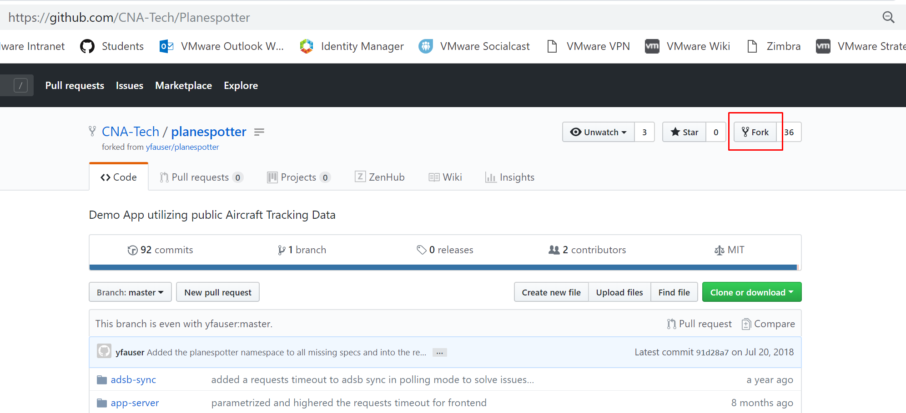
</details>

<details><summary>Screenshot 1.1.1.2</summary>

**Note: All Users may not see this image, in this case it is shown as afewell has multiple github accounts associated with his username. Other users may see a different prompt.**

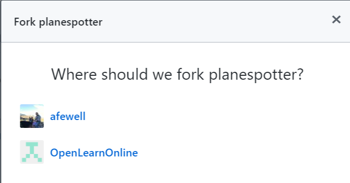
</details>

<details><summary>Screenshot 1.1.1.3</summary>
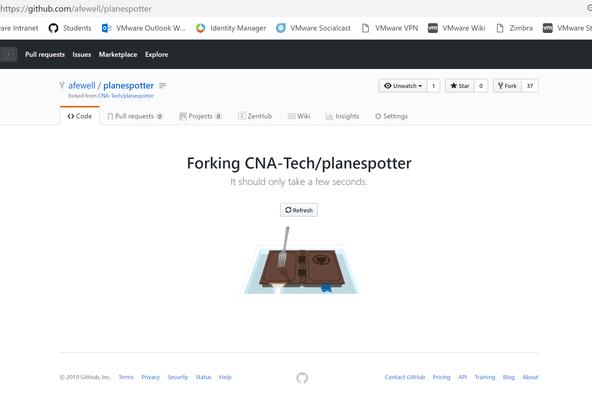
</details>

<details><summary>Screenshot 1.1.1.4</summary>
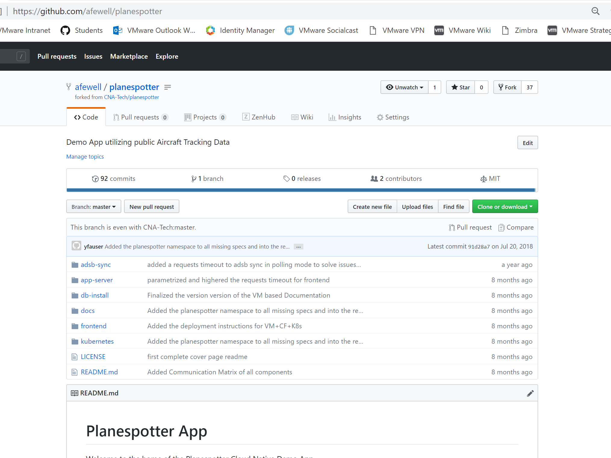
</details>
<br/>

1.1.2 Ensure your chrome browser session has your personal fork of the planespotter open, the url should be line the following except with your github username in place of the string "yourGithubUsername" `https://github.com/yourGithubUsername/Planespotter`, click on the `Clone or download` button and copy the string for your forks .git file as shown in the screenshot below:

<details><summary>Screenshot 1.1.2</summary>
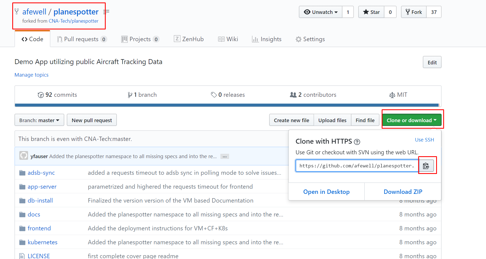
</details>
<br/>

1.1.3 From the Main Console (Control Center) desktop, open a putty session to `cli-vm` and from the prompt, enter the following commands to clone the planespotter application files from github.com to a local directory:

**Make sure to replace the string in the `git clone` command below with the git url you copied from the previous step to clone your personal fork of the planespotter repo.**

```bash
mkdir ~/forked
cd ~/forked
git clone https://github.com/yourGithubUsername/planespotter.git
```

<details><summary>Screenshot 1.1.3</summary>
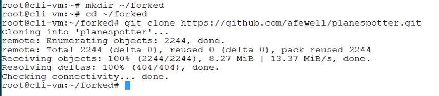
</details>
<br/>

1.1.4 Take a few moments to review the kubernetes manifest for the planespotter mysql deployment with the command `cat ~/forked/planespotter/kubernetes/mysql_pod.yaml | more` keeping in mind that well maintained github projects provide well groomed content that users can consume and adapt as needed. Users do not need to have the level of expertise required to create the application code or deployment files from scratch, and can get started with entry level use cases that can provide tremendous value.

Observe the first entry is a service kind which provides the spec for a clusterIP service for mysql.

The second entry is a StatefulSet kind which is often used to define pod specs for applications with complex persistent volume and startup requirements and links to configmaps to define the pod startup requirements and configuration details.

Note that in the StatefulSet under spec:spec:container:image:, the value `mysql:5.6` defines the image that gets pulled to build the mysql container. As you can see the image name does not include any url for the repository, so the container host where this manifest is run will search its default repository for the image. On container hosts running docker engine including pks nodes, the default container repository is docker hub.

The third section defines the mysql-config-map ConfigMap spec, which provides the configuration details for the mysql instance

The forth and final section is the mysql

<details><summary>Click to expand mysql_pod.yaml</summary>

```yaml
---
apiVersion: v1
kind: Service
metadata:
  name: mysql
  namespace: planespotter
  labels:
    app: mysql
spec:
  ports:
  - port: 3306
    name: mysql
  clusterIP: None
  selector:
    app: mysql
---
apiVersion: apps/v1beta1
kind: StatefulSet
metadata:
  name: mysql
  namespace: planespotter
spec:
  serviceName: mysql
  replicas: 1
  template:
    metadata:
      labels:
        app: mysql
    spec:
      terminationGracePeriodSeconds: 10
      containers:
      - name: mysql
        image: mysql:5.6
        env:
          # Use secret in real usage
        - name: MYSQL_ROOT_PASSWORD
          value: password
        ports:
        - containerPort: 3306
          name: mysql
        volumeMounts:
        - name: mysql-vol
          mountPath: /var/lib/mysql
        - name: mysql-config
          mountPath: /bin/planespotter-install.sh
          subPath: planespotter-install.sh
        - name: mysql-start
          mountPath: /bin/mysql-start.sh
          subPath: mysql-start.sh
        command: ["/bin/mysql-start.sh"]
      volumes:
      - name: mysql-vol
        persistentVolumeClaim:
          claimName: mysql-claim
      - name: mysql-config
        configMap:
          defaultMode: 0700
          name: mysql-config-map
      - name: mysql-start
        configMap:
          defaultMode: 0700
          name: mysql-start-map
---
apiVersion: v1
kind: ConfigMap
metadata:
  name: mysql-config-map
  namespace: planespotter
data:
  planespotter-install.sh: |
    #!/bin/sh
    # sleep while mysql is starting up
    while [ -z "$ALIVE" ] || [ "$ALIVE" != 'mysqld is alive' ]
    do
      echo "waiting for mysql..."
      sleep 3
      ALIVE=`mysqladmin ping --user=root --password=$MYSQL_ROOT_PASSWORD`
      echo "status: $ALIVE"
    done
    echo "MYSQL is alive, checking database..."
    DBEXIST=`mysql --user=root --password=$MYSQL_ROOT_PASSWORD -e 'show databases;' | grep planespotter`
    if ! [ -z "$DBEXIST" ]
    then
      echo "planespotter db already installed."
    else
      echo "------- MYSQL DATABASE SETUP -------"
      echo "updating apt-get..."
      apt-get update
      echo "apt-get installing curl..."
      apt-get --assume-yes install curl
      apt-get --assume-yes install wget
      apt-get --assume-yes install unzip
      echo "downloading planespotter scripts..."
      mkdir ~/planespotter
      mkdir ~/planespotter/db-install
      cd ~/planespotter/db-install
      curl -L -o create-planespotter-db.sh https://github.com/yfauser/planespotter/raw/master/db-install/create-planespotter-db.sh
      curl -L -o create-planespotter-db.sql https://github.com/yfauser/planespotter/raw/master/db-install/create-planespotter-db.sql
      curl -L -o delete-planespotter-db.sh https://github.com/yfauser/planespotter/raw/master/db-install/delete-planespotter-db.sh
      curl -L -o delete-planespotter-db.sql https://github.com/yfauser/planespotter/raw/master/db-install/delete-planespotter-db.sql
      echo "creating a new planespotter db"
      chmod +x create-planespotter-db.sh
      ./create-planespotter-db.sh
    fi
---
apiVersion: v1
kind: ConfigMap
metadata:
  name: mysql-start-map
  namespace: planespotter
data:
  mysql-start.sh: |
    #!/bin/sh
    echo "starting planespotter-installer in background"
    /bin/planespotter-install.sh &
    echo "starting mysqld.."
    /entrypoint.sh mysqld
```

</details>
<br/>

1.1.5 From the `cli-vm` prompt, pull the `mysql:5.6` image to the local image cache and assign a tag to prepare it for upload to the Harbor repository in your local PKS Ninja lab environment with the following commands:

```bash
docker pull mysql:5.6
docker images
docker tag mysql:5.6 harbor.corp.local/library/mysql:5.6
docker images
```

<details><summary>Screenshot 1.1.5</summary>
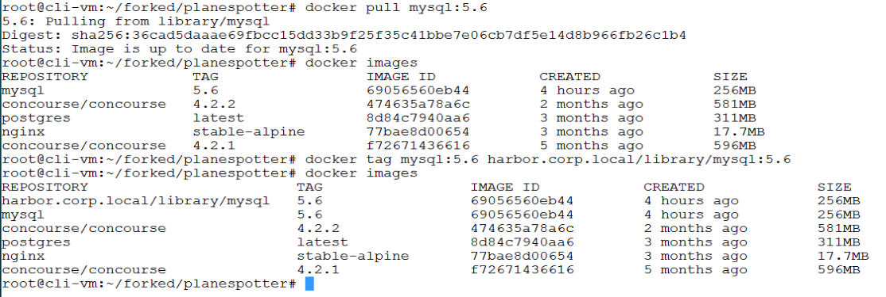
</details>
<br/>

1.1.6 Prepare `cli-vm` with Harbor's certificate which is required for a client to connect to Harbor. Follow the instructions in [Enable Harbor Client Secure Connections](https://github.com/CNA-Tech/PKS-Ninja/tree/Pks1.4/LabGuides/HarborCertExternal-HC7212) and then return to this lab guide and proceed with the following step.

1.1.7 From the `cli-vm` prompt, push the updated mysql image to Harbor with the following commands:

```bash
docker login harbor.corp.local # Enter username: admin password: VMware1!
docker push harbor.corp.local/library/mysql:5.6
```

<details><summary>Screenshot 1.1.6</summary>
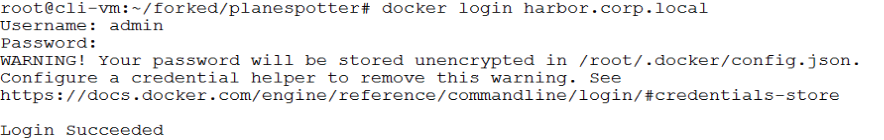
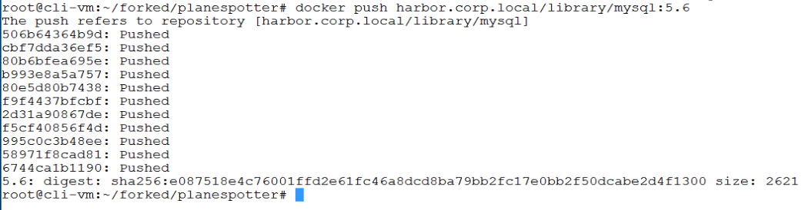
</details>
<br/>

1.1.8 From the Main Console (Control Center) desktop, open a chrome browser session with Harbor by clicking on the harbor shortcut on the bookmarks bar, login with `username: admin` `password: VMware1!`, and click on the `library` project.

<details><summary>Screenshot 1.1.8</summary>

</details>
<br/>

1.1.9 From the Harbor UI on the library project page, click on the new `library/mysql` repository you created in the previous step, and observe that the `mysql:5.6` image is now saved in your local harbor repository.

<details><summary>Screenshot 1.1.9.1</summary>
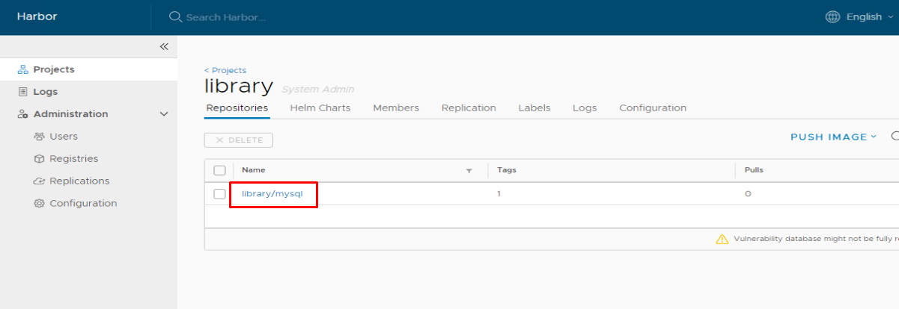
</details>

<details><summary>Screenshot 1.1.9.2</summary>
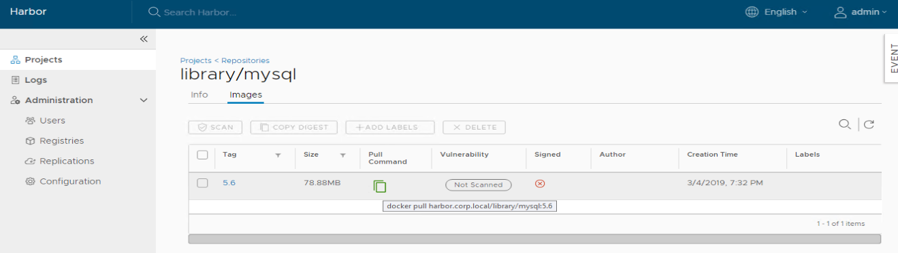
</details>
<br/>

### 1.2 Build & Prep Additional Planespotter Images

In most production environments it is a bad practice to allow production workloads to be pulled directly from unsecured public repositories.

In this section, you will build and sign the additional planespotter images and push them to your local harbor registry

<!-- having problems with content trust because Harbor tile Updater Interval is set to 0 and bosh trusted cert is not setup in the clusterReady, this needs to be updated in the template, skipping for now but leaving scaffolding here to fix in future.

1.2.1 From the control center desktop, open a chrome browser session with Ops Manager by clicking on the opsman shortcut in the bookmarks bar, login with `username: admin` `password: VMware1!`, click on the Harbor tile, navigate to `Clair Settings` and set the following value `Updater Interval: 1` as shown in the following Screenshot

<details><summary>Screenshot 1.2.1 </summary>
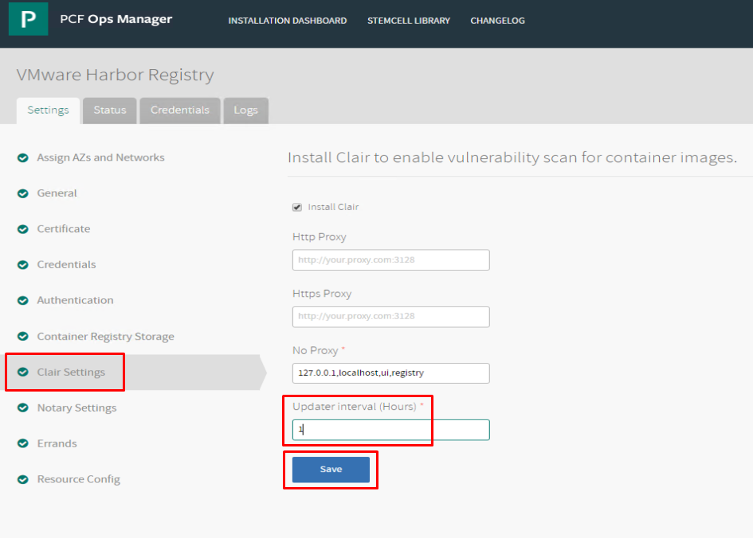
</details>
<br/>

1.2.2 From Ops Manager UI, click on `Installation Dashboard`, then click on `Review Pending Changes`, uncheck Pivotal Container Service Tiles such that only the `BOSH Director` and `VMware Harbor Registry` tiles are selected and click `Apply Changes` as shown in the following screenshots:

<details><summary>Screenshot 1.2.2.1</summary>
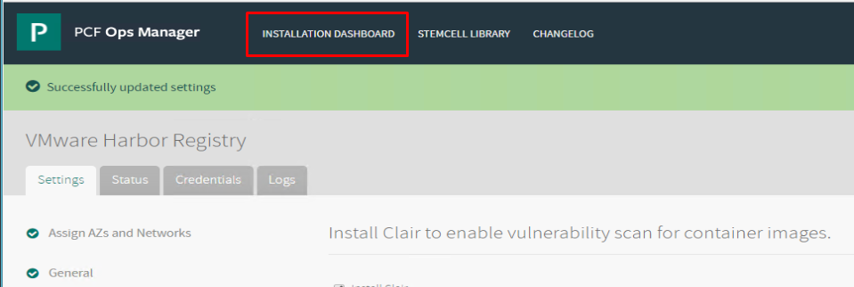
</details>

<details><summary>Screenshot 1.2.2.2</summary>
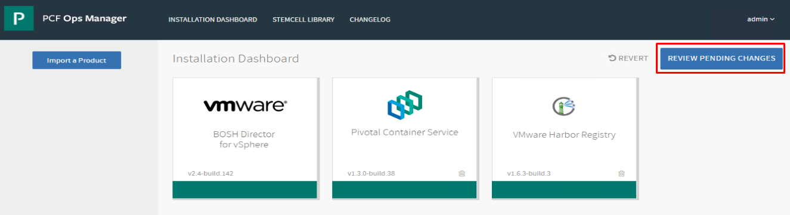
</details>

<details><summary>Screenshot 1.2.2.3 </summary>

</details>

<details><summary>Screenshot 1.2.2.4 </summary>
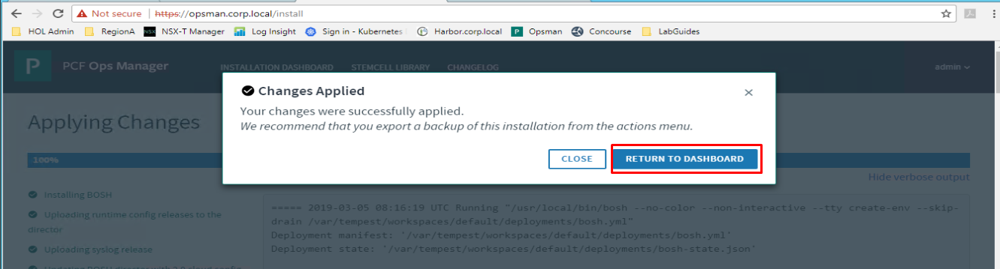
</details>
<br/>

1.2.3 Return to the Harbor UI and relogin if needed.  Navigate to the `Projects` page and click on `+ New Project`

Note: If you ever have strange problems with the Harbor UI, try logging out and back in again

<details><summary>Screenshot 1.2.3 </summary>
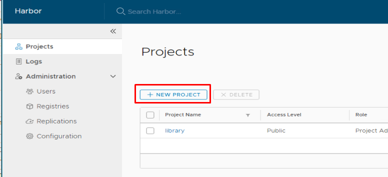
</details>
<br/>

1.2.4 On the `New Project` screen, set the `Project Name` to `trusted` and click `OK`

<details><summary>Screenshot 1.2.4 </summary>
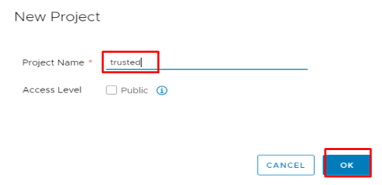
</details>
<br/>

1.2.5 On the `Projects` page, click on `trusted`,  click on the `configuration` tab, enter the following values and click `Save`

- Enable Content Trust: True
- Prevent vulnerable images from running: False
  - In this lab we will observe but not enforce image vulnerability scanning, however this setting is explored in the Intro to Harbor lab
- Automatically scan images on push: True
- Click `Save`

<details><summary>Screenshot 1.2.5</summary>
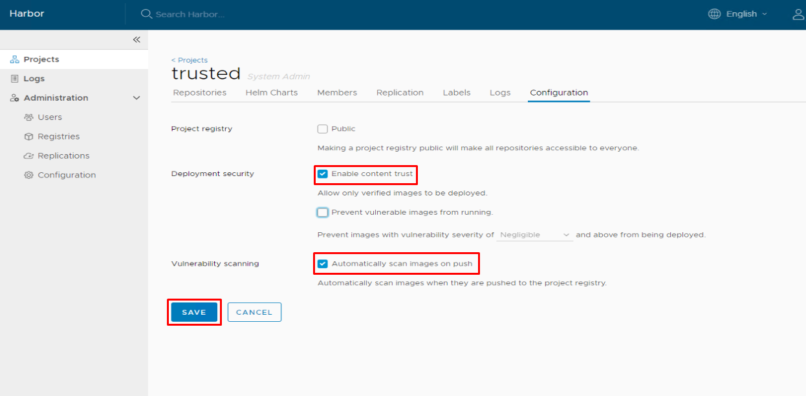
</details>
<br/>

1.2.6 From `cli-vm` configure environmental variables that enable the docker client to validate signed images with Harbor

```bash
export DOCKER_CONTENT_TRUST_SERVER=https://harbor.corp.local:4443
export DOCKER_CONTENT_TRUST=1
```

<details><summary>Screenshot 1.2.6</summary>
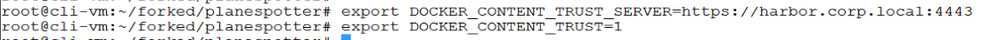
</details>
<br/>
-->

1.2.1 Build and tag the additional planespotter images with the following commands:

```bash
docker build ~/forked/planespotter/adsb-sync/. -t harbor.corp.local/library/adsb-sync:v1
docker build ~/forked/planespotter/app-server/. -t harbor.corp.local/library/app-server:v1
docker build ~/forked/planespotter/frontend/. -t harbor.corp.local/library/frontend:v1
```

<details><summary>Screenshot 1.2.1.1</summary>
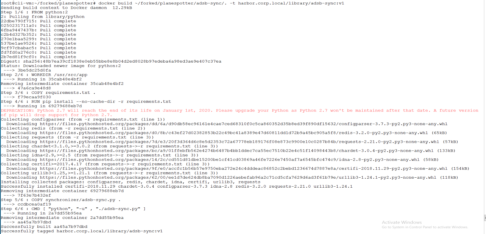
</details>

<details><summary>Screenshot 1.2.1.2</summary>
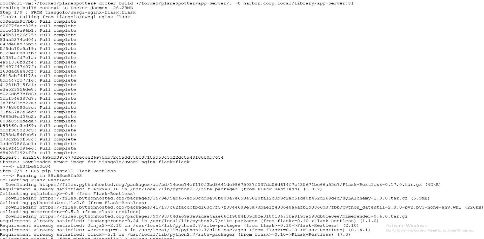

*Output abbreviated for brevity.*
</details>

<details><summary>Screenshot 1.2.1.3</summary>
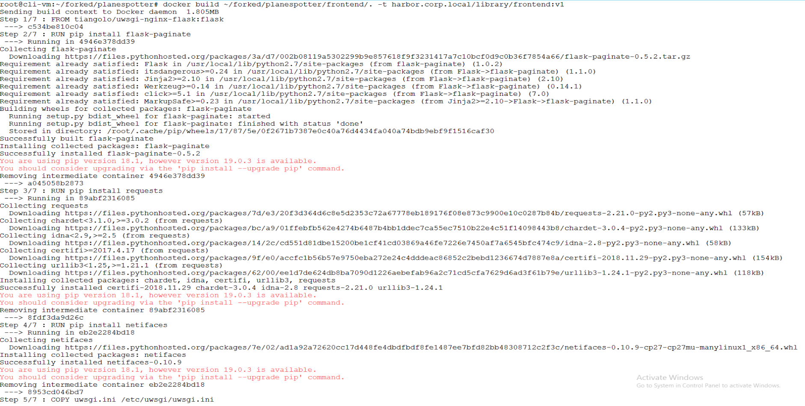

*Output abbreviated for brevity.*
</details>
<br/>

1.2.2 Pull and tag the redis image with the following commands:
```bash
docker pull redis
docker images
docker tag redis harbor.corp.local/library/redis:v1
```

<details><summary>Screenshot 1.2.2</summary>
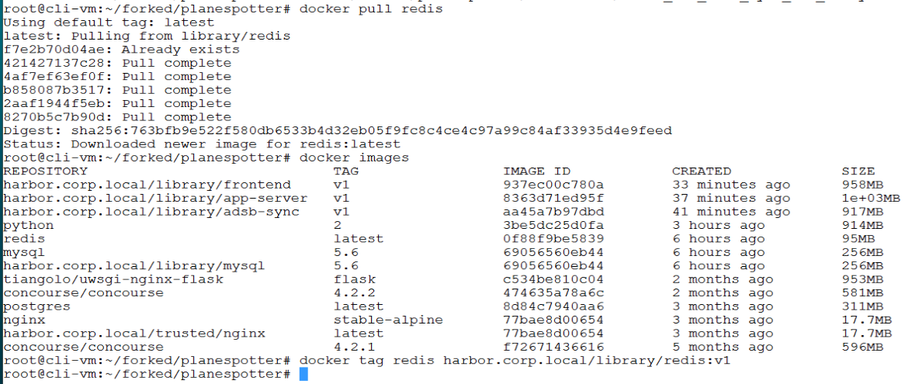
</details>
<br/>

1.2.3 Push the additional planespotter images to Harbor with the following commands:

```bash
docker login harbor.corp.local # Enter username: admin password: VMware1!
docker push harbor.corp.local/library/adsb-sync:v1
docker push harbor.corp.local/library/app-server:v1
docker push harbor.corp.local/library/frontend:v1
docker push harbor.corp.local/library/redis:v1
```

<details><summary>Screenshot 1.2.3.1</summary>
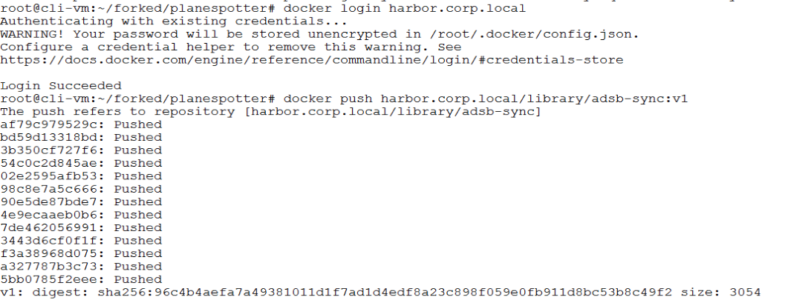
</details>

<details><summary>Screenshot 1.2.3.2</summary>
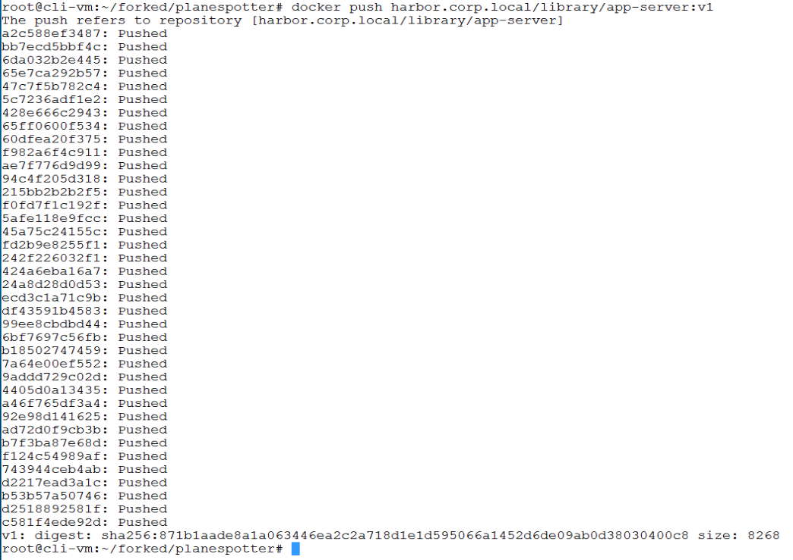
</details>

<details><summary>Screenshot 1.2.3.3</summary>
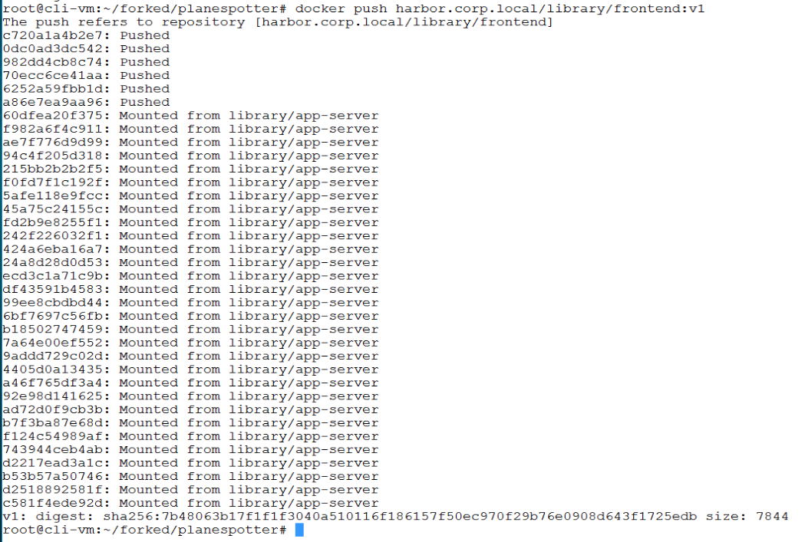
</details>

<details><summary>Screenshot 1.2.3.4</summary>
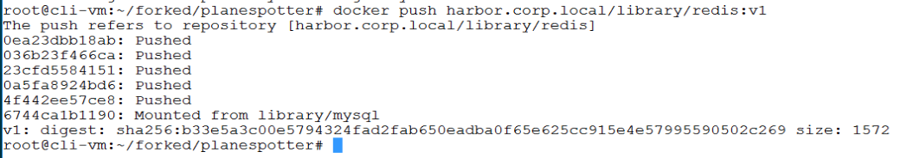
</details>
<br/>

1.2.4 From the Main Console (Control Center) desktop, open a chrome browser session with Harbor by clicking on the harbor shortcut on the bookmarks bar, login with `username: admin` `password: VMware1!`, and click on the `library` project.

Observe each of the new repos and images you uploaded in the previous step are now visible in the Harbor library project.

<details><summary>Screenshot 1.2.4.1</summary>

</details>

<details><summary>Screenshot 1.2.4.2</summary>
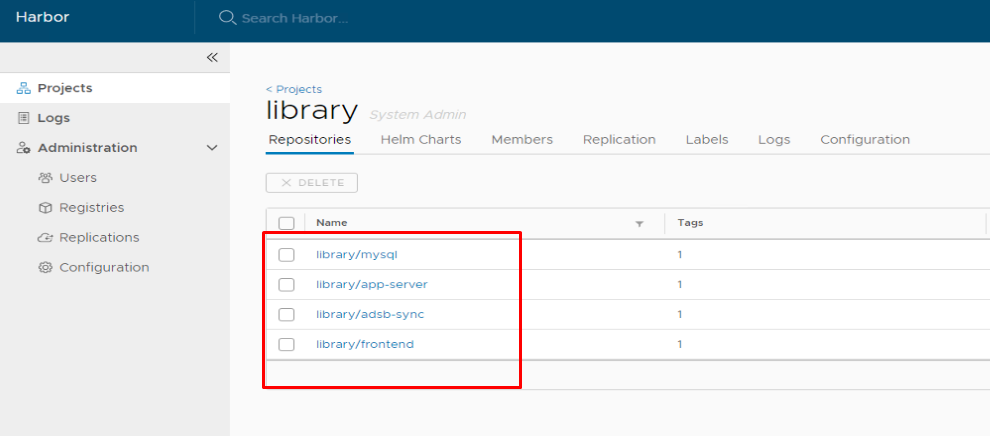
</details>
<br/>

### 1.3 Deploy Planespotter

1.3.1 Resume your ssh session with `cli-vm` and from the prompt, enter the following commands to prepare you kubernetes cluster for planespotter deployment:

```bash
pks login -a pks.corp.local -u pksadmin -k -p VMware1!
pks get-credentials my-cluster
kubectl create ns planespotter
kubectl config set-context my-cluster --namespace planespotter
```

<details><summary>Screenshot 1.3.1</summary>
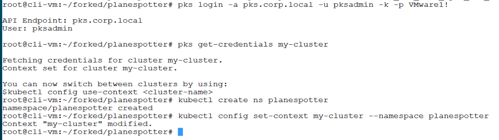
</details>
<br/>

1.3.2 Resume your ssh session with `cli-vm` and from the prompt, enter the following commands to deploy the planespotter application:

```bash
cd ~/forked/planespotter/kubernetes
kubectl create -f storage_class.yaml
kubectl create -f mysql_claim.yaml
kubectl create -f mysql_pod.yaml
kubectl create -f app-server-deployment_all_k8s.yaml
kubectl create -f redis_and_adsb_sync_all_k8s.yaml
kubectl create -f frontend-deployment_all_k8s.yaml
```

<details><summary>Screenshot 1.3.2</summary>

</details>
<br/>

1.3.3 Review the objects created by the planespotter manifests with the following commands:

```bash
kubectl get pvc
kubectl get deployments
kubectl get pods -o wide
kubectl get rs
kubectl get statefulset -o wide
kubectl get services -o wide
kubectl get ingress -o wide
```

<details><summary>Screenshot 1.3.3</summary>
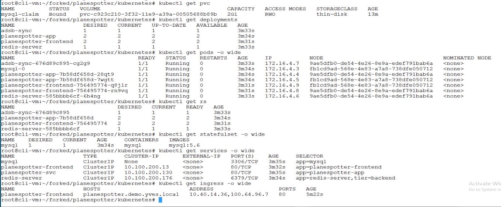
</details>
<br/>

1.3.4 From the Main Console (ControlCenter) desktop, open a https browser session to `http://planespotter.corp.local` to see the fully functional planespotter web app, click around on the various links to explore

Note: If planespotter.corp.local does not resolve for you, you can either create a DNS record for it or simply use the IP address from the kubectl get ingress output from the previous command instead.

<details><summary>Screenshot 1.3.4.1</summary>

</details>

<details><summary>Screenshot 1.3.4.2</summary>

</details>

<details><summary>Screenshot 1.3.4.3</summary>

</details>

<details><summary>Screenshot 1.3.4.4</summary>

</details>
<br/>

### 1.4 Update Kubernetes Manifests for Harbor

In this section you will update the Kubernetes manifests for the planespotter application to pull container images from Harbor.

1.4.1 From the Control Center desktop, open a putty session with `cli-vm` and from the prompt edit the `frontend-deployment_all_k8s.yaml` with the command `nano ~/forked/planespotter/kubernetes/frontend-deployment_all_k8s.yaml`

In nano, update the deployment spec:spec:container:image: value to `harbor.corp.local/library/frontend:v1` as shown in the following screenshot.

Press the keys `ctrl + o` and then press enter to save the file, then press `ctrl + x` to exit nano.

<details><summary>Screenshot 1.4.1</summary>
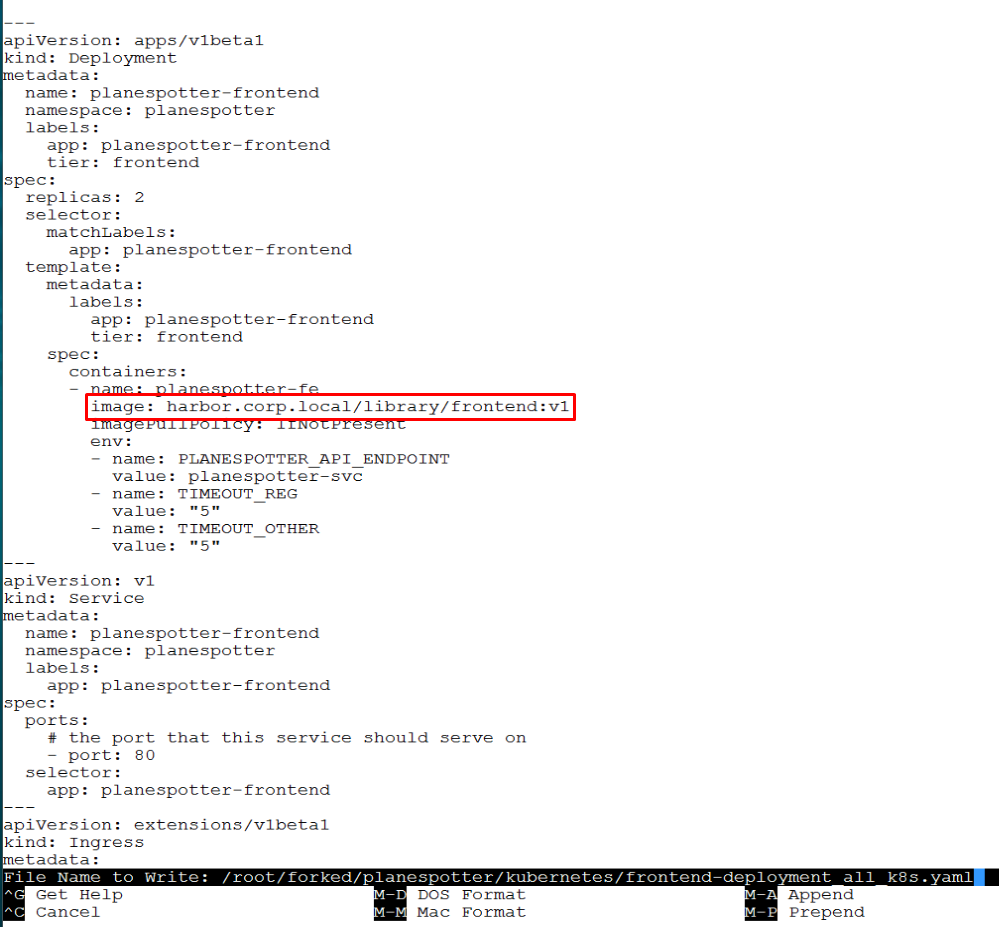
</details>
<br/>

1.4.2 From the `cli-vm` prompt edit the `mysql_pod.yaml` with the command `nano ~/forked/planespotter/kubernetes/mysql_pod.yaml`

In nano, update the deployment spec:spec:container:image: value to `harbor.corp.local/library/mysql:5.6` as shown in the following screenshot.

Press the keys `ctrl + o` and then press enter to save the file, then press `ctrl + x` to exit nano.

<details><summary>Screenshot 1.4.2</summary>
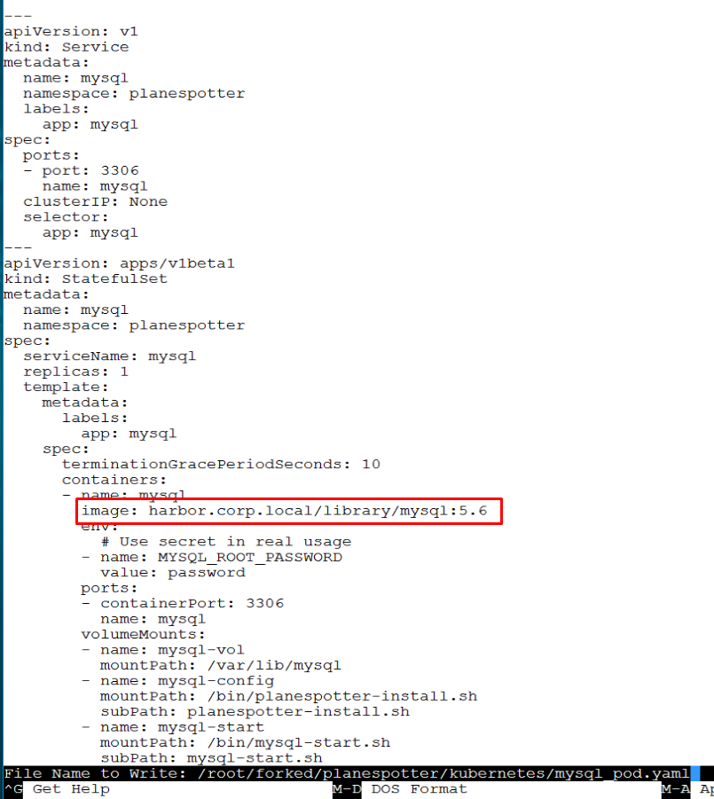
</details>
<br/>

1.4.3 From the `cli-vm` prompt edit the `app-server-deployment_all_k8s.yaml` with the command `nano ~/forked/planespotter/kubernetes/app-server-deployment_all_k8s.yaml`

In nano, update the deployment spec:spec:container:image: value to `harbor.corp.local/library/app-server:v1` as shown in the following screenshot.

Press the keys `ctrl + o` and then press enter to save the file, then press `ctrl + x` to exit nano.

<details><summary>Screenshot 1.4.3</summary>
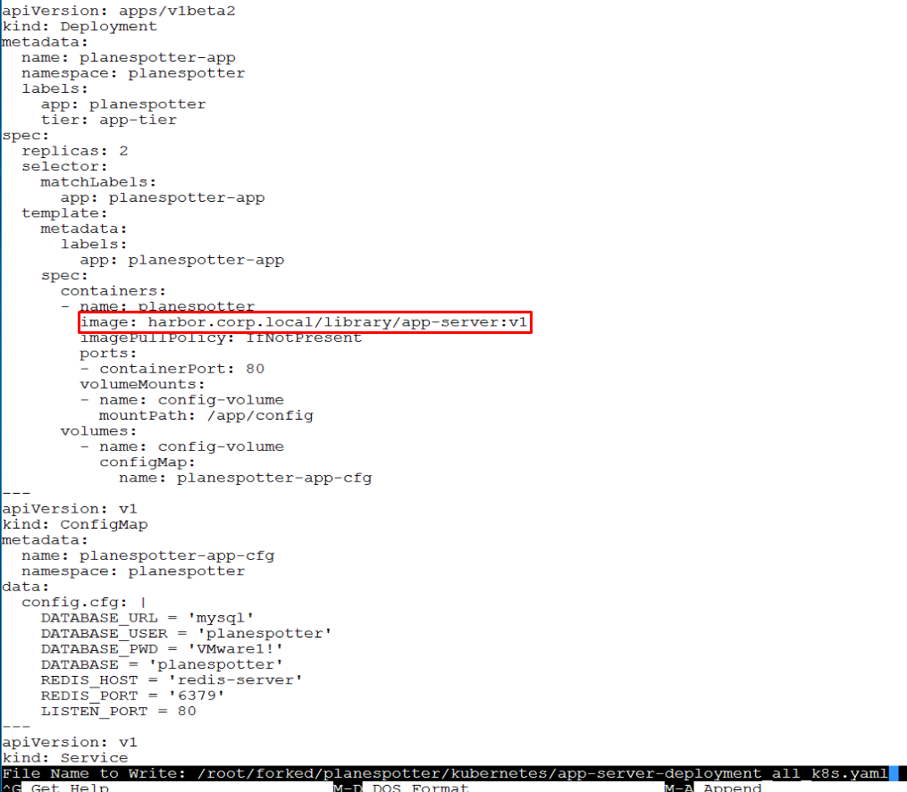
</details>
<br/>

1.4.4 From the `cli-vm` prompt edit the `redis_and_adsb_sync_all_k8s.yaml` with the command `nano ~/forked/planespotter/kubernetes/redis_and_adsb_sync_all_k8s.yaml`

In nano, update the `redis-server` deployment spec:spec:container:image: value to `harbor.corp.local/library/redis:v1`, and update the `adsb-sync` deployment spec:spec:container:image: value to `harbor.corp.local/library/adsb-sync:v1` as shown in the following screenshots.

Press the keys `ctrl + o` and then press enter to save the file, then press `ctrl + x` to exit nano.

<details><summary>Screenshot 1.4.4.1</summary>
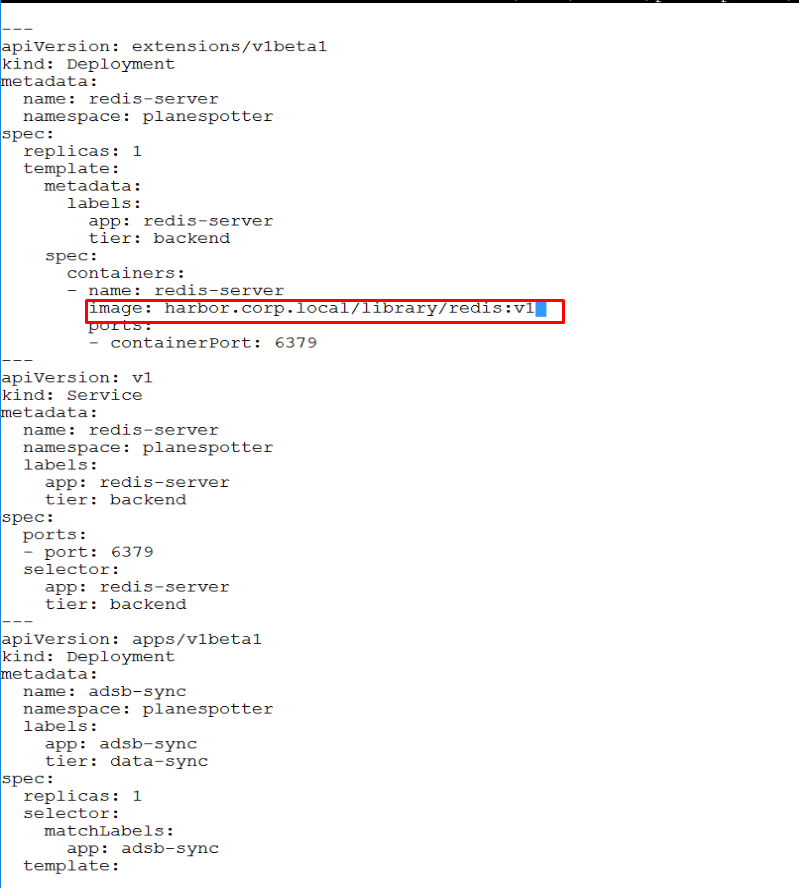
</details>

<details><summary>Screenshot 1.4.4.2</summary>
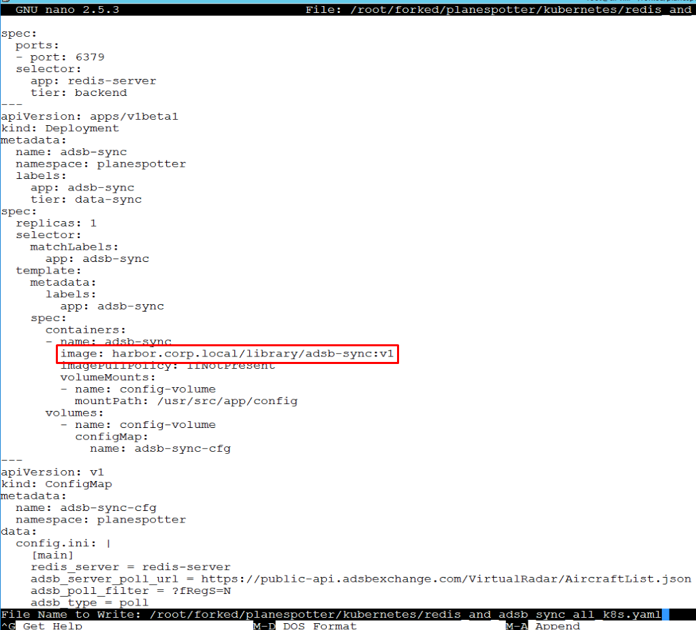
</details>
<br/>

### 1.5 Update your planespotter fork

Now that you have created customized manifests in the local clone of your planespotter fork, you can push your updates back to your fork so you have an online copy of your updates preserved either for your own use or so you can share with others.

1.5.1 Resume your ssh session with `cli-vm` and from the prompt, enter the following commands to add your updated files to staging, commit and push:

```bash
cd ~/forked/planespotter
git add .
git commit -m "updated k8s to pull images from harbor"
git push
#follow the prompts to login with your personal github username and password
```

<details><summary>Screenshot 1.5.1</summary>
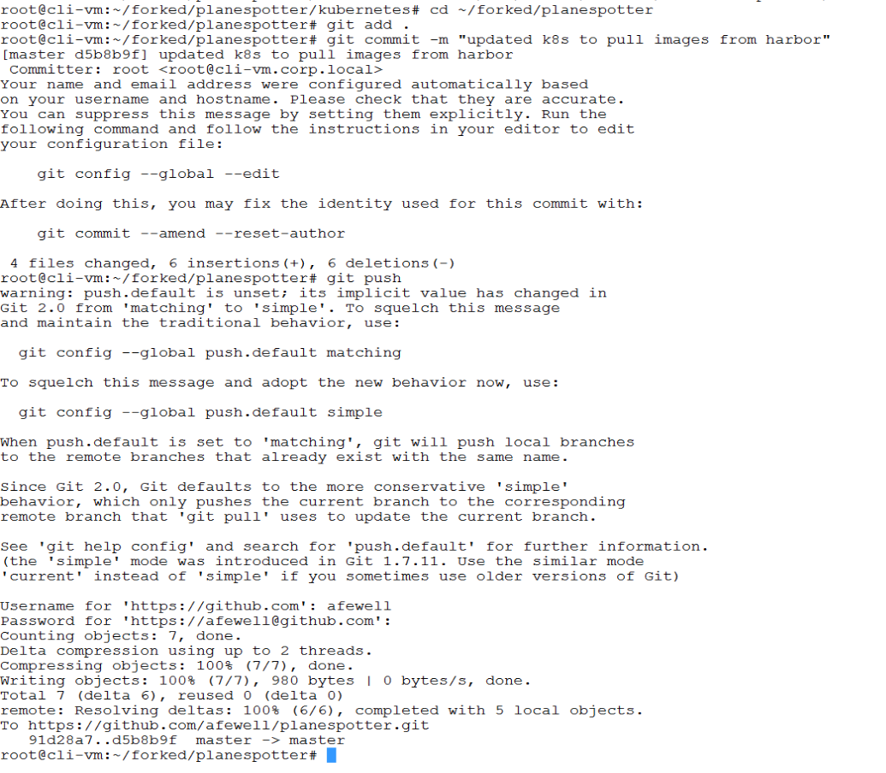
</details>
<br/>

1.5.2 From the control center desktop open a chrome browser session to the `frontend-deployment_all_k8s.yaml` file on personal fork of planespotter on github, the url should be line the following except with your github username in place of the string "yourGithubUsername" `https://github.com/yourGithubUsername/Planespotter/blob/master/kubernetes/frontend-deployment_all_k8s.yaml`

Observe that the changes you made to the manifest are now saved on your fork of planespotter on github.

<details><summary>Screenshot 1.5.2</summary>
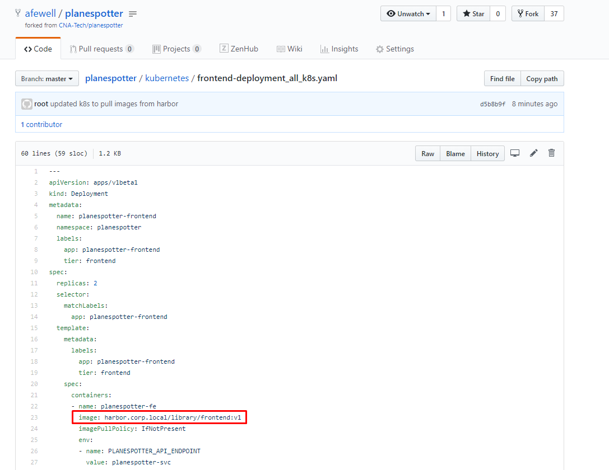
</details>
<br/>

1.5.3 Resume your ssh session with `cli-vm` and from the prompt, enter the following commands to clean up the planespotter application deployment in preparation for the subsequent exercises:

```bash
cd ~/forked/planespotter/kubernetes
kubectl delete -f frontend-deployment_all_k8s.yaml
kubectl delete -f mysql_pod.yaml
kubectl delete -f storage_class.yaml
kubectl delete -f mysql_claim.yaml
kubectl delete -f app-server-deployment_all_k8s.yaml
kubectl delete -f redis_and_adsb_sync_all_k8s.yaml
kubectl delete ns planespotter
```

<details><summary>Screenshot 1.5.3</summary>
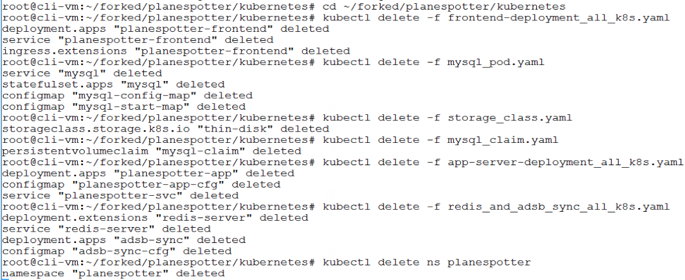
</details>
<br/>

<!--

1.4.2 Resume your ssh session with `cli-vm` and from the prompt, enter the following commands to deploy the remaining components in the planespotter application:

```bash
cd ~/forked/planespotter/kubernetes
kubectl create -f storage_class.yaml
kubectl create -f mysql_claim.yaml
kubectl create -f mysql_pod.yaml
kubectl create -f app-server-deployment_all_k8s.yaml
kubectl create -f redis_and_adsb_sync_all_k8s.yaml
kubectl create -f frontend-deployment_all_k8s.yaml
```

<details><summary>Screenshot 1.4.2</summary>

</details>
<br/>

1.4.3 Review the objects created by the planespotter manifests with the following commands:

```bash
kubectl get pvc
kubectl get deployments -o wide
kubectl get pods -o wide
kubectl get rs
kubectl get statefulset -o wide
kubectl get services -o wide
kubectl get ingress -o wide
```

<details><summary>Screenshot 1.4.3</summary>

</details>
<br/>

1.4.4 From the control center desktop open a chrome browser session to the `frontend-deployment_all_k8s.yaml` file on personal fork of planespotter on github, the url should be line the following except with your github username in place of the string "yourGithubUsername" `https://github.com/yourGithubUsername/Planespotter`, 

<details><summary>Screenshot 1.1.2</summary>

</details>
<br/>

2.2.3 From the Main Console (ControlCenter) desktop, open a https browser session to `http://planespotter.corp.local` to see the fully functional planespotter web app, click around on the various links to explore

<details><summary>Screenshot 2.2.3.1</summary>

</details>

<details><summary>Screenshot 2.2.3.2</summary>

</details>

<details><summary>Screenshot 2.2.3.3</summary>

</details>

<details><summary>Screenshot 2.2.3.4</summary>

</details>
<br/>

1.4.4 Run the planespotter-frontend server with the command `docker run -p 8080:80 --name=planespotter-frontend-container -d planespotter-frontend` and verify it is running with the `docker ps` command.

<details><summary>Screenshot 1.4.4</summary>

</details>
<br/>

1.4.5 From the Main Console (ControlCenter) desktop, open a chrome browser session with `http://cli-vm.corp.local:8080/` and refresh the page. You should now see the planesotter frontend page.

<details><summary>Screenshot 1.4.5</summary>

</details>
<br/>

1.4.6 Enter the following commands to clean up your `planespotter-frontend` containers in preparation for the following exercises

```bash
docker stop planespotter-frontend-container
docker rm planespotter-frontend-container
docker rmi -f planespotter-frontend
docker ps -a
docker images
```

<details><summary>Screenshot 1.4.6</summary>


</details>
<br/>

### 1.2 Fork a copy of the Planespotter Repo

2.1.1 Resume your ssh session with `cli-vm` and from the prompt, enter the following commands to review the kubernetes manifest for the planespotter frontend application and edit the file to change the ingress host value from `planespotter.demo.yves.local` to `planespotter.corp.local` as shown in the following screenshot:

```bash
cd ~/cloned/planespotter/kubernetes/
nano frontend-deployment_all_k8s.yaml
```

<details><summary>Screenshot 2.1.1</summary>


</details>
<br/>

2.1.2 Resume your ssh session with `cli-vm` and from the prompt, enter the following commands to deploy the planespotter frontend application using its kubernetes manifest:

```bash
pks login -a pks.corp.local -u pksadmin -k -p VMware1!
pks get-credentials my-cluster
kubectl create ns planespotter
kubectl config set-context my-cluster --namespace planespotter
kubectl create -f frontend-deployment_all_k8s.yaml
```

<details><summary>Screenshot 2.1.2</summary>

</details>
<br/>

2.1.3 Review the objects created by the planespotter `frontend-deployment_all_k8s.yaml` manifest with the following commands:

```bash
kubectl get ns
kubectl get deployments
kubectl get pods
kubectl get services
kubectl get ingress
```

Gather the ip address shown in the output of the `kubectl get ingress` command as shown in the screenshot below. The address in the screenshot below is `10.40.14.36`, the ip address of your ingress service may be different but should still be in the 10.40.14.x/24 subnet, if the ip address for your ingress is different, please use the ip address from your environment in the next step.

<details><summary>Screenshot 2.1.3</summary>

</details>
<br/>

2.1.4 From the Main Console (ControlCenter) desktop, click the windows button, enter the value `dns` in the search box, and select the top result `DNS` as shown in the following screenshot to open DNS Manager.

<details><summary>Screenshot 2.1.4</summary>

</details>
<br/>

2.1.5 In DNS Manager, expand `ControlCenter > Forward Lookup Zones`, right click on `corp.local`, and select `New Host (A or AAAA)...`

<details><summary>Screenshot 2.1.5</summary>

</details>
<br/>

2.1.6 In the `New Host` window, enter the following values to create an dns A record for planespotter.corp.local:

- Name: `planespotter`
- *Please be sure to use the ip address from your deployment from the output of `kubectl get ingress` in the preceeding steps*
- IP Address: `10.40.14.36`
- Uncheck `Create associated pointer (PTR) record
- Click `Add Host` to add the new dns record for `planespotter.corp.local`

<details><summary>Screenshot 2.1.6</summary>

</details>

2.1.7 From the Main Console (ControlCenter) desktop, open a https browser session to `http://planespotter.corp.local` to see the planespotter frontend page.

<details><summary>Screenshot 2.1.4.2</summary>

</details>
<br/>

### 1.3 Automating Containter Builds with Github and Docker Hub

In addition to the frontend app, planespotter has 3 additional microservice applications that must be deployed to enable the complete planespotter application features. In this section, you will execute the additional commands required to deploy the remaining planespotter components, review the objects created to support the deployement, and review the planespotter application to validate its successful deployment and operation.

2.2.1 Resume your ssh session with `cli-vm` and from the prompt, enter the following commands to deploy the remaining components in the planespotter application:

```bash
cd ~/cloned/planespotter/kubernetes
kubectl create -f storage_class.yaml
kubectl create -f mysql_claim.yaml
kubectl create -f mysql_pod.yaml
kubectl create -f app-server-deployment_all_k8s.yaml
kubectl create -f redis_and_adsb_sync_all_k8s.yaml
```

<details><summary>Screenshot 2.2.1</summary>

</details>
<br/>

2.2.2 Review the objects created by the planespotter manifests with the following commands:

```bash
kubectl get pvc
kubectl get deployments
kubectl get pods
kubectl get services
kubectl get ingress
```

<details><summary>Screenshot 2.2.2</summary>

</details>
<br/>

2.2.3 From the Main Console (ControlCenter) desktop, open a https browser session to `http://planespotter.corp.local` to see the fully functional planespotter web app, click around on the various links to explore

<details><summary>Screenshot 2.2.3.1</summary>

</details>

<details><summary>Screenshot 2.2.3.2</summary>

</details>

<details><summary>Screenshot 2.2.3.3</summary>

</details>

<details><summary>Screenshot 2.2.3.4</summary>

</details>
<br/>

2.2.4 Resume your ssh session with `cli-vm` and from the prompt, enter the following commands to clean up the planespotter application deployment in preparation for the subsequent exercises:

```bash
cd ~/cloned/planespotter/kubernetes
kubectl delete -f frontend-deployment_all_k8s.yaml
kubectl delete -f mysql_pod.yaml
kubectl delete -f storage_class.yaml
kubectl delete -f mysql_claim.yaml
kubectl delete -f app-server-deployment_all_k8s.yaml
kubectl delete -f redis_and_adsb_sync_all_k8s.yaml
kubectl delete ns planespotter
```

<details><summary>Screenshot 2.2.4</summary>

</details>
<br/>

### 1.4 Automating Containter Builds with Github and Docker Hub
### 1.5 Update K8s Manifests for Deployment from your Repository
### 1.6 Enforcing Image Authenticity and Security with Harbor

-->
**Thank you for completing the Infrastructure support for Devops & Cloud Native Operations with PKS Lab!**
