# Introduction to Harbor with Planespotter

**Contents:**

- [Prerequisites](#prerequisites)
- [Step 1: Initialize Harbor Projects and Repositories]()
- [Step 2: Build Docker Image for Planespotter Frontend]()
- [Step 3: Push and Pull Container Images From Harbor]()
- [Step 4: Configure Image Vulnerability Scanning and Enforcement]()
- [Step 5: Configure and validate Content Trust]()

## Overview

This lab guide takes a practical approach to learning VMware's Open Source Harbor container registry by focusing on configuring and preparing Harbor to deploy the Planespotter application

This lab guide is part of a sequence that will show you how to deploy a modern containerized application on kubernetes with VMware PKS. While we use the planespotter application as an example, the point of the exercise is to highlight how virtual infrastructure operators and devops admins can support container application deployments on kubernetes.  The devops processes used in this guide to deploy the planespotter application are essentially the same processes to deploy and support any typical modern containerized application

The Planespotter application was chosen as the example application because it is a production grade application that is not too simple to provide a meaningful real-world application, but complex enough to be realistic and challenging without being overwhelming

Before proceeding with this lab, please review the [Planespotter application overview](https://drive.google.com/open?id=1N44aYSR_c4mdmJcJt4SKZowZGeCUKojy) and review the Planespotter application architecture

## Instructions

In this guide you will learn how to fully prepare and configure Harbor for an example enterprise application deployment using the Planespotter application

In subsequent lab modules you will deploy the full Planespotter application from Harbor, providing a practical walkthrough of Harbor's role in an enterprise-grade application deployment

Note: Harbor is included as an enterprise supported product with VMware PKS

## Prerequisites

Before proceeding, ensure that Bosh Trusted Certificates has been configured, and that the configuration has been applied before the harbor deployment, as documented in step 1.0 of the [Harbor Installation with Concourse Pipeline Lab Guide](https://github.com/CNA-Tech/PKS-Ninja/tree/Pks1.4/LabGuides/HarborPipelineInstal-IN4968). If you are not sure if Bosh Trusted Certificate has been configured with the Opsman Root Cert, from the opsman home page go the `Bosh Director for vSphere > Security` page, if the `Include OpsManager Root CA in Trusted Certs` box is not checked, please follow the configuration steps at the link above.

Before proceeding, ensure you have prepared the cli-vm docker engine configuration with the Harbor certificate, as documented in the [Installing Harbor Cert on External Clients Lab Guide](https://github.com/CNA-Tech/PKS-Ninja/tree/Pks1.4/LabGuides/HarborCertExternal-HC7212)

## Step 1: Initialize Harbor Projects and Repositories

Harbor organizes images into a set of projects and repositories within those projects. Repositories can have one or more images associated with them. Each of the images
are tagged. Projects can have RBAC (Role Based Access Control) and replication policies associated with them so that administrators can regulate access to images and create
image distribution pipelines across registries that might be geographically dispersed. You should now be at a summary screen that shows all of the projects in this registry.
For our lab, we are interested in a single project called library.

**Important: Before proceeding, please review the [prequisites](#prequisites) section above**

1.1 Login to harbor.corp.local, observe the Projects homepage and note there is already a project named `library` available by default, and it is set to a Public access level

Click on the `library` project to examine further details, and look through the various tabs to familiarize yourself

<details><summary>Screenshot 1.1.1 </summary>

</details>

<details><summary>Screenshot 1.1.2 </summary>
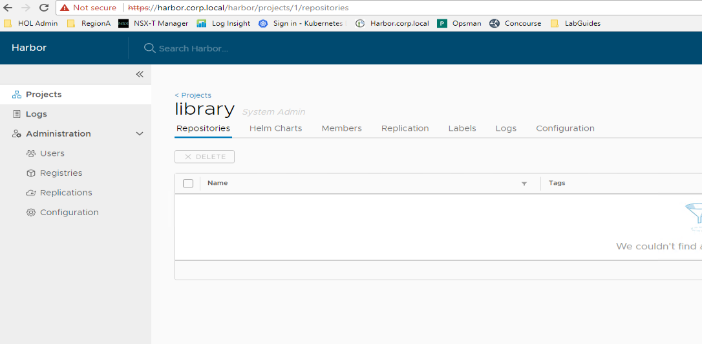
</details>
<br/>

1.2 From the `library` project page, select the `Configuration` tab and observe the default configuration for the library project. As you proceed through the following steps, you will upload an image to interact with the unsecured library project, and you will also create an additional `trusted` project to interact with the content trust feature

<details><summary>Screenshot 1.2</summary>
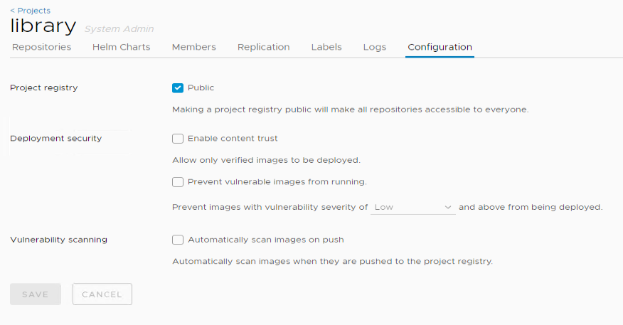
</details>
<br/>

_(Note: To authenticate to a non-public project, you will first need to add a kubernetes secret for registry authentication. This can be accomplished in this lab with the following command line and then adding the imagePullSecrets: to your deployment manifest)_

```
kubectl create secret docker-registry regcred --docker-server=harbor.corp.local --docker-username=admin --docker-password=VMware1! --docker-email=admin@corp.local
```
```
 spec:
      containers:
      - name: app1
        image: harbor.corp.local/somerepo:v1
        ports:
        - containerPort: 80
      imagePullSecrets:  <--- Add this
      - name: regcred    <--- Add this
```
<br/>

1.3 Click on the `Projects` link in the left navigational bar to return to the `Projects` page and click on `+ New Project`

<details><summary>Screenshot 1.3 </summary>

</details>
<br/>

1.3 On the `New Project` screen, set the `Project Name` to `trusted` and click `OK`

<details><summary>Screenshot 1.3 </summary>
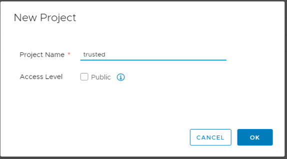
</details>
<br/>

1.4 On the `Projects` page, click on `trusted`,  click on the `configuration` tab, enter the following values and click `Save`

- Enable Content Trust: True
- Automatically scan images on push: True

<details><summary>Screenshot 1.4</summary>
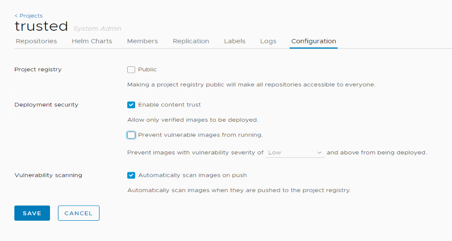
</details>
<br/>

## Step 2: Build Docker Image for Planespotter Frontend

In Step 2, you will clone the planespotter repo and use the downloaded source files to build a container for the planespotter frontend app, and prepare Harbor to host containers for the planespotter app deployment

In this case we will only build the planespotter frontend container ourselves, as the planespotter repo already includes K8s deployment manifests configured to download pre-built containers from docker hub. The process of building the containers is the same so for expediency you will only build the frontend to learn the build process

2.1 From the ControlCenter Desktop, open putty and under `Saved Sessions` connect to `cli-vm` and wait for the bash prompt

<details><summary>Screenshot 2.1 </summary>
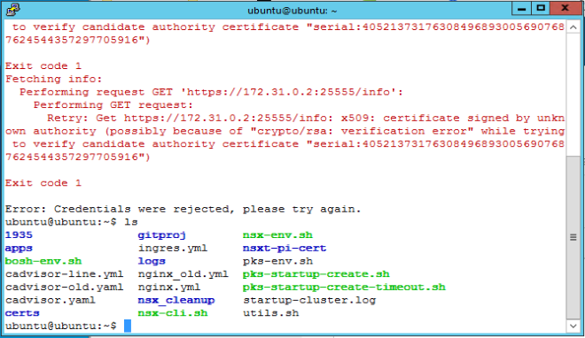
</details>
<br/>

2.2 As the `ubuntu` user, run `sudo -i` to login as the `root` user (`ubuntu` user's pw is `VMware1!`)

2.3 From the cli-vm prompt, clone the planespotter github repository with the following commands:

```bash
cd ~
git clone https://github.com/CNA-Tech/planespotter.git
```

<details><summary>Screenshot 2.3</summary>
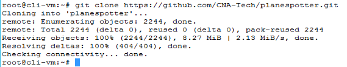
</details>
<br/>

2.4 View the planespotter frontend dockerfile with the following commands:

```bash
cd ~/planespotter/frontend/
ls
cat Dockerfile
```

<details><summary>Screenshot 2.4 </summary>
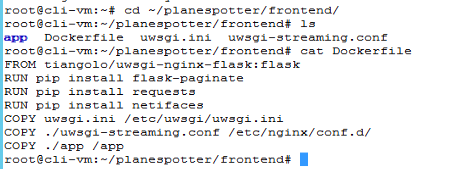
</details>
<br/>

2.5 Verify there are no existing docker images present on the `cli-vm` by running `docker images`. If images are present (as shown in screenshot 2.5.1) run the following command to clear them out before proceeding:

~~~
docker rmi -f $(docker images -a -q)
~~~

<details><summary>Screenshot 2.5.1 </summary>
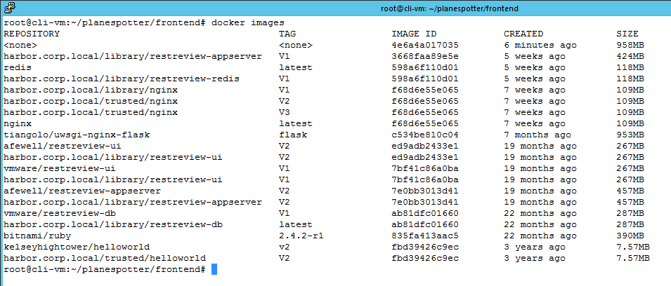
</details>
<br/>

<details><summary>Screenshot 2.5.2 </summary>
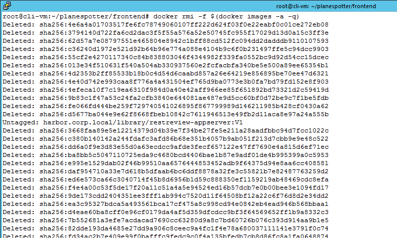
</details>
<br/>

2.6 Build the planespotter frontend container image with the command `docker build .` and copy the image ID from the last line of the output to the clipboard as shown in the screenshots below

<details><summary>Screenshot 2.6.1 </summary>
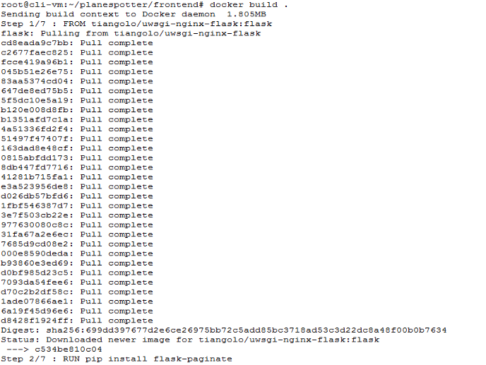
</details>

<details><summary>Screenshot 2.6.2 </summary>
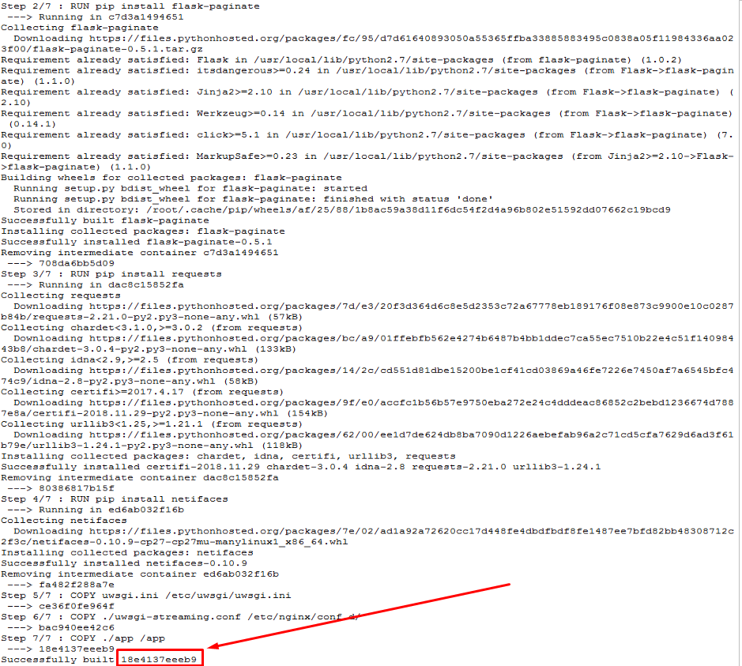
</details>
<br/>

2.7  Enter the command `docker images` and observe that you can now see the docker image with the id you copied from the previous step in in the local docker image cache on `cli-vm`

<details><summary>Screenshot 2.7</summary>
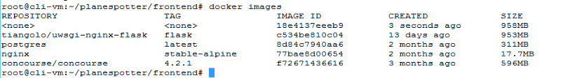
</details>

## Step 3: Push and Pull Container Images From Harbor

3.1 Return to your web browser session with Harbor and re-login if needed. From the `Projects` page, click on `library`, and on the Repositories tab, click `PUSH IMAGE`, keep this in mind if you ever need quick and convenient instructions for uploading to a Harbor repo

<details><summary>Screenshot 3.1</summary>

</details>
<br/>

3.2 From the `cli-vm` prompt, update the image tag and push to harbor with the following commands - be sure to replace the value `18e4137eeeb9` in the `docker tag` command below with the tag value you gathered in the previous step  

```bash
docker tag 18e4137eeeb9 harbor.corp.local/library/frontend:v1
docker login harbor.corp.local
 - User Name: admin
 - Password: VMware1!
docker push harbor.corp.local/library/frontend:v1
```

If the cli-vm doesn't DNS resolve harbor.corp.local:
Find the IP address (10.40.14.5) of the Harbor host from the ControlCenter (RDP desktop) DNS Mgr and add the IP address to /etc/hosts of cli-vm. After that do a docker login and then push!

If `docker login` fails with "Error response from daemon: Get https://harbor.corp.local/v2/: x509: certificate signed by unknown authority", you need to prepare the cli-vm docker engine configuration with the Harbor certificate, as documented in the [Installing Harbor Cert on External Clients Lab Guide](https://github.com/CNA-Tech/PKS-Ninja/tree/Pks1.4/LabGuides/HarborCertExternal-HC7212)

<details><summary>Screenshot 3.2 </summary>
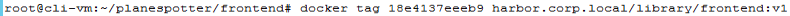
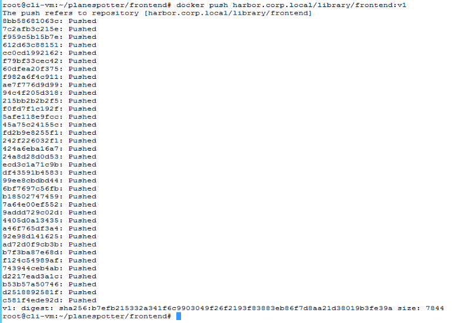
</details>
<br/>

3.3 Log into the Harbor UI and navigate to `Projects > library` and click on `library/frontend` to see the image you built and pushed to Harbor in the previous steps

<details><summary>Screenshot 3.3.1</summary>

</details>

<details><summary>Screenshot 3.3.2</summary>

</details>

<details><summary>Screenshot 3.3.3</summary>
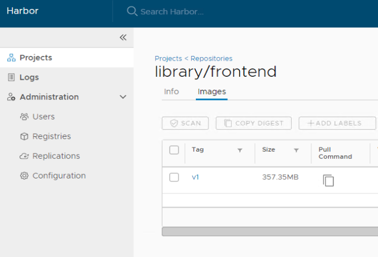
</details>
<br/>

3.4 On the `library/frontend` repo page, place your mouse over the copy icon in the `Pull Command` column, you should see a popup that shows the command to pull the image as shown in the screenshots below. Click on the copy icon in the `Pull Command` column to copy this command to the clipboard

<details><summary>Screenshot 3.4</summary>
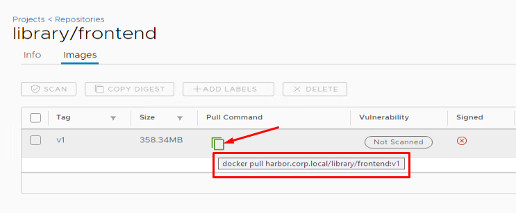
</details>
<br/>

3.5 From the `cli-vm` prompt, delete the local copy of the frontend container with the command `docker rmi harbor.corp.local/library/frontend:v1` and verify the image has been deleted with the command `docker images`

<details><summary>Screenshot 3.5</summary>
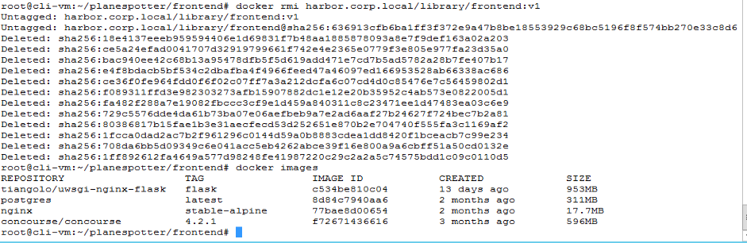
</details>
<br/>

3.6 From the `cli-vm` prompt, paste the docker pull command you copied in a previous step and verify the image is restored to the `cli-vm` local image cache with the following commands:

```bash
docker pull harbor.corp.local/library/frontend:v1
docker images
```

<details><summary>Screenshot 3.6</summary>
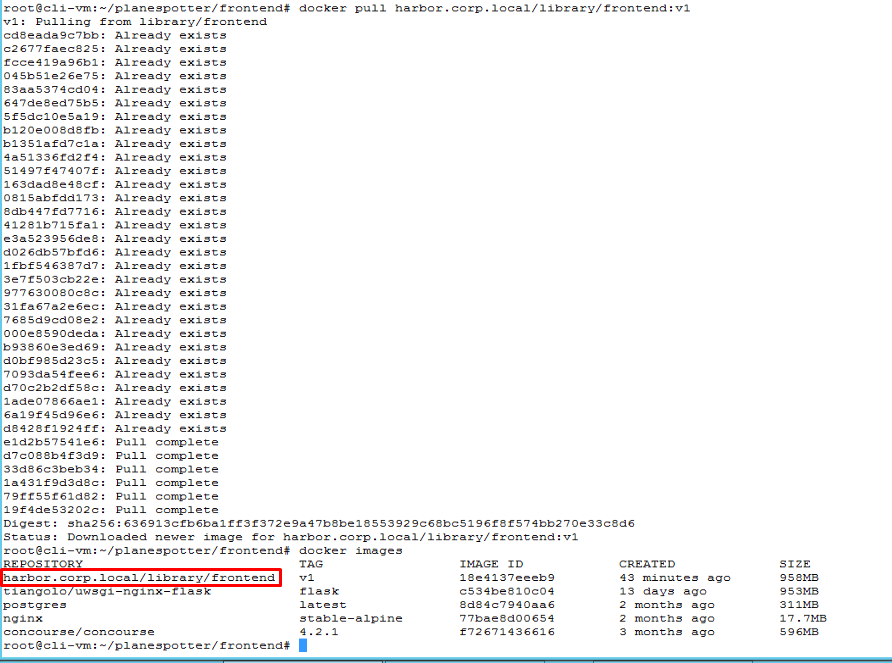
</details>
<br/>

## Step 4: Configure Image Vulnerability Scanning and Enforcement

4.1 Return to your web browser session with Harbor and re-login if needed. From the `Projects` page, click on `library`, and then on `library/frontend`. Check the box next to the `v1` image and click `Scan` to initiate a vulnerability scan for the image. Observe the progress in the `Vulnerability` column until the scan is complete, which typically takes from 10 seconds to 2 minutes

<details><summary>Screenshot 4.1.1</summary>
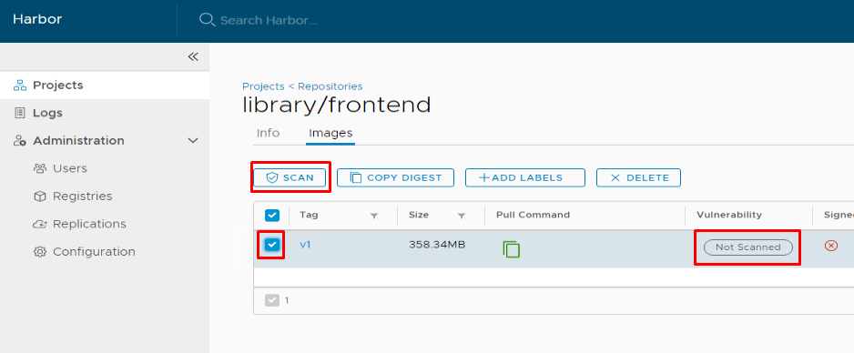
</details>

<details><summary>Screenshot 4.1.2</summary>
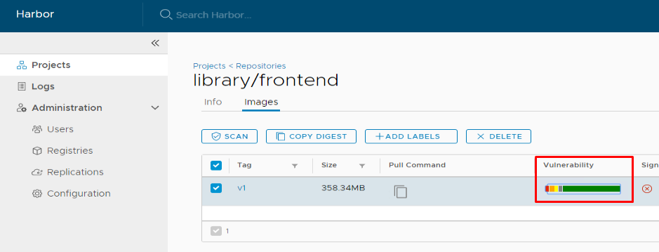
</details>
<br/>

If Harbor was deployed using the [Harbor Pipeline Install](https://github.com/CNA-Tech/PKS-Ninja/tree/Pks1.4/LabGuides/HarborPipelineInstal-IN4968) and no vulnerabilites are shown when you scan the image, you will need to reconfigure the PKS Harbor tile to set "Updater interval" to 1 hour and apply the changes.

<details><summary>Screenshot 4.1.3</summary>
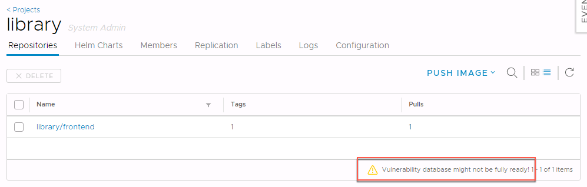
</details>
<br/>

4.2 Place your mouse over the multi-colored bar in the `Vulnerability` column to see a summary of the vulnerability scanning report

<details><summary>Screenshot 4.2</summary>
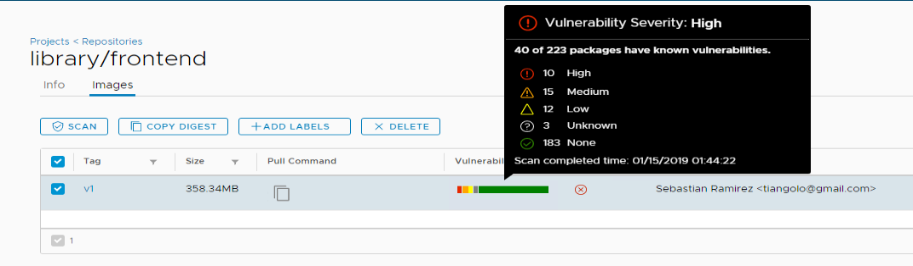
</details>
<br/>

4.3 Navigate to the `Projects/library` page and select the configuration tab. Check the box for `Prevent vulnerable images from running`, verify that images with a severity of `Low` and above are prevented from being deployed and click `Save`

<details><summary>Screenshot 4.3</summary>
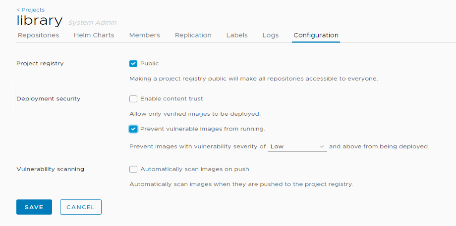
</details>
<br/>

4.4 From the `cli-vm` prompt, delete the local copy of the frontend container with the command `docker rmi harbor.corp.local/library/frontend:v1` and verify the image has been deleted with the command `docker images`

<details><summary>Screenshot 4.4</summary>

</details>
<br/>

4.5 From the `cli-vm` prompt, enter the command `docker pull harbor.corp.local/library/frontend:v1`. You should now see an error message indicating the vulnerable image is blocked from being downloaded, as shown in the following screenshot

```bash
docker pull harbor.corp.local/library/frontend:v1
```

<details><summary>Screenshot 4.5</summary>
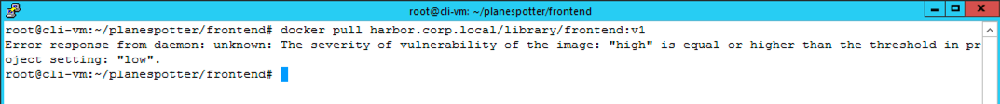
</details>
<br/>

4.6 Navigate to the `Projects/library` page and select the configuration tab. Uncheck the box for `Prevent vulnerable images from running` to return the `library` configuration to its default settings and click `Save`

<details><summary>Screenshot 4.6</summary>
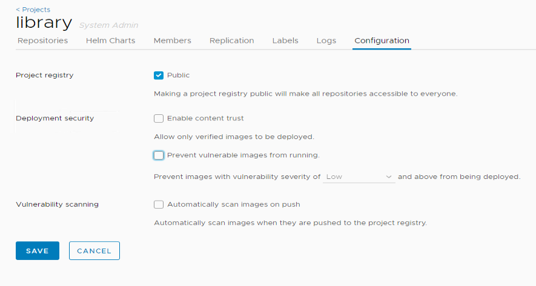
</details>
<br/>

4.7 Pull the image down again with the following command to prepare for Step 5:

```bash
docker pull harbor.corp.local/library/frontend:v1
```

<details><summary>Screenshot 4.7</summary>
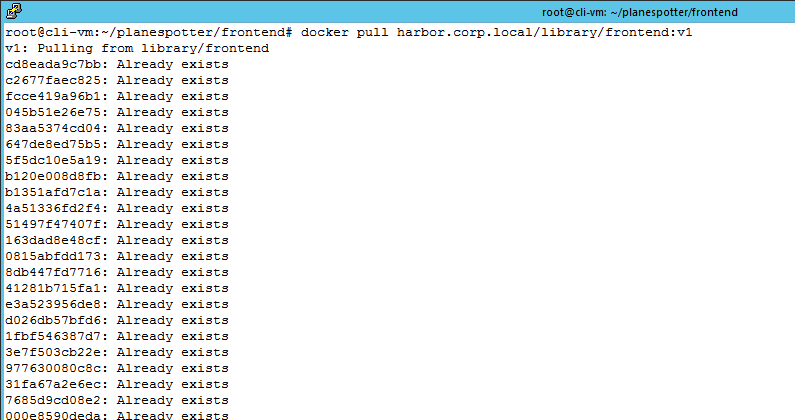
</details>
<br/>

## Step 5: Configure and validate Content Trust

The content trust feature allows admins to require that images be signed in order for the container to run, enabling a business process to be used where only images that meet policy requirements are signed and able to be deployed from repositories where content trust is enabled

5.1 From the `cli-vm` prompt, update the image tag to prepare the frontend:v1 image for upload to the `trusted` repository and push to harbor with the following commands:

```bash
docker tag harbor.corp.local/library/frontend:v1 harbor.corp.local/trusted/frontend:v1
docker push harbor.corp.local/trusted/frontend:v1
```

If docker push fails with "denied: requested access to the resource is denied", do "docker login harbor.corp.local" with user id=admin, and password = VMware1!, and then do docker push as above.

<details><summary>Screenshot 5.1</summary>
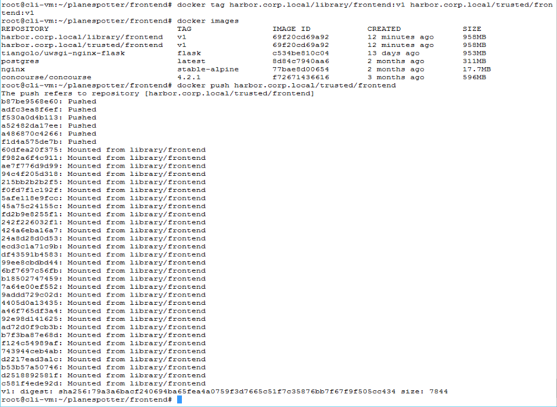
</details>
<br/>

5.2 Log into the Harbor UI and navigate to `Projects > trusted` and click on `trusted/frontend` to see the image you built and pushed to Harbor in the previous steps. Observe that the vulnerability scan has already been completed, which is because you enabled the `Automatically scan images on push` feature when you created the `trusted` project

<details><summary>Screenshot 5.2</summary>
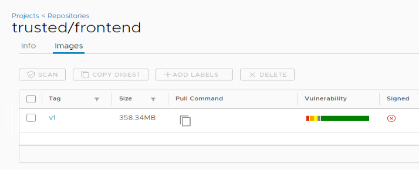
</details>
<br/>

5.3 From the `cli-vm` prompt, delete all local copies of the frontend container image and verify the image has been deleted with the command `docker images`

```bash
docker rmi harbor.corp.local/trusted/frontend:v1
docker images
```

<details><summary>Screenshot 5.3</summary>
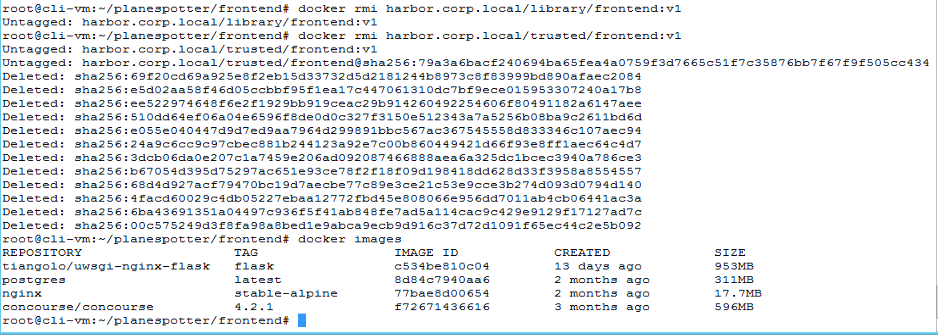
</details>
<br/>

5.4 From the `cli-vm` prompt, enter the command `docker pull harbor.corp.local/trusted/frontend:v1`. You should now see an error message indicating the unsigned image is blocked from being downloaded, as shown in the following screenshot

<details><summary>Screenshot 5.4</summary>
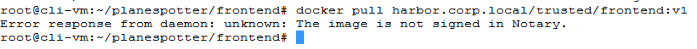
</details>
<br/>

5.5 From `cli-vm` configure environmental variables that enable the docker client to validate signed images with Harbor

```bash
export DOCKER_CONTENT_TRUST_SERVER=https://harbor.corp.local:4443
export DOCKER_CONTENT_TRUST=1
```

<details><summary>Screenshot 5.5</summary>
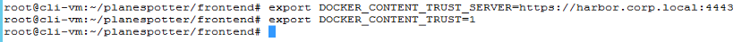
</details>
<br/>

5.4 From the `cli-vm` prompt, enter the command `docker pull harbor.corp.local/trusted/frontend:v1`. Observe that despite enabling content trust on the client, you are still prevented from downloading the image, which is because the image itself was never signed

<details><summary>Screenshot 5.4</summary>
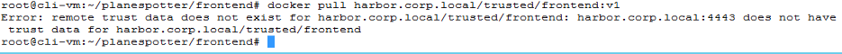
</details>
<br/>

5.5 Update the tag on the existing `harbor.corp.local/library/frontend:v1` image to prepare for uploading to the `trusted` project where content trust is enabled. Note that after you enter the push command, you will be prompted to enter passphrases for image signing, use the passphrase `VMware1!`

While you are still pushing the same unsigned image to harbor, because you enabled content trust on the `cli-vm` docker client, it will automatically sign an image when pushed

```bash
docker tag harbor.corp.local/library/frontend:v1 harbor.corp.local/trusted/frontend:v2
docker push harbor.corp.local/trusted/frontend:v2
```

<details><summary>Screenshot 5.5</summary>
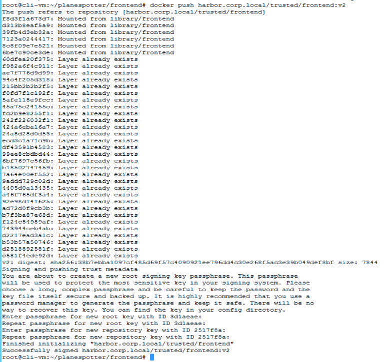
</details>
<br/>

5.6 From the `cli-vm` prompt, delete the local copy of the frontend:v2 container with the command `docker rmi harbor.corp.local/trusted/frontend:v2` and verify the image has been deleted with the command `docker images`

<details><summary>Screenshot 5.6</summary>
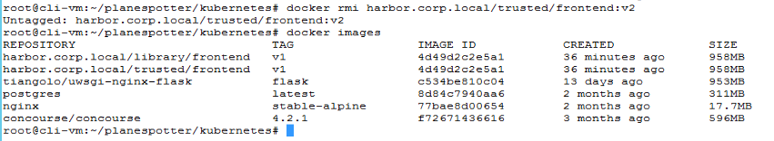
</details>
<br/>

5.7 From the `cli-vm` prompt, enter the command `docker pull harbor.corp.local/trusted/frontend:v2` and observe you are now able to download the signed image from the `trusted` repository with content trust restrictions enabled. Enter `Docker images` to verify that the frontend:v2 image is now in your local image cache

<details><summary>Screenshot 5.7</summary>
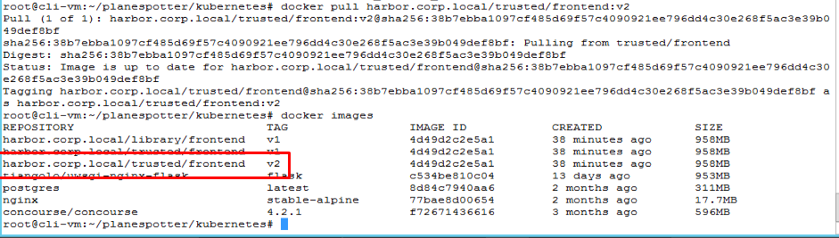
</details>
<br/>

5.7 Disable content trust on `cli-vm` with the command `export DOCKER_CONTENT_TRUST=0`

**You have now completed the Intro to Harbor lab**
