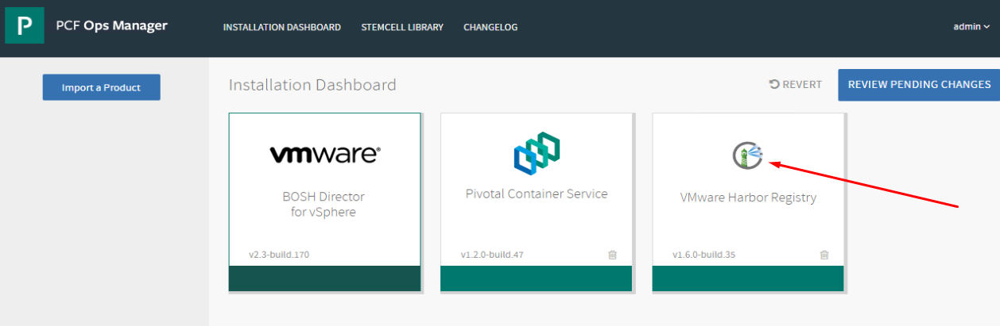
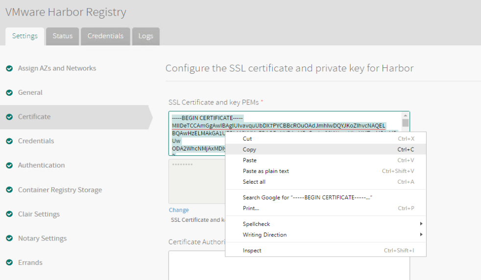
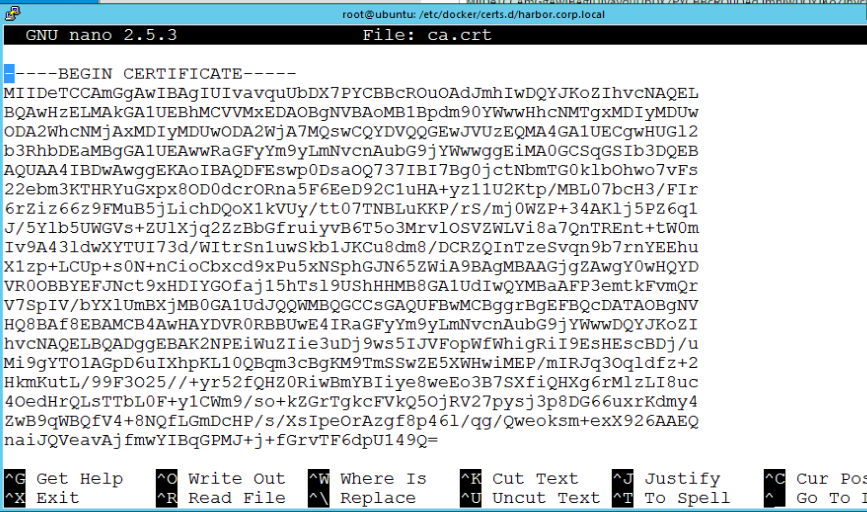
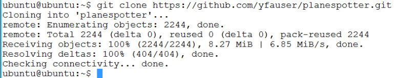
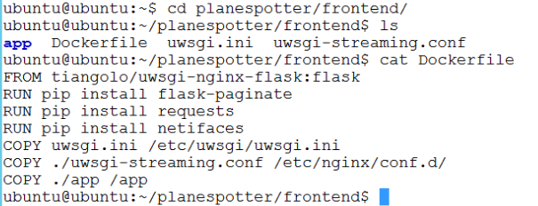
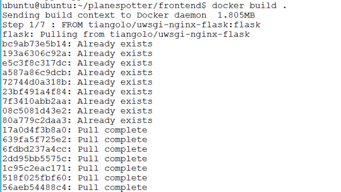
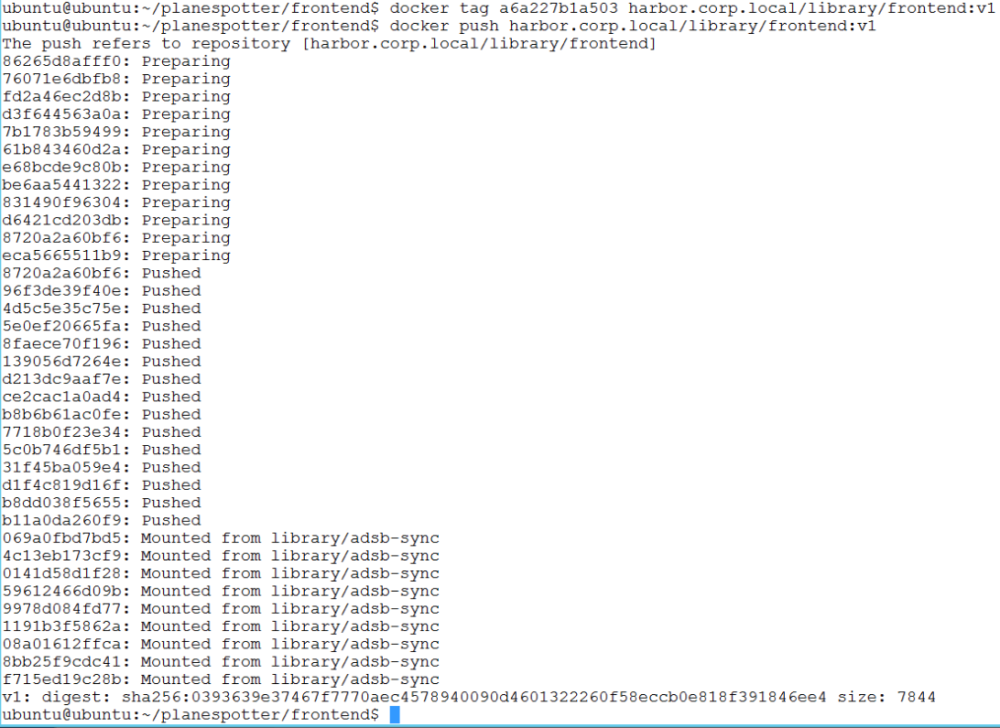

# Lab 4: Harbor Enterprise Container Registry

**Contents:**

- [Step 1: Prepare Projects and Repositories]()
- [Step 2: Install Harbor certificate on `cli-vm`]()
- [Step 3: Build Docker Image for Planespotter Frontend]()

## Overview

The application deployments in this lab make use of a private container registry. We are
using software from a VMware opensource project called Harbor as our registry. Harbor
is included as an enterprise supported product with Pivotal Container Service (PKS). In
this section, you will become familiar with the core capability of Harbor. You will create a project and see how to push and pull images from the repos. You will also enable
content trust so that images are signed by the publisher and only signed images may be
pulled from the project repo. You will also be introduced to the vulnerability scanning
capability of Harbor. Most organizations will use a private registry rather than public
Docker hub to improve security and latency for their applications. Although Harbor can
be deployed as a highly available application, we have not done that for this lab.

## Step 1: Prepare Projects and Repositories

Harbor organizes images into a set of projects and repositories within those projects.
Repositories can have one or more images associated with them. Each of the images
are tagged. Projects can have RBAC (Role Based Access Control) and replication policies
associated with them so that administrators can regulate access to images and create
image distribution pipelines across registries that might be geographically dispersed.
You should now be at a summary screen that shows all of the projects in this registry.
For our lab, we are interested in a single project called library.

1.1 Login to harbor.corp.local and click on `+ New Project`

Login info: admin/VMware1!

<details><summary>Screenshot 1.1 </summary>

</details>
<br/>

1.2 On the `New Project` screen, set the `Project Name` to `trusted` and click `OK`

<details><summary>Screenshot 1.2 </summary>

</details>
<br/>

1.3 On the `Projects` page, click on `trusted`,  click on the `configuration` tab and enter the values as shown in Screenshot 1.3

<details><summary>Screenshot 1.3</summary>

</details>
<br/>

1.4 On the `Projects` page, click on `library`,  and on the Repositories tab, click `PUSH IMAGE` and keep note of the commands for use in later steps

<details><summary>Screenshot 1.4</summary>

</details>
<br/>

## Step 2: Install Harbor certificate on `cli-vm`

Harbor and container registries in general typically need to negotiate communication with clients other than just K8s nodes, for example, developer workstations, pipeline tools, etc. When providing certificates for external clients fpr the sole purpose of communicating with Harbor, you should use the Harbor self-signed certificate instead of the Ops Man certificate. This minimizes the distribution of the Ops Manager certificate and is just good practice. Accordingly, we will install the Harbor certificate on the cli-vm ubuntu host we will be using to manually interact with docker and Harbor in this lab

Note: `cli-vm` is just a standard ubuntu jumpbox with docker, PKS CLI, Kubectl, GIT and a few other utilities installed

2.1 From the Ops Manager homepage, click on the `VMware Harbor Registry` tile, go to the `Certificate` tab and copy the SSL certificate text from the top textbox

<details><summary>Screenshot 2.1.1</summary>

</details>

<details><summary>Screenshot 2.1.2</summary>

</details>
<br/>

2.2 From the ControlCenter Desktop, open putty and under `Saved Sessions` connect to `cli-vm`.

<details><summary>Screenshot 2.2 </summary>

</details>
<br/>

2.3 Install the cert as a trusted source on the cli-vm by navigating to the `/etc/docker/certs.d/harbor.corp.local` directory (create this dierectory if i doesn't already exist) and creating a `ca.crt` file with the certificate text you copied in the previous step using the following commands:

```bash
mkdir /etc/docker/certs.d/harbor.corp.local
cd /etc/docker/certs.d/harbor.corp.local
nano ca.crt
# Paste the certificate text into nano, save and close the file
systemctl daemon-reload
systemctl restart docker
```

<details><summary>Screenshot 2.3.1</summary>

</details>

<details><summary>Screenshot 2.3.2</summary>

</details>
<br/>

You have now prepared `cli-vm' for secure communication with Harbor

## Step 3: Build Docker Image for Planespotter Frontend

In Step 3, you will clone the planespotter repo and use the downloaded source files to build a container for the planespotter frontend app, and prepare Harbor for the planespotter app deployment you will do later in Lab 5.

In this case we will only build the planespotter frontend container ourselves, as the planespotter repo already includes K8s deployment manifests configured to download pre-built containers from docker hub. While we do not have to build the containers in this case, its valuable to see the process and how to setup K8s manifests to pull from either Harbor or Docker Hub later in Lab 5

3.1 From the ControlCenter Desktop, open putty and under `Saved Sessions` connect to `cli-vm` and wait for the bash prompt

<details><summary>Screenshot 3.1 </summary>

</details>
<br/>

3.2 From the cli-vm prompt, clone the planespotter github repository with the following commands:

```bash
cd ~
git clone https://github.com/yfauser/planespotter.git
```

<details><summary>Screenshot 3.2</summary>

</details>
<br/>

3.3 View the planespotter frontend dockerfile with the following commands:

```bash
cd ~/planespotter/frontend/
cat Dockerfile
```

<details><summary>Screenshot 3.3 </summary>

</details>
<br/>

3.4 Build the planespotter frontend container image with the command `docker build .` and copy the image ID from the last line of the output to the clipboard

<details><summary>Screenshot 3.4.1 </summary>

</details>

<details><summary>Screenshot 3.4.2 </summary>

</details>
<br/>

3.5 Update the image tag and push to harbor with the following commands - be sure to replace the value `a6a227b1a503` in the `docker tag` command below with the tag value you gathered in the previous step  

```bash
docker tag a6a227b1a503 harbor.corp.local/library/frontend:v1
docker login harbor.corp.local
 - User Name: admin
 - Password: VMware1!
docker push harbor.corp.local/library/frontend:v1
```

If docker push fails with "denied: requested access to the resource is denied", do "docker login harbor.corp.local" with user id=admin, and password = VMware1!, and then do docker push as above.

If the cli-vm doesn't DNS resolve harbor.corp.local:
Find the IP address (10.40.14.5) of the Harbor host from the ControlCenter (RDP desktop) DNS Mgr and add the IP address to /etc/hosts of cli-vm. After that do a docker login and then push!

<details><summary>Screenshot 3.5 </summary>

</details>
<br/>

3.6 Log into the Harbor UI and navigate to `Projects > library` and click on `library/frontend` to see the image you built and pushed to Harbor in the previous steps.

<details><summary>Screenshot 3.6.1 </summary>

</details>

<details><summary>Screenshot 3.6.2 </summary>

</details>

<details><summary>Screenshot 3.6.3 </summary>

</details>
<br/>

## [Click here to proceed to Lab 5: Deploy your First PKS Cluster & Planespotter app](../DeployFirstCluster-DC1610)

<!--

## Step 5 Content Trust & Vulnerability Scanning

Content trust allows admins to require that images be signed in order for the container to run. In this section, you will push untrusted and trusted images to Harbor that we have pre-installed in the `cli-vm` in your the lab vPod, use them to validate the content trust feature You will also trigger a Clair vulnerability scan and view the results. Note that content trust and vulnerability scanning features are independent of one another and can be used seperately

5.1 Resume or if needed reopen your SSH connection to `cli-vm` and upload the untrusted image with the command `docker push harbor.corp.local/trusted/helloworld:V2`

<details><summary>Screenshot 5.1 </summary>

</details>
<br/>

5.2 From `cli-vm` configure environmental variables that enable the docker client to validate signed images with Harbor and upload the trusted image with the following commands. Use the passphrase `handsonlab` when prompted

```bash
export DOCKER_CONTENT_TRUST_SERVER=https://harbor.corp.local:4443
export DOCKER_CONTENT_TRUST=1
docker push harbor.corp.local/trusted/nginx:V2
#passphrase = handsonlab
```

<details><summary>Screenshot 5.1 </summary>

</details>
<br/>

## Click here to proceed to [Lab 5: Deploy your First PKS Cluster & Planespotter app](../Lab5-DeployFirstCluster)


**Login to Harbor UI**

1. Click on Google Chrome
2. Click on Harbor.corp.local bookmark
3. Login to Harbor with Username: admin and Password: VMware1!

**View Projects and Repositories**


The library project contains five repositories and has no access control. it is available to
the public.

1. Click on library to see the repos

You now see the five different repos. The restreview repos will be used in Module 4 to
deploy our restaurant review application.


**View Restreview-ui Repo Images**

1. Click on the library/restreview-ui repo

**View Image Vulnerability Summary**

Notice that there are two images. During lab preparation two versions of the same
image were uploaded so that we could upgrade our application in Module 4.
Vulnerability scanning is part of PKS deployed Harbor registry.


1. Click on either of the images to see its vulnerability threat report.

**View Image Vulnerability Report**

Each vulnerability is detailed, along with the package containing it, and the correct
package version to fix the vulnerability.


**Create Trusted Project**

So far you have been using unsigned images. Now we want to have a production
project that only contains images that are trusted. In order to do that we must sign the
images. Let's start by creating a new project.

1. Click on Projects

**Create New Project**

1. Click on + Projects


**Enter Project Name**

1. Enter trusted for the project name and click OK

**Verify Project Created**

Note: The name of the project MUST be "trusted", in all lower case. We have tagged
images with that path for you to use later in the lab. Using a different name will cause
the image push to fail.

1. click on trusted to open your new project


**Enable Content Trust on Your Project**

1. Click on Configuration


We have options to Enable Content Trust and prevent vulnerable images from running.
The image vulnerability restricts the pulling of images with CVEs that were identified in
the image scans we saw previously. Enabling content trust means that only signed
images can be pulled from this project.

1. Enable content trust and click Save

**Push Unsigned Image**


1. Type docker push harbor.corp.local/trusted/helloworld:V2

We have an existing unsigned image that we want to push into our trusted project.

Let's go back to the Harbor UI and see our image.

**View Unsigned Image**

1. Click on Repositories
2. Click on the Repo name to see the individual image tags
3. Note that the image is unsigned

Now let's go back to the CLI

**Enable Docker Content Trust**

1. Type export DOCKER_CONTENT_TRUST_SERVER=https://harbor.corp.local:4443
2. Type export DOCKER_CONTENT_TRUST=1

These two commands enable image signing through Docker content trust and point to
the Notary server. Our notary server is our Harbor registry


**Push Signed Image**

1. Type docker push harbor.corp.local/trusted/nginx:V2
2. Type passphrase at all prompts: handsonlab

The root passphrase is only entered the first time you push a new image to your project.
Note that you should not use the standard hol password 'VMware1!'. Docker notary
doesn't seem to like the !. handsonlab was used as the password in testing.

Let's return to Harbor and see our signed image.

**View Signed Image**


1. Click on Respositories in Harbor so your nginx image is visible
1. Click on trusted/nginx image and verify that it was signed

Let's create Kubernetes pods from our two images and see what happens. Return to
the CLI.

**Create Pod From Unsigned Image**

1. Type kubectl apply -f /home/ubuntu/apps/hello-trusted-unsigned.yaml
2. Type kubectl get pods

Notice that there was an error pulling the image. Let's investigate further.


**Describe Pod To Find Error**

1. Enter kubectl describe po/helloworld-v2-#########

Replace the ###### with the pod id from your previous kubectl get pods command.
You can see why the pod failed to create. The image was not signed. Now let's run a
pod with our signed image.

First let's clean up.

**Clean Up Pod**

1. Type kubectl delete -f /home/ubuntu/apps/hello-trusted-unsigned.yaml

This command will delete our deployment.

**Create Pod From Signed Image**

The first thing we need to do is create a secret. This will be mounted on our pod and
shared with Harbor for authentication when pulling our image from the registry.

1. Type kubectl create secret docker-registry regsecret
    --docker-server=http://harbor.corp.local --docker-username=admin
    --docker-password=VMware1! --docker-email=admin@corp.local


The secret contains the information needed to login to the registry. Let's now take a
look at the yaml file for our signed image.

**View Yaml To Create Pod From Signed Image**

1. Type cat nginx-trusted-signed.yaml

Note the imagePullSecrets refers to the secret we just created. Now we will create our
pod from the signed image.


**Create Pod**

1. Type kubectl apply -f nginx-trusted-signed.yaml
2. Type kubectl get pods

**Describe Pod To Verify Successful Image Pull**

1. Type kubectl describe po/nginx-##### where ###### is the number for your pod
    in the get pods command


**Clean Up Deployment**

1. Type kubectl delete -f nginx-trusted-signed.yaml


### Conclusion.............................................................................................................

**You should now have an understanding of Harbor Container Registry**

**You've finished Lab 4**

Congratulations on completing Lab 4!
--!>
