# Introduction to Helm

**Contents:**

- [1.0 Setup Tiller & Initialize Helm]()
  - [Understanding Tiller & Security]()
  - [1.1 Install the Helm client on the `cli-vm`]()
  - [1.2 Tillerless Helm using a Client-side Tiller Server]()
  - [1.3 Helm with remote Tiller Server, Tiller Service Account & Kubernetes RBAC]()
- [2.0 Explore Helm]()
  - [2.1 Deploy First Helm App]()
  - [2.2 Explore Helm Commands and Application Management Features]()
<!-- - [2.3 Upgrade Helm Application]() 
- [3.0 Create a Planespotter Helm Chart]()
  - [3.1 Prepare Planespotter Helm Chart]()
  - [3.2 Deploy Planespotter with Helm Chart]()
  - [3.3 Modify & Upgrade Planespotter with Helm]() -->

## Overview

This lab guide will cover installing Helm and configuring it for use in your PKS environment. Helm is known as the 'package manager for Kubernetes'.  A very popular way to build, share and deploy software designed to run in Kubernetes.

Helm provides standard application package management features much like apt or yum on Linux, except Helm does this for applications running on Kubernetes.

Most cloud native applications are made up of several distinct applications commonly called microservices that run in independent containers and work together to provide compisite application features and services.

For example, the [Planespotter](https://github.com/CNA-Tech/PKS-Ninja/blob/Pks1.4/LabGuides/BonusLabs/Deploy%20Planespotter%20Lab/readme.md) application used as an example in many PKS Ninja lab guides consists of 5 different distinct microservices as shown in the screenshot below:

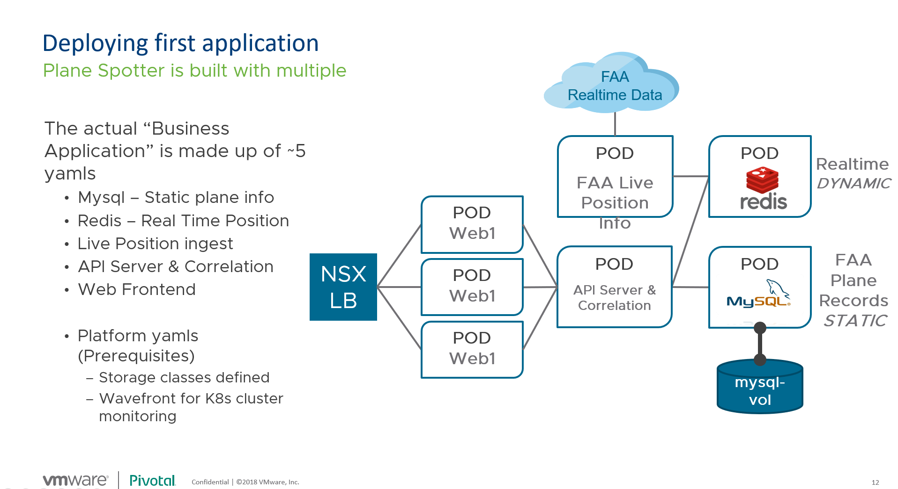

Each of the individual microservice applications that represent part of the overall planespotter app require a kubernetes deployment spec, service spec and possibly network specs, configmaps, persistent volume claims and other artifacts required to deploy the application.

While you can combine the specs for these different components into common manifest files, Kubernetes itself doesnt have any understanding of the relationships between these different microservices.

Helm is designed to bring all of the different microservices required for an application together into a common versioned package, and can help with deployment, operations and lifecycle management of the application as a whole.

### Prerequisites

To complete this lab, you need to have a compatible lab environment with a kubernetes cluster deployed using the method and configuration in the [Deploy first cluster](https://github.com/CNA-Tech/PKS-Ninja/tree/Pks1.4/LabGuides/DeployFirstCluster-DC1610) lab guide, or by loading a clusterReady Ninja lab template. Also ensure you have your kubectl config context set to your deployed K8s cluster by logging into PKS and using the `pks get-credentials my-cluster` command.

## 1.0 Setup Tiller and Initailize Helm

Before you can use Helm, you need to determine how you want to setup the tiller server, a component included with Helm used to execute functions on the Kubernetes API.

This lab guide includes instructions on installing tiller on the client workstation (also known as 'tillerless' helm) in section 1.1, and installing tiller in the remote kubernetes cluster in section 1.2.

**You only need to complete either section 1.2, or section 1.3, not both. Once you have completed either section 1.2 OR 1.3, you can proceed to section 2.0. If you want to quickly get started with Helm, we recommend setting up tiller on the client workstation with section 1.2. For a deeper explanation of this decision, please read the [Understanding Tiller & Security]() section below.

### Understanding Tiller & Security

Helm runs locally on the client workstation or server that is initiating Helm commands. Helm provides standard application package management features much like apt or yum on Linux, except Helm does this for applications running on Kubernetes. To provide this service, helm includes an application called Tiller Server (aka Tiller) that is usually installed as a pod in the kubernetes cluster that is setup for running helm packaged application.

When you enter a helm command to, for example, install an application, helm communicates the instructions to the tiller server which interacts with the kubernetes api to execute commands.

As tiller has the ability to execute privliedge commands within a kubernetes cluster, it should always be installed with thorough security precautions as detailed in [Securing your Helm Installation](https://helm.sh/docs/using_helm/#securing-your-helm-installation) page in the Helm Documentation. To communicate with the kubernetes API, tiller needs to have a service account, which should be assigned the minimal level of permissions needed to execute only the required commands it needs to. Kubernetes can allow for extremely granular RBAC permissions which allows very thorough and granular security in production environments, however this level of detail is beyond the scope of this lab guide.

Many helm tutorials bypass the need for granular rbac configuration by assigning administrator level permissions to the tiller service account, which is an effective way to demonstrate how to create a tiller service account and apply an RBAC configuration, albeit in a simplified context by using the administrator account for permissions. This method is shown below in section 1.3, it is simple and works effectively, however this should never be used on production or public-internet facing applications as it presents a significant security vulnerability. It should always be used with great caution, as if an administrator is not careful, they could leave a tiller server running in a remote kubernetes cluster without even being aware of it.

However, rather than installing tiller into a remote kubernetes cluster, you can simply run tiller on the same client workstation where helm is running, which allows an administrator to execute helm/tiller functions using the administrators login session, only while the administator is logged into their session.

It is very useful for kubernetes and pks administators to be able to take advantage of helm and tiller without needing to worry about the potential security implications of a remote tiller server, and accordingly we recommend using the 'Tillerless Helm' methodology provided in section 1.2.

This method is commonly referred to as 'Tillerless Helm', and we will refer to this method, detailed in section 1.2, as the 'Tillerless Helm' method. It should be noted however that while this method is commonly referred to as 'Tillerless Helm', there are other methods of using helm without tiller entirely that sometimes also use the phrase 'Tillerless Helm'.

### 1.1 Install the Helm client on the `cli-vm`

Before we configure Helm, we need to install the Helm client on the `cli-vm` to ensure we can utilize `helm` commands from the `cli-vm` to deploy apps to our cluster.

1.1.1 From the Main Console (ControlCenter) desktop, open putty and under saved sessions, open a ssh connection to `cli-vm`

<details><summary>Screenshot 1.1.1</summary>

</details>
<br/>

**Note:** Ensure you have run the `pks get-credentials my-cluster` command before proceeding as Helm will need access to your cluster via the config file

1.1.2 Run the following commands to retrieve the Helm client archive package, unpack the archive, and move the `helm` executable into the local path:
~~~
wget https://get.helm.sh/helm-v2.14.3-linux-amd64.tar.gz
~~~

~~~
tar -zxvf helm-v2.14.3-linux-amd64.tar.gz
~~~

~~~
mv linux-amd64/helm /usr/local/bin/helm
~~~

<details><summary>Screenshot 1.1.2</summary>
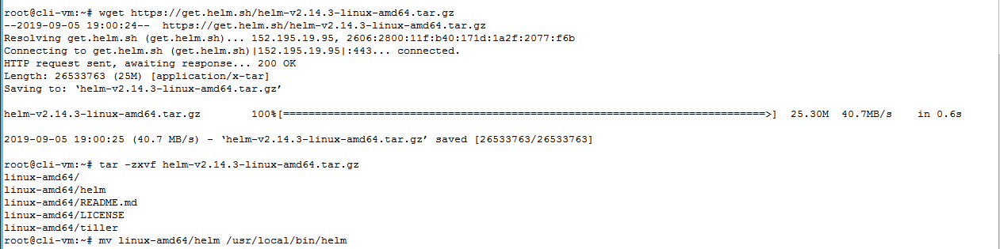
</details>
<br/>

Now that you have installed the Helm client, you are ready to configure Helm on your cluster.

 ### 1.2 Tillerless Helm using a Client-side Tiller Server

1.2.1 The first thing you'll need to do is initialize the Helm client to create the required directory structure for Helm to store it's configuration files and plugins via the `helm init --client-only` command:

~~~
helm init --client-only
~~~

<details><summary>Screenshot 1.2.1</summary>
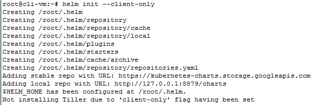
</details>
<br/>

1.2.2 To setup tillerless helm, you will use the [Tillerless Helm Plugin](https://github.com/rimusz/helm-tiller). Install the plugin with the command `helm plugin install https://github.com/rimusz/helm-tiller`.

<details><summary>Screenshot 1.2.2</summary>
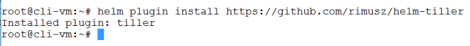
</details>
<br/>

1.2.3 Start Tiller Server locally and initialize helm with the command `helm tiller start`.

<details><summary>Screenshot 1.2.3</summary>
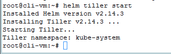
</details>
<br/>

### 1.3 Helm with remote Tiller Server, Tiller Service Account & Kubernetes RBAC

1.3.1 - Create a service account for Tiller and bind it to the cluster-admin role

*Note: For expediency in this example we bind the cluster-admin priviledges to the Tiller service account. You should never do this in production environments where the minimum needed permissions should be assigned to the Tiller service account. For guidance on additional security recommendations for production deployments, please see [Securing your Helm Installation](https://github.com/helm/helm/blob/master/docs/securing_installation.md).*

From the `cli-vm` prompt, create a new k8s RBAC config file with the command `nano rbac-config.yaml`

<details><summary>Screenshot 1.3.1 </summary>
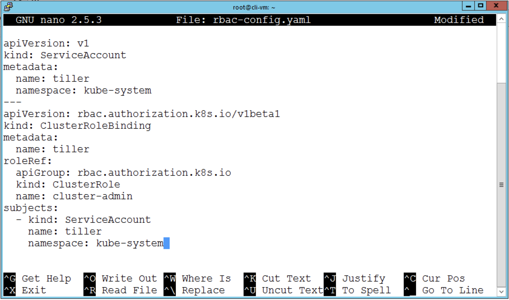
</details>

1.3.2 - Copy the below text into the open file in nano

```yaml
apiVersion: v1
kind: ServiceAccount
metadata:
  name: tiller
  namespace: kube-system
---
apiVersion: rbac.authorization.k8s.io/v1beta1
kind: ClusterRoleBinding
metadata:
  name: tiller
roleRef:
  apiGroup: rbac.authorization.k8s.io
  kind: ClusterRole
  name: cluster-admin
subjects:
  - kind: ServiceAccount
    name: tiller
    namespace: kube-system
```

Save the file - `ctrl + o` then `enter` <br/>
Then exit the text editor - `ctrl + x` then `enter`

1.3.3 - Create and bind the Tiller service account<br/> `kubectl create -f rbac-config.yaml`

1.3.4 - The `helm init` command will initialize Helm and Tiller on the client and in your cluster, and allow you to begin use! <br/>
`helm init --service-account tiller`

## 2.0 Explore Helm

In this section you will deploy your first helm app and explore helm commands

### 2.1 Deploy First Helm App

2.1.1 From the `cli-vm` prompt, set your kubernetes context with to the default namespace and update your Helm repo to ensure Helm can download the latest stable chart with the following commands

```bash
kubectl config set-context my-cluster --namespace default
helm repo update
```

<details><summary>Screenshot 2.1.1 </summary>
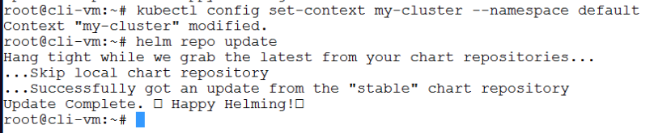
</details>
<br/>

2.1.2 - Install wordpress with a LAMP stack with the following command:

*Note: You can learn more about the helm chart used in this example with [LAMP and Wordpress here](https://github.com/helm/charts/tree/master/stable/lamp)*

```bash
helm install -f https://raw.githubusercontent.com/helm/charts/master/stable/lamp/examples/wordpress.yaml --name wordpress stable/lamp --set persistence.enabled=false
```

Notice the output and instructions on how to connect to the wordpress application you just deployed. Pay special attention to the instructions provided which includes the following command to simplify finding the external IP address for the wordpress service that is installed with the helm chart (do not enter this command yet as it will not work until the service is running) `export CHARTIP=$(kubectl get svc wordpress-lamp --output=jsonpath={.status.loadBalancer.ingress..ip})` as shown in the following screenshot.

<details><summary>Screenshot 2.1.2 </summary>
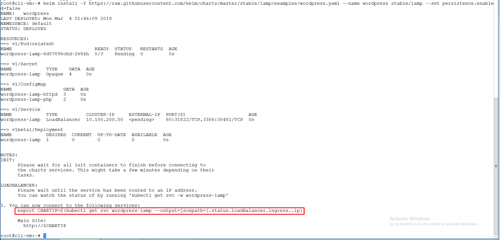
</details>
<br/>

2.1.3 Verify that the service is running by entering the command `kubectl get pods -w`, and watch the `STATUS` of the pods as they load up. Wait for all 3 containers in the pod for status to switch to `Running` and then press the keys `ctrl + c` to exit the watch loop for `kubectl get pods` as shown in the following screenshot:

Note: Depending on how quickly you enter this command after you run the helm install command in the previous step, the pods may already be in a running state by the time you execute the `kubectl get pods -w` command. In any case, once the pods are in a running state you can proceed to the next step.

<details><summary>Screenshot 2.1.3 </summary>
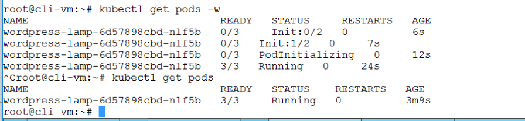
</details>
<br/>

2.1.4 Per the instructions provided when you entered the `helm install` command for your wordpress app in a previous step, enter the provided export command and view the `$CHARTIP` variable to find the external ip address for the load balancer VIP assigned to your wordpress service. Also view the kubectl services, which is an alternate way to find the load balancer VIP assigned to your wordpress service. Enter the following commands:

```bash
export CHARTIP=$(kubectl get svc wordpress-lamp --output=jsonpath={.status.loadBalancer.ingress..ip})
echo $CHARTIP
kubectl get services
```

Observe the service IP address value in the output of the above commands and keep note of the IP addresses in your command output as the IP address shown in this example may not be the same address used in your lab environment. The commands above will provide 2 ip addresses, the first ip address provided is for the external load balancer VIP assigned to the wordpress service, and the second ip address is assigned to the internal clusterIP VIP ip address that kubernetes pods would use to access the service internally within the kubernetes cluster.

**Note: The IP address for the wordpress service in this example may not be the same as the IP address assigned to the wordpress service in your pod. Please use the IP Address fro your pod in the following steps where you will need to connect to your wordpress server**

<details><summary>Screenshot 2.1.4 </summary>
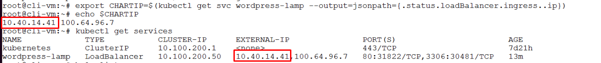
</details>
<br/>

2.1.5 From the Main Console (ControlCenter) desktop, open a browser session to the external ip address of your wordpress service as shown in the following screenshot:

<details><summary>Screenshot 2.1.5</summary>
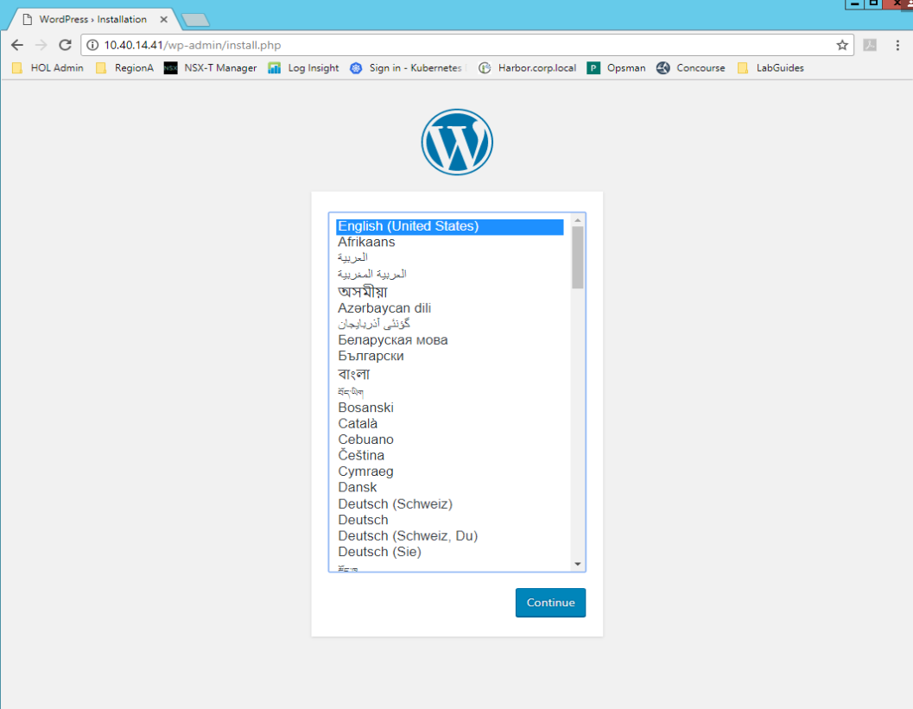
</details>
<br/>

2.1.6 The wordpress/LAMP helm chart used in this example installs apache, wordpress/php, and mysql into seperate containers that share a common pod. Enter the following command `kubectl get deployment wordpress-lamp -o wide` to view the containers included in the wordpress pod spec.

Observe in the command output that the `CONTAINERS` column lists the names assigned to the containers in the spec, and the `IMAGES` column lists the source images used to build the containers used in the pods in the `wordpress-lamp` deployment

<details><summary>Screenshot 2.1.6</summary>
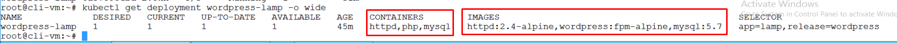
</details>
<br/>

2.1.7 Enter the following commands to observe the various kubernetes objects created by the wordpress/LAMP helm chart:

```bash
kubectl get pods -o wide
kubectl get deployments -o wide
kubectl get services -o wide
kubectl get rs -o wide
kubectl get configmaps
kubectl get secrets
```

<details><summary>Screenshot 2.1.7</summary>
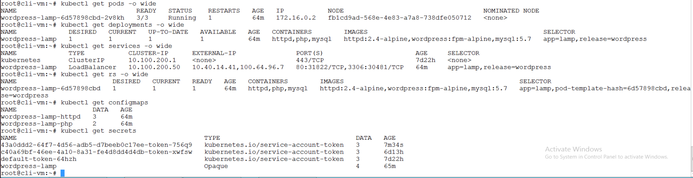
</details>
<br/>

2.1.8 From the Main Console (ControlCenter) desktop, open a windows command prompt and enter the following commands to prepare to connect to the kubernetes dashboard:

```bash
pks.exe login -a pks.corp.local -u pksadmin -k -p VMware1!
pks.exe get-credentials my-cluster
kubectl proxy
```

<details><summary>Screenshot 2.1.8</summary>
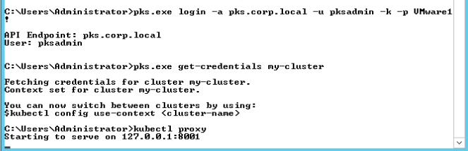
</details>
<br/>

2.1.9 From the Main Console (ControlCenter) desktop, open a chrome browser session and on the shortcuts bar select the shortcut `Kubernetes Dashboard` to access your kubernetes dashboard and proceed through the following steps to sign in:

- Select `Kubeconfig`
- Click on `Choose kubeconfig file`
- Navigate to the `C:\Users\Administrator\.kube` directory and select the `config` file
- Click `Sign In`

When you Sign in to the kubernetes dashboard, the homepage should show the overview page for your default namespace where your wordpress deployment is running. Scroll through the page to observe the various kubernetes artifacts that were deployed with this helm chart

<details><summary>Screenshot 2.1.9.1</summary>
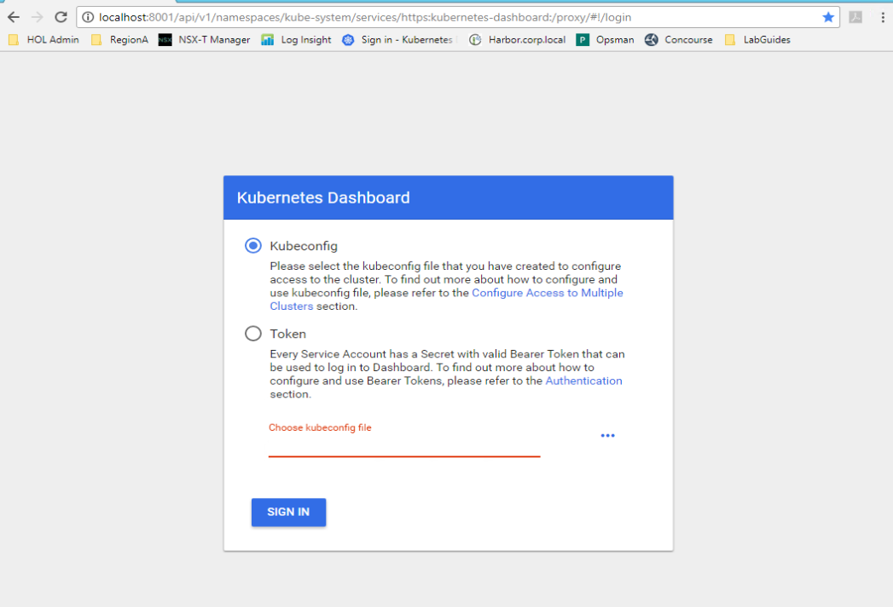
</details>

<details><summary>Screenshot 2.1.9.2</summary>
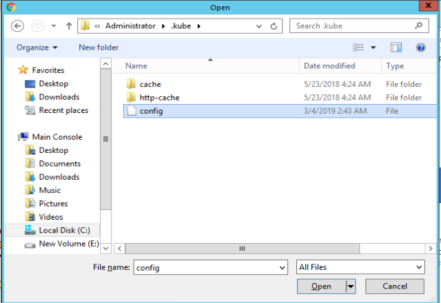
</details>

<details><summary>Screenshot 2.1.9.3</summary>
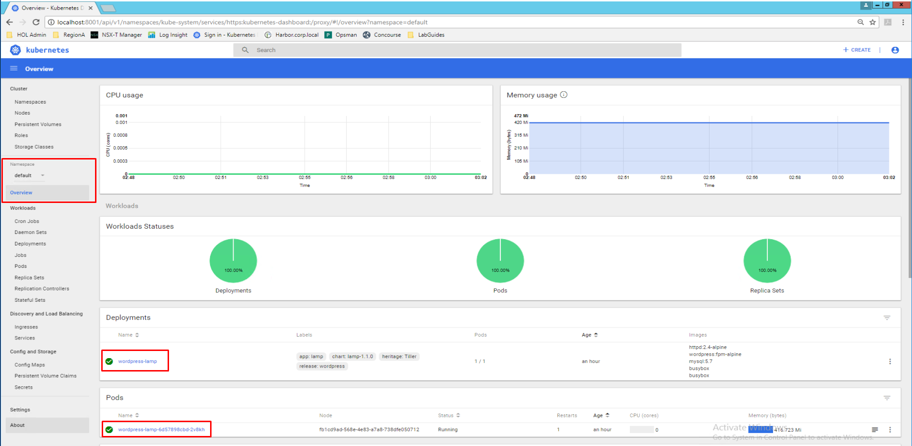
</details>

<details><summary>Screenshot 2.1.9.4</summary>
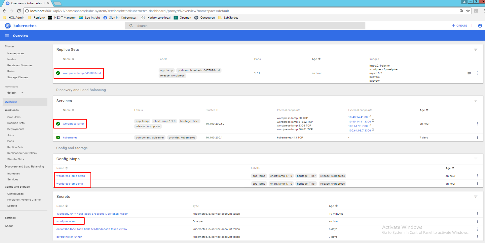
</details>
<br/>

### 2.2 Explore Helm Commands and Application Management Features

2.2.1 - When a chart is deployed, it is called a `release`.  You can see the running Helm charts by deployed and running with `helm ls`.

<details><summary>Screenshot 2.2.1 </summary>
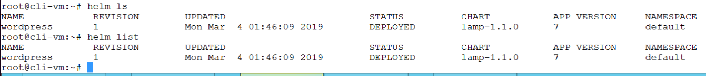
</details>
<br/>

2.2.2 Enter the command `helm status wordpress` using the deployment name from the output of the helm list command

<details><summary>Screenshot 2.2.2 </summary>
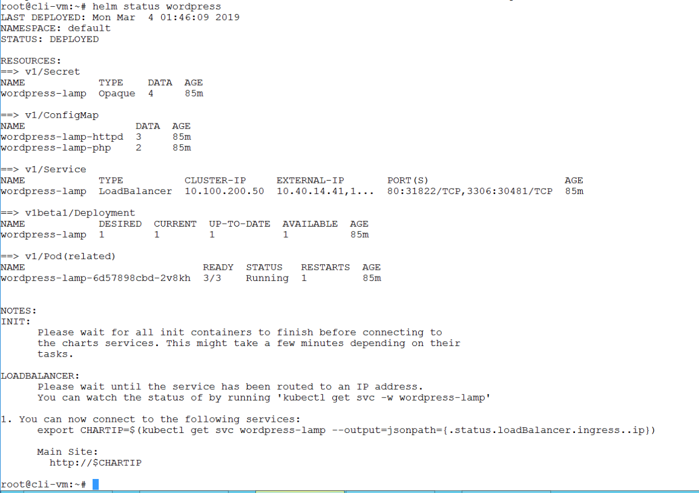
</details>
<br/>

2.2.3 Enter the command `helm get values wordpress` to see the configured value of common variables used in the wordpress installation.

<details><summary>Screenshot 2.2.3 </summary>
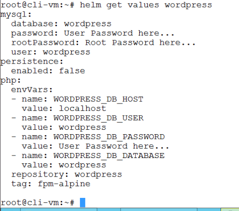
</details>
<br/>

2.2.4 Enter the command `helm history wordpress` to see the release version for the wordpress installation

<details><summary>Screenshot 2.2.4 </summary>
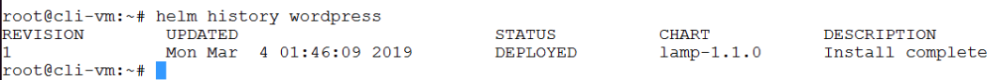
</details>
<br/>

2.2.5 **NOTE: If you are following the [Deliver Enterprise Containers & Kubernetes with PKS](https://github.com/CNA-Tech/PKS-Ninja/tree/Pks1.4/LabGuides/DeliverCloudNative-DK7212) lab guide, skip this step and proceed back to the lab guide and follow the instructions there**

All others, please proceed to clean up your environment per the following instructions:

Clean up your environment by deleting the wordpress installation with the following commands. Observe that the `--purge` flag must be used with the `helm delete` command to permanently delete an installation:

```bash
helm delete wordpress
helm ls -a
helm delete wordpress --purge
helm ls -a
kubectl get pods
kubectl get deployments
kubectl get services
```

<details><summary>Screenshot 2.2.5 </summary>
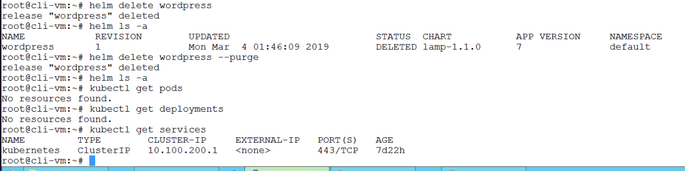
</details>

<!--
  - [2.2 Explore Helm Commands and Application Management Features]()
  - [2.3 Upgrade Helm Application]() 
- [3.0 Create a Planespotter Helm Chart]()
  - [3.1 Prepare Planespotter Helm Chart]()
  - [3.2 Deploy Planespotter with Helm Chart]()
  - [3.3 Modify & Upgrade Planespotter with Helm]()
-->

## Summary

From this guide, you should be able to deploy Helm/Tiller to your PKS K8s clusters including clusters leveraging RBAC.  You now know how to install a Helm chart, view the running Helm releases, and delete them as well.
