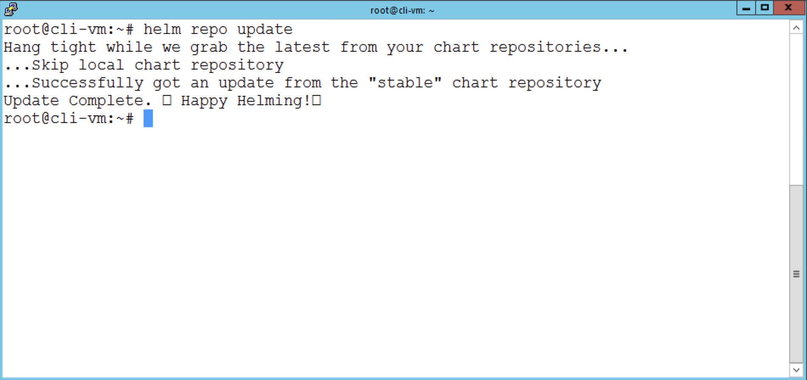
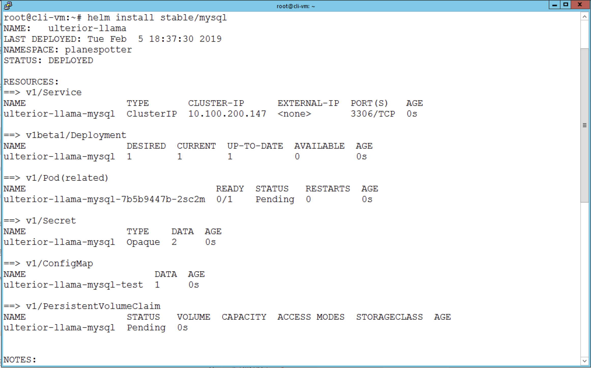
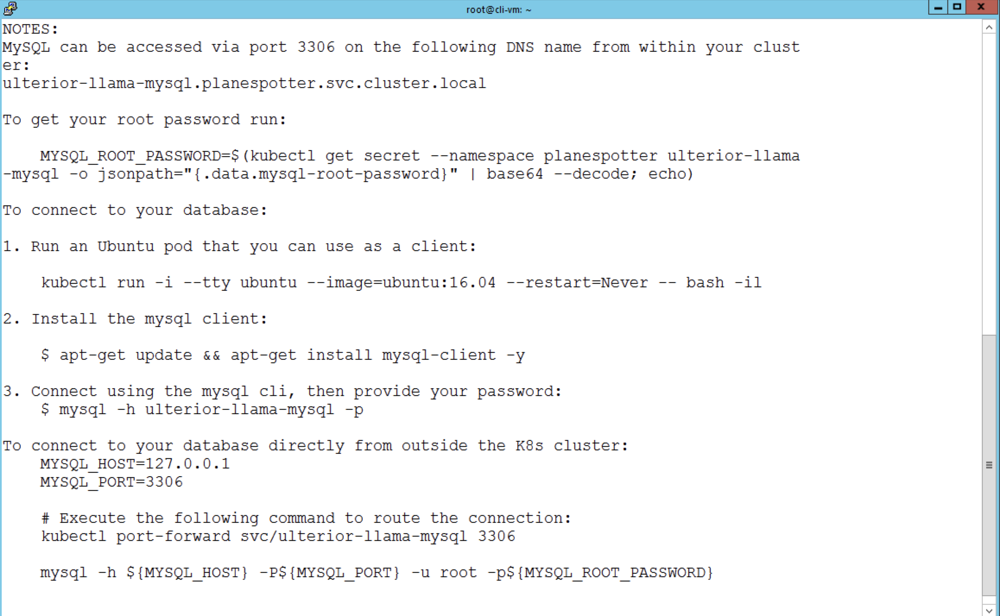
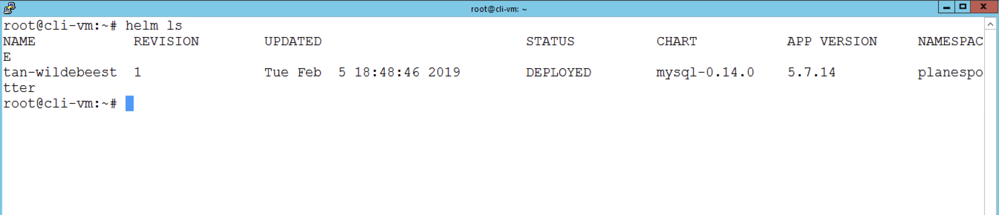

# Introduction to Helm

**Contents:**

- [Step 1: Configure Tiller and apply RBAC configuration file to create]()
- [Step 2: Apply the service account for Tiller created in Step 1]()
- [Step 3: Confirm you have Helm Installed]()
- [Step 4: Deploy Helm via Tiller service account]()
- [Step 5: Deploy a MySQL Helm Chart]()

## Overview

This lab guide will cover installing Helm and configuring it for use in your PKS environment.  This lab will cover use in a cluster that has RBAC enabled or not.  If your environment does not leverage RBAC you can skip to step 4.1.

Helm is known as the 'package manager for Kubernetes'.  A very popular way to build, share and deploy software designed to run in Kubernetes.

## Instructions
To complete this lab, you must have completed the `DeployFirstCluster-DC1610` and ensure you have your kubectl config context set to your cluster.  

Helm works in a client-server model by leveraging a Tiller pod running in the kube-system namespace within a K8's cluster.  In order for Tiller to access the K8s APIs required to deploy Helm Charts, you must create and bind a service account to it.  Then you can use the Helm CLI on your client, in our case on our `cli-vm`, to send in Helm charts to deploy applications through Tiller.

## Step 1: Configure Tiller
1.1 - Create a service account for Tiller and bind it to the cluster-admin role

In your `cli-vm`:

Create a new config file `nano rbac-config.yaml`

<details><summary>Screenshot 1.1.1 </summary>

</details>

1.2 - Copy the below text into the open file
```
apiVersion: v1
kind: ServiceAccount
metadata:
  name: tiller
  namespace: kube-system
---
apiVersion: rbac.authorization.k8s.io/v1beta1
kind: ClusterRoleBinding
metadata:
  name: tiller
roleRef:
  apiGroup: rbac.authorization.k8s.io
  kind: ClusterRole
  name: cluster-admin
subjects:
  - kind: ServiceAccount
    name: tiller
    namespace: kube-system
```

1.3 Save the file - `ctrl + o` then `enter`
1.4 Then exit the text editor - `ctrl + x` then `enter`

## Step 2: Apply the service account config

2.1 - Create and bind the Tiller service account</br> `kubectl create -f rbac-config.yaml`

## Step 3: Ensure Helm is Installed
3.1 - Check that Helm is installed, and what version you're using</br> `helm version`

<details><summary>Screenshot 3.1.1 </summary>

</details>

## Step 4: Deploy Helm via Tiller service account
4.1 - The `helm init` command will initialize Helm and Tiller on the client and in your cluster, and allow you to begin use! </br>
`helm init --service-account tiller`

*If skipping from the beginng of the guide because the environment is not using RBAC, you can simply run `helm init` and it will install Tiller into the cluster in your current kubectl context*

## Step 5: Deploy a MySQL Helm Chart
5.1 - Update your Helm repo to ensure Helm can download the latest stable chart </br>
`helm repo update`

<details><summary>Screenshot 5.1.1 </summary>

</details>

5.2 - Install the latest MySQL stable chart in the Helm public repository</br>
`helm install stable/mysql`

Notice the output and instructions on how to connect to the database you just deployed.

<details><summary>Screenshot 5.2.1 </summary>

</details>
<details><summary>Screenshot 5.2.2 </summary>

</details>

5.3 - When a chart is deployed, it is called a `release`.  You can see the running Helm charts by deployed and running with `helm ls`.

<details><summary>Screenshot 5.3.1 </summary>

</details>

5.4 - You can delete a running Helm release by running `helm delete <insert name from helm ls command>`

<details><summary>Screenshot 5.3.1 </summary>

</details>

## Summary
From this guide, you should be able to deploy Helm/Tiller to your PKS K8s clusters including clusters leveraging RBAC.  You now know how to install a Helm chart, view the running Helm releases, and delete them as well.
