# Introduction to Kubernetes - Lab Exercises

**Contents:**

- [Step 1: Connect to your Kubernertes Cluster](https://github.com/CNA-Tech/PKS-Ninja/tree/master/LabGuides/Lab1-IntroToKubernetes#step-1-connect-to-your-kubernetes-cluster)
- [Step 2: Explore your Kubernetes cluster](https://github.com/CNA-Tech/PKS-Ninja/tree/master/LabGuides/Lab1-IntroToKubernetes#step-2-explore-your-kubernetes-cluster)
- [Step 3: Review Sample Application Components](https://github.com/CNA-Tech/PKS-Ninja/tree/master/LabGuides/Lab1-IntroToKubernetes#step-3-review-sample-application-components)
- [Step 4: Pods, Replica Sets and Deployments](https://github.com/CNA-Tech/PKS-Ninja/tree/master/LabGuides/IntroToK8sPlaneSpotter-IK9674#step-4-pods-replica-sets-and-deployments)
- [Step 5: ClusterIP, NodePort, LoadBalancer & Ingress](https://github.com/CNA-Tech/PKS-Ninja/tree/master/LabGuides/Lab1-IntroToKubernetes#step-5-services---clusterip-nodeport--loadbalancer)
- [Next Steps](https://github.com/CNA-Tech/PKS-Ninja/tree/master/LabGuides/Lab1-IntroToKubernetes#next-steps)

## Step 1: Configure access to VKE and deploy Kubernetes cluster

1.1 From the control center desktop open putty and connect to `ubuntu@cli-vm`, login with the password VMware1!

1.2 From the CLI-VM Prompt, enter the command `pks login -a pks.corp.local -u pksadmin -p VMware1! -k` to log into the PKS API server in your lab

1.3 From the cli-vm prompt, enter the command `pks get-credentials my-cluster`. This command downloads authentication credentials for the kubernetes cluster in your lab which is named `my-cluster` and it prepares the configuration file for kubectl (the kubeconfig file) so when you enter kubectl commands, they will target the API of the Master node for the `my-cluster` cluster

1.4 From the cli-vm prompt, enter the command `cat /home/ubuntu/.kube/config` to view your kubeconfig file. Observe the file has a certificate, the connection URL and the cluster name for `my-cluster` saved in the file. Often devops workers may need to connect to several different clusters on a regular basis, the kubeconfig file can maintain login information for several clusters to allow you to switch between different clusters easily. 

<details><summary>Screenshot 1.4</summary>
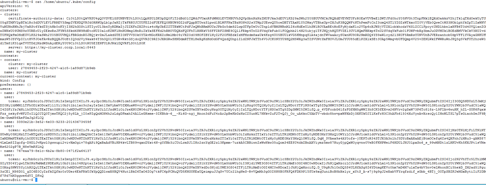
</details>
<br/>

1.5 View the pods and services in your cluster to validate connectivity

``` bash
kubectl get pods --all-namespaces
kubectl get svc --all-namespaces
```

<details><summary>Screenshot 1.5</summary>
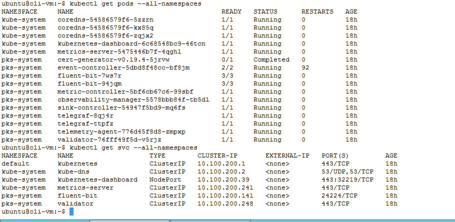
</details>
<br/>

## Step 2: Explore your Kubernetes cluster

2.1 Review your current kubeconfig and context with the command `kubectl config view -o yaml`

<details><summary>Expand to view sample output</summary>

``` bash
ubuntu@cli-vm:~$ kubectl config view -o yaml
apiVersion: v1
clusters:
- cluster:
    certificate-authority-data: DATA+OMITTED
    server: https://my-cluster.corp.local:8443
  name: my-cluster
contexts:
- context:
    cluster: my-cluster
    user: 27849453-2f23-4247-a1c5-1a89d871b9eb
  name: my-cluster
current-context: my-cluster
kind: Config
preferences: {}
users:
- name: 27849453-2f23-4247-a1c5-1a89d871b9eb
  user:
    token: eyJhbGciOiJSUzI1NiIsImtpZCI6IiJ9.eyJpc3MiOiJrdWJlcm5ldGVzL3NlcnZpY2VhY2NvdW50Iiwia3ViZXJuZXRlcy5pby9zZXJ2aWNlYWNjb3VudC9uYW1lc3BhY2UiOiJkZWZhdWx0Iiwia3ViZXJuZXRlcy5pby9zZXJ2aWNlYWNjb3VudC9zZWNyZXQubmFtZSI6IjI3ODQ5NDUzLTJmMjMtNDI0Ny1hMWM1LTFhODlkODcxYjllYi10b2tlbi1xc3o2ayIsImt1YmVybmV0ZXMuaW8vc2VydmljZWFjY291bnQvc2VydmljZS1hY2NvdW50Lm5hbWUiOiIyNzg0OTQ1My0yZjIzLTQyNDctYTFjNS0xYTg5ZDg3MWI5ZWIiLCJrdWJlcm5ldGVzLmlvL3NlcnZpY2VhY2NvdW50L3NlcnZpY2UtYWNjb3VudC51aWQiOiI4ZGFiYzJkNi1hODVhLTExZTktOGNjNi0wMDUwNTZhNTY1NzUiLCJzdWIiOiJzeXN0ZW06c2VydmljZWFjY291bnQ6ZGVmYXVsdDoyNzg0OTQ1My0yZjIzLTQyNDctYTFjNS0xYTg5ZDg3MWI5ZWIifQ.p_4VDFcobG61fzFGfHM5gWWI3h8CK3fEXvs26NVrv2gSxW73P6Tc818z-L9FIAv6wuHK_hZL-GYK6FqakQgGFzz_nekyfvWF2TcIlQJJIQ0TjmwTKQC2j5y8Lb_jI0sPZgQnMON6h2zLdgDFmxhZ4AlLwGHsme-3IKBhk-6__-Ki6G-ngj_Mnon3dFuY4rAr2pBeKbGzHzCZYunWL7NNkvZuF2TvQJj_Oc_uA6koCYAbTV-wbdc8hwvpxWPXbDj3XKUkUJIlKsFrH3C3hAFh61504XuVywAvXrsoQy1IHnWLTSL7pTsGiaohGeJF9B_r7Om-GwmN9fAeFGaJq2fLCQ
- name: 3393e21b-3e52-4e03-9233-20143673459f
  user:
    token: eyJhbGciOiJSUzI1NiIsImtpZCI6IiJ9.eyJpc3MiOiJrdWJlcm5ldGVzL3NlcnZpY2VhY2NvdW50Iiwia3ViZXJuZXRlcy5pby9zZXJ2aWNlYWNjb3VudC9uYW1lc3BhY2UiOiJkZWZhdWx0Iiwia3ViZXJuZXRlcy5pby9zZXJ2aWNlYWNjb3VudC9zZWNyZXQubmFtZSI6IjMzOTNlMjFiLTNlNTItNGUwMy05MjMzLTIwMTQzNjczNDU5Zi10b2tlbi1iMmQ5bCIsImt1YmVybmV0ZXMuaW8vc2VydmljZWFjY291bnQvc2VydmljZS1hY2NvdW50Lm5hbWUiOiIzMzkzZTIxYi0zZTUyLTRlMDMtOTIzMy0yMDE0MzY3MzQ1OWYiLCJrdWJlcm5ldGVzLmlvL3NlcnZpY2VhY2NvdW50L3NlcnZpY2UtYWNjb3VudC51aWQiOiIxMDNmNTRkNy1hODU3LTExZTktOGNjNi0wMDUwNTZhNTY1NzUiLCJzdWIiOiJzeXN0ZW06c2VydmljZWFjY291bnQ6ZGVmYXVsdDozMzkzZTIxYi0zZTUyLTRlMDMtOTIzMy0yMDE0MzY3MzQ1OWYifQ.DqM_3VAex9s4AY0ofs-jUEPTcR34STJX3A3nlhJ3DYoBxAXaAEjBtmOCefq6Zs4QXFnhJiMRu3-gAWS87Dxw4LmLm8IZqofg-D9DlJvKpwl0gwwupi2vivXmOgiv78qAPi9QxBaAdVBiHN4kvLTB89vqxnDYxt4N-gYfBb3iCUoLrmSJ1IHr2znYqGE2zl3Kpmm-7uzkA5CBBiwnZsWwNkw35uQom34EE8U4dkZBnAXViymz5mw87NuyGjpQxWOyqvnw0VeB0FKNPWeiF6HDUlJNJ0lpxSn6_s_99wMNDt1zLHKUvKh5KXJPt1sVMeJbZMs6202gP7B_M8eVmKfLhQ
- name: 767eaa79-8e1c-4b2a-8b80-0471f2a64137
  user:
    token: eyJhbGciOiJSUzI1NiIsImtpZCI6IiJ9.eyJpc3MiOiJrdWJlcm5ldGVzL3NlcnZpY2VhY2NvdW50Iiwia3ViZXJuZXRlcy5pby9zZXJ2aWNlYWNjb3VudC9uYW1lc3BhY2UiOiJkZWZhdWx0Iiwia3ViZXJuZXRlcy5pby9zZXJ2aWNlYWNjb3VudC9zZWNyZXQubmFtZSI6Ijc2N2VhYTc5LThlMWMtNGIyYS04YjgwLTA0NzFmMmE2NDEzNy10b2tlbi04N2ptaiIsImt1YmVybmV0ZXMuaW8vc2VydmljZWFjY291bnQvc2VydmljZS1hY2NvdW50Lm5hbWUiOiI3NjdlYWE3OS04ZTFjLTRiMmEtOGI4MC0wNDcxZjJhNjQxMzciLCJrdWJlcm5ldGVzLmlvL3NlcnZpY2VhY2NvdW50L3NlcnZpY2UtYWNjb3VudC51aWQiOiI0Mzg3NWY5Yy1hN2QyLTExZTktOGNjNi0wMDUwNTZhNTY1NzUiLCJzdWIiOiJzeXN0ZW06c2VydmljZWFjY291bnQ6ZGVmYXVsdDo3NjdlYWE3OS04ZTFjLTRiMmEtOGI4MC0wNDcxZjJhNjQxMzcifQ.D_U9gRJh1OnDQ3S4ULHfASg8Z6YDtmgKEVc0hm7mD6M7ulxTx4bV3nv0eLWnonXCi5hekD_ZM2ad51Pgu1aJ3zCE1_M98D0l_gZC6E0CyZzfkZQfkr0rUGer6EkFRkUJkYpQQDlwxX8BQV4NutlBkZ6TxO6ZOg7tkFC6pPCMuQVD5KHGYKEaUQsimpuJJqSv7UCr2lhgNeS-RvVQmMh3gG0Z8N8B0FRFQ6FDX9P1YfUs9xqUuniBcB8bXelyr_xYtS_A-s7j9g9gJ2eXabVFYrqfzdif_sGbb_4BTj_OOTpSBZKJeMGxBytiIiF2DBC7jf7Pd7hM3ggwe6dVI_DFnQ
ubuntu@cli-vm:~$

```

</details>
<br/>

2.2 View the nodes and component statuses for your cluster with the following commands:

``` bash
kubectl get nodes
kubectl get cs
```

<details><summary>Screenshot 2.2</summary>
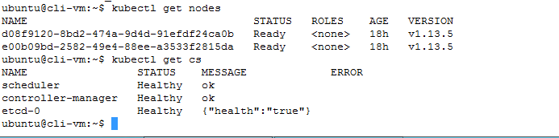
</details>
<br/>

2.3 View the namespaces in your cluster with the command `kubectl get namespaces`

<details><summary>Screenshot 2.3</summary>
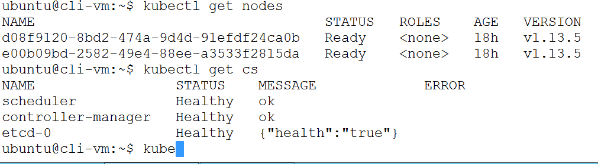
</details>
<br/>

2.4 Observe that in the `kube config view` output from step 2.1 above that there is no namespace listed, and so when you issue kubectl commands they will apply to the default namespace - unless you specify the namespace in the command, or specify a namespace for your context (which we will do in a later exercise)

2.5 View pods in the default and other namespaces with the following commands. As you will observe in the output, there are currently no pods running in the default or kube-system namespaces:

``` bash
kubectl get pods
kubectl get pods --all-namespaces
kubectl get pods --namespace=kube-system
```

<details><summary>Screenshot 2.5</summary>
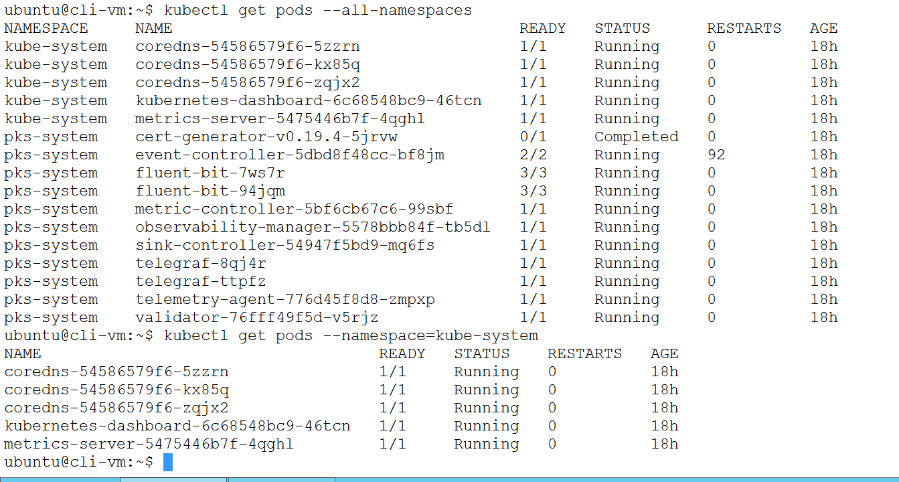
</details>
<br/>

2.6 Create the `planespotter` namespace that we will use later for deploying the planespotter app and view the namespace with the commands:

``` bash
kubectl create namespace planespotter
kubectl get ns planespotter
kubectl get ns planespotter -o yaml
kubectl get pods -n planespotter
```

<details><summary>Screenshot 2.6</summary>
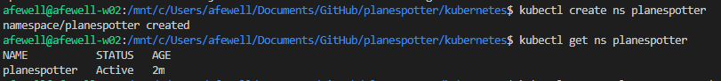
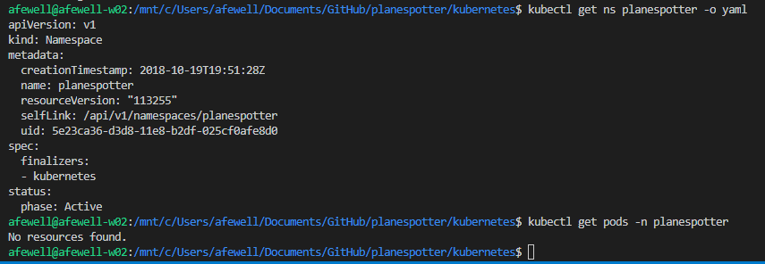
</details>
<br/>

2.7 Set your current context namespace to `planespotter` and view your kube config file to see that the namespace setting is now displayed in the output. 

``` bash
kubectl config current-context
kubectl config set-context my-cluster --namespace=planespotter
kubectl config current-context
```

<details><summary>Screenshot 2.7</summary>
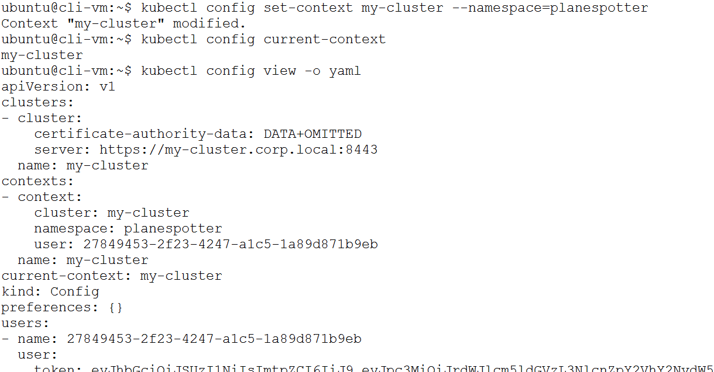
</details>
<br/>

## Step 3: Review Sample Application Components

3.0 Clone the github repository for the Planespotter

3.1 Ensure git is installed on your workstation and from your default github directory clone the planespotter github repository

`git clone https://github.com/Boskey/planespotter.git`

<details><summary>Screenshot 3.1</summary>

</details>
<br/>

3.2 List the contents of the planespotter directory, observe the different subdirectories for each application component, docs and for kubernetes manifests as shown in the image below

<details><summary>Screenshot 3.2</summary>
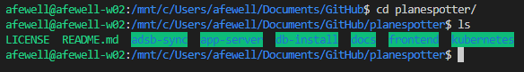
</details>
<br/>

3.3 Navigate to the planespotter/frontend directory and list the files, observe the the application source and build files for the frontend application are located in this folder

<details><summary>Screenshot 3.3</summary>
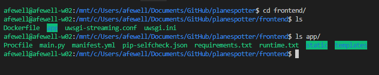
</details>
<br/>

3.4 Navigate to the planespotter/kubernetes directory and list the files to show the different deployment manifests and supporting yaml files

<details><summary>Screenshot 3.4</summary>

</details>
<br/>

## Step 4: Pods, Replica Sets and Deployments

In Step 4, you will deploy just the frontend portion of the planespotter app and review the deployment, replica set and pod object data

4.1 Save a copy of the frontend-deployment_all_k8s.yaml as frontend-deployment_only.yaml

`cp frontend-deployment_all_k8s.yaml frontend-deployment_only.yaml`

4.2 Edit the frontend-deployment_only.yaml file to only include the deployment spec and remove the service spec (Remove all lines from the 2nd set of 3 dashes "---" and after) and change "replicas" to 1. the resulting file should look like the following:

<details><summary>Click to expand output</summary>

``` bash
---
apiVersion: apps/v1beta1
kind: Deployment
metadata:
  name: planespotter-frontend
  namespace: planespotter
  labels:
    app: planespotter-frontend
    tier: frontend
spec:
  replicas: 1
  selector:
    matchLabels:
      app: planespotter-frontend
  template:
    metadata:
      labels:
        app: planespotter-frontend
        tier: frontend
    spec:
      containers:
      - name: planespotter-fe
        image: yfauser/planespotter-frontend:d0b30abec8bfdbde01a36d07b30b2a3802d9ccbb
        imagePullPolicy: IfNotPresent
        env:
        - name: PLANESPOTTER_API_ENDPOINT
          value: planespotter-svc
        - name: TIMEOUT_REG
          value: "5"
        - name: TIMEOUT_OTHER
          value: "5"
```

</details>
<br/>

4.3 Deploy the frontend app using the updated manifest file with the command:

`kubectl create -f frontend-deployment_only.yaml`

<details><summary>Screenshot 4.3</summary>

</details>
<br/>

4.4 Use kubectl to view the deployment, replica set and pod objects with the following commands:

``` bash
kubectl get pods
kubectl get replicasets
kubectl get deployments
```

<details><summary>Screenshot 4.4</summary>
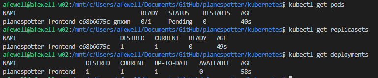
</details>
<br/>

4.5 View the details of the pod object in yaml by using the kubectl `-o yaml` flag which causes the output of the command to be returned in yaml format. The output should look similar to the following:

`kubectl get pods -o yaml`

<details><summary>Click to expand output</summary>
  
```yaml
apiVersion: v1
items:
- apiVersion: v1
  kind: Pod
  metadata:
    creationTimestamp: 2018-10-19T11:10:10Z
    generateName: planespotter-frontend-7c578ffd8b-
    labels:
      app: planespotter-frontend
      pod-template-hash: "3713499846"
      tier: frontend
    name: planespotter-frontend-7c578ffd8b-qwjhc
    namespace: default
    ownerReferences:
    - apiVersion: extensions/v1beta1
      blockOwnerDeletion: true
      controller: true
      kind: ReplicaSet
      name: planespotter-frontend-7c578ffd8b
      uid: 8b5bb146-d38f-11e8-b2df-025cf0afe8d0
    resourceVersion: "67567"
    selfLink: /api/v1/namespaces/default/pods/planespotter-frontend-7c578ffd8b-qwjhc
    uid: 8b5e0a91-d38f-11e8-b2df-025cf0afe8d0
  spec:
    containers:
    - env:
      - name: PLANESPOTTER_API_ENDPOINT
        value: planespotter-svc
      - name: TIMEOUT_REG
        value: "5"
      - name: TIMEOUT_OTHER
        value: "5"
      image: afewell/planespotter:planespotter-frontend
      imagePullPolicy: IfNotPresent
      name: planespotter-fe
      resources: {}
      terminationMessagePath: /dev/termination-log
      terminationMessagePolicy: File
      volumeMounts:
      - mountPath: /var/run/secrets/kubernetes.io/serviceaccount
        name: default-token-gnmrm
        readOnly: true
    dnsPolicy: ClusterFirst
    nodeName: worker-906ccfc2-d38f-11e8-968e-0694ec89544a
    restartPolicy: Always
    schedulerName: default-scheduler
    securityContext: {}
    serviceAccount: default
    serviceAccountName: default
    terminationGracePeriodSeconds: 30
    volumes:
    - name: default-token-gnmrm
      secret:
        defaultMode: 420
        secretName: default-token-gnmrm
  status:
    conditions:
    - lastProbeTime: null
      lastTransitionTime: 2018-10-19T11:13:16Z
      status: "True"
      type: Initialized
    - lastProbeTime: null
      lastTransitionTime: 2018-10-19T11:13:16Z
      message: 'containers with unready status: [planespotter-fe]'
      reason: ContainersNotReady
      status: "False"
      type: Ready
    - lastProbeTime: null
      lastTransitionTime: 2018-10-19T11:13:16Z
      status: "True"
      type: PodScheduled
    containerStatuses:
    - image: afewell/planespotter:planespotter-frontend
      imageID: ""
      lastState: {}
      name: planespotter-fe
      ready: false
      restartCount: 0
      state:
        waiting:
          message: Back-off pulling image "afewell/planespotter:planespotter-frontend"
          reason: ImagePullBackOff
    hostIP: 10.1.150.41
    phase: Pending
    podIP: 10.2.1.4
    qosClass: BestEffort
    startTime: 2018-10-19T11:13:16Z
- apiVersion: v1
  kind: Pod
  metadata:
    creationTimestamp: 2018-10-19T11:10:10Z
    generateName: planespotter-frontend-7c578ffd8b-
    labels:
      app: planespotter-frontend
      pod-template-hash: "3713499846"
      tier: frontend
    name: planespotter-frontend-7c578ffd8b-wqrpx
    namespace: default
    ownerReferences:
    - apiVersion: extensions/v1beta1
      blockOwnerDeletion: true
      controller: true
      kind: ReplicaSet
      name: planespotter-frontend-7c578ffd8b
      uid: 8b5bb146-d38f-11e8-b2df-025cf0afe8d0
    resourceVersion: "67554"
    selfLink: /api/v1/namespaces/default/pods/planespotter-frontend-7c578ffd8b-wqrpx
    uid: 8b5cffa8-d38f-11e8-b2df-025cf0afe8d0
  spec:
    containers:
    - env:
      - name: PLANESPOTTER_API_ENDPOINT
        value: planespotter-svc
      - name: TIMEOUT_REG
        value: "5"
      - name: TIMEOUT_OTHER
        value: "5"
      image: afewell/planespotter:planespotter-frontend
      imagePullPolicy: IfNotPresent
      name: planespotter-fe
      resources: {}
      terminationMessagePath: /dev/termination-log
      terminationMessagePolicy: File
      volumeMounts:
      - mountPath: /var/run/secrets/kubernetes.io/serviceaccount
        name: default-token-gnmrm
        readOnly: true
    dnsPolicy: ClusterFirst
    nodeName: worker-906ccfc2-d38f-11e8-968e-0694ec89544a
    restartPolicy: Always
    schedulerName: default-scheduler
    securityContext: {}
    serviceAccount: default
    serviceAccountName: default
    terminationGracePeriodSeconds: 30
    volumes:
    - name: default-token-gnmrm
      secret:
        defaultMode: 420
        secretName: default-token-gnmrm
  status:
    conditions:
    - lastProbeTime: null
      lastTransitionTime: 2018-10-19T11:13:16Z
      status: "True"
      type: Initialized
    - lastProbeTime: null
      lastTransitionTime: 2018-10-19T11:13:16Z
      message: 'containers with unready status: [planespotter-fe]'
      reason: ContainersNotReady
      status: "False"
      type: Ready
    - lastProbeTime: null
      lastTransitionTime: 2018-10-19T11:13:16Z
      status: "True"
      type: PodScheduled
    containerStatuses:
    - image: afewell/planespotter:planespotter-frontend
      imageID: ""
      lastState: {}
      name: planespotter-fe
      ready: false
      restartCount: 0
      state:
        waiting:
          message: Back-off pulling image "afewell/planespotter:planespotter-frontend"
          reason: ImagePullBackOff
    hostIP: 10.1.150.41
    phase: Pending
    podIP: 10.2.1.2
    qosClass: BestEffort
    startTime: 2018-10-19T11:13:16Z
kind: List
metadata:
  resourceVersion: ""
  selfLink: ""
```

</details>
<br/>

4.6 View the details of the replicaset object in yaml by using the kubectl `-o yaml` flag which causes the output of the command to be returned in yaml format. The output should look similar to the following:

`kubectl get replicasets -o yaml`

<details><summary>Click to expand output</summary>

``` bash
apiVersion: v1
items:
- apiVersion: extensions/v1beta1
  kind: ReplicaSet
  metadata:
    annotations:
      deployment.kubernetes.io/desired-replicas: "2"
      deployment.kubernetes.io/max-replicas: "3"
      deployment.kubernetes.io/revision: "1"
    creationTimestamp: 2018-10-19T11:10:10Z
    generation: 1
    labels:
      app: planespotter-frontend
      pod-template-hash: "3713499846"
      tier: frontend
    name: planespotter-frontend-7c578ffd8b
    namespace: default
    ownerReferences:
    - apiVersion: extensions/v1beta1
      blockOwnerDeletion: true
      controller: true
      kind: Deployment
      name: planespotter-frontend
      uid: 8b5b0401-d38f-11e8-b2df-025cf0afe8d0
    resourceVersion: "21720"
    selfLink: /apis/extensions/v1beta1/namespaces/default/replicasets/planespotter-frontend-7c578ffd8b
    uid: 8b5bb146-d38f-11e8-b2df-025cf0afe8d0
  spec:
    replicas: 1
    selector:
      matchLabels:
        app: planespotter-frontend
        pod-template-hash: "3713499846"
    template:
      metadata:
        creationTimestamp: null
        labels:
          app: planespotter-frontend
          pod-template-hash: "3713499846"
          tier: frontend
      spec:
        containers:
        - env:
          - name: PLANESPOTTER_API_ENDPOINT
            value: planespotter-svc
          - name: TIMEOUT_REG
            value: "5"
          - name: TIMEOUT_OTHER
            value: "5"
          image: afewell/planespotter:planespotter-frontend
          imagePullPolicy: IfNotPresent
          name: planespotter-fe
          resources: {}
          terminationMessagePath: /dev/termination-log
          terminationMessagePolicy: File
        dnsPolicy: ClusterFirst
        restartPolicy: Always
        schedulerName: default-scheduler
        securityContext: {}
        terminationGracePeriodSeconds: 30
  status:
    fullyLabeledReplicas: 2
    observedGeneration: 1
    replicas: 2
kind: List
metadata:
  resourceVersion: ""
  selfLink: ""
```
</details>
<br/>

4.7 View the details of the deployment object in yaml by using the kubectl `-o yaml` flag which causes the output of the command to be returned in yaml format. The output should look similar to the following:

`kubectl get deployments -o yaml`

<details><summary>Click to expand output</summary>
  
```yaml
apiVersion: v1
items:
- apiVersion: extensions/v1beta1
  kind: Deployment
  metadata:
    annotations:
      deployment.kubernetes.io/revision: "1"
    creationTimestamp: 2018-10-19T11:10:10Z
    generation: 1
    labels:
      app: planespotter-frontend
      tier: frontend
    name: planespotter-frontend
    namespace: default
    resourceVersion: "23593"
    selfLink: /apis/extensions/v1beta1/namespaces/default/deployments/planespotter-frontend
    uid: 8b5b0401-d38f-11e8-b2df-025cf0afe8d0
  spec:
    progressDeadlineSeconds: 600
    replicas: 1
    revisionHistoryLimit: 2
    selector:
      matchLabels:
        app: planespotter-frontend
    strategy:
      rollingUpdate:
        maxSurge: 25%
        maxUnavailable: 25%
      type: RollingUpdate
    template:
      metadata:
        creationTimestamp: null
        labels:
          app: planespotter-frontend
          tier: frontend
      spec:
        containers:
        - env:
          - name: PLANESPOTTER_API_ENDPOINT
            value: planespotter-svc
          - name: TIMEOUT_REG
            value: "5"
          - name: TIMEOUT_OTHER
            value: "5"
          image: afewell/planespotter:planespotter-frontend
          imagePullPolicy: IfNotPresent
          name: planespotter-fe
          resources: {}
          terminationMessagePath: /dev/termination-log
          terminationMessagePolicy: File
        dnsPolicy: ClusterFirst
        restartPolicy: Always
        schedulerName: default-scheduler
        securityContext: {}
        terminationGracePeriodSeconds: 30
  status:
    conditions:
    - lastTransitionTime: 2018-10-19T11:10:10Z
      lastUpdateTime: 2018-10-19T11:10:10Z
      message: Deployment does not have minimum availability.
      reason: MinimumReplicasUnavailable
      status: "False"
      type: Available
    - lastTransitionTime: 2018-10-19T11:20:11Z
      lastUpdateTime: 2018-10-19T11:20:11Z
      message: ReplicaSet "planespotter-frontend-7c578ffd8b" has timed out progressing.
      reason: ProgressDeadlineExceeded
      status: "False"
      type: Progressing
    observedGeneration: 1
    replicas: 1
    unavailableReplicas: 2
    updatedReplicas: 2
kind: List
metadata:
  resourceVersion: ""
  selfLink: ""
```
</details>
<br/>

4.7 Scale up your current deployment by adjusting the quantity of replicas and then verify with the following commands:

``` bash
kubectl scale deployment planespotter-frontend --replicas 2
kubectl get pods
kubectl get deployments
```
<details><summary>Screenshot 4.7</summary>
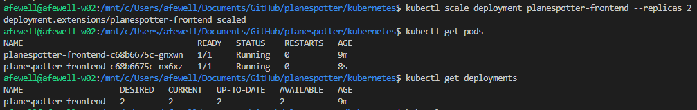
</details>
<br/>

4.8 Cleanup your current deployment to prepare for the next exercise with the following commands

``` bash
kubectl delete deployment planespotter-frontend
kubectl get pods
kubectl get deployments
```

<details><summary>Screenshot 4.8</summary>

</details>
<br/>

## Step 5: Services - ClusterIP, NodePort & LoadBalancer

### 5.1 Deploy and observe a ClusterIP Service deployment

In this section you will deploy the planespotter frontend app, but this time we will include the service spec with the deployment.

5.1.1 Save a copy of the frontend-deployment_all_k8s.yaml as frontend-deployment_ClusterIP.yaml

`cp frontend-deployment_all_k8s.yaml frontend-deployment_ClusterIP.yaml`

5.1.2 Edit the frontend-deployment_ClusterIP.yaml file to only include both the deployment spec and the service spec. Delete the ingress spec, which the section from the 3rd set of 3 dashes "---" and every line after. The resulting file should look like the following:

<details><summary>Click to expand output</summary>

``` bash
---
apiVersion: apps/v1beta1
kind: Deployment
metadata:
  name: planespotter-frontend
  namespace: planespotter
  labels:
    app: planespotter-frontend
    tier: frontend
spec:
  replicas: 2
  selector:
    matchLabels:
      app: planespotter-frontend
  template:
    metadata:
      labels:
        app: planespotter-frontend
        tier: frontend
    spec:
      containers:
      - name: planespotter-fe
        image: yfauser/planespotter-frontend:d0b30abec8bfdbde01a36d07b30b2a3802d9ccbb
        imagePullPolicy: IfNotPresent
        env:
        - name: PLANESPOTTER_API_ENDPOINT
          value: planespotter-svc
        - name: TIMEOUT_REG
          value: "5"
        - name: TIMEOUT_OTHER
          value: "5"
---
apiVersion: v1
kind: Service
metadata:
  name: planespotter-frontend
  namespace: planespotter
  labels:
    app: planespotter-frontend
spec:
  ports:
    # the port that this service should serve on
    - port: 80
  selector:
    app: planespotter-frontend
```

</details>
<br/>

5.1.3 Deploy the frontend app using the updated manifest file with the command:

`kubectl create -f frontend-deployment_ClusterIP.yaml`

<details><summary>Screenshot 5.1.3</summary>

</details>
<br/>

5.1.4 View the deployment, replica set and pod objects with the following commands:

``` bash
kubectl get pods
kubectl get replicasets
kubectl get deployments
```

<details><summary>Screenshot 5.1.4</summary>

</details>
<br/>

5.1.5 View the planespotter-frontend service details. Note that there is no external IP address assigned to planespotter-frontend as ClusterIP service only provides an internal IP address for pod-to-pod communications:

``` bash
kubectl get svc # this is the same as kubectl get services
kubectl get services
kubectl get services -o wide # wide output shows more detail
kubectl get services -o yaml # outputting to yaml or json includes even more detail
```

<details><summary>Screenshot 5.1.5</summary>
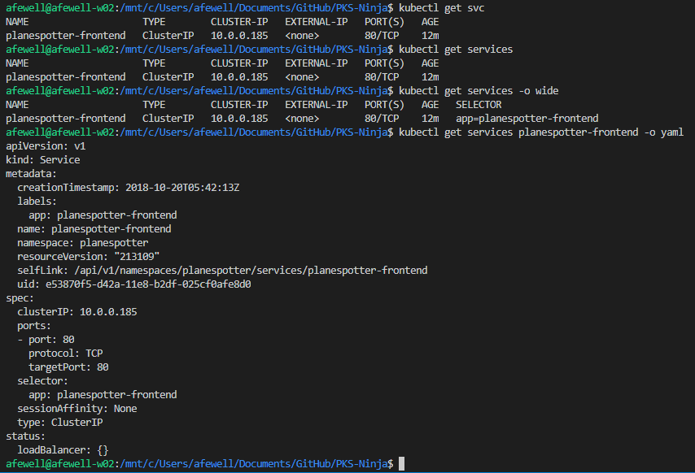
</details>
<br/>

### 5.2 Setup a test pod that you can use to validate pod-to-pod communications

5.2.1 As a testing pod, you will deploy the official shell-demo pod from the Kubernetes documentation, review the [shell-demo manifest here](https://kubernetes.io/docs/tasks/debug-application-cluster/get-shell-running-container/) before proceeding

5.2.2 Deploy the shell-demo pod and verify deployment status with the following commands:

``` bash
kubectl get pods
kubectl create -f https://k8s.io/examples/application/shell-demo.yaml
kubectl get pods
```

<details><summary>Screenshot 5.2.2</summary>

</details>
<br/>

5.2.3 Use kubectl exec to open a bash shell to the shell-demo pod with the command `kubectl exec -it shell-demo -- /bin/bash`

As you can see, the shell-demo has its own prompt, so for example in Screenshot 5.2.3 below, after entering the command `kubectl exec -it shell-demo -- /bin/bash`, the output shows the result of entering the "ls" command:

<details><summary>Screenshot 5.2.3</summary>
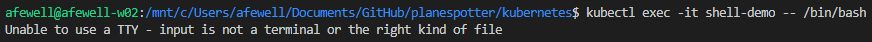
</details>
<br/>

5.2.4 Install curl and use it to test the planespotter-frontend ClusterIP service. Repeat the curl a couple of times, it reports back the IP address of the planespotter-frontend pod that serving the request, and after executing curl a few times you should see the requests being services by both running planespotter-frontend pods, demonstrating that the ClusterIP service is both fullfiling http requests and also load balancing those requests across the running pods.

Note that when creating a service, a local DNS record is created for the service name in the Kube DNS service. Pods running in the cluster can access a service using the service name, or via the service IP address 

``` bash
apt-get update
apt-get install curl -y
curl planespotter-frontend | grep Planespotter # curl by service name
curl 10.0.0.185 | grep Planespotter
exit
```

<details><summary>Screenshot 5.2.4</summary>

</details>
<br/>

5.2.5 Clean up the planespotter-frontend deployment and service in preparation for the next lab.

This could be done by seperately deleting the deployment and service with the commands `kubectl delete deployment planespotter-frontend` and `kubectl delete service planespotter-frontend`

However, you can also use the same yaml file you used to deploy the application in step 5.1.3 above to delete each spec included in the file with the command `kubectl -f frontend-deployment_ClusterIP.yaml`

Using a file to manage a deployment is especially useful if your app consists of several specs as a single command can be used to create, update or delete a complex deployment

Use either method described above to delete the planespotter-frontend deployment and enter the following commands to ensure the deployment and the service have been deleted:

``` bash
kubectl get pods
kubectl get deployments
kubectl get services
```

<details><summary>Screenshot 5.2.5</summary>

</details>
<br/>

### 5.3 Deploy the planespotter-frontend app with the NodePort Service

5.3.1 Make a copy of the `frontend-deployment_ClusterIP.yaml` file, save it as `frontend-deployment_NodePort.yaml`

<details><summary>Screenshot 5.3.1</summary>
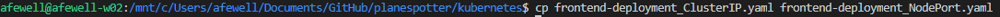
</details>
<br/>

5.3.2 Edit the `frontend-deployment_NodePort.yaml` file, near the bottom of the file in the Service.Spec section, add the value `type: NodePort` as shown in the following snippet:

``` bash
spec:
  type: NodePort
  ports:
    # the port that this service should serve on
    - port: 80
  selector:
    app: planespotter-frontend
```

<details><summary>Click to expand to see the full contents of frontend-deployment_NodePort.yaml</summary>

``` bash
---
apiVersion: apps/v1beta1
kind: Deployment
metadata:
  name: planespotter-frontend
  namespace: planespotter
  labels:
    app: planespotter-frontend
    tier: frontend
spec:
  replicas: 2
  selector:
    matchLabels:
      app: planespotter-frontend
  template:
    metadata:
      labels:
        app: planespotter-frontend
        tier: frontend
    spec:
      containers:
      - name: planespotter-fe
        image: yfauser/planespotter-frontend:d0b30abec8bfdbde01a36d07b30b2a3802d9ccbb
        imagePullPolicy: IfNotPresent
        env:
        - name: PLANESPOTTER_API_ENDPOINT
          value: planespotter-svc
        - name: TIMEOUT_REG
          value: "5"
        - name: TIMEOUT_OTHER
          value: "5"
---
apiVersion: v1
kind: Service
metadata:
  name: planespotter-frontend
  namespace: planespotter
  labels:
    app: planespotter-frontend
spec:
  type: NodePort
  ports:
    # the port that this service should serve on
    - port: 80
  selector:
    app: planespotter-frontend
```

</details>
<br/>

5.3.3 Run the updated planespotter-frontend app and verify deployment with the following commands. Make note of the port numbers shown in the output of `kubectl get services`

``` bash
kubectl create -f frontend-deployment_NodePort.yaml
kubectl get pods
kubectl get deployments
kubectl get services
kubectl get services -o yaml
```

<details><summary>Screenshot 5.3.3</summary>

</details>
<br/>

5.3.4 Get the IP address of a worker node using the following commands. If you have multiple worker nodes running in your cluster, it does not matter which nodes IP address you use to test the service as with NodePort any node can fulfill the service request. Be sure to replace the worker node name in the example below with the worker node name from your environment

``` bash
kubectl get nodes
kubectl get node worker-5ba97a60-d42a-11e8-bab6-024dd3eb0b96 -o yaml | grep address:
```

<details><summary>Screenshot 5.3.4</summary>
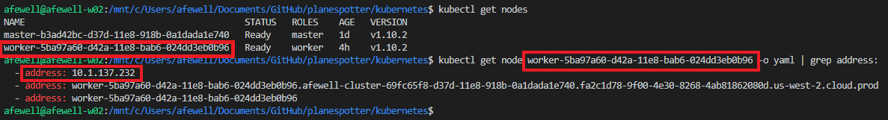
</details>
<br/>

5.3.5 Open a shell session with the shell-demo pod and use curl to validate the NodePort service. Use screenshot 5.3.5 for reference:

```bash
kubectl exec -it shell-demo -- /bin/bash
# In the following commands, use the output you received
# From the kubectl get services command (for the NodePort number)
# And the IP address retrieved from the kubectl get node worker-**** command
curl <your-NodePort-IP>:<nodePort> | grep Planespotter
exit
```

<details><summary>Screenshot 5.3.5</summary>
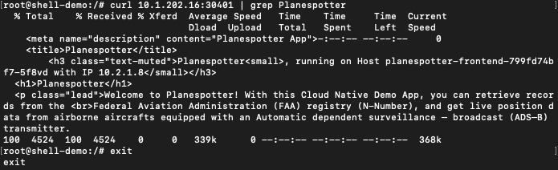
</details>
<br/>

5.3.6 Clean up the planespotter-frontend deployment and service and verify with the following commands:

``` bash
kubectl delete -f frontend-deployment_NodePort.yaml
kubectl get pods
kubectl get deployments
kubectl get services
```

<details><summary>Screenshot 5.3.6</summary>

</details>
<br/>

### 5.4 Deploy the planespotter-frontend app with the LoadBalancer Service

5.4.1 Make a copy of the `frontend-deployment_NodePort.yaml` file, save it as `frontend-deployment_LoadBalancer.yaml`

```bash
cp frontend-deployment_NodePort.yaml frontend-deployment_LoadBalancer.yaml
```

5.4.2 Edit the `frontend-deployment_LoadBalancer.yaml` file, near the bottom of the file in the service spec section, add the value `type: LoadBalancer` as shown in the following snippet:

``` bash
spec:
  type: LoadBalancer
  ports:
    # the port that this service should serve on
    - port: 80
  selector:
    app: planespotter-frontend
```

<details><summary>Click to expand to see the full contents of frontend-deployment_LoadBalancer.yaml</summary>

``` bash
---
apiVersion: apps/v1beta1
kind: Deployment
metadata:
  name: planespotter-frontend
  namespace: planespotter
  labels:
    app: planespotter-frontend
    tier: frontend
spec:
  replicas: 2
  selector:
    matchLabels:
      app: planespotter-frontend
  template:
    metadata:
      labels:
        app: planespotter-frontend
        tier: frontend
    spec:
      containers:
      - name: planespotter-fe
        image: yfauser/planespotter-frontend:d0b30abec8bfdbde01a36d07b30b2a3802d9ccbb
        imagePullPolicy: IfNotPresent
        env:
        - name: PLANESPOTTER_API_ENDPOINT
          value: planespotter-svc
        - name: TIMEOUT_REG
          value: "5"
        - name: TIMEOUT_OTHER
          value: "5"
---
apiVersion: v1
kind: Service
metadata:
  name: planespotter-frontend
  namespace: planespotter
  labels:
    app: planespotter-frontend
spec:
  type: LoadBalancer
  ports:
    # the port that this service should serve on
    - port: 80
  selector:
    app: planespotter-frontend
```

</details>
<br/>

5.4.3 Run the updated planespotter-frontend app and verify deployment with the following commands. Make note of the external IP address/hostname shown in the output of `kubectl get services`

``` bash
kubectl create -f frontend-deployment_LoadBalancer.yaml
kubectl get pods
kubectl get deployments
kubectl get services
kubectl get services -o yaml

# Tip, if running MacOS or Linux, you can use the following
# To output just the hostname:
kubectl get services -o yaml | sed -n -e '/hostname: / s/.*\: *//p'
```

<details><summary>Screenshot 5.4.3.1</summary>

</details>

<details><summary>Screenshot 5.4.3.2</summary>
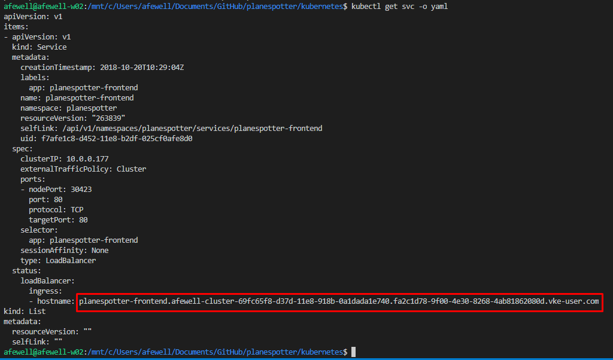
</details>
<br/>

5.4.4 Open a browser and go to the hostname shown in Screenshot 5.4.3.2 above to verify that planespotter-frontend is externally accessible with the LoadBalancer service

**NOTE:** It could take up to 20 min before the url is able to resolve due to DNS

<details><summary>Screenshot 5.4.4</summary>

</details>
<br/>

5.4.5 Clean up the planespotter-frontend deployment and service and verify with the following commands:

``` bash
kubectl delete -f frontend-deployment_LoadBalancer.yaml
kubectl get pods
kubectl get deployments
kubectl get services
```

<details><summary>Screenshot 5.4.5</summary>

</details>
<br/>

### 5.5 Deploy the planespotter-frontend app with an Ingress controller

5.5.1 Make a copy of the `frontend-deployment_all_k8s.yaml` file, save it as `frontend-deployment_ingress.yaml`

Example:
`cp frontend-deployment_all_k8s.yaml frontend-deployment_ingress.yaml`

5.5.3 Edit the `frontend-deployment_ingress.yaml` file, near the bottom of the file in the ingress spec section, change the value for spec.rules.host to URL to planespotter.corp.local as shown in the following snippet:

``` bash
spec:
  rules:
  - host: planespotter.corp.local
    http:
      paths:
      - backend:
          serviceName: planespotter-frontend
          servicePort: 80
```

<details><summary>Click to expand to see the full contents of frontend-deployment_ingress.yaml</summary>

When reviewing the file contents below, observe that it includes a ClusterIP service spec which only provides an IP address that is usable for pod-to-pod communications in the cluster. The file also includes an ingress spec which implements the default VKE ingress controller.

In the following steps after you deploy the planespotter-frontend with ingress controller, you will be able to browse from your workstation to the running planespotter app in your VKE environment even though you have not assigned a nat or public IP for the service.

Ingress controllers act as a proxies, recieving http/s requests from external clients and then based on the URL hostname or path, the ingress controller will proxy the request to the corresponding back-end service. For example mysite.com/path1 and mysite.com/path2 can be routed to different backing services running in the kubernetes cluster.

In the file below, no rules are specified to different paths and so accordingly, all requests sent to the host defined in the spec, your VKE SmartCluster URL, will be proxied by the ingress controller to the planespotter-frontend ClusterIP service also defined in the frontend-deployment_ingress.yaml file

``` bash
---
apiVersion: apps/v1beta1
kind: Deployment
metadata:
  name: planespotter-frontend
  namespace: planespotter
  labels:
    app: planespotter-frontend
    tier: frontend
spec:
  replicas: 2
  selector:
    matchLabels:
      app: planespotter-frontend
  template:
    metadata:
      labels:
        app: planespotter-frontend
        tier: frontend
    spec:
      containers:
      - name: planespotter-fe
        image: yfauser/planespotter-frontend:d0b30abec8bfdbde01a36d07b30b2a3802d9ccbb
        imagePullPolicy: IfNotPresent
        env:
        - name: PLANESPOTTER_API_ENDPOINT
          value: planespotter-svc
        - name: TIMEOUT_REG
          value: "5"
        - name: TIMEOUT_OTHER
          value: "5"
---
apiVersion: v1
kind: Service
metadata:
  name: planespotter-frontend
  namespace: planespotter
  labels:
    app: planespotter-frontend
spec:
  ports:
    # the port that this service should serve on
    - port: 80
  selector:
    app: planespotter-frontend
---
apiVersion: extensions/v1beta1
kind: Ingress
metadata:
  name: planespotter-frontend
  namespace: planespotter
spec:
  rules:
  - host: planespotter.corp.local
    http:
      paths:
      - backend:
          serviceName: planespotter-frontend
          servicePort: 80
```

</details>
<br/>

5.5.4 Run the updated planespotter-frontend app and verify deployment with the following commands. Make note of the external IP address/hostname shown in the output of `kubectl get services`

``` bash
kubectl create -f frontend-deployment_ingress.yaml
kubectl get pods
kubectl get deployments
kubectl get services
kubectl get ingress
kubectl describe ingress
```

<details><summary>Screenshot 5.5.4</summary>
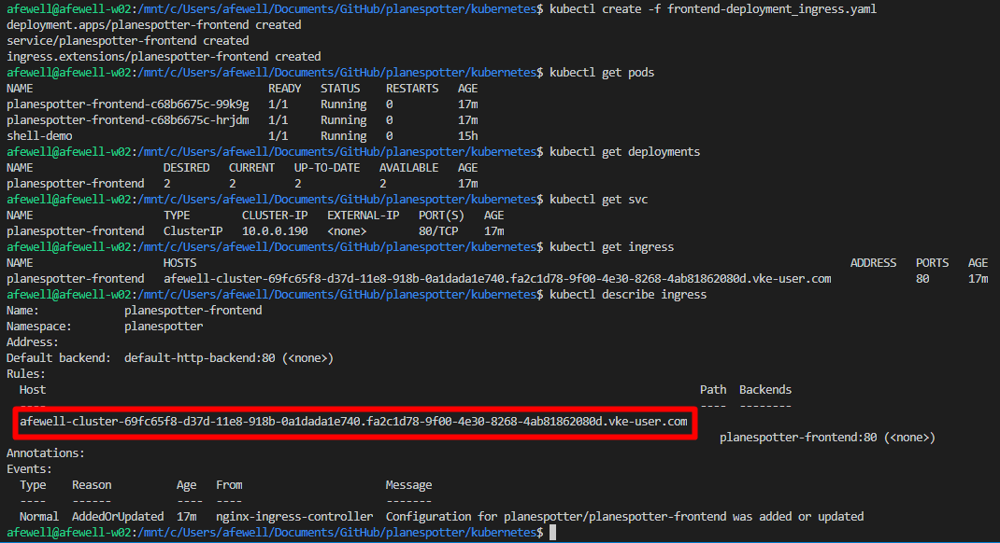
</details>

5.5.5 From the Main Console (ControlCenter) desktop, click the windows button, enter the value `dns` in the search box, and select the top result `DNS` as shown in the following screenshot to open DNS Manager.

<details><summary>Screenshot 1.0.4</summary>

</details>
<br/>

5.5.6 In DNS Manager, expand `ControlCenter > Forward Lookup Zones`, right click on `corp.local`, and select `New Host (A or AAAA)...`

<details><summary>Screenshot 1.0.5</summary>

</details>
<br/>

5.5.7 In the `New Host` window, enter the following values to create an dns A record for planespotter.corp.local:

- Name: `planespotter`
- IP Address: *Please be sure to use the ip address from your deployment from the output of `kubectl get ingress` in the preceeding steps*
- Uncheck `Create associated pointer (PTR) record
- Click `Add Host` to add the new dns record for `planespotter.corp.local`

<details><summary>Screenshot 1.0.6</summary>

</details>

1.0.7 From the Main Console (ControlCenter) desktop, open a https browser session to `http://planespotter.corp.local` to see the planespotter frontend page.

<details><summary>Screenshot 1.0.7</summary>

</details>
<br/>

<details><summary>Screenshot 5.5.5</summary>

</details>
<br/>

5.5.6 Clean up the planespotter-frontend components and verify with the following commands:

``` bash
kubectl delete -f frontend-deployment_ingress.yaml
kubectl get pods
kubectl get deployments
kubectl get services
kubectl get ingress
```

<details><summary>Screenshot 5.5.6</summary>
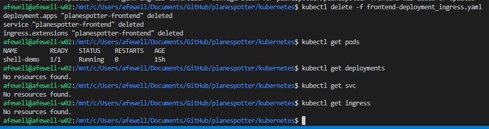
</details>
<br/>

## Next Steps

This lab provided an introductory overview of Kubernetes operations. Additional topics such as persistent volumes, network policy, config maps, stateful sets and more will be covered in more detail in the ongoing labs.

If you are following the PKS Ninja cirriculum, [click here to proceed to the next lab](../Lab2-PksInstallationPhaseOne). As you proceed through the remaining labs you will learn more advanced details about Kubernetes using additional planespotter app components as examples and then deploy the complete planespotter application on a PKS environment.

If you are not following the PKS Ninja cirriculum and would like to deploy the complete planespotter app on VKE, you can find [complete deployment instructions here](https://github.com/Boskey/run_kubernetes_with_vmware)

### Thank you for completing the Introduction to Kubernetes Lab!
