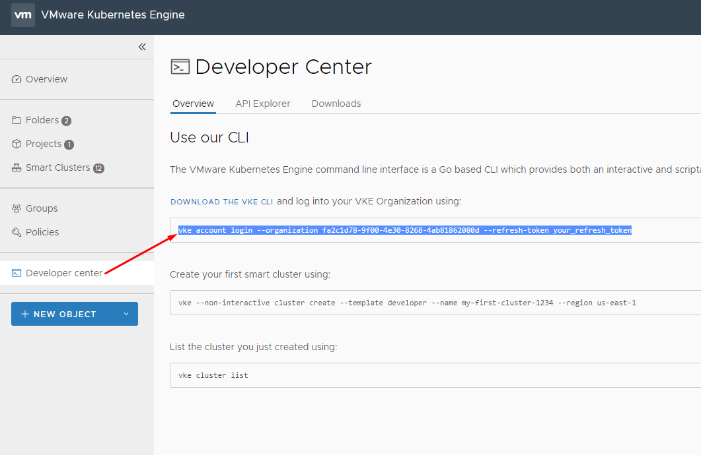
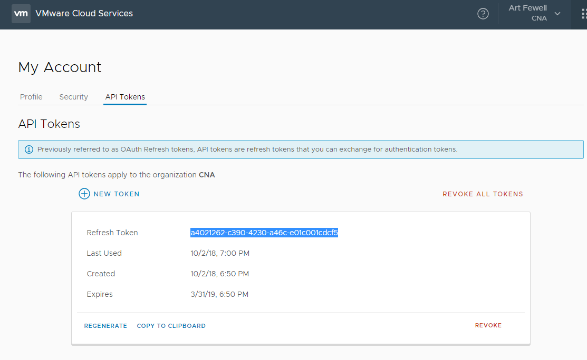
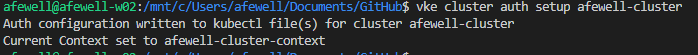
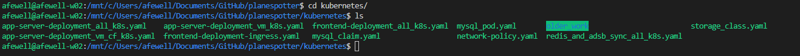
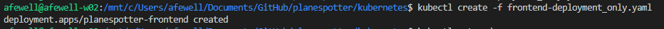
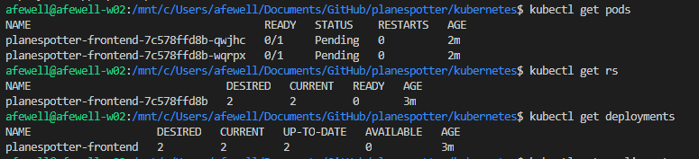

# Introduction to Kubernetes - Lab Exercises

## Step 1: Configure access to VKE and deploy Kubernetes cluster

1.1 Register and Login to VKE

- By now you should have an invitation email to login to VMware Kubernetes Engine (VKE), please follow instructions in the email to sign-up as a user for VKE
- In order to register for VKE, you will need to have a login in 'My VMware'. If you already have a login in 'My VMware' using the same email address you used for registration you don't have to create a new one. Else, you will be directed to create a 'My VMworld' ID.
- One of the Proctors for the Workshop should have assigned you a Kubernetes Cluster that's already pre-created and assigned to you, please have the cluster name handy.
- If you haven't received the invitation email or do not know the name of the Kubernetes Cluster assigned to you, please reach out to one of the proctors.

1.2 Download VKE CLI & Kubectl

The VKE CLI will help us interact with the platform, fetch us the tokens needed to get authenticated access to the Kubernetes cluster

- In a browser, launch the VMware Cloud Services console. https://console.cloud.vmware.com/
- Log in to your VMware Cloud services organization.
- On the VMware Kubernetes Engine tile, click Open. This takes you to the VKE console.
- Click on 'Developer Center', once there click the text 'DOWNLOAD THE VKE CLI'. Click on 'Downloads' and select the version based on the operating system you are working on.
- Also on the same page, download kubectl by clicking the downalod button under the kubectl tile.
- After the download completes, move the vke executable to a common bin directory (for example, ~/bin or %UserProfile%\bin).
  - For Linux or Mac OS X: % mkdir ~/bin % cp vke ~/bin
  - For Windows: mkdir %UserProfile%\bin copy vke.exe %UserProfile%\bin
- Make sure your bin directory is accessible on your PATH.
  - For Linux or Mac OS X: % export PATH=$PATH:/Users/your-user-name/bin
  - For Windows: set PATH=%PATH%;%UserProfile%\bin
- Make the file executable.
  - For Linux or Mac OS X: % chmod +x ~/bin/vke
  - For Windows: attrib +x %UserProfile%\bin\vke.exe
- Now change to a different directory and check the version to verify that the CLI is ready to use. vke --version
  
Kubectl is a command line interface for Kubernetes, it lets you interact with the Kubernetes cluster. Once logged in to the cluster Kubectl will be used anytime you want to deploy apps/services/provision storage etc. or need to query the cluster for existing pods/nodes/apps/services etc.

Kubectl is also available to download from the VKE Console page, once logged in to the console, Click on Developer-->click on -->Actions -->Download kubectl

Once downloaded, save the file in your environment for you to be able to access it from any directory. Just like the vke CLI above.

You can also interact with Kubernetes using the kubernetes dashboard if you prefer UI over CLI, the Kubernetes dashboard is available from the VKE console-->Your-Cluster-Name>-->Actions-->Open K8's UI

1.3 Login to VKE via VKE CLI

So far we have downloaded the vke CLI and kubectl CLI, now we will login to VKE via the CLI to fetch the access tokens needed to talk to the clusters hosted in VKE via Kubectl

Get access to the Organization ID and Refresh Tokens

1.3.1 Go back to the VKE web interface Click on 'Developer Center' and click the Overview tab, once there you will see the CLI to login to VKE with the organization ID , copy the entire command and store it in a text editor

<details><summary>Screenshot 1.3.1</summary>

</details>
<br/>

1.3.2 On the same page, click on 'Get your Refresh Token', this will redirect the browser to the 'My Accounts' page and you will see your OAuth Refresh Token, copy the token. If there is no token click "Generate Key" and copy it. Save the 'refresh token'

<details><summary>Screenshot 1.3.2.1</summary>

</details>

<details><summary>Screenshot 1.3.2.2</summary>

</details>
<br/>

**Please treat this Refresh Token as your Password and DO NOT SHARE it with others**

1.3.3 Login to VKE, copy paste the VKE Login command from above (step 1.3.1) and replace 'your-refresh-token' with the one you retrieved above (step 1.3.2)

`vke account login --organization fa2c1d78-9f00-4e30-8268-4ab81862080d --refresh-token {your token here, remove the brackets`

<details><summary>Screenshot 1.3.3</summary>

</details>
<br/>

1.3.4 Set folder and project within VKE

``` bash
vke folder set SharedFolder
vke project set SharedProject
```

<details><summary>Screenshot 1.3.4</summary>

</details>
<br/>

1.3.5 Fetch Kubectl auth for your cluster, replace with the name of the cluster assigned to you in the command below

`vke cluster auth setup afewell-cluster`

<details><summary>Screenshot 1.3.5</summary>

</details>
<br/>

1.4 Access Kubernetes Cluster via Kubectl

1.4.1 View the pods and services in your cluster to validate connectivity

``` bash
kubectl get pods --all-namespaces
kubectl get svc --all-namespaces
```

<details><summary>Screenshot 1.4.1</summary>

</details>
<br/>

## Step 2: Review Sample Application Components

2.0 Clone the github repository for the Planespotter

2.1 Ensure github is installed on your workstation and from your default github directory clone the planespotter github repository

`git clone https://github.com/Boskey/planespotter.git`

<details><summary>Screenshot 2.1</summary>

</details>
<br/>

2.2 List the contents of the planespotter directory, observe the different subdirectories for each application component, docs and a directory for kubernetes manifests

<details><summary>Screenshot 2.2</summary>

</details>
<br/>

2.3 Navigate to the planespotter/frontend directory and list the files, observe the the application source and build files for the frontend application are located in this folder

<details><summary>Screenshot 2.3</summary>

</details>
<br/>

2.4 Navigate to the planespotter/kubernetes directory and list the files to show the different deployment manifests and supporting yaml files

<details><summary>Screenshot 2.4</summary>

</details>
<br/>

## Step 3: Pods, Replica Sets and Deployments

As discussed in the Kubernetes 101 lecture, Kubernetes deployments include pod and replicaset objects and controllers. While you can observe details about pod and replicaset objects, current versions of Kubernetes do not lot you deploy a pod or a replicaset independently, these objects get created automatically as part of a deployment. 

In Step 3, you will deploy just the frontend portion of the planespotter app and review the deployment, replica set and pod object data

3.1 Save a copy of the frontend-deployment_all_k8s.yaml as frontend-deployment_only.yaml

`cp frontend-deployment_all_k8s.yaml frontend-deployment_only.yaml`

<details><summary>Screenshot 3.1</summary>

</details>
<br/>

3.2 Edit the frontend-deployment_only.yaml file to only include the deployment spec and remove the service spec and also remove the "namespace: planespotter" line, the resulting file should look like the following:

``` bash
---
apiVersion: apps/v1beta1
kind: Deployment
metadata:
  name: planespotter-frontend
  labels:
    app: planespotter-frontend
    tier: frontend
spec:
  replicas: 2
  selector:
    matchLabels:
      app: planespotter-frontend
  template:
    metadata:
      labels:
        app: planespotter-frontend
        tier: frontend
    spec:
      containers:
      - name: planespotter-fe
        image: afewell/planespotter:planespotter-frontend
        imagePullPolicy: IfNotPresent
        env:
        - name: PLANESPOTTER_API_ENDPOINT
          value: planespotter-svc
        - name: TIMEOUT_REG
          value: "5"
        - name: TIMEOUT_OTHER
          value: "5"
```

3.3 Deploy the frontend app using the updated manifest file with the command:

`kubectl create -f frontend-deployment_only.yaml`

<details><summary>Screenshot 3.3</summary>

</details>
<br/>

3.4 Use kubectl to view the deployment, replica set and pod objects with the following commands:

``` bash
kubectl get pods
kubectl get replicasets
kubectl get deployments
```

<details><summary>Screenshot 3.4</summary>

</details>
<br/>

3.5 View the details of the pod object in yaml by using the kubectl `-o yaml` flag which causes the output of the command to be returned in yaml format. The output should look similar to the following:

`kubectl get pods -o yaml`

<details><summary>Click to expand output</summary>
``` bash
apiVersion: v1
items:
- apiVersion: v1
  kind: Pod
  metadata:
    creationTimestamp: 2018-10-19T11:10:10Z
    generateName: planespotter-frontend-7c578ffd8b-
    labels:
      app: planespotter-frontend
      pod-template-hash: "3713499846"
      tier: frontend
    name: planespotter-frontend-7c578ffd8b-qwjhc
    namespace: default
    ownerReferences:
    - apiVersion: extensions/v1beta1
      blockOwnerDeletion: true
      controller: true
      kind: ReplicaSet
      name: planespotter-frontend-7c578ffd8b
      uid: 8b5bb146-d38f-11e8-b2df-025cf0afe8d0
    resourceVersion: "67567"
    selfLink: /api/v1/namespaces/default/pods/planespotter-frontend-7c578ffd8b-qwjhc
    uid: 8b5e0a91-d38f-11e8-b2df-025cf0afe8d0
  spec:
    containers:
    - env:
      - name: PLANESPOTTER_API_ENDPOINT
        value: planespotter-svc
      - name: TIMEOUT_REG
        value: "5"
      - name: TIMEOUT_OTHER
        value: "5"
      image: afewell/planespotter:planespotter-frontend
      imagePullPolicy: IfNotPresent
      name: planespotter-fe
      resources: {}
      terminationMessagePath: /dev/termination-log
      terminationMessagePolicy: File
      volumeMounts:
      - mountPath: /var/run/secrets/kubernetes.io/serviceaccount
        name: default-token-gnmrm
        readOnly: true
    dnsPolicy: ClusterFirst
    nodeName: worker-906ccfc2-d38f-11e8-968e-0694ec89544a
    restartPolicy: Always
    schedulerName: default-scheduler
    securityContext: {}
    serviceAccount: default
    serviceAccountName: default
    terminationGracePeriodSeconds: 30
    volumes:
    - name: default-token-gnmrm
      secret:
        defaultMode: 420
        secretName: default-token-gnmrm
  status:
    conditions:
    - lastProbeTime: null
      lastTransitionTime: 2018-10-19T11:13:16Z
      status: "True"
      type: Initialized
    - lastProbeTime: null
      lastTransitionTime: 2018-10-19T11:13:16Z
      message: 'containers with unready status: [planespotter-fe]'
      reason: ContainersNotReady
      status: "False"
      type: Ready
    - lastProbeTime: null
      lastTransitionTime: 2018-10-19T11:13:16Z
      status: "True"
      type: PodScheduled
    containerStatuses:
    - image: afewell/planespotter:planespotter-frontend
      imageID: ""
      lastState: {}
      name: planespotter-fe
      ready: false
      restartCount: 0
      state:
        waiting:
          message: Back-off pulling image "afewell/planespotter:planespotter-frontend"
          reason: ImagePullBackOff
    hostIP: 10.1.150.41
    phase: Pending
    podIP: 10.2.1.4
    qosClass: BestEffort
    startTime: 2018-10-19T11:13:16Z
- apiVersion: v1
  kind: Pod
  metadata:
    creationTimestamp: 2018-10-19T11:10:10Z
    generateName: planespotter-frontend-7c578ffd8b-
    labels:
      app: planespotter-frontend
      pod-template-hash: "3713499846"
      tier: frontend
    name: planespotter-frontend-7c578ffd8b-wqrpx
    namespace: default
    ownerReferences:
    - apiVersion: extensions/v1beta1
      blockOwnerDeletion: true
      controller: true
      kind: ReplicaSet
      name: planespotter-frontend-7c578ffd8b
      uid: 8b5bb146-d38f-11e8-b2df-025cf0afe8d0
    resourceVersion: "67554"
    selfLink: /api/v1/namespaces/default/pods/planespotter-frontend-7c578ffd8b-wqrpx
    uid: 8b5cffa8-d38f-11e8-b2df-025cf0afe8d0
  spec:
    containers:
    - env:
      - name: PLANESPOTTER_API_ENDPOINT
        value: planespotter-svc
      - name: TIMEOUT_REG
        value: "5"
      - name: TIMEOUT_OTHER
        value: "5"
      image: afewell/planespotter:planespotter-frontend
      imagePullPolicy: IfNotPresent
      name: planespotter-fe
      resources: {}
      terminationMessagePath: /dev/termination-log
      terminationMessagePolicy: File
      volumeMounts:
      - mountPath: /var/run/secrets/kubernetes.io/serviceaccount
        name: default-token-gnmrm
        readOnly: true
    dnsPolicy: ClusterFirst
    nodeName: worker-906ccfc2-d38f-11e8-968e-0694ec89544a
    restartPolicy: Always
    schedulerName: default-scheduler
    securityContext: {}
    serviceAccount: default
    serviceAccountName: default
    terminationGracePeriodSeconds: 30
    volumes:
    - name: default-token-gnmrm
      secret:
        defaultMode: 420
        secretName: default-token-gnmrm
  status:
    conditions:
    - lastProbeTime: null
      lastTransitionTime: 2018-10-19T11:13:16Z
      status: "True"
      type: Initialized
    - lastProbeTime: null
      lastTransitionTime: 2018-10-19T11:13:16Z
      message: 'containers with unready status: [planespotter-fe]'
      reason: ContainersNotReady
      status: "False"
      type: Ready
    - lastProbeTime: null
      lastTransitionTime: 2018-10-19T11:13:16Z
      status: "True"
      type: PodScheduled
    containerStatuses:
    - image: afewell/planespotter:planespotter-frontend
      imageID: ""
      lastState: {}
      name: planespotter-fe
      ready: false
      restartCount: 0
      state:
        waiting:
          message: Back-off pulling image "afewell/planespotter:planespotter-frontend"
          reason: ImagePullBackOff
    hostIP: 10.1.150.41
    phase: Pending
    podIP: 10.2.1.2
    qosClass: BestEffort
    startTime: 2018-10-19T11:13:16Z
kind: List
metadata:
  resourceVersion: ""
  selfLink: ""
```
</details>
<br/>

3.6 View the details of the replicaset object in yaml by using the kubectl `-o yaml` flag which causes the output of the command to be returned in yaml format. The output should look similar to the following:

`kubectl get replicasets -o yaml`

<details><summary>Click to expand output</summary>
``` bash
apiVersion: v1
items:
- apiVersion: extensions/v1beta1
  kind: ReplicaSet
  metadata:
    annotations:
      deployment.kubernetes.io/desired-replicas: "2"
      deployment.kubernetes.io/max-replicas: "3"
      deployment.kubernetes.io/revision: "1"
    creationTimestamp: 2018-10-19T11:10:10Z
    generation: 1
    labels:
      app: planespotter-frontend
      pod-template-hash: "3713499846"
      tier: frontend
    name: planespotter-frontend-7c578ffd8b
    namespace: default
    ownerReferences:
    - apiVersion: extensions/v1beta1
      blockOwnerDeletion: true
      controller: true
      kind: Deployment
      name: planespotter-frontend
      uid: 8b5b0401-d38f-11e8-b2df-025cf0afe8d0
    resourceVersion: "21720"
    selfLink: /apis/extensions/v1beta1/namespaces/default/replicasets/planespotter-frontend-7c578ffd8b
    uid: 8b5bb146-d38f-11e8-b2df-025cf0afe8d0
  spec:
    replicas: 2
    selector:
      matchLabels:
        app: planespotter-frontend
        pod-template-hash: "3713499846"
    template:
      metadata:
        creationTimestamp: null
        labels:
          app: planespotter-frontend
          pod-template-hash: "3713499846"
          tier: frontend
      spec:
        containers:
        - env:
          - name: PLANESPOTTER_API_ENDPOINT
            value: planespotter-svc
          - name: TIMEOUT_REG
            value: "5"
          - name: TIMEOUT_OTHER
            value: "5"
          image: afewell/planespotter:planespotter-frontend
          imagePullPolicy: IfNotPresent
          name: planespotter-fe
          resources: {}
          terminationMessagePath: /dev/termination-log
          terminationMessagePolicy: File
        dnsPolicy: ClusterFirst
        restartPolicy: Always
        schedulerName: default-scheduler
        securityContext: {}
        terminationGracePeriodSeconds: 30
  status:
    fullyLabeledReplicas: 2
    observedGeneration: 1
    replicas: 2
kind: List
metadata:
  resourceVersion: ""
  selfLink: ""
```
</details>
<br/>

3.7 View the details of the deployment object in yaml by using the kubectl `-o yaml` flag which causes the output of the command to be returned in yaml format. The output should look similar to the following:

`kubectl get deployments -o yaml`

<details><summary>Click to expand output</summary>
``` bash
apiVersion: v1
items:
- apiVersion: extensions/v1beta1
  kind: Deployment
  metadata:
    annotations:
      deployment.kubernetes.io/revision: "1"
    creationTimestamp: 2018-10-19T11:10:10Z
    generation: 1
    labels:
      app: planespotter-frontend
      tier: frontend
    name: planespotter-frontend
    namespace: default
    resourceVersion: "23593"
    selfLink: /apis/extensions/v1beta1/namespaces/default/deployments/planespotter-frontend
    uid: 8b5b0401-d38f-11e8-b2df-025cf0afe8d0
  spec:
    progressDeadlineSeconds: 600
    replicas: 2
    revisionHistoryLimit: 2
    selector:
      matchLabels:
        app: planespotter-frontend
    strategy:
      rollingUpdate:
        maxSurge: 25%
        maxUnavailable: 25%
      type: RollingUpdate
    template:
      metadata:
        creationTimestamp: null
        labels:
          app: planespotter-frontend
          tier: frontend
      spec:
        containers:
        - env:
          - name: PLANESPOTTER_API_ENDPOINT
            value: planespotter-svc
          - name: TIMEOUT_REG
            value: "5"
          - name: TIMEOUT_OTHER
            value: "5"
          image: afewell/planespotter:planespotter-frontend
          imagePullPolicy: IfNotPresent
          name: planespotter-fe
          resources: {}
          terminationMessagePath: /dev/termination-log
          terminationMessagePolicy: File
        dnsPolicy: ClusterFirst
        restartPolicy: Always
        schedulerName: default-scheduler
        securityContext: {}
        terminationGracePeriodSeconds: 30
  status:
    conditions:
    - lastTransitionTime: 2018-10-19T11:10:10Z
      lastUpdateTime: 2018-10-19T11:10:10Z
      message: Deployment does not have minimum availability.
      reason: MinimumReplicasUnavailable
      status: "False"
      type: Available
    - lastTransitionTime: 2018-10-19T11:20:11Z
      lastUpdateTime: 2018-10-19T11:20:11Z
      message: ReplicaSet "planespotter-frontend-7c578ffd8b" has timed out progressing.
      reason: ProgressDeadlineExceeded
      status: "False"
      type: Progressing
    observedGeneration: 1
    replicas: 2
    unavailableReplicas: 2
    updatedReplicas: 2
kind: List
metadata:
  resourceVersion: ""
  selfLink: ""
```
</details>
<br/>

3.8 Save a copy of frontend-deployment_all_k8s.yaml as frontend-deployment_only.yaml

`cp frontend-deployment_all_k8s.yaml frontend-deployment_only.yaml`

<details><summary>Screenshot 3.1</summary>

</details>
<br/>

3.3 Save a copy of frontend-deployment_all_k8s.yaml as frontend-deployment_only.yaml

`cp frontend-deployment_all_k8s.yaml frontend-deployment_only.yaml`

<details><summary>Screenshot 3.1</summary>

</details>
<br/>

3.3 Save a copy of frontend-deployment_all_k8s.yaml as frontend-deployment_only.yaml

`cp frontend-deployment_all_k8s.yaml frontend-deployment_only.yaml`

<details><summary>Screenshot 3.1</summary>

</details>
<br/>

3.3 Save a copy of frontend-deployment_all_k8s.yaml as frontend-deployment_only.yaml

`cp frontend-deployment_all_k8s.yaml frontend-deployment_only.yaml`

<details><summary>Screenshot 3.1</summary>

</details>
<br/>

3.3 Save a copy of frontend-deployment_all_k8s.yaml as frontend-deployment_only.yaml

`cp frontend-deployment_all_k8s.yaml frontend-deployment_only.yaml`

<details><summary>Screenshot 3.1</summary>

</details>
<br/>

3.3 Save a copy of frontend-deployment_all_k8s.yaml as frontend-deployment_only.yaml

`cp frontend-deployment_all_k8s.yaml frontend-deployment_only.yaml`

<details><summary>Screenshot 3.1</summary>

</details>
<br/>