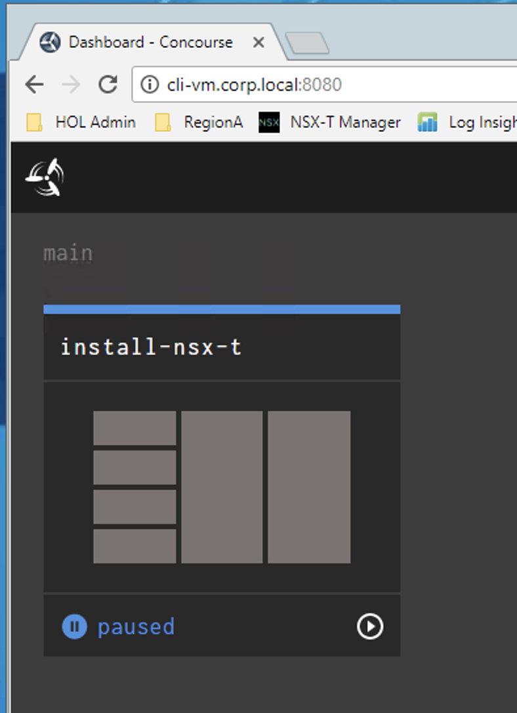
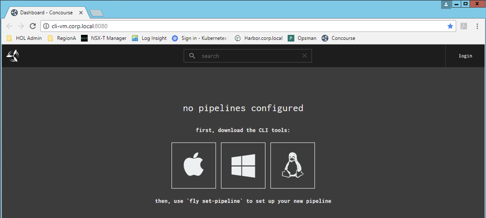

# Lab 10 - PKS Pipeline Install

## PKS Pipeline Kickoff

In this guide you will add the PKS Installation Pipeline to Concourse and start the pipeline

1.6 From the `cli-vm` prompt, Import the PKS pipeline using the `fly` cli command on the cli-vm.

`cd ~/nsx-t-ci-pipelines/pipelines`

`source pks-setup.sh`

`fly-s`

- confirm the parameters file import with `y`

Screenshot 1.6.1

Screenshot 1.6.2

 

1.1 Using a web browser navigate to the concourse URL

`http://cli-vm.corp.local:8080`

Screenshot 1.1

1.2 In the upper right-hand corner login to Concourse

- Username: nsx
- Password: vmware

Screenshot 1.2

 

1.7 Go back to the web browser and confirm that the pipeline has imported and hit the **Play** button

Screenshot 1.7

1.8 Click on *install-nsx-t*

Screenshot 1.8

1.9 Verify that the pipeline is not in an *errored* state.
- You will see Maroon colored boxes if the pipline is errored out.
    - If it is in an errored state perform a `fly-d` and `fly-s` to destory and re-import the pipeline on the cli-vm.

Screenshot 1.9

1.10 Click on the **install-nsx-t**

Screenshot 1.10

1.11 Execute the pipeline with the **Plus** button in the upper right-hand corner

Screenshot 1.11

1.12 Grab some coffee and watch the magic happen! 

1.13 After coffee :coffee: and around 45 to 60 minutes you should see this.

Screenshot 1.13

