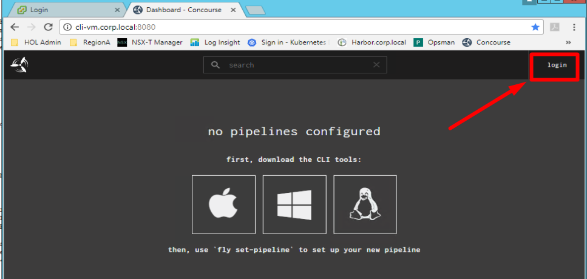
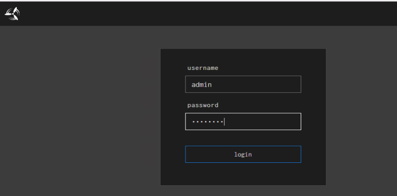

# Lab 11 - Harbor Pipeline Install

The Harbor pipeline install generally follows the PKS pipeline install. If you have recently completed the pks pipeline install and still have a web browser to concourse open you can simply click on the `harbor-install-standalone` pipeline and kick it off, as detailed in the steps below

## Harbor Pipeline Kickoff

In this guide you will navigate to the Harbor Installation Pipeline in Concourse and start the pipeline

1.1 Using a web browser navigate to the concourse URL

Note: If you are already logged in, your screen should resemble screenshot 1.1.2, and you can skip ahead to step 1.3. If you screen resembles screenshot 1.1.1, then proceed with step 1.2

`http://cli-vm.corp.local:8080`

Screenshot 1.1.1

Screenshot 1.1.2

 

1.2 If you are not already logged in, in the upper right-hand corner login to Concourse

- Username: admin
- Password: VMware1!

Screenshot 1.2.1

 

1.4 Confirm that the pipeline has imported and hit the **Play** button

Screenshot 1.4

Note: The image below will look slightly different than yours as the pipline was already run on the reference system

 

1.5 Click on `install-pks-with-nsx`

Screenshot 1.5

Note: The image below will look slightly different than yours as the pipline was already run on the reference system

 

1.6 Verify that the pipeline is not in an *errored* state.

- You will see Maroon colored boxes if the pipline is errored out.
  - If it is in an errored state perform a `fly-d` and `fly-s` to destory and re-import the pipeline on the cli-vm.

Screenshot 1.6

Note: The image below will look slightly different than yours as the pipline was already run on the reference system

 

1.7 Click on the **deploy-opsman**

Screenshot 1.7

Note: The image below will look slightly different than yours as the pipline was already run on the reference system

 

1.8 Execute the pipeline with the **Plus** button in the upper right-hand corner

Screenshot 1.8

Note: The image below will look slightly different than yours as the pipline was already run on the reference system

 

1.9 Grab some coffee and watch the magic happen! 

1.10 After coffee :coffee: and around ~150-200 minutes all the boxes in the pipeline should be green

Note: If the pipline fails, you can click the job that failed and click the + sign to restart the failed task and the pipeline will resume

Screenshot 1.10

