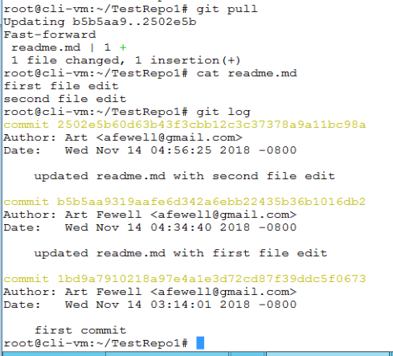
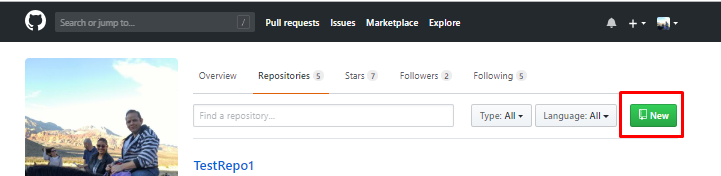

# Lab 12 - Intro to GIT

**Contents:**

- [1.0 Create your first repo & basic operations]()
- [2.0 Branching, Forking and contributing to repositories]()

## 1.0 Create your first repo & basic operations

If you do not have a github account, go to github.com and follow the simple instructions on the homepage to create an account

In general it is a good practice to use a long-term personal email address when creating your account, as your github account and contributions you make reflect your professional reputation and you should when possible keep your account in the event of a change of employment as you would with a Linkedin account or resume. If you plan to become a regular practitioner in container and cloud native technologies, regardless of whether you have a developer or infrastructure focus, you should plan and make goals for yourself to become a regular contributor on github

Github is not just for coders, there is a huge need for non-code contributions and code contributions alike. Documentation, Reference architectures, tutorials, even fixing typos and so on, and each time you do your github profile reports the amount of contributions you make. Over time, this can become a huge enabler for achieving career goals and enhancing your professional and community profile

Github has tremendous practical benefits for infrastructure operations teams, for example you may personally use or know of others who use Docker hub as powerful and simple way to download and run an application. Github can be used in a very similar manner, as was demonstrated in lab 5 of this course where students download and run the Planespotter application.

As you observed with the planespotter application deployment, a user does not need to modify any files and can simply execute a few simple commands to run the planespotter application by cloning the github repo.  You can even run the planespotter deployment manifests directly from github.com without cloning the repo, and kubectl will resolve the external URL and deploy the application on your local kubernetes cluster.

Unlike docker hub however github is extremely flexible and can host infrastructure as code that can be customized for nearly any type of application or deployment need. Github hosts thousands of different containerized and kubernetes ready projects, a large percentage of which can simply be run in your PKS environment with no to minimal modification.

In this course, you will create and start making commits to repositories on github, and if you havent already, start to build your experience and reputation in this important technical community that is pervasive across cloud native technologies

VMware Cloud Native Business unit has a large amount of activity in open source communities, and are increasing our efforts to create more educational content in open github communities just like this course. As part of this effort, there are ample opportunities for contributors of all backgrounds and with any level of time commitment, even something as simple as fixing a typo can help increase your comfort and fluency with the tools while increasing your professional and community reputation, so please join in and take part in contributing to github.com/cna-tech projects

As noted in the lecture, git is not github, the latter is a company recently acquired by Microsoft that provides online git repository services. Git is an open source distributed version control system created by Linus Torvalds that is compatible with but does not require online or external git repository services. While github is the most commercially well known git repository, there are many others, and for VMware employees this lab guide will include a subsection on connecting to VMware's internal gitlab environment

### 1.1 Create local repo & push to github

**Stop:** Prior to beginning this lab, you should have a functional PKS deployment running in a non-production lab environment. For students following the Ninja course, all manual installation steps or pipeline installations for core PKS components should be completed in your lab environment before proceeding

1.1.0 Prepare your local git environment with your name and email address as shown in the following commands. Be sure to use your own name and the email address associated with your github account

```bash
git config --global user.name "Pablo Picasso"
git config --global user.email "PPicasso@fakemail.com"
```

<details><summary>Screenshot 1.1.0</summary>

</details>
<br/>

1.1.1 From the control center desktop, use putty to connect and login to `cli-vm`. Make a new directory for a test repository and initialize the repository with the following commands

```bash
mkdir ~/TestRepo1
cd ~/TestRepo
git init
git status
```

Observe that the output of the `git status` command shows that you are currently on the branch master, you are still on your initial commit (you havent committed anything yet), and that you have not yet added anything to commit

<details><summary>Screenshot 1.1.1</summary>

</details>
<br/>

1.1.2 From `cli-vm`, enter the following commands to view the structure created by the `git init` command you entered in the previous step. For general usage you don't have to worry about the automatically created files, they are pretty much self contained and dont require user interaction for standard usage

```bash
ll
ll ./git
```

<details><summary>Screenshot 1.1.2</summary>

</details>
<br/>

1.1.3 From `cli-vm`, enter the following commands to prepare your git repository for pushing to github.com. Github requires that directory is not empty before it can be pushed, and github also will display any text file named `readme.md` (case insensitive) saved in any directory within a github repo ... for example, if you look at the github page you are reading this lab guide from right now, you will see this lab guide is saved as `readme.md`, and is uniquely identified by the `/Lab12-Git` directory where it is located

There is no requirement to have a readme.md file in any directory, only that a directory is not empty, however it is typical convention to include a readme.md file and is common to use a blank readme.md file to initialize a directory as shown in the following commands

Be sure to replace the string `afewell` in the `git remote add origin` command below with your own github username

```bash
touch readme.md
cat readme.md # as you can see from there being no output, the file has no contents but can still be used to initialize the repository or push a new subdirectory
git status
```

Observe that git recognized the addition of the new `readme.md`, but it is currently untracked. Git will not push untracked changes, so files with changes need to be committed to update the repository before it can be pushed

<details><summary>Screenshot 1.1.3</summary>

</details>
<br/>

1.1.4 Stage the new `readme.md` file with the command `git add readme.md` and review the changes with the `git status` command

Observe in the output of the git status command that you are still on the initial commit, the new readme.md file is recognized but is listed under `changes to be committed` as git requires that changes be commited with a commit message

<details><summary>Screenshot 1.1.3</summary>

</details>
<br/>

1.1.5 Commit the changes to your local repository with the command `git commit -m "first commit"` and review the changes with the `git status` command

Observe in the output that the commit updated the updated local branch to be the new master branch indicating that the new `readme.md` file is now part of your master branch. Observe that the git status command now shows there is nothing to commit, as no additional changes have been made

<details><summary>Screenshot 1.1.5</summary>

</details>
<br/>

1.1.6 Enter the command `git log` to view your commit history for the current branch. Note there is only a single entry at this time as you just made your first commit, and the date/time, author and commit message are provided

<details><summary>Screenshot 1.1.6</summary>

</details>
<br/>

1.1.7 Open a web browser to github.com, login to your account and select `Start a project` to create a new repository. Currently the git CLI client does not support creating new github.com repositories, so you will create a new repository that will be updated with your local changes on the first push

<details><summary>Screenshot 1.1.7</summary>

</details>
<br/>

1.1.8 Name your project `TestRepo1` and click `Create repository`. On the Quick Setup instructions, copy the command under `…or push an existing repository from the command line` section, paste the commands into the `cli-vm` prompt and follow the prompts to authenticate to your github account as shown in the following screenshots

<details><summary>Screenshot 1.1.8.1</summary>

</details>

<details><summary>Screenshot 1.1.8.2</summary>

</details>

<details><summary>Screenshot 1.1.8.3</summary>

</details>
<br/>

1.1.9 Resume your web browser connection to your accounts TestRepo1 repository page on github.com and refresh the page to see the readme.md file pushed from the previous step. Click on the `commits` icon as shown in the screenshot below and review the provided details

<details><summary>Screenshot 1.1.9</summary>

</details>
<br/>

1.1.10 In your web browser session, click on the ID of the `first commit` as shown in the following screenshot to review the full details associated with the commit

<details><summary>Screenshot 1.1.10.1</summary>

</details>

<details><summary>Screenshot 1.1.10.2</summary>

</details>
<br/>

1.1.11 From the `cli-vm` prompt, update the `readme.md` file, stage and commit changes, and push changes to github with the following commands

```bash
echo "first file edit" >> readme.md
git add .
git commit -m "updated readme.md with first file edit"
git push
# follow the prompts to authenticate to your github account to complete the push
```

<details><summary>Screenshot 1.1.11</summary>

</details>
<br/>

1.1.12 Resume your web browser connection and navigate to https://github.com/yourAccountName/TestRepo1 to see the updates to the readme.md file pushed from the previous step. Observe that that contents of the readme.md file are displayed on the page. Click on the id of the commit as shown in the following screenshots and observe the commit detail screen shows a visual diff to easily identify changes associated with the commit

<details><summary>Screenshot 1.1.12.1</summary>

</details>

<details><summary>Screenshot 1.1.12.2</summary>

</details>
<br/>

1.1.13 From the commit page, click on `TestRepo1` near the top of the screen to be directed back to the root page for the repository. On the right hand side of the readme.md file display click the edit icon, add a second line to the readme.md file with the text "second file edit", enter the commit message "updated readme.md with second file edit" and click `Commit changes`

<details><summary>Screenshot 1.1.13.1</summary>

</details>

<details><summary>Screenshot 1.1.13.2</summary>

</details>

<details><summary>Screenshot 1.1.13.3</summary>

</details>
<br/>

1.1.14 From the `cli-vm` prompt, enter the following commands to pull the second file edit from github and view the updated readme.md file

```bash
git pull
cat readme.md
git log
```

<details><summary>Screenshot 1.1.11</summary>

</details>
<br/>

### 1.2 Create remote repo, clone and edit locally

1.2.1 Open a web browser connection to your profile at `https://github.com/yourAccountName`, click on the `Repositories` tab, click `New` to create a new repository, name it TestRepo2, check the box for `Initialize this repository with a README` and click `Create Repository`

<details><summary>Screenshot 1.2.1.1</summary>

</details>

<details><summary>Screenshot 1.2.1.2</summary>

</details>

<details><summary>Screenshot 1.2.1.3</summary>

</details>
<br/>

1.2.2 On the root github webpage for your `TestRepo2` repository, click on the `Clone or Download` link and copy the provided text

<details><summary>Screenshot 1.2.2</summary>

</details>
<br/>

1.2.3 From the `cli-vm` prompt, enter the following commands to clone the `TestRepo2` repository. Note that the first instruction is to change to your root directory so you can clone the new repository into its own seperate directory

```bash
cd ~
git clone https://github.com/afewell/TestRepo2.git
ls
cd TestRepo2
ls
cat README.md
```

<details><summary>Screenshot 1.2.3</summary>

</details>
<br/>

1.2.4 From the `cli-vm` prompt, enter the following commands to edit, stage and commit updates to the README.md file. Do not push the file

```bash
echo "Local Change" >> README.md
git add . # the "." after git add is a wildcard that stages all files in the local repository that have unstaged changes, it would also work to specify the filename(s)
git commit -m "Local Change to README.md"
```

<details><summary>Screenshot 1.2.4</summary>

</details>
<br/>

1.2.5 On the root github webpage for your `TestRepo2` repository, click on the edit file icon next to the README.md viewer, add the text "Remote Change" to a new line, add a commit message with the text "Remote Change to README.md", and click `Commit changes`

<details><summary>Screenshot 1.2.2.1</summary>

</details>

<details><summary>Screenshot 1.2.2.2</summary>

</details>
<br/>

1.2.6 From the `cli-vm` prompt, enter the command `git push origin master`, follow the prompts to authenticate to your github account, and observe that the command is rejected because "the remote contains work that you do not have locally". The output recommends executing a `git pull` command to integrate remote changes before pushing

<details><summary>Screenshot 1.2.6</summary>

</details>
<br/>

1.2.7 From the `cli-vm` prompt, enter the command `git pull`. Observe from the output that the pull was also rejected. The output indicates that git attempted to do an automerge, which failed. 

The reason why the automerge failed in this case is because both the local and remote edits were done to the same line in the same file so there is no easy way to resolve the conflict without manual intervention. If you had made local and remote commits to 2 seperate files in the `TestRepo2` repository, the automerge would have worked and the command would have completed successfully

<details><summary>Screenshot 1.2.7</summary>

</details>
<br/>

1.2.8 From the `cli-vm` prompt, enter the commands `git status` and `git diff` to view additional details about the file conflict

<details><summary>Screenshot 1.2.8</summary>

</details>
<br/>

1.2.9 From the `cli-vm` prompt, enter the commands `git status` and `git diff` to view additional details about the file conflict

<details><summary>Screenshot 1.2.8</summary>

</details>
<br/>

1.2.10 This type of file conflict requires the user to manually edit the README.md file and restage the updated version. The output from the `git diff` command above can From the `cli-vm` prompt, use VI or nano to edit the README.md file, update the file per the following screenshots, save and exit your text editor

<details><summary>Screenshot 1.2.10</summary>

</details>
<br/>

1.2.11 Enter the following commands to stage, commit and push the `TestRepo2` repository updates to github

```bash
git add .
git commit -m "Resolved merging conflict for README.md"
git push origin master
git logs
```

<details><summary>Screenshot 1.2.11</summary>

</details>
<br/>

1.2.12 Open a web browser connection to the root github page for your `TestRepo2` repository at `https://github.com/yourAccountName/TestRepo2`, observe that the README.md now has both the local and remote change entries. Click on the ID for the last commit and review the details provided

<details><summary>Screenshot 1.2.12.1</summary>

</details>

<details><summary>Screenshot 1.2.12.2</summary>

</details>
<br/>

## 2.0 Branching, Forking and contributing to repositories

2.1 Branching and Merging

New branches are typically used when 2 variations of the same file(s) are needed to be maintained for some reason, typically on a temporary basis. As you will see in the following steps, the process of merging conflicts provides additional tools when merging branches

2.1.1 From the `cli-vm` prompt enter the following commands to navigate to the `TestRepo1` directory, create create a new branch, and then view a list of branches to confirm the current branch set for your context

```bash
cd ~/TestRepo1
git branch branch2
git branch
```

Observe in the output of the `git branch` command that the new branch you created is listed. Also observe that there is an asterisk next to the `master` branch, which indicates your local context is still using the master branch

<details><summary>Screenshot 2.1.1</summary>

</details>
<br/>

2.1.2 From the `cli-vm` prompt, enter the following commands to create a new branch2.txt file in the `branch2` branch, stage and commit changes

```bash
git checkout branch2
git status
echo "branch2 branch update" > branch2.txt
git add .
git commit -m "added branch2.txt"
ls
```

<details><summary>Screenshot 2.1.2</summary>

</details>
<br/>

2.1.3 From the `cli-vm` prompt, enter the following commands to switch your context back to the master, create a master.txt file, stage and commit it, and view the `ls` command to show that the branch2.txt file is not present on the master branch

```bash
git checkout master
git status
echo "master branch update" > master.txt
git add .
git commit -m "master branch update"
ls
```

<details><summary>Screenshot 2.1.3</summary>

</details>
<br/>

2.1.4 From the `cli-vm` prompt, enter the following commands to merge branch2 back into the master branch

Note: After you enter the `git merge branch2` command, the nano text editor will launch automatically to prompt you to leave a commit message. You dont need to change any text in nano, simply save and close the file

```bash
git merge branch2
git status
ls
git push
```

Observe in the output of the `ls` command that the master branch now contains both the branch2.txt and the master.txt files

<details><summary>Screenshot 2.1.4</summary>

</details>
<br/>

2.1.5 Open a web browser connection to the root github page for your `TestRepo1` repository at `https://github.com/yourAccountName/TestRepo1`, and observe that you can now see the master.txt and branch2.txt files in the github repository

<details><summary>Screenshot 2.1.5</summary>

</details>
<br/>

### 2.2 Forking and Pull requests

The main use case for github is for users to be able to clone remote repositories and use the code for something or contribute code to a central repository

In step 1.2, you created a repository on github.com, cloned it to cli-vm, created and modified files locally and pushed them back to the repository in a very simple fashion. You were able to simply push to your repository because its yours and you dont have to worry about numerous different people trying to make commits, often without knowledge or coordination with one another

In shared repositories the maintainers generally cant allow any number of people to randomly commit updates to the repository, but often users want to save and distribute a version of the source project with some level of customization.  

Forking allows users to make their own seperate copy of a git repository with customizations both locally and to their own seperate github repo. Git also provides tools to keep a fork in sync with an upstream source repository

To fork or not to fork, that is the question
--

First, if you dont need to customize any files, you dont need to fork - simple

Next, when contributing to a shared github repository, there are generally requirements for any contributors to make any updates to their own forked copy and submit changes for central review via a "pull request" process. Regardless of whether contribution guidelines require forking or some other process, when contributing to a shared community you generally need to follow their defined process  

For many of the most common github use cases, there may be no need to push to a repository back to github. Even in cases where you need to modify files, it often works to clone a remote repository, make any needed changes to the local copy of the repository, and rely on the local copies without needing to push back to github

However there are many cases where a user benefits from maintaining a seperate customized copy or even a forked distribution

For example, typically when a user deploys github based code into runtime environments, the user needs to make some modification to the provided files. For example, the planespotter, nsx-t-datacenter and nsx-t-ci pipeline repositories all include sample parameter files that are meant to be customized even for standard deployments

Whether you simply want to keep an online github backup, leverage the central repository so you can easily access your fork from anywhere, or perhaps you may host a workshop or share a reference use case with others who may benefit from your customizations, forks are a great option. For many use cases, maintaining a fork can be as simple and reliable as cloning while offering a host of additional powerful benefits

While there are powerful simple use cases for forking, maintaining forked distributions of complex software can get extremely challenging. Complex use cases should not be entered into without thorough analysis and careful planning

So when should I fork?
--

The primary challenge in maintaining a forked distribution is the extent to which you may need to modify the source files, and there are many use cases where modifying source files is unnecessary

In many cases applications hosted in github repositories provide parameter or configuration files that need to be customized prior to deployment. Generaly these sorts of files are provided as sample templates, allowing the user to save a and use a local copy of the file saved under a unique filename

If your modifications fit these parameters, it is very straightforward to maintain as you can easily pull from upstream without directly forcing any updates or changes to your customized files. It is always possible that an update to source could impact any customized files you use so careful consideration should always be taken, however it is a best practice in cloud native development to minimize changes to configuration and parameter files in effort to simplify upgrades and code maintenance

In some cases, a repo may host code that requires users to modify parameters in a file that has to have a specific name and location in the repo. In cases like this, a user may be forced to modify source files to deploy the distribution, and in the event of updates it may be required to overwrite modified copies in your fork without a greater modification to the code base. This type of situation is not a best practice and should likely not be encountered in popular and well-maintained repositories

In other cases, you may desire to make other modifications, perhaps to source code or dependency files, to a forked repository that you intend to maintain over time. There is no simple yardstick for measuring the complexity of maintaining this type of fork as user experience can vary dramatically based on how each individual project is designed and maintained.

A good general rule of thumb however is that the more modifications, the more there is to maintain, and with more modifications its more likely that additional complexities may be encountered for code maintenance. A key consideration here are the developer practices of the project you want to fork, some projects have well-defined standards for developer integrations and modifications that can help to provide planning, awareness and support to help prepare and minimize the impact of code updates

Forking and Pull requests lab exercises
--

2.2.1 Open a web browser,  log into your github.com account and from the same tab, navigate to the PKS Ninja Repo at [https://github.com/cna-tech/pks-ninja](https://github.com/cna-tech/pks-ninja). Click the `Fork` button on the upper right hand corner of the page as shown in the screenshot below

Note to lab proctors: If your account is listed as an admin for the CNA-Tech or PKS-Ninja repos, you will not be able to fork the repo unless you login with a different account

<details><summary>Screenshot 2.2.1</summary>

</details>
<br/>

2.2.2 After the fork is completed, your browser will be redirected to the github page for the new forked repo. Click the `Clone or download' link and copy the url as shown in the screenshot below

<details><summary>Screenshot 2.2.2</summary>

</details>
<br/>

2.2.3 After the fork is completed, your browser will be redirected to the github page for the new forked repo. Click the `Clone or download' link and copy the url as shown in the screenshot below

<details><summary>Screenshot 2.2.3</summary>

</details>
<br/>