# Lab 16 - PKS Troubleshooting

**Contents:**

- [Step 1: Validate Base Environment]()
- [Step 2: Validate Kubernetes Cluster Deployment & Operation]()
- [Step 3: Validate NSX-T Control Plane Health]()
- [Step 4: Validate Ops Manager & BOSH Director Health]()
- [Step 5: Validate PKS Control Plane Health]()
- [Step 6 Common Troubleshooting Scenarios]()
- [Next Steps]()

## Overview

In this section you will review the core troubleshooting tools used in PKS troubleshooting with a focus on core product CLI and UI tools not inclusive of external monitoring and operational tools such as the vRealize suite or Wavefront, which are covered in different sections

When facing a troubleshooting scenario, there are a few common steps that should be taken in nearly every scenario:

- First, it is almost always a best practice to open a support case early in any scenario where problems may occur to help ensure customer satisfaction. VMware support teams for PKS recommend opening proactive support requests (SRs) even for POC engagements, installation and planned updates in addition to unplanned outage support.
  - Plan to open a proactive support request for planned work engagements, and in the event of a problem scenario, it is recommended that you open a ticket as early as possible. This allows your request to be routed and in queue for a support agent while you take additional steps
  - While in queue you can continue to engage in troubleshooting steps and in the event you are not able to resolve the issue yourself, this method will ensure the quickest path to a support agent to help assure an optimal resolution
- Next, attain a functional understand of the target environment and ensure you have sufficient documentation, understanding and access to the environment to move forward towards a successful resolution
- Next, validate the last known working state of the environment, and identify any potential changes that have occurred in the environment that may have affected the previously known working state

In this lab guide, we will initially focus on validating all the core PKS components following a standard installation. The steps will follow the order by which PKS and related software are typically installed and configured, just as you performed in Labs 2 and 3.

This is not necessarily an ideal order to follow in a troubleshooting scenario as you may have error messages or other contextual information that lead you on a more direct path, however in lieu of more direct information running through an all-around validation of core components is an excellent excercise to help identify error conditions with details that can lead towards problem resolution

## Step 1: Validate Base Environment

**Stop:** Prior to beginning this lab, you should have a functional PKS deployment running in a non-production lab environment. For students following the Ninja course, all steps from labs 2-5 should be completed in your lab environment before proceeding.

1.1 Install vSphere PKS Plugin

The vSphere PKS plugin is a plugin for the vSphere HTML5 client that is optimized to support common workflows for virtual infrastructure administrators supporting PKS environments, and is a very useful tool for validating the health of the PKS environment and rapidly identifying and accessing related assets and tools to accelerate problem resolution

1.1.0 From the control center desktop, open a web browser connection to `https://labs.vmware.com/flings/vsphere-pks-plugin`, accept the license agreement and download the OVA file for the vSphere PKS Plugin.

<details><summary>Screenshot 1.1.0 </summary>

</details>
<br/>

1.1.1 Open a web browser connection to the vSphere client at `https://vcsa-01a.corp.local/vsphere-client`. Do not use the HTML5 Client for the OVF deploy. On the `Hosts and Clusters` page, right click the `RegionA01-MGMT01` cluster and select `Deploy OVF Template`

<details><summary>Screenshot 1.1.1</summary>

</details>
<br/>

1.1.2 On the `Select Template` screen, select `local file` and select the vSphere PKS Plugin OVA File in the `E:\Downloads` directory

<details><summary>Screenshot 1.1.2</summary>

</details>
<br/>

1.1.3 On the `Select name and location` screen, set the `Name` to `pks-ui` and click `Next`

<details><summary>Screenshot 1.1.3</summary>
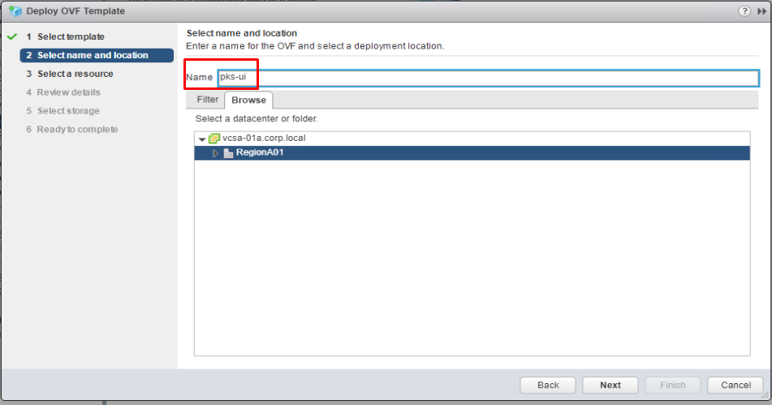
</details>
<br/>

1.1.4 On the `Select a resource` screen, select the `RegionA01-MGMT01` cluster and click `Next`

<details><summary>Screenshot 1.1.4</summary>

</details>
<br/>

1.1.5 On the `Review Details` screen, click `Next`

<details><summary>Screenshot 1.1.5</summary>
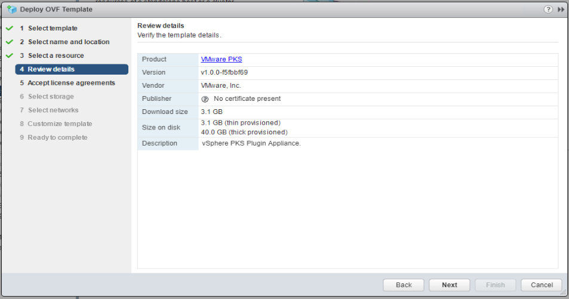
</details>
<br/>

1.1.6 On the `Accept license agreements` screen, click `Accept` and then click `Next`

<details><summary>Screenshot 1.1.6</summary>

</details>
<br/>

1.1.7 On the `Select Storage` screen, set the virtual disk format to `Thin provision`, set the `Datastore` to `RegionA01-ISCSI01-COMP01` and then click `Next`

<details><summary>Screenshot 1.1.7</summary>
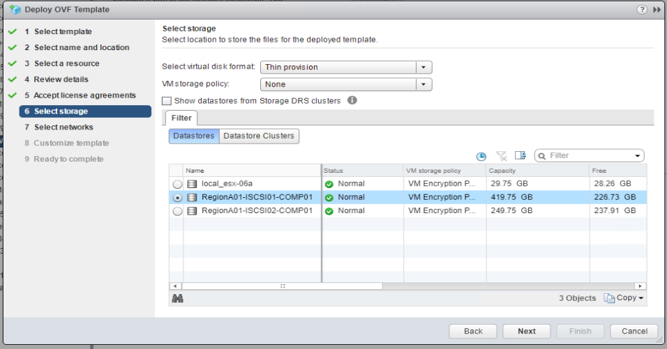
</details>
<br/>

1.1.8 On the `Select networks` screen, set both `VM Network` and `PKS Deployment Network` to `ESXi-RegionA01-vDS-MGMT` and then click `Next`

<details><summary>Screenshot 1.1.8</summary>
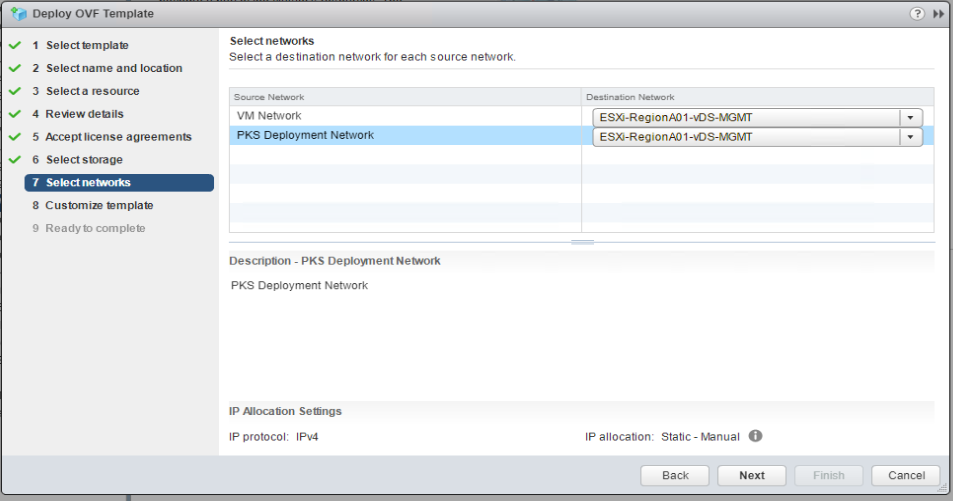
</details>
<br/>

1.1.9 On the `Customize template` screen, enter the following values:

- VC Address where the UI plugin will be running: vcsa-01a.corp.local
- Root Password: VMware1!
- Permit Root Login: True
- Network IP Address: 172.31.0.8
- Network Netmask: 255.255.255.0
- Default Gateway: 172.31.0.1
- Domain Name Servers: 192.168.110.10
- Domain Search Path: corp.local
- FQDN: pks-ui.corp.local
- Leave other settings to their default values and click `Next`

<details><summary>Screenshot 1.1.9</summary>

</details>
<br/>

1.1.10 On the `Ready to complete` screen, validate configuration data and click `Finish`

<details><summary>Screenshot 1.1.10</summary>
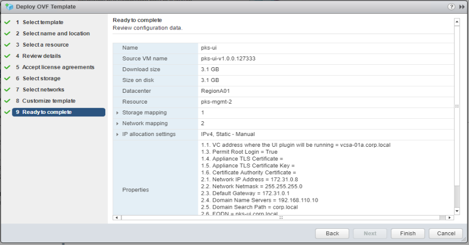
</details>
<br/>

Note: If there are insufficient resources to deploy the OVA, edit the settings for the NSX-T Controller, Edge & Manager to remove resource reservations

Please proceed through the following steps while the OVA template is deploying

1.2 Confirm all VM's installed and configured during NSX-T and PKS installation are running and in good health in vCenter

1.2.1 Login to the vSphere web client, Navigate to `Hosts and Clusters`, and verify that the `nsxt-manager`, `nsxc-1` and `nsxedge-1.corp.local` virtual machines are powered on. View the summary screen of each VM to ensure there are no error messages and overall VM health appears good

<details><summary>Screenshot 1.2.1 </summary>

</details>
<br/>

1.2.2 In the vSphere web client, on the `Hosts and Clusters` page, expand the `pks-mgmt-1` resource pool and check the summary tab of the `opsman`, BOSH and Harbor VM's. The BOSH and Harbor VM's have automatically generated VM names that are hard to identify. If you look under the `pks-mgmt-1` resource pool, you should see two virtual machines that have names beginning with "vm-", if you click on each of these VM's, on the `Summary` screen under `Custom Attributes`, the value for the `Deployment` parameter should be `p-bosh` for the BOSH VM and `harbor-container-registry-...` for the harbor VM, as shown in the following screenshots

Note: You should also see some VM's in the `pks-mgmt-1` resource pool that have names beginning with "sc-". These VMs are used by BOSH when processing certain tasks, these VMs may be off or on under normal healthy state, however if they are powered on it indicates BOSH is processing a task

<details><summary>Screenshot 1.2.2.1</summary>
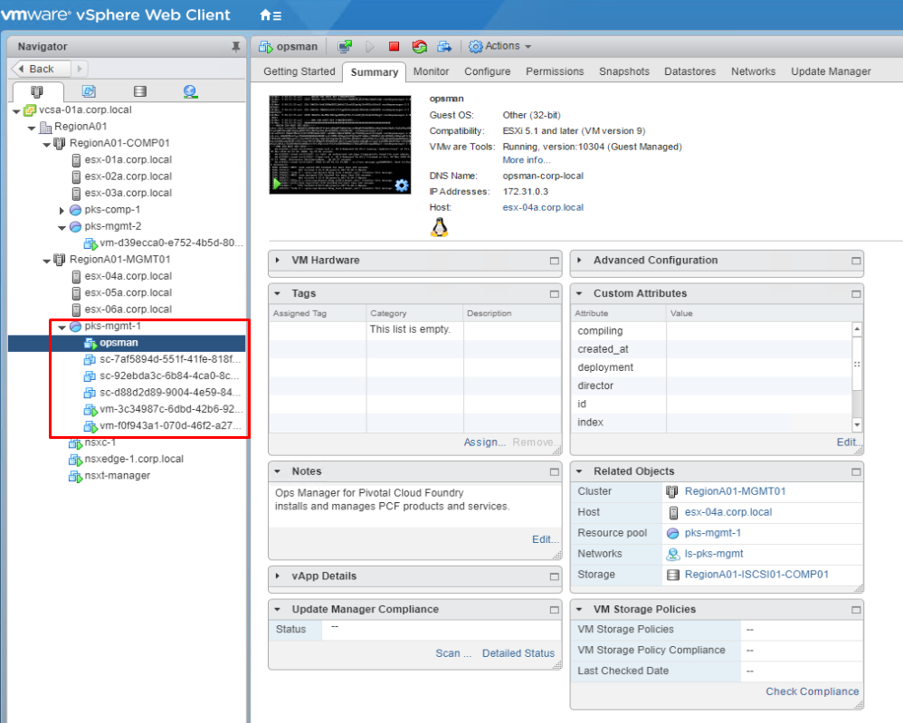
</details>

<details><summary>Screenshot 1.2.2.2</summary>

</details>

<details><summary>Screenshot 1.2.2.3</summary>

</details>
<br/>

1.2.3 In the vSphere web client, on the `Hosts and Clusters` page, expand the `pks-mgmt-2` resource pool and check the summary tab to verify the health of the PKS control plane VM. This should be the only VM running in the `pks-mgmt-2` resource pool, which can be confirmed by verifying the `Deployment` value under `Custom Attributes` includes `pivotal-container-service-...` as shown in the following screenshot

<details><summary>Screenshot 1.2.3</summary>

</details>
<br/>

1.2.4 From the control center desktop, open a putty session with cli-vm, login, authenticate to the PKS API, get the kubectl context for `my-cluster` and view the the kubernetes node ID's for `my-cluster` with the following commands. You will need to reference the node names provided here in the following steps

Note: If you do not currently have a cluster deployed, please deploy a cluster per the instructions in [Step 2 of Lab5](https://github.com/CNA-Tech/PKS-Ninja/tree/master/LabGuides/Lab5-DeployFirstCluster#step-2-login-to-pks-cli-and-create-cluster) before proceeding

```bash
pks login -a pks.corp.local -u pksadmin -k -p VMware1!
pks get-credentials my-cluster
kubectl get nodes
```

<details><summary>Screenshot 1.2.4</summary>
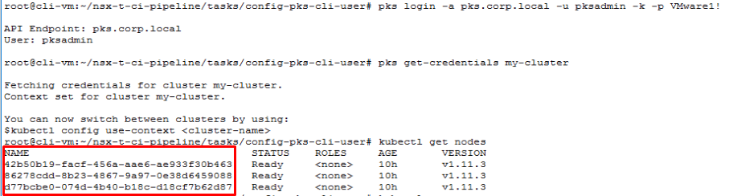
</details>
<br/>

1.2.5 In the vSphere web client, on the `Hosts and Clusters` page, expand the `pks-comp-1` resource pool and view the VM's in the resource pool. In the current configuration, all master and node VM's for all Kubernetes clusters created with this PKS instance will be deployed to the `pks-comp-1` resource pool.

Currently in your lab environment you should have one small kubernetes deployment. In Lab3, the small plan settings were configured to provision a single master and 3 worker nodes (The same configuration is also applied during pipeline execution). Accordingly you should see four virtual machines in the resource pool.

Review the output of the `kubectl get nodes` command from the previous step. Observe that there are only 3 nodes listed, which is because the master does not run the kubectl agent, only the nodes.

Click on one of the VM's in the `pks-comp-1` resource pool, navigate to the `Summary` tab and scroll down as needed in the `Custom Attributes` to observe the value for the `job` attribute. If the value is `master`, click on a different VM in the `pks-comp-1` resource pool, repeat the preceding steps and verify that the value of the `job` attribute for the vm you have selected is `worker`. 

Near the top of the `Summary` page for the selected VM, observe the value for `DNS Name`, and compare this value to the output of the `kubectl get nodes` command from the previous step, one of the entries should match.

Part of the point of this step is to demonstrate the complexity of correlating Kubernetes constructs to vSphere constructs without additional tools. Keep in mind there is currently only a single cluster deployed, in a production environment there can be hundreds of nodes and dozens of clusters

<details><summary>Screenshot 1.2.5</summary>
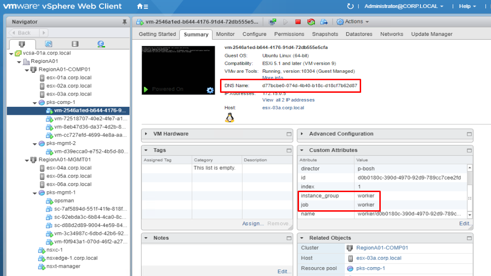
</details>
<br/>

1.3 Configure the vSphere PKS UI Plugin

1.3.1 In the vSphere web client, navigate to the `Hosts and Clusters` view, expand the `pks-mgmt-2` resource pool, right-click the `pks-ui` VM, select `Edit Settings`, set `Network adapter 1` to `ls-pks-mgmt` and click `OK`

<details><summary>Screenshot 1.3.1</summary>

</details>
<br/>

1.3.2 In the vSphere web client, right-click the `pks-ui` VM and select `Power > Power On`

<details><summary>Screenshot 1.3.2</summary>

</details>
<br/>

1.3.3 In the vSphere web client, right-click the `pks-ui` VM and select `Open Console`

<details><summary>Screenshot 1.3.3</summary>

</details>
<br/>

1.3.4 In the console connection to the `pks-ui` VM, wait for the VM to complete booting and login with username `root` and password `VMware1!`

<details><summary>Screenshot 1.3.3</summary>

</details>
<br/>

1.3.5 In v1.0 of the PKS UI technical preview, the OVF deploy does not provide an option to configure a static IP address for its 2nd NIC connection to the VM network. In the student lab environment DHCP is not configured to properly assign an approprate address for this interface, so in the following steps you will configure Photon OS, which is the OS used for the PKS UI VM, with a static IP address for the PKS UI VM's 2nd NIC.

1.3.6 From the console connection to the 'pks-ui' VM, make a copy of the network configuration file for the eth0 interface, naming the copy appropriately to define the settings for the eth1 interface with the command `cp /etc/systemd/network/09-pks.network /etc/systemd/network/10-vm.network`, and then use VI to edit the copied file with the command `vi /etc/systemd/network/10-vm.network`

<details><summary>Screenshot 1.3.6</summary>
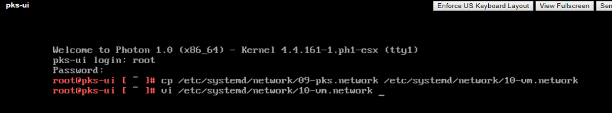
</details>
<br/>

1.3.7 Use VI to update the copied file to match the contents of the screenshot below, save the updates and exit VI

<details><summary>Screenshot 1.3.7</summary>

</details>
<br/>

1.3.8 From the console connection to the `pks-ui` VM, restart network services with the command `systemctl restart systemd-networkd`, `ping vcsa-01a.corp.local` to verify connectivity and then close the browser tab to the `pks-ui` console

<details><summary>Screenshot 1.3.8</summary>

</details>
<br/>

1.3.9 Open a new web browser tab and navigate to `https://192.168.100.72`, login with the username `administrator@vsphere.local` and password `VMware1!`, and on the `Complete PKS plugin registration` screen, click `CONTINUE`

<details><summary>Screenshot 1.3.9</summary>
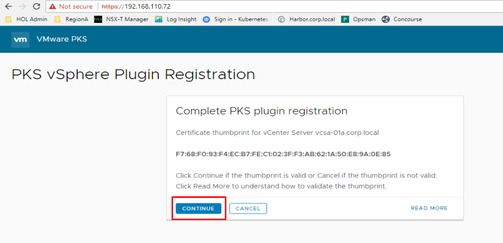
</details>
<br/>

1.3.10 Continue with the `Complete PKS plugin registration` screen, click `REGISTER` and wait for the registration process to complete

<details><summary>Screenshot 1.3.10</summary>

</details>
<br/>

1.3.11 Finish the `Complete PKS plugin registration` dialogue by clicking `LOGOUT`

<details><summary>Screenshot 1.3.11</summary>

</details>
<br/>

1.3.12 From the control center desktop, if you have any open connections to the vSphere web or HTML5 client, log out of your sessions and close the tabs. Open a new browser window and log into the vSphere HTML5 Client, you should now see an option for `VMware PKS` on the Home screen, Shortcuts screen and in the pulldown menu. Click on the `VMware PKS` icon to open the plugin

<details><summary>Screenshot 1.3.12</summary>

</details>
<br/>

1.3.13 Gather the BOSH credentials needed to connect from the PKS UI VM

Open a browser connection to Opsman with admin/VMware1!, click on the `Bosh Director for vSphere` tile and navigate to the `Credentials`, Find the row for `Bosh Commandline Credentials` and click `Link to Credentials` and record the values for `BOSH_Client` and `Bosh_Client_Secret` as shown in the screenshots below. Be careful not to leave any leading or trailing spaces when you copy the secret

<details><summary>Screenshot 1.3.13.1</summary>

</details>

<details><summary>Screenshot 1.3.13.2</summary>

</details>

<details><summary>Screenshot 1.3.13.3</summary>
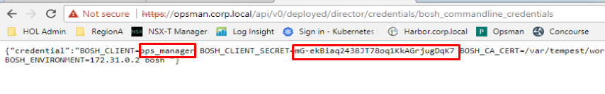
</details>
<br/>

1.3.14 After you click on `VMware PKS` you will be directed to the `PKS Instances` configuration, enter the following values:

- PKS API Endpoint
  - Hostname: pks.corp.local
  - Username: pksadmin
  - Password: VMware1!
- BOSH Endpoint
  - IP Address: 172.31.0.2
  - Username: ops_manager
  - Password: Use the value for the `BOSH_CLIENT_SECRET` you gathered in the previous step
- Networking endpoint
  - Networking Stack: NSX-T
  - Username: admin
  - Password: VMware1!
- Click `Add`
- Click `Continue` to confirm the PKS and BOSH fingerprints per the screenshots below

<details><summary>Screenshot 1.3.14.1</summary>

</details>

<details><summary>Screenshot 1.3.14.2</summary>
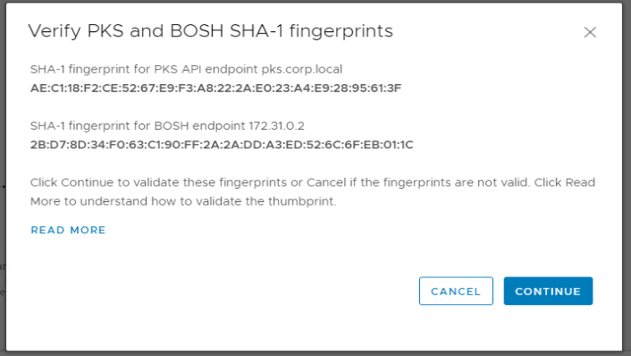
</details>

<details><summary>Screenshot 1.3.14.3</summary>

</details>
<br/>

1.4 Utilize the vSphere PKS Plugin to validate PKS Instance & K8s Cluster Health

1.4.1 From the vSphere HTML5 Client, navigate to the `VMware PKS` plugin and click on the name of your PKS instance

<details><summary>Screenshot 1.4.1</summary>
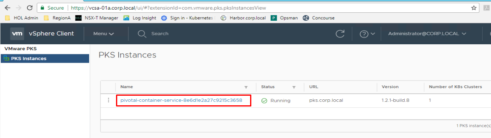
</details>
<br/>

1.4.2 On the `Summary` tab for your PKS instance, observe the details provided. The `Summary` tab is optimized to provide the most commonly needed PKS Instance details for VM administrators supporting PKS environments.

<details><summary>Screenshot 1.4.2</summary>

</details>
<br/>

1.4.3 On the `Summary` tab for your PKS instance, observe that the VM name for the PKS Control Plane VM is provided making it simple for an admin to find in vCenter. Click on the name of the VM and observe that you are directed to the VM page in the vSphere client where VM admins can leverage their experience and the mature vSphere toolset to validate the health and performance of the VM. Navigate back to the `Summary` tab of your PKS instance in the `VMware PKS` plugin

<details><summary>Screenshot 1.4.3.1</summary>

</details>

<details><summary>Screenshot 1.4.3.2</summary>

</details>
<br/>

1.4.4 On the `Summary` tab for your PKS instance, observe that the key network objects for PKS cluster health are displayed. Click on the name of the `Tier-0` router and observe that you are directed to the objects page in the NSX-T UI where VM admins can leverage their experience and the mature NSX-T toolset to validate the health and performance of the router. Navigate back to the `Summary` tab of your PKS instance in the `VMware PKS` plugin

<details><summary>Screenshot 1.4.4.1</summary>

</details>

<details><summary>Screenshot 1.4.4.2</summary>

</details>
<br/>

1.4.5 Return to the `VMware PKS` plugin, navigate to the `Nodes` tab. On this screen you will see a list of all the running master and worker nodes for all K8s clusters deployed using this PKS instance

Observe that the list of nodes provides key details such as node status, type, IP Address, cluster association as well as VM and AZ names with the ability to launch directly to the vSphere client page for the associated object

<details><summary>Screenshot 1.4.5</summary>
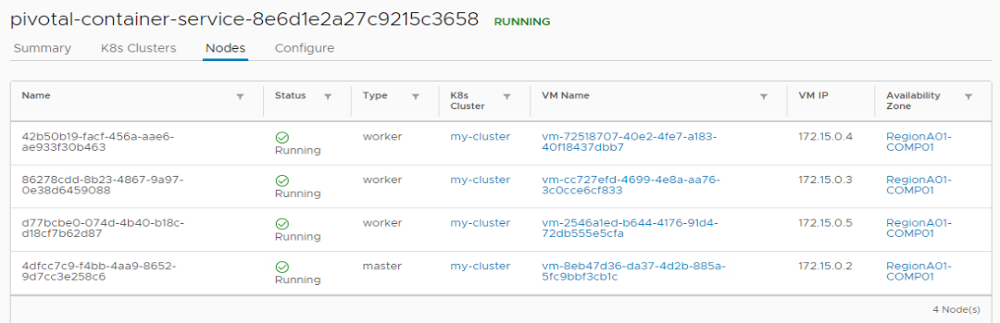
</details>
<br/>

1.4.6 From the `VMware PKS` plugin, navigate to the `Nodes` tab for your PKS instance. On this screen you will see the configuration of the PKS instance selected. These details can be used both to validate or edit the plugin configuration or as a reference for the information provided

Navigate through the `PKS API Endpoint`, `Networking` and `Bosh Endpoint` pages and observe the details provided

<details><summary>Screenshot 1.4.6.1</summary>

</details>

<details><summary>Screenshot 1.4.6.2</summary>
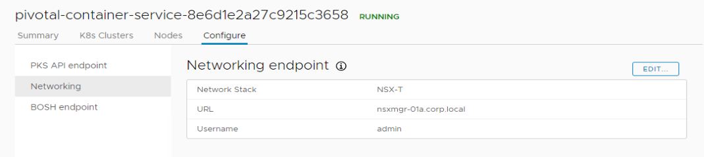
</details>

<details><summary>Screenshot 1.4.6.3</summary>

</details>
<br/>

1.4.7 Return to the `VMware PKS` plugin, navigate to the `K8s Clusters`. On this screen you will see a list of all the running clusters in this PKS instance. Click on `my-cluster` to view cluster details

<details><summary>Screenshot 1.4.7.1</summary>
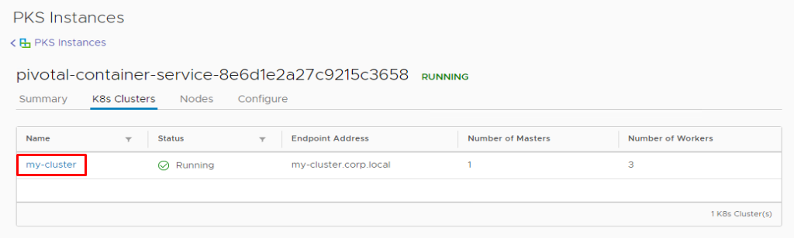
</details>

<details><summary>Screenshot 1.4.7.2</summary>

</details>
<br/>

1.4.6 Return to the `my-cluster > Summary` tab in the `VMware PKS` plugin and take some time to observe the details provided about your cluster

The Cluster overview provides key details about cluster composition pertinent for planning and troubleshooting

The Networking section provides information specific to the selected `my-cluster` deployment. Observe that the Load Balancer information is provided on the my-cluster screen as with PKS/NSX-T a load-balancer is deployed with each K8s cluster. Likewise the node-level networking objects where the cluster is deployed are presented, however the pod network objects are not shown as pod networks are deployed on a per-namespace basis, and accordingly are displayed on the namespaces tab

The Nodes section allows you to easily identify the master or node VM's in vCenter

The Storage section provides details about vSphere storage componentes used to provision persistent volumes for running kubernetes pods. There are currently no persistent volumes deployed, so no information is displayed at this time

<details><summary>Screenshot 1.4.6</summary>
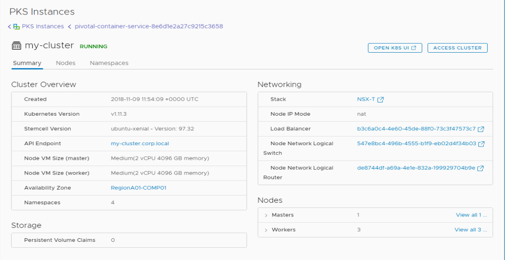
</details>
<br/>

1.4.7 From the `my-cluster` screen in the `VMware PKS` plugin, select the `Nodes` tab and take some time to observe the details provided about your cluster's nodes

<details><summary>Screenshot 1.4.7</summary>

</details>
<br/>

1.4.8 From the `my-cluster` screen in the `VMware PKS` plugin, select the `Namespaces` tab and take some time to observe the details provided about your cluster's nodes. Remember that NSX-T deployes unique network objects for each namespace

Observe the long, autogenerated name for each namespaces logical switch, and consider how much dramatically easier it is to identify vCenter assets that support the Kubernetes cluster deployments with the plugin. Click on the name of the `Pod Network` for the `default` namespace and observe that this launches you directly into the NSX Manager UI for that object

<details><summary>Screenshot 1.4.8.1</summary>

</details>

<details><summary>Screenshot 1.4.8.2</summary>

</details>
<br/>

## Step 2: Validate Kubernetes Cluster Deployment & Operation

2.1 Observe Kubernetes Cluster with the Kubernetes Dashboard

2.1.1 From the vSphere HTML5 Client, navigate to `VMware PKS > Your PKS Instance > K8s Clusters > my-cluster > Summary`, click on the `OPEN K8S UI` link and follow the instructions to connect to the dashboard for my-cluster

<details><summary>Screenshot 2.1.1</summary>

</details>

2.1.1.1 From the `Open K8s 'my-cluster' UI` screen, copy the text from the `Set context` box

<details><summary>Screenshot 2.1.1.1</summary>

</details>
<br/>

2.1.1.2 On the control center desktop, open Notepad++ and paste the contents of the clipboard. The text provided is prepared for BASH, and you need to prepare the commands to paste into the windows command prompt

Remove the string `&& \` from the end of each line and copy the updated text to the clipboard

<details><summary>Screenshot 2.1.1.2</summary>

</details>
<br/>

2.1.1.3 On the control center desktop, open a command prompt and paste the contents of the clipboard into the command prompt

<details><summary>Screenshot 2.1.1.3</summary>

</details>
<br/>

2.1.1.4 From the control center command prompt, enter the command `kubectl proxy --port=8011`

<details><summary>Screenshot 2.1.1.4</summary>

</details>
<br/>

2.1.1.5 From the control center desktop open a browser tab, connect to `http://localhost:8011/api/v1/namespaces/kube-system/services/https:kubernetes-dashboard:/proxy/#!/login`, select `Token` and paste the value from the `Open K8s UI > '3. Open Kubernetes dashboard` textbox and click `SIGN IN`

Note: Students using the onecloud lab can use the browser shortcut to the dashboard but will need to update the port number to 8011 in the url bar

<details><summary>Screenshot 2.1.1.5.1</summary>

</details>

<details><summary>Screenshot 2.1.1.5.2</summary>

</details>

<details><summary>Screenshot 2.1.1.5.3</summary>
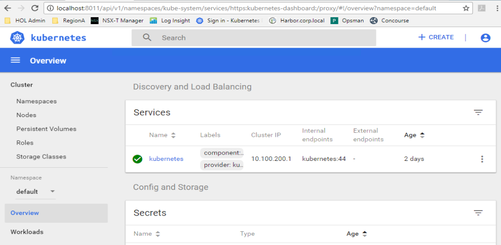
</details>
<br/>