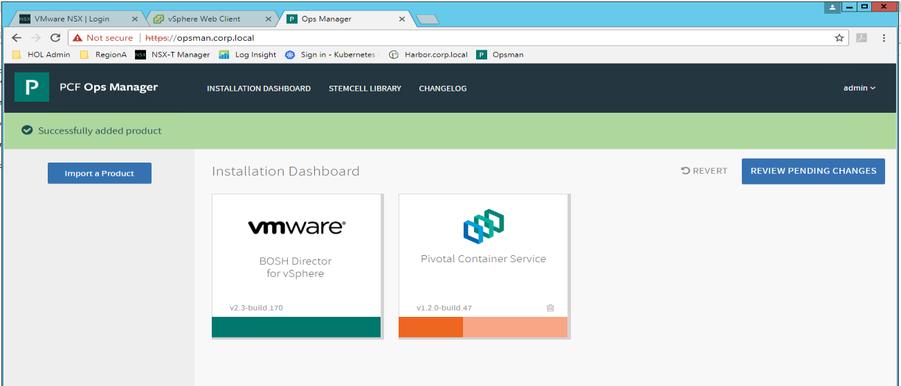

# Lab PKS Installation Phase 1

**Contents:**

- [Lab Access Instructions]()
- [Step 1: Deploy Ops Manager]()
- [Step 2: Deploy BOSH]()
- [Step 3: Deploy Harbor]()
- [Step 4: ]()
- [Step 5: ]()
- [Next Steps]()

## Lab Access Instructions

For PKS Ninja students using the labs provided in the course, the lab admins will provide you with an IP address to RDP into the ControlCenter desktop in the vPod that has been assigned to you.

All instructions in this lab guide should be performed from the ControlCenter desktop unless otherwise specified.

## Step 1: Deploy Ops Manager

1.1 In the vSphere web client, right click on the `pks-mgmt-1` resource pool and select `Deploy OVF Template`

<details><summary>Screenshot 1.1</summary>
>
</details>
<br/>

1.2 On the `Select template` screen, select `Local File` and navigate to the Ops Manager OVA file

<details><summary>Screenshot 1.2</summary>

</details>
<br/>

1.3 On the `Select name and location` screen, enter the Name `opsman` and select `RegionA01` as the datacenter

<details><summary>Screenshot 1.3</summary>

</details>
<br/>

1.4 On the `Select a resource` screen, select the `pks-mgmt-1` resource pool

<details><summary>Screenshot 1.4</summary>

</details>
<br/>

1.5 On the `Review details` screen, confitm the details and click `Next`

<details><summary>Screenshot 1.5</summary>

</details>
<br/>

1.6 On the `Select Storage` screen, set `Thin Provision` as the virtual disk format and `RegionA01-ISCSI01-COMP01` as the datastore

<details><summary>Screenshot 1.6</summary>

</details>
<br/>

1.7 On the `Select networks` screen, ensure the `Destination Network` is set to `VM-RegionA01-vDS-MGMT`.

Note: this VM will later be attached to the `ls-pks-mgmt`, however we are connecting it to a different network during the `Deploy OVF Template` wizard as at the time of writing, there is a bug that prevents attachnment to a logical switch. After the OVF deployment is complete, a later step will have you change the network attachment.

<details><summary>Screenshot 1.7</summary>

</details>
<br/>

1.8 On the `Customize template` screen, enter the following variables:

- Admin Password: VMware1!
- Custom Hostname: opsman
- DNS: 192.168.110.10
- Default Gateway: 172.31.0.1
- IP Address: 172.31.0.3
- NTP Servers: ntp.corp.local
- Netmask: 255.255.255.0

<details><summary>Screenshot 1.8</summary>

</details>
<br/>

1.9 On the `Ready to complete` screen, confirm the details and click `Finish`

<details><summary>Screenshot 1.9</summary>

</details>
<br/>

1.10 After completing the `Deploy OVF Template` wizard, go to your recent tasks view and wait for the `Status` to change to `Completed` before proceeding

<details><summary>Screenshot 1.10</summary>

</details>
<br/>

1.11 In the vSphere web client in the `Hosts and Clusters` view, expand the `pks-mgmt-1` resource pool and select the opsman vm. On the `Actions` pulldown select `Edit Settings`

<details><summary>Screenshot 1.11</summary>

</details>
<br/>

1.12 On the `Edit Settings` menu for the opsman vm, set `Network Adapter 1` to `ls-pks-mgmt`

<details><summary>Screenshot 1.12</summary>

</details>
<br/>

1.13 In the vSphere web client, right click on the opsman vm and select `Power On`

<details><summary>Screenshot 1.13</summary>

</details>
<br/>

1.14 Open a web browser connection to `opsman.corp.local` and select `Internal Authentication`

<details><summary>Screenshot 1.14</summary>

</details>
<br/>

1.15 On the `Internal Authentication` screen, enter the following values, check the box to agree to terms and conditions and click `Setup Authentication`

Note: After clicking `Setup Authentication` it will take several minutes for the authentication system to start. The login screen will appear after the authentication system is finished starting up

- Username: Admin
- Password: VMware1!
- Decryption Passphrase: VMware1!

<details><summary>Screenshot 1.15</summary>

</details>
<br/>

1.16 From the Ops Manager web UI, login with Username: `Admin` Password: `VMware1!`

<details><summary>Screenshot 1.16</summary>

</details>
<br/>

## Step 2: Deploy BOSH

2.1 From the ControlCenter desktop, open putty and connect to `cli-vm`. When you open the ssh session it will attempt to connect to PKS, which has not been deployed yet so it will hang, hold down the ctrl or cmd key while you press `C` to return to the Bash prompt and enter the following command:

`openssl s_client -host nsxmgr-01a.corp.local -port 443 -prexit -showcerts`

Save the section of the output from `Begin Certificate` to `End Certificate` for use in the following steps

<details><summary>Screenshot 2.1</summary>

</details>
<br/>

2.2 Log into the Ops Manager web UI and click on the tile `BOSH Director for vSphere`

<details><summary>Screenshot 2.2</summary>

</details>
<br/>

2.3 On the `vCenter Configuration` page, enter the following values and click `Save`:

- Name: vcsa-01a
- vCenter Host: vcsa-01a.corp.local
- vCenter Username: administrator@vsphere.local
- vCenter Password: VMware1!
- Datacenter Name: RegionA01
- Virtual Disk Type: thin
- Ephemeral Datastore Names: RegionA01-ISCSI01-COMP01
- Persistent Datastore Names: RegionA01-ISCSI01-COMP01
- Select `NSX Networking`
- NSX Mode: NSX-T
- NSX Address: nsxmgr-01a.corp.local
- NSX Username: admin
- NSX Password: VMware1!
- VM Folder: pks_vms
- Template Folder: pks_templates
- Disk path Folder: pks_disk

<details><summary>Screenshot 2.3.1</summary>

</details>

<details><summary>Screenshot 2.3.2</summary>

</details>
<br/>

2.4 Continue with the Bosh Director tile configuration, select the `Director Config` tab and enter the following values:

- NTP Servers: ntp.corp.local
- Enable VM Resurrector Plugin: True
- Enable Post Deploy Scripts: True
- Recreate All VMs: True
- Leave all other settings set to default values and click `Save`

<details><summary>Screenshot 2.4</summary>

</details>
<br/>

2.5 Continue with the Bosh Director tile configuration, select the `Create Availability Zones` tab and enter the following details:

Note: Each of the availability zones below will have a single cluster. When you add an availability zone, make sure to click `Add` and do **not** click `Add Cluster`

- Click `Add` to add an Availability Zone with the following values
  - Name: PKS-MGMT-1
  - IaaS Configuration: vcsa-01a
  - Cluster: RegionA01-MGMT01
  - Resource Pool: pks-mgmt-1
- Click `Add` to add an Availability Zone with the following values
  - Name: PKS-COMP
  - IaaS Configuration: vcsa-01a
  - Cluster: RegionA01-COMP01
  - Resource Pool: pks-comp-1
- Click `Add` to add an Availability Zone with the following values
  - Name: PKS-MGMT-2
  - IaaS Configuration: vcsa-01a
  - Cluster: RegionA01-COMP01
  - Resource Pool: pks-mgmt-2
- Click Save

<details><summary>Screenshot 2.5</summary>

</details>
<br/>

2.6 Continue with the Bosh Director tile configuration, select the `Create Networks` tab and enter the following values:

- Enable ICMP Checks: True
- Click `Add Network` to add a network with the following values
  - Name: PKS-MGMT
  - vSphere Network Name: ls-pks-mgmt
  - CIDR: 172.31.0.0/24
  - Reserved IP Ranges: 172.31.0.3
  - DNS 192.168.110.10
  - Gateway 172.31.0.1
  - Availability Zones: PKS-MGMT-1, PKS-MGMT-2
- Click Save

<details><summary>Screenshot 2.6</summary>

</details>
<br/>

2.7 Continue with the Bosh Director tile configuration, select the `Assign AZs and Networks` tab and enter the following values:

- Singleton Availability Zone: PKS-MGMT-2
- Network: PKS-MGMT
- Click Save

<details><summary>Screenshot 2.7</summary>

</details>
<br/>

2.8 Continue with the Bosh Director tile configuration, select the `Resource Config` tab and change the value of the `VM Type` in the second row to `medium.disk` as shown in Screenshot 2.8

<details><summary>Screenshot 2.8</summary>

</details>
<br/>

2.9 In the Ops Manager web UI, click on `Installation Dashboard` on the top menu bar and then click `Review Pending Changes`

<details><summary>Screenshot 2.9</summary>

</details>
<br/>

2.10 On the `Review Pending Changes` screen, ensure that the checkbox for Bosh Director is checked and click `Apply Changes`

<details><summary>Screenshot 2.10</summary>

</details>
<br/>

2.11 Review the `Applying Changes` to observe the BOSH VM deployment until it is complete. Once complete, you should see a `Changes applied` popup window as shown in Screenshot 2.11.2

<details><summary>Screenshot 2.11.1 </summary>

</details>

<details><summary>Screenshot 2.11.2 </summary>

</details>
<br/>

2.12 In the vSphere web client from the `Hosts and Clusters` view, expand the pks-mgmt-2 resource pool and you should see the BOSH vm

<details><summary>Screenshot 2.12 </summary>

</details>

## Step 3: Install PKS

3.1 Generate NSX-T Principal Identity certificate (You will need this for PKS Intallation)

3.1.1 From the ControlCenter desktop, open putty and connect to `cli-vm`. When you open the ssh session it will attempt to connect to PKS, which has not been deployed yet so it will hang, hold down the `ctrl` or `cmd` key while you press `C` to return to the bash prompt and enter the following command:

``` bash
mkdir nsxt-pi-cert
cd nsxt-pi-cert
```

3.1.2 Use a text editor to create a file with the following shell script to generate the PI cert, for example `nano create_certificate.sh'. Copy the following text to the file:

<details><summary>Click to expand create_certificate.sh</summary>

``` bash
#!/bin/bash
#create_certificate.sh

NSX_MANAGER="192.168.110.42"
NSX_USER="admin"

PI_NAME="pks-nsx-t-superuser"
NSX_SUPERUSER_CERT_FILE="pks-nsx-t-superuser.crt"
NSX_SUPERUSER_KEY_FILE="pks-nsx-t-superuser.key"

stty -echo
printf "Password: "
read NSX_PASSWORD
stty echo

openssl req \
  -newkey rsa:2048 \
  -x509 \
  -nodes \
  -keyout "$NSX_SUPERUSER_KEY_FILE" \
  -new \
  -out "$NSX_SUPERUSER_CERT_FILE" \
  -subj /CN=pks-nsx-t-superuser \
  -extensions client_server_ssl \
  -config <(
    cat /etc/ssl/openssl.cnf \
    <(printf '[client_server_ssl]\nextendedKeyUsage = clientAuth\n')
  ) \
  -sha256 \
  -days 730

cert_request=$(cat <<END
  {
    "display_name": "$PI_NAME",
    "pem_encoded": "$(awk '{printf "%s\\n", $0}' $NSX_SUPERUSER_CERT_FILE)"
  }
END
)

curl -k -X POST \
    "https://${NSX_MANAGER}/api/v1/trust-management/certificates?action=import" \
    -u "$NSX_USER:$NSX_PASSWORD" \
    -H 'content-type: application/json' \
    -d "$cert_request"
```

</details>
<br/>

<details><summary>Screenshot 3.1.2</summary>

</details>
<br/>

3.1.3 Return to the bash prompt and enter the command `bash create_certificate.sh`

<details><summary>Screenshot 3.1.3</summary>

</details>
<br/>

3.1.4 Review the contents of the NSX PI certificate and key and save or copy the contents as you will need these keys in later steps

``` bash
cat pks-nsx-t-superuser.crt
cat pks-nsx-t-superuser.key
```

<details><summary>Screenshot 3.1.4</summary>

</details>
<br/>

3.2 Import the PKS Tile

3.2.1 Log into the Ops Manager UI, Click `Import a Product`, select the Pivotal Container Service binary file and wait for the file to import

<details><summary>Screenshot 3.2.1.1 </summary>

</details>

<details><summary>Screenshot 3.2.1.2 </summary>

</details>
<br/>

3.2.2 Once the import is complete you should see a `Pivotal Container Service` section in the left navigation bar. Click on the `+` icon

<details><summary>Screenshot 3.2.2.1 </summary>

</details>

<details><summary>Screenshot 3.2.2.2 </summary>

</details>
<br/>


## Next Steps

This lab provided an introductory overview of Kubernetes operations. Additional topics such as persistent volumes, network policy, config maps, stateful sets and more will be covered in more detail in the ongoing labs.

If you are following the PKS Ninja cirriculum, [click here to proceed to the next lab](../Lab2-PksInstallationPhaseOne). As you proceed through the remaining labs you will learn more advanced details about Kubernetes using additional planespotter app components as examples and then deploy the complete planespotter application on a PKS environment.

If you are not following the PKS Ninja cirriculum and would like to deploy the complete planespotter app on VKE, you can find [complete deployment instructions here](https://github.com/Boskey/run_kubernetes_with_vmware)

### Thank you for completing the Introduction to Kubernetes Lab!

### [Please click here to proceed to Lab2: PKS Installation Phase 1](../Lab2-PksInstallationPhaseOne)