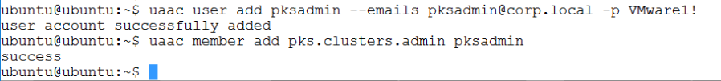
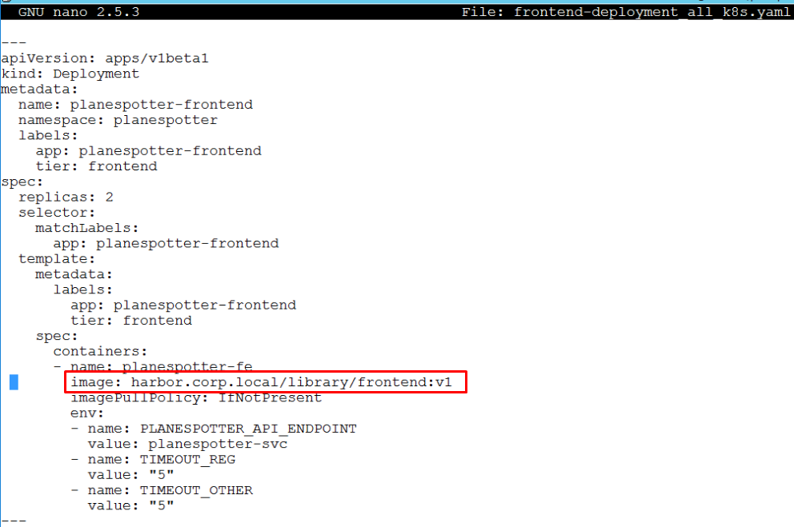
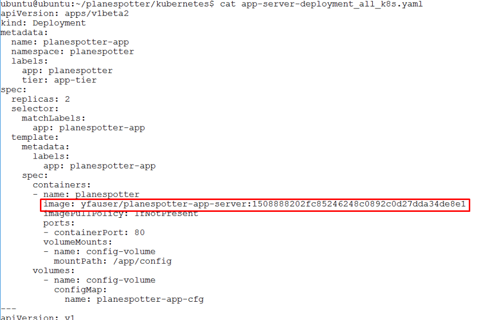
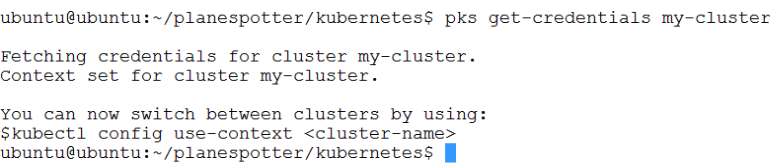

# Lab 5: Deploy First PKS Cluster & Planespotter

## Step 1: Create UAA Account for PKS User

1.1 Login to Ops Manager UI, Click on the PKS tile and then click on the `Credentials` tab, look for `Pks Uaa Management Admin Client` , click `Link to Credential`

<details><summary>Screenshot 1.1 </summary>

</details>
<br/>

1.2 Copy the value of the secret to the clipboard as shown in Screenshot 1.2

<details><summary>Screenshot 1.2 </summary>

</details>
<br/>

1.3 Resume or if needed reopen you ssh session with `cli-vm`, target your UAA server and request a token with the following commands. Be sure to replace the string `LtrWeSarpeGbnM_h0kJB5Ddxy0emt5qr` with the secret that you gathered in the previous step 1.2

```bash:
uaac target https://pks.corp.local:8443 --skip-ssl-validation
uaac token client get admin -s LtrWeSarpeGbnM_h0kJB5Ddxy0emt5qr
```

<details><summary>Screenshot 1.3 </summary>

</details>
<br/>

1.4 From `cli-vm`, enter the following commands to create a UAA account and assign admin rights to new user `pksadmin`:

```bash:
uaac user add pksadmin --emails pksadmin@corp.local -p VMware1!
uaac member add pks.clusters.admin pksadmin
```

<details><summary>Screenshot 1.4 </summary>

</details>
<br/>

## Step 2 Login to PKS CLI and Create Cluster

2.1 From `cli-vm`, Login to the PKS CLI with the following command:

`pks login -a pks.corp.local -u pksadmin -p VMware1! --skip-ssl-validation`

<details><summary>Screenshot 2.1 </summary>

</details>
<br/>

2.2 From `cli-vm`, verify there are no existing clusters and create a cluster with the following commands

```bash
pks clusters
pks create-cluster my-cluster --external-hostname my-cluster.corp.local --plan small
```

Note: It will take ~10 minutes for the cluster to deploy, you may proceed with step 3 while the cluster deployment is in progress, however do not proceed to step 4 until the cluster deployment status is `succeeded`

Also, it may be interesting for you to look at the `Tasks` menu in vCenter to observe some of the vSphere tasks that occur on cluster creation

<details><summary>Screenshot 2.2 </summary>

</details>
<br/>

## Step 3: Prepare Planespotter K8s Manifests for Deployment

3.1 From `cli-vm`, use nano or another text editor to change the image pull location in the frontend deployment manifest to pull the image you created and pushed to harbor previously at  `harbor.corp.local/library/frontend:v1`. Use the following commands to open the manifest in nano and then reference Screenshot 3.1 as needed to complete the update and save the file

```bash
cd ~/planespotter/kubernetes
nano frontend-deployment_all_k8s.yaml
# update file, save and close
```

<details><summary>Screenshot 2.2 </summary>

</details>
<br/>

3.2 View the `app-server-deployment_all_k8s.yaml` file, observe the container image value is `yfauser/planespotter-app-server:1508888202fc85246248c0892c0d27dda34de8e1` which is a working configuration. You may notice this does not specify the location of the registry it is using, and that is because this container is located on docker hub, which is a default search location for docker hosts including PKS deployed K8s nodes

<details><summary>Screenshot 2.2 </summary>

</details>
<br/>

You should now understand the differences in how to configure a kubernetes manifest to pull from docker hub or from Harbor

## Step 4: Deploy Planespotter App

4.1 Before proceeding, verify that your cluster has successfully deployed by entering the command `pks clusters` from `cli-vm`. If your PKS CLI session has timed out, login again using the command provided in step 2.1

<details><summary>Screenshot 2.2 </summary>

</details>
<br/>

4.2 Pull down the login credentials for `my-cluster` with the command `pks get-credentials my-cluster`

<details><summary>Screenshot 2.2 </summary>

</details>
<br/>

Please use the instructions at [this link](https://github.com/Boskey/run_kubernetes_with_vmware/wiki/Deploy-Plane-Spotter) to complete deployment of the planespotter app
