# NSX-T 2.5.0 Configuration for Enterprise PKS

## Overview

The following installation guide walks through the configuration of NSX-T 2.5.0 for VMware Enterprise PKS. The steps and variables used in this Lab Guide are specific to the PKS-Ninja-T1-{BuildName}0.x lab templates. 

 Anyone is welcome to build a similar lab environment and follow along with the lab exercises, but please note you will need to replace any variables such as IP addresses and FQDNs and replace them with the appropriate values for your lab environment.

The steps provided in this lab guide are intended for a lab implementation and do not necessarily align with best practices for production implementiations. While the instructions provided in this lab guide did work for the author in their lab environment, VMware and/or any contributors to this Guide provide no assurance, warranty or support for any content provided in this guide.

## Prerequisites

- To use this lab guide, you must use either the PKS-Ninja-T1-NsxtInstalled template, or if you prefer to install NSX-T yourself, you can also load the PKS-Ninja-T1-

- Please see [Getting Access to a PKS Ninja Lab Environment](https://github.com/CNA-Tech/PKS-Ninja/tree/Pks1.6/Courses/GetLabAccess-LA8528) to learn about how to access or build a compatible lab environment

## Installation Notes

Anyone who implements any software used in this lab must provide their own licensing and ensure that their use of all software is in accordance with the software's licensing. This guide provides no access to any software licenses.

For those needing access to VMware licensing for lab and educational purposes, we recommend contacting your VMware account team. Also, the [VMware User Group's VMUG Advantage Program](https://www.vmug.com/Join/VMUG-Advantage-Membership) provides a low-cost method of gaining access to VMware licenses for evaluation purposes.

This lab guide follows steps that are customized for a specific lab environment, to support other implementations and to find additional information, please see the [Installing Enterprise PKS on vSphere with NSX-T Data Center](https://docs.vmware.com/en/VMware-Enterprise-PKS/1.6/vmware-enterprise-pks-16/GUID-vsphere-nsxt-index.html) page in the VMware Enterprise PKS 1.6 Documentation. 

## Overview of Tasks Covered in Lab 1

- [NSX-T 2.5.0 Configuration for Enterprise PKS](#nsx-t-250-configuration-for-enterprise-pks)
  - [Overview](#overview)
  - [Prerequisites](#prerequisites)
  - [Installation Notes](#installation-notes)
  - [Overview of Tasks Covered in Lab 1](#overview-of-tasks-covered-in-lab-1)
- [Step 1: Create T0 Logical Router for Enterprise PKS](#step-1-create-t0-logical-router-for-enterprise-pks)
  - [Step 2: Create the Enterprise PKS Management Plane](#step-2-create-the-enterprise-pks-management-plane)
  - [Step 3: Create NAT Rules for PKS Management and Compute Plane Operations](#step-3-create-nat-rules-for-pks-management-and-compute-plane-operations)
  - [Step 4: Create IP Pools & Blocks needed for PKS](#step-4-create-ip-pools--blocks-needed-for-pks)

-----------------------

# Step 1: Create T0 Logical Router for Enterprise PKS

<details><Summary>Expand to see list of steps for T0 Router installation & configuration</Summary>

- Define a T0 logical switch with an ingress/egress uplink port. Attach the T0 LS to the VLAN Transport Zone.
- Create a logical router port and assign to it a routable CIDR block, for example 10.172.1.0/28, that your environment uses to route to all Enterprise PKS-assigned IP pools and IP blocks.
- Connect the T0 router to the uplink VLAN logical switch.
- Attach the T0 router to the Edge Cluster and set HA mode to Active-Standby. NAT rules are applied on the T0 by NCP. If the T0 router is not set in Active-Standby mode, the router does not support NAT rule configuration.
- Lastly, configure T0 routing to the rest of your environment using the appropriate routing protocol for your environment or by using static routes.
  
</details>
<br/>

1.1 Create VLAN Uplink Switch

Log into the NSX Manager UI with username `admin` and password `VMware1!VMware1!`,  navigate to the **Advanced Networking & Security > Switching** page and click on `+ADD`, add a logical switch with the following parameters:

- General Tab
  - Name: `uplink-vlan-ls`
  - Transport Zone: `vlan-tz`
  - VLAN: `0` _(Press [Enter] key after input to store it)_
- Switching Profiles tab
  - Leave all values to default
- Click on **ADD**

<details><Summary>Screenshot 1.1.1</Summary>
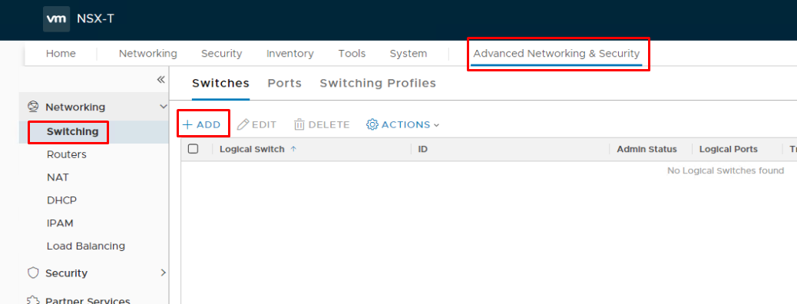
</details>

<details><Summary>Screenshot 1.1.2</Summary>
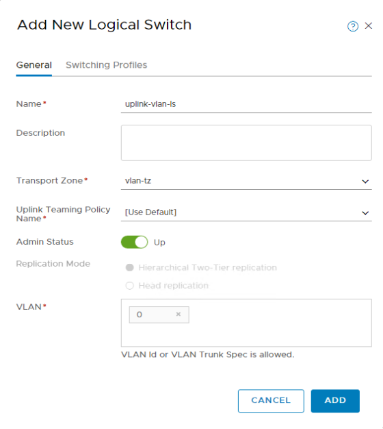
</details>
<br/>

1.2 - In the NSX Manager UI, navigate to  **`Advanced Networking & Security > Routers`**, and then click on **`+ADD > Tier-0 Router`** and add a new router with the following parameters:

- Name: `t0-pks`
- Edge Cluster: `edge-cluster-1`
- High Availabilty Mode: **`Active-Standby`**
- Fail Over: `Non Preemptive`
- Click **Add**

<details><Summary>Screenshot 1.2.1</Summary>
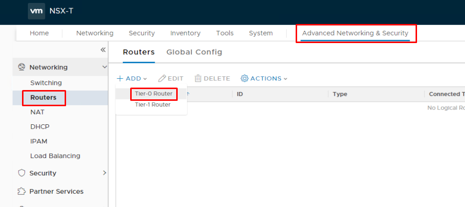
</details>

<details><Summary>Screenshot 1.2.2</Summary>
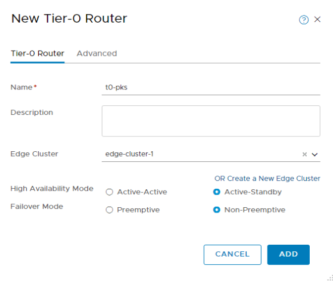
</details>
<br/>

1.3 Navigate to the `Advanced Networking & Security > Routers` page, select the `t0-pks` router, and on the `Configuration` pulldown menu, select `Router Ports`

<details><summary>Screenshot 1.3</summary>
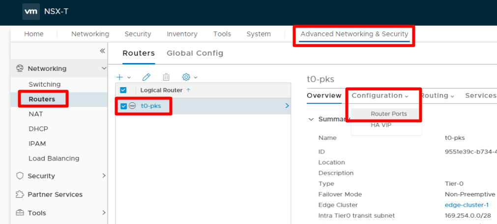
</details>
<br/>

1.4 In the `Logical Router Ports` pane, click `+ADD` and add a router port with the following parameters:

- Name: `t0-uplink-1`
- Type: `Uplink`
- Transport Node: `edge-tn-1`
- Logical Switch: `uplink-vlan-ls`
- Under `Subnets` click `+ADD`
  - IP Address: `192.168.210.3`
  - Prefix length: 24     
- Click **Add**

<details><summary>Screenshot 1.4</summary>
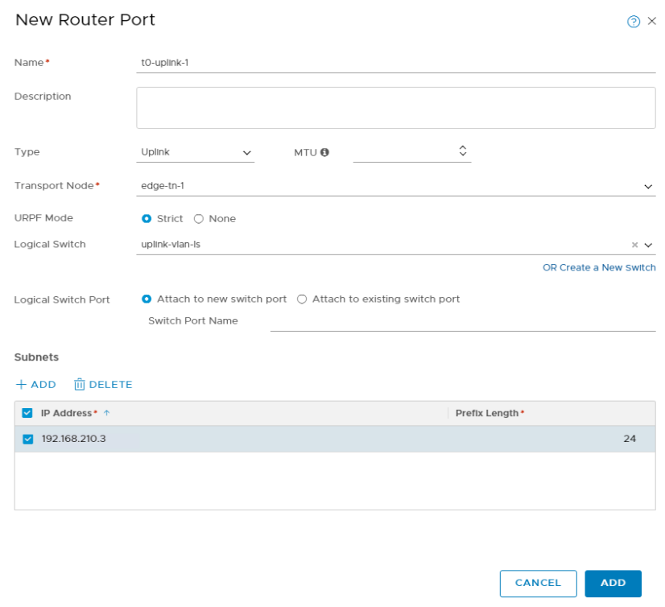
</details>
<br/>

1.5 From the `Advanced Networking & Security > Routers > t0-pks` page, and on the `Routing` pulldown menu, select `Static Routes`

<details><summary>Screenshot 1.5</summary>
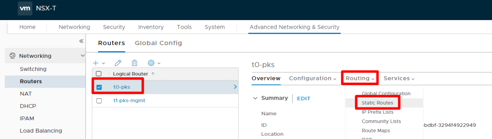
</details>
<br/>

1.6 Click `+ADD` to add a static route using the following parameters:

- Network: `0.0.0.0/0`
- Click on **Next Hops +Add**
- Next Hop: `192.168.210.1` _(Make sure the input stays by pressing [Enter] after enry)_
- Click **Add** 

<details><summary>Screenshot 1.6</summary>
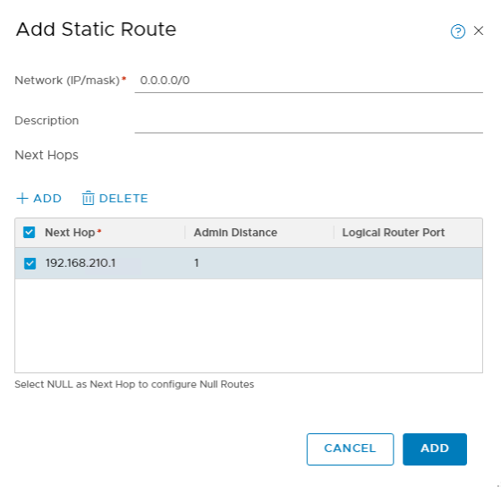
</details>
<br/>

## Step 2: Create the Enterprise PKS Management Plane

2.1 Create NSX-T Logical Switch for the Enterprise PKS Management Plane

Navigate to the `Advanced Networking & Security > Switching` page and click `+ADD` and add a new logical switch with the following parameters:

- Name: `ls-pks-mgmt`
- Transport Zone: `overlay-tz`
- Click on **Add**

<details><summary>Screenshot 2.1</summary>

</details>
<br/>

2.2 Create NSX-T Tier-1 Router for the Enterprise PKS Management Plane

Navigate to the `Advanced Networking & Security > Routers` page and click `+ > Tier-1 Router` and add a new Tier-1 Router with the following parameters but ignore the Screen Shot for the Edge Cluster variable and leave this value blank. If you select an Edge Cluster for your T1 Router, NSX will deploy a T1-SR and hair pin all your E/W traffic through this SR. If you do not deploy a T1 SR then your E/W traffic will be distributed accross all your Transport Nodes T1-DR. For PKS with NAT we are running all services on the T0-SR and a T1-SR is not needed:
- Name: `t1-pks-mgmt`
- Tier-0 Router: `t0-pks`
- Edge Cluster: edge-cluster-1
- Click **Add**

<details><summary>Screenshot 2.2.1</summary>
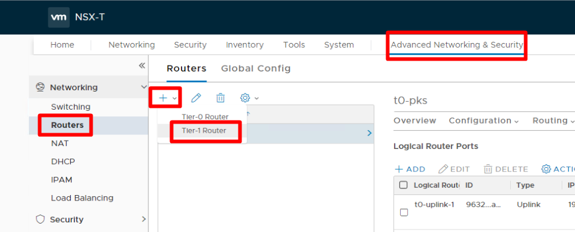
</details>

<details><summary>Screenshot 2.2.2</summary>
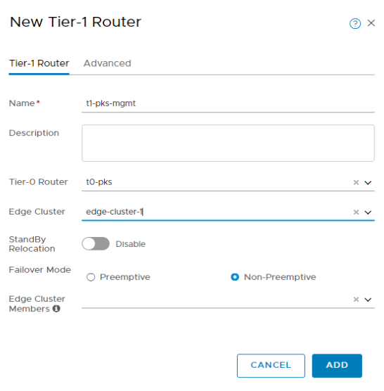
</details>
<br/>

2.3 Navigate to the `Advanced Networking & Security > Routers` page, select the `t1-pks-mgmt` router, and on the `Configuration` pulldown menu, select `Router Ports`, and then click `+ADD` and add a new router port with the following parameters:

- Name: `ls-pks-mgmtRouterPort`
- Type: `Downlink`
- Logical Switch: `ls-pks-mgmt`
- Subnets: `+ADD`
  - IP Address: `172.31.0.1`
  - Prefix Length: `24`
- Click **Add**

<details><summary>Screenshot 2.3.1</summary>
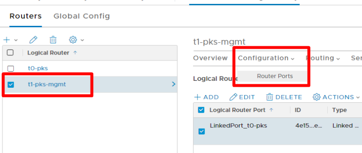
</details>

<details><summary>Screenshot 2.3.2</summary>
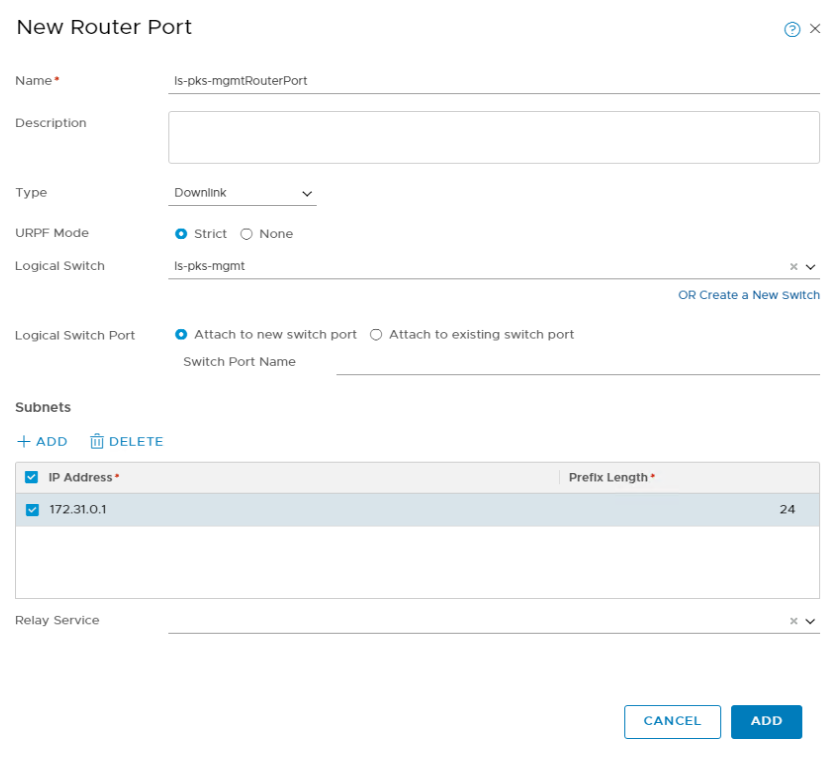
</details>
<br/>

2.4 From the `Advanced Networking & Security > Routers > t1-pks-mgmt` page, and on the `Routing` pulldown menu, select `Route Advertisement`, under `Router Advertisement` click `Edit` and configure the available options with the following parameters:

- Enable the following fields (Yes):
  - Status: Enabled
  - Advertise All Connected Routes: Yes
- Click `Save`

<details><summary>Screenshot 2.5.0</summary>
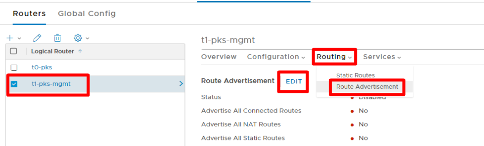
</details>

<details><summary>Screenshot 2.4.2</summary>
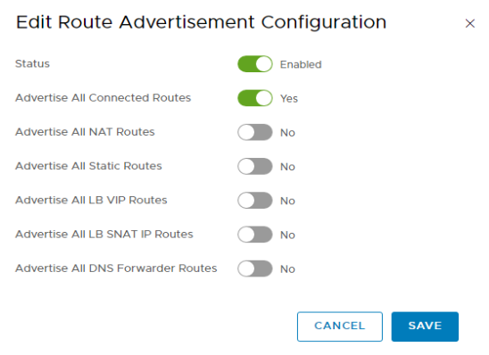
</details>
<br/>

2.5 To verify the T1 Router, from the `Advanced Networking & Security > Routers > t1-pks-mgmt` page, on the Overview page in the `Tier-0 Connection` section, verify that the `t0-pks` router is displayed

<details><summary>Screenshot 2.5</summary>
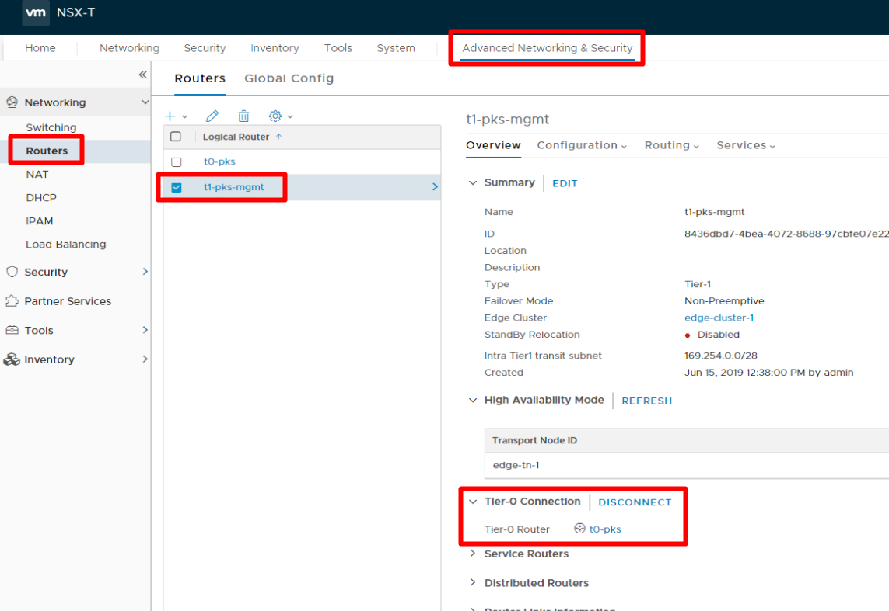
</details>
<br/>

## Step 3: Create NAT Rules for PKS Management and Compute Plane Operations

3.1 The PKS Management and Compute Plane Networks are deployed to private subnets in the standard Ninja topology (PKS also supports using routed subnets), this requires several NAT rules to be implemented for communications between these isolated private networks and any hosts not directly attached to the subnet, including vCenter and NSX Managers, ESXi Hosts, Jumpboxes & Management hosts. The following steps implement the standard NAT rules used in the Ninja lab environment to enable communications between the PKS Management/Compute Networks and the rest of the lab environment.

To Create a DNAT Rule to enable external access to PKS Management Plane VM's (BOSH Director, Ops Manager, PKS API, Harbor Container Registry), From the `Advanced Networking & Security > Routers` page, click on the `t0-pks` logical router to bring up its details. Click the `Services` Pulldown Menu and select `NAT`. In the NAT pane click `+ADD` and add a DNAT rule with the following parameters:

- On New Nat Rule Screen:
  - Action: `DNAT`
  - Destination IP: `10.40.14.2`
  - Translated IP: `172.31.0.2`
  - Click `ADD`
- On New Nat Rule Screen click `+ADD` and add another rule with the following parameters:
  - Action: `DNAT`
  - Destination IP: `10.40.14.3`
  - Translated IP: `172.31.0.3`
  - Click `ADD` 
- On New Nat Rule Screen click `+ADD` and add another rule with the following parameters:
  - Action: `DNAT`
  - Destination IP: `10.40.14.4`
  - Translated IP: `172.31.0.4`
  - Click `ADD`
- On New Nat Rule Screen click `+ADD` and add another rule with the following parameters:
  - Action: `DNAT`
  - Destination IP: `10.40.14.5`
  - Translated IP: `172.31.0.5`
  - Click `ADD`

<details><summary>Screenshot 3.1.1</summary>
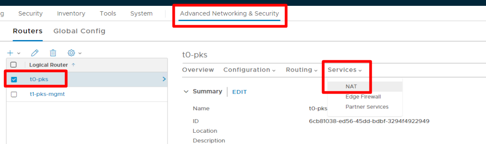
</details>

<details><summary>Screenshot 3.1.2</summary>
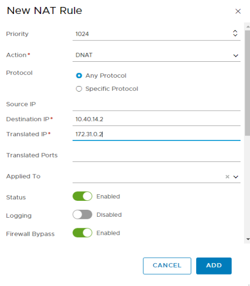
</details>

<details><summary>Screenshot 3.1.3</summary>
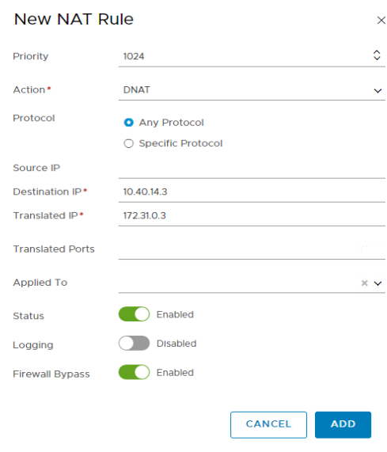
</details>

<details><summary>Screenshot 3.1.4</summary>
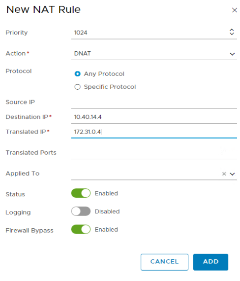
</details>

<details><summary>Screenshot 3.1.5</summary>
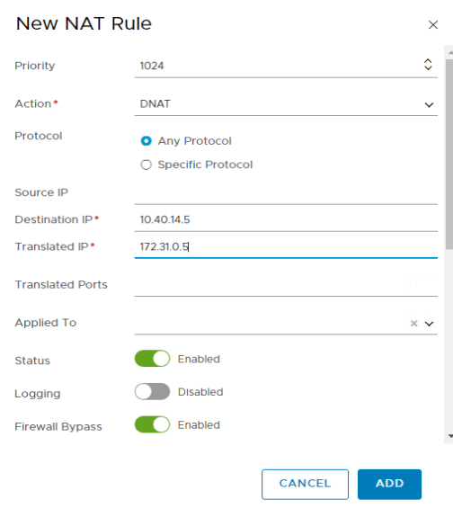
</details>
<br/>

3.4 Add **SNAT** rules to translate the PKS Management Subnets and the Pod and Node IP Blocks assigned to Kubernetes Clusters with valid external IP addresses to support outbound communications

- On New Nat Rule Screen for the `t0-pks` router, click `+ADD` and add another rule with the following parameters:
  - Priority: `1020`
  - Action: `SNAT`
  - Source IP: `172.31.0.2`
  - Translated IP: `10.40.14.2`
  - Click `ADD`
- On New Nat Rule Screen click `+ADD` and add another rule with the following parameters:
  - Priority: `1020`
  - Action: `SNAT`
  - Source IP: `172.31.0.3`
  - Translated IP: `10.40.14.3`
  - Click `ADD`
- On New Nat Rule Screen click `+ADD` and add another rule with the following parameters:
  - Priority: `1020`
  - Action: `SNAT`
  - Source IP: `172.31.0.4`
  - Translated IP: `10.40.14.4`
  - Click `ADD`
- On New Nat Rule Screen click `+ADD` and add another rule with the following parameters:
  - Priority: `1020`
  - Action: `SNAT`
  - Source IP: `172.31.0.5`
  - Translated IP: `10.40.14.5`
  - Click `ADD`
- On New Nat Rule Screen click `+ADD` and add another rule with the following parameters:
  - Action: `SNAT`
  - Source IP: `172.31.0.0/24`
  - Translated IP: `10.40.14.12`
  - Click `ADD`
- On New Nat Rule Screen click `+ADD` and add another rule with the following parameters:
  - Action: `SNAT`
  - Source IP: `172.15.0.0/24`
  - Translated IP: `10.40.14.35`
  - Click `ADD`
- On New Nat Rule Screen click `+ADD` and add another rule with the following parameters:
  - Action: `SNAT`
  - Source IP: `172.16.0.0/24`
  - Translated IP: `10.40.14.36`
  - Click `ADD`
- On New Nat Rule Screen click `+ADD` and add another rule with the following parameters:
  - Action: `SNAT`
  - Source IP: `172.16.1.0/24`
  - Translated IP: `10.40.14.37`
  - Click `ADD`
- On New Nat Rule Screen click `+ADD` and add another rule with the following parameters:
  - Action: `SNAT`
  - Source IP: `172.16.2.0/24`
  - Translated IP: `10.40.14.38`
  - Click `ADD`
- On New Nat Rule Screen click `+ADD` and add another rule with the following parameters:
  - Action: `SNAT`
  - Source IP: `172.16.3.0/24`
  - Translated IP: `10.40.14.39`
  - Click `ADD`
- On New Nat Rule Screen click `+ADD` and add another rule with the following parameters:
  - Action: `SNAT`
  - Source IP: `172.15.0.0/16`
  - Translated IP: `10.40.14.32`
  - Click `ADD`
- On New Nat Rule Screen click `+ADD` and add another rule with the following parameters:
  - Action: `SNAT`
  - Source IP: `172.16.0.0/16`
  - Translated IP: `10.40.14.40`
  - Click `ADD`


<details><summary>Screenshot 3.4</summary>
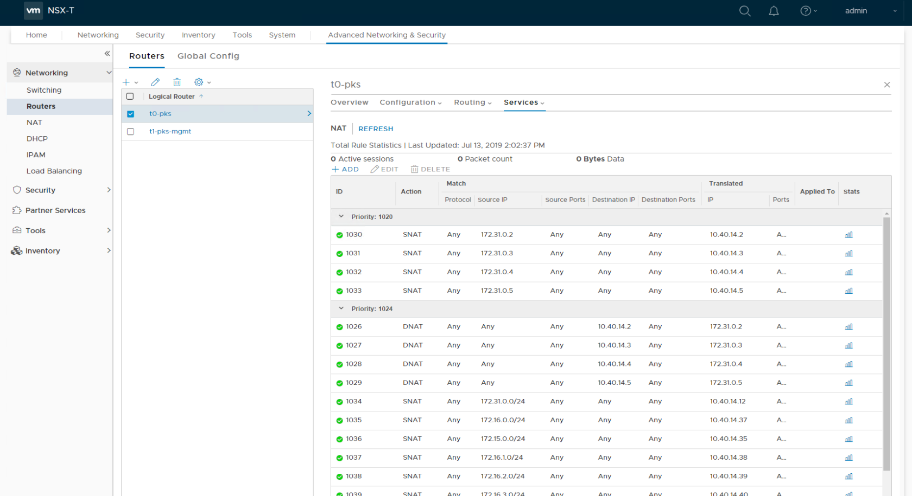
</details>
<br/>

## Step 4: Create IP Pools & Blocks needed for PKS

Explanation from the [Documentation]():

```text
Installing VMware Enterprise PKS on vSphere with NSX-T requires the creation of NSX IP blocks for Kubernetes node and pod networks, as well as a Floating IP Pool from which you can assign routable IP addresses to cluster resources.

Create separate NSX-T IP Blocks for the node networks and the pod networks. The subnets for both nodes and pods should have a size of 256 (/16). For more information, see Plan IP Blocks and Reserved IP Blocks.

NODE-IP-BLOCK is used by Enterprise PKS to assign address space to Kubernetes master and worker nodes when new clusters are deployed or a cluster increases its scale.
POD-IP-BLOCK is used by the NSX-T Container Plug-in (NCP) to assign address space to Kubernetes pods through the Container Networking Interface (CNI).

In addition, create a Floating IP Pool from which to assign routable IP addresses to components. This network provides your load balancing address space for each Kubernetes cluster created by Enterprise PKS. The network also provides IP addresses for Kubernetes API access and Kubernetes exposed services. For example, 10.172.2.0/24 provides 256 usable IPs. This network is used when creating the virtual IP pools, or when the services are deployed. You enter this network in the Floating IP Pool ID field in the Networking pane of the Enterprise PKS tile.

```

 4.1 To Create the Pods & Nodes IP Blocks, from the NSX Manager UI Homepage, Navigate to `Advanced Networking & Security > IPAM` and click `+ADD` to add an IP block with the following values:

- Name: `ip-block-nodes-deployments`
- CIDR: `172.15.0.0/16`
- Click `ADD`
- Click `+ADD` to add an additional IP Address Block
- Name: `ip-block-pods-deployments`
- CIDR: `172.16.0.0/16`
- Click `ADD`

<details><summary>Screenshot 4.1.1</summary>
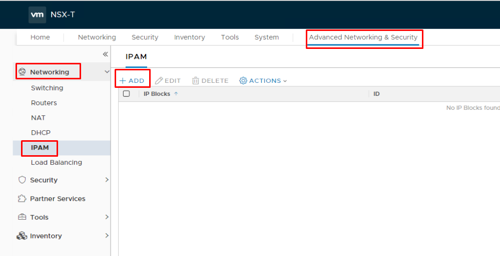
</details>

<details><summary>Screenshot 4.1.2</summary>
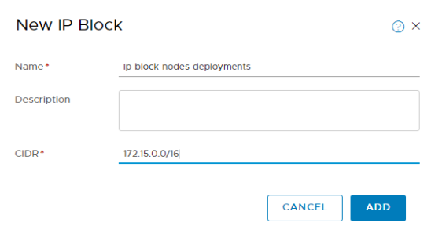
</details>

<details><summary>Screenshot 4.1.3</summary>
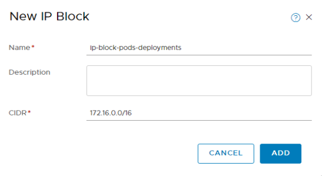
</details>
<br/>

4.2 To create the floating IP Pool for Kubernetes Load Balancer Virtual IP Addresses, in the NSX Manager UI navigate to `Advanced Networking & Security > Inventory > Groups` page and click on the `IP Pools` tab. Click `+ADD` and add an IP Pool with the following parameters:

- Name: `ip-pool-vips`
- Click `Add` under Subnets
- IP Range: `10.40.14.34-10.40.14.62`
- Gateway: `10.40.14.33`
- CIDR: `10.40.14.32/27`
- DNS Servers: `192.168.110.10`
- DNS Suffix: `corp.local`
- Click **Add**

<details><summary>Screenshot 4.2.1</summary>
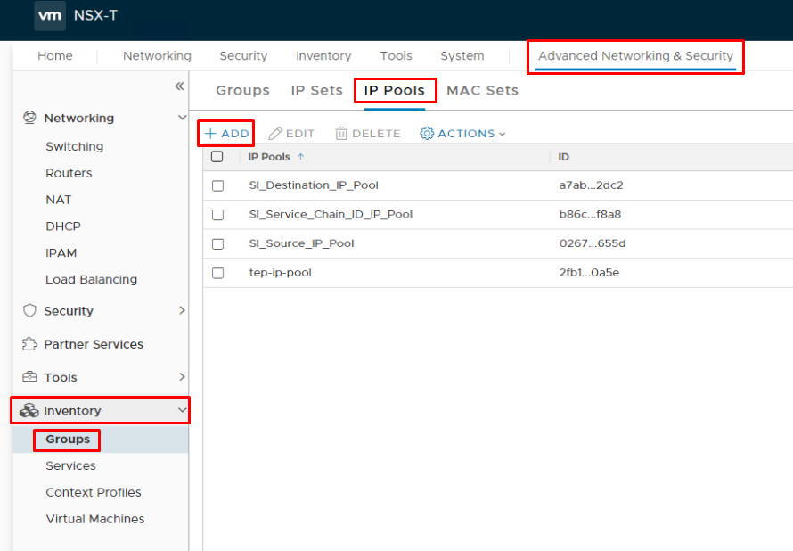
</details>

<details><summary>Screenshot 4.2.2</summary>
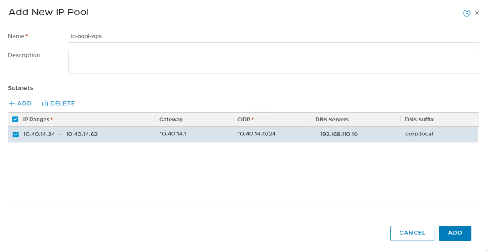
</details>
<br/>

------------------


**You have now completed the NSX-T Configuration for PKS lab. There are some additional NSX-T related configurations for PKS that will be need to be made when setting up the PKS Control Plane, and those are detailed in the PKS Install Part 1 Lab Guide**
