# NSX-T 2.5 Manual Installation

For NSXT 2.4 Manual Installation, please see the Pks1.4 Branch

## Overview

The following installation guide documents the implementation of a functional NSX-T 2.5 Installation. This implementation uses variables that function in the PKS-Ninja Topology 1 (T1) lab environment, using the PKS-Ninja-T1-Baseline template. Anyone is welcome to build a similar lab environment and follow along with the lab exercises, but please note you will need to replace any variables such as IP addresses and FQDNs and replace them with the appropriate values for your lab environment.

The steps provided in this lab guide are intended for a lab implementation and do not necessarily align with best practices for production implementiations. While the instructions provided in this lab guide did work for the author in their lab environment, VMware and/or any contributors to this Guide provide no assurance, warranty or support for any content provided in this guide.

## Prerequisites

- Please see [Getting Access to a PKS Ninja Lab Environment](https://github.com/CNA-Tech/PKS-Ninja/tree/Pks1.6/Courses/GetLabAccess-LA8528) to learn about how to access or build a compatible lab environment

## Installation Notes

Anyone who implements any software used in this lab must provide their own licensing and ensure that their use of all software is in accordance with the software's licensing. This guide provides no access to any software licenses.

For those needing access to VMware licensing for lab and educational purposes, we recommend contacting your VMware account team. Also, the [VMware User Group's VMUG Advantage Program](https://www.vmug.com/Join/VMUG-Advantage-Membership) provides a low-cost method of gaining access to VMware licenses for evaluation purposes.

This lab follows the standard documentation, which includes additional details and explanations: [NSX-T 2.4 Installation Guide](https://docs.vmware.com/en/VMware-NSX-T-Data-Center/2.5/installation/GUID-3E0C4CEC-D593-4395-84C4-150CD6285963.html)

### Overview of Tasks Covered in Lab 1

- [NSX-T 2.5 Manual Installation](#nsx-t-25-manual-installation)
  - [Overview](#overview)
  - [Prerequisites](#prerequisites)
  - [Installation Notes](#installation-notes)
    - [Overview of Tasks Covered in Lab 1](#overview-of-tasks-covered-in-lab-1)
  - [Step 1: Deploy NSXT Manager using OVF Install Wizard](#step-1-deploy-nsxt-manager-using-ovf-install-wizard)
  - [Step 2: Add NSX Compute Manager](#step-2-add-nsx-compute-manager)
  - [Step 3: Add an Edge Node, Transport Zones and Uplink Profiles with the NSX-T Guided Preparation Workflow](#step-3-add-an-edge-node-transport-zones-and-uplink-profiles-with-the-nsx-t-guided-preparation-workflow)
  - [Step 4: Prepare and Configure ESXi Hosts as NSX-T Transport Nodes](#step-4-prepare-and-configure-esxi-hosts-as-nsx-t-transport-nodes)

-----------------------

## Step 1:  Deploy NSXT Manager using OVF Install Wizard

Note: Prior to Step 1, you will need to download the NSX-T 2.5 Installation Files and binaries. The Installation binaries are not included in the lab, users will need to provide their own access and licensing to download and use NSX-T 2.5. 

1.0 In the Main Console, the vSphere web client is already set up in Chrome. Open up Chrome to get to the vSphere login screen. You can log in using the credentials you were given for the lab,  and you may login by clicking the **Use Windows session authentication** checkbox.

1.1 In the vSphere client, From the Hosts and Clusters view, right click on the RegionA01-MGMT01 Cluster and select `Deploy OVF Template'

Screenshot 1.1

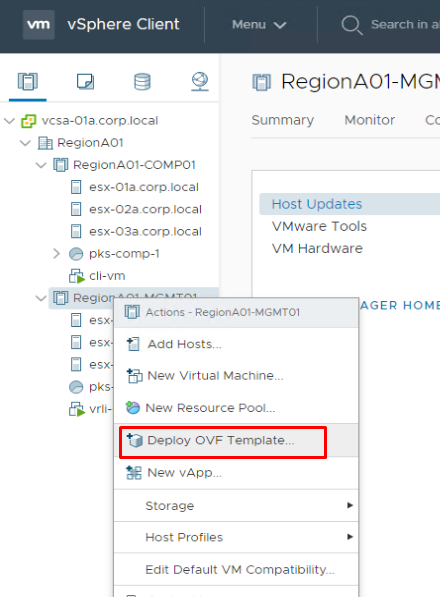

 

1.2 On the `Select an OVF Template` step, select `Local File` and Navigate to the NSXT Manager OVA file, the filename should start with 'nsx-unified-appliance`. In the reference lab, this is located on the 'E:/Downloads' Directory

Screenshot 1.2

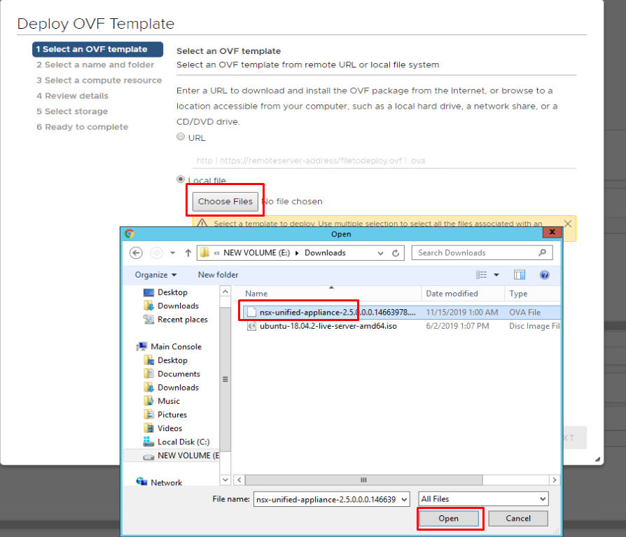

 

1.3 On the `Select a name and folder` step, use the name `nsxmgr01a-1` and select `RegionA01` Datacenter as the location

Screenshot 1.3

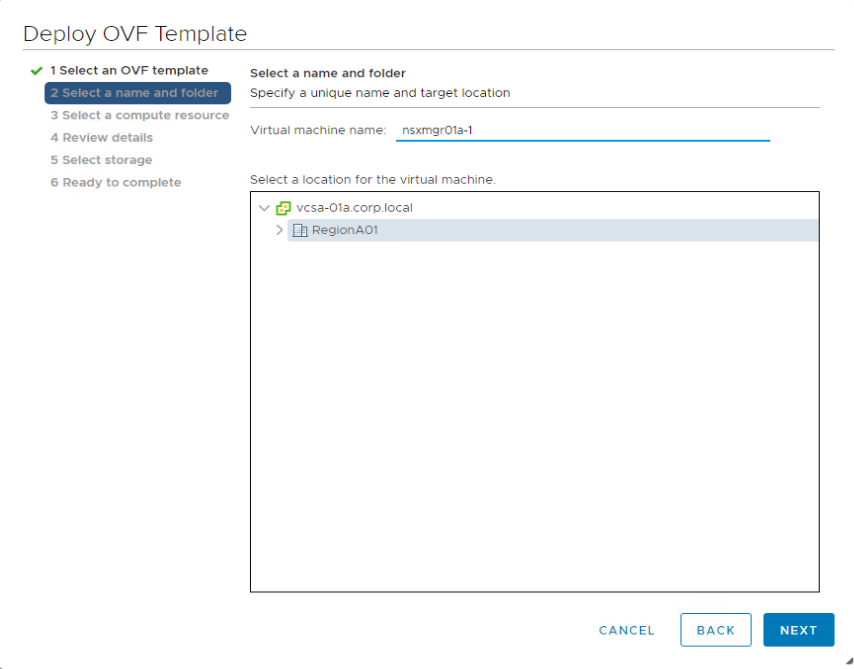

 

1.4 On the `Select a compute resource` step, select `RegionA01-MGMT01` and click `Next`

Screenshot 1.4

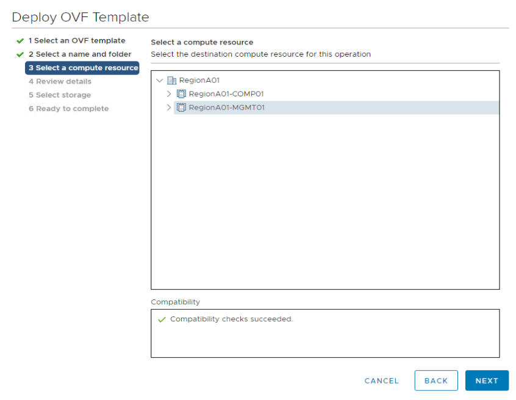

 

1.5 On the `Review Details` step, verify details and click `Next`

Screenshot 1.5

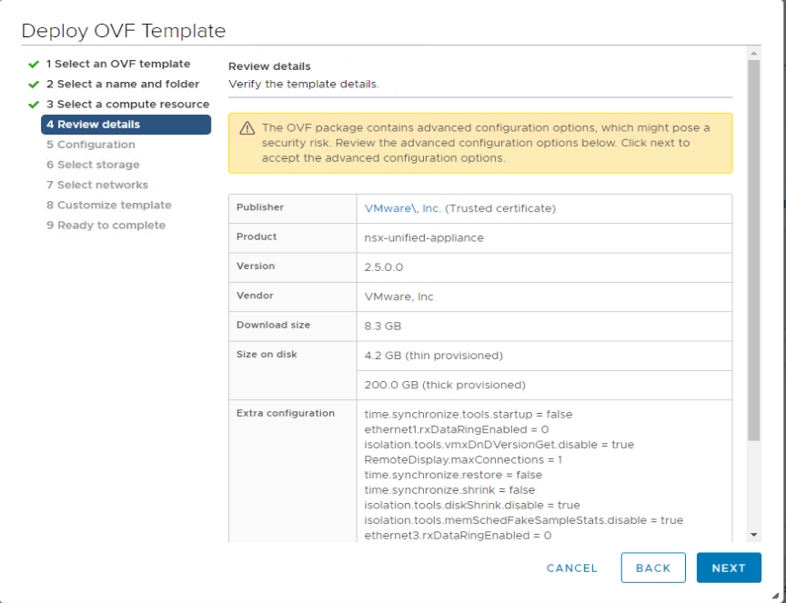

 

1.6 On the `Configuration` step, select a `Small` Configuration and click `Next`

Screenshot 1.6

 

1.7 On the `Select Storage` step, **first** select the `RegionA01-ISCSI02-COMP01` datastore and then set the virtual disk format to `Thin Provision`.

Note: When you select the datastore, the UI resets the value for the virtual disk format back to thick provision, so its best to select the datastore first and then set the virtual disk format.

Screenshot 1.7

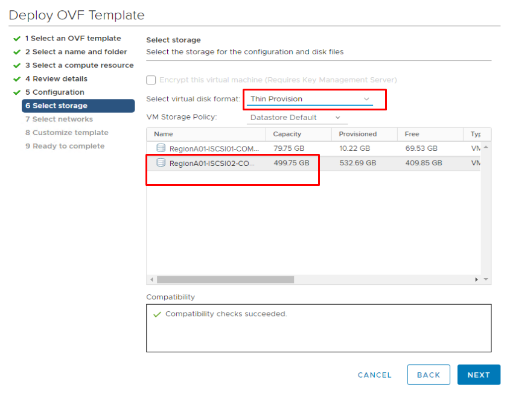

 

1.8 On the `Select Networks` step, set the Destination Network to `VM-RegionA01-vDS-MGMT` and click `Next`

Screenshot 1.8

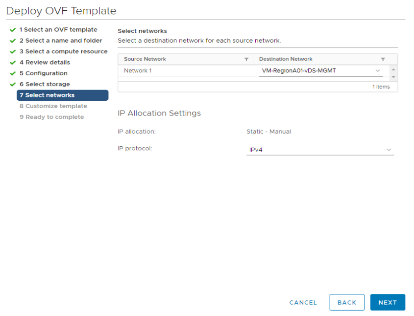

 

1.9 On the `Customize Template` step, enter the following variables:

- Application
  - System Root User Password: VMware1!VMware1!
  - CLI Admin User Password: VMware1!VMware1!
  - CLI Audit User Password: VMware1!VMware1!
- Network Properties
  - Hostname: nsxmgr01a-1
  - Rolename: NSX Manager
  - Default Gateway: 192.168.110.1
  - Management Network IPv4 Address: 192.168.110.31
  - Management Network Netmask: 255.255.255.0
- DNS
  - DNS Server List: 192.168.110.10
  - Domain Search List: corp.local
- Services Configuration
  - NTP Server: 192.168.100.1
  - Enable SSH: True
  - Allow Root SSH Logins: True
- All other options were left as default values

Screenshot 1.9

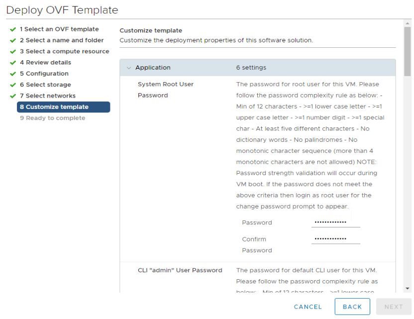

 

1.10 On the Ready to Complete screen, click `Finish` to complete the Deploy OVF Template Wizard

Screenshot 1.10

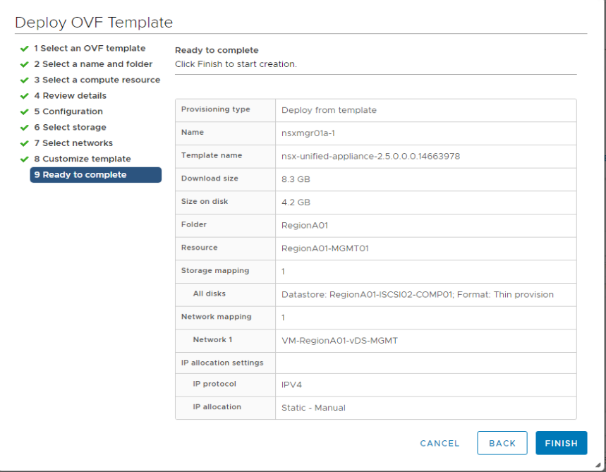

 

1.11 In the vSphere web client go to the task console and verify that the Status for Deploy OVF Template is "Completed" before proceeding
 

Screenshot 1.11

 

1.12 In the vSphere web client power on the nsxmgr01a-1 VM, wait a few minutes for NSX Manager to fully boot up before proceeding to the next step

NOTE: If the option to power on the nsxmgr-01a VM is not available, log out and then log back in to the vSphere web client

Screenshot 1.12

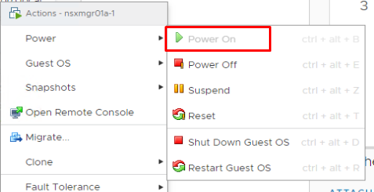

 

1.13 Open a web browser connection to NSX Manager, for example:

[https://nsxmgr01a-1.corp.local/login.jsp](https://nsxmgr01a-1.corp.local/login.jsp)

Login as:

- User: admin
- Password: VMware1!VMware1!

_NOTE: On your first login, you will be prompted to accept the EULA. Accept EULA and opt out of VMware Customer Experience program._

Screenshot 1.14

 

1.15 In the NSX Manager UI, navigate to `System > Appliances`. Observe the value for `Virtual IP` is not set, click `Edit` and set the Virtual IP address to `192.168.110.42`

The virtual IP address provides a single ip address that can be used to connect to a cluster of NSX manager appliances providing high availability. Because the lab environment is highly oversubscribed, you will only create a single nsx manager appliance, however the steps in this guide still assign a virtual IP address to configure NSX-T as you would when using clustered NSX Manager nodes.

Screenshot 1.15.1

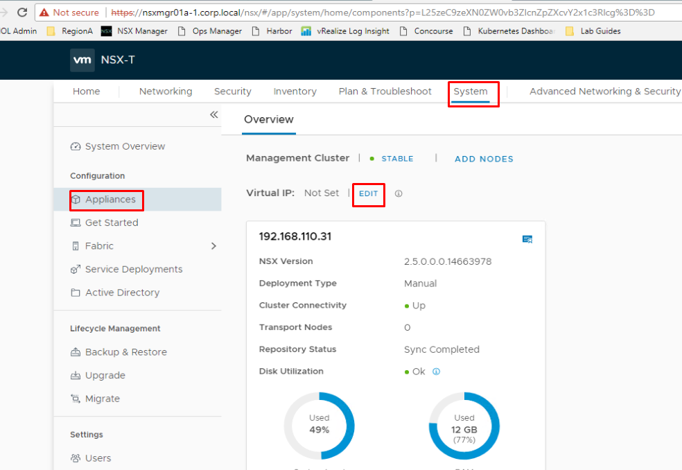

 

Screenshot 1.15.2

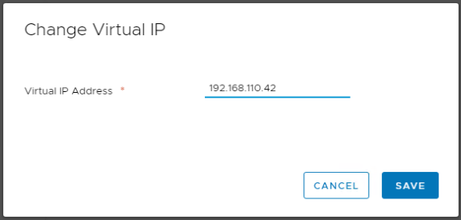

 

Screenshot 1.15.3

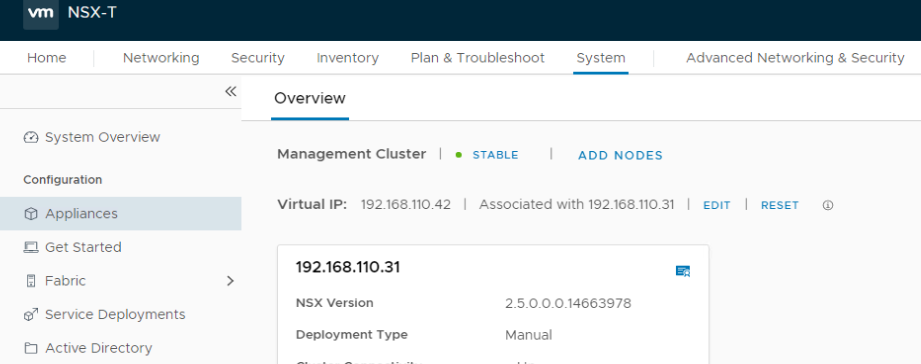

 

1.16 In your web browser tab connected to NSX-T Manager, change the URL to [https://nsxmgr-01a.corp.local/login.jsp](https://nsxmgr-01a.corp.local/login.jsp) and reconnect to NSX Manager using this new URL. 

The URL `nsxmgr-01a.corp.local` is configured to resolve to `192.168.110.42` in the labs DNS server. Note that this `192.168.110.42` is the same IP address that you assigned as the NSX Manager Virtual IP address in the last step. By changing your URL and reconnecting to NSX Manager, you validate that the Virtual IP address is functioning as intended. 

Going forward unless otherwise noted, you should use the NSX-T Manager virtual IP address or its associated hostname `nsxmgr-01a.corp.local` both when you connect to NSX manager, or when you configure any machine-to-machine connections for NSX Manager. 

Screenshot 1.16

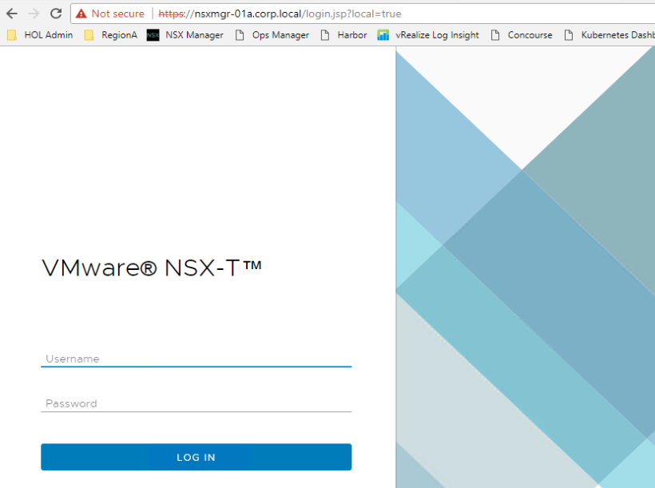

 

## Step 2: Add NSX Compute Manager

In this step, you create a connection between the NSX manager and your vCenter. This enables NSX manager to deploy VIBs to the hosts, controller and edge VMs, etc.

 2.1 In your web browser connection to NSX-T Manager, click on the `System` tab and then on the left navigation bar Click `Fabric`, and then click `Compute Managers`

Screenshot 2.1

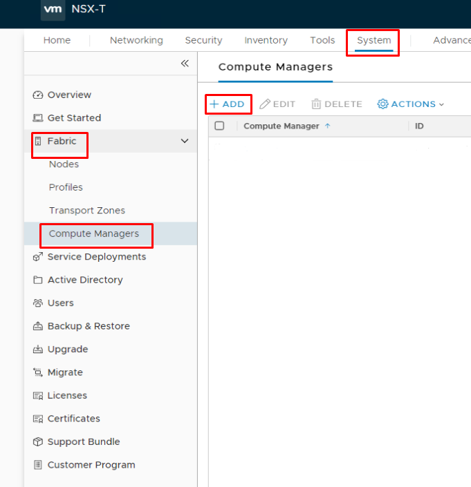

 

 2.2 Click on **Add** and Configure the New Compute Manager form with following values:

- Name: `vcsa-01a`
- Domain Name/IP Address: `vcsa-01a.corp.local`
- Type: `vCenter`
- Username: `administrator@corp.local`
- Password: `VMware1!`
- Clcik **Add**
- Click **Add** again to accept the vCenter certificate thumbprint

_NOTE: in a production implementation, you would first copy the vCenter thumbprint and then provide it in the form to properly authenticate the intial connection._

Screenshot 2.2.1

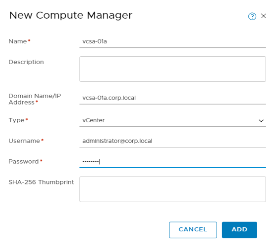

Screenshot 2.2.2

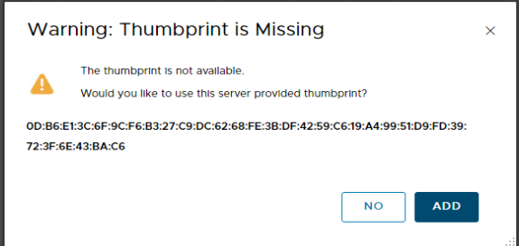

 

 2.3 Verify the Compute Manager is `Registered` and `Up`. If needed, click **Refresh** in the lower-left hand corner to refresh the display.

Screenshot 2.3.1

Screenshot 2.3.2

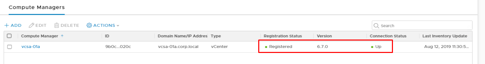

 

## Step 3: Add an Edge Node, Transport Zones and Uplink Profiles with the NSX-T Guided Preparation Workflow

 3.1 From the NSX-T Manager UI navigate to the `Advanced Networking & Security > Inventory > Groups > IP Pools` page and click `+ADD` 

Screenshot 3.1

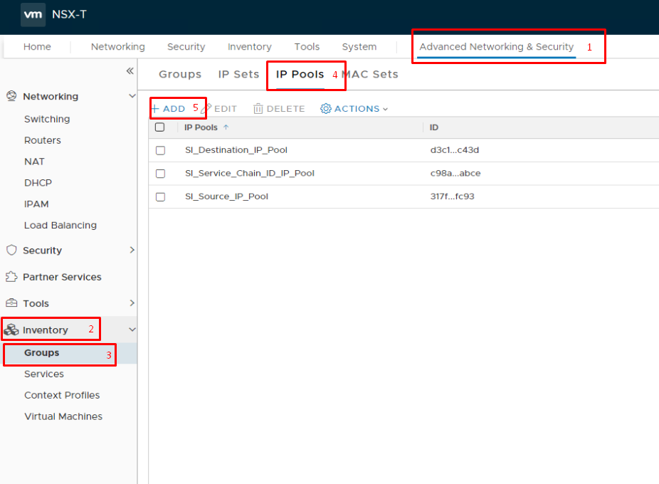

 

 3.2 On the `Add IP Pool` screen, enter the following values:

- Name: `tep-ip-pool`
- Click `Add` under Subnets
- IP Range: `192.168.130.51-192.168.130.75`
- Gateway: `192.168.130.1`
- CIDR: `192.168.130.0/24`
- DNS Servers:  `192.168.110.10`
- DNS Suffix: `Corp.local`
- Click **Add**

Screenshot 3.2

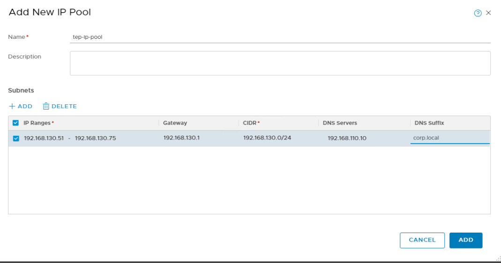

 

 3.3 From NSX-T Manager UI, click on the `System` tab, then click `Get Started` in the left navigation bar, and then click `Setup Transport Nodes`

Screenshot 3.3

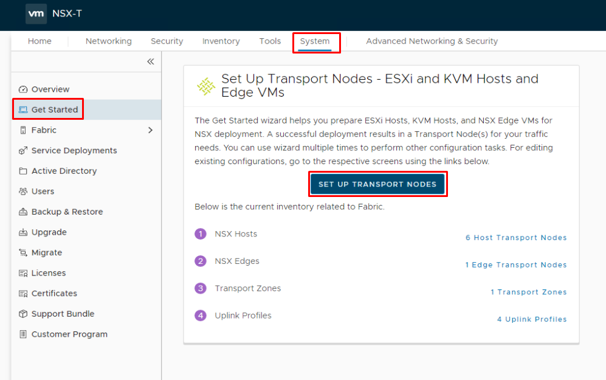

 

 3.4 On the `Select Node Type` screen, select `NSX Edge VM` and click `Next`

Screenshot 3.4

 

 3.5 On the `Select NSX Edge` Screen, click `Add New Edge`

Screenshot 3.5

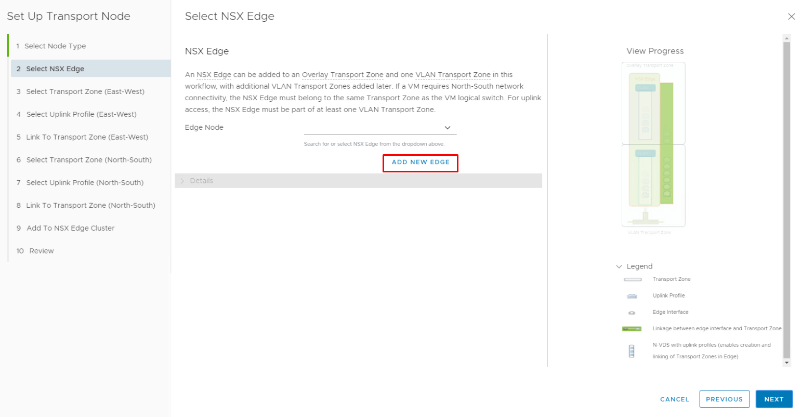

 

 3.6 Complete the Add Edge VM workflow with the following values:

 - Name: nsxedge-1
 - FQDN: nsxedge-1.corp.local   
 - Form Factor: Large
 - Click Next
 - CLI Password: VMware1!VMware1!
 - System Root Password: VMware1!VMware1!
 - Click Next
 - Compute Manager: vcsa-01a
 - Cluster: RegionA01-MGMT01
 - Datastore: RegionA01-ISCSI02-COMP01
 - Click Next
 - Management: VM-RegionA01-vDS-MGMT
 - Select "Static" (not DHCP)
 - Management IP: 192.168.110.91/24
 - Gateway IP: 192.168.110.1
 - fp-eth0: Uplink-RegionA01-vDS-MGMT
 - fp-eth1: Transport-RegionA01-vDS-MGMT
 - fp-eth2: VM-RegionA01-vDS-MGMT
 - Search Domain Names: corp.local
 - DNS Servers: 192.168.110.10
 - NTP Servers: 192.168.100.1
 - Click Finish

Screenshot 3.6.1

Screenshot 3.6.2

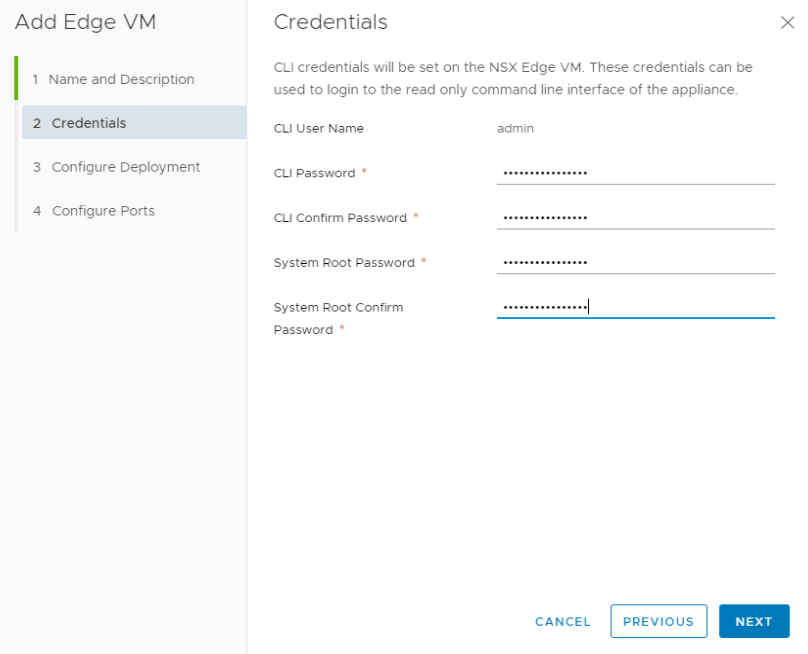

Screenshot 3.6.3

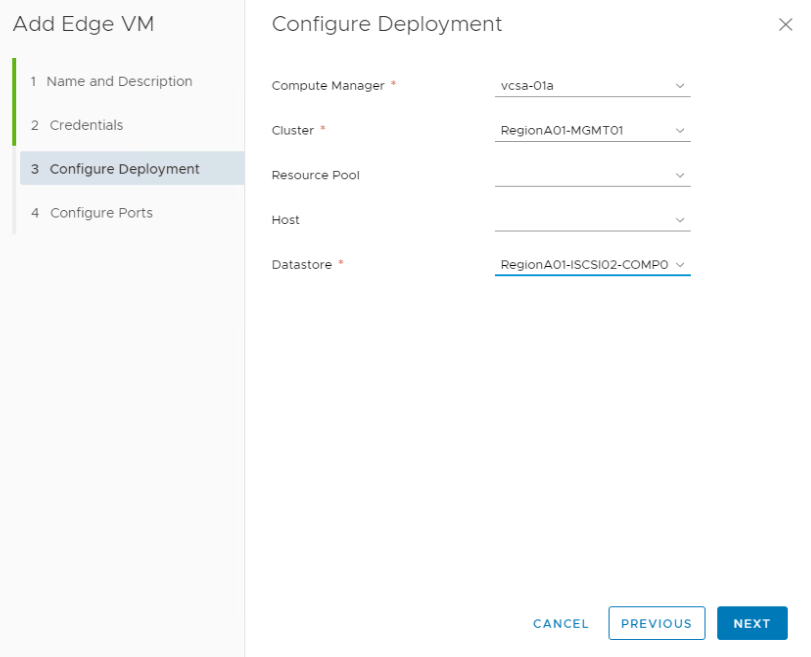

Screenshot 3.6.4

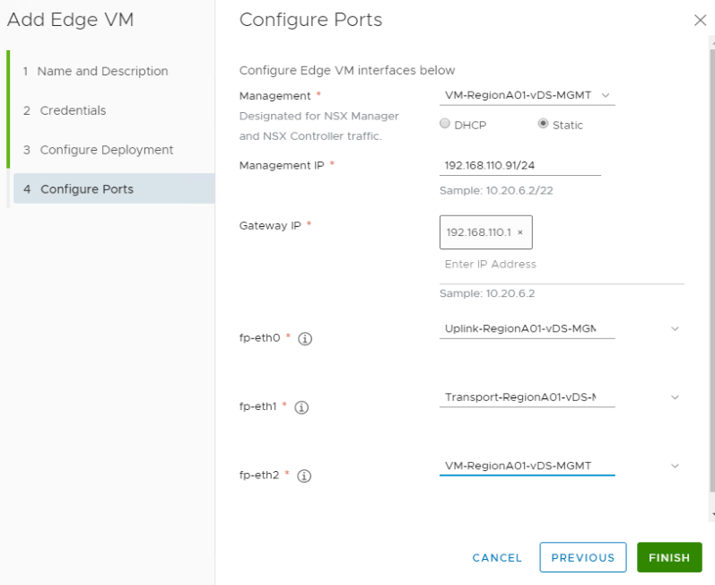

 

 3.7 The Wizard will deploy and attempt to power on the edge VM (This will take several minutes), but it will fail as there is no host with the capacity to run the large edge in the lab. 
 
 Log into the vCenter web ui, review the tasks pane to check the status of the edge VM deployment and ensure the edge VM is finished deploying, wait as needed, and verify you can see the error message indicating that vCenter could not power on the edge vm. 

Navigate to the `Hosts and Clusters` view, select `nsxedge-1`. From the actions menu for `nsxedge-1` select `Edit Settings`.

Set the CPU count to `4`, then expand the `Memory` section, **uncheck** the box for `Reserve all guest memory (All Locked)`, set the `Reservation` value to `0 MB` and click `OK`

Screenshot 3.7.1

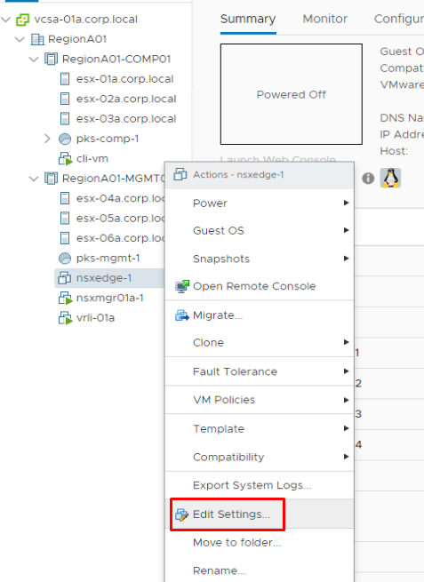

Screenshot 3.7.2

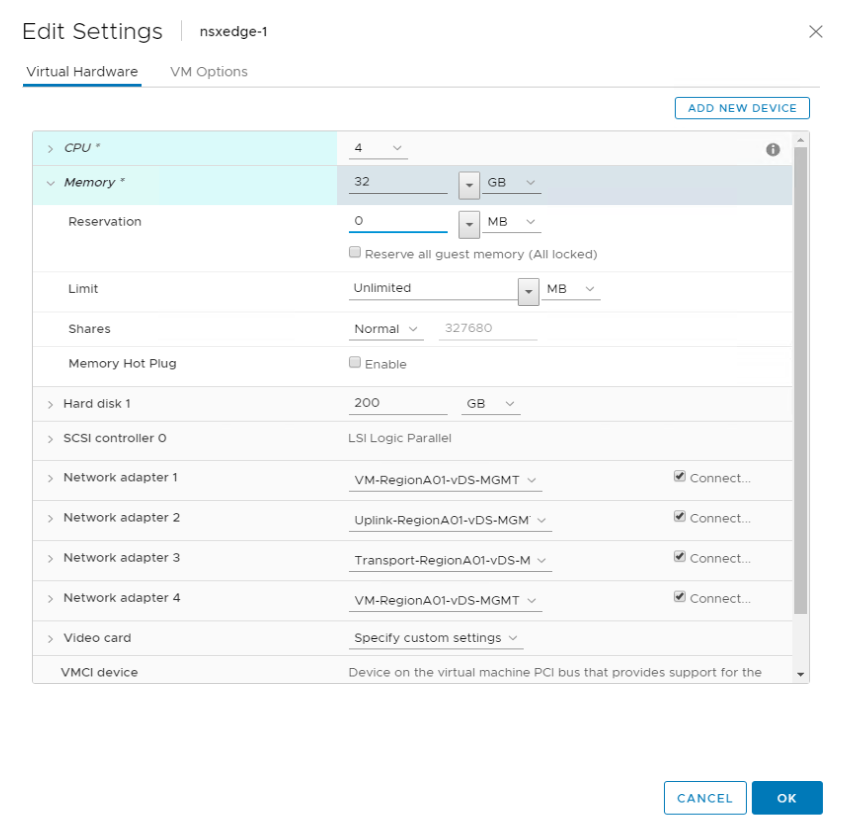

 

After making the changes to the `nsxedge-1` VM, power the VM on via the vCenter UI.

 3.8 Return to the NSX UI and wait for the wizard to recognize the NSX Edge VM. This may take up to ~15 minutes, and you may need to refresh your connection to NSX Manager, if so you can use the same steps as above to get back to the `Setup Transport Nodes ` wizard. 
 
 On the `Select NSX Edge` screen select `nsxedge-1` from the `Edge Node` Pulldown Menu, ensure the `Deployment Status` is `Node Ready`,  and click `Next` 

Screenshot 3.8

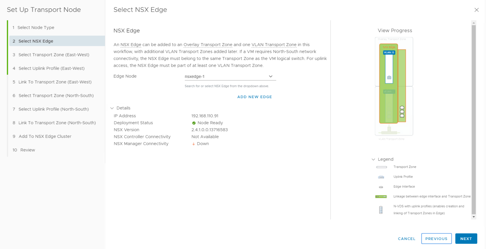

 

 3.9 On the `Select Transport Zone East-West` Screen, select `Create Overlay Transport Zone`

Screenshot 3.9

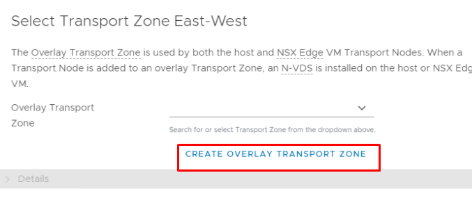

 

 3.10 In the `Add Transport Zone` workflow, enter the following values:

- Name: `overlay-tz`
- N-VDS Name: `hostswitch-overlay`
- Traffic Type: `Overlay`
- Click **Add** 

Screenshot 3.10

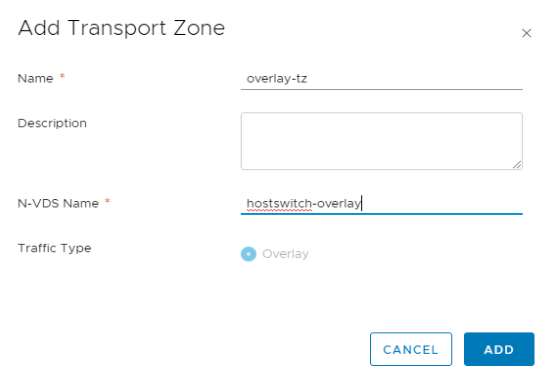

 

 3.11 On the `Select Transport Zone East-West` screen, select `overlay-tz` from the `Overlay Transport Zone` pulldown menu and click `Next` 

Screenshot 3.11

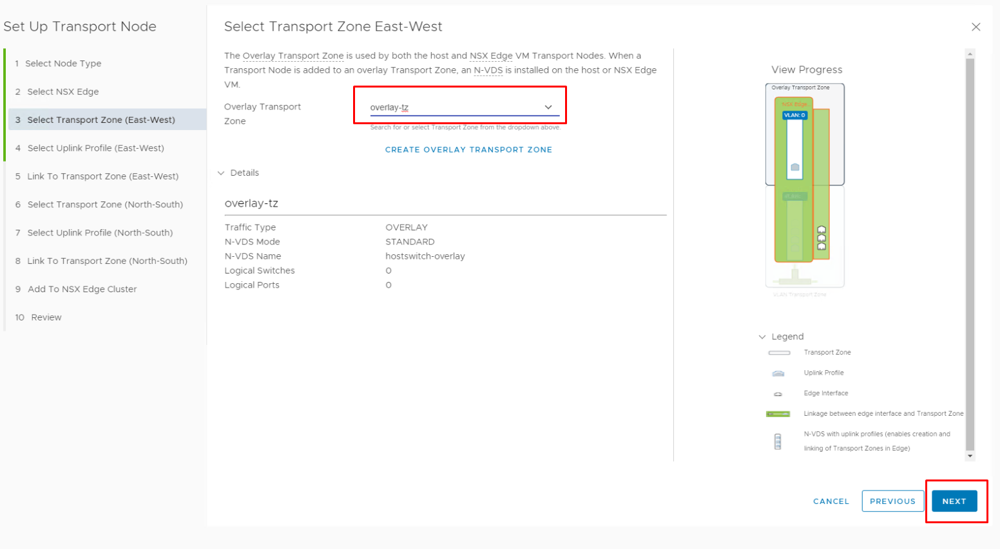

 

 3.12 On the `Select Uplink Profile East-West` screen, click the `Select Uplink Profile` pulldown menu and select the `nsx-edge-single-nic-uplink-profile` and click `Next`

Screenshot 3.12

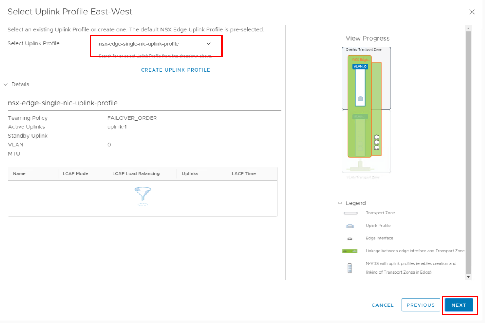

 

 3.13 On the `Link to Transport Zone East-West` screen for `Assignment IP Address` select `Use IP Pool` and select `tep-ip-pool`

Screenshot 3.13

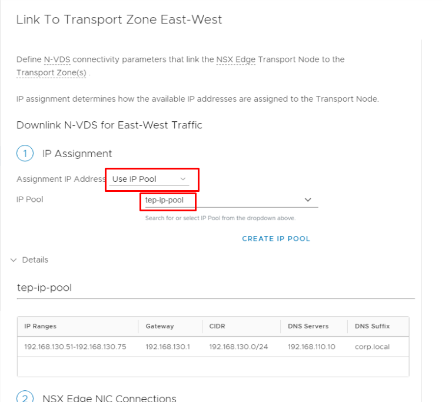

 

 3.14 On the `Link to Transport Zone East-West` screen in the `NSX Edge NIC Connections` section, set the value for `fp-eth1` to `uplink-1` and click `Next`

Screenshot 3.14

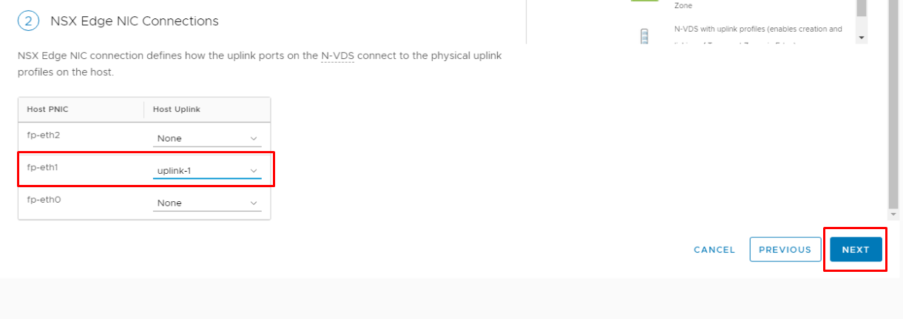

 

 3.15 On the `Select Transport Zone North-South` screen, click `Create VLAN Transport Zone`

Screenshot 3.15

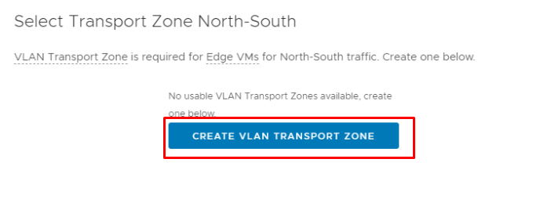

 

 3.16 On the `Add Transport Zone` screen, add a transport zone with the following parameters:

 - Name: vlan-tz
 - N-VDS Name: hostswitch-vlan
 - Traffic Type: VLAN
 - Click **Add**

Screenshot 3.16

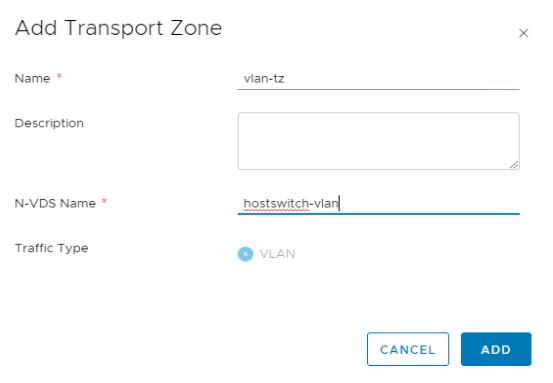

 

 3.17 On the `Select Transport Zone North-South` screen, select `vlan-tz` from the pulldown menu for `VLAN Transport Zone` and click `Next`

Screenshot 3.17

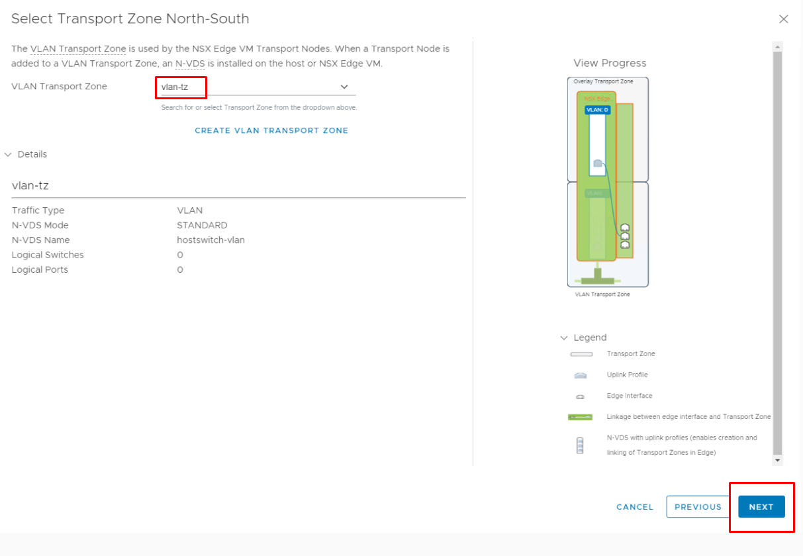

 

 3.18 On the `Select Uplink Profile North-South` screen, select `nsx-edge-single-nic-uplink-profile` from the `Select Uplink Profile` pulldown menu and click `Next`

Screenshot 3.18

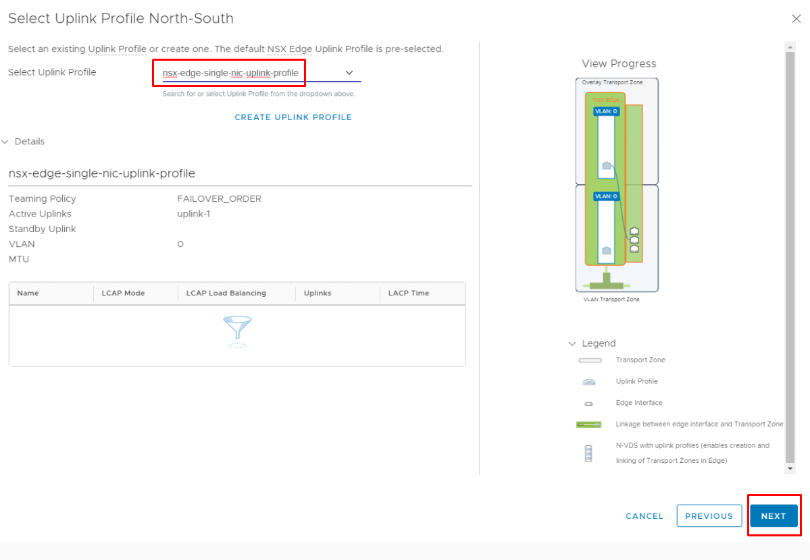

 

 3.19 On the `Link To Transport Zone North-South` screen, tin the `NSX Edge NIC Connections` section, set the value for `fp-eth0` to `uplink-1` and click `Next`

Screenshot 3.19

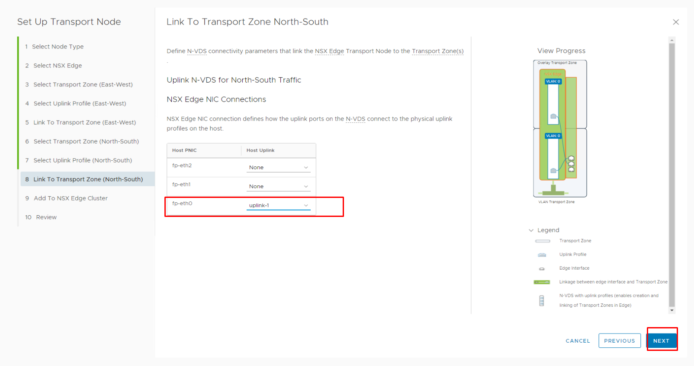

 

 3.20 On the `Add To NSX Edge Cluster` screen, select `Add To New NSX Edge Cluster (system created)` field, set the `NSX Edge Cluster Name` value to `edge-cluster-1` and click `Next`

Screenshot 3.20

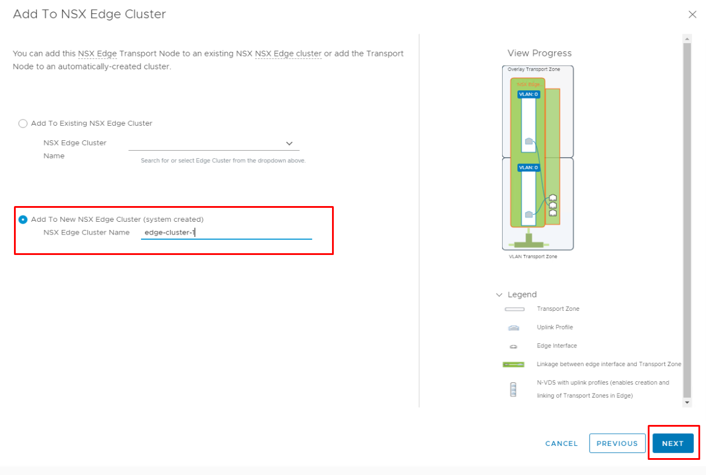

 

 3.21 On the `Review` screen, set the `Transport Node Name` to `edge-tn-1` and click `Finish`

Screenshot 3.21

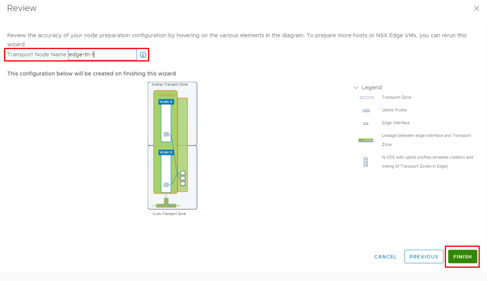

 

 3.22 On the `System` tab in NSX Manager UI, In the left navigation bar expand the `Fabric` section and select `Nodes`. Select the `Edge Transport Nodes` tab, verify that `edge-tn-1` has a `Configuration State` of `Success`, a `Node Status` of `Up`, and is a member of `edge-cluster-1`

Screenshot 3.22

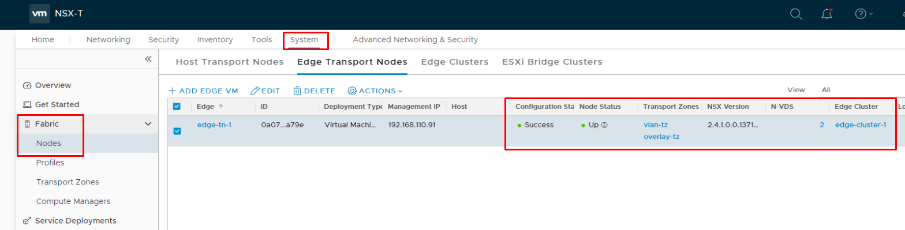

 

## Step 4: Prepare and Configure ESXi Hosts as NSX-T Transport Nodes

To prepare hosts for NSX-T,  NSX-T Manager will deploy and install NSX VIBs (i.e.kernel modues), configure the NSX tunnel endpoints, which enables host participation in the N-VDS overlay fabric.

 4.1 From the NSX Manager UI go to the `System > Get Started` page and click `SET UP TRANSPORT NODES` 

Screenshot 4.1

 

 4.2 On the `Select Node Type` screen select `Host Cluster` and click `Next`

Screenshot 4.2

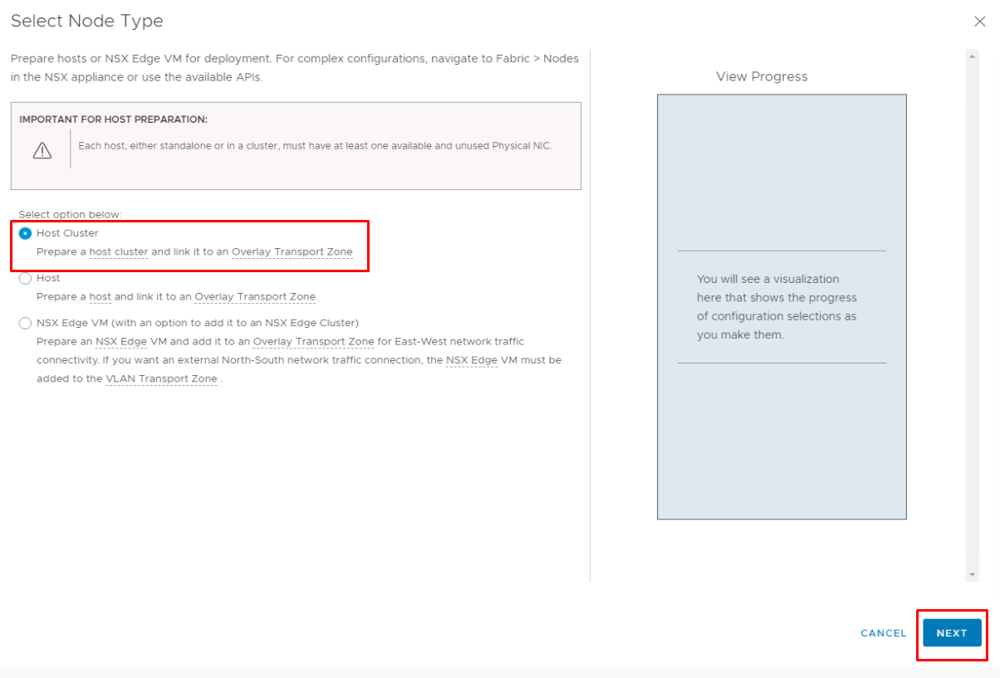

 

 4.3 On the `Select Host Cluster` Screen, set the value for `Host Cluster` to `RegionA01-COMP01`, when you make this selection, the page will prompt you to `Confirm Installation`, click `Install`. Do not proceed until the status in the `NSX` column for `esx-01a`, `esx-02a` and `esx-03a` is `NSX Installed`, and that `NSX Manager Connectivity` is `Up` for each host as shown in the screenshots below.

Screenshot 4.3.1

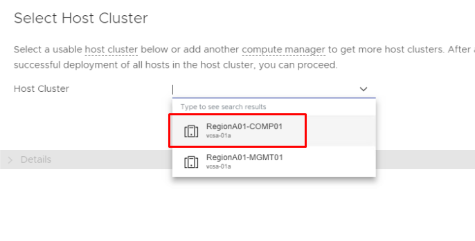

Screenshot 4.3.2

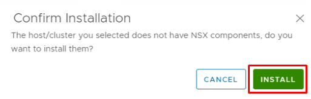

Screenshot 4.3.3

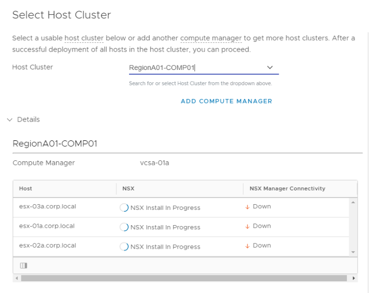

Screenshot 4.3.4

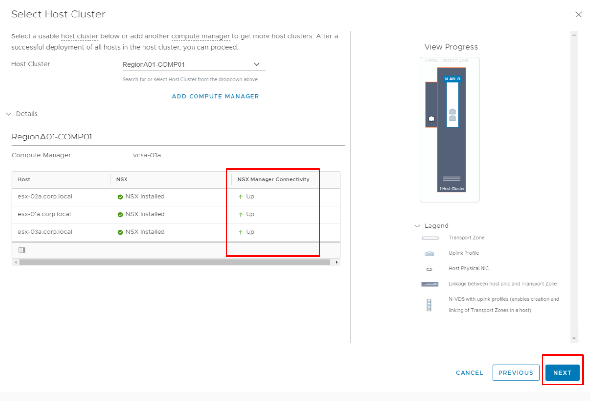

 

 4.4 On the `Select Transport Zone East-West` screen set the value for `Overlay Transport Zone` to `overlay-tz` and click `Next`

Screenshot 4.4

 

 4.5 On the `Select Uplink Profile East-West` screen, set the value for `Select Uplink Profile` to `nsx-default-uplink-hostswitch-profile` and click `Next`

Screenshot 4.5

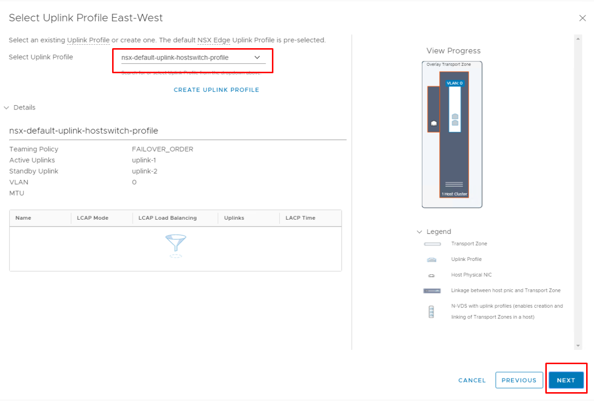

 

 4.6 On the `Link to Transport Zone East-West` screen, set the value for `Assignment IP Address` to `Use IP Pool` and set the value for `IP Pool` to `tep-ip-pool`

Screenshot 4.6

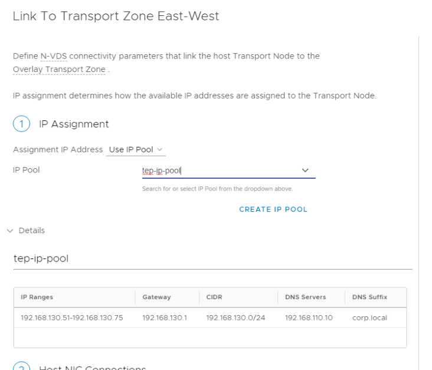

 

 4.7 On the `Link to Transport Zone East-West` screen, in the `Host NIC Connections` section, set the value for `vmnic1` to `uplink-1` and click `Next`

Screenshot 4.7

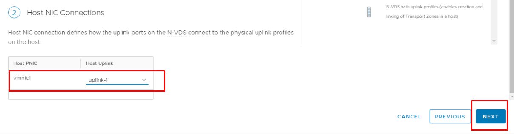

 

 4.8 On the `Review` screen, click `Finish`

Screenshot 4.8

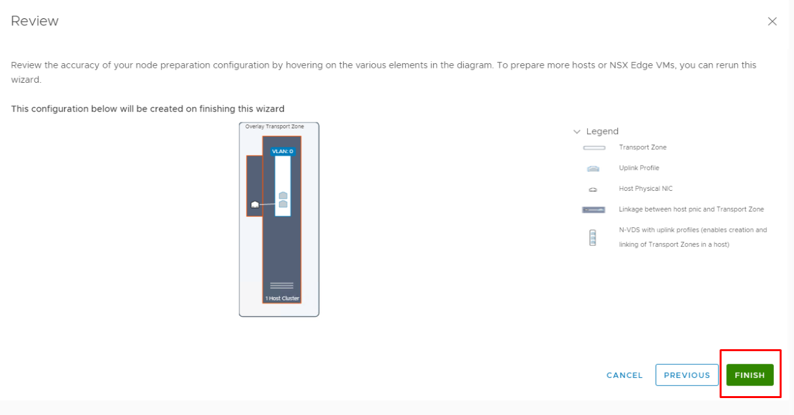

 

 4.9 From the NSX Manager UI go to the `System > Get Started` page and click `SET UP TRANSPORT NODES` 

Screenshot 4.9

 

 4.10 On the `Select Node Type` screen select `Host Cluster` and click `Next`

Screenshot 4.10

 

 4.11 On the `Select Host Cluster` Screen, set the value for `Host Cluster` to `RegionA01-MGMT01`, when you make this selection, the page will prompt you to `Confirm Installation`, click `Install`. Do not proceed until the status in the `NSX` column for `esx-04a`, `esx-05a` and `esx-06a` is `NSX Installed`, and that `NSX Manager Connectivity` is `Up` for each host as shown in the screenshots below.

Screenshot 4.11.1

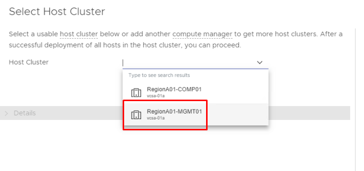

Screenshot 4.11.2

Screenshot 4.11.3

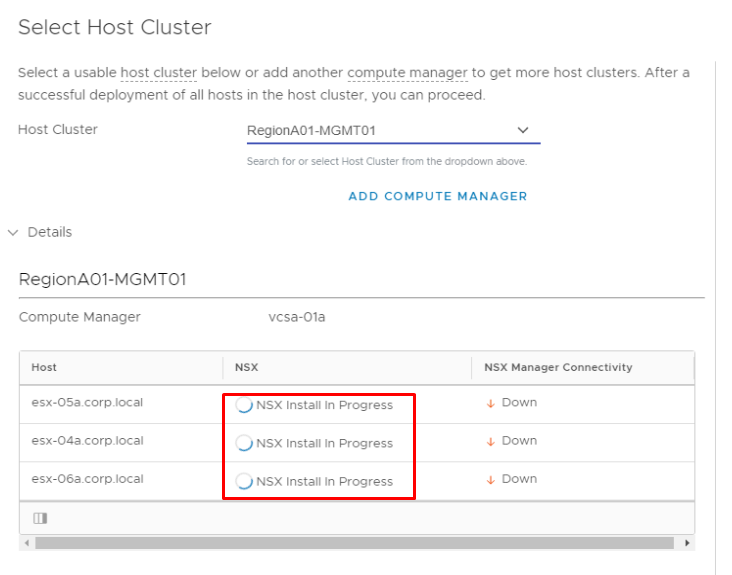

Screenshot 4.11.4

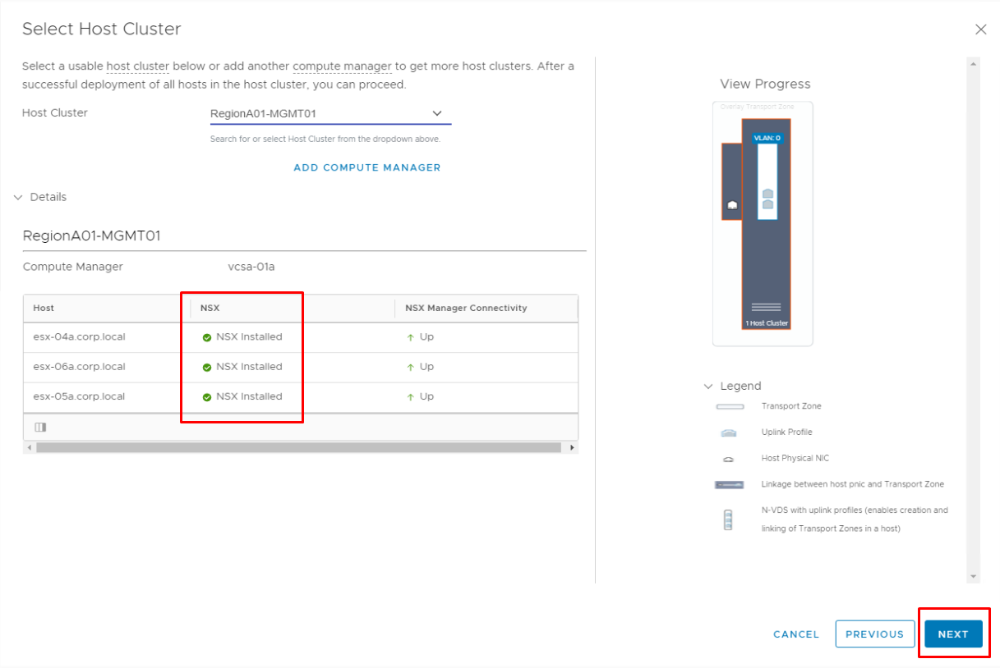

 

 4.12 On the `Select Transport Zone East-West` screen set the value for `Overlay Transport Zone` to `overlay-tz` and click `Next`

Screenshot 4.12

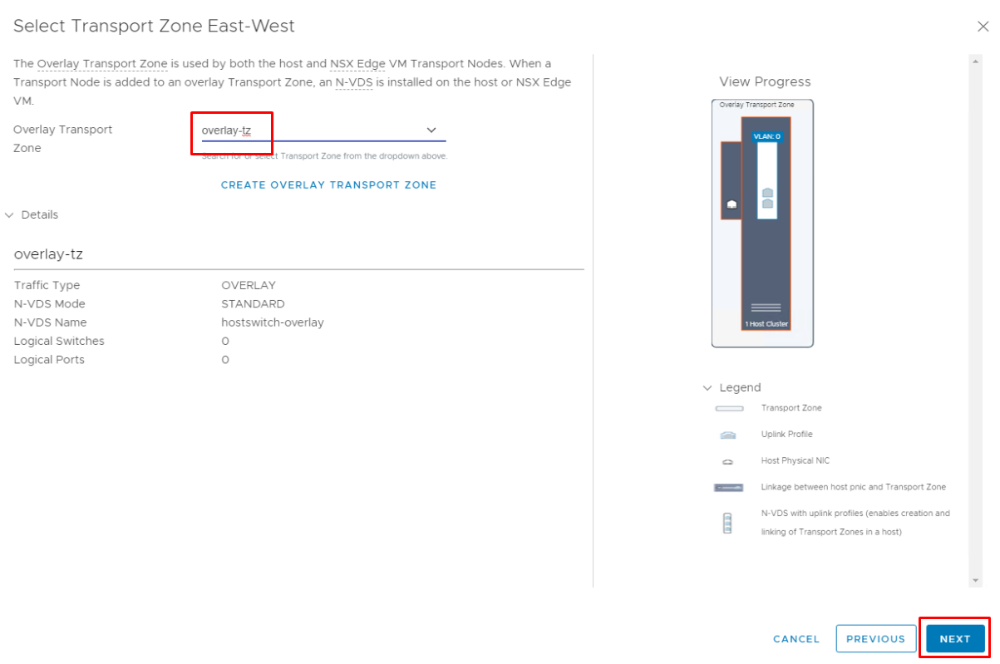

 

 4.13 On the `Select Uplink Profile East-West` screen, set the value for `Select Uplink Profile` to `nsx-default-uplink-hostswitch-profile` and click `Next`

Screenshot 4.13

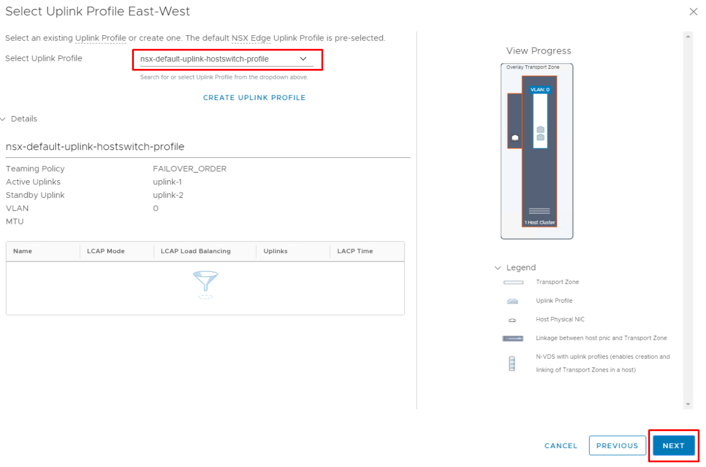

 

 4.14 On the `Link to Transport Zone East-West` screen, set the value for `Assignment IP Address` to `Use IP Pool` and set the value for `IP Pool` to `tep-ip-pool`

Screenshot 4.14

 

 4.15 On the `Link to Transport Zone East-West` screen, in the `Host NIC Connections` section, set the value for `vmnic1` to `uplink-1` and click `Next`

Screenshot 4.15

 

 4.16 On the `Review` screen, click `Finish`

Screenshot 4.16

 

 4.17 On the `System` tab in NSX Manager UI, In the left navigation bar expand the `Fabric` section and select `Nodes`. Select the `Host Transport Nodes` tab, set the `Managed by` field to `vcsa-01a`, expand the `RegionA01-MGMT01` and `RegionA01-COMP01` sections and ensure the `Configuration State` is `Success` and the `Node Status` is `Up` for all of the hosts

Screenshot 4.17

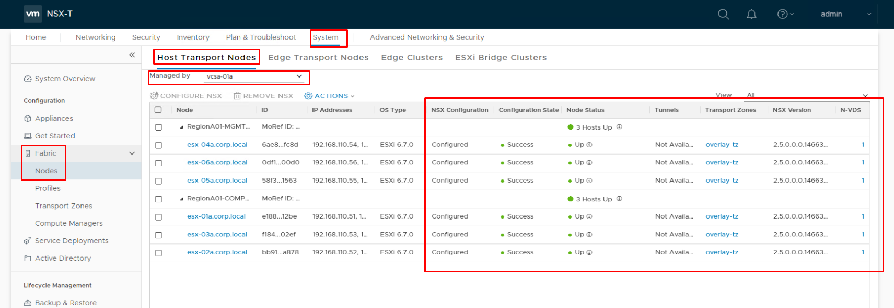

 

**You have now completed the Base NSX-T installation**

***End of lab***
