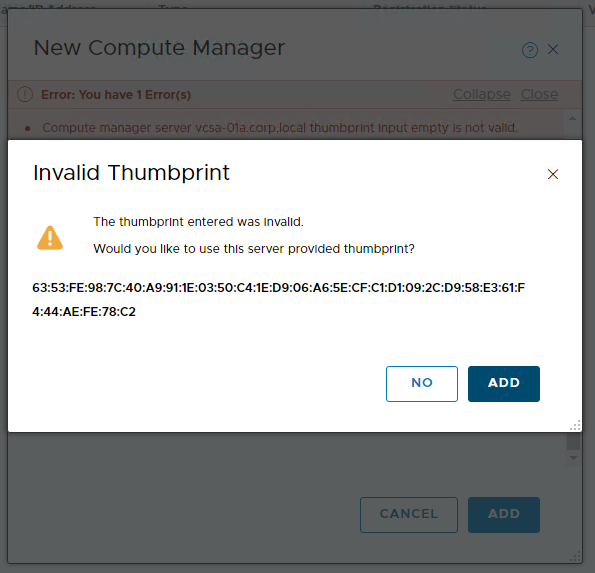

# NSX-T 2.4 Manual Installation

For NSXT 2.3 Manual Installation, please see the Pks1.3 Branch

## Overview

The following installation guide follows the implementation of a functional NSX-T 2.4 Installation. This implementation uses variables that function in the lab environment. Anyone is welcome to build a similar lab environment and follow along with the lab exercises, but please note you will need to replace any variables such as IP addresses and FQDNs and replace them with the appropriate values for your lab environment.

The steps provided in this lab guide are intended for a lab implementation and do not necessarily align with best practices for production implementiations. While the instructions provided in this lab guide did work for the author in their lab environment, VMware and/or any contributors to this Guide provide no assurance, warranty or support for any content provided in this guide.

## Prerequisites

- Please see [Getting Access to a PKS Ninja Lab Environment](https://github.com/CNA-Tech/PKS-Ninja/tree/master/Courses/GetLabAccess-LA8528) to learn about how to access or build a compatible lab environment

## Installation Notes

Anyone who implements any software used in this lab must provide their own licensing and ensure that their use of all software is in accordance with the software's licensing. This guide provides no access to any software licenses.

For those needing access to VMware licensing for lab and educational purposes, we recommend contacting your VMware account team. Also, the [VMware User Group's VMUG Advantage Program](https://www.vmug.com/Join/VMUG-Advantage-Membership) provides a low-cost method of gaining access to VMware licenses for evaluation purposes.

This lab follows the standard documentation, which includes additional details and explanations: [NSX-T 2.4 Installation Guide](https://docs.vmware.com/en/VMware-NSX-T-Data-Center/2.4/nsxt_24_install.pdf)

### Overview of Tasks Covered in Lab 1

- [NSX-T 2.4 Manual Installation](#nsx-t-24-manual-installation)
  - [Overview](#overview)
  - [Prerequisites](#prerequisites)
  - [Installation Notes](#installation-notes)
    - [Overview of Tasks Covered in Lab 1](#overview-of-tasks-covered-in-lab-1)
  - [Step 1: Deploy NSXT Manager using OVF Install Wizard](#step-1-deploy-nsxt-manager-using-ovf-install-wizard)
  - [Step 2: Add NSX Compute Manager](#step-2-add-nsx-compute-manager)
  - [Step 3: Add an Edge Node, Transport Zones and Uplink Profiles with the NSX-T Guided Preparation Workflow](#step-3-add-an-edge-node-transport-zones-and-uplink-profiles-with-the-nsx-t-guided-preparation-workflow)
  - [Step 4: Prepare and Configure ESXi Hosts as NSX-T Transport Nodes](#step-4-prepare-and-configure-esxi-hosts-as-nsx-t-transport-nodes)

-----------------------

## Step 1:  Deploy NSXT Manager using OVF Install Wizard

Note: Prior to Step 1, you will need to download the NSX-T 2.4 Installation Files and binaries. The Installation binaries are not included in the lab, users will need to provide their own access and licensing to download and use NSX-T 2.4. 

1.1 In the vSphere client, From the Hosts and Clusters view, right click on the RegionA01-MGMT01 Cluster and select `Deploy OVF Template'

Screenshot 1.1

 

1.2 On the `Select an OVF Template` step, select `Local File` and Navigate to the NSXT Manager OVA file, the filename should start with 'nsx-unified-appliance`. In the reference lab, this is located on the 'E:/Downloads' Directory

Screenshot 1.2

 

1.3 On the `Select a name and folder` step, use the name `nsxmgr-01a` and select `RegionA01` Datacenter as the location

Screenshot 1.3

 

1.4 On the `Select a compute resource` step, select `RegionA01-MGMT01` and click `Next`

Screenshot 1.4

 

1.5 On the `Review Details` step, verify details and click `Next`

Screenshot 1.5

 

1.6 On the `Configuration` step, select a Small Configuration and click `Next`

Screenshot 1.6

 

1.7 On the `Select Storage` step, set the virtual disk format to `Thin Provision` and select the `RegionA01-ISCSI02-COMP01` datastore

Screenshot 1.7

 

1.8 On the `Select Networks` step, set the Destination Network to `VM-RegionA01-vDS-MGMT` and click `Next`

Screenshot 1.8

 

1.9 On the `Customize Template` step, enter the following variables:

- Application
  - System Root User Password: VMware1!VMware1!
  - CLI Admin User Password: VMware1!VMware1!
  - CLI Audit User Password: VMware1!VMware1!
- DNS
  - DNS Server List: 192.168.110.10
  - Domain Search List: corp.local
- Network Properties
  - Default Gateway: 192.168.110.1
  - Hostname: nsxmgr-01a
  - Management Network IPv4 Address: 192.168.110.42
  - Management Network Netmask: 255.255.255.0
  - Rolename: nsx-manager
- Services Configuration
  - Allow Root SSH Logins: True
  - Enable SSH: True
  - NTP Server: 192.168.100.1
- All other options were left as default values

Screenshot 1.8

 

1.9 On the Ready to Complete screen, click `Finish` to complete the Deploy OVF Template Wizard

Screenshot 1.9

 

1.10 In the vSphere web client go to the task console and verify that the Status for Deploy OVF Template is "Completed" before proceeding
 

Screenshot 1.10

 

 1.11 Log into the vsphere client, navigate to the `Hosts and Clusters` view, select `nsxmgr-01a` and in the actions menu select `Edit Settings`. Expand the `Memory` section and set the `Reservation` value to `0 MB` and click `OK`

Screenshot 1.11.1

Screenshot 1.11.2

 

1.12 In the vSphere web client power on the nsxmgr-01a VM, wait a few minutes for NSX Manager to fully boot up before proceeding to the next step

NOTE: If the option to power on the nsxmgr-01a VM is not available, log out and then log back in to the vSphere web client

Screenshot 1.12

 

1.13 Open a web browser connection to NSX Manager, for example:

[https://nsxmgr-01a.corp.local/login.jsp](https://nsxmgr-01a.corp.local/login.jsp)

Login as:

- User: admin
- Password: VMware1!VMware1!

_NOTE: On your first login, you will be prompted to accept the EULA. Accept EULA and opt out of VMware Customer Experience program._

Screenshot 1.13

 

## Step 2: Add NSX Compute Manager

In this step, you create a connection between the NSX manager and your vCenter. This enables NSX manager to deploy VIBs to the hosts, controller and edge VMs, etc.

 2.1 Click anywhere on the screen to skip the "Welcome to NSX-T" Screen, click on the `System` tab and then on the left navigation bar Click `Fabric`, and then click `Compute Managers`

Screenshot 2.1

 

 2.2 Click on **Add** and Configure the New Compute Manager form with following values:

- Name: `vcsa-01a`
- Domain Name/IP Address: `vcsa-01a.corp.local`
- Type: `vCenter`
- Username: `administrator@corp.local`
- Password: `VMware1!`
- Clcik **Add**
- Click **Add** again to accept the vCenter certificate thumbprint

_NOTE: in a production implementation, you would first copy the vCenter thumbprint and then provide it in the form to properly authenticate the intial connection._

Screenshot 2.2.1

Screenshot 2.2.2

 

 2.3 Click **Refresh** in the lower-left hand corner and verify the Compute Manager is `Registered` and `Up`

Screenshot 2.3.1

Screenshot 2.3.2

 

## Step 3: Add an Edge Node, Transport Zones and Uplink Profiles with the NSX-T Guided Preparation Workflow

 3.1 From the NSX-T Manager Homepage at the bottom of the `System` section, click `Get Started`, and then click `Setup Transport Nodes`

Screenshot 3.1.1

Screenshot 3.1.2

 

 3.2 On the `Select Node Type` screen, select `NSX Edge VM` and click `Next`

Screenshot 3.2

nsxedge-

 

 3.3 On the `Select NSX Edge` Screen, click `Add New Edge`

Screenshot 3.3

 

 3.4 Complete the Add Edge VM workflow with the following values:

 - Name: nsxedge-1
 - FQDN: nsxedge-1.corp.local   
 - Form Factor: medium
 - Click Next
 - CLI Password: VMware1!VMware1!
 - System Root Password: VMware1!VMware1!
 - Compute Manager: vcsa-01a
 - Cluster: RegionA01-MGMT01
 - Datastore: RegionA01-ISCSI02-COMP01
 - Click Next
 - Management: VM-RegionA01-vDS-MGMT
 - Select "Static" (not DHCP)
 - Management IP: 192.168.110.91/24
 - Gateway IP: 192.168.110.1
 - fp-eth0: Uplink-RegionA01-vDS-MGMT
 - fp-eth1: Transport-RegionA01-vDS-MGMT
 - fp-eth2: VM-RegionA01-vDS-MGMT
 - Click Finish

Screenshot 3.4.1

Screenshot 3.4.2

Screenshot 3.4.3

Screenshot 3.4.4

 

 3.5 If Your NSX Manager Session times out while the edges are being deployed, log back in and return to the System > Get Started page, click `Setup Transport Nodes` and then select `NSX Edge VM` to return to the `Select NSX Edge` page. 

 3.6 On the `Select NSX Edge` screen select `nsxedge-1` from the `Edge Node` Pulldown Menu and click `Next` 

Screenshot 3.6

 

 3.7 On the `Select Transport Zone East-West` Screen, select `Create Overlay Transport Zone`

Screenshot 3.7

 

 3.8 In the `Add Transport Zone` workflow, enter the following values:

- Name: `overlay-tz`
- N-VDS Name: `hostswitch-overlay`
- Traffic Type: `Overlay`
- Click **Add** 

Screenshot 3.8

 

 3.9 On the `Select Transport Zone East-West` scree, select `overlay-tz` from the `Overlay Transport Zone` pulldown menu and click `Next` 

Screenshot 3.9

 

 3.10 On the `Select Uplink Profile East-West` screen, select `nsx-edge-single-nic-uplink-profile` from the `Select Uplink Profile` pulldown menu and click `Next`

Screenshot 3.10

 

 3.11 On the `Link to Transport Zone East-West` screen for `Assignment IP Address` select `Use IP Pool` and click `Create IP Pool`

Screenshot 3.11

 

 3.12 On the `Add IP Pool` screen, enter the following values:

- Name: `tep-ip-pool`
- Click `Add` under Subnets
- IP Range: `192.168.130.51-192.168.130.75`
- Gateway: `192.168.130.1`
- CIDR: `192.168.130.0/24`
- DNS Servers:  `192.168.110.10`
- DNS Suffix: `Corp.local`
- Click **Add**

Screenshot 3.12

 

 3.13 On the `Link to Transport Zone East-West` screen in the `NSX Edge NIC Connections` section, set the value for `fp-eth1` to `uplink-1` and click `Next`

Screenshot 3.13

 

 3.14 On the `Select Transport Zone North-South` screen, click `Create VLAN Transport Zone`

Screenshot 3.14

 

 3.15 On the `Add Transport Zone` screen, add a transport zone with the following parameters:

 - Name: vlan-tz
 - N-VDS Name: hostswitch-vlan
 - Traffic Type: VLAN
 - Click **Add**

Screenshot 3.15

 

 3.16 On the `Select Transport Zone North-South` screen, select `vlan-tz` from the pulldown menu for `VLAN Transport Zone` and click `Next`

Screenshot 3.16

 

 3.17 On the `Select Uplink Profile North-South` screen, select `nsx-edge-single-nic-uplink-profile` from the `Select Uplink Profile` pulldown menu and click `Next`

Screenshot 3.17

 

 3.18 On the `Link To Transport Zone North-South` screen, leave the `Assignment IP Address` value blank/empty as shown in the screenshot below. In the `NSX Edge NIC Connections` section, set the value for `fp-eth0` to `uplink-1` and click `Next`

Screenshot 3.18

 

 3.19 On the `Add To NSX Edge Cluster` screen, select `Add To New NSX Edge Cluster (system created)` field, set the `NSX Edge Cluster Name` value to `edge-cluster-1` and click `Next`

Screenshot 3.19

 

 3.20 On the `Review` screen, set the `Transport Node Name` to `edge-tn-1` and click `Finish`

Screenshot 3.20

 

 3.21 On the `System` tab in NSX Manager UI, In the left navigation bar expand the `Fabric` section and select `Nodes`. Select the `Edge Transport Nodes` tab, verify that `edge-tn-1` has a `Configuration State` of `Success`, a `Node Status` of `Up`, and is a member of `edge-cluster-1`

Screenshot 3.21

 

 3.22 Log into the vsphere client, navigate to the `Hosts and Clusters` view, select `nsxedge-1`. From the actions menu for `nsxedge-1` select `Edit Settings`. Expand the `Memory` section, **uncheck** the box for `Reserve all guest memory (All Locked)`, set the `Reservation` value to `0 MB` and click `OK`

Screenshot 3.22.1

Screenshot 3.22.2

 

## Step 4: Prepare and Configure ESXi Hosts as NSX-T Transport Nodes

Preparing hosts entails NSX Manager deploying and installing NSX VIBs (i.e.kernel modues) and configuring the NSX tunnel endpoints and participation in the N-VDS overlay fabric.

 4.1 From the NSX Manager UI go to the `System > Get Started` page and click `SET UP TRANSPORT NODES` 

Screenshot 4.1

 

 4.2 On the `Select Node Type` screen select `Host Cluster` and click `Next`

Screenshot 4.2

 

 4.3 On the `Select Host Cluster` Screen, set the value for `Host Cluster` to `RegionA01-COMP01`, when you make this selection, the page will prompt you to `Confirm Installation`, click `Install`. Do not proceed until the status in the `NSX` column for `esx-01a`, `esx-02a` and `esx-03a` is `NSX Installed`, and that `NSX Manager Connectivity` is `Up` for each host as shown in the screenshots below.

Screenshot 4.3.1

Screenshot 4.3.2

Screenshot 4.3.3

 

 4.4 On the `Select Transport Zone East-West` screen set the value for `Overlay Transport Zone` to `overlay-tz` and click `Next`

Screenshot 4.4

 

 4.5 On the `Select Uplink Profile East-West` screen, set the value for `Select Uplink Profile` to `nsx-default-uplink-hostswitch-profile` and click `Next`

Screenshot 4.5

 

 4.6 On the `Link to Transport Zone East-West` screen, set the value for `Assignment IP Address` to `Use IP Pool` and set the value for `IP Pool` to `tep-ip-pool`

Screenshot 4.6

 

 4.7 On the `Link to Transport Zone East-West` screen, in the `Host NIC Connections` section, set the value for `vmnic1` to `uplink-1` and click `Next`

Screenshot 4.7

 

 4.8 On the `Review` screen, click `Finish`

Screenshot 4.8

 

 4.9 From the NSX Manager UI go to the `System > Get Started` page and click `SET UP TRANSPORT NODES` 

Screenshot 4.9

 

 4.10 On the `Select Node Type` screen select `Host Cluster` and click `Next`

Screenshot 4.10

 

 4.11 On the `Select Host Cluster` Screen, set the value for `Host Cluster` to `RegionA01-MGMT01`, when you make this selection, the page will prompt you to `Confirm Installation`, click `Install`. Do not proceed until the status in the `NSX` column for `esx-04a`, `esx-05a` and `esx-06a` is `NSX Installed`, and that `NSX Manager Connectivity` is `Up` for each host as shown in the screenshots below.

Screenshot 4.11.1

Screenshot 4.11.2

Screenshot 4.11.3

 

 4.12 On the `Select Transport Zone East-West` screen set the value for `Overlay Transport Zone` to `overlay-tz` and click `Next`

Screenshot 4.12

 

 4.13 On the `Select Uplink Profile East-West` screen, set the value for `Select Uplink Profile` to `nsx-default-uplink-hostswitch-profile` and click `Next`

Screenshot 4.13

 

 4.14 On the `Link to Transport Zone East-West` screen, set the value for `Assignment IP Address` to `Use IP Pool` and set the value for `IP Pool` to `tep-ip-pool`

Screenshot 4.14

 

 4.15 On the `Link to Transport Zone East-West` screen, in the `Host NIC Connections` section, set the value for `vmnic1` to `uplink-1` and click `Next`

Screenshot 4.15

 

 4.16 On the `Review` screen, click `Finish`

Screenshot 4.16

 