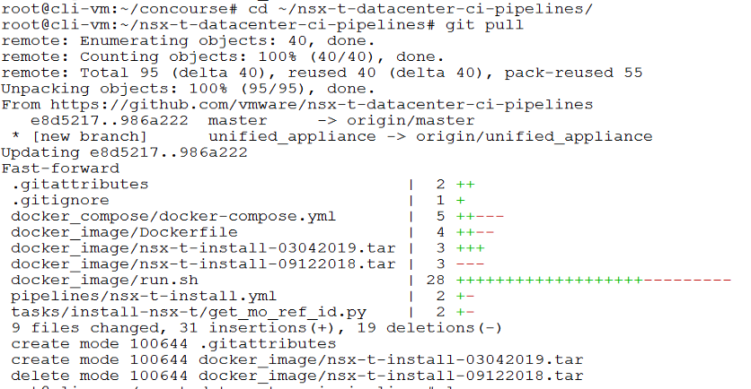
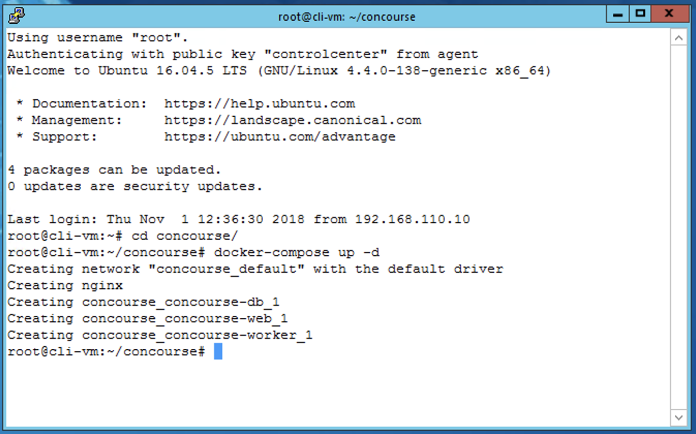
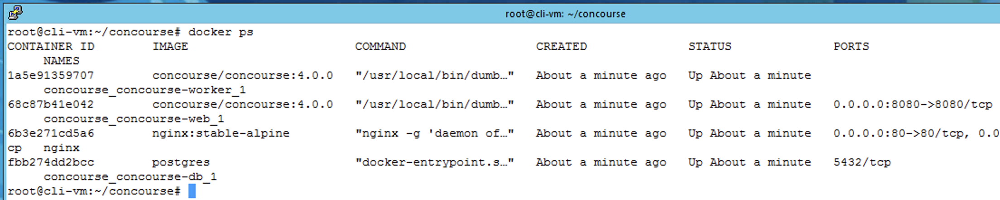

# NSX-T Pipeline Install

## Overview

Concourse is an Open source CI/CD pipeline tool used to perform Day 1 and 2 Ops on the CNA platform.
The NSX-T Pipeline was created to provide our customers a simple way to deploy NSX-T (end to end) in a few clicks, with a repeatable deployment process.

In this lab you will setup Concourse and then run a pipeline to install NSX-T

## Prerequisites

- Please see [Getting Access to a PKS Ninja Lab Environment](https://github.com/CNA-Tech/PKS-Ninja/tree/Pks1.4/Courses/GetLabAccess-LA8528) to learn about how to access or build a compatible lab environment
- If you are using the PKS Ninja v10 template, you must install the [v10 template patch](https://github.com/CNA-Tech/PKS-Ninja/blob/Pks1.4/Labrary/Microlabs/NinjaLabPrepScript-CI4231.md) before proceeding

## Concourse setup and NSX-T Pipeline Kickoff

Concourse can be stood up in many different ways. In this lab we will stand it up using a combination of docker images with docker-compose.

1.0 SSH to the cli-vm, and update the nsxt-pipelines to the latest version with the following commands:

```bash
cd ~/nsx-t-datacenter-ci-pipelines/
git pull
```

<details><summary>Screenshot 1.0.1</summary>

</details>

<details><summary>Screenshot 1.0.2</summary>

</details>
<br>

1.1 Navigate to the concourse directory where the docker-compose.yml file is located.

`cd concourse`

<details><summary>Screenshot 1.1</summary>

</details>
<br>

1.2 Use docker-compose to stand up the pipeline and web server.

`docker-compose up -d`

<details><summary>Screenshot 1.2</summary>

</details>
<br>

1.3 Verify that all 4 containers are in the **Up** status and that none have *Exited*

`docker ps`

<details><summary>Screenshot 1.3</summary>

</details>
<br>

1.4 Import the NSX pipeline using the `fly` cli command on the cli-vm.  The source script will create the `fly-s` alias used below to simplify the commands.

```bash
cd ~/nsx-t-datacenter-ci-pipelines/pipelines
source nsxt-setup.sh
fly-s
```

- confirm the parameters file import with `y`

<details><summary>Screenshot 1.4.1</summary>

</details>

<details><summary>Screenshot 1.4.2</summary>

</details>

<details><summary>Screenshot 1.4.3</summary>

</details>

<details><summary>Screenshot 1.4.4</summary>

</details>
<br>

1.5 Using a web browser navigate to the concourse URL

`http://cli-vm.corp.local:8080`

1.6 In the upper right-hand corner login to Concourse

- Username: admin
- Password: VMware1!

<details><summary>Screenshot 1.6</summary>

</details>
<br>

1.7 Click the **Play** button in the lower right hand corner of the *install-nsx-t* tile and then on **install-nsx-t**

<details><summary>Screenshot 1.7</summary>

</details>
<br>

1.8 Verify that the pipeline is not in an *errored* state

- You will see Maroon colored boxes if the pipline is errored out
  - If it is in an errored state perform a `fly-d` and `fly-s` to destroy and re-import the pipeline on the cli-vm.

<details><summary>Screenshot 1.8</summary>

</details>
<br>

1.9 Click on the **install-nsx-t** light-gray box in the pipeline

<details><summary>Screenshot 1.9</summary>

</details>
<br>

1.10 Execute the pipeline with the **Plus** button in the upper right-hand corner

<details><summary>Screenshot 1.10</summary>

</details>
<br>

1.11 Grab some coffee and watch the magic happen!


<br>

1.12 After coffee :coffee: and around 45 to 60 minutes you should see this.

<details><summary>Screenshot 1.12</summary>

</details>
