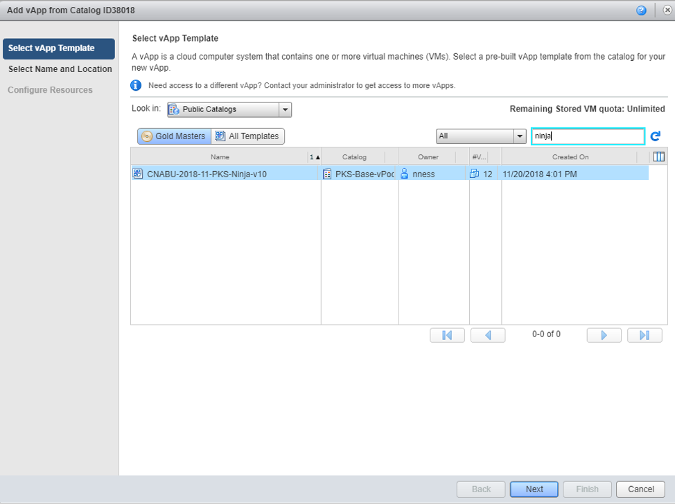

# Accessing the PKS Ninja Lab with OneCloud

**Onecloud is available to VMware Employees only, please see [Getting Access to a PKS Ninja Lab Environment](https://github.com/CNA-Tech/PKS-Ninja/tree/master/Courses/GetLabAccess-LA8528) for lab access options for non VMware employees**

The PKS Ninja vApp Template is available in the Global Field Enablement catalogs and is currently accessible on the NASA, EMEA and APAC Onecloud Sandbox environments

## Instructions

1.1 Open a web browser, navigate to workspace one and launch your onecloud environment

**Note: your onecloud environment may not be the same as in the image below, please use the onecloud org you have access to**

Screenshot 1.1

 

1.2 Click on `Add vApp fron Catalog`, select `Public Catalogs`, in the search box type `ninja`, and select the pks-ninja template

Screenshot 1.2.1

Screenshot 1.2.2

 

1.3 On the `Select Name and Location` screen, enter a name for your vApp template and click `Next`

Screenshot 1.3

 

1.4 On the `Configure Resources` screen, click `Finish`

Screenshot 1.4

 

1.5 On the tile view of your new vApp template, click the play icon to run the vPod, wait for a few minutes for it to be in a fully running state before proceeding

Screenshot 1.5

 

1.6 On the tile view of your new vApp template, click `Open`, Click on the `Virtual Machines` tab, record the `External IP` address value

Screenshot 1.6.1

Screenshot 1.6.2

 

1.7 Open a remote desktop application, and connect to the external IP address from the step above with the `username: administrator@corp.local` `password: VMware1!`

Screenshot 1.7.1

Screenshot 1.7.2

Screenshot 1.7.3

 

1.8 When Using the PKS Ninja v10 template, you must run a script to make some minor updates to the lab environment before beginning any lab guides. The following steps must be completed each time you load a new instance of the Ninja v10 template

You can run this script after deploying your v10 lab template, to fix the DNS client issue and the PKS pipeline issue.

1.8.1 From cli-vm, git clone https://github.com/natereid72/PKS-Ninja-Lab-Patch.git

1.8.2 As [per the readme](https://github.com/natereid72/PKS-Ninja-Lab-Patch), execute the shell script (Execute source cc-p1.sh at the command line on cli-vm)

1.8.3 then follow lab guides as normal
No need to copy or edit files this way. Just run the script and v10 will work per the guides