# Accessing the PKS Ninja Lab with OneCloud

**Onecloud is available to VMware Employees only, please see [Getting Access to a PKS Ninja Lab Environment](https://github.com/CNA-Tech/PKS-Ninja/tree/Pks1.4/Courses/GetLabAccess-LA8528) for lab access options for non VMware employees**

The PKS Ninja vApp Template is available in the Global Field Enablement catalogs and is currently accessible on the NASA, EMEA and APAC Onecloud Sandbox environments

PKS Ninja uses a standard lab topology and configuration which is currently defined in onecloud templates. Available templates are versioned, and it is important you select the NinjaLab version that aligns with the git branch you are using. The main branch of the github site will always reflect the latest published template, and seperate git branches are maintained for older template versions.

At the time of writing, the current template version is v11, for most users, you can load a v11 template and proceed with the lab guides on the site. If you would like to use an older version, load the older template, and navigate to the appropriate branch on the pks ninja repository to find content specific to your version.

There are 3 onecloud templates available for the v11 template:

    CNABU-2019-01-PKS-Ninja-v11
        This template has vcenter pre-installed and prepared to do a NSX-t and PKS installation as documented in the PKS the Easy Way or the PKS the Hard Way Courses
    CNABU-PKS-Ninja-v11-NsxtInstalled
        This is the same as the above base v11 template, but with NSX-T Preinstalled. This template could take 30-60 minutes to load into a fully operational state
    CNABU-PKS-Ninja-v11-fullyInstalled
        This template is built on the base v11 template but has the following pre-installed: NSX-T, OpsMan, Bosh, PKS, Harbor
        This template will take between 2-4 hours to load into a fully operational state

## Instructions

1.1 Open a web browser, navigate to workspace one and launch your onecloud environment

**Note:** your onecloud org may not be the same as in the image below, please use the onecloud org you have access to

Screenshot 1.1

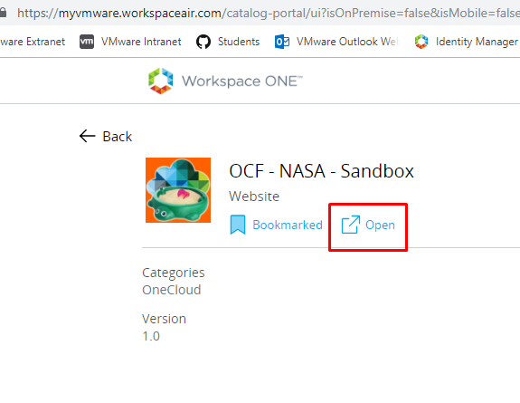

 

1.2 From the vCloud Director page on the `Virtual Machines` tab, select `See this page in vCloud Director Web Console`

Screenshot 1.2

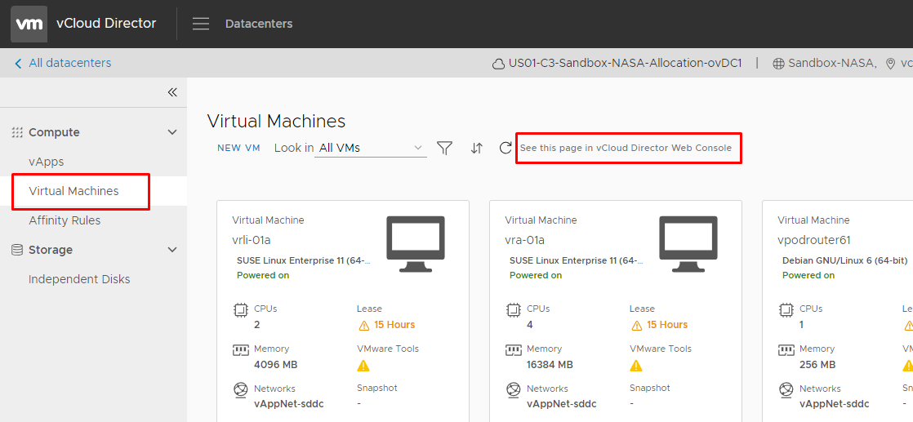

1.3 Click on `Add vApp from Catalog`, select `Public Catalogs`, click on `All Templates`, in the search box type `ninja`, select the pks-ninja template and click `Next`

Screenshot 1.3.1

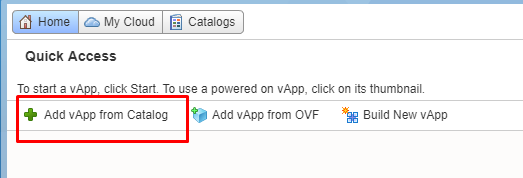

Screenshot 1.3.2

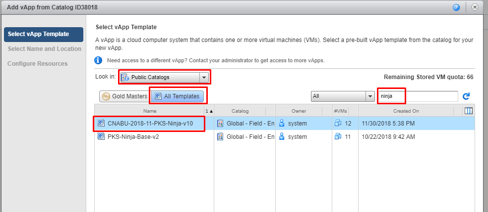

 

1.4 On the `Select Name and Location` screen, enter a name for your vApp template and click `Next`

Screenshot 1.4

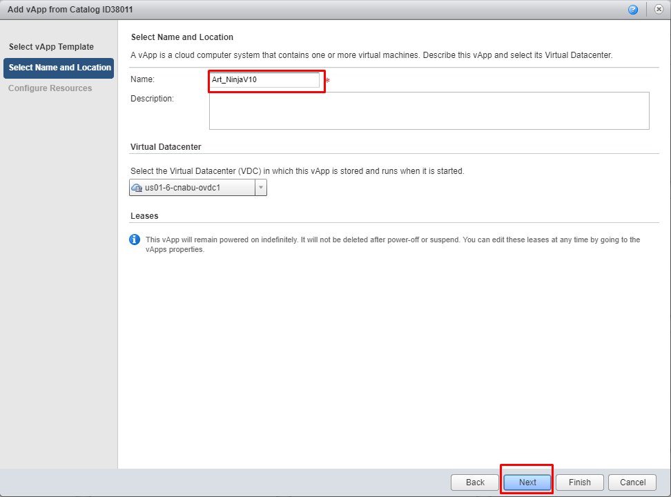

 

1.5 On the `Configure Resources` screen, click `Finish` and wait for your new template to finish loading

Screenshot 1.5

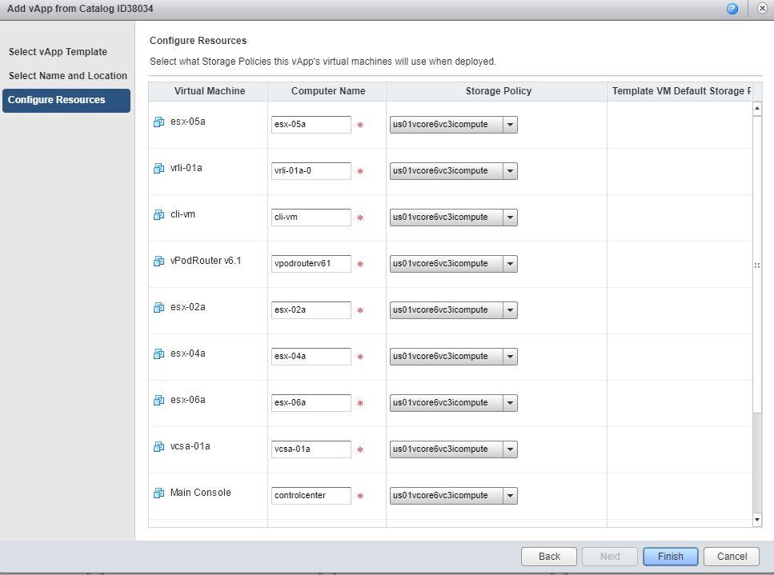

 

1.6 On the tile view of your new vApp template, click `Open`, Click on the `Networking` tab, in the `Connection` column dropdown field for `vAppNet-single`, select the only available network connection, ensure `Nat` is checked, and `Firewall` is __not checked__ click `Apply` and wait for the configuration change to be completed by verifying there are `0 Running` tasks in the lower lefthand corner of the webpage, per the screenshots below

Screenshot 1.6.1

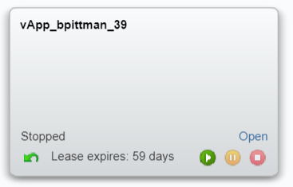

Screenshot 1.6.2

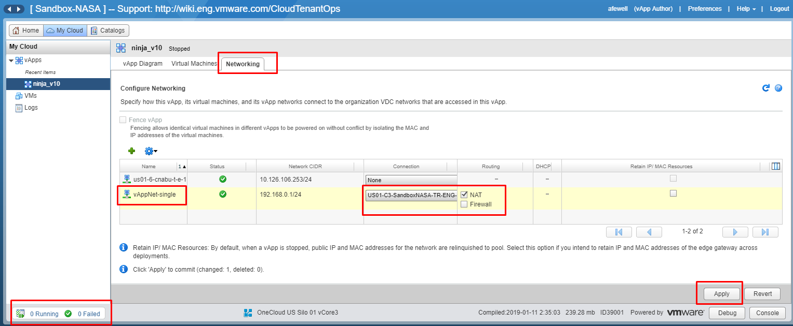

 

1.7 Click on the `Home` button to return to your onecloud home page, on the tile view of your new vApp template, click the play icon to run the vPod, wait for a few minutes for it to be in a fully running state before proceeding

Screenshot 1.7

 

1.8 On the tile view of your new vApp template, click `Open`, Click on the `Virtual Machines` tab, record the `External IP` address value

Screenshot 1.8.1

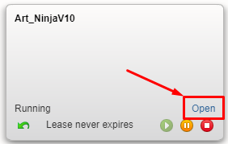

Screenshot 1.8.2

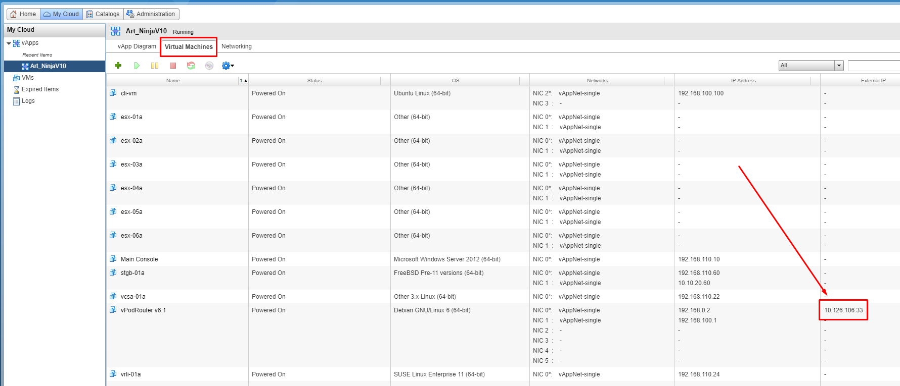

 

1.9 Open a remote desktop application, and connect to the external IP address from the step above with the `username: administrator@corp.local` `password: VMware1!`

Screenshot 1.9.1

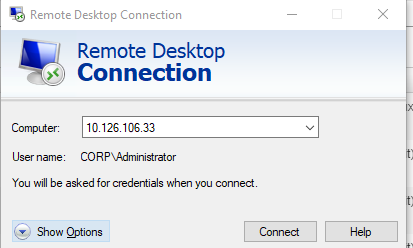

Screenshot 1.9.2

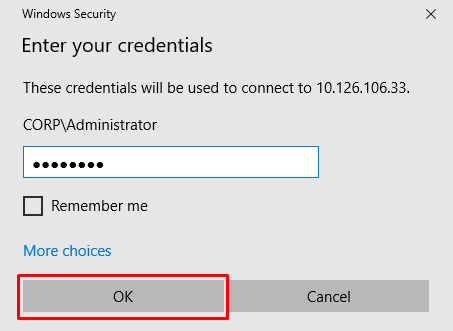

Screenshot 1.9.3

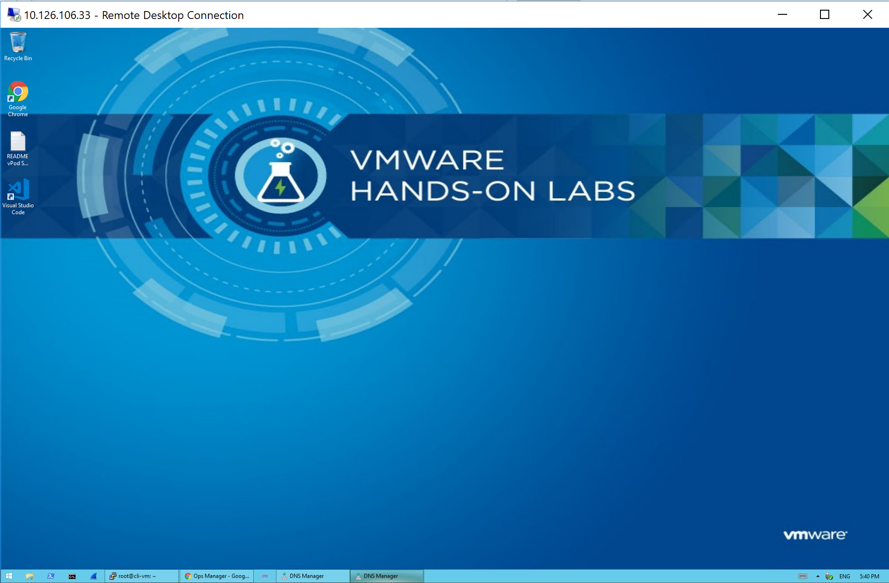

 

### You have now completed this exercise, you will need to complete either the [PKS the Easy Way](https://github.com/CNA-Tech/PKS-Ninja/tree/Pks1.4/Courses/PksTheEasyWay-PE6650) or the [PKS The Hard Way](https://github.com/CNA-Tech/PKS-Ninja/tree/Pks1.4/Courses/PksTheHardWay-PH7885) course to install PKS, and then you can use this lab environment to complete available courses and lab guides
