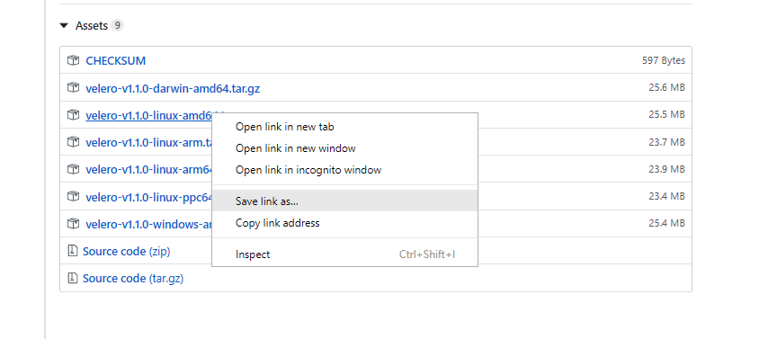
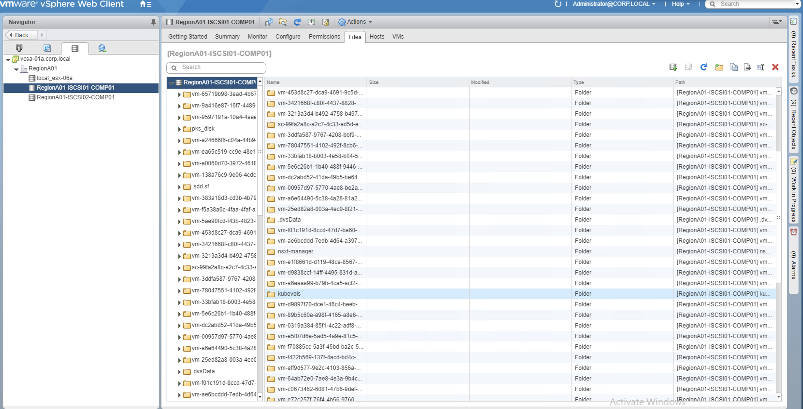
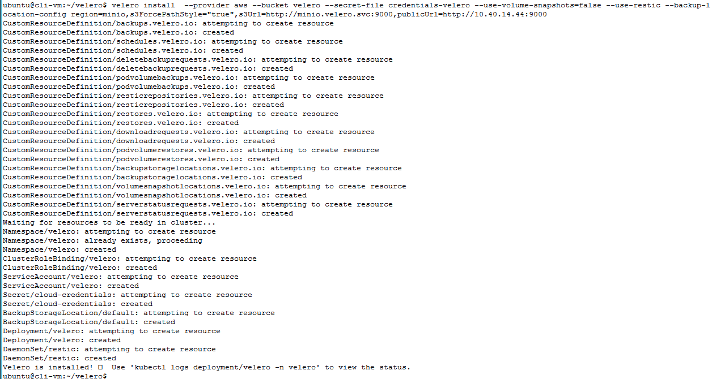
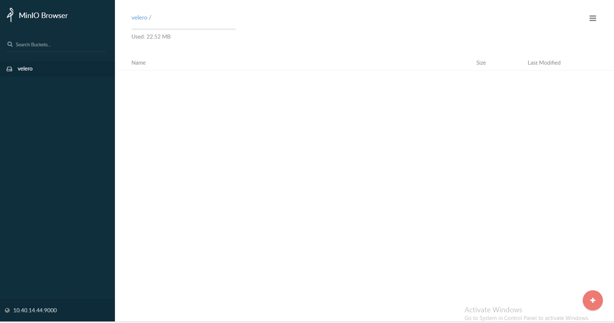
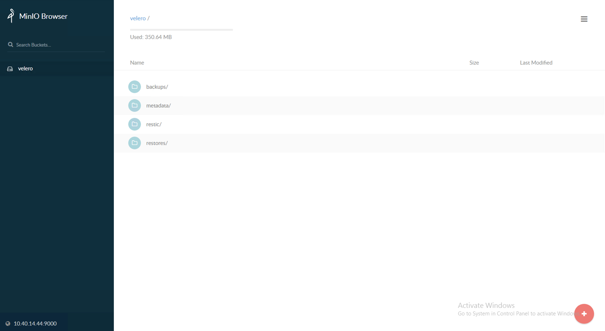
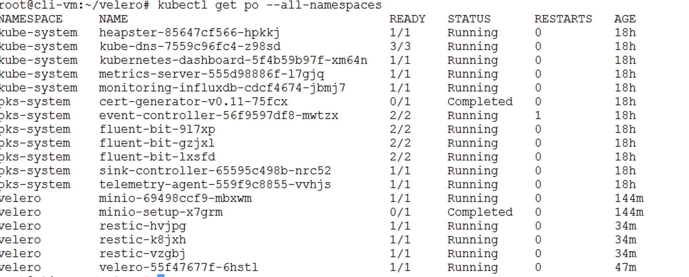
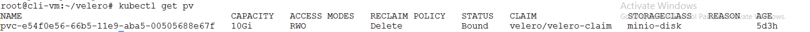
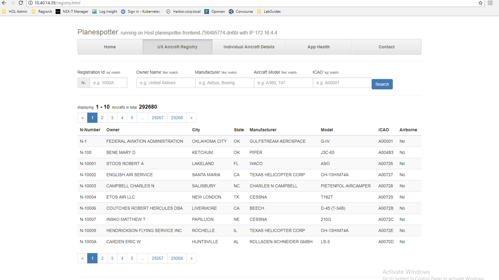

# PKS Backup and Restore using VMWare Heptio Velero

## Overview

### Velero
Velero (formerly Heptio Ark) gives you tools to back up and restore your Kubernetes cluster resources and persistent volumes. 

- Velero Features:
  * Take backups of your cluster and restore in case of loss.
  * Copy cluster resources to other clusters.
  * Backup and restore persistent volumes
  * Scheduled backups
  * Replicate your production environment for development and testing environments.
  * Filtering (namespaces, resources, label selectors)
  * Restore into different namespaces

- Velero Extensibility
  * Hooks
  * Plugins

- Velero consists of:
  * A server that runs on your cluster
  * A command-line client that runs locally

### Persistent Volumes 

In this sample , Velero leverages vSphere Storage for Kubernetes to allow Minio to use enterprise grade persistent storage to store the backup. Persistent volumes requested by stateful containerized applications can be provisioned on vSAN, iSCSI, VVol, VMFS or NFS datastores. PKS deploys Kubernetes clusters with the vSphere Cloud (Storage) Provider already configured. 

Kubernetes volumes are defined in Pod specifications. They reference VMDK files and these VMDK files are mounted as volumes when the container is running. When the Pod is deleted the Kubernetes volume is unmounted and the data in VMDK files persists.
  

In order to use Persistent Volumes (PV), the user needs to create a `PersistentVolumeClaim`(PVC) which is a request for PVs. A claim must specify the access mode and storage capacity. Once a claim is created, a PV is automatically bound to this claim. Kubernetes will bind a PV to PVC based on access mode and storage capacity but a claim can also mention volume name, selectors and volume class for a better match. The relationship of PVs and PVCs not only abstracts storage provisioning and consumption but also ensures security through access control.

Static Persistent Volumes require that a vSphere administrator manually create a (virtual disk) VMDK on a datastore, then create a Persistent Volume that abstracts the VMDK. A developer would then make use of the volume by specifying a Persistent Volume Claim.

The vSphere Cloud (Storage) Provider allows for Dynamic Persistent Volume provisioning, meaning a vSphere admin doens't have to manually create storage resources to support the developers' Kubernetes workloads. Kubernetes `StorageClasses` allow the creation of Persistent Volumes on-demand without having to create storage and mount it into K8s nodes upfront. `StorageClasses` specifiy a provisioner and parameters which are used to define the intended policy for a Persistent Volume which will be dynamically provisioned.

## Prerequisites

- Please see [Getting Access to a PKS Ninja Lab Environment](https://github.com/CNA-Tech/PKS-Ninja/tree/Pks1.4/Courses/GetLabAccess-LA8528) to learn about how to access or build a compatible lab environment
- Complete PKS Install Lab [Phase 1](https://github.com/CNA-Tech/PKS-Ninja/tree/Pks1.4/LabGuides/PksInstallPhase1-IN3138) and [Phase 2](https://github.com/CNA-Tech/PKS-Ninja/tree/Pks1.4/LabGuides/PksInstallPhase2-IN1916)
- Deploy Your [First PKS Cluster](https://github.com/CNA-Tech/PKS-Ninja/tree/Pks1.4/LabGuides/DeployFirstCluster-DC1610)
- Deploy the [Planespotter Application](https://github.com/CNA-Tech/PKS-Ninja/tree/Pks1.4/LabGuides/DeployPlanespotter-DP6539)

## Installation Notes

Anyone who implements any software used in this lab must provide their own licensing and ensure that their use of all software is in accordance with the software's licensing. This guide provides no access to any software licenses.

For those needing access to VMware licensing for lab and educational purposes, we recommend contacting your VMware account team. Also, the [VMware User Group's VMUG Advantage Program](https://www.vmug.com/Join/VMUG-Advantage-Membership) provides a low-cost method of gaining access to VMware licenses for evaluation purposes.

This lab follows the standard documentation, which includes additional details and explanations: [NSX-T 2.4 Installation Guide](https://docs.vmware.com/en/VMware-NSX-T-Data-Center/2.4/installation/GUID-3E0C4CEC-D593-4395-84C4-150CD6285963.html)

### Overview of Tasks Covered in Lab 1
Take a backup of the planespotter namespace
Delete the planespotter app
Restore the planespotter namespace

- [Step 1: Download official release of Velero 1.1](#step-1--download-official-release-of-Heptio-Velero)
- [Step 2: Validate the planespotter app](#step-2--Validate-the-planespotter-app)
- [Step 3: Setup Velero](#step-3--Setup-Velero)
- [Step 4: Backup](#step-4--Backup)
- [Step 5: Delete the planespotter app](#step-5--Delete-the-planespotter-app)
- [Step 6: Restore](#step-6--Restore)

-----------------------

## Step 1:  Download official release of Heptio Velero

1.1 Navigate to the official release of the Heptio Velero release page (https://github.com/heptio/velero/releases) and copy the link for the target VM OS. Right click on the release link and select `Copy Link Address`. We are looking for `velero-v1.1.0-linux-amd64.tar.gz` to install on the `cli-vm`:

<Details><Summary>Screenshot 1.1</Summary>

</Details>
<br/>

1.2 ssh to the `cli-vm`, download and uncompress the Velero distribution and move the `velero` binary into your `PATH`:
  
```bash
mkdir velero
cd ~/velero
wget https://github.com/heptio/velero/releases/download/v1.1.0/velero-v1.1.0-linux-amd64.tar.gz
tar xvf velero-v1.1.0-linux-amd64.tar.gz
sudo mv velero-v1.1.0-linux-amd64/velero /usr/bin/velero
```

## Step 2:  Validate the planespotter app

2.1 Login to the PKS API with the following command, when prompted use the password `VMware1!`:

```bash
pks login -a pks.corp.local -u pksadmin --skip-ssl-validation
```


2.2 Pull down the kubernetes config and credentials for `my-cluster` with the follwoing command: 

```bash
pks get-credentials my-cluster
```

2.3 Verify all the pods needed for the planespotter app (`planespotter-frontend`, `planespotter-app`, `redis`, `adsb-sync`, and `mysql-0`, 7 pods in total) have been deployed and have entered `Running` state.

**Note**: If you have not deployed the planespotter app, please refer to the [Planespotter Application](https://github.com/CNA-Tech/PKS-Ninja/tree/Pks1.4/LabGuides/DeployPlanespotter-DP6539) lab to deploy the application with persistent storage.

```bash
kubectl get pods --namespace planespotter

kubectl get services --namespace planespotter
```

## Step 3:  Setup Velero

3.1 The first thing you'll need to do is configure a namespace that the `velero` service will operate in:

```bash
kubectl create namespace velero
``` 

3.2 Create a Storage Class that will allow the `velero` service to create persistent volume claims. First, create a `000-storage-class.yaml` file and copy the below contents into it, save and exit. After saving the file, use `kubectl` to create the storage class resource:

```bash
cd  ~/velero

nano 000-storage-class.yaml
```

<details><summary>000-storage-class.yaml</summary>

```yaml
---
kind: StorageClass
apiVersion: storage.k8s.io/v1
metadata:
  name: minio-disk
provisioner: kubernetes.io/vsphere-volume
parameters:
    diskformat: thin
```

</details>
<br/>

```bash
kubectl apply -f 000-storage-class.yaml

```

3.3 Create a Persistent Volume Claim that will be used by the `velero` service for backups. First, create the ` 001-velero-pvc.yaml` file and copy the below contents into it, save and exit. After saving the file, use `kubectl` to create the PVC:

```bash
nano 001-velero-pvc.yaml

```

<details><summary>01-velero-pvc.yaml</summary>

```yaml
---
kind: PersistentVolumeClaim
apiVersion: v1
metadata:
  name: velero-claim
  namespace: velero
  annotations:
    volume.beta.kubernetes.io/storage-class: minio-disk
spec:
  accessModes:
    - ReadWriteOnce
  resources:
    requests:
      storage: 10Gi
```

</details>
<br/>


```bash
kubectl apply -f 001-velero-pvc.yaml

```

3.4 Login to vCenter to and check if the PV has been provisioned under kubevols

<details><summary>Screenshot 3.4</summary>

</details>
<br/>

3.5 Edit the file at `~/velero/velero-v1.1.0-linux-amd64/examples/minio/00-minio-deployment.yaml` to ensure the Minio service uses the persistentvolume created in the previous step. The change is the below (as well as an example of the entire `00-minio-deployment.yaml` file):

      - name: storage
        persistentVolumeClaim:
          claimName: velero-claim

<details><summary>00-minio-deployment.yaml</summary>

```yaml
# Copyright 2017 the Heptio Ark contributors.
#
# Licensed under the Apache License, Version 2.0 (the "License");
# you may not use this file except in compliance with the License.
# You may obtain a copy of the License at
#
#     http://www.apache.org/licenses/LICENSE-2.0
#
# Unless required by applicable law or agreed to in writing, software
# distributed under the License is distributed on an "AS IS" BASIS,
# WITHOUT WARRANTIES OR CONDITIONS OF ANY KIND, either express or implied.
# See the License for the specific language governing permissions and
# limitations under the License.

---
apiVersion: apps/v1beta1
kind: Deployment
metadata:
  namespace: velero
  name: minio
  labels:
    component: minio
spec:
  strategy:
    type: Recreate
  template:
    metadata:
      labels:
        component: minio
    spec:
      volumes:
      - name: storage
        persistentVolumeClaim:
          claimName: velero-claim
      - name: config
        emptyDir: {}
      containers:
      - name: minio
        image: minio/minio:latest
        imagePullPolicy: IfNotPresent
        args:
        - server
        - /storage
        - --config-dir=/config
        env:
        - name: MINIO_ACCESS_KEY
          value: "minio"
        - name: MINIO_SECRET_KEY
          value: "minio123"
        ports:
        - containerPort: 9000
        volumeMounts:
        - name: storage
          mountPath: "/storage"
        - name: config
          mountPath: "/config"

---
apiVersion: v1
kind: Service
metadata:
  namespace: velero
  name: minio
  labels:
    component: minio
spec:
  # ClusterIP is recommended for production environments.
  # Change to NodePort if needed per documentation,
  # but only if you run Minio in a test/trial environment, for example with Minikube.
  #type: ClusterIP
  ports:
    - port: 9000
      targetPort: 9000
      protocol: TCP
  selector:
    component: minio

---
apiVersion: v1
kind: Secret
metadata:
  namespace: velero
  name: cloud-credentials
  labels:
    component: minio
stringData:
  cloud: |
    [default]
    aws_access_key_id = minio
    aws_secret_access_key = minio123

---
apiVersion: batch/v1
kind: Job
metadata:
  namespace: velero
  name: minio-setup
  labels:
    component: minio
spec:
  template:
    metadata:
      name: minio-setup
    spec:
      restartPolicy: OnFailure
      volumes:
      - name: config
        emptyDir: {}
      containers:
      - name: mc
        image: minio/mc:latest
        imagePullPolicy: IfNotPresent
        command:
        - /bin/sh
        - -c
        - "mc --config-dir=/config config host add velero http://minio:9000 minio minio123 && mc --config-dir=/config mb -p velero/velero"
        volumeMounts:
        - name: config
          mountPath: "/config"
---
apiVersion: extensions/v1beta1
kind: Ingress
metadata:
  name: velero-minio
  namespace: velero
spec:
  rules:
  - host: velero.minio.local
    http:
      paths:
      - backend:
          serviceName: minio
          servicePort: 9000

```

</details>
<br/>

3.6 After adding the reference to the PVC, deploy the Minio service with the following command:


```bash
kubectl apply -f ~/velero/velero-v1.1.0-linux-amd64/examples/minio/00-minio-deployment.yaml

```

3.7 Expose the minio service with the following command:

```bash
kubectl expose deployment minio --name=velero-minio-lb --port=9000 --target-port=9000 --type=LoadBalancer --namespace=velero

```

3.8 Check the external IP address assigned to the service (make note of the first IP addres under `External-IP`):

```bash
kubectl get service velero-minio-lb -n velero
```

3.9 Copy the IP under the `External-IP` section . Point your browser to that location on port `9000` (`<external-ip>:9000`). You should be able to view the minio browser:

<details><summary>Screenshot 3.9</summary>

</details>
<br/>

3.10 Now that we've configured the minio service, we are almost ready to install Velero. First, we need to create a `credentials-velero` file that the Velero installer will use to connect to the minio service to store the subsequent backups:

```bash
nano ~/velero/credentials-velero

```
```bash
[default]
aws_access_key_id = minio
aws_secret_access_key = minio123
```

3.11 The `velero install` command will create CRDs (Custom Resource Definintions) that Velero uses to perform its magic. Run the following install command to deploy Velero in your cluster:

**Note**: Replace the `<public-ip-minio-service>` value with the IP address from the minio service `LoadBalancer` address from step 3.8

```bash
velero install  --provider aws --bucket velero --secret-file credentials-velero --use-volume-snapshots=false --use-restic --backup-location-config region=minio,s3ForcePathStyle="true",s3Url=http://minio.velero.svc:9000,publicUrl=http://<public-ip-minio-service>:9000
```
<details><summary>Screenshot 3.11</summary>

</details>
<br/>

3.12 Verify the following pods have been created in the `velero` namespace(notice the error for the `restic` pods):

```bash
kubectl get pod -n velero
NAME                      READY   STATUS              RESTARTS   AGE
minio-68f65f4cc6-j686d    1/1     Running             0          14m
minio-setup-4r7md         0/1     Completed           0          14m
restic-sl57t              0/1     RunContainerError   0          37s
restic-vh9rx              0/1     RunContainerError   1          37s
velero-5cc55f7ff6-xwcnn   1/1     Running             0          37s
```
3.13 As mentioned above, the `restic` pods are not able to start. That is because in Enterprise PKS Kubernetes clusters, the path to the pods on the nodes is a little different (`/var/vcap/data/kubelet/pods`) than in "vanilla" Kubernetes clusters (`/var/lib/kubelet/pods`). In order for us to allow the `restic` pods to run as expected, we need to edit the `restic` daemon set and change the `hostPath` variable as referenced below:
~~~
$ kubectl edit daemonset restic -n velero
~~~
```bash

volumes:
      - hostPath:
          path: /var/vcap/data/kubelet/pods
          type: ""
        name: host-pods
```

3.14 Verify the `restic` pods are in the `Running` state after the change:

```bash
kubectl get pods -n velero
NAME                      READY   STATUS      RESTARTS   AGE
minio-68f65f4cc6-j686d    1/1     Running     0          35m
minio-setup-4r7md         0/1     Completed   0          35m
restic-45hbc              1/1     Running     0          32s
restic-ndpb9              1/1     Running     0          32s
velero-5cc55f7ff6-xwcnn   1/1     Running     0          20m
```

Great! Now we're ready to back up our app!

## Step 4:  Backup

4.1 Refer back to the browser window where you accessed the Minio web UI (`<external-ip>:9000`) and login with Access Key as `minio` and Secret Key as `minio123`:

<Details><Summary>Screenshot 4.1</Summary>

</Details>
<br/>

4.2 Navigate back to the `cli-vm` putty session and ensure you are in the `~/velero` directory:
  
```bash

cd ~/velero

```

4.3 Since our planespotter app is using a `mysql` pod that is utilizing persistent storage, we need to annotate the `mysql-0` pod so the Velero service understand it needs to include those volumes in the backup we will run shortly. Run the following to annotate the `mysql-0` as required for Velero to back up the associated volumes:
   
```bash

kubectl -n planespotter annotate pod/mysql-0 backup.velero.io/backup-volumes=mysql-vol,mysql-config,mysql-start

```

4.4 Now that we have annotated the `mysql-0` pod, we are ready to take a backup. Take a backup of the planespotter namespace with the following command. The backup will be called `planes`:

```bash

velero backup create planes --include-namespaces planespotter

```

4.5 Note the output from the `velero` command below. You can check the status of the backup using the commands below:

```bash

Backup request "planes" submitted successfully.
Run `velero backup describe planes` or `velero backup logs planes` for more details.

```

4.6 Refresh the minio browser annd you will be able to view the backup that was created by velero. Velero creates a set of tar.gz files as backup.

<Details><Summary>Screenshot 4.5</Summary>

</Details>
<br/>

<Details><Summary>Screenshot 4.5.1</Summary>

</Details>
<br/>

<Details><Summary>Screenshot 4.5.2</Summary>

</Details>
<br/>


4.7 Because we are perfoming a backup with a persistent volume (for the `mysql-0` pod) a `restic` folder will also be created in Minio UI:

<Details><Summary>Screenshot 4.9</Summary>

</Details>
<br/>


4.8 (Optional) You can download the backup files to the local laptop if required by clicking on the button to the left of the archive and clicking on download object. This is useful to restore to a different Kubernetes cluster or vSphere environment:

<Details><Summary>Screenshot 4.10</Summary>

</Details>
<br/>


4.9 Feel free to explore other `velero` commands listed below to set different requirements for the backup as well as options to schedule recurring backups:

```bash

velero backup create planes-backup --selector app=planespotter
velero backup create planes-backup --selector 'backup notin (ignore)'
velero schedule create planes-daily --schedule="0 1 * * *" --selector app=planespotter
velero schedule create planes-daily --schedule="@daily" --selector app=planespotter

```

## Step 5:  Delete the planespotter app

5.1 Confirm the existence of the persistent volume:
 
```bash

kubectl get pv 

```
<Details><Summary>Screenshot 5.1</Summary>

</Details>
<br/>


5.2 Delete the planespotter namespace which should delete all of the associated resources within the namespace:
 
```bash

kubectl delete ns planespotter

```

5.3 Check if the planespotter application is still running. Make sure that none of the planespotter app pods are running . Also make sure that the planespotter namespace does not exist

```bash

kubectl get po --all-namespaces

```

<Details><Summary>Screenshot 5.2</Summary>

</Details>
<br/>

5.4 Check if the PV has been deleted

```bash

kubectl get pv

```

<Details><Summary>Screenshot 5.4</Summary>

</Details>
<br/>

## Step 6: Restore the application

6.1 Use the following Velero command to restore the planespotter application:

```bash

velero restore create --from-backup planes

```

6.2 Note the output from the restore command. Check the status of the backup using the commands displayed in the output of the restore command:

```bash

Restore request "planes-<backup-UUID>" submitted successfully.
Run `velero restore describe planes-<backup-UUID>` or `velero restore logs planes-<backup-UUID>` for more details.

```

6.3 Verify all the pods needed for the planespotter app (`planespotter-frontend`, `planespotter-app`, `redis`, `adsb-sync`, and `mysql-0`) have been deployed and have entered `Running` state:

```bash
kubectl get pods --namespace planespotter

kubectl get services --namespace planespotter

kubectl get pv
```

<Details><Summary>Screenshot 6.3.1</Summary>

</Details>
<br/>

<Details><Summary>Screenshot 6.3.2</Summary>

</Details>
<br/>


6.4 Point the browser at the external IP of the `LoadBalancer` service of the planespotter app to verify the application has been succesfully restored:

<Details><Summary>Screenshot 6.4</Summary>

</Details>
<br/>

**Congrats! You have succesfully deployed the Velero app in your cluster as well as simulating a DR scenario by using Velero to restore a failed/deleted application!**
