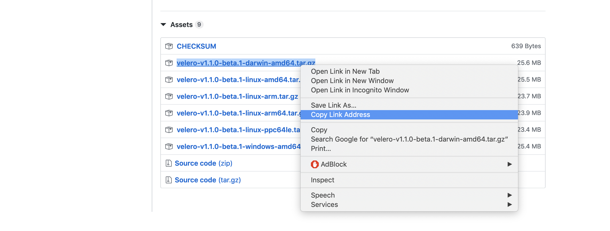
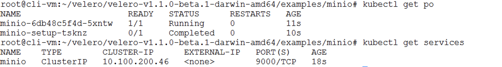
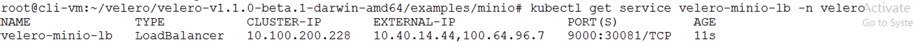
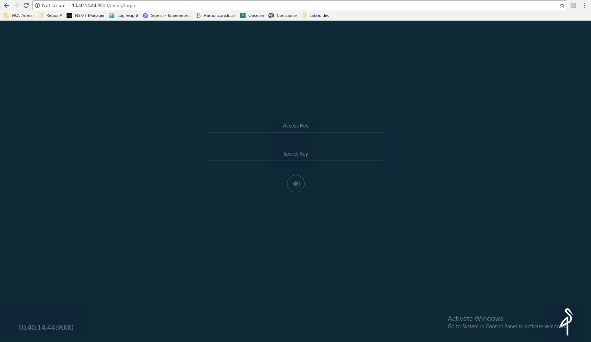
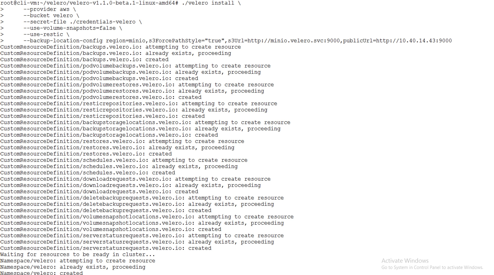
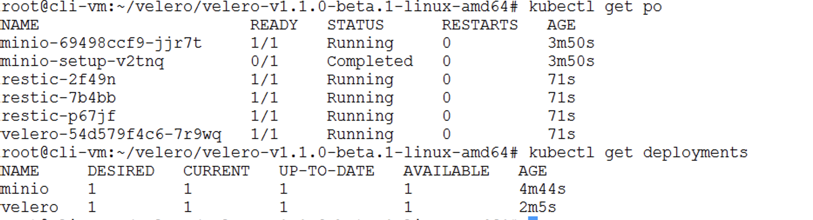
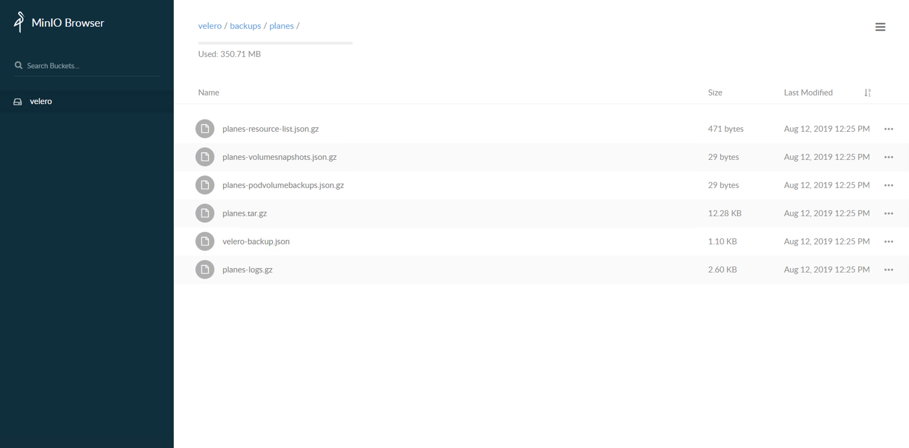

# PKS Backup and Restore using VMWare Heptio Velero

## Overview

### Heptio Velero
 - Heptio Velero (formerly Heptio Ark) gives you tools to back up and restore your Kubernetes cluster resources and persistent volumes. 

 - Velero Feature
   Take backups of your cluster and restore in case of loss.
   Copy cluster resources to other clusters.
   Backup and restore PV's
   Scheduled Backups
   Replicate your production environment for development and testing environments.
   Filtering (namespaces, resources, label selectors)
   Restore into different namespaces

- Velero Extensibility
  Hooks
  Plugins

- Velero consists of:
  A server that runs on your cluster
  A command-line client that runs locally

### Persistent Volumes 
  In this sample , Velero leverages vSphere Storage for Kubernetes to allow Minio to use enterprise grade persistent storage to store the backup.
  Persistent volumes requested by stateful containerized applications can be provisioned on vSAN, iSCSI, VVol, VMFS or NFS datastores.

  Kubernetes volumes are defined in Pod specifications. They reference VMDK files and these VMDK files are mounted as volumes when the container is running. When the Pod is deleted the Kubernetes volume is unmounted and the data in VMDK files persists.
  
  PKS deploys Kubernetes clusters with the vSphere storage provider already configured. 

  In order to use Persistent Volumes (PV) the user needs to create a PersistentVolumeClaim(PVC) which is nothing but a request for PVs. A claim must specify the access mode and storage capacity, once a claim is created PV is automatically bound to this claim. Kubernetes will bind a PV to PVC based on access mode and storage capacity but a claim can also mention volume name, selectors and volume class for a better match. This design of PV-PVCs not only abstracts storage provisioning and consumption but also ensures security through access control.

  Static Persistent Volumes require that a vSphere administrator manually create a (virtual disk) VMDK on a datastore, then create a Persistent Volume that abstracts the VMDK. A developer would then make use of the volume by specifying a Persistent Volume Claim.

  Dynamic Volume Provisioning
  With PV and PVCs one can only provision storage statically i.e. PVs first needs to be created before a Pod claims it. However, with the StorageClass API Kubernetes enables dynamic volume provisioning. This avoids pre-provisioning of storage and storage is provisioned automatically when a user requests it. The VMDK's are also cleaned up when the Persistent Volume Claim is removed.

  The StorageClass API object specifies a provisioner and parameters which are used to decide which volume plugin should be used and which provisioner specific parameters to configure.


## Prerequisites

- Please see [Getting Access to a PKS Ninja Lab Environment](https://github.com/CNA-Tech/PKS-Ninja/tree/master/Courses/GetLabAccess-LA8528) to learn about how to access or build a compatible lab environment
- PKS Install (https://github.com/CNA-Tech/PKS-Ninja/tree/master/LabGuides/PksInstallPhase2-IN1916)
- PKS Cluster (https://github.com/CNA-Tech/PKS-Ninja/tree/master/LabGuides/DeployFirstCluster-DC1610)
- Planespotter Application (https://github.com/CNA-Tech/PKS-Ninja/tree/master/LabGuides/BonusLabs/Deploy%20Planespotter%20Lab)

## Installation Notes

Anyone who implements any software used in this lab must provide their own licensing and ensure that their use of all software is in accordance with the software's licensing. This guide provides no access to any software licenses.

For those needing access to VMware licensing for lab and educational purposes, we recommend contacting your VMware account team. Also, the [VMware User Group's VMUG Advantage Program](https://www.vmug.com/Join/VMUG-Advantage-Membership) provides a low-cost method of gaining access to VMware licenses for evaluation purposes.

This lab follows the standard documentation, which includes additional details and explanations: [NSX-T 2.3 Installation Guide](https://docs.vmware.com/en/VMware-NSX-T/2.2/com.vmware.nsxt.install.doc/GUID-3E0C4CEC-D593-4395-84C4-150CD6285963.html)

### Overview of Tasks Covered in Lab 1
Take a backup of the planespotter namespace
Delete the planespotter app
Restore the planespotter namespace

- [Step 1: Download official release of Heptio Velero](#step-1--download-official-release-of-Heptio-Velero)
- [Step 2: Validate the planespotter app](#step-2--Validate-the-planespotter-app)
- [Step 3: Setup Velero](#step-3--Setup-Velero)
- [Step 4: Backup](#step-4--Backup)
- [Step 5: Delete the planespotter app](#step-5--Delete-the-planespotter-app)
- [Step 6: Restore](#step-6--Restore)

-----------------------

## Step 1:  Download official release of Heptio Velero

1.1 Navigate to the official release of the Heptio Velero release page (https://github.com/heptio/velero/releases) and copy the link for the target VM OS (Eg. https://github.com/heptio/velero/releases/tag/v1.1.0-beta.1) . At the botton of the page the official releases are listed Right click on the release link `Copy Link Address'

<Details><Summary>Screenshot 1.1</Summary>

</Details>
<br/>

1.2 ssh to the cli-vm and download and uncompress the Velero distribution 
  
```bash
mkdir velero
cd ~/velero
wget https://github.com/heptio/velero/releases/download/v1.1.0-beta.1/velero-v1.1.0-beta.1-linux-amd64.tar.gz
tar xvf velero-v1.1.0-beta.1-linux-amd64.tar.gz
```

## Step 2:  Validate the planespotter app

2.1 Login to pks witht he command , when prompted use the password as VMware1!

```bash
pks login -a pks.corp.local -u pksadmin --skip-ssl-validation
```


2.2 Pull down the kubernetes config and credentials for my-cluster with the command 

```bash
pks get-credentials my-cluster
```

2.3 Verify all the pods needed for the planespotter app - front-end, redis, DBC Sync services and App server (7 total) have been deployed and have entered Running state

```bash
kubectl get pods --namespace planespotter

kubectl get services --namespace planespotter
```

## Step 3:  Setup Velero

3.1 Set up prerequisites necessary to run the Velero server
- `velero` namespace


```bash
kubectl create ns velero
```

3.2 Now let us set our context to the namespace velero 

```bash
kubectl config set-context --current --namespace=velero
```


3.3 Create a Velero-specific credentials file (credentials-velero) in your local directory


```bash
cd ~/velero/velero-v1.1.0-beta.1-linux-amd64
```

<details><summary>credentials-velero</summary>

```yaml
[default]
aws_access_key_id = minio
aws_secret_access_key = minio123
```

</details>
<br/>

3.2 We are setting up a PV that velero can use to store the backups.
    Create a Storage Class. Create a 000-storage-class.yaml file and copy the below contents into it, save and exit.  

```bash
cd  ~/velero/velero-v1.1.0-beta.1-linux-amd64/examples/minio

nano 000-storage-class.yaml
```

<details><summary>000-storage-class.yaml</summary>

```yaml
---
kind: StorageClass
apiVersion: storage.k8s.io/v1
metadata:
  name: minio-disk
provisioner: kubernetes.io/vsphere-volume
parameters:
    diskformat: thin
```

</details>
<br/>

```bash
kubectl apply -f 000-storage-class.yaml

```

3.3 Create a Persistent Volume Claim . Create a 001-velero-pvc.yaml file and copy the below contents into it, save and exit. 

```bash
nano 001-velero-pvc.yaml

```

<details><summary>01-velero-pvc.yaml</summary>

```yaml
---
kind: PersistentVolumeClaim
apiVersion: v1
metadata:
  name: velero-claim
  namespace: velero
  annotations:
    volume.beta.kubernetes.io/storage-class: minio-disk
spec:
  accessModes:
    - ReadWriteOnce
  resources:
    requests:
      storage: 10Gi
```

</details>
<br/>


```bash
kubectl apply -f 001-velero-pvc.yaml

```

3.4 Login to vCenter to and check if the PV has been provisioned under kubevols

<details><summary>Screenshot 3.4</summary>

</details>
<br/>

3.5 Edit the 00-minio-deployment.yaml to change the storage to add the persistentvolume created in the previous step. The change is the below

      - name: storage
        persistentVolumeClaim:
          claimName: velero-claim

<details><summary>00-minio-deployment.yaml</summary>

```yaml
# Copyright 2017 the Velero contributors.
#
# Licensed under the Apache License, Version 2.0 (the "License");
# you may not use this file except in compliance with the License.
# You may obtain a copy of the License at
#
#     http://www.apache.org/licenses/LICENSE-2.0
#
# Unless required by applicable law or agreed to in writing, software
# distributed under the License is distributed on an "AS IS" BASIS,
# WITHOUT WARRANTIES OR CONDITIONS OF ANY KIND, either express or implied.
# See the License for the specific language governing permissions and
# limitations under the License.

---
apiVersion: v1
kind: Namespace
metadata:
  name: velero

---
apiVersion: apps/v1
kind: Deployment
metadata:
  namespace: velero
  name: minio
  labels:
    component: minio
spec:
  strategy:
    type: Recreate
  selector:
    matchLabels:
      component: minio
  template:
    metadata:
      labels:
        component: minio
    spec:
      volumes:
      - name: storage
        persistentVolumeClaim:
          claimName: velero-claim
      - name: config
        emptyDir: {}
      containers:
      - name: minio
        image: minio/minio:latest
        imagePullPolicy: IfNotPresent
        args:
        - server
        - /storage
        - --config-dir=/config
        env:
        - name: MINIO_ACCESS_KEY
          value: "minio"
        - name: MINIO_SECRET_KEY
          value: "minio123"
        ports:
        - containerPort: 9000
        volumeMounts:
        - name: storage
          mountPath: "/storage"
        - name: config
          mountPath: "/config"

---
apiVersion: v1
kind: Service
metadata:
  namespace: velero
  name: minio
  labels:
    component: minio
spec:
  # ClusterIP is recommended for production environments.
  # Change to NodePort if needed per documentation,
  # but only if you run Minio in a test/trial environment, for example with Minikube.
  type: ClusterIP
  ports:
    - port: 9000
      targetPort: 9000
      protocol: TCP
  selector:
    component: minio
---
apiVersion: batch/v1
kind: Job
metadata:
  namespace: velero
  name: minio-setup
  labels:
    component: minio
spec:
  template:
    metadata:
      name: minio-setup
    spec:
      restartPolicy: OnFailure
      volumes:
      - name: config
        emptyDir: {}
      containers:
      - name: mc
        image: minio/mc:latest
        imagePullPolicy: IfNotPresent
        command:
        - /bin/sh
        - -c
        - "mc --config-dir=/config config host add velero http://minio:9000 minio minio123 && mc --config-dir=/config mb -p velero/velero"
        volumeMounts:
        - name: config
          mountPath: "/config"

```

</details>
<br/>

3.4 Create the minio deployment

```bash
kubectl apply -f 00-minio-deployment.yaml
```

3.5 Check  the minio services and pods 

```bash
kubectl get po
kubectl get services
```
<details><summary>Screenshot 3.5</summary>

</details>
<br/>


3.6 Expose the minio with the following command

```bash
kubectl expose deployment minio --name=velero-minio-lb --port=9000 --target-port=9000 --type=LoadBalancer --namespace=velero

```

3.7 Check the external URL/IP address assigned to the service (make note of the first IP addres under External-IP).

```bash
kubectl get service velero-minio-lb -n velero

```
<details><summary>Screenshot 3.7</summary>

</details>
<br/>

3.8 Copy the IP under the "External-IP" section . Point your browser to that location <external-ip>:9000. You should be able to view the minio browser

<details><summary>Screenshot 3.8</summary>

</details>
<br/>


3.9 Start the server and the local storage service. Velero does not support vSphere currently so we are going to be using Restic. We will also be supplying the credentials file for minio that we created in the previous step. We will also be proividing the url to the minio service that we exposed as a loadbalancer in the previous step.


```bash
./velero install \
     --provider aws \
     --bucket velero \
     --secret-file ./credentials-velero \
     --use-volume-snapshots=false \
     --use-restic \
     --backup-location-config region=minio,s3ForcePathStyle="true",s3Url=http://minio.velero.svc:9000,publicUrl=http://10.40.14.43:9000
```

<details><summary>Screenshot 3.9</summary>

</details>
<br/>

3.10 Check status of the installation


```bash
kubectl get po
kubectl get deployments

```

<details><summary>Screenshot 3.10</summary>

</details>
<br/>


## Step 4:  Backup

4.1 Point your browser to that location <external-ip>:9000. You should be able to view the minio browser. Login as Access Key as minio and Secret Key as minio123

<Details><Summary>Screenshot 4.1</Summary>

</Details>
<br/>

4.2 SSH into cli-vm 
  
```bash

cd ~/velero

```

NOTE: Steps 4.3 aand 4.4 are optional and require to be used for PV's / Stateful applications

4.3 Run the following to annotate each pod that contains a volume to back up
  
```bash

kubectl -n YOUR_POD_NAMESPACE annotate pod/YOUR_POD_NAME backup.velero.io/backup-volumes=YOUR_VOLUME_NAME_1,YOUR_VOLUME_NAME_2,...

```

4.4 Run the following to get the pod's that are running in the planespotter namespace
  
```bash

kubectl get pods --namespace planespotter

```


4.5 For the planespotter app , mysql is the stateful pod that would need to be annotated. (Valumes from mysql_pod.yaml in the planespotter app)
 
```bash

kubectl -n planespotter annotate pod/<mysql pod name from 4.3 eg. mysql-0> backup.velero.io/backup-volumes=mysql-vol,mysql-config,mysql-start

```

4.6 Take a backup of the planespotter namespace. The backup will be called planes

```bash

./velero backup create planes --include-namespaces planespotter

```


4.7 Valero will prompt the following . Check the status of the backup using the commands below

```bash

Backup request "planes" submitted successfully.
Run `./velero backup describe planes` or `velero backup logs planes` for more details.

```

4.8 Refresh the minio browser annd you will be able to view the backup that was created by velero. Velero creates a set of tar.gz files as backup.

<Details><Summary>Screenshot 4.8</Summary>

</Details>
<br/>

<Details><Summary>Screenshot 4.8.1</Summary>

</Details>
<br/>

<Details><Summary>Screenshot 4.8.2</Summary>

</Details>
<br/>


4.9 For a backup with PV a restic folder will be created in addition.

<Details><Summary>Screenshot 4.9</Summary>

</Details>
<br/>


4.10 Optional: You can download the backup files to the local laptop if required by clicking on the button to the left of the archive and clicking on download object. This is useful to restore to a different environment or other use cases where your VCenters are different.

<Details><Summary>Screenshot 4.10</Summary>

</Details>
<br/>


4.11 Optional: Other important commands

```bash

velero backup create planes-backup --selector app=planespotter
velero backup create planes-backup --selector 'backup notin (ignore)'
velero schedule create planes-daily --schedule="0 1 * * *" --selector app=planespotter
velero schedule create planes-daily --schedule="@daily" --selector app=planespotter

```

## Step 5:  Delete the planespotter app

5.1 Optional: Check the Persistent Volumes
 
```bash

kubectl get pv 

```
<Details><Summary>Screenshot 5.1</Summary>

</Details>
<br/>


5.2 Delete the planespotter namespace
 
```bash

kubectl delete ns planespotter

```

5.3 Check if the planespotter application is still running. Make sure that none of the planespotter app pods are running . Also make sure that the planespotter namespace does not exist

```bash

kubectl get po --all-namespaces

```

<Details><Summary>Screenshot 5.2</Summary>

</Details>
<br/>

5.4 Check if the PV has been deleted

```bash

kubectl get pv

```

<Details><Summary>Screenshot 5.4</Summary>

</Details>
<br/>


5.5 Check if the planespotter application is still running. Make sure that none of the planespotter app pods are running . Also make sure that the planespotter namespace does not exist

```bash

kubectl get po --all-namespaces

```

<Details><Summary>Screenshot 5.2</Summary>

</Details>
<br/>


## Step 6:  Restore 

6.1 SSH into cli-vm 
  
```bash

cd ~/velero

```

6.2 Restore planespotter

```bash

 ./velero restore create --from-backup planes

```

6.3 Valero will prompt the following . Check the status of the backup using the commands below

```bash

Restore request "planes-20190424130220" submitted successfully.
Run `velero restore describe planes-20190424130220` or `velero restore logs planes-20190424130220` for more details.

```

6.4 Verify all the pods needed for the planespotter app - front-end, redis, DBC Sync services and App server (7 total) have been deployed and have entered Running state

```bash
kubectl get pods --namespace planespotter

kubectl get services --namespace planespotter

kubectl get pv
```

<Details><Summary>Screenshot 6.4</Summary>

</Details>
<br/>

<Details><Summary>Screenshot 6.4.1</Summary>

</Details>
<br/>


6.5 Point the browser at the external ip of the loadbalancer of the planespotter app. 

<Details><Summary>Screenshot 6.5</Summary>

</Details>
<br/>


### You have now completed deploying the velero app, and taking a app backup and restored the same.
