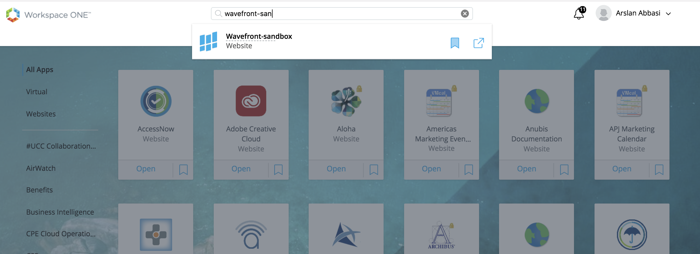
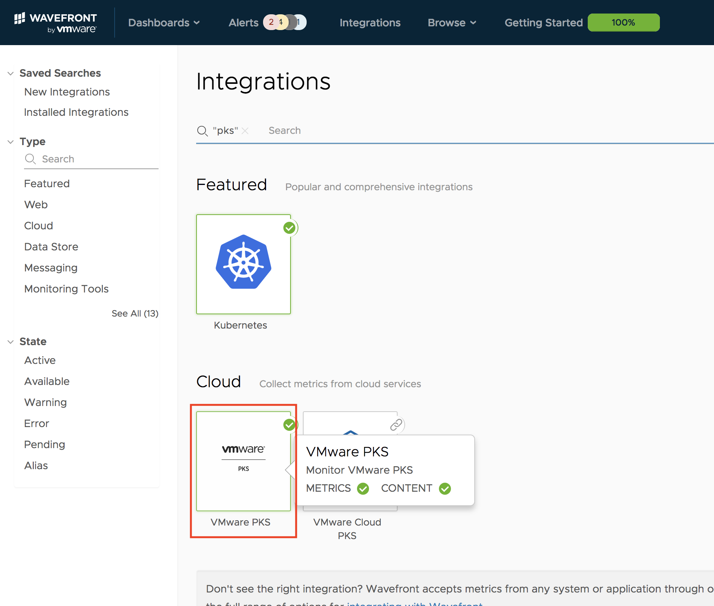
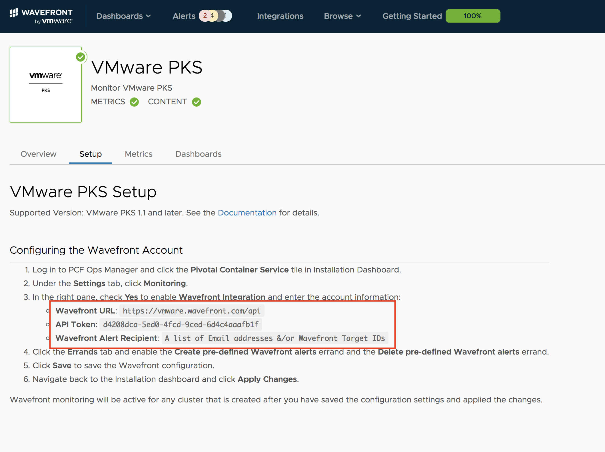
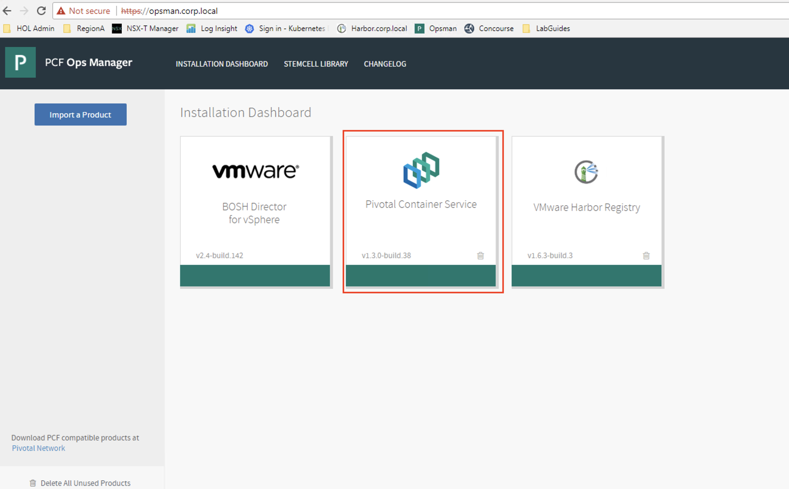
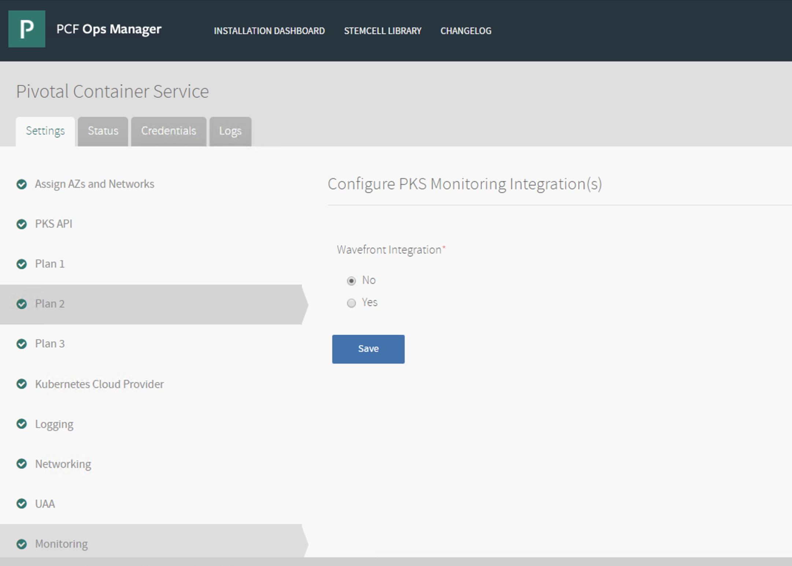
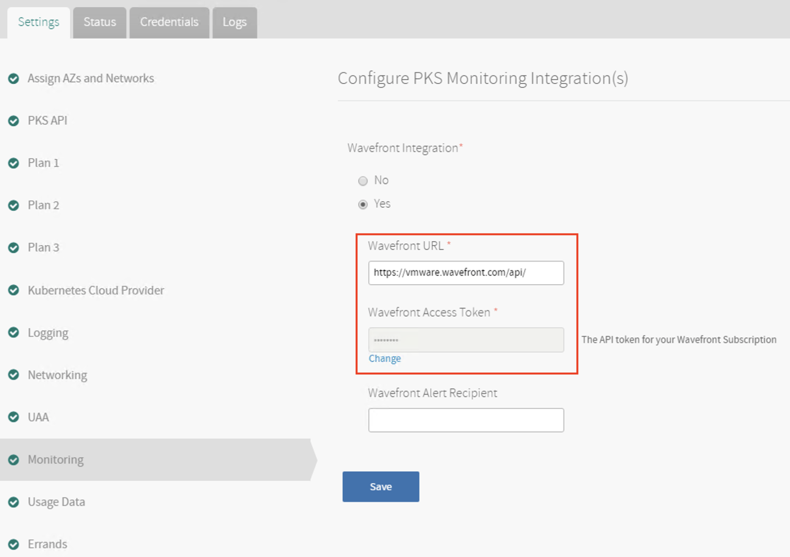
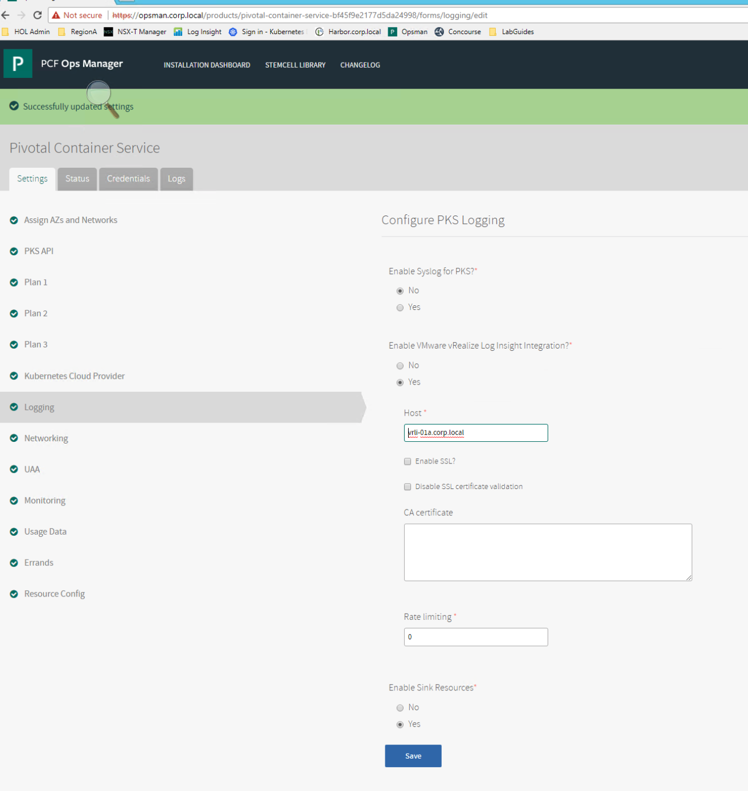
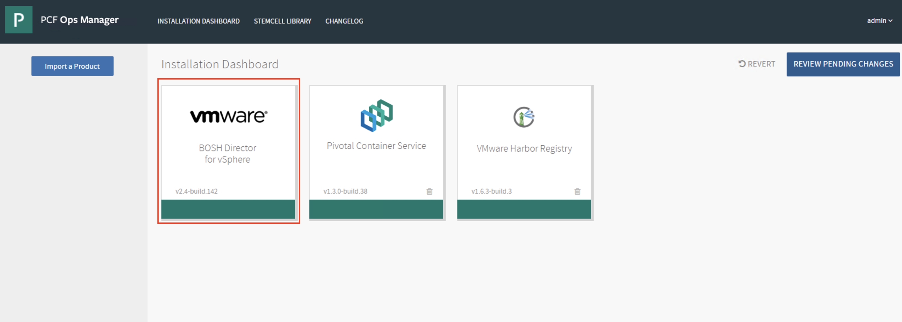
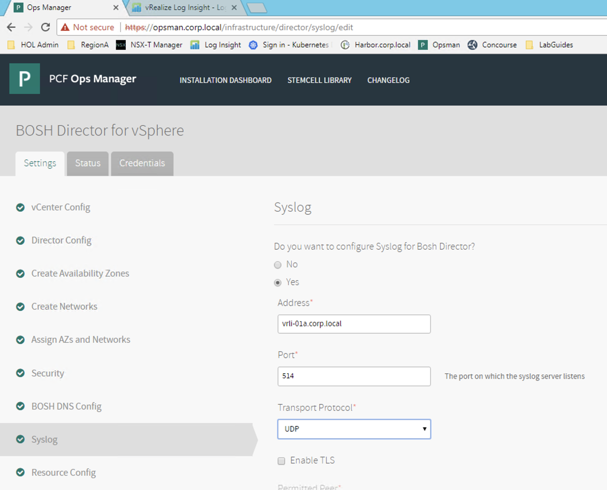
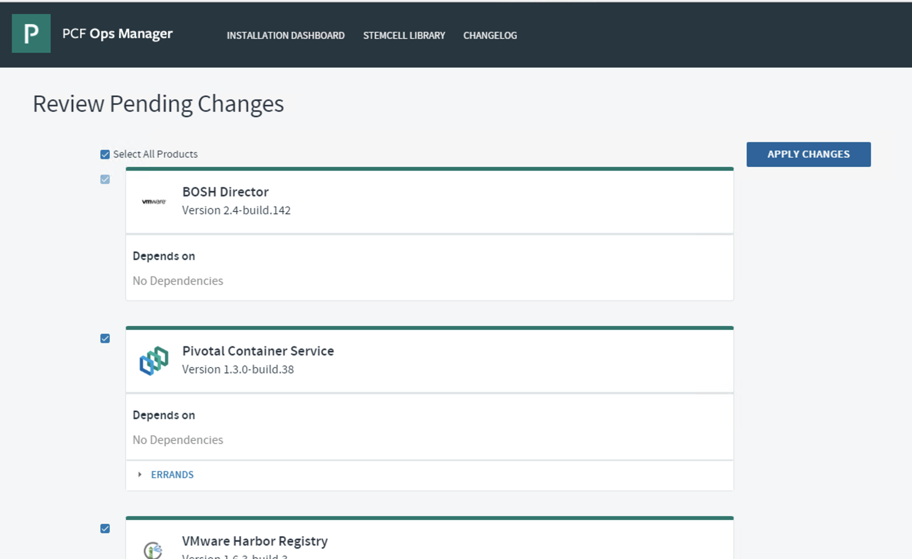

# PKS Intro to PKS Monitoring & Operations

### 1.1 Configure Wavefront in Ebterprise PKS

1.1.1 Go to Workspace ONE and search for "Wavefront-sandbox"

<details><summary>Screenshot 1.1.1</summary>

</details>
<br/>

1.1.2 Navigate to Integrations Page in Wavefront and search for "PKS"

<details><summary>Screenshot 1.1.2</summary>

</details>
<br/>

1.1.3 Open the PKS Integration. Navigate to the setup tab inside PKS. Copy the "Wavefront URL" and the "API Token"

<details><summary>Screenshot 1.1.3</summary>

</details>
<br/>

1.1.4 Navigate to Ops Manager at the "opsman.corp.local" and open the PKS Tile

<details><summary>Screenshot 1.1.4</summary>

</details>
<br/>

</details>
<br/>

1.1.5 Select the monitoring tab to open the Wavefront integration page

<details><summary>Screenshot 1.1.5</summary>

</details>
<br/>

1.1.6 Prepare `cli-vm` with Harbor's certificate which is required for a client to connect to Harbor. Follow the instructions in [Enable Harbor Client Secure Connections](https://github.com/CNA-Tech/PKS-Ninja/tree/master/LabGuides/HarborCertExternal-HC7212) and then return to this lab guide and proceed with the following step. 

<details><summary>Screenshot 1.1.6</summary>

</details>
<br/>

1.1.7 From the `cli-vm` prompt, push the updated mysql image to Harbor with the following commands:

```bash
docker login harbor.corp.local # Enter username: admin password: VMware1!
docker push harbor.corp.local/library/mysql:5.6
```

<details><summary>Screenshot 1.1.6</summary>

</details>
<br/>

1.1.7 Click on the Logging section and enter the following settings:

- Enable Syslog for PKS: No
- Enable VMware vRealize Integration: Yes
- Host: vrli-01a.corp.local
- Enable Sink Resources: Yes
- Click Save

<details><summary>Screenshot 1.1.7</summary>

</details>
<br/>

1.1.8 From the Ops Manager Home page click on the `BOSH Director for vSphere` tile.

<details><summary>Screenshot 1.1.8</summary>

</details>
<br/>

1.1.9 Click on the Syslog tab and enter the following details:

- Do you want to configure syslog for BOSH Director?: Yes
- Address: vrli-01a.corp.local
- Port: 514
- Transport Protocol: UDP

<details><summary>Screenshot 1.1.9</summary>

</details>
<br/>

1.1.10 Return to the Ops Manager Homepage and click `Review Pending Changes`, and then click apply changes. You will need to wait for the redeploy to complete before being able to make use of the updated settings, this could take up to an hour to complete.

<details><summary>Screenshot 1.1.10</summary>

</details>
<br/>
