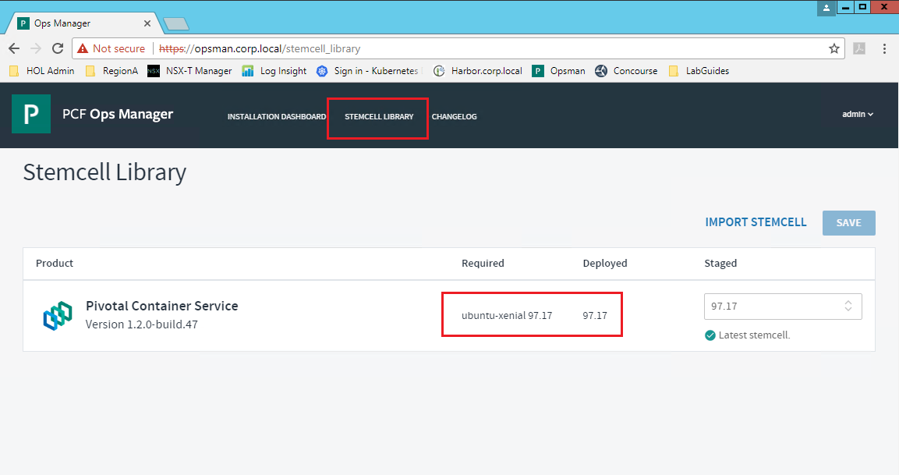
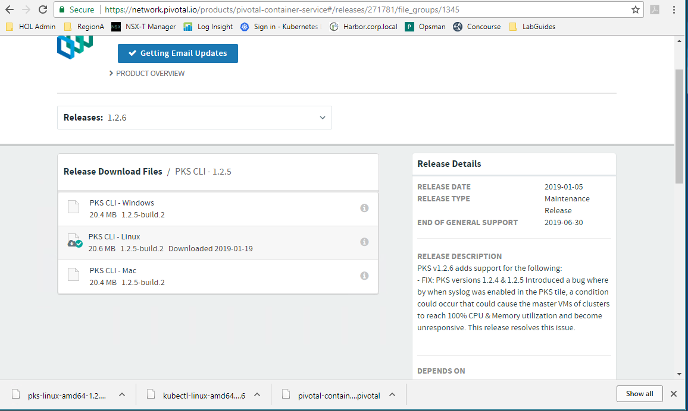
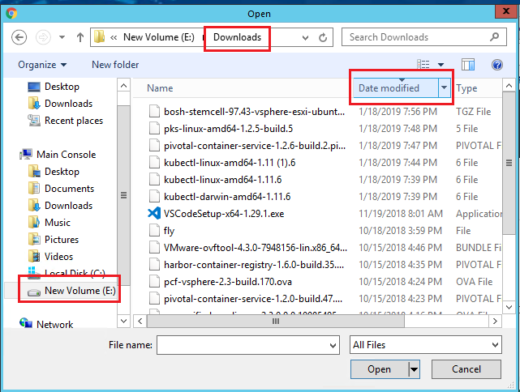
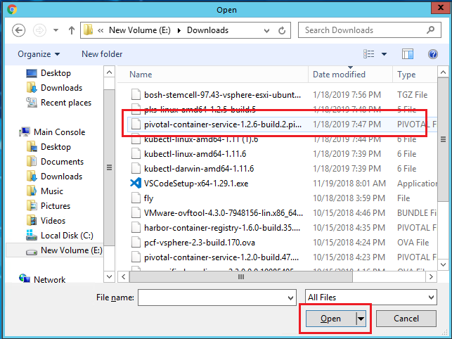
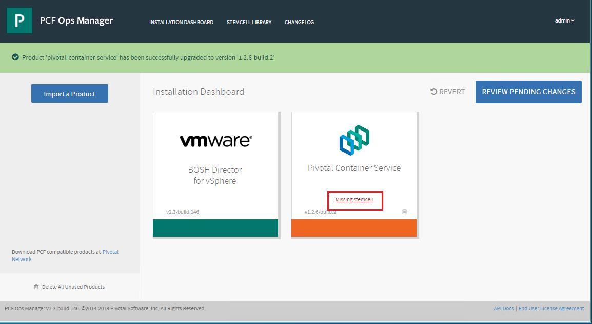
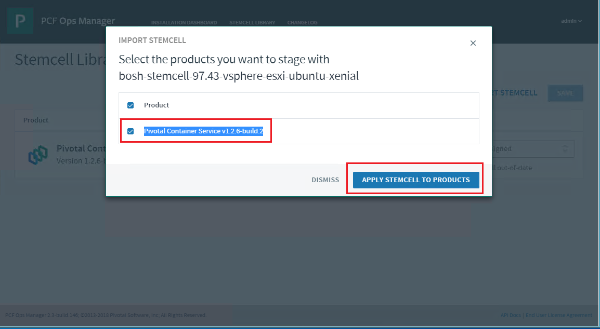
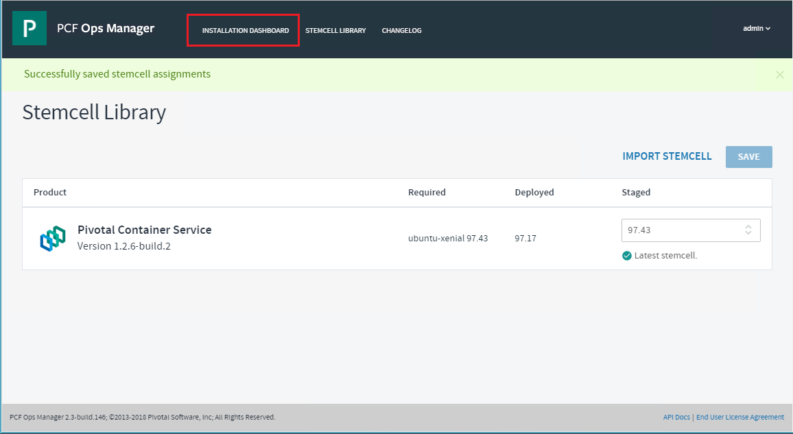
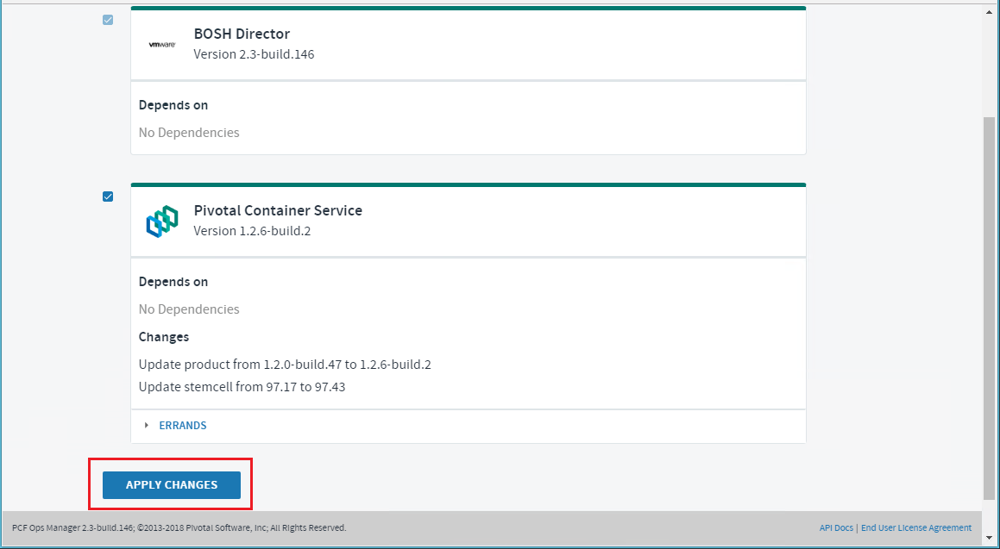

# Lab - PKS Upgrade

## Contents

- [Prereqs](#prereqs)
- [Step 1: Review Current Versions Detail](#step-1-review-current-versions-detail)
- [Step 2: Prepare for PKS Upgrade](#step-2-prepare-for-pks-upgrade)
- [Step 3: Upgrade PKS Tile](#step-3-upgrade-pks-tile)
- [Step 4: Update CLI Tools](#step-4-update-cli-tools)
- [Step 5: Verify Kubernetes Upgrade](#step-5-verify-kubernetes-upgrade)
- [Summary](#summary)


## Prereqs

For this lab, you will need access to the ControlCenter desktop, a working PKS deployment at release version current-1, or lower, and a PKS deployed kubernetes cluster.

You will need an account on PivNet to download udpate tile and stemcells. If you do not have a PivNet account, follow the directions to create one here: https://account.run.pivotal.io/z/uaa/sign-up

_Versions of PKS referred to in this lab guide may differ form the version you use to upgrade. For a protocred lab, your lab proctor will instruct you on the versions to use. For a non-proctored lab, you will need to determine the next viable upgrade version and adjust._

## Step 1: Review Current Versions Detail

1.1 From the ControlCenter desktop, login to Opsman from the browser with username `admin` and pasword `VMware1!`

<details><summary>Screenshot 1.1</summary></details><br>

1.2 View the BOSH Director and PKS Tile versions _(In this case, the versions are v2.3-build.146 and v1.2.0.build.47)_ When you upgrade PKS, you need to know the specific versions of BOSH and PKS you are running in order to know which version you can move up to. If you are upgrading at each release _(and you should be)_ , this is not a necessary check.

<details><summary>Screenshot 1.2</summary></details><br>

1.3 View the current stemcell version. From the Opsman dashboard, click on `Stemcell Library`

<details><summary>Screenshot 1.3</summary></details><br>

1.4 Sign into Pivnet and access the PKS 1.2.0 release page at _(Right click and open in new tab)_
https://network.pivotal.io/products/pivotal-container-service#/releases/191865. 

_NOTE: If you don't have a pivnet account, create one per the instructions_


<details><summary>Screenshot 1.4</summary></details><br>

1.5 Scroll down and review the release details. You'll notice that version 1.2.0 includes Kubernetes 1.11.2, AWS EC2 support, NSX-T 2.3 integration, etc., and that the required stemcell version is 97.17. You can click on `Release Notes*` for extended information. Compare these versions to the information you collected above.

<details><summary>Screenshot 1.5</summary></details><br>

1.6 Scroll up and select release 1.2.6 from the `Releases` dropdown list

<details><summary>Screenshot 1.6</summary></details><br>

1.7 Scroll down and review the `Depends On` and `Upgrades From` sections in the Relase Details pane. Notice that this release can upgrade from PKS release 1.2.0 and that it depends on a one of a number of BOSH release versions. Notice that the stemcell version will need to be upgraded as well.

_NOTE: Based on the versions we observed above, we are ok to upgrade from PKS v1.2.0.build.47 but we are not ok to upgrade based on BOSH v2.3-build.146 (You can click on the depends on and upgrades from links to determine the equivelant build numbers). In real use, we would upgrade BOSH before upgrading PKS. To save time in the lab, we will upgrade PKS with the current version of BOSH._

<details><summary>Screenshot 1.7</summary></details><br>

1.8 Open a `Putty `session to `cli-vm` (if it's not already open). Submit the command `kubectl get nodes` to view the current version of your kubernetes cluster

_NOTE: If you receive an error, log back into to PKS controller and submit the get-credentials command for your cluster. (e.g. `pks login -a pks.corp.local -u pks-admin -p VMware1! --skip-ssl-validation` -> `pks get-credentials my-cluster`)_

<details><summary>Screenshot 1.8</summary></details><br>

## Step 2: Prepare for PKS Upgrade

Now that we know which versions we're on and which version we can upgrade to, the next step is to download the required files.

2.1 From the Pivnet PKS release 1.2.6 download page, download the `Pivotal Container Service` file

<details><summary>Screenshot 2.1</summary></details><br>

2.2 Click on `Kubectl CLI - 1.11.6`

<details><summary>Screenshot 2.2</summary></details><br>

2.3 Click on `Kubectl 1.11.6 - Linux`

<details><summary>Screenshot 2.3</summary></details><br>

2.4 Click browser `Back` button and then `PKS CLI - 1.2.5`

<details><summary>Screenshot 2.4</summary></details><br>

2.5 Click `PKS CLI - Linux`

<details><summary>Screenshot 2.5</summary></details><br>

2.6 Scroll down and click on the `97.43` stemcell link in the Release Details pane

<details><summary>Screenshot 2.6</summary></details><br>

2.7 Click on `Ubuntu Xenial Stemcell for vSphere 97.43`

<details><summary>Screenshot 2.7</summary></details><br>

## Step 3: Upgrade PKS Tile

3.1 From the Opsman dashboard, click on `Import Product`

<details><summary>Screenshot 3.1</summary></details><br>

3.2 Click on `New Volumes (E:)` -> `Downloads` and then sort by `Date modfied`

<details><summary>Screenshot 3.2</summary></details><br>

3.3 Select `pivotal-container-service-1.2.6-build.2.pivotal` and click on `Open`

<details><summary>Screenshot 3.3.1</summary></details>

_NOTE: It can take a few minutes for the tile to import, based on lab environment. If it takes longer, hit your browser refresh_

<details><summary>Screenshot 3.3.2</summary></details><br>

3.4 Click on the `+` symbol in the left pane, next to the PKS tile you just imported

<details><summary>Screenshot 3.4</summary></details><br>

3.5 Click on `Missing stemcell` in the added PKS tile

<details><summary>Screenshot 3.5</summary></details><br>

3.6 Click on `Import Stemcell`

<details><summary>Screenshot 3.6</summary></details><br>

3.7 Select `bosh-stemcell-97.43-vsphere-esxi-ubuntu-xenial-go_agent.tgz` and click `Open`

<details><summary>Screenshot 3.7.1</summary></details>
<details><summary>Screenshot 3.7.2</summary></details><br>

3.8 Apply the stemcell to `Product: Pivotal Container Service v1.2.6-build.2`

_NOTE: You will probably have the option to apply to Harbor, based on which labs you have completed. You can apply this only to PKS to save time_

<details><summary>Screenshot 3.8</summary></details><br>

3.9 Click on `Installation Dashboard`

<details><summary>Screenshot 3.9</summary></details><br>

3.10 

Clcik on `Reviewing Pending Changes`

<details><summary>Screenshot 3.10</summary></details><br>

3.11

Click `Apply Changes` and continue to the next step

<details><summary>Screenshot 3.11.1</summary></details>
<details><summary>Screenshot 3.11.2</summary></details><br>

## Step 4: Upgrade CLI Tools

In this section, you will copy the updated pks and kubectl CLI tools to your CLI VM. When you upgrade a PKS version, you are upgrading your Kubernetes and PKS API versions. This requires an update to the CLI tools you use to interact with the services. We will use the Putty pscp utility to copy the files we downloaded to the cli-vm and then make the necessary permission changes in Linux

4.1 From the ControlCenter desktop, open a Windows command prompt

<details><summary>Screenshot 4.1</summary></details><br>

4.2 Execute the following command to update the `pks` cli tool

```
pscp E:\Downloads\pks-linux-amd64-1.2.5-build.5 root@cli-vm.corp.local:/usr/local/bin/pks
```
<details><summary>Screenshot 4.2</summary></details><br>

4.3 Type `y` and `Enter` to accept the cli-vm key

<details><summary>Screenshot 4.3</summary></details><br>

4.4 From the ControlCenter command prompt, execute the following command to update the `kubectl` cli tool

```
pscp E:\Downloads\kubectl-linux-amd64-1.11.6 root@cli-vm.corp.local:/usr/local/bin/kubectl
```

<details><summary>Screenshot 4.4</summary></details><br>

## Step 5: Verify  Upgrade

5.1 Check on the Opsman deployment of the PKS update and ensure that it has completed successfully. Click on `Return to Dashboard`. Notice the PKS tile version maintains upgraded version after successful deployment.

<details><summary>Screenshot 5.1.1</summary></details>
<details><summary>Screenshot 5.1.2</summary></details><br>

5.2 Open a `Putty `session to `cli-vm` (if it's not already open). Submit the command `kubectl get nodes` to view the upgraded version of your kubernetes cluster

_NOTE: If you receive an error, log back into to PKS controller and submit the get-credentials command for your cluster. (e.g. `pks login -a pks.corp.local -u pks-admin -p VMware1! --skip-ssl-validation` -> `pks get-credentials my-cluster`)_

5.3 Observe the upgraded version of Kubernetes with the `kubectl get nodes` command. You should see that you've upgraded your Kubernetes clusters from 1.11.2 to 1.11.6. 

<details><summary>Screenshot 5.3</summary></details><br>


## Summary

You have successfully upgraded the PKS and Kuberbetes environment. The PKS control plane is now updated and the Kubernetes clusters are running secured, validated, and updated versions of Linux and Kubernetes. Your replica set pods continued to run throughout the upgrade as a result of the BOSH canary upgrade process. You should be enabled to apply the above process to upgrading any version of PKS.

