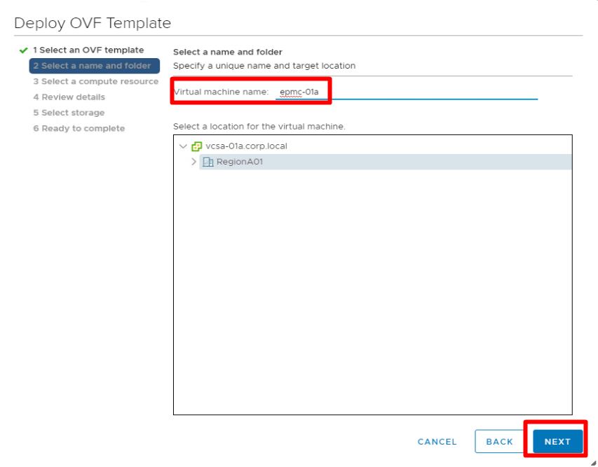
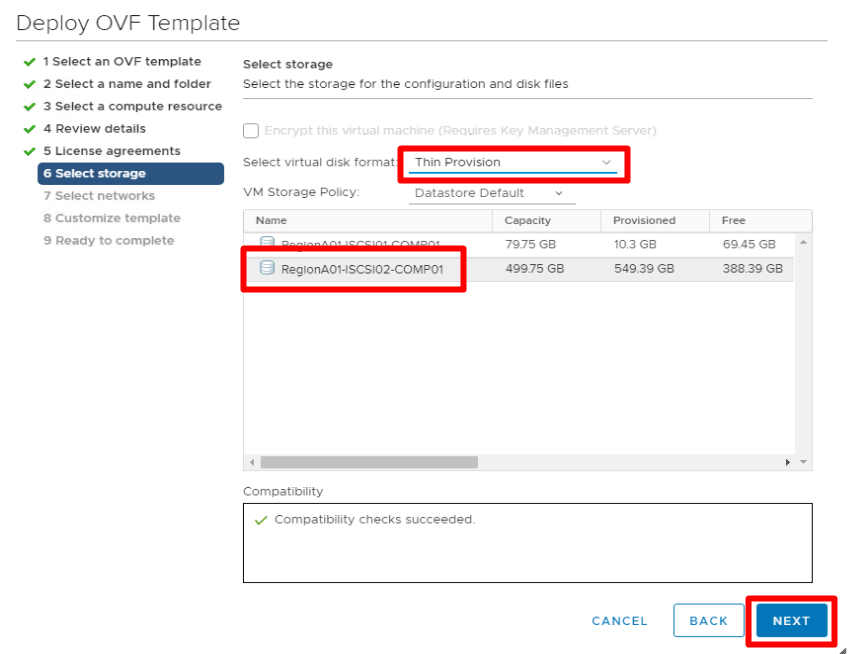
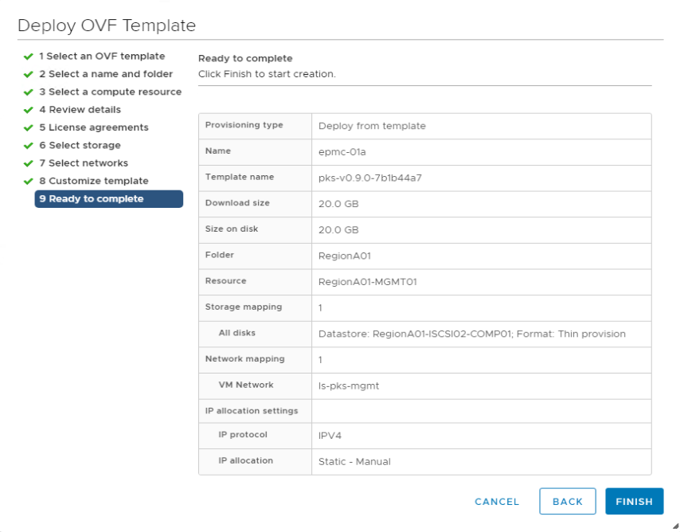
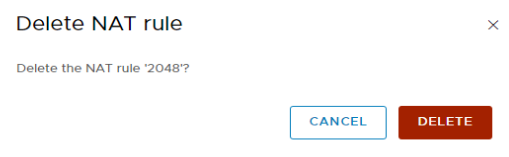
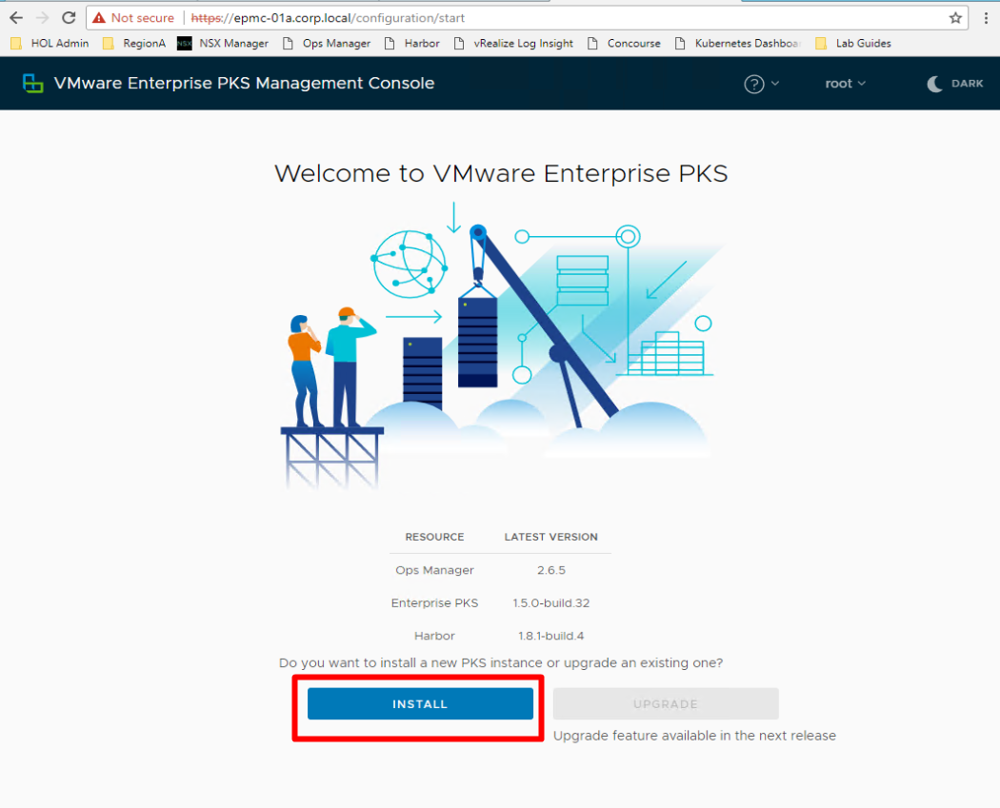
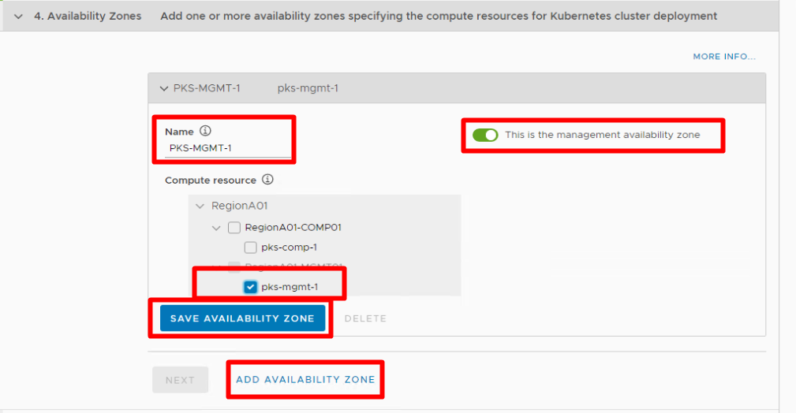
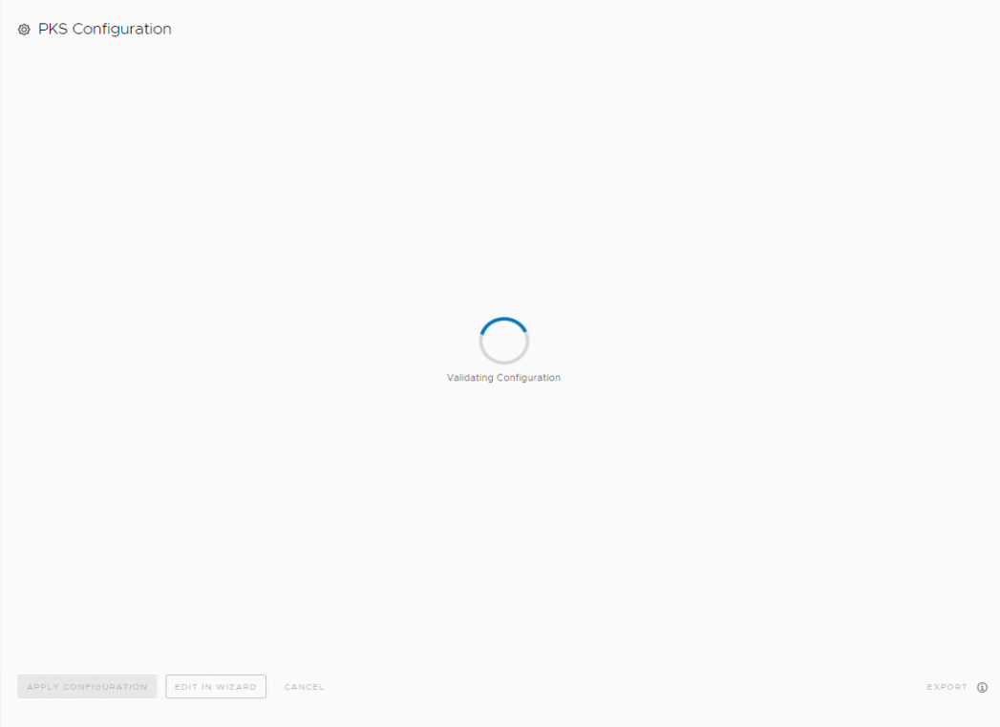
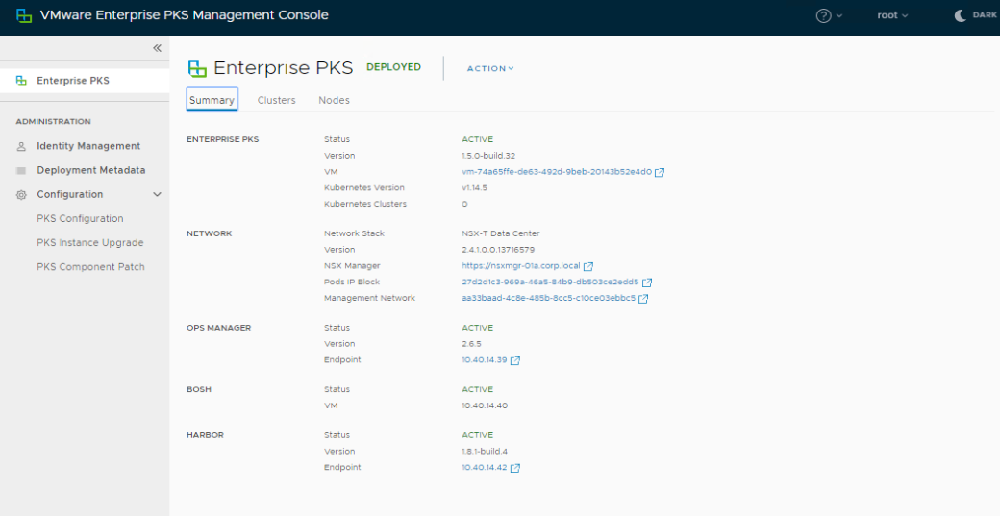
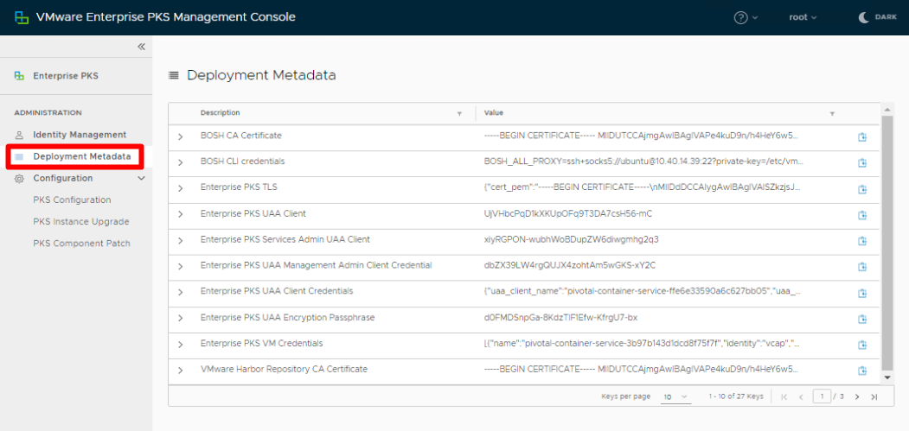
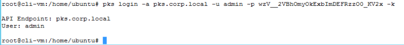

# PKS 1.5 Installation with the VMware Enterprise PKS Management Console Beta

**Note: VMware Enterprise PKS Management Console (EPMC) is currently in Beta, and users of this lab guide will need to use thier own access to installation files. Access to this software is not provided with this lab guide or with any of the available lab templates. VMware employees can find further details about accessing this software on the #pks_gear2_support channel in the VMware employee slack domain, external users will need to inquire with their VMware account representative to see if they are eligible for access to the Beta.**

**Table of Contents**

- [PKS 1.5 Installation with the VMware Enterprise PKS Management Console Beta](#pks-15-installation-with-the-vmware-enterprise-pks-management-console-beta)
  - [Lab Access Instructions](#lab-access-instructions)
  - [Prerequisites](#prerequisites)
  - [Install PKS 1.5 with Enterprise PKS Management Console (EPMC)](#install-pks-15-with-enterprise-pks-management-console-epmc)
    - [Step 1: Download EPMC OVF File](#step-1-download-epmc-ovf-file)
    - [Step 2: Deploy the EPMC OVF File](#step-2-deploy-the-epmc-ovf-file)
    - [Step 3: Clean out old NAT rules andCreate NAT Rules to Connect to the epmc-01a web UI](#step-3-clean-out-old-nat-rules-andcreate-nat-rules-to-connect-to-the-epmc-01a-web-ui)
    - [Step 4: Complete the installation workflow](#step-4-complete-the-installation-workflow)

## Lab Access Instructions

Please see [Getting Access to a Lab Environment](https://github.com/CNA-Tech/PKS-Ninja/tree/Pks1.4/Courses/GetLabAccess-LA8528) for instructions on accessing lab environments. The HOL-2031 template already has PKS 1.4.1 pre-installed and is not compatible with this lab guide. 

Please see the prerequisites section below for mandatory steps you will need to follow to complete this lab guide.

## Prerequisites

This lab guide is compatible with the PKS-Ninja-v12-NsxtReady or the PKS-Ninja-v12-Baseline templates. You can use the NsxtReady template if you prefer to just do the PKS installation, or use the Baseline template if you would prefer to perform an NSX-T installation as well as the PKS 1.5 installation. 

Please follow the instructions below for the template you are using prior to proceeding, per the following instructions:

<b>Expand this section for instructions to prepare the PKS-Ninja-v12-NsxtReady template for this Lab Guide</b>

This lab guide is prepared based on the PKS-Ninja-v12-NsxtReady template. If you are using PKS-Ninja-v12-NsxtReady-0.3 or older v12-NsxtReady template, you will need to patch your template per the instructions in [Issue #507](https://github.com/CNA-Tech/PKS-Ninja/issues/507). If you are using the PKS-Ninja-v12-NsxtReady-0.4 or newer template, you do not need to worry about applying this patch. 

After patching the template (if needed), you can proceed to the next section.

 

<b>Expand this section for instructions to prepare the PKS-Ninja-v12-Baseline template for this Lab Guide</b>

If you would prefer to go through the NSX-T Installation and/or Preparation steps to configure NSX-T for a PKS 1.5 Installation with Enterprise PKS Management Console (EPMC), you have a choice on how to proceed. EPMC includes the ability to install PKS into environments with only a very basic NSX-T installation and it will automate the entire configuration of NSX-T for PKS, or alternatively, EPMC also includes the ability to install PKS on environments where NSX-T has a been pre-configuration for PKS installation. At this time, this guide only includes instructions for Installing PKS 1.5 with EPMC on environments where NSX-T is pre-configured for Enterprise PKS installation. 

In either case, if you are using PKS-Ninja-v12-Baseline-0.5 or older v12-Baseline template, you will need to patch your template per the instructions in [Issue #507](https://github.com/CNA-Tech/PKS-Ninja/issues/507).

  

<b>Expand this section if you would like to complete a basic NSX-T installation and use EPMC to both configure NSX-T for PKS and Install PKS 1.5</b>

  If you would like to try the first option to use EPMC using the option to install on a base NSX-T install, the environment should support it and it should not be difficult, we just havent had the time to verify or include specific instructions in this lab guide yet. This lab guide only currently includes specific instructions for the v12-NsxtReady template and for users who use a v-12 Baseline template and complete both the [NSX-T 2.4 Manual Installation](https://github.com/CNA-Tech/PKS-Ninja/tree/Pks1.4/LabGuides/NsxtManualInstall-IN1497) and the [NSX-T Configuration for PKS](https://github.com/CNA-Tech/PKS-Ninja/tree/Pks1.4/LabGuides/NsxtConfigForPks-NC5947) Lab Guides.

  First you will need to complete the [NSX-T 2.4 Manual Installation Lab Guide](https://github.com/CNA-Tech/PKS-Ninja/tree/Pks1.4/LabGuides/NsxtManualInstall-IN1497) to complete the base NSX-T base install. 

  Next, you can use EPMC to automate the NSX-T Configuration for PKS and Install PKS 1.5, specific instructions are not currently provided in this lab guide, however you can reference the [Using the Enterprise PKS Management Console](https://docs.vmware.com/en/VMware-Enterprise-PKS/1.5/vmware-enterprise-pks-15/GUID-console-console-index.html) section in the [Enterprise PKS 1.5 Documentation](https://docs.vmware.com/en/VMware-Enterprise-PKS/1.5/vmware-enterprise-pks-15/GUID-console-console-index.html) for documentation on how to use EPMC to perform installations using this methog. 

  

 

  

<b>Expand this section if you would like to complete a basic NSX-T installation, configure NSX-T for PKS, and then use EPMC to install PKS 1.5</b>

  After you load a PKS-Ninja-v12-Baseline template, use the following sequence to prepare your lab environment:

  Step 1: If you are using a PKS-Ninja-v12-Baseline-0.5 or older v12-Baseline template, you will need to patch your template per the instructions in [Issue #507](https://github.com/CNA-Tech/PKS-Ninja/issues/507).

  Step 2: Complete the [NSX-T 2.4 Manual Installation Lab Guide](https://github.com/CNA-Tech/PKS-Ninja/tree/Pks1.4/LabGuides/NsxtManualInstall-IN1497)

**Please Note: When completing Step 3, you can skip the section for adding NAT rules as epmc automates NAT rule configuration when it is used**

  Step 3: Complete the  [NSX-T Configuration for PKS Lab Guide](https://github.com/CNA-Tech/PKS-Ninja/tree/Pks1.4/LabGuides/NsxtConfigForPks-NC5947)

  Step 4: Proceed to the next section and follow the instructions to proceed with using EPMC to install PKS 1.5

  

 

## Install PKS 1.5 with Enterprise PKS Management Console (EPMC)

Please be sure to complete the requirements in the [Prerequisites](#prerequisites) section above before proceeding.

### Step 1: Download EPMC OVF File

1.1 VMware Enterprise PKS Management Console (EPMC) is, at the time of writing, in Beta, and users of this lab guide will need to use thier own credentials or source for the PKS Management Console access to this software. 

Access to the EPMC beta or installation files is not provided with this lab guide or with any of the available lab templates. 

VMware employees can find further details about accessing this software on the #pks_gear2_support channel in the VMware employee slack domain.

External users will need to inquire with their VMware account representative to see if they are eligible for access to the Beta.

### Step 2: Deploy the EPMC OVF File

2.1 From the ControlCenter desktop, open chrome, connect to the vSPhere web client and login using the windows system credentials checkbox. Navigate to the `Hosts and Clusters` page, expand `RegionA01`, right click on cluster `RegionA01-MGMT01` and select `Deploy OVF Template`

Screenshot 2.1

 

2.2  Select the EPMC OVF File from the location where you downloaded it and click `Next`. The default download location is `E:\Downloads`.

Screenshot 2.2

 

2.3 On the `Select Name and Folder` page, set the `Virtual Machine Name` to `epmc-01a` and click `Next`

Screenshot 2.3

 

2.4 On the `Select a compute resource` page, expand `RegionA01-MGMT01` and select the `pks-mgmt-1` resource pool and click `Next`.

Screenshot 2.4

 

2.5 On the `Review Details` page, verify the details and click `Next`.

Screenshot 2.5

 

2.6 On the `License Agreements` page, check the `I accept all license agreements` checkbox and click `Next`.

Screenshot 2.6

 

2.7 On the `Select Storage` page, **First** select the `RegionA01-ISCSI02-COMP01` datastore, and then set the `virtual disk format` to `Thin Provision` and click `Next`.

Screenshot 2.7

 

2.8 On the `Select networks` page, set the `VM Network` to `VM-RegionA01-vDS-MGMT` and click `Next`.

Screenshot 2.8

 

2.9 On the `Customize template` page, enter the following values: (leave any unspecified values to their default setting)

- Root Password: `VMware1!`
- Permit Root Login: `True`
- Network IP Address: `192.168.110.28`
- Network Netmask: `255.255.255.0`
- Default Gateway: `192.168.110.1`
- Domain Name Servers: `192.168.110.10`
- Domain Search Path: `corp.local`
- FQDN: `epmc-01a.corp.local`
- Log Insight Server Host/IP: `vrli-01a.corp.local`
- Click `Next`

Screenshot 2.9

 

2.10 On the `Ready to complete` page, review the details and click `Finish`

Screenshot 2.10

 

2.11 On the Control Center desktop, click the windows start key and search for `DNS`, select the top result shown as shown in the following screenshot. 

Screenshot 2.11

 

2.12 In `DNS Manager` expand `Forward Lookup Zones` and left-click `corp.local` Right click the `corp.local` folder, and select `New Host (A or AAAA)...`

Screenshot 2.12

 

2.13 In the `New Host` dialogue enter the following values:

- Name: `epmc-01a`
- IP Address: `192.168.110.28`
- Click `Add Host`
- Close DNS Manager

Screenshot 2.13

 

2.14 Return to the vSphere web client, expand `Recent Tasks` and verify that the epmc ovf package import is complete. If your OVF Package import is not yet completed, please wait until it completes before proceeding.

Screenshot 2.14

 

2.15 From the `Hosts and Clusters` page, navigate to and expand the `RegionA01-MGMT01 > pks-mgmt-01` resource pool, right click `epmc-01a` and select `Power > Power On`. 

Screenshot 2.15

 

### Step 3: Clean out old NAT rules andCreate NAT Rules to Connect to the epmc-01a web UI

Your lab environment was pre-configured with NAT rules for scenarios in which you manually install PKS, however as epmc will automatically create NAT rules, it is necessary to delete the existing NAT rules to prevent conflicts.

 3.1 From the Control Center desktop, open the chrome browser and click on the link to `NSX Manager` in the bookmarks bar. Login with the username `admin` and the password `VMware1!VMware1!`. Navigate to the `Advanced Networking & Security > Networking > NAT` page, ensure the `Logical Router` value is set to `t0-pks` and delete all existing NAT rules

Screenshot 3.1

 

### Step 4: Complete the installation workflow

4.1 From the Control Center Desktop, open a new browser tab in chrome, and navigate to [https://epmc-01a.corp.local/login](https://epmc-01a.corp.local/login), login with the username `root` and the password `VMware1!`, click `INSTALL`, and then click `START CONFIGURATION`

Screenshot 4.1.1

Screenshot 4.1.2

 

4.2 In the `PKS Configuration` Dialogue, enter the following values in section `1. vCenter Account`(leave any unspecified values set to their default value):

- vCenter Server: `vcsa-01a.corp.local`
- Username: `administrator@corp.local`
- Password: `VMware1!`
- Click the `Connect` button
- DataCenter: `RegionA01`
- Click `Next`

Screenshot 4.2

 

4.3 In the `PKS Configuration` Dialogue, enter the following values in section `2. Networking`(leave any unspecified values set to their default value):

- Select `NSX-T Data Center (Prepared for PKS)`
- NSX Manager: `nsxmgr-01a.corp.local`
- Username: `admin`
- Password: `VMware1!VMware1!`
- Pod IP Block ID: `ip-block-pods-deployments`
- Node IP Block ID: `ip-block-nodes-deployments`
- Floating IP Pool ID: `ip-pool-vips`
- Nodes DNS: `192.168.110.10`
- Deployment DNS: `192.168.110.10`
- NTP Server: `192.168.100.1`
- Click `Next`

Screenshot 4.3

 

4.4 In the `PKS Configuration` Dialogue, enter the following values in section `3.Identity`(leave any unspecified values set to their default value):

- Select `Local user database`
- PKS API FQDN: `pks.corp.local`
- Click `Next`

Screenshot 4.4

 

4.5 In the `PKS Configuration` Dialogue, enter the following values in section `4. Availability Zones`(leave any unspecified values set to their default value):

- Under `Availability Zone`
  - Name: `PKS-MGMT-1`
  - This is the management availability zone: `True`
  - Compute Resource: `pks-mgmt-1`
  - Click `Save Availability Zone`
- Click `Add Availability Zone`
  - Name: `PKS-COMP`
  - Compute Resource: `pks-comp-1`
  - Click `Save Availability Zone`
- Click `Next`

Screenshot 4.5.1

Screenshot 4.5.2

 

4.6 In the `PKS Configuration` Dialogue, enter the following values in section `5. Storage`(leave any unspecified values set to their default value):

- `Ephemeral Storage`
  - Select: `RegionA01-ISCI02-COMP01`
- `Kubernetes Persistent Volume Storage`
  - Select: `RegionA01-ISCI02-COMP01`
- Click `Next`

Screenshot 4.6

 

4.7 In the `PKS Configuration` Dialogue, enter the following values in section `6. Plans`(leave any unspecified values set to their default value):

- `Small`
  - Name: `Small`
  - Worker Node Instances: `2`
  - Worker Persistent Disk Size: `20 GB`
  - Enable Priviledged Containers: `True`
  - Click `Save Plan`
- `Medium`
  - To the right of `Save Plan`, click `DELETE` to delete the medium plan
- `Large`
  - To the right of `Save Plan`, click `DELETE` to delete the medium plan
- Click `Next`

Screenshot 4.7

 

4.8 In the `PKS Configuration` Dialogue, enter the following values in section `7. Integrations`(leave any unspecified values set to their default value):

- `Wavefront`
  - Enable: `False`
  - Click `Save`
- `vRealize Operations Manager`
  - Enable: `False`
  - Click `Save`
- `vRealize Log Insight`
  - Enable Log Insight: `True`
  - Host: `vrli-01a.corp.local`
  - Click `Save`
- `Other Logging`
  - Enable Syslog for PKS: `False`
  - Click `Save`
- Click `Next`

Screenshot 4.8

 

4.9 In the `PKS Configuration` Dialogue, enter the following values in section `8. Harbor`(leave any unspecified values set to their default value):

- Enable Harbor: `True`
- Harbor FQDN: `harbor.corp.local`
- Password:   `VMware1!`
- Confirm Password: `VMware1!`
- VM type for harbor-app: `medium.disk (cpu: 2, ram: 4GB, disk: 32GB)`
- Disk size for harbor-app: `50 GB`
- Updater Interval: `1`
- Click `Next`

Screenshot 4.9

 

4.10 In the `PKS Configuration` Dialogue, enter the following values in section `9. CEIP and Telemetry`(leave any unspecified values set to their default value):

- Please select your participation level in the CEIP and Telemetry Program: `None`
- Please select how you will be using this PKS Installation: `Demo or Proof-of-concept`
- Click `Next`
- Click `Generate Configuration`

Screenshot 4.10

 

4.11 In the `PKS Configuration` Dialogue, on the `Configuration YAML` screen, review the values and observe that you could edit values with the in-browser text editor if you needed to. Click `APPLY CONFIGURATION`, and on the `Apply Configuration` popup window, select `Continue`

Screenshot 4.11.1

Screenshot 4.11.2

Screenshot 4.11.3

 

4.12 Observe the various steps that the deployment goes through on the `Installing PKS Instance` screen while waiting for the deployment to complete:

Screenshot 4.12

 

4.13 After the installation completes, click `Go To VMware Enterprise PKS`

Screenshot 4.13

 

4.14 Observe the information provided, including links to the relevant VM and Network object pages in vCenter and NSX Manager, making it easy to identify and more effectively utlize vSphere tools when supporting the Enterprise PKS Deployment. 

If you look at the cluster and nodes tabs right now they are blank as you have not deployed a cluster yet. After you deploy a cluster revisit the clusters and nodes tabs to easily find exactly which VMs and vsphere/nsx objects are associated with each K8s cluster.

Screenshot 4.14

 

4.15 Click on `Deployment Metadata` and observe that this tab provides each of the certificates and secrets used during the deployment, providing a simple, central location administrators can go to find access details.

Navigate to the 2nd page of the `Deployment Metadata` screen and observe the IP addresses for each of the VM's deployed by epmc.

Screenshot 4.15.1

Screenshot 4.15.2

 

4.16 From Control Center, open DNS Manager and navigate to `corp.local` folder. Update the entries for `harbor`, `opsman` and `pks` to match the IP addresses you observed in the previous step.

Screenshot 4.16

 

4.17 From Control Center, open a new chrome browser tab and click on the `Harbor` bookmark and login with the username `admin` and the password `VMware1!`

Screenshot 4.17.1

4.18 To access the Ops Manager UI, from Control Center, get the Ops Manager IP address from `EPMC->Deployment Metadata->Ops Manager Address`, and also get the `Ops Manager Admin User Name` and `Ops Manager Admin User Password`.  Then, open a new chrome browser tab and load up the Ops Manager IP address and login with the username and password you retrieved.

Screenshot 4.18.1

Screenshot 4.18.2

Screenshot 4.18.3

 

4.19 Return to the `epmc-01a` web console, navigate to the `Deployment Metadata` and find the `Enteprise PKS Admin User Name` and `Password` You will use this information in the next step to log into the PKS API.

Screenshot 4.19

 

4.20 From the control center desktop, open a putty session to `ubuntu@cli-vm` and from the prompt, enter the following command to login to the PKS API. Be sure to use the password you gathered in the previous step:

`pks login -a pks.corp.local -u admin -p ReplaceWithPassword -k` 

Screenshot 4.20

 

**End of lab**

