# Run Jenkins Operator on PKS

## Overview

 - Jenkins Operator is a Kubernetes native operator which fully manages Jenkins on Kubernetes
  It provides out of the box:
  Integration with Kubernetes — preconfigured kubernetes-plugin for provisioning dynamic Jenkins Slaves as Pods
  Pipelines as Code — declarative way to version your pipelines in VCS
  Extensibility via Groovy scripts or Configuration as Code plugin-customize your Jenkins, configure OAuth authorization and more
  Security and Hardening — an initial security hardening of Jenkins instance via Groovy scripts to prevent security vulnerabilities

  Working
  The jenkins-operator design incorporates the following concepts:
  observe all changes of the manifests and maintain the desired state according to the Jenkins Custom Resource manifest
  implement the main reconciliation loop which consists of two main phases — base and user

  Base reconciliation phase is responsible for ensuring base Jenkins configuration, like Jenkins Master pod, plugins, hardening, etc.
  User reconciliation phase is responsible for ensuring user-provided configuration, like custom Groovy scripts of Configuration as Code plugin files.


  <details><summary>Screenshot 0</summary>
  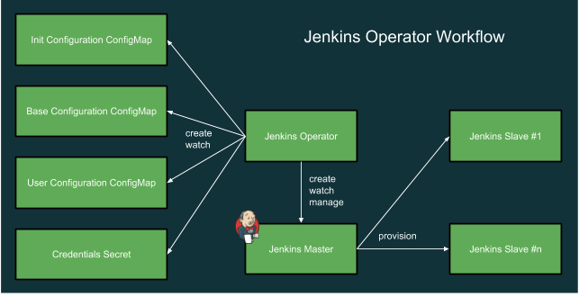
  </details>
  <br/>


### Overview of Tasks Covered in Lab 

- [Step 1: HELM](#step-1--HELM)
- [Step 2: Create a Storage](#step-2--Create-a-Storage )
- [Step 3: Download Helm Charts](#step-3--Download-Helm-Charts)
- [Step 4: Deploy Jenkins](#step-4--Deploy-Jenkins)
- [Step 5: Verify Deployment and Run First Job](#step-5--Verify-Deployment-and-Run-First-Job)

-----------------------

## Step 1:  HELM

1.1 Download and install the [Helm CLI](https://github.com/helm/helm/releases) if you haven't already done so.

1.2 Create a service account for Tiller and bind it to the cluster-admin role. Copy the following into a file named `rbac-config.yaml`n 

<details><summary>rbac-config.yaml</summary>

```yaml
apiVersion: v1
kind: ServiceAccount
metadata:
  name: tiller
  namespace: kube-system
---
apiVersion: rbac.authorization.k8s.io/v1beta1
kind: ClusterRoleBinding
metadata:
  name: tiller
roleRef:
  apiGroup: rbac.authorization.k8s.io
  kind: ClusterRole
  name: cluster-admin
subjects:
  - kind: ServiceAccount
    name: tiller
    namespace: kube-system
```

</details>
<br/>

1.3 Apply Configuration 

```bash
kubectl apply -f rbac-config.yaml
```

1.4 Instead you could use the following commands[Optional]

```bash
kubectl create serviceaccount --namespace kube-system tiller

kubectl create clusterrolebinding tiller-clusterrolebinding --clusterrole=cluster-admin --serviceaccount=kube-system:tiller
```

1.5 Deploy Helm using the service account by running the following command:

```bash
helm init --service-account tiller
```


## Step 2: Depoloy Jenkins Operator


2.1 Create a namespace to deploy jekins operator on

```bash
kubectl create ns jenkinso
```

2.2 Set the current kubernetes context to the jenkinso namespace

```bash
kubectl config set-context --current --namespace=jenkinso
```

2.3  Install Jenkins Custom Resource Definition:

```bash
kubectl apply -f https://raw.githubusercontent.com/jenkinsci/kubernetes-operator/master/deploy/crds/jenkins_v1alpha2_jenkins_crd.yaml
```

2.3  Apply Service Account and RBAC roles:

```bash
kubectl apply -f https://raw.githubusercontent.com/jenkinsci/kubernetes-operator/master/deploy/all-in-one-v1alpha2.yaml
```

2.4  Watch Jenkins Operator instance being created 

```bash
kubectl get pods -w
```

<details><summary>Screenshot 2.4</summary>
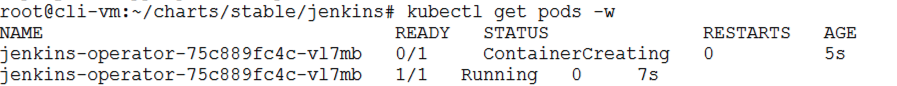
</details>
<br/>

2.5 Check jenkins operator services

```bash
kubectl get svc
```

2.6 Once jenkins-operator is up and running let's deploy actual Jenkins instance. Create manifest ie. jenkins_instance.yaml with following data and save it on drive.

<details><summary>jenkins_instance.yaml</summary>

```yaml
apiVersion: jenkins.io/v1alpha2
kind: Jenkins
metadata:
  name: example
spec:
  master:
    containers:
    - name: jenkins-master
      image: jenkins/jenkins:lts
      imagePullPolicy: Always
      livenessProbe:
        failureThreshold: 12
        httpGet:
          path: /login
          port: http
          scheme: HTTP
        initialDelaySeconds: 80
        periodSeconds: 10
        successThreshold: 1
        timeoutSeconds: 5
      readinessProbe:
        failureThreshold: 3
        httpGet:
          path: /login
          port: http
          scheme: HTTP
        initialDelaySeconds: 30
        periodSeconds: 10
        successThreshold: 1
        timeoutSeconds: 1
      resources:
        limits:
          cpu: 1500m
          memory: 3Gi
        requests:
          cpu: "1"
          memory: 500Mi
  seedJobs:
  - id: jenkins-operator
    targets: "cicd/jobs/*.jenkins"
    description: "Jenkins Operator repository"
    repositoryBranch: master
    repositoryUrl: https://github.com/jenkinsci/kubernetes-operator.git

```

</details>
<br/>


2.7 Create the Jenkins instance. Watch the pods being created


```bash
kubectl apply -f jenkins_instance.yaml
kubectl get po -w
```
<details><summary>Screenshot 2.7</summary>

</details>
<br/>


2.8 Create an ingress or expose the jenkins operator service as a load balancer. Here i am exposing the service as a load balancer which will be created in NSXT

```bash
kubectl expose service jenkins-operator-http-example --port=8080 --target-port=8080 --type=LoadBalancer --name=jenkins-lb --namespace=jenkinso
```

2.9  Get the ingress ip to access Jenkins through the browser

```bash
kubectl get svc
```

<details><summary>Screenshot 2.9</summary>
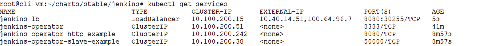
</details>
<br/>

2.10 Point the browser to the external ip of the jenkins-lb on port 8080

<details><summary>Screenshot 2.10</summary>
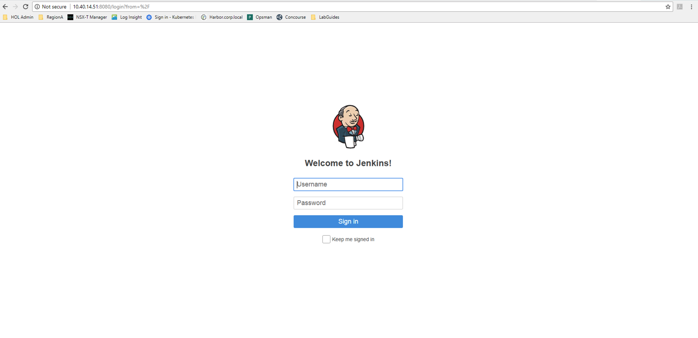
</details>
<br/>


2.11 To login we would require to get the jenkins credentials from the credentials secrets

User Name
```bash
kubectl get secret jenkins-operator-credentials-example -o 'jsonpath={.data.user}' | base64 -d
```

<details><summary>Screenshot 2.11.1</summary>
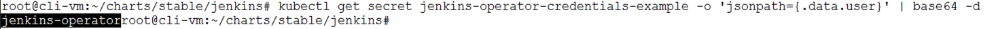
</details>
<br/>

Password

```bash
kubectl get secret jenkins-operator-credentials-example -o 'jsonpath={.data.password}' | base64 -d
```

<details><summary>Screenshot 2.11.1</summary>
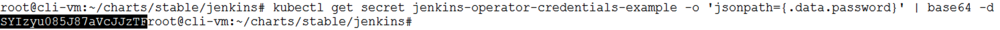
</details>
<br/>


## Step 3: Run your First Jenkins Job


5.4 Click on New Item . Enter name eg "JenkinsSampleBuild" and Freestyle project  and click on OK

<details><summary>Screenshot 5.4</summary>
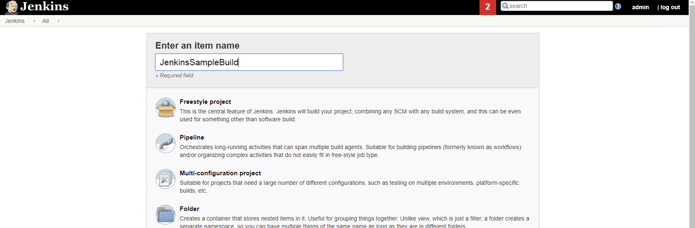
</details>
<br/>

5.5 Click on New Item . Enter name eg "JenkinsSampleBuild" and Freestyle project  and click on OK

<details><summary>Screenshot 5.5</summary>

</details>
<br/>

5.6 In the Build Section choose "Execute Shell" and add the following and click on Save

```bash
whoami

hostname

hostname --ip-address
```


<details><summary>Screenshot 5.6</summary>
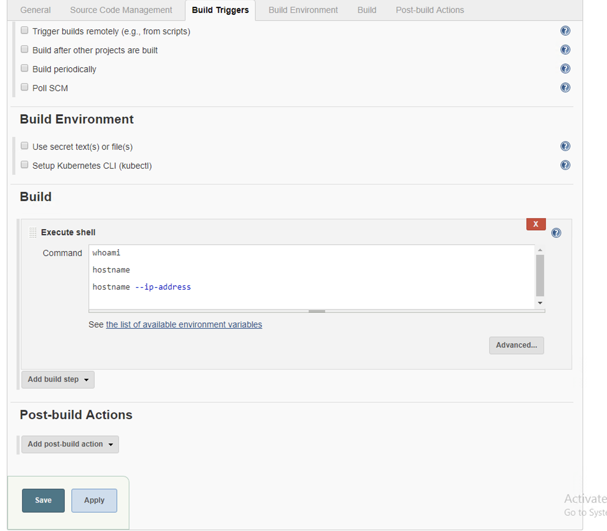
</details>
<br/>


5.7 Click on Build Now. You should see a pending build in the Build History


<details><summary>Screenshot 5.7</summary>
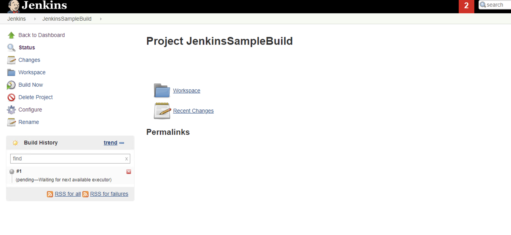
</details>
<br/>

5.8 Check the pods running , and a new pod default pod will be spun up by jenkins to run your request. This is done dynamically as per requests

```bash
kubectl get po -n cicd
```

<details><summary>Screenshot 5.8</summary>
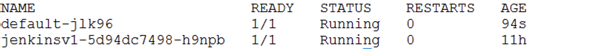
</details>
<br/>


5.9 Click on the build number to view the details of the build. Click on console output


<details><summary>Screenshot 5.9</summary>
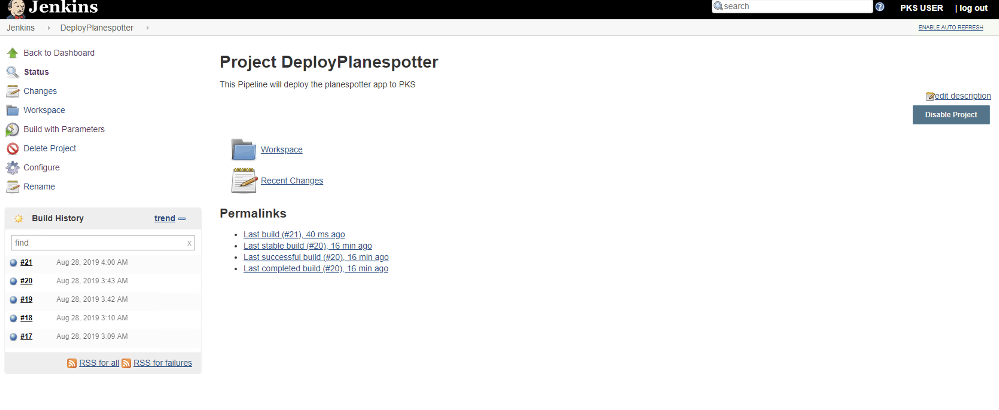
</details>
<br/>

<details><summary>Screenshot 5.9.1</summary>
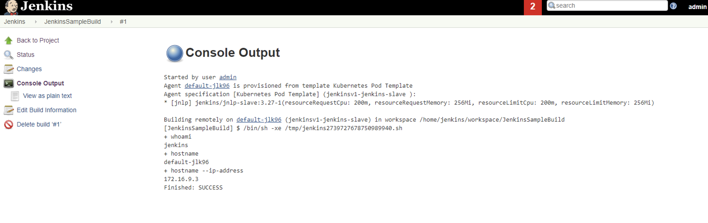
</details>
<br/>

