# Run Jenkins X on PKS

## Overview

 - Jenkins X is an open source project that offers automated CI/CD for cloud-native applications on Kubernetes. 

 - Automated CI and CD: Jenkins X offers a sleek jx command line tool, which allows Jenkins X to be installed inside an existing or new Kubernetes cluster, import projects, and bootstrap new        applications.Also, Jenkins X creates pipelines for the project automatically.
 
 - Environment Promotion via GitOps: Jenkins X allows for the creation of different virtual environments for development, staging, and production, etc. using the Kubernetes Namespaces. Every environment gets its specific configuration, list of versioned applications and configurations stored in the Git repository. The promotion of new versions of applications between these environments is done automatically following GitOps practices. Moreover, code can be promoted from one environment to another manually and change or configure new environments as needed. 
 
 - Preview Environments: Though the preview environment can be created manually, Jenkins X automatically creates Preview Environments for each pull request. This provides a chance to see the effect of changes before merging them. Further, Jenkins X adds a comment to the Pull Request with a link for the preview for team members.


  <details><summary>Screenshot 0</summary>
  
  </details>
  <br/>

  <details><summary>Screenshot .1</summary>
  
  </details>
  <br/>

## Prerequisites

PKS

Log into to Opsman https://opsman.corp.local as admin/VMware1!

Click on the Pivotal Container Service Plane

<details><summary>Screenshot 5.2</summary>
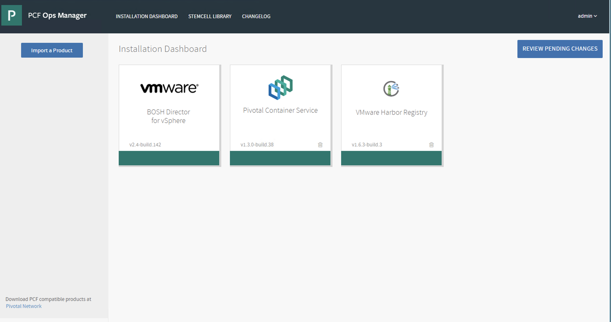
</details>
<br/>

Under settings click on Plan1 opr the plan you are using on your cluster, at the end of the page make sure that the Enable Privileged Containers and Disable Deny EscalatingExec are both enabled

<details><summary>Screenshot 5.3.1</summary>
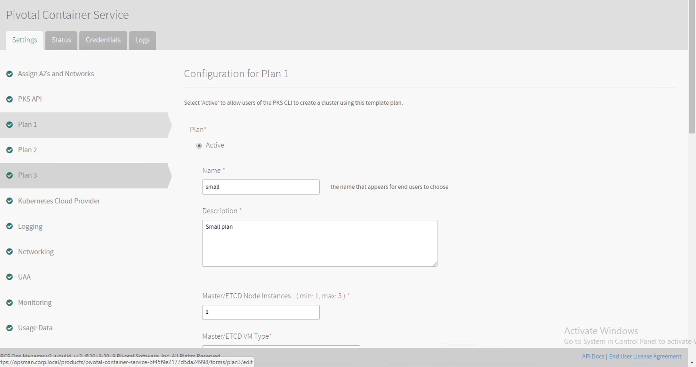
</details>
<br/>

<details><summary>Screenshot 5.3.2</summary>
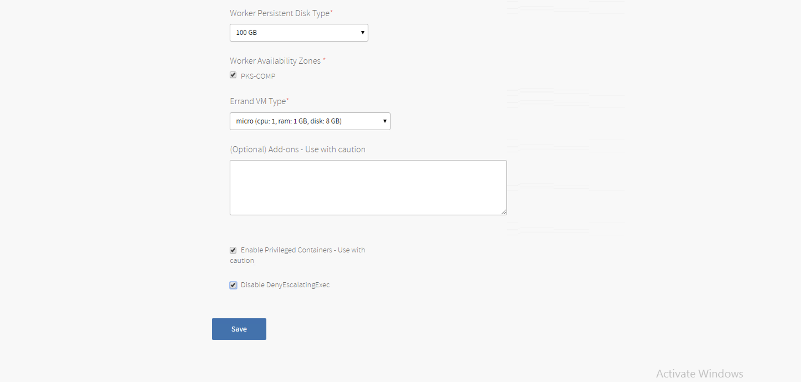
</details>
<br/>

Enable both of these options and Save. Click on the Installation Dashboard -- Review Pending Changes and click on Apply changes

BOSH

Make sure steps 2.10 to 2.12 are followed in the [Guide](https://github.com/CNA-Tech/PKS-Ninja/tree/master/LabGuides/PksInstallPhase1-IN3138#step-2-deploy-bosh)
If this has not been complete follow the same and Apply Changes on the OpsMan so all the vm's int he cluster have the required certificates to communicate to harbor.

### Overview of Tasks Covered in Lab 1

- [Step 1: Install jx](#Step-1:-Install-jx)
- [Step 2: JX Compliance check with sonobuoy](#Step-2:-JX-Compliance-check-with-sonobuoy)
- [Step 3: HELM](#Step-3:-HELM)
- [Step 4: Deploy Jenkins](#Step-4:-Deploy-JenkinsX)
- [Step 5: Integrate Harbor with Jenkinsx](#Step-5:-Integrate-Harbor-with-Jenkinsx)
- [Step 6: Create a quick start guide](#Step-6:-Create-a-quick-start-guide)
-----------------------

## Step 1: Install jx

1.1 Login to the cli-vm

1.2 Create a jenkinsx folder

```bash
mkdir jenkinsx
cd jenkinsx

```

1.3 Download the jx binary archive using curl (where the URL below is selecting the most current version of Jenkins X on the releases page) and pipe (|) the compressed archive to the tar command


```bash
curl -L https://github.com/jenkins-x/jx/releases/latest/download/jx-linux-amd64.tar.gz | tar xzv

```

1.4 Install the jx binary by moving it to a location which should be on your environments PATH, using the mv command:

```bash
sudo mv jx /usr/local/bin

```

## Step 2: JX Compliance check with sonobuoy

NOTE: The compliance test is run using sonobuoy

2.1 Optional: Validate your cluster is compliant with Jenkins X by executing the following command:

```bash
jx compliance run

```

<details><summary>Screenshot 2.1</summary>
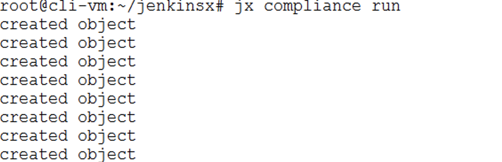
</details>
<br/>

2.2 Note: This takes about an hour to complete . Check status

```bash
jx compliance status

```

2.3  Check compliance logs 

```bash
jx compliance logs -f

```

<details><summary>Screenshot 2.3</summary>
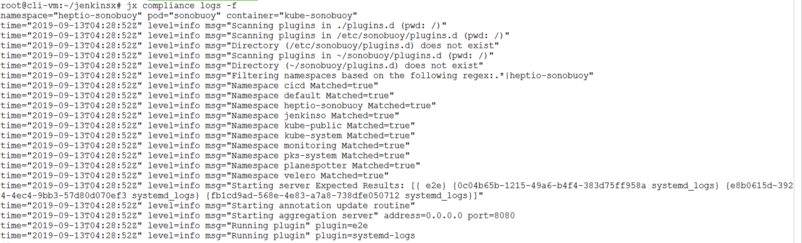
</details>
<br/>

2.4 Check the pods running under all namespaces , you will see the sonobuoy pods

```bash
jx compliance logs -f

```

<details><summary>Screenshot 2.4</summary>
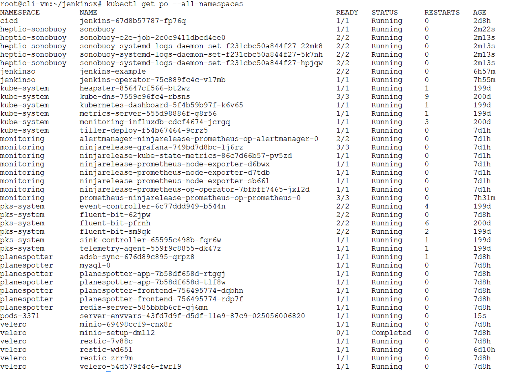
</details>
<br/>

You will see the sonobuoy pods under the heptio-sonobuoy namespace


2.5 Pipe the logs to another file eg.

```bash

jx compliance results > results.txt

```

2.6 All the resources created by the conformance tests can be cleaned up 

```bash

jx compliance delete

```


## Step 3: HELM


3.1 Download and install the [Helm CLI](https://github.com/helm/helm/releases) if you haven't already done so.

3.2 Create a service account for Tiller and bind it to the cluster-admin role. Copy the following into a file named `rbac-config.yaml`n 

<details><summary>rbac-config.yaml</summary>

```yaml
apiVersion: v1
kind: ServiceAccount
metadata:
  name: tiller
  namespace: kube-system
---
apiVersion: rbac.authorization.k8s.io/v1beta1
kind: ClusterRoleBinding
metadata:
  name: tiller
roleRef:
  apiGroup: rbac.authorization.k8s.io
  kind: ClusterRole
  name: cluster-admin
subjects:
  - kind: ServiceAccount
    name: tiller
    namespace: kube-system
```

</details>
<br/>

3.3 Apply Configuration 

```bash
kubectl apply -f rbac-config.yaml
```

3.4 Instead you could use the following commands[Optional]

```bash
kubectl create serviceaccount --namespace kube-system tiller

kubectl create clusterrolebinding tiller-clusterrolebinding --clusterrole=cluster-admin --serviceaccount=kube-system:tiller
```

3.5 Deploy Helm using the service account by running the following command:

```bash
helm init --service-account tiller
```


## Step 4: Deploy JenkinsX


4.1 Create a storage class. Copy the contents below to a file called storage-class.yaml 

<details><summary>storage-class.yaml</summary>

```yaml
kind: StorageClass
apiVersion: storage.k8s.io/v1
metadata:
  name: thin-disk
provisioner: kubernetes.io/vsphere-volume
parameters:
    diskformat: thin
```

</details>
<br/>

4.2 Set the storage class as default for pods on the cluster with the command

```bash
kubectl apply -f storage-class.yaml
kubectl patch storageclass thin-disk -p '{"metadata": {"annotations":{"storageclass.kubernetes.io/is-default-class":"true"}}}'
```

4.3 Check storage class for default

```bash
kubectl get storageclass
```

<details><summary>Screenshot 4.2</summary>
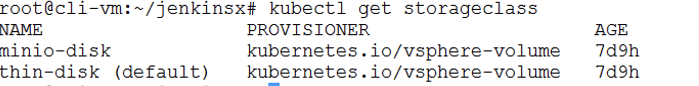
</details>
<br/>

4.4 Install Jenkins X with the following command. JX comes in two flavors Serveless and Static. For this lab we will go with static

```bash
jx install
```

<details><summary>Screenshot 4.4</summary>
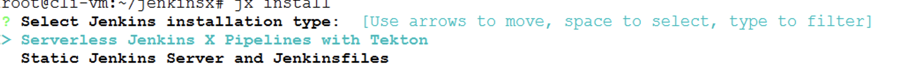
</details>
<br/>

4.5 Choose cloud provider as PKS

<details><summary>Screenshot 4.5</summary>
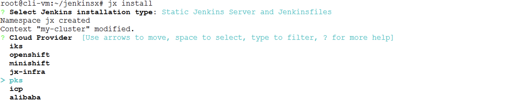
</details>
<br/>

4.6 Use jenkisxgit as yuour git user and email of your choice

4.7 For domain enter corp.local for the domain name. This will create an ingress controller as jx.jenkins.corp.local


<details><summary>Screenshot 4.9</summary>
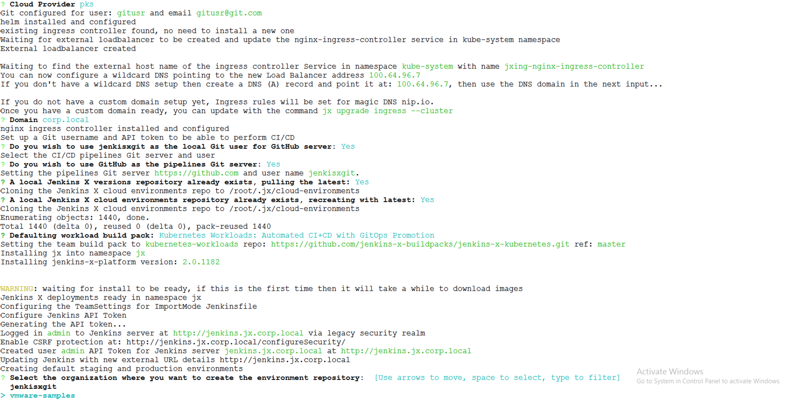
</details>
<br/>

4.8 Enter your github user for the public github repository you would like to you

4.9 Create a new personal acess token in GIT. This will be used by JenkinsX to create a webhook

From the browser go to the below link and login to your git account and click on generate token

https://github.com/settings/tokens/new?scopes=repo,read:user,read:org,user:email,write:repo_hook,delete_repo

<details><summary>Screenshot 4.6</summary>
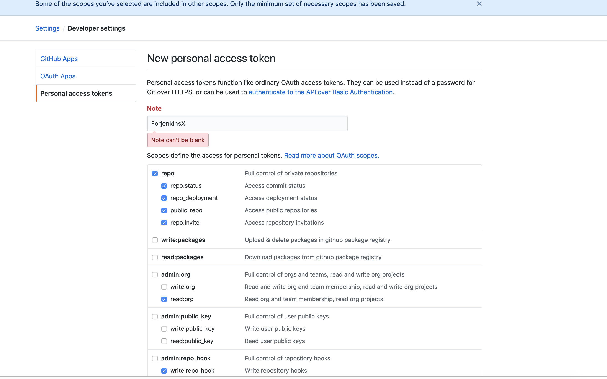
</details>
<br/>

<details><summary>Screenshot 4.6.1</summary>
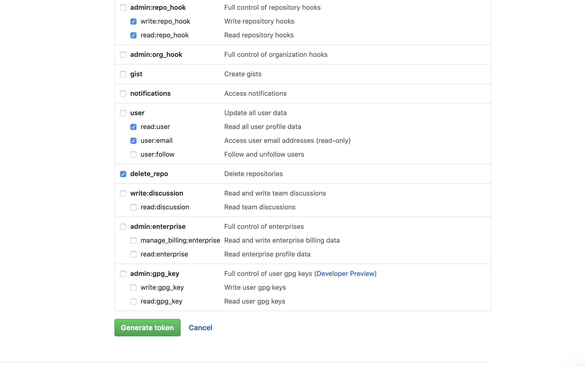
</details>
<br/>


4.10 Copy the token from the previous step and enter it when prompted for a git token

4.11 Enter Y when pronpted to use Github as the pipeline git server

4.12 Copy the token from the previous step and enter it when prompted for a git token

4.13 This would create a set of artifacts for you depending on the mode you have installed jenkinsx.

JX Serverless
<details><summary>Screenshot 4.13</summary>
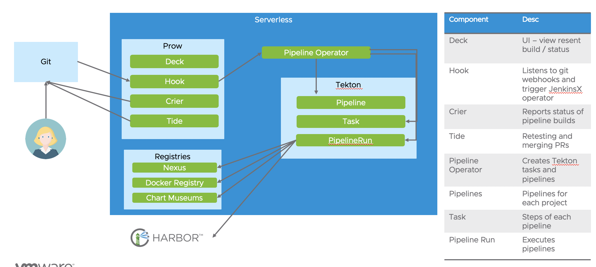
</details>
<br/>


JX Static
<details><summary>Screenshot 4.10.1</summary>
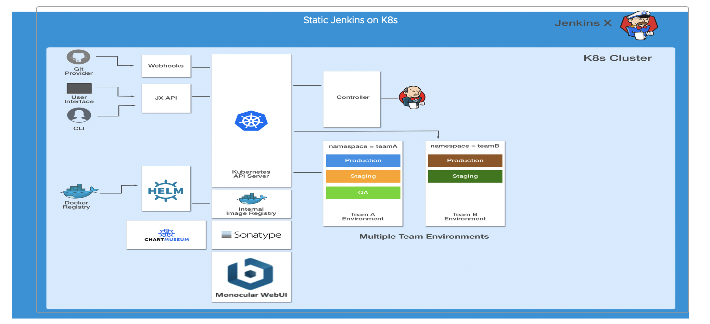
</details>
<br/>

4.14 Get the nginix external ip to map to your DNS record. Jenkinsx deploys nginx as the ingress controller. This would be the ip address of the ngix service. To get the ip

```bash
kubectl get services -n kube-system
```

<details><summary>Screenshot 4.14</summary>
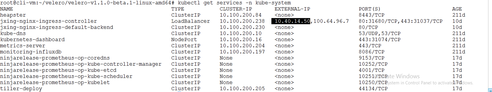
</details>
<br/>

4.15 Jenkinsx creates the jenkins.jx.corp.local fqdn which points to the external ip of the nginx service. 

4.16 Search for dns in the programs menu

<details><summary>Screenshot 4.16</summary>
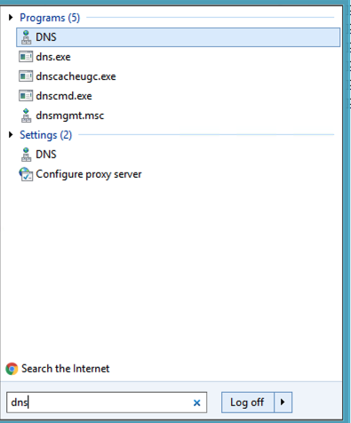
</details>
<br/>

4.17 Select corp.local under Forward Lookup zones 

<details><summary>Screenshot 4.17</summary>
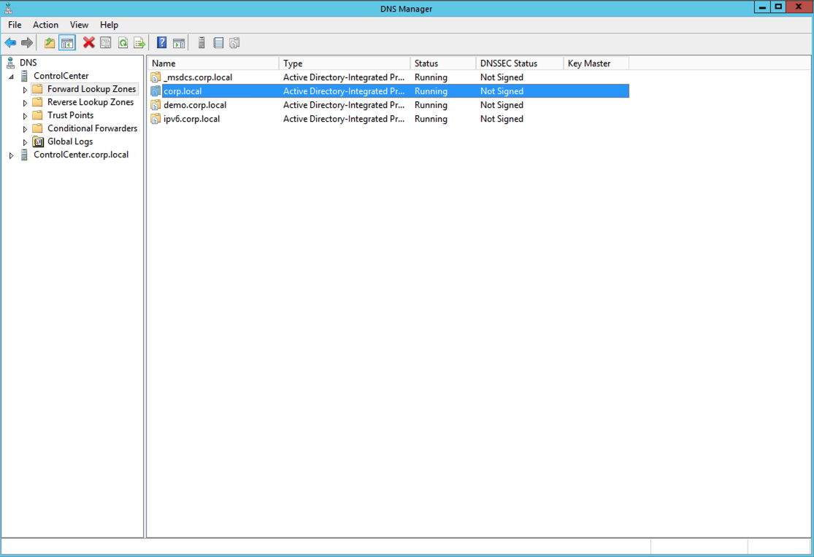
</details>
<br/>

4.18 Right click and add new A record

<details><summary>Screenshot 4.18</summary>
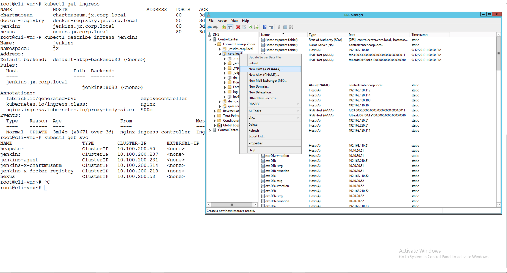
</details>
<br/>


4.19 Enter jenkins.jx for the name and the ipadress of the ngnix service . Uncheck the Create associated pointer and click on Add Host

<details><summary>Screenshot 4.19</summary>
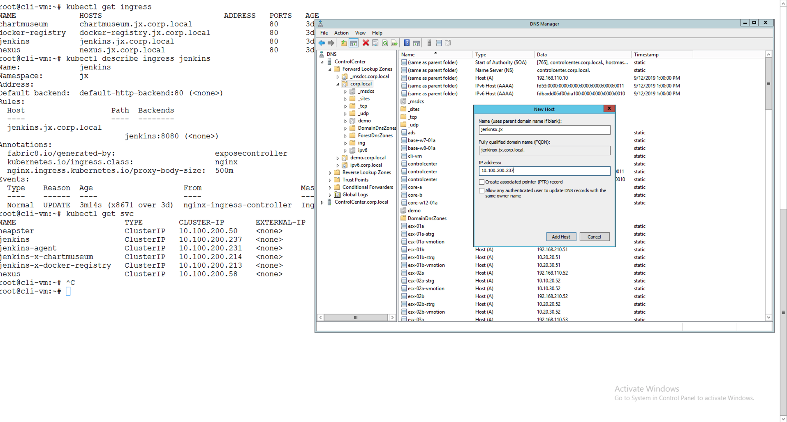
</details>
<br/>

4.20 Jenkinsx also creates ingresses for nexus artifactory, chart museum and a docker registry . Follow steps to add dns entries for all these if required pointing to the external ip of the nginix service

<details><summary>Screenshot 4.20</summary>
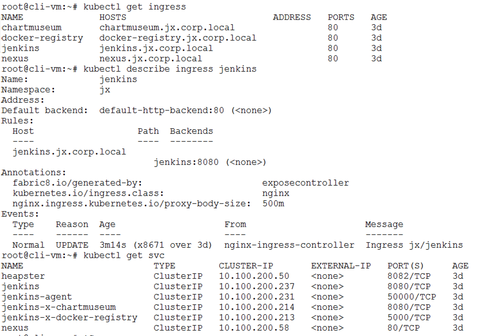
</details>
<br/>


4.21 Lauch a browse to and go to http://jenkins.jx.corp.local

<details><summary>Screenshot 4.21</summary>
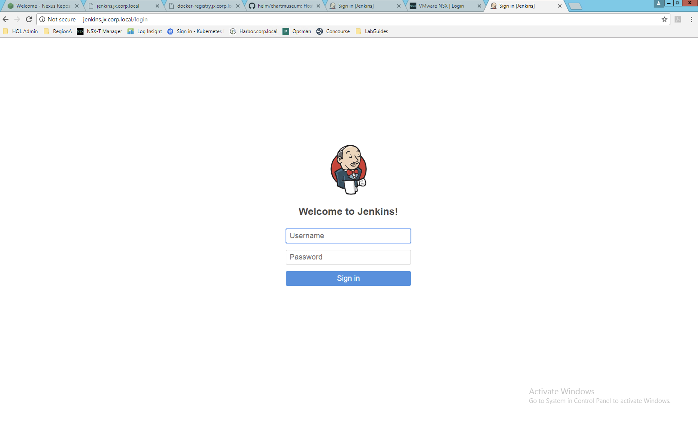
</details>
<br/>

4.22 To get the username and password 

Username

```bash
kubectl get secret jenkins -o 'jsonpath={.data.jenkins-admin-user}' | base64 -d
```
<details><summary>Screenshot 4.22</summary>
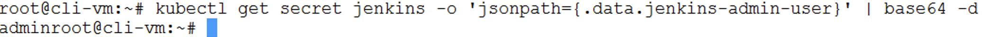
</details>
<br/>

Password

```bash
kubectl get secret jenkins -o 'jsonpath={.data.jenkins-admin-password}' | base64 -d
```
<details><summary>Screenshot 4.22.1</summary>
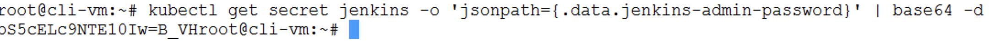
</details>
<br/>

4.23 Login to jenkinsx using the username and password from the above commands


## Step 5: Integrate Harbor with Jenkinsx

5.1 To configure Harbor in Jenkinsx go to Manage Jenkins -- Configure System -- Under Environment Variables make sure DOCKER_REGISTRY is pointing to harbor.corp.local

<details><summary>Screenshot 5.1.1</summary>
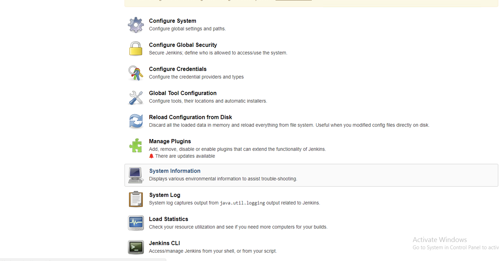
</details>
<br/>

<details><summary>Screenshot 5.2.1</summary>

</details>
<br/>

5.2 To communicate with harbor to push or pull images JX requires to have the username and password for Harbor. Follow the steps steps in the [guide](https://github.com/CNA-Tech/PKS-Ninja/tree/master/LabGuides/HarborCertExternal-HC7212)

5.3 Check the config.json file in the docker directory. The config.json file is configured to communicate with harbor as admin/VMware1!

```bash
cd /root/.docker
vi config.json
```

5.4 You can atlernatively create the config.json file

```json
{
        "auths": {
                "harbor.corp.local": {
                        "auth": "YWRtaW46Vk13YXJlMSE="
                }
        },
        "HttpHeaders": {
                "User-Agent": "Docker-Client/18.06.1-ce (linux)"
        }
}

```

5.6 Encode it in Base64

```bash
cat /root/.docker/config.json | base64
```

5.7 Create a secrets file with and copy the base64 value in the previous step and replace the value for the key config.json


```yaml
apiVersion: v1
type: Opaque
kind: Secret
metadata:
  name: jenkins-docker-cfg
data:
  config.json: ewoJImF1dGhzIjogewoJCSJoYXJib3IuY29ycC5sb2NhbCI6IHsKCQkJImF1dGgiOiAiWVdSdGFXNDZWazEzWVhKbE1TRT0iCgkJfQoJfSwKCSJIdHRwSGVhZGVycyI6IHsKCQkiVXNlci1BZ2VudCI6ICJEb2NrZXItQ2xpZW50LzE4LjAxLjAtY2UgKGxpbnV4KSIKCX0KfQ==
```

5.9 Login to Harbor at http://harbor.corp.local as admin/VMware1!

5.10 Create a public project with your gitid eg riazvm

<details><summary>Screenshot 5.10</summary>
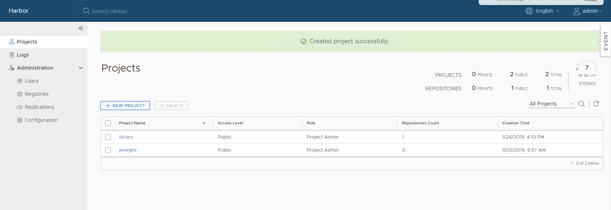
</details>
<br/>

## Step 6: Create a quick start guide

6.1 We will first create and run a sample which will create a repository in git hub under the user you configured . The sample code will be pulled from git , compiled , an image will be created and pushed into harbor

6.2 To create a quickstart in jx


```bash
jx create quickstart
```

6.3 Select a quickstart . I am going to be selecting spring-boot-http-gradle

<details><summary>Screenshot 6.3</summary>
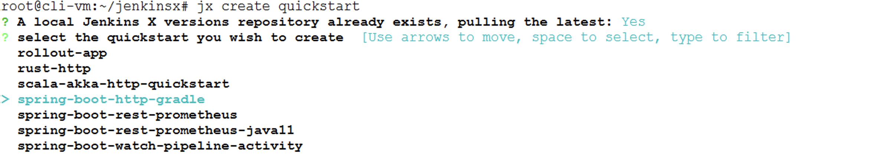
</details>
<br/>

6.4 Follow the prompt as per the github user you would like to use. The default is configured from a previous step in the guide , enter "Y" if you would like to use the same

6.5 Enter a repository name Eg. 

<details><summary>Screenshot 6.5</summary>
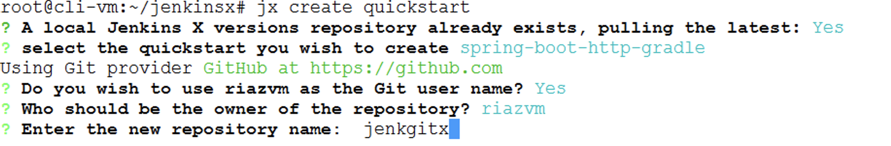
</details>
<br/>

6.6 A repo will be created in your git alone with a webhook

<details><summary>Screenshot 6.6</summary>
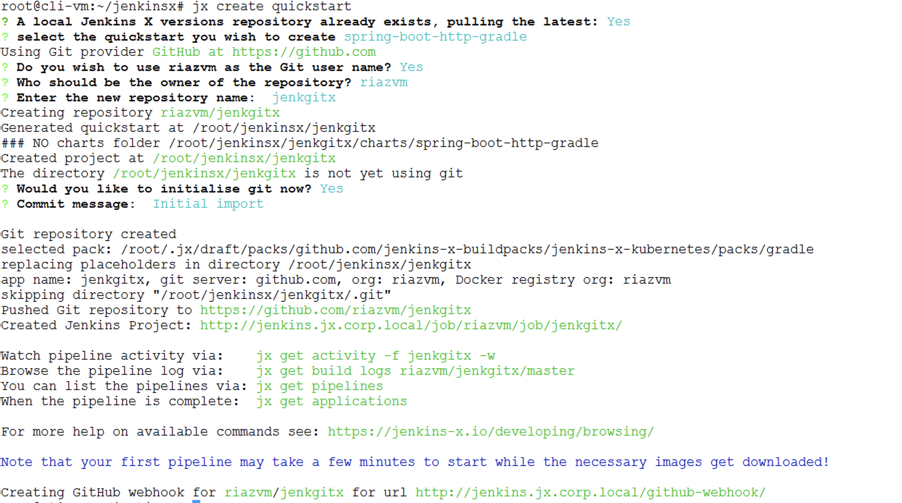
</details>
<br/>

6.7 Login to your github . jx will create a private repository with the resposiroty name sepcified in step 6.5. The sample code and jenkins files are available in the repo.

<details><summary>Screenshot 6.7</summary>
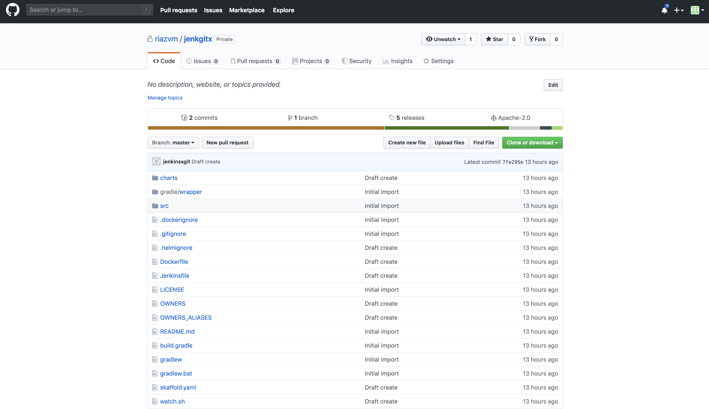
</details>
<br/>

6.8 Login to http://jenkins.jx.com . Browse to the gitaccount/repository/branch eg riazvm/jenkgitx/master. A build would be auto run by Jenkins.

<details><summary>Screenshot 6.8</summary>
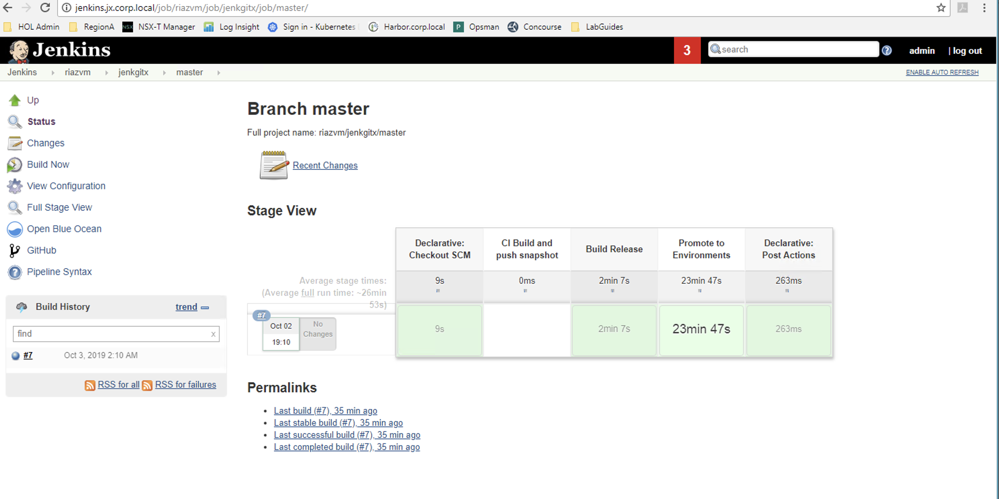
</details>
<br/>


6.9 Log back into github. Jenkinsx would have created two more respositories one for production and one for staging 

<details><summary>Screenshot 6.9</summary>
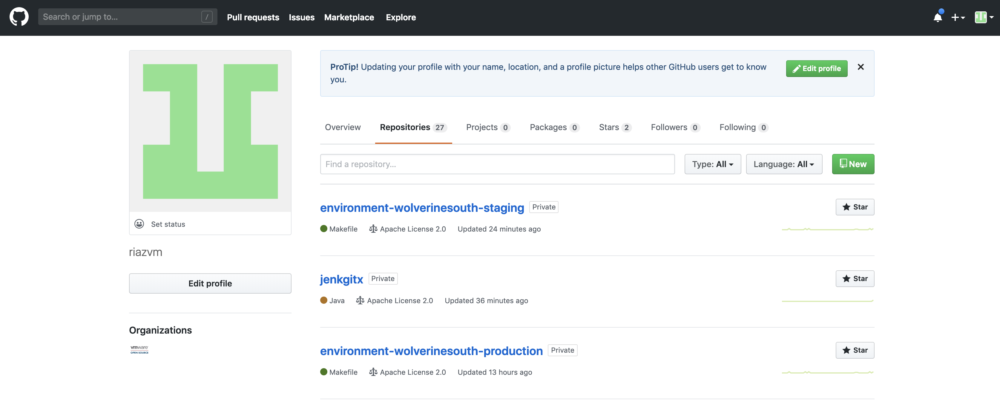
</details>
<br/>

6.10 Check namespaces in the cluster. Jenkinsx would have created two new namesapces , jx-staging and jx-production

```bash
kubectl get ns
```
<details><summary>Screenshot 6.10</summary>
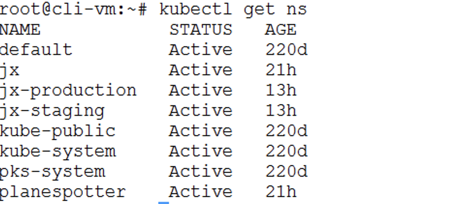
</details>
<br/>

6.11 Check the pods running in the jx-staging namespace

```bash
kubectl get po -n jx-staging
```
<details><summary>Screenshot 6.11</summary>
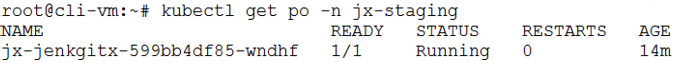
</details>
<br/>

6.12 Login to harbor and check for images . An image should be present under gitaccount/repository/ eg riazvm/jenkgitx tagged with the version of a successful build

<details><summary>Screenshot 6.12</summary>
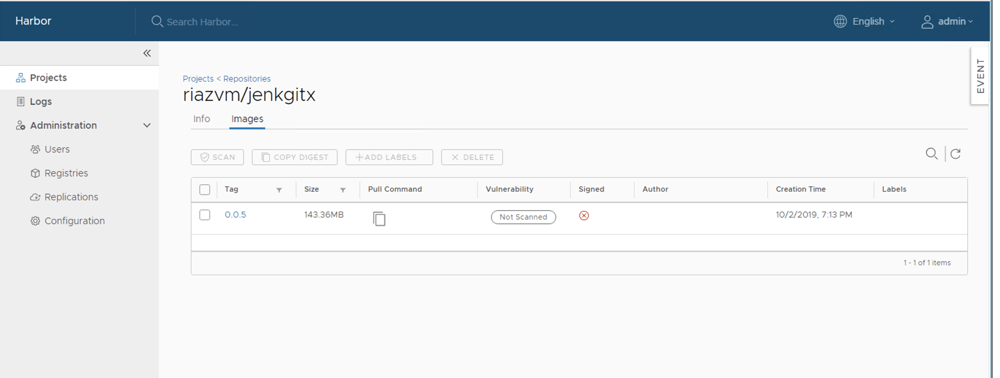
</details>
<br/>

6.13 To summarize , JX will pull the jenkins file from the git repository. As per the stages in the jenkins file it will compile code , build an image, push it to harbor, create a staging and production namespace, create repositories for stating and production in git and promote code to the staging environment and creates an Ingress

6.14 Check the ingress for the application deployed to staging

```bash
kubectl get ingress -n jx-staging
```

<details><summary>Screenshot 6.14</summary>
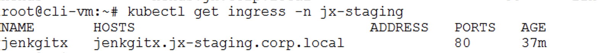
</details>
<br/>

6.15 Create a DNS record to point to nginix external ip as done previously

6.16 Browse to the url for the ingress from your prowser eg http://jenkgitx.jx-staging.corp.local/

<details><summary>Screenshot 6.16</summary>
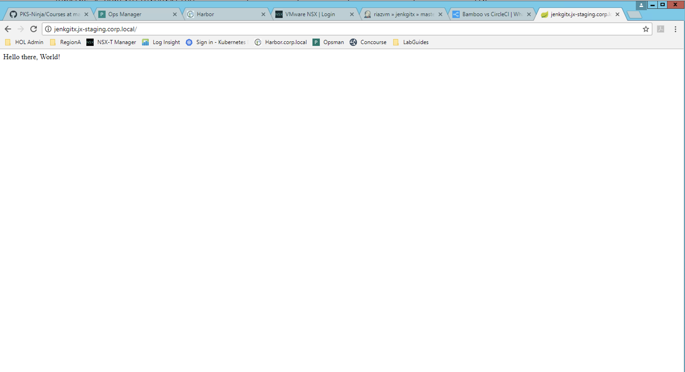
</details>
<br/>


