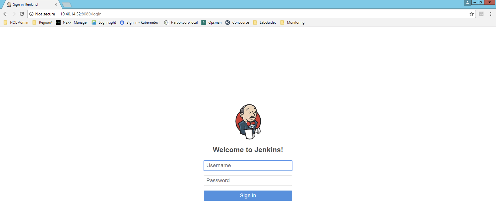
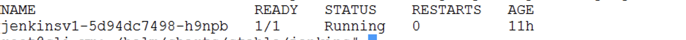

# PKS - Deploy and Run Jenkins

## Overview

 - Jenkins is an open source automation server used for continuous delivery and, ultimately, to accelerate the software delivery process
 - Helm is the package manager for Kubernetes that runs on a local machine with kubectl access to the Kubernetes cluster.


## Prerequisites

- Please see [Getting Access to a PKS Ninja Lab Environment](https://github.com/CNA-Tech/PKS-Ninja/tree/master/Courses/GetLabAccess-LA8528) to learn about how to access or build a compatible lab environment
- PKS Install (https://github.com/riazvm/PKS-Ninja/tree/master/LabGuides/PksInstallPhase2-IN1916)
- PKS Cluster (https://github.com/riazvm/PKS-Ninja/tree/master/LabGuides/DeployFirstCluster-DC1610)


## Installation Notes

Anyone who implements any software used in this lab must provide their own licensing and ensure that their use of all software is in accordance with the software's licensing. This guide provides no access to any software licenses.

For those needing access to VMware licensing for lab and educational purposes, we recommend contacting your VMware account team. Also, the [VMware User Group's VMUG Advantage Program](https://www.vmug.com/Join/VMUG-Advantage-Membership) provides a low-cost method of gaining access to VMware licenses for evaluation purposes.

This lab follows the standard documentation, which includes additional details and explanations: [NSX-T 2.3 Installation Guide](https://docs.vmware.com/en/VMware-NSX-T/2.2/com.vmware.nsxt.install.doc/GUID-3E0C4CEC-D593-4395-84C4-150CD6285963.html)

### Overview of Tasks Covered in Lab 1

Helm - Helm is the package manager for Kubernetes that runs on a local machine with kubectl access to the Kubernetes cluster.

Create a Storage 

Deploy Jenkins

Run a jenkins job

- [Step 1: HELM](#step-1--HELM)
- [Step 2: Create a Storage](#step-2--Create-a-Storage )
- [Step 3: Download Helm Charts](#step-3--Download-Helm-Charts)
- [Step 4: Deploy Jenkins](#step-4--Deploy-Jenkins)
- [Step 5: Verify Deployment and Run First Job](#step-5--Verify-Deployment-and-Run-First-Job)

-----------------------

## Step 1:  HELM

1.1 Download and install the [Helm CLI](https://github.com/helm/helm/releases) if you haven't already done so.

1.2 Create a service account for Tiller and bind it to the cluster-admin role. Copy the following into a file named `rbac-config.yaml`n 

<details><summary>rbac-config.yaml</summary>

```yaml
apiVersion: v1
kind: ServiceAccount
metadata:
  name: tiller
  namespace: kube-system
---
apiVersion: rbac.authorization.k8s.io/v1beta1
kind: ClusterRoleBinding
metadata:
  name: tiller
roleRef:
  apiGroup: rbac.authorization.k8s.io
  kind: ClusterRole
  name: cluster-admin
subjects:
  - kind: ServiceAccount
    name: tiller
    namespace: kube-system
```

</details>
<br/>

1.3 Apply Configuration 

```bash
kubectl apply -f rbac-config.yaml
```

1.4 Instead you could use the following commands[Optional]

```bash
kubectl create serviceaccount --namespace kube-system tiller

kubectl create clusterrolebinding tiller-clusterrolebinding --clusterrole=cluster-admin --serviceaccount=kube-system:tille
```

1.5 Deploy Helm using the service account by running the following command:

```bash
helm init --service-account tiller
```

## Step 2:  Create a Storage 

2.1 Create a storage class. Copy the contents below to a file called storage-class.yaml 

<details><summary>storage-class.yaml</summary>

```yaml
kind: StorageClass
apiVersion: storage.k8s.io/v1
metadata:
  name: thin-disk
provisioner: kubernetes.io/vsphere-volume
parameters:
    diskformat: thin
```

</details>
<br/>

2.2 Apply Configuration 

```bash
kubectl apply -f storage-class.yaml
```


2.3 Create a PVC for Jenkins. Copy the contents below to a file called jenkins-claim.yaml 

<details><summary>jenkins-claim.yaml</summary>

```yaml
kind: PersistentVolumeClaim
apiVersion: v1
metadata:
  name: jenkins-claim
  namespace: jenkins-project
  annotations:
    volume.beta.kubernetes.io/storage-class: thin-disk
spec:
  accessModes:
    - ReadWriteOnce
  resources:
    requests:
      storage: 8Gi
```

</details>
<br/>

2.4 Apply Configuration 

```bash
kubectl create ns jenkins-project
kubectl apply -f jenkins-claim.yaml
```


## Step 3:  Download Helm Charts

3.1 Download the latest helm charts from GIT

```bash
git clone https://github.com/helm/charts.git
```

## Step 4:  Deploy Jenkins

4.1 Navigate to the Jenkins helm chart directory

```bash
cd ~/helm/charts/stable/jenkins
```

4.2 The values.yaml file contains all the configuration for your jenkins application. Edit value.yaml to reflect storage. Search for persistence and add jenkins-claim as your existing claim and storage class as "". Replace the persistence section of the values.yaml file with the snippet below

<details><summary>values-snippet.yaml</summary>

```yaml
persistence:
  enabled: true
  ## A manually managed Persistent Volume and Claim
  ## Requires persistence.enabled: true
  ## If defined, PVC must be created manually before volume will be bound
  existingClaim: "jenkins-claim"
  ## jenkins data Persistent Volume Storage Class
  ## If defined, storageClassName: <storageClass>
  ## If set to "-", storageClassName: "", which disables dynamic provisioning
  ## If undefined (the default) or set to null, no storageClassName spec is
  ##   set, choosing the default provisioner.  (gp2 on AWS, standard on
  ##   GKE, AWS & OpenStack)
  ##
  storageClass:""
  annotations: {}
  accessMode: "ReadWriteOnce"
  size: "8Gi"
  volumes:
  #  - name: nothing
  #    emptyDir: {}
  mounts:
  #  - mountPath: /var/nothing
  #    name: nothing
  #    readOnly: true
```

</details>
<br/>

4.3 Search for adminPassword in the values.yaml file and uncomment it. Add a password VMware1!. Snipper shown below

```yaml
  adminUser: "admin"
  adminPassword: VMware1!
```

4.4 Deploy the Helm chart. To install the chart with the release name "jenkinsv1"

```bash
helm install --name jenkinsv1 -f values.yaml stable/jenkins --namespace cicd
```

4.4 To unistall the chart

```bash
$ helm delete jenkinsv1
```

## Step 5:  Verify Deployment and Run First Job

5.1 Find the jenkins service 

```bash
kubectl get services -n jenkinsv1
```

<details><summary>Screenshot 5.1</summary>

</details>
<br/>

5.2 Point your browser to the external ip of the jenkins service of type load balancer on port 8080 http://<external-ip>:8080

<details><summary>Screenshot 5.2</summary>

</details>
<br/>

5.3 Login with username as admin and password as VMware1!


5.4 Click on New Item . Enter name eg "JenkinsSampleBuild" and Freestyle project  and click on OK

<details><summary>Screenshot 5.4</summary>

</details>
<br/>

5.5 Click on New Item . Enter name eg "JenkinsSampleBuild" and Freestyle project  and click on OK

<details><summary>Screenshot 5.5</summary>

</details>
<br/>

5.6 In the Build Section choose "Execute Shell" and add the following and click on Save

```bash
whoami

hostname

hostname --ip-address
```


<details><summary>Screenshot 5.6</summary>

</details>
<br/>


5.7 Click on Build Now. You should see a pending build in the Build History


<details><summary>Screenshot 5.7</summary>

</details>
<br/>

5.8 Check the pods running , and a new pod default pod will be spun up by jenkins to run your request. This is done dynamically as per requests

```bash
kubectl get po -n cicd
```

<details><summary>Screenshot 5.8</summary>

</details>
<br/>


5.9 Click on the build number to view the details of the build. Click on console output


<details><summary>Screenshot 5.9</summary>

</details>
<br/>

<details><summary>Screenshot 5.9.1</summary>

</details>
<br/>

5.10 Check the pods running. You will see that the slave pod is provisioned while running the build and then the pod is killed. More like on demand provisioning of slaves.

```bash
kubectl get po -n cicd
```

<details><summary>Screenshot 5.10</summary>

</details>
<br/>


