# PKS Monitoring & Observability using Prometheus, Grafana and Jaeger

## Overview
This guide is a joint effort between VMWare and a Customer (Susheel Pagadala)
 - Observability: 
   Monitoring related data made available from the applications and other components. If observability is not built-in, data should be gathered by traditional ways.

 - Monitoring:
   Collects, aggregates and displays observability data.

 - Analysis: 
   Automatic or manual analysis of collected monitoring data to instrument and take actions.


### Prometheus
 - Prometheus: is a systems and service monitoring system. 
 - Server scrapes and stores time-series data
 - Client libraries instrument application code
 - The Push Gateway routes metrics from jobs that cannot be scraped
 - Exporters support third-party systems or short-lived jobs
 - The Alertmanager generates alerts and notifications

### Grafana
 - An analytics and monitoring tool used for visualization

### Jaeger
 - Distributed transaction tracing
 - Root cause Analysis
 - Service dependency analysis
 - Performance / latency optimization
 - Natively supports Opentracing
 - Exposes Prometheus metrics by default
 - Distributed transaction monitoring

### Prometheus Operator
 - Create/configure/manage Prometheus clusters atop Kubernetes 
 - The default installation is intended to suit monitoring a kubernetes cluster the chart is deployed onto. It closely matches the kube-prometheus project.


## Prerequisites

- Please see [Getting Access to a PKS Ninja Lab Environment](https://github.com/CNA-Tech/PKS-Ninja/tree/master/Courses/GetLabAccess-LA8528) to learn about how to access or build a compatible lab environment
- [PKS Install](https://github.com/CNA-Tech/PKS-Ninja/tree/master/LabGuides/PksInstallPhase2-IN1916)
- [PKS Cluster](https://github.com/CNA-Tech/PKS-Ninja/tree/master/LabGuides/DeployFirstCluster-DC1610)


## Installation Notes

Anyone who implements any software used in this lab must provide their own licensing and ensure that their use of all software is in accordance with the software's licensing. This guide provides no access to any software licenses.

For those needing access to VMware licensing for lab and educational purposes, we recommend contacting your VMware account team. Also, the [VMware User Group's VMUG Advantage Program](https://www.vmug.com/Join/VMUG-Advantage-Membership) provides a low-cost method of gaining access to VMware licenses for evaluation purposes.

This lab follows the standard documentation, which includes additional details and explanations: [NSX-T 2.3 Installation Guide](https://docs.vmware.com/en/VMware-NSX-T/2.2/com.vmware.nsxt.install.doc/GUID-3E0C4CEC-D593-4395-84C4-150CD6285963.html)

### Overview of Tasks Covered in Lab 
Helm - Helm is the package manager for Kubernetes that runs on a local machine with kubectl access to the Kubernetes cluster.

Deploy Prometheus Operator helm chart which includes the following
    prometheus-operator
    prometheus
    alertmanager
    node-exporter
    kube-state-metrics
    grafana
    service monitors to scrape internal kubernetes components
    kube-apiserver
    kube-scheduler
    kube-controller-manager
    etcd
    kube-dns/coredns With the installation, the chart also includes dashboards and alerts

Deploy Prometheus operator in a secured environment 

Deploy Jaeger

Deploy opentracing instrumented application

Test Grafana Charts

Test transaction logs

- [Step 1: HELM](#step-1--HELM)
- [Step 2: Create a Storage](#step-2--Create-a-Storage )
- [Step 3: Download Helm Charts](#step-3--Download-Helm-Charts)
- [Step 4: Deploy Jenkins](#step-4--Deploy-Jenkins)
- [Step 5: Verify Deployment and Run First Job](#step-5--Verify-Deployment-and-Run-First-Job)


-----------------------

## Step 1:  HELM

1.1 Download and install the [Helm CLI](https://github.com/helm/helm/releases) if you haven't already done so.

1.2 Create a service account for Tiller and bind it to the cluster-admin role. Copy the following into a file named `rbac-config.yaml`n 

<details><summary>rbac-config.yaml</summary>

```yaml
apiVersion: v1
kind: ServiceAccount
metadata:
  name: tiller
  namespace: kube-system
---
apiVersion: rbac.authorization.k8s.io/v1beta1
kind: ClusterRoleBinding
metadata:
  name: tiller
roleRef:
  apiGroup: rbac.authorization.k8s.io
  kind: ClusterRole
  name: cluster-admin
subjects:
  - kind: ServiceAccount
    name: tiller
    namespace: kube-system
```

</details>
<br/>

1.3 Apply Configuration 

```bash
kubectl apply -f rbac-config.yaml
```

1.4 Instead you could use the following commands[Optional]

```bash
kubectl create serviceaccount --namespace kube-system tiller

kubectl create clusterrolebinding tiller-clusterrolebinding --clusterrole=cluster-admin --serviceaccount=kube-system:tiller
```

1.5 Deploy Helm using the service account by running the following command:

```bash
helm init --service-account tiller
```

1.6 Download the latest helm charts from GIT

```bash
git clone https://github.com/helm/charts.git
```


## Step 2:  Deploy Prometheus Operator

NOTE: If your network is secure and you are not able to pull images from the internet follow [Prereq for a secure environment](https://github.com/helm/helm/releases)

2.1 Create a namespace called monitoring

```bash
kubectl create ns monitoring
```

2.2 Before deploying the prometeus operator helm chart, create the CRD's manually .  (A custom resource definition (CRD) file defines your own object kinds and lets the API Server handle the entire lifecycle)

```bash
kubectl apply -f https://raw.githubusercontent.com/coreos/prometheus-operator/master/example/prometheus-operator-crd/alertmanager.crd.yaml 
kubectl apply -f https://raw.githubusercontent.com/coreos/prometheus-operator/master/example/prometheus-operator-crd/prometheus.crd.yaml 
kubectl apply -f https://raw.githubusercontent.com/coreos/prometheus-operator/master/example/prometheus-operator-crd/prometheusrule.crd.yaml 
kubectl apply -f https://raw.githubusercontent.com/coreos/prometheus-operator/master/example/prometheus-operator-crd/servicemonitor.crd.yaml
```

2.3 Deploy the prometheus operator helm chart with the release name as ninjarelease 
We set the createCustomResource resource as falase since we have created it in the previous step. Helm has a bug while creating and deleting CRD's and hence the flag.
Details on the prometheus operator and the K8 pods it deploys are mentioned at the start of the Lab
Note: this is a defaul installation. If you would like to change the default values of any components in the operator For Eg. Add storage or change ports etc , you would require to change the value.yaml file found under the respective helm char directories and install the application from the location.

```bash
helm install stable/prometheus-operator --name ninjarelease --namespace monitoring --set prometheusOperator.createCustomResource=false
```

2.3.1 Optional: If you would like to change the config values of depoloyment components (eg: grafana password) , navigate to helms/charts/stable/prometheus-operator and add or change values to the values.yaml file Eg. change the  adminPassword of grafana prom-operator to say VMware1! and apply the new configuration as follows

```bash
helm install stable/prometheus-operator --name ninjarelease  -f values.yaml --namespace monitoring --set prometheusOperator.createCustomResource=false
```

2.4 Check if the following pods are up and running

```bash
kubectl get pods -n monitoring
```

<details><summary>Screenshot 2.4</summary>

</details>
<br/>

2.4 Expose the grafana service as a load balancer. We do this to access the Grafana app from the external world. Grafana would talk with prometheus. Prometheus would pull metrics from apps and exporters.
When you expose a deployment as a Loadbalancer a new Loadbalancer will be created in NSXT.

```bash
kubectl get deployment -n monitoring
```

<details><summary>Screenshot 2.4</summary>
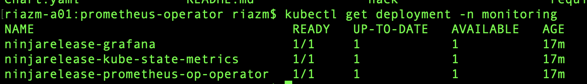
</details>
<br/>

```bash
kubectl expose deployment ninjarelease-grafana --name=ninjarelease-grafanalb --port=80 --target-port=3000 --type=LoadBalancer --namespace=monitoring
```

Note: The above command exposes the ninjarelease-grafana service on port 80 and forwards the request to grafana which is exposed on port 3000 (pod)

<details><summary>Screenshot 2.4.1</summary>
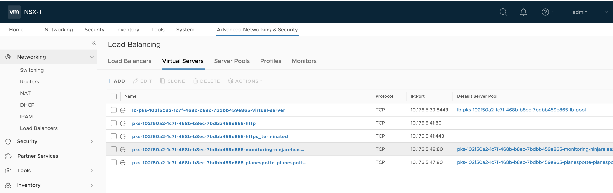
</details>
<br/>

<details><summary>Screenshot 2.4.2</summary>
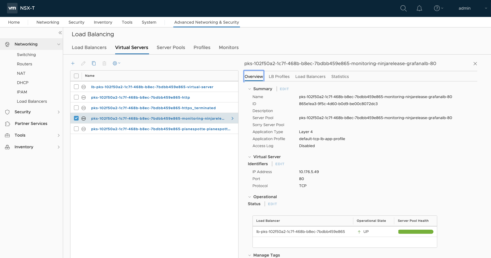
</details>
<br/>

<details><summary>Screenshot 2.4.3</summary>
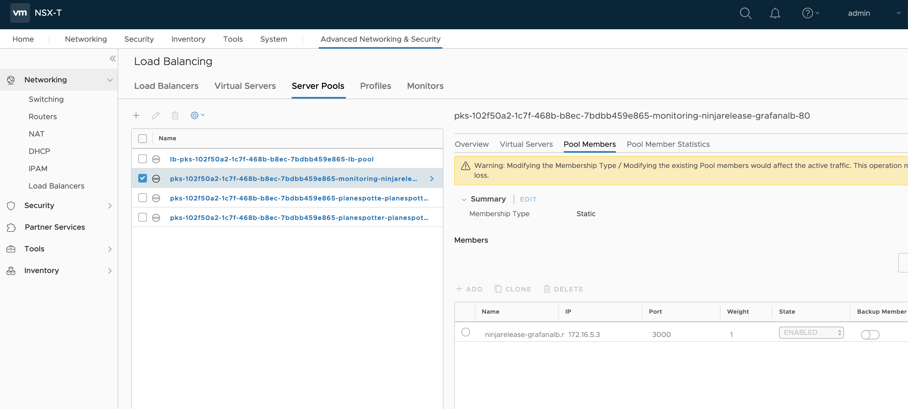
</details>
<br/>

Alternatively Create an Ingress

Create a file grafana-ingress.yaml and copy the below contents

<details><summary>grafana-ingress.yaml</summary>

```yaml
apiVersion: extensions/v1beta1
kind: Ingress
metadata:
  annotations:
    kubernetes.io/ingress.class: ""
  labels:
    app.kubernetes.io/cluster-domain: qa.pks.net
    app.kubernetes.io/instance: grafana
    app.kubernetes.io/managed-by: Tiller
    app.kubernetes.io/name: grafana
    app.kubernetes.io/part-of: monitoring
  name: grafana-ui-ingress
  namespace: monitoring
spec:
  rules:
  - host: grafana.qa.pks.net
    http:
      paths:
      - backend:
          serviceName: ninjarelease-grafana
          servicePort: 80

```

</details>
<br/>

The Ingress will use the http T0 router created by default.


```bash
kubectl apply grafana-ingress.yaml
```
Configure the DNS appropriately

2.5 Get the external ip of the looad balancer created in the previous step 

```bash
kubectl get services -n monitoring
```

<details><summary>Screenshot 2.5</summary>
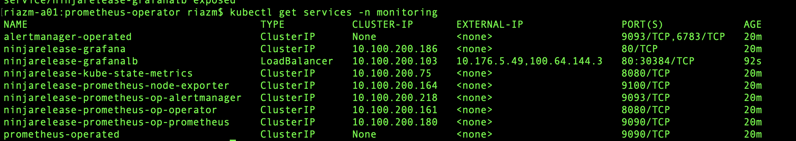
</details>
<br/>

2.6 Point the browser to the external ip of the ninjarelease-grafanalb. 

<details><summary>Screenshot 2.6</summary>
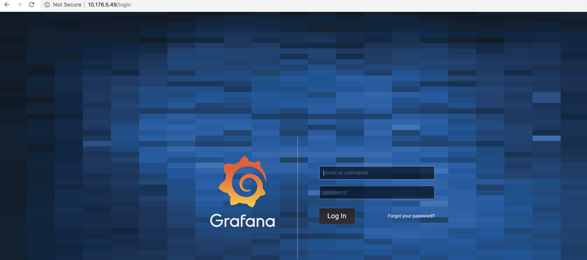
</details>
<br/>

2.6 Login as admin/prom-operator(default). If you have changed the password in step 2.3.1 then use that password. 
Browse through the Pre packaged grafana dashboards charts by clicking on Home.

<details><summary>Screenshot 2.6.1</summary>
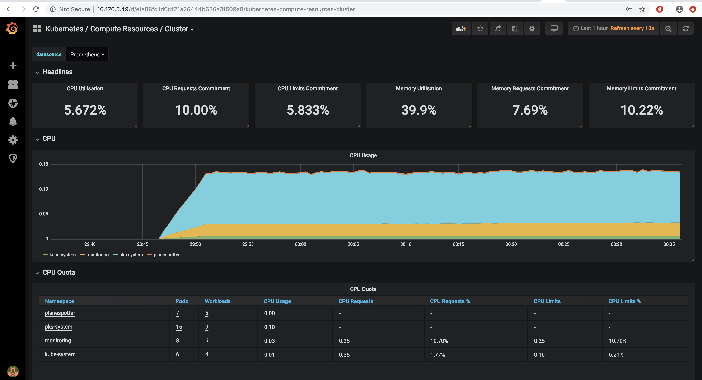
</details>
<br/>

<details><summary>Screenshot 2.6.2</summary>
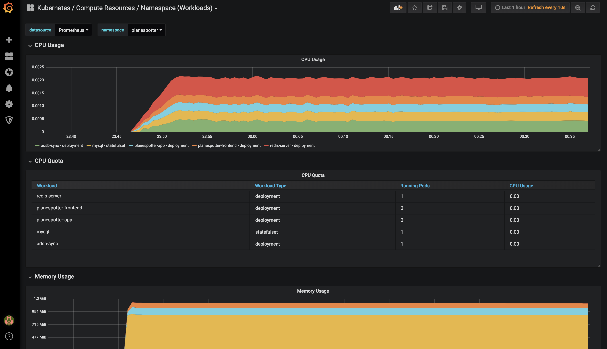
</details>
<br/>


## Step 3:  Deploy Jaeger

3.1 Create a namespace called tracing

```bash
kubectl create ns tracing
```

3.2 Switch context to the tracing namespace

```bash
kubectl config set-context my-cluster --namespace tracing
```

3.2 Deploy Jaeger 
NOTE: This is not a production ready deployment. For production ready Jaeger deployment refer to [Production Environment](https://github.com/jaegertracing/)jaeger-kubernetes

```bash
kubectl create -f https://raw.githubusercontent.com/jaegertracing/jaeger-kubernetes/master/all-in-one/jaeger-all-in-one-template.yml -n tracing
```


## Step 4:  Deploy Order and Account microservices

For more details of the [Order and Account Servicve](https://github.com/riazvm/MonitoringAndTracing)


4.1 Create a yaml for the OrderService deployment. This Yaml file pulls an image from the public repository. The Jaeger configuration is plassed as environment variables. As an alternative you could use Config maps. Deploy into PKS

NOTE: The applciation will run in the same namespace as Jaeger

<details><summary>orderservice.yaml</summary>

```yaml
apiVersion: extensions/v1beta1
kind: Deployment
metadata:
  name: order
spec:
  replicas: 3
  template:
    metadata:
      labels:
        service: order
      annotations:
        prometheus.io/scrape: "true"
    spec:
      containers:
      - name: order 
        image: riazvm/publicrepo:orderservicev7
        ports:
        - name: http
          containerPort: 9090
        - name: prometheus-jmx
          containerPort: 9099
        env:
          - name: JAEGER_SERVICE_NAME
            value: order
          - name: JAEGER_AGENT_HOST
            value: jaeger-agent
          - name: JAEGER_SAMPLER_TYPE
            value: const
          - name: JAEGER_SAMPLER_PARAM
            value: "1"
          - name: JAEGER_REPORTER_LOG_SPANS
            value: "true"
          - name: JAEGER_TAGS
            value: "version=${VERSION}"
          - name: OPENTRACING_METRICS_EXPORTER_HTTP_PATH
            value: "/metrics"
          - name: ACCOUNTMGR_URL
            value: "http://account:8080"
---
kind: Service
apiVersion: v1
metadata:
  name: order
  labels:
    service: order
spec:
  type: LoadBalancer
  selector:
    service: order
  ports:
  - name: http
    port: 9090
```

</details>
<br/>

```bash
kubectl apply -f orderservice.yaml
```

4.2 Create a yaml for the AccountService deployment. This Yaml file pulls an image from the public repository. The Jaeger configuration is plassed as environment variables. As an alternative you could use Config maps. Deploy into PKS

NOTE: The applciation will run in the same namespace as Jaeger

<details><summary>accountservice.yaml</summary>

```yaml
apiVersion: extensions/v1beta1
kind: Deployment
metadata:
  name: account
spec:
  replicas: 3
  template:
    metadata:
      labels:
        service: account
      annotations:
        prometheus.io/scrape: "true"
    spec:
      containers:
      - name: account 
        image: riazvm/publicrepo:accountservicev7
        ports:
        - name: http
          containerPort: 8080
        - name: prometheus-jmx
          containerPort: 9099
        env:
          - name: JAEGER_SERVICE_NAME
            value: account
          - name: JAEGER_AGENT_HOST
            value: jaeger-agent
          - name: JAEGER_SAMPLER_TYPE
            value: const
          - name: JAEGER_SAMPLER_PARAM
            value: "1"
          - name: JAEGER_REPORTER_LOG_SPANS
            value: "true"
          - name: JAEGER_TAGS
            value: "version=${VERSION}"
          - name: OPENTRACING_METRICS_EXPORTER_HTTP_PATH
            value: "/metrics"
          - name: ORDERMGR_URL
            value: "http://order:9090"
kind: Service
apiVersion: v1
metadata:
  name: account
  labels:
    service: account
spec:
  type: LoadBalancer
  selector:
    service: account
  ports:
  - name: http
    port: 8080
```

</details>
<br/>

```bash
kubectl apply -f accountservice.yaml
```

In order to expose the account service to external connections, we can create a node-port service type or a Load Balancer service type. We will be exposing the 'account' service with a load balancer. PKS utilizes an automatically created NSX Load Balancer in this case.

```bash
kubectl expose deployment account --name=account-lb --port=80 --target-port=8080 --type=LoadBalancer --namespace=tracing
```


4.3 The order service is exposed as type loadbalancer. The service definition in the yaml will create a Loadbalancer in NSXT which will make the account and order service routable and can be accessed outside the cluster. To check the external ip of the services run the following


```bash
kubectl get services
```
<details><summary>Screenshot 4.3</summary>

</details>
<br/>


4.4 Invoke the orders operation on the account service. You can use Postman, curl or any client of your choice


<details><summary>Screenshot 4.4</summary>
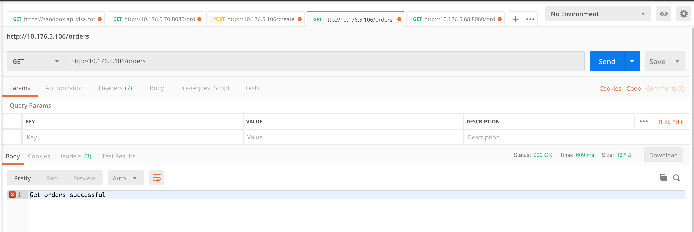
</details>
<br/>

4.5 Invoke the createorder operation on the account service. You can use Postman, curl or any client of your choice


<details><summary>Screenshot 4.5</summary>
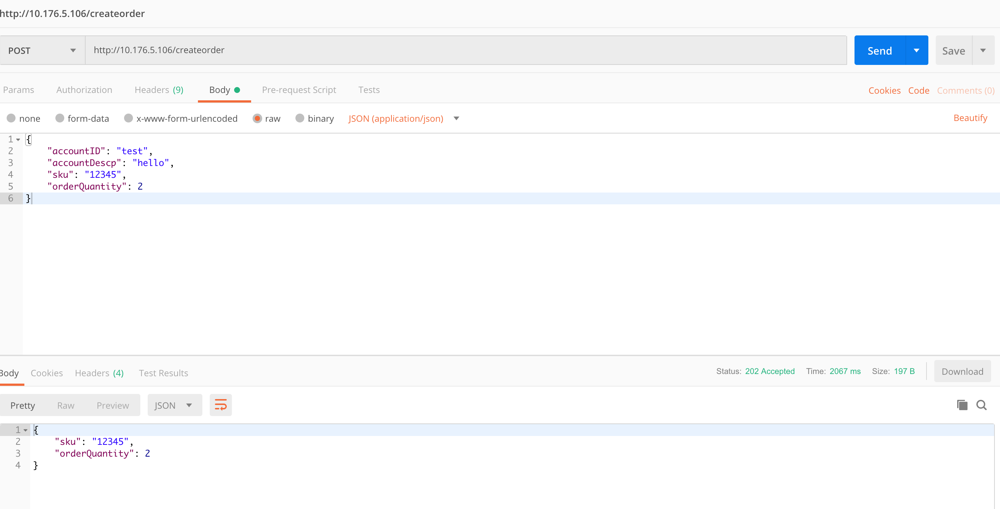
</details>
<br/>


## Step 5:  View trace logs

5.1 Access the jaeger application , to get the external routable ip look up the services


```bash
kubectl get services
```

<details><summary>Screenshot 5.1</summary>

</details>
<br/>

5.2 Access the jaeger application by pointing the browser to the expternal ip of the jaeger-query service


<details><summary>Screenshot 5.2</summary>
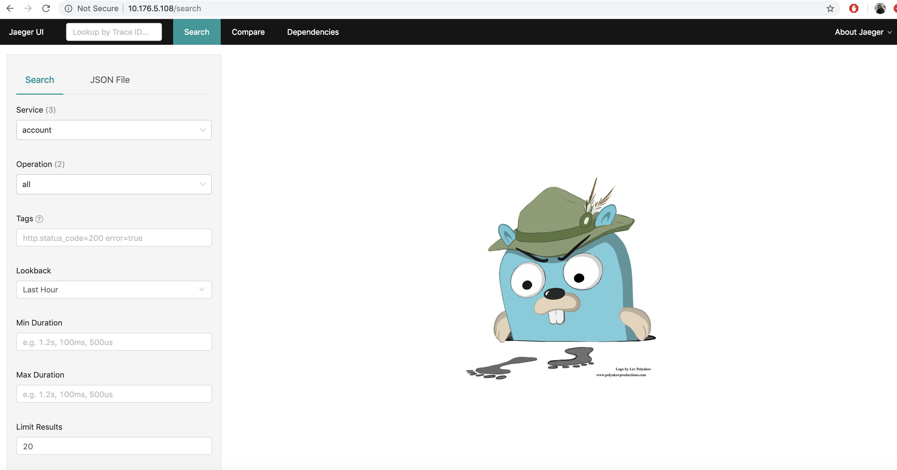
</details>
<br/>

5.3 Select the account service from the dropdown and click on Find Traces

The traces are displyed , the trace logs can be drilled down to view each request SLA etc.

<details><summary>Screenshot 5.3</summary>

</details>
<br/>

## Step 6: Wavefront Integration

## Step 7:  vRLA integration


## Step 8:  vRealize integration


