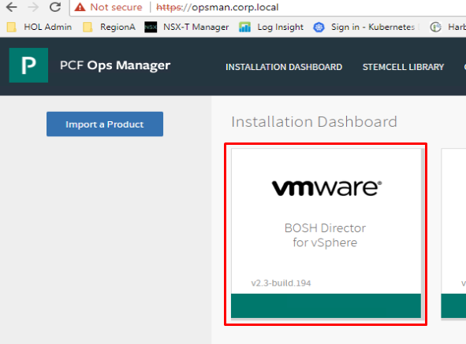
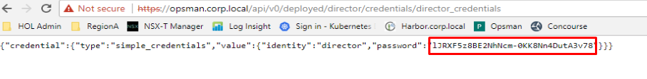
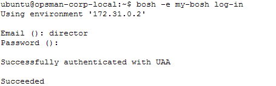
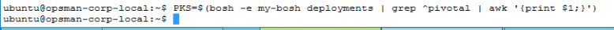
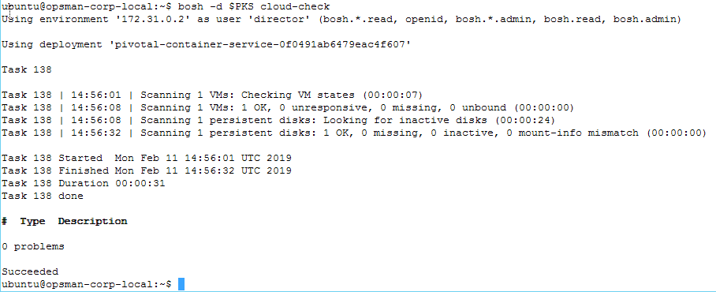

# Lab 16 - PKS Control Plane and BOSH

This lab aligns directly with the provided lecture, and accordingly there is not much explanation of details provided beyond how to execute steps that align with the lecture

## 1.0 - Navigate the BOSH CLI

1.1.1 Log in to the ops manager web interface with username `admin` password `VMware1!`, navigate to `BOSH Director for vSPhere > Status` and observe the details provided. Note the IP address.

<details><summary>Screenshot 1.1.1.1</summary>

</details>

<details><summary>Screenshot 1.1.1.2</summary>

</details>
<br/>

1.1.2 Navigate to the on the `Credentials` tab. On the `Director Credentials` row, click `Link to Credential` and record the password

<details><summary>Screenshot 1.1.2.1</summary>

</details>

<details><summary>Screenshot 1.1.2.2</summary>

</details>
<br/>

1.1.3 From the control center desktop, open a putty session with opsman.corp.local and login with username `ubuntu` password `VMware1!` and enter the following command to prepare a local Bosh Director alias:

```bash
bosh alias-env my-bosh -e 172.31.0.2 --ca-cert /var/tempest/workspaces/default/root_ca_certificate
```

<details><summary>Screenshot 1.1.3</summary>

</details>
<br/>

1.1.4 From the Ops Manager prompt, log into Bosh Director with the command `bosh -e my-bosh log-in` using username `director` and the password you gathered in a recent step

<details><summary>Screenshot 1.1.4</summary>

</details>
<br/>

1.1.5 From the Bosh CLI, check your deployments with the command `bosh -e my-bosh deployments` and observe the name of your PKS deployment, which begins with `pivotal-container-service-...` as shown in the following screenshot

<details><summary>Screenshot 1.1.5</summary>

</details>
<br/>

1.1.6 From the Bosh CLI, enter the command `PKS=$(bosh -e my-bosh deployments | grep ^pivotal | awk '{print $1;}')` to assign the long name of the PKS deployment from the previous command to the `PKS` variable

<details><summary>Screenshot 1.1.6</summary>

</details>
<br/>

1.1.7 From the Bosh CLI, set the BOSH_ENVIRONMENT variable so you dont have to keep typing in the `-e my-bosh` every time you enter a bosh command. Also run the bosh cloud-check with the following commands and observe the output

```bash
export BOSH_ENVIRONMENT=my-bosh
bosh -d $PKS cloud-check
```

<details><summary>Screenshot 1.1.7</summary>

</details>
<br/>

1.1.8 From the Bosh CLI, run the following commands to check the status of the bosh-managed VMs. Observe that the first command lists all VM's managed by your Bosh director while the 2nd command only shows the VMs that are part of the PKS deployment.

Ensure that the `Process State` for each instance is `running` and the value in the `Active` column is `true`

```bash
bosh vms
bosh -d $PKS vms
```

<details><summary>Screenshot 1.1.8</summary>

</details>
<br/>

1.1.9 From the Bosh CLI, enter the following commands to view common bosh commands specific to the PKS deployment, as detailed in the lecture

```bash
bosh -d $PKS vms
bosh -d $PKS instances
bosh -d $PKS tasks
bosh -d $PKS tasks -ar
bosh -d $PKS task 110
bosh -d $PKS task 110 --debug
```

1.1.10 From the Bosh CLI, enter the following commands to assign the bosh deployment name for the `my-cluster` kubernetes custer and view common bosh commands specific to the `my-cluster` deployment, as detailed in the lecture

Note: Do not simply copy/paste the commands below, be sure to go through them one by one to be able to see the output. Also note the SSH commands below, you will need to disconnect from each of the master and worker ssh sessions listed below to return to the opsman/bosh cli

```bash
CLUSTER=$(bosh deployments | grep ^service-instance | awk '{print $1;}')
bosh -d $CLUSTER vms --vitals
bosh -d $CLUSTER tasks --recent=9
bosh -d $CLUSTER task <pick a task ID # from previous command output>  --debug
bosh -d $CLUSTER ssh master/0
bosh -d $CLUSTER ssh worker/0
bosh -d $CLUSTER logs
bosh -d $CLUSTER cloud-check
bosh –d $CLUSTER releases
```
