# Lab PKS Installation Phase 1

**Contents:**

- [Lab PKS Installation Phase 1](#lab-pks-installation-phase-1)
  - [Lab Access Instructions](#lab-access-instructions)
  - [Prerequisites](#prerequisites)
  - [Step 1: Deploy Ops Manager](#step-1-deploy-ops-manager)
  - [Step 2: Deploy BOSH](#step-2-deploy-bosh)
  - [Step 3: Prep for PKS Install](#step-3-prep-for-pks-install)
  - [Next Steps](#next-steps)

## Lab Access Instructions

This lab guide along with the PKS Install Phase 2 lab guide will walk through the process of installing PKS for vSphere with NSX-T in the PKS Ninja lab environment. 

The Phase 1 install aligns with the [Installing Enterprise PKS on vSphere with NSX-T Data Center](https://docs.vmware.com/en/VMware-Enterprise-PKS/1.6/vmware-enterprise-pks-16/GUID-vsphere-nsxt-index.html) documentation steps 5-8. Please refer to this documentation for further details and explanations.  

## Prerequisites

The PKS installation path in this guide requires NSX-T to be installed and Pre-Configured in accordance with the [NSX-T Manual Installation](https://github.com/CNA-Tech/PKS-Ninja/tree/Pks1.6/LabGuides/NsxtManualInstall-IN1497#overview-of-tasks-covered-in-lab-1) and [NSX-T Configuration for PKS](https://github.com/CNA-Tech/PKS-Ninja/tree/Pks1.6/LabGuides/NsxtConfigForPks-NC5947) lab guides on this site.

## Step 1: Deploy Ops Manager

1.1 Login to the vSphere client using the windows system credentials, right click on the `pks-mgmt-1` resource pool and select `Deploy OVF Template`. On the `Select template` screen, select `Local File` and navigate to the Ops Manager OVA file. The file is E:\Downloads, and the file name should begin with "ops-manager-vsphere-" and click `Next`

<details><summary>Screenshot 1.1.1</summary>
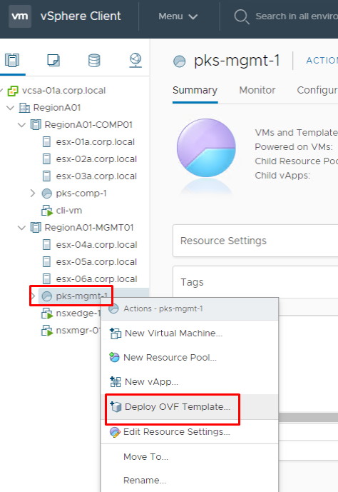
</details>

<details><summary>Screenshot 1.1.2</summary>
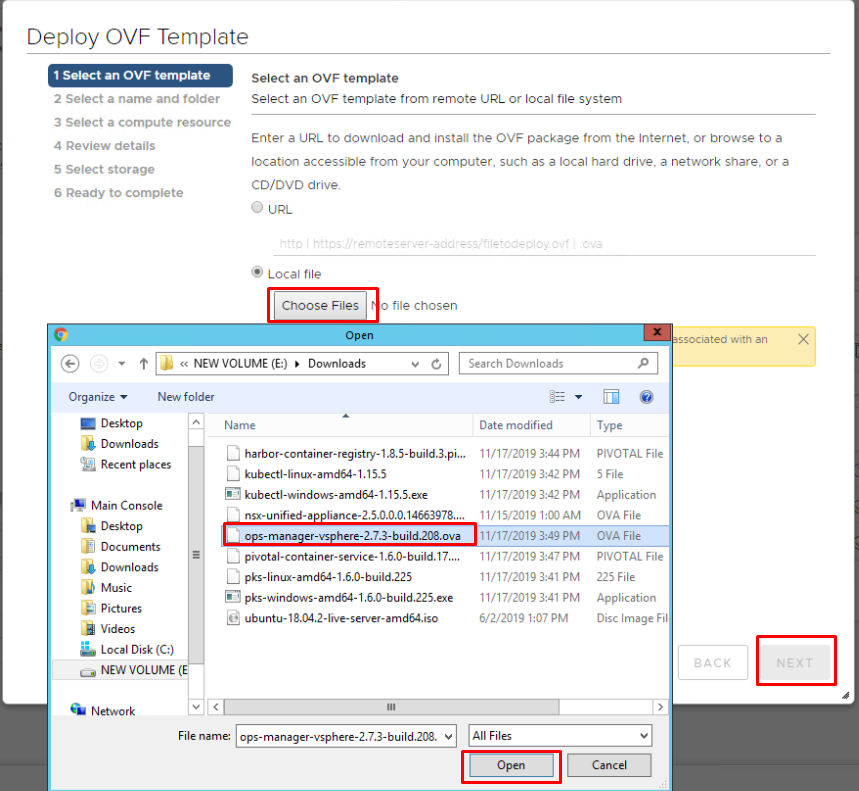
</details>
<br/>

1.2 On the `Select name and location` screen, rename the Virtual machine name `opsman` and select `RegionA01` as the datacenter

<details><summary>Screenshot 1.2</summary>
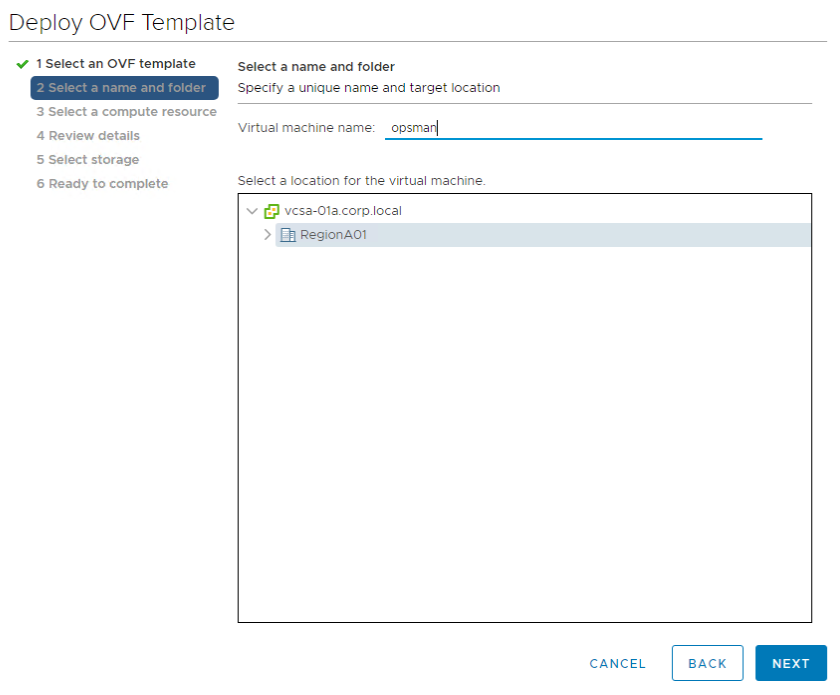
</details>
<br/>

1.3 On the `Select a resource` screen, select the `pks-mgmt-1` resource pool and click `Next`

<details><summary>Screenshot 1.3</summary>
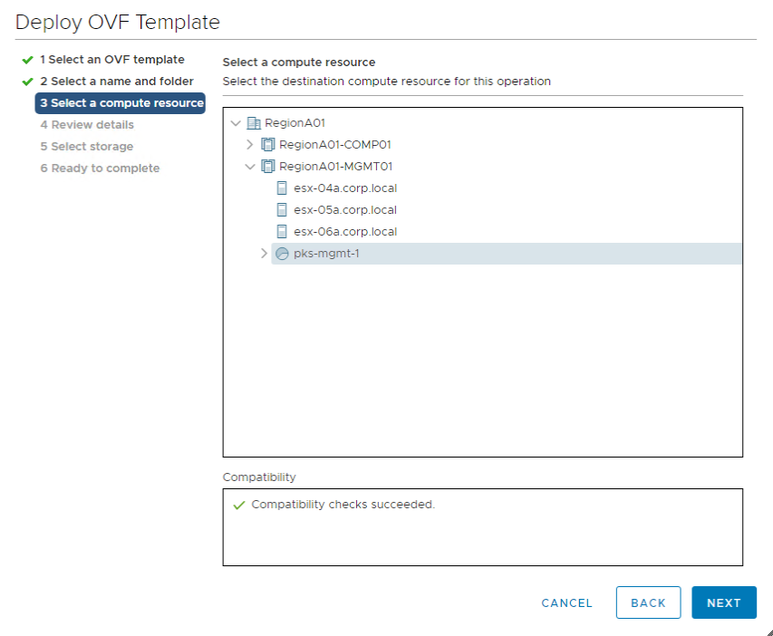
</details>
<br/>

1.4 On the `Review details` screen, confirm the details and click `Next`

<details><summary>Screenshot 1.4</summary>
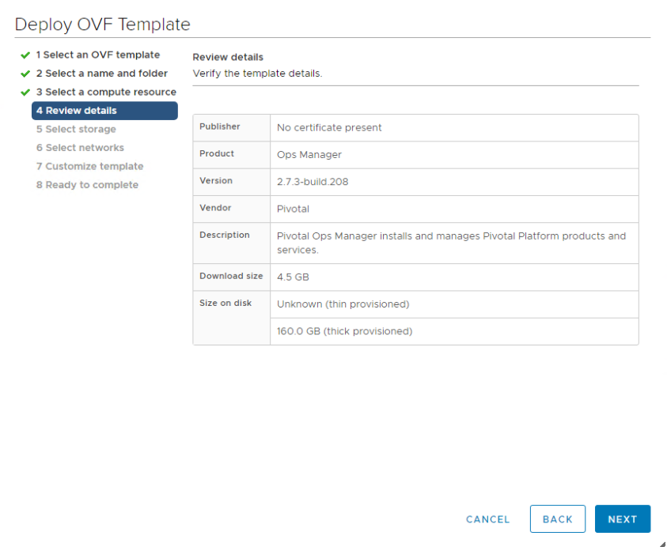
</details>
<br/>

1.5 On the `Select Storage` step, first select the `RegionA01-ISCSI02-COMP01` datastore and then set the virtual disk format to `Thin Provision`.

Note: When you select the datastore, the UI resets the value for the virtual disk format back to thick provision, so its best to select the datastore first and then set the virtual disk format.

<details><summary>Screenshot 1.5</summary>
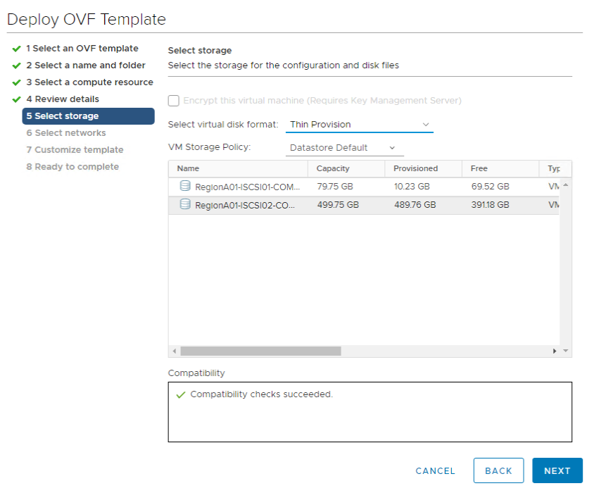
</details>
<br/>

1.6 On the `Select networks` screen, ensure the `Destination Network` is set to `ls-pks-mgmt` and click `NEXT`

<details><summary>Screenshot 1.6</summary>
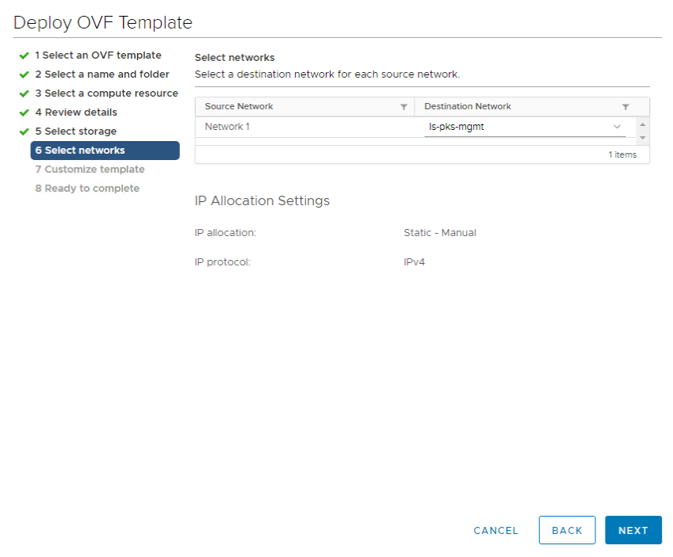
</details>
<br/>

1.7 On the `Customize template` screen, enter the following variables:

  - IP Address: 172.31.0.3
  - Netmask: 255.255.255.0
  - Default Gateway: 172.31.0.1
  - DNS: 192.168.110.10
  - NTP Servers: 192.168.100.1
  - Admin Password: VMware1!
  - Public SSH Key: Open C:\hol\SSH\keys\cc_authkey.txt with notepad, copy the key text, and paste the value here.
  - Custom Hostname: opsman

<details><summary>Screenshot 1.7</summary>
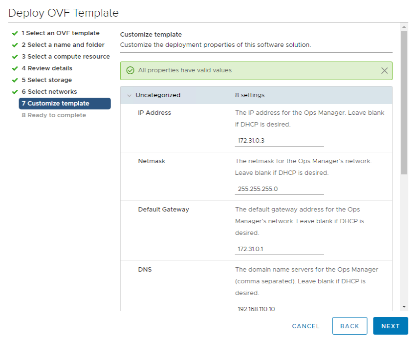
</details>
<br/>

1.8 On the `Ready to complete` screen, confirm the details and click `Finish`

<details><summary>Screenshot 1.8</summary>
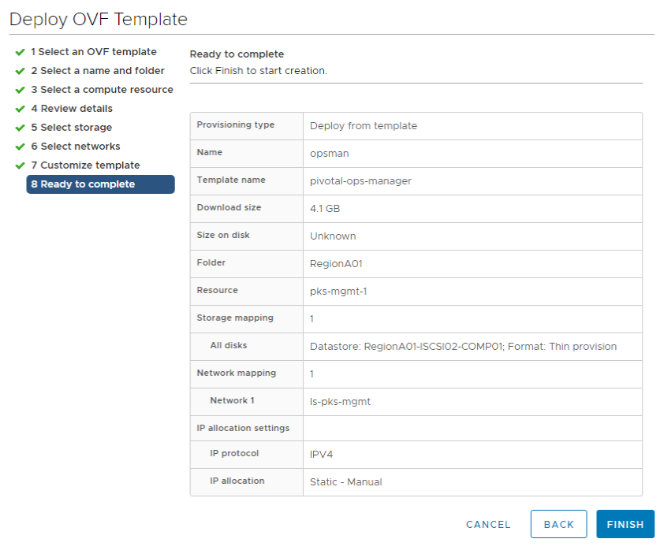
</details>
<br/>

1.9 After completing the `Deploy OVF Template` wizard, go to your recent tasks view and wait for the `Status` to change to `Completed` before proceeding

<details><summary>Screenshot 1.9</summary>
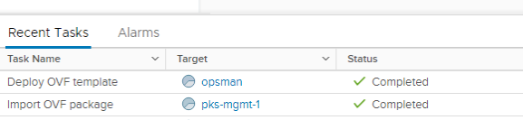
</details>
<br/>

1.10 In the vSphere web client, right click on the opsman vm and select `Power On`

<details><summary>Screenshot 1.10</summary>
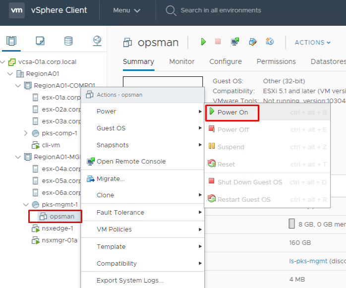
</details>
<br/>

1.11 Open a web browser connection to `https://opsman.corp.local` and select `Internal Authentication`

<details><summary>Screenshot 1.11</summary>
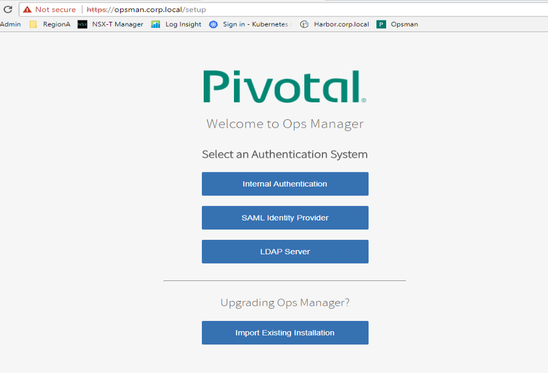
</details>
<br/>

1.12 On the `Internal Authentication` screen, enter the following values, check the box to agree to terms and conditions and click `Setup Authentication`

- Username: admin
- Password: VMware1!
- Decryption Passphrase: VMware1!
- Check "I agree to the terms and conditions..."
- Click "Setup Authentication"

_Note: After clicking `Setup Authentication` it will take several minutes for the authentication system to startm you can proceed with the next step while waiting. The login screen will appear after the authentication system is finished starting up._

<details><summary>Screenshot 1.12</summary>

</details>
<br/>

1.13 From the Ops Manager web UI, login with Username: `admin` Password: `VMware1!`

<details><summary>Screenshot 1.13</summary>

</details>
<br/>

## Step 2: Deploy BOSH

2.1 From the ControlCenter desktop, open putty and connect to the saved session for `ubuntu@cli-vm`.

<details><summary>Screenshot 2.1</summary>
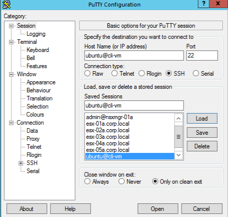
</details>
<br/>

2.2  At the Bash prompt enter the following command to create a new file called nsx-cert.cnf:

```bash
nano /home/ubuntu/nsx-cert.cnf
```
Paste the following text into the text editor window, press the key combination `ctrl + o` to save the file and then press `ctrl + x` to exit nano:

```bash
[ req ]
default_bits = 2048
distinguished_name = req_distinguished_name
req_extensions = req_ext
prompt = no
[ req_distinguished_name ]
countryName = US
stateOrProvinceName = California
localityName = CA
organizationName = VMware
commonName = 192.168.110.42
[ req_ext ]
subjectAltName = @alt_names
[alt_names]
DNS.1 = 192.168.110.42
DNS.2 = nsxmgr-01a.corp.local
DNS.3 = nsxmgr01a-1.corp.local
DNS.4 = 192.168.110.31

```

This file will be used as a certificate signing request, in the following step you will use this file to request to NSX-T Manager to generate and self-sign a certificate using the specifications in this file. 

<details><summary>Screenshot 2.2</summary>
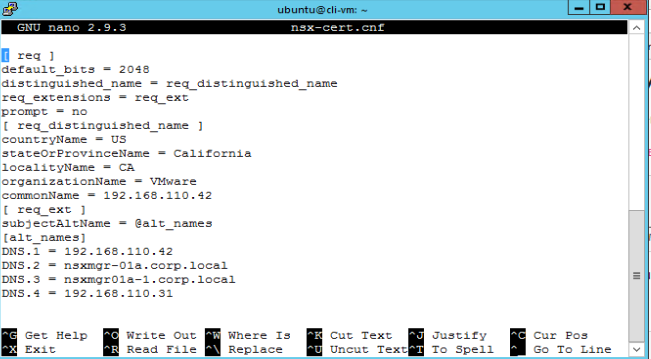
</details>
<br/>

2.3 From the CLI-VM prompt, enter the following commands to generate a new certificate we will use as the NSX API Cert:

```bash
export NSX_MANAGER_IP_ADDRESS=192.168.110.42
export NSX_MANAGER_COMMONNAME=192.168.110.42
openssl req -newkey rsa:2048 -x509 -nodes -keyout nsx.key -new -out nsx.crt -subj /CN=$NSX_MANAGER_COMMONNAME -reqexts SAN -extensions SAN -config <(cat ./nsx-cert.cnf <(printf "[SAN]\nsubjectAltName=DNS:$NSX_MANAGER_COMMONNAME,IP:$NSX_MANAGER_IP_ADDRESS")) -sha256 -days 3650

```

<details><summary>Screenshot 2.3.1</summary>
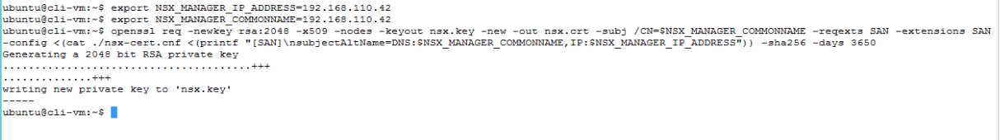
</details>
<br/>

2.4 From the cli-vm prompt, enter the following commands to view the certificate and the private key you generated in the previous step

```bash
cat /home/ubuntu/nsx.crt
cat /home/ubuntu/nsx.key
```

<details><summary>Screenshot 2.4</summary>
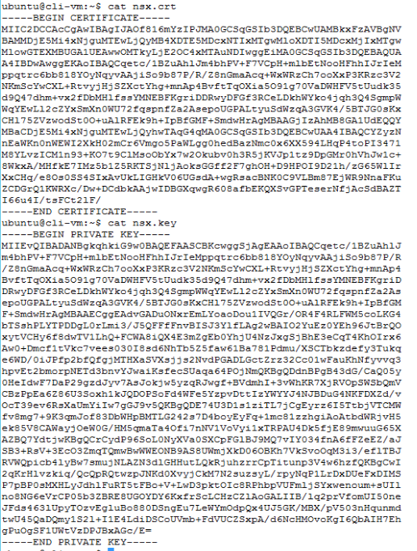
</details>
<br/>

2.5 On the control center desktop, open `Notepad++` from the start menu and create a new tab. On the new tab paste the output from the `nsx.crt` file from the previous step and save the file on the desktop as `nsx.crt`. Do not close the Notepad++ window as you will need to access this text in the following steps

<details><summary>Screenshot 2.5</summary>
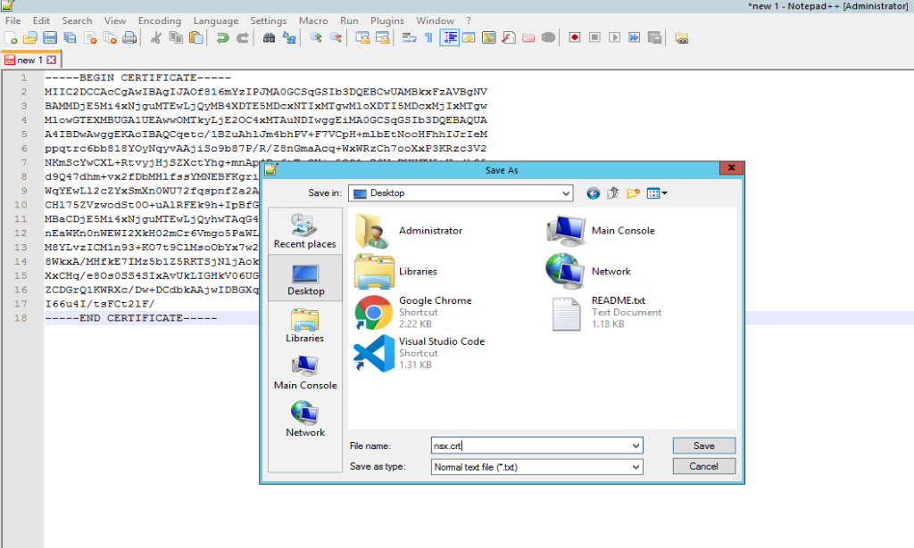
</details>
<br/>

2.6 Open a new tab in Notepad++. Copy the output of the `nsx.key` file, paste it into the new notepad++ tab and save the file on the desktop as `nsx.key`. Do not close the Notepad++ window as you will need to access this text in the following steps

<details><summary>Screenshot 2.6</summary>
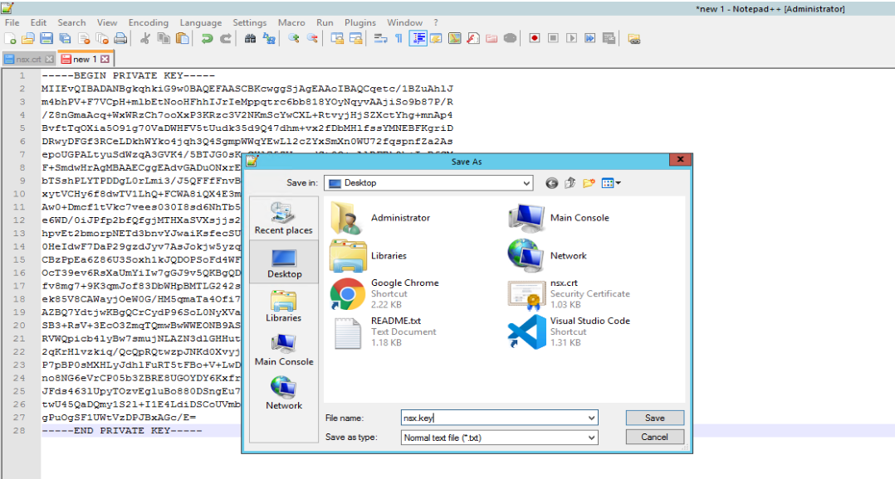
</details>
<br/>


2.7 Log into the NSX Manager UI (Username: admin Password VMware1!VMware1!) navigate to the `System > Certificates` page and click `Import > Import Certificate` 

<details><summary>Screenshot 2.7</summary>
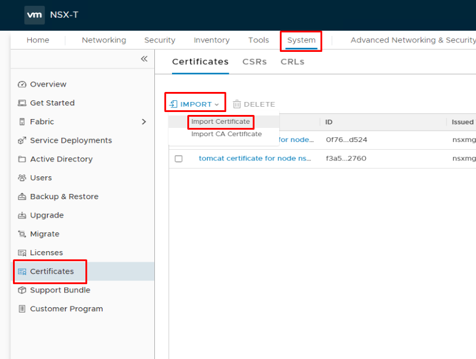
</details>
<br/>

2.8 On the `Import Certificate` window, enter the following values:

- Name: NSX-API-CERT
- Certificate Components: Click `Browse` and select the `nsx.crt` file you created in the previous steps and click `Open`
- Private Key: Click `Browse` and select the `nsx.key` file you created in the previous steps and click `Open`
- Service Certificate: No
- Click `Import`
- The certificate should now be listed as `NSX-API-CERT`, click the `ID` field and copy the value for the `ID` for use in the next step

<details><summary>Screenshot 2.8.1</summary>
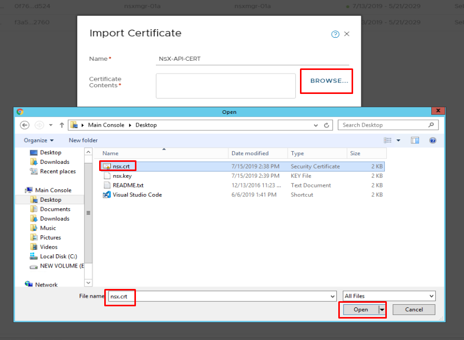
</details>

<details><summary>Screenshot 2.8.2</summary>
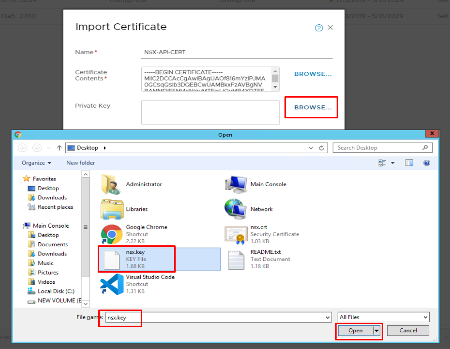
</details>

<details><summary>Screenshot 2.8.3</summary>
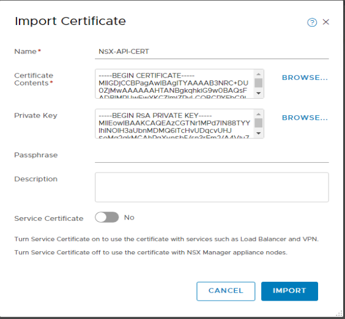
</details>

<details><summary>Screenshot 2.8.4</summary>
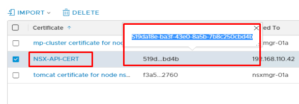
</details>
<br/>

2.9 Return to your session with cli-vm and at the prompt enter the following commands to register the certificate you just imported as the node api certificate for nsx manager

**Make sure to paste the certificate ID you gathered in the previous step into the `export CERTIFICATE_ID="519da18e-ba3f-43e0-8a5b-7b8c250cbd4b"` command below**

```bash
export NSX_MANAGER_IP_ADDRESS=192.168.110.42
export NSX_MANAGER_COMMONNAME=192.168.110.42
export CERTIFICATE_ID="Replace_this_text_with_your_certificate_ID_from_the_previous_step"
curl --insecure -u admin:'VMware1!VMware1!' -X POST "https://$NSX_MANAGER_IP_ADDRESS/api/v1/cluster/api-certificate?action=set_cluster_certificate&certificate_id=$CERTIFICATE_ID"
```

<details><summary>Screenshot 2.9</summary>
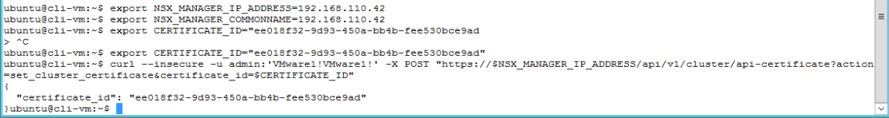
</details>
<br/>

2.10 Return to the Ops Manager web UI, login again if needed, click on the tile `BOSH Director for vSphere`

<details><summary>Screenshot 2.10</summary>

</details>
<br/>

2.11 On the `vCenter Configuration` page, enter the following values and click `Save`:

- Name: vcsa-01a
- vCenter Host: vcsa-01a.corp.local
- vCenter Username: administrator@corp.local
- vCenter Password: VMware1!
- Datacenter Name: RegionA01
- Virtual Disk Type: thin
- Ephemeral Datastore Names: RegionA01-ISCSI02-COMP01
- Persistent Datastore Names: RegionA01-ISCSI02-COMP01
- Select `NSX Networking`
- NSX Mode: NSX-T
- NSX Address: 192.168.110.42
- NSX Username: admin
- NSX Password: VMware1!VMware1!
- Copy and Paste the text from the nsx.crt file you created in the previous steps
- VM Folder: pks_vms  **_(Make sure you change these following values, that begin with pcf_ by default, to begin with pks_)**
- Template Folder: pks_templates
- Disk path Folder: pks_disk
- Click `Save`

<details><summary>Screenshot 2.11.1</summary>

</details>

<details><summary>Screenshot 2.11.2</summary>

</details>
<br/>

2.12 Continue with the Bosh Director tile configuration, select the `Director Config` tab on the left side menu and enter the following values:

- NTP Servers: ntp.corp.local
- Enable VM Resurrector Plugin: True
- Enable Post Deploy Scripts: True
- Recreate All VMs: True
- Leave all other settings set to default values
- Click `Save`

<details><summary>Screenshot 2.12</summary>

</details>
<br/>

2.13 Continue with the Bosh Director tile configuration, select the `Create Availability Zones` tab and enter the following details:

_Note: Each of the availability zones below will have a single cluster. When you add an availability zone, make sure to click `Add` on the upper right side of the window and do **not** click `Add Cluster`_

- Click `Add` to add an Availability Zone with the following values
  - Name: `PKS-MGMT-1`
  - IaaS Configuration: `vcsa-01a`
  - Cluster: `RegionA01-MGMT01`
  - Resource Pool: `pks-mgmt-1`
- Click `Add` to add an Availability Zone with the following values
  - Name: `PKS-COMP`
  - IaaS Configuration: `vcsa-01a`
  - Cluster: `RegionA01-COMP01`
  - Resource Pool: `pks-comp-1`
- Click `Save`

<details><summary>Screenshot 2.13</summary>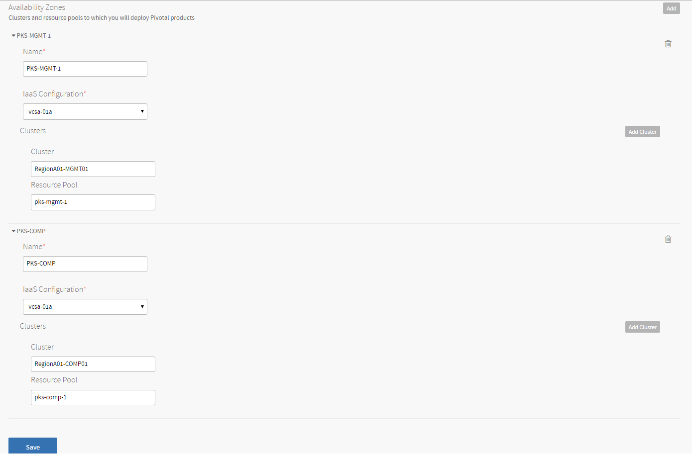</details><br>

2.14 Continue with the Bosh Director tile configuration, select the `Create Networks` tab and enter the following values:

- Enable ICMP Checks: `True`
- Click `Add Network` to add a network with the following values
  - Name: `PKS-MGMT`
  - vSphere Network Name: `ls-pks-mgmt`
  - CIDR: `172.31.0.0/24`
  - Reserved IP Ranges: `172.31.0.1,172.31.0.3`
  - DNS: `192.168.110.10`
  - Gateway: `172.31.0.1`
  - Availability Zones: `PKS-MGMT-1`, `PKS-COMP`
  -Click `Save`

<details><summary>Screenshot 2.14</summary>

</details>
<br/>

2.15 Continue with the Bosh Director tile configuration, select the `Assign AZs and Networks` tab and enter the following values:

- Singleton Availability Zone: `PKS-MGMT-1`
- Network: `PKS-MGMT`
- Click Save

<details><summary>Screenshot 2.15</summary>

</details>
<br/>

2.16 Select the `Security` tab, check the box for `Include OpsManager Root CA in Trusted Certs` and click `Save`.

<details><summary>Screenshot 2.16</summary>
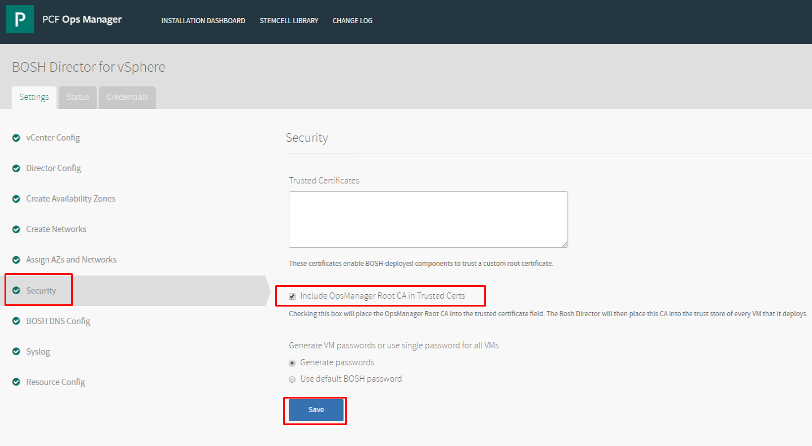
</details>
<br/>

2.17 Select the `Resource Config` tab and change the value of the `VM Type` in the second row for the `Master Compilation Job` to the third medium option `medium.disk` as shown in Screenshot 2.13, and click `Save`

<details><summary>Screenshot 2.17</summary>
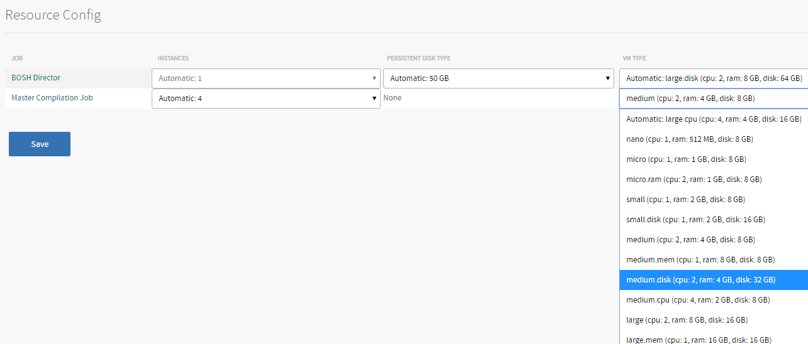
</details>
<br/>

2.18 In the Ops Manager web UI, click on `Installation Dashboard` on the top menu bar and then click `Review Pending Changes`

<details><summary>Screenshot 2.18</summary>

</details>
<br/>

2.19 On the `Review Pending Changes` screen, ensure that the checkbox for Bosh Director is checked and click `Apply Changes`

<details><summary>Screenshot 2.19</summary>
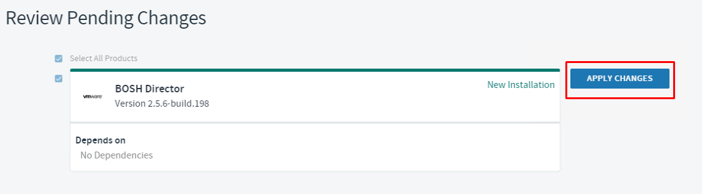
</details>
<br/>

2.20 Review the `Applying Changes` to observe the BOSH VM deployment. While BOSH is deploying, you can skip ahead to Step 3 and return to the `Applying Changes` screen periodically to check the status of the deployment. Once the BOSH deployment is complete, you should see a `Changes applied` popup window as shown in Screenshot 2.16.2

_Note: In the nested example lab, it takes ~30 minutes to complete the BOSH deployment_

<details><summary>Screenshot 2.20.1 </summary>

</details>

<details><summary>Screenshot 2.20.2 </summary>

</details>
<br/>

## Step 3: Prep for PKS Install

_Note: To save time, you will open another instance of Ops Manager admin console and continue to importing the PKS Tile while Bosh continues to deploy. Leave your Bosh deployment browser tab open to continue to monitor the deployment status._

 3.1 Open a new browser tab and select the `Opsman` bookmark to open a second Ops Manager session

 <details><summary>Screenshot 3.1</summary>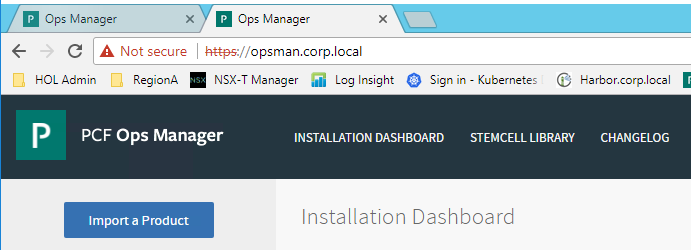</details><br>

3.2 Login to the Ops Manager UI, Click `Import a Product`, select the `PKS` binary file in the E:\Downloads directory as shown in screenshot 3.2. Wait for the import to complete, which could take a few minutes.

<details><summary>Screenshot 3.2 </summary>
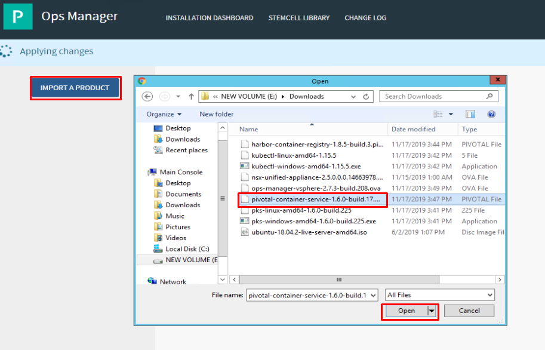
</details>
<br/>

3.3 Generate the NSX-T Principal Identity certificate for PKS authentication to NSX-T Manager. 

From the control center desktop open a putty session with `cli-vm`  and use a text editor to create the `create_certificate.sh` file with the following command:

```bash
nano create_certificate.sh
```

3.4 Expand the below section and copy the text to the file _(Note: Right-click to paste while in Putty)_:

<details><summary>Click to expand create_certificate.sh</summary><br>

``` bash
#!/bin/bash
#create_certificate.sh

NSX_MANAGER="192.168.110.42"
NSX_USER="admin"

PI_NAME="pks-nsx-t-superuser"
NSX_SUPERUSER_CERT_FILE="pks-nsx-t-superuser.crt"
NSX_SUPERUSER_KEY_FILE="pks-nsx-t-superuser.key"

stty -echo
printf "Password: "
read NSX_PASSWORD
stty echo

openssl req \
  -newkey rsa:2048 \
  -x509 \
  -nodes \
  -keyout "$NSX_SUPERUSER_KEY_FILE" \
  -new \
  -out "$NSX_SUPERUSER_CERT_FILE" \
  -subj /CN=pks-nsx-t-superuser \
  -extensions client_server_ssl \
  -config <(
    cat /etc/ssl/openssl.cnf \
    <(printf '[client_server_ssl]\nextendedKeyUsage = clientAuth\n')
  ) \
  -sha256 \
  -days 730

cert_request=$(cat <<END
  {
    "display_name": "$PI_NAME",
    "pem_encoded": "$(awk '{printf "%s\\n", $0}' $NSX_SUPERUSER_CERT_FILE)"
  }
END
)

curl -k -X POST \
    "https://${NSX_MANAGER}/api/v1/trust-management/certificates?action=import" \
    -u "$NSX_USER:$NSX_PASSWORD" \
    -H 'content-type: application/json' \
    -d "$cert_request"
```

</details>
<br>

3.5 Save the file and exit

``` bash
Ctrl + O
Enter
Ctrl + X
```

<details><summary>Screenshot 3.5</summary>
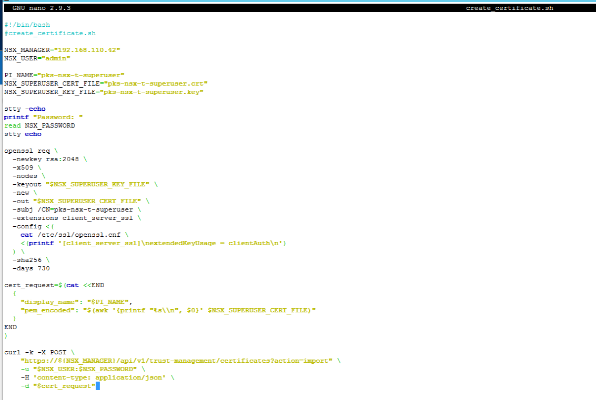
</details>
<br/>

3.6 From the command line, enter the following command. Enter the password `VMware1!VMware1!` when prompted

```bash
source create_certificate.sh
```

<br>

3.7 Copy the certificate ID (As highlighted below in screenshot 3.7.1) to your instance of Notepad++ and label as `NSX PI Cert ID`

<details><summary>Screenshot 3.7.1</summary>

</details>
<br/>

<details><summary>Screenshot 3.7.2</summary>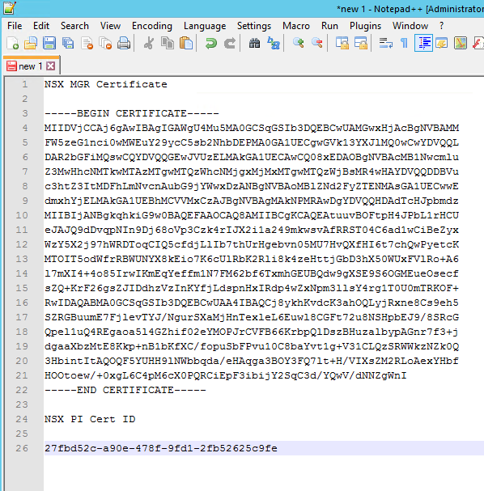</details><br>

3.8 Review the contents of the NSX PI certificate & key with the below commands, add them to the Notepad++ instance with each labeled as PI Cert abd PI Key repspectively.

``` bash
cat pks-nsx-t-superuser.crt
cat pks-nsx-t-superuser.key
```

<details><summary>Screenshot 3.8</summary>
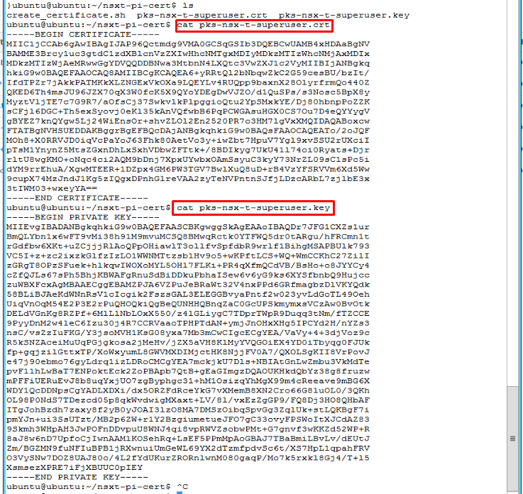
</details>
<br/>

3.9 Create and register the Principal Identity in NSX-T for PKS. From the `cli-vm` prompt, use a text editor to create a file

```bash
nano create_pi.sh
```

3.10 Expand the text below and copy the text to your file. _**Do not cut and paste this script exactly, make sure to change the CERTIFICATE_ID to the id value you copied to Notepadd++ and labeled `NSX PI Cert ID` earlier**_

<details><summary>Click to expand create_pi.sh</summary>

``` bash
#!/bin/bash
#create_pi.sh

NSX_MANAGER="192.168.110.42"
NSX_USER="admin"
CERTIFICATE_ID="Replace this text with your certificate ID"

PI_NAME="pks-nsx-t-superuser"
NSX_SUPERUSER_CERT_FILE="pks-nsx-t-superuser.crt"
NSX_SUPERUSER_KEY_FILE="pks-nsx-t-superuser.key"
NODE_ID=$(cat /proc/sys/kernel/random/uuid)

stty -echo
printf "Password: "
read NSX_PASSWORD
stty echo

pi_request=$(cat <<END
    {
         "display_name": "$PI_NAME",
         "name": "$PI_NAME",
         "permission_group": "superusers",
         "certificate_id": "$CERTIFICATE_ID",
         "node_id": "$NODE_ID"
    }
END
)

curl -k -X POST \
    "https://${NSX_MANAGER}/api/v1/trust-management/principal-identities" \
    -u "$NSX_USER:$NSX_PASSWORD" \
    -H "content-type: application/json" \
    -d "$pi_request"

curl -k -X GET \
    "https://${NSX_MANAGER}/api/v1/trust-management/principal-identities" \
    --cert $(pwd)/"$NSX_SUPERUSER_CERT_FILE" \
    --key $(pwd)/"$NSX_SUPERUSER_KEY_FILE"
```

</details>
<br/>

<details><summary>Screenshot 3.10</summary>

</details>
<br/>

3.11 Save and exit. From the bash prompt, enter the below command. Enter the password `VMware1!VMware1!` when prompted.

```bash
source create_pi.sh
```

<details><summary>Screenshot 3.11</summary>
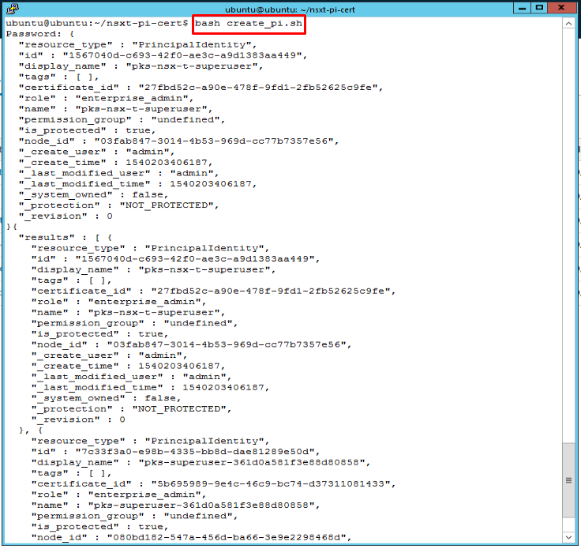
</details>
<br/>

3.12 In the NSX Manager UI, go to `System > Users` and verify that you see a user account for `pks-nsx-t-superuser`

_Note: Login for NSX Manager UI is: `admin/VMware1!VMware1!`_

<details><summary>Screenshot 3.12</summary>
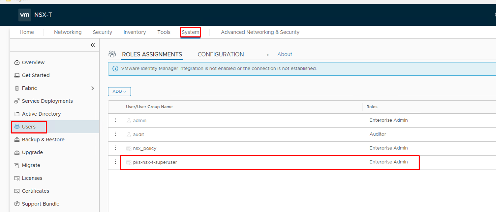
</details>
<br/>

3.13 Return to the Ops Manager web ui. Ensure that the BOSH Director installation completes before proceeding.

_**Note: Do not discard the values you've stored in Notepad++, you will need them again for PKS Install Phase 2.**_

**End of lab**

## Next Steps
- Complete the PKS installation with the PKS Install Phase 2 Lab.


