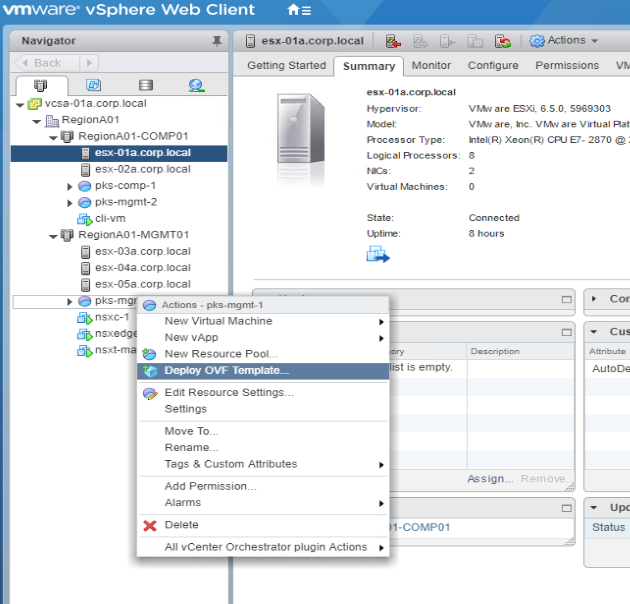
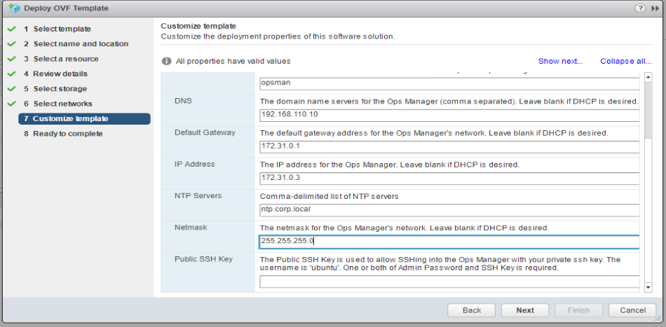
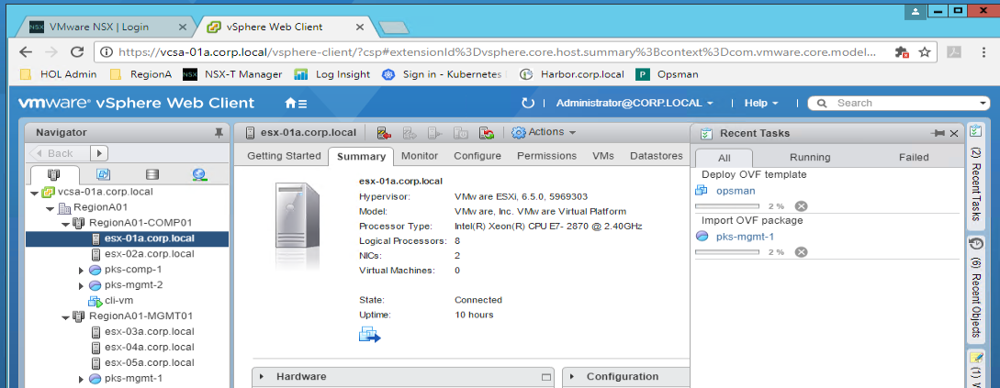
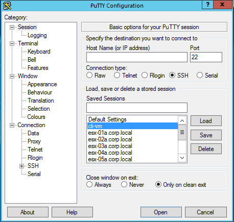
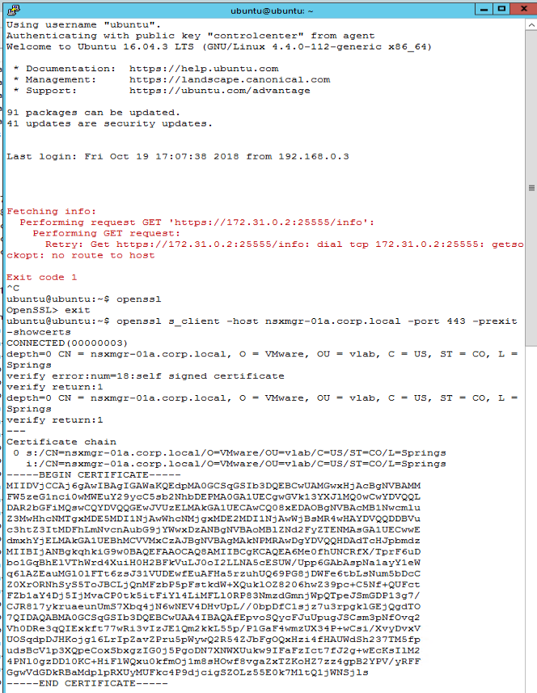
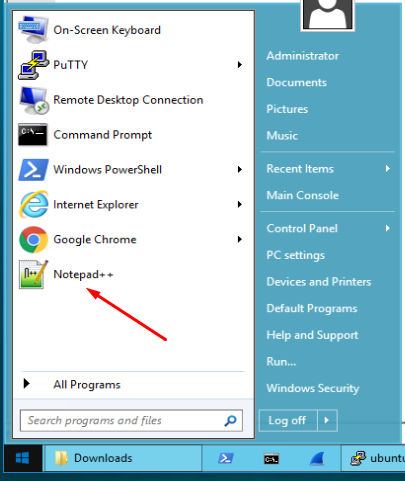
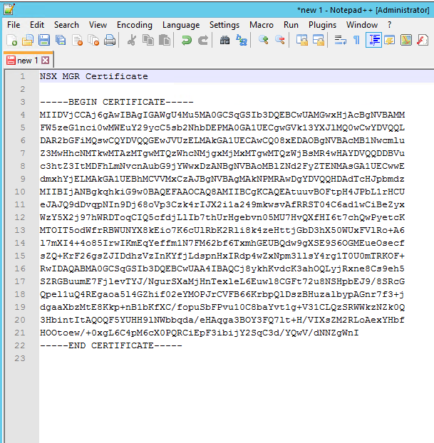
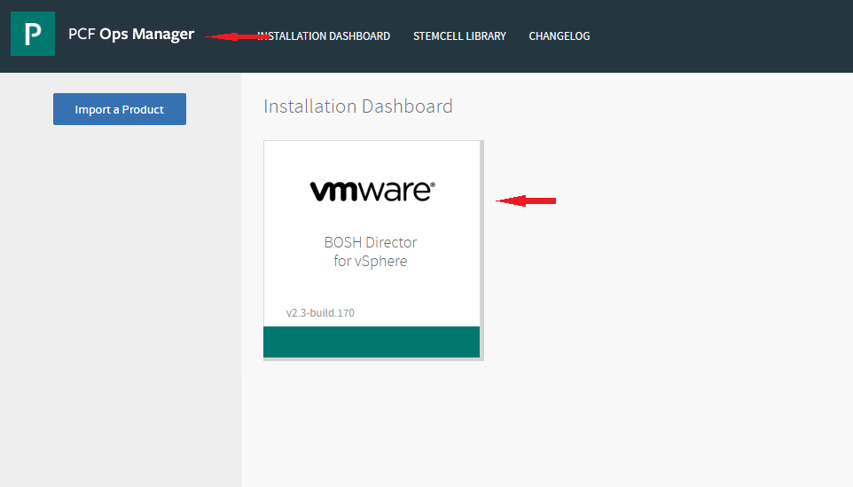
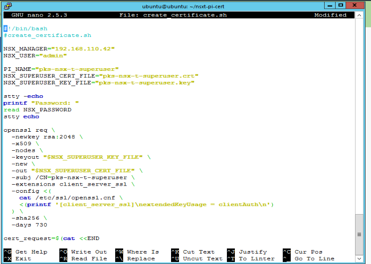

# Lab PKS Installation Phase 1

**Contents:**

- [Lab Access Instructions](#lab-access-instructions)
- [Step 1: Deploy Ops Manager](#step-1-deploy-ops-manager)
- [Step 2: Deploy BOSH](#step-2-deploy-bosh)
- [Step 3: Prep for PKS Install](#step-3-prep-for-pks-install)
- [Next Steps](#next-steps)

## Lab Access Instructions

For PKS Ninja students using the labs provided in the course, the lab admins will provide you with an IP address to RDP into the ControlCenter desktop in the vPod that has been assigned to you.

Obtaining IP address of the ControlCenter desktop (If using VMware Learning Platform): From browser on the virtual lab environment deskop, go to http://myip.oc.vmware.com/

All instructions in this lab guide should be performed from the ControlCenter desktop unless otherwise specified.

PKS installation on vSphere requires NSX-T to be installed. If NSX-T is not installed in your environment, jump to [NSX-T Pipeline Install](/LabGuides/NsxtPipelineInstall-IN7016/) to install and return here. One way to verify if NSX-T is installed is try accessing the NSX Manager/Console.

## Step 1: Deploy Ops Manager

1.1 Launch the Chrome browser from the desktop or Windows taskbar, and launch the **RegionA vCenter** vSphere web client from the **RegionA** bookmarks folder, select *Use Windows session authentication* and click **Login**. In the vSphere web client, right click on the `pks-mgmt-1` resource pool and select `Deploy OVF Template`

<details><summary>Screenshot 1.1</summary>
>
</details>
<br/>

1.2 On the `Select template` screen, select `Local File` and navigate to the Ops Manager OVA file. The file is E:\Downloads, and named "pcf-vsphere-2.3.build.170.ova"

<details><summary>Screenshot 1.2</summary>

</details>
<br/>

1.3 On the `Select name and location` screen, rename the Virtual machine name `opsman` and select `RegionA01` as the datacenter

<details><summary>Screenshot 1.3</summary>

</details>
<br/>

1.4 On the `Select a resource` screen, select the `pks-mgmt-1` resource pool

<details><summary>Screenshot 1.4</summary>

</details>
<br/>

1.5 On the `Review details` screen, confirm the details and click `Next`

<details><summary>Screenshot 1.5</summary>

</details>
<br/>

1.6 On the `Select storage` screen, set `Thin Provision` as the virtual disk format and `RegionA01-ISCSI01-COMP01` as the datastore

<details><summary>Screenshot 1.6</summary>

</details>
<br/>

1.7 On the `Select networks` screen, ensure the `Destination Network` is set to `VM-RegionA01-vDS-MGMT`

_Note: This VM will later be attached to the `ls-pks-mgmt`, however we are connecting it to a different network during the `Deploy OVF Template` wizard as at the time of writing, there is a bug that prevents attachment to a logical switch. After the OVF deployment is complete, a later step will have you change the network attachment._

<details><summary>Screenshot 1.7</summary>

</details>
<br/>

1.8 On the `Customize template` screen, enter the following variables:

  - Admin Password: VMware1!
  - Custom Hostname: opsman
  - DNS: 192.168.110.10
  - Default Gateway: 172.31.0.1
  - IP Address: 172.31.0.3
  - NTP Servers: ntp.corp.local
  - Netmask: 255.255.255.0
  - Public SSH Key: (leave blank)

<details><summary>Screenshot 1.8</summary>

</details>
<br/>

1.9 On the `Ready to complete` screen, confirm the details and click `Finish`

<details><summary>Screenshot 1.9</summary>

</details>
<br/>

1.10 After completing the `Deploy OVF Template` wizard, go to your recent tasks view and wait for the `Status` to change to `Completed` before proceeding

_Note: In the Nested example lab, it takes ~20 minutes to deploy the Ops Manager VM_

<details><summary>Screenshot 1.10</summary>

</details>
<br/>

1.11 In the vSphere web client in the `Hosts and Clusters` view, expand the `pks-mgmt-1` resource pool and select the opsman vm. On the `Actions` pulldown select `Edit Settings`

<details><summary>Screenshot 1.11</summary>

</details>
<br/>

1.12 On the `Edit Settings` menu for the opsman vm, set `Network Adapter 1` to `ls-pks-mgmt` 

<details><summary>Screenshot 1.12</summary>

</details>
<br/>

1.13 In the vSphere web client, right click on the opsman vm and select `Power On`

<details><summary>Screenshot 1.13</summary>

</details>
<br/>

1.14 Open a web browser connection to `opsman.corp.local` and select `Internal Authentication`

<details><summary>Screenshot 1.14</summary>

</details>
<br/>

1.15 On the `Internal Authentication` screen, enter the following values, check the box to agree to terms and conditions and click `Setup Authentication`

- Username: admin
- Password: VMware1!
- Decryption Passphrase: VMware1!
- Check "I agree to the terms and conditions..."
- Click "Setup Authentication"

_Note: After clicking `Setup Authentication` it will take several minutes for the authentication system to start. The login screen will appear after the authentication system is finished starting up._

<details><summary>Screenshot 1.15</summary>

</details>
<br/>

1.16 From the Ops Manager web UI, login with Username: `admin` Password: `VMware1!`

<details><summary>Screenshot 1.16</summary>

</details>
<br/>

## Step 2: Deploy BOSH

2.1 From the ControlCenter desktop, open putty and connect to `cli-vm`

<details><summary>Screenshot 2.1</summary></details><br>

2.2  At the Bash prompt enter the following command:

```
openssl s_client -host nsxmgr-01a.corp.local -port 443 -prexit -showcerts
```

<details><summary>Screenshot 2.2</summary>

</details>
<br/>

2.3 Open Microsoft `Notepad++` from the control center desktop and copy the certificate section of step 2.2 output into it. Copy from `-----Begin Certificate` to `End Certificate-----`.  Label this section as `NSX MGR Certificate` for reference in future steps.

_Note: Leave notepad++ open, you will be adding more reference values to it for this lab and the phase 2 lab._

<details><summary>Screenshot 2.3.1</summary>

</details>
<details><summary>Screenshot 2.3.2</summary></details><br>

2.4 Log into the Ops Manager web UI and click on the tile `BOSH Director for vSphere`

<details><summary>Screenshot 2.4</summary>

</details>
<br/>

2.5 On the `vCenter Configuration` page, enter the following values and click `Save`:
- Name: vcsa-01a
- vCenter Host: vcsa-01a.corp.local
- vCenter Username: administrator@vsphere.local
- vCenter Password: VMware1!
- Datacenter Name: RegionA01
- Virtual Disk Type: thin
- Ephemeral Datastore Names: RegionA01-ISCSI01-COMP01
- Persistent Datastore Names: RegionA01-ISCSI01-COMP01
- Select `NSX Networking`
- NSX Mode: NSX-T
- NSX Address: nsxmgr-01a.corp.local
- NSX Username: admin
- NSX Password: VMware1!
- Copy and Paste the NSX MGR Certificate from step 2.3
- VM Folder: pks_vms
- Template Folder: pks_templates
- Disk path Folder: pks_disk
- Click `Save`

<details><summary>Screenshot 2.5.1</summary>

</details>

<details><summary>Screenshot 2.5.2</summary>

</details>
<br/>

2.6 Continue with the Bosh Director tile configuration, select the `Director Config` tab on the left side menu and enter the following values:

- NTP Servers: ntp.corp.local
- Enable VM Resurrector Plugin: True
- Enable Post Deploy Scripts: True
- Recreate All VMs: True
- Leave all other settings set to default values
- Click `Save`

<details><summary>Screenshot 2.6</summary>

</details>
<br/>

2.7 Continue with the Bosh Director tile configuration, select the `Create Availability Zones` tab and enter the following details:

Note: Each of the availability zones below will have a single cluster. When you add an availability zone, make sure to click `Add` on the upper right side of the window and do **not** click `Add Cluster`
- Click `Add` to add an Availability Zone with the following values
  - Name: PKS-MGMT-1
  - IaaS Configuration: vcsa-01a
  - Cluster: RegionA01-MGMT01
  - Resource Pool: pks-mgmt-1
- Click `Add` to add an Availability Zone with the following values
  - Name: PKS-COMP
  - IaaS Configuration: vcsa-01a
  - Cluster: RegionA01-COMP01
  - Resource Pool: pks-comp-1
- Click `Save`

<details><summary>Screenshot 2.7</summary>

</details>
<br/>

2.8 Continue with the Bosh Director tile configuration, select the `Create Networks` tab and enter the following values:

- Enable ICMP Checks: True
- Click `Add Network` to add a network with the following values
  - Name: PKS-MGMT
  - vSphere Network Name: ls-pks-mgmt
  - CIDR: 172.31.0.0/24
  - Reserved IP Ranges: 172.31.0.1-172.31.0.3 
  - DNS 192.168.110.10
  - Gateway 172.31.0.1
  - Availability Zones: PKS-MGMT-1
- Click `Add Network` to add a network with the following values:
  - Name: PKS-COMP
  - vSphere Network Name: ls-pks-service
  - CIDR: 172.31.2.0/23
  - Reserved IP Ranges: 172.31.2.1
  - DNS: 192.168.110.10
  - Gateway: 172.31.2.1
  - Availability Zones: PKS-COMP
  -Click `Save`

<details><summary>Screenshot 2.8.1</summary>

</details>

<details><summary>Screenshot 2.8.2</summary>

</details>
<br/>

2.9 Install OpsMan Root Certificate on BOSH

_Note: In this step, you install the Ops Manager root certificate in the BOSH director tile. Among other connections, this will enable trust between all PKS deployed K8s nodes and the Harbor registry._

- Log into the Ops Manager UI, go to `Admin > Settings > Advanced` and click `Download Root CA Cert` as shown in Screenshot 2.9.1

<details><summary>Screenshot 2.9</summary>

</details>
<br/>

2.10 From the ControlCenter desktop Notepad++, select `File > Open` and select the `root_ca_certificate` from the `E:\Downloads` directory, and copy the contents of the file to the clipboard. 

<details><summary>Screenshot 2.10.1</summary>

</details>

<details><summary>Screenshot 2.10.2</summary>

</details>
<br/>

2.11 From the Ops Manager UI homepage click the `BOSH Director for vSphere` tile, go to the `Security` tab and paste the certificate in the `Trusted Certificates` textbox and click `Save`.

<details><summary>Screenshot 2.11.1</summary>

</details>

<details><summary>Screenshot 2.11.2</summary>

</details>
<br/>

2.12 Continue with the Bosh Director tile configuration, select the `Assign AZs and Networks` tab and enter the following values:

- Singleton Availability Zone: PKS-MGMT-1
- Network: PKS-MGMT
- Click Save

<details><summary>Screenshot 2.12</summary>

</details>
<br/>

2.13 Continue with the Bosh Director tile configuration, select the `Resource Config` tab and change the value of the `VM Type` in the second row to `medium.disk` as shown in Screenshot 2.7
-Click Save

<details><summary>Screenshot 2.13</summary>

</details>
<br/>

2.14 In the Ops Manager web UI, click on `Installation Dashboard` on the top menu bar and then click `Review Pending Changes`

<details><summary>Screenshot 2.14</summary>

</details>
<br/>

2.15 On the `Review Pending Changes` screen, ensure that the checkbox for Bosh Director is checked and click `Apply Changes`

<details><summary>Screenshot 2.15</summary>

</details>
<br/>

2.16 Review the `Applying Changes` to observe the BOSH VM deployment. While BOSH is deploying, you can skip ahead to Step 3 and return to the `Applying Changes` screen periodically to check the status of the deployment. Once the BOSH deployment is complete, you should see a `Changes applied` popup window as shown in Screenshot 2.16.2

_Note: In the nested example lab, it takes ~30 minutes to complete the BOSH deployment_

<details><summary>Screenshot 2.16.1 </summary>

</details>

<details><summary>Screenshot 2.16.2 </summary>

</details>
<br/>

## Step 3: Prep for PKS Install

_Note: To save time, you will open another instance of Ops Manager admin console to continue to configuring the PKS Tile while Bosh continues to deploy. Leave your Bosh deployment browser tab open to continue to monitor the deployment status._

 3.1 Open a new browser tab and select the `Opsman` bookmark to open a second Ops Manager session

 <details><summary>Screenshot 3.1</summary></details><br>

3.2 Login to the Ops Manager UI, Click `Import a Product`, select the Pivotal Container Service binary file. This is the final step of the phase 1 lab, when you resume with the phase 2 installation lab you will complete the PKS installation

<details><summary>Screenshot 3.2 </summary>

</details>
<br/>

3.3 Generate the NSX-T Principal Identity certificate for PKS authentication to NSX-T Manager. From the ControlCenter desktop, open putty and connect to `cli-vm`. Enter the following commands:

``` bash
mkdir nsxt-pi-cert
cd nsxt-pi-cert
```

3.4 Use a text editor to create a file with the following shell script

```
nano create_certificate.sh
``` 

3.5 Expand the below section and copy the text to the file:

<details><summary>Click to expand create_certificate.sh</summary><br>

``` bash
#!/bin/bash
#create_certificate.sh

NSX_MANAGER="192.168.110.42"
NSX_USER="admin"

PI_NAME="pks-nsx-t-superuser"
NSX_SUPERUSER_CERT_FILE="pks-nsx-t-superuser.crt"
NSX_SUPERUSER_KEY_FILE="pks-nsx-t-superuser.key"

stty -echo
printf "Password: "
read NSX_PASSWORD
stty echo

openssl req \
  -newkey rsa:2048 \
  -x509 \
  -nodes \
  -keyout "$NSX_SUPERUSER_KEY_FILE" \
  -new \
  -out "$NSX_SUPERUSER_CERT_FILE" \
  -subj /CN=pks-nsx-t-superuser \
  -extensions client_server_ssl \
  -config <(
    cat /etc/ssl/openssl.cnf \
    <(printf '[client_server_ssl]\nextendedKeyUsage = clientAuth\n')
  ) \
  -sha256 \
  -days 730

cert_request=$(cat <<END
  {
    "display_name": "$PI_NAME",
    "pem_encoded": "$(awk '{printf "%s\\n", $0}' $NSX_SUPERUSER_CERT_FILE)"
  }
END
)

curl -k -X POST \
    "https://${NSX_MANAGER}/api/v1/trust-management/certificates?action=import" \
    -u "$NSX_USER:$NSX_PASSWORD" \
    -H 'content-type: application/json' \
    -d "$cert_request"
```

</details>
<br>

3.6 Save the file and exit

``` bash
Ctrl + O
Enter
Ctrl + X
```

<details><summary>Screenshot 3.6</summary>

</details>
<br/>

3.7 From the command line, enter the following command. Enter the password `VMware1!` when prompted

```
source create_certificate.sh
```

<br>

3.8 Copy the certificate ID (As highlighted below in screenshot 3.8) to your instance of Notepad++. 

<details><summary>Screenshot 3.8</summary>

</details>
<br/>

3.9 Label the Notepad++ entry as `NSX PI Cert ID`

<details><summary>Screenshot 3.9</summary></details><br>

3.10 Review the contents of the NSX PI certificate & key with the below commands, add them to the Notepad++ instance with each labeled as PI Cert abd PI Key repspectively. You will need these when configuring the PKS tile in PKS Phase 2 lab.

``` bash
cat pks-nsx-t-superuser.crt
cat pks-nsx-t-superuser.key
```

<details><summary>Screenshot 3.10</summary>

</details>
<br/>

3.11 Create and Register Principal Identity. From the `cli-vm` prompt, use a text editor to create a file

``` 
nano create_pi.sh
```

3.12 Expand the text below and copy the text to your file. _**Do not cut and paste this script exactly, make sure to change the CERTIFICATE_ID to the id value you copied to Notepadd++ earlier**_

<details><summary>Click to expand create_pi.sh</summary>

``` bash
#!/bin/bash
#create_pi.sh

NSX_MANAGER="192.168.110.42"
NSX_USER="admin"
CERTIFICATE_ID='27fbd52c-a90e-478f-9fd1-2fb52625c9fe'

PI_NAME="pks-nsx-t-superuser"
NSX_SUPERUSER_CERT_FILE="pks-nsx-t-superuser.crt"
NSX_SUPERUSER_KEY_FILE="pks-nsx-t-superuser.key"
NODE_ID=$(cat /proc/sys/kernel/random/uuid)

stty -echo
printf "Password: "
read NSX_PASSWORD
stty echo

pi_request=$(cat <<END
    {
         "display_name": "$PI_NAME",
         "name": "$PI_NAME",
         "permission_group": "superusers",
         "certificate_id": "$CERTIFICATE_ID",
         "node_id": "$NODE_ID"
    }
END
)

curl -k -X POST \
    "https://${NSX_MANAGER}/api/v1/trust-management/principal-identities" \
    -u "$NSX_USER:$NSX_PASSWORD" \
    -H 'content-type: application/json' \
    -d "$pi_request"

curl -k -X GET \
    "https://${NSX_MANAGER}/api/v1/trust-management/principal-identities" \
    --cert $(pwd)/"$NSX_SUPERUSER_CERT_FILE" \
    --key $(pwd)/"$NSX_SUPERUSER_KEY_FILE"
```

</details>
<br/>

<details><summary>Screenshot 3.12</summary>

</details>
<br/>

3.13 Save and exit. From the bash prompt, enter the below command. Enter the password `VMware1!` when prompted. 

```
source create_pi.sh
```

<details><summary>Screenshot 3.13</summary>

</details>
<br/>

3.14 In the NSX Manager UI, go to `System > Users` and verify that you see a user account for `pks-nsx-t-superuser`

_Note: Login for NSX Manager UI is: `admin/VMware1!`_

<details><summary>Screenshot 3.13</summary>

</details>
<br/>

_**Note: Do not discard the values you've stored in Notepad++, you will need them again for PKS Install Phase 2.**_

**End of lab**

## Next Steps
- Complete the PKS installation with the PKS Install Phase 2 Lab.
