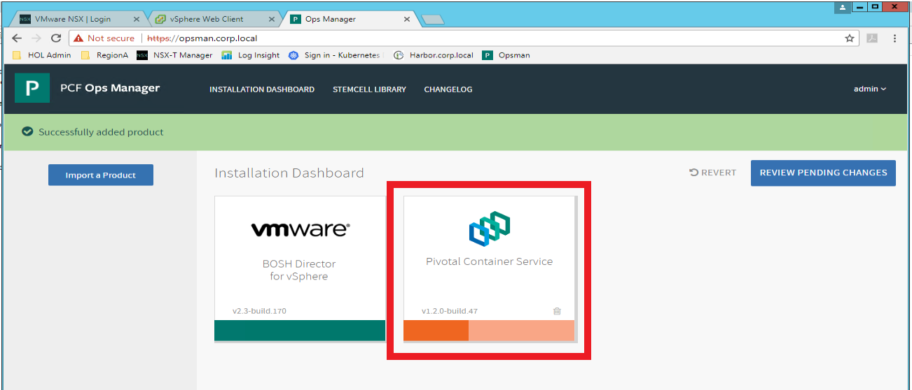
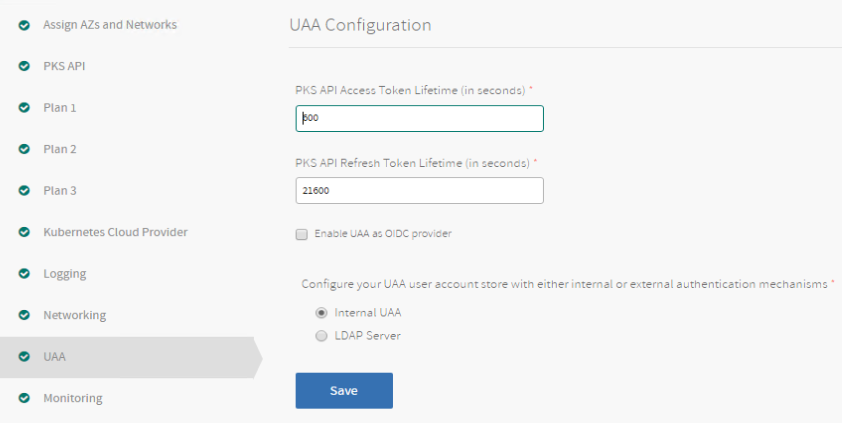
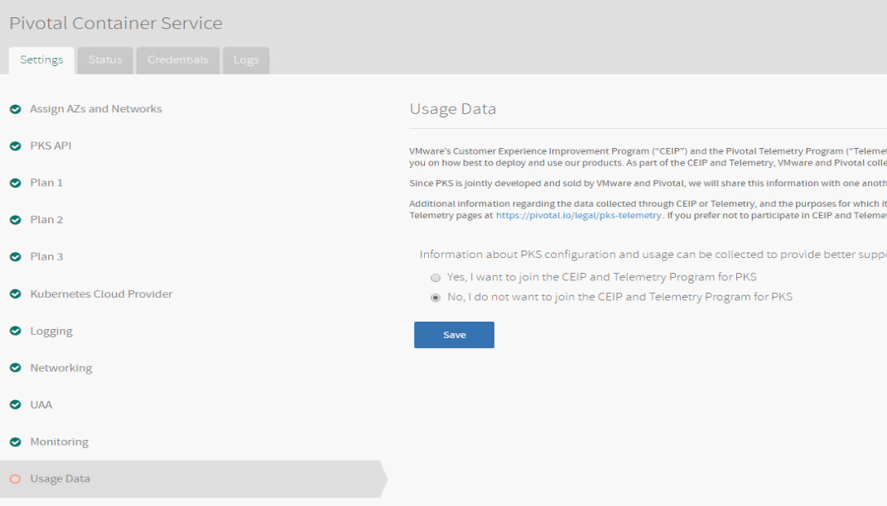
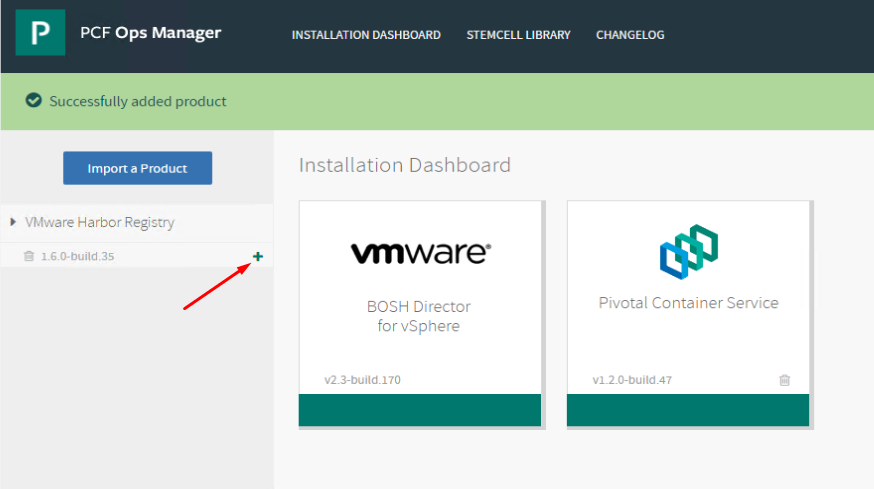
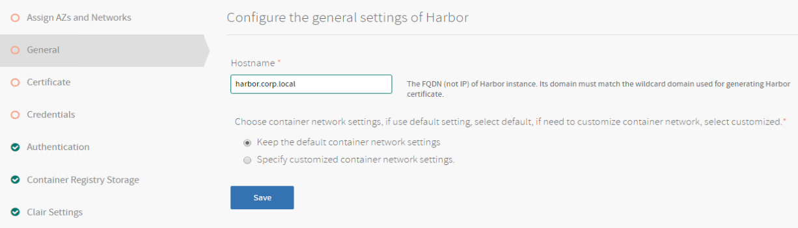
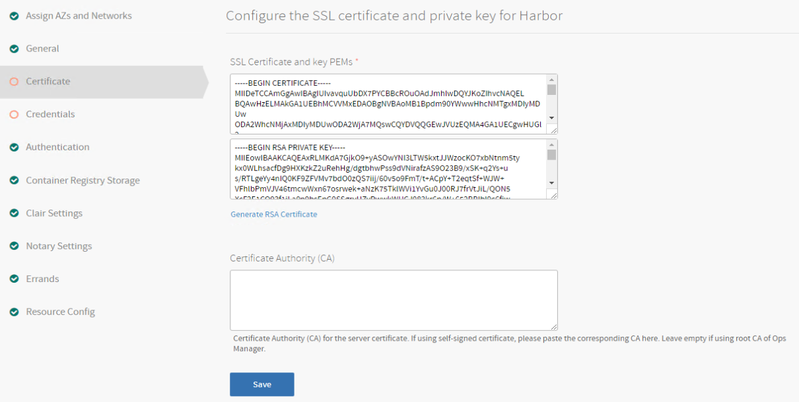
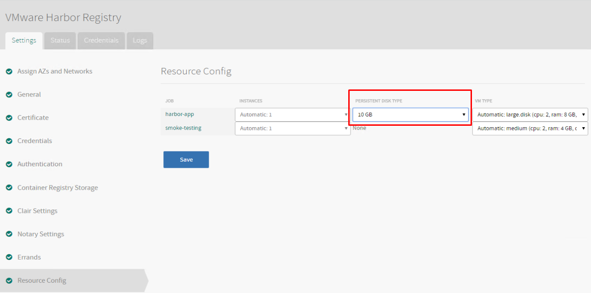

# Lab 3: PKS Installation Phase 2

**Contents:**

- [Step 1: Install PKS]()
- [Step 2: Install Harbor]()
- [Next Steps]()

## Step 1: Install PKS

1.1 Login to the Ops Manager UI and click on the Pivotal Container Service tile to access its configuration settings

Note: If you do not see a `Pivotal Container Service` tile, check the left hand column and next to `Pivotal Container Service` click the `+` icon as shown in Screenshot 1.1.b and the `Pivotal Container Service` tile will be added to the `Installation Dashboard` and you can click on it to view the tile configuration

Screenshot 1.1 

Screenshot 1.1.b 

 

1.2 Select the `Assign AZs and Network Assignments` tab and enter the following values:

- Place singleton jobs in : PKS-MGMT-2
- Balance other jobs in: PKS-MGMT-2
- Network: PKS-MGMT
- Service Network: PKS-COMP
- Click Save

Screenshot 1.2

 

1.3 Select the `PKS API` tab and enter the following values:

- API Hostname: pks.corp.local
- Click `Generate RSA Certificate`
  - to generate the certificate, use the value `*.corp.local` and click `Generate`
- Click Save

Screenshot 1.3.1

Screenshot 1.3.2

 

1.4 Select the `Plan 1` tab and enter the following values:

- Master/ETCD Availability Zones: PKS-COMP
- Worker Persistent Disk Type: 10gb
- Worker Availability Zone: PKS-COMP
- Enable Priviledged Containers: true
- Click Save

Screenshot 1.4

 

1.5 Select the `Plan 2` tab and enter the following values:

- Active: True
- Master/ETCD Node Instances: 1
- Master/ETCD VM Type: medium (cpu: 2, ram: 4 GB, disk: 8 GB)
- Master Availability Zone: PKS-COMP
- Worker VM Type: large (cpu: 2, ram: 8 GB, disk: 16 GB)
- Worker Persistent Disk Type: 10gb
- Worker Availability Zone: PKS-COMP
- Enable Privileged Containers: True
- Click Save

Screenshot 1.5

 

1.6 Select the `Plan 3` tab, set the value for `Plan` to `Inactive` and click `Save`

Screenshot 1.6

 

1.7 Select the `Kubernetes Cloud Provider` tab and enter the following values:

- Choose your IaaS: vSphere
- vCenter Master Credentials: administrator@vsphere.local
  - Password: VMware1!
- vCenter Host: vcsa-01a.corp.local
- Datacenter Name: RegionA01
- Datastore Name: RegionA01-ISCSI01-COMP01
- Stored VM Folder: pks_vms
- Click Save

Screenshot 1.7

 

1.8 Prepare Variables to Configure the `Networking` tab

1.8.1 Log into the NSX Manager UI, go to `Networking > IPAM`, and on the IPAM page and gather the ID for the `ip-block-nodes-deployments` and `ip-block-pods-deployments` and keep note of the values
Login for NSX Manager UI is: admin/VMware1!

Screenshot 1.8.1.1

Screenshot 1.8.1.2

 

1.8.2 In the NSX Manager UI, go to `Networking > Routing`, click on t0-pks and gather the t0-pks ID value

Screenshot 1.8.2

 

1.8.3 In the NSX Manger UI, go to the `Inventory > Groups > IP Pools` click on the ID value for `ip-pool-vips` and a pop-up window will display the entire ID value, keep note of it

Screenshot 1.8.3

 

1.9 Return to the Ops Manager UI, go to the settings page for Pivotal Container Service, click on the `Networking` tab and enter the following values:

- Container Networking Interface: NSX-T
- NSX Manager Hostname: nsxmgr-01a.corp.local
- NSX Manager Super User Principal Identity Certificate: Use the PI certificate values you gathered and copied to Notepad in PKS Phase 1 lab, pasting the certificate in the first box and the key in the 2nd box
- NSX Manager CA Cert: Use the NSX CA certificate value you gathered in the PKS Phase 1 lab
- Disable SSL certificate verification: True
- NAT mode: True
- Pods IP Block ID: Use the value you gathered in step 1.8.1.2 above
- Nodes IP Block ID: Use the value you gathered in step 1.8.1.1 above
- T0 Router ID: Use the value you gathered in step 1.8.2 above
- Floating IP Pool ID: Use the value you gathered in step 1.8.3 above
- Nodes DNS: 192.168.110.10
- vSphere Cluster Names: RegionA01-COMP01
- Enable outbound internet access: True
- Click Save

Screenshot 1.9.1

 

Screenshot 1.9.2

 

1.10 Select the `UAA` tab, click the radio button for `Internal UAA` and click `Save`

Screenshot 1.10

 

1.11 Select the `Usage Data` tab, select `No, I do not want to join the CEIP and Telemetry Program for PKS` and click `Save`

Screenshot 1.11

 

1.12 Select the `Errands` tab and enter the following values:

- NSX-T Validation Errand: On
- Delete all clusters errand: On
- Click Save

Screenshot 1.12

 

1.13 In the Ops Manager UI on the top menu bar click `Installation Dashboard`, next select `Review Pending Changes` and on the `Review Pending Changes`, select `Apply Changes`

Screenshot 1.13

 

1.14 After you click `Apply Changes` BOSH will begin deploying PKS and it will take a while to complete. In the nested example lab, the PKS deployment took ~1 hour to complete.

Leave the `Applying Changes` window open and check it periodically for status. While waiting for the deployment, use another browser tab to open a second connection to the Ops Manager UI and use the second browser session to complete the harbor configuration in the next section.

### Step 2: Install Harbor

2.1 On a new browser tab, open a connection to the Ops Manager UI, click on `Import a Product` select the Harbor file and click `Open`. It can take a few minutes to import the Harbor file

Screenshot 2.1.1 

Screenshot 2.1.2 

 

2.2 In the left hand column of the Ops Manager homepage under `VMware Harbor Registy`, click on the `+` icon to add the Harbor tile to the `Installation Dashboard`

Screenshot 2.2 

 

2.3 Click on the `VMware Harbor Registry` tile to open its configuration settings

Screenshot 2.3 

 

2.4 Select the `Assign AZs and Networks` tab and enter the following values:

- Singleton Availability Zone: PKS-MGMT-1
- Balance other jobs in: PKS-MGMT-1
- Network: PKS-MGMT
- Click `Save`

Screenshot 2.4

 

2.5 Select the `General` tab and set the `Hostname` to `harbor.corp.local` , Click `Save`

Screenshot 2.5

 

2.6 Select the `Certificate` tab, select `Generate RSA Certificate`, enter `harbor.corp.local` and click `Generate`

Screenshot 2.6

 

2.7 On the `Certificate` tab, click `Save`

Screenshot 2.7

 

2.8 On the `Credentials` tab, set the `Admin Password` to `VMware1!` and click `Save`

Screenshot 2.8

 

2.9 On the `Resource Config` tab, set the `Persistent Disk Type` to `20 GB`

Screenshot 2.9

 

**STOP**: Before proceeding, ensure that the PKS tile deployment has completed.  There will be a blue bar across the top that will show `Applying Changes` and a button for `Show Progress` as it continues to apply

2.10 In the Ops Manager UI on the top menu bar click `Installation Dashboard`, next select `Review Pending Changes` and on the `Review Pending Changes`, select `Apply Changes`. Monitor the `Applying Changes` screen until the deployment is complete

Screenshot 2.10

 

**You have now completed the PKS installation**

***End of lab***
