# Lab: PKS Installation Phase 2

## Install PKS

1.1 Login to the Ops Manager UI. On the left navigation bar under `Import a Product`, you should see an entry for an `Enterprise PKS` with the version and build number listed, with a `+` icon. Click on the `+` icon as shown in the screenshot below, and then click on the orange PKS tile view the tile configuration.

Screenshot 1.1.1 

Screenshot 1.1.2 

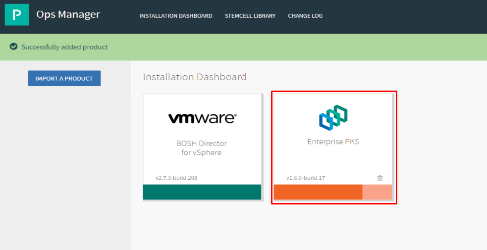

 

1.2 Select the `Assign AZs and Networks` tab and enter the following values:

- Place singleton jobs in : PKS-MGMT-1
- Balance other jobs in: PKS-MGMT-1
- Network: PKS-MGMT
- Service Network: PKS-MGMT
- Click `Save`

Screenshot 1.2

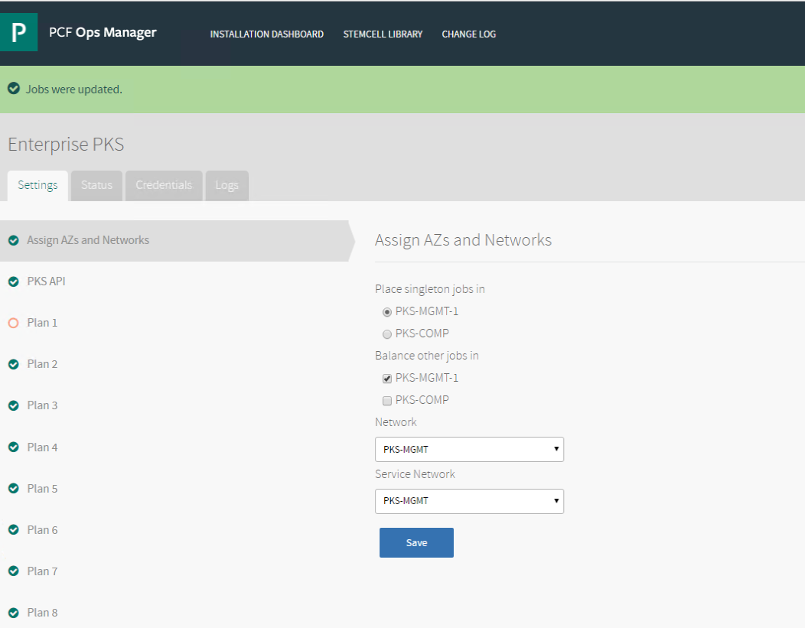

 

1.4 Select the `PKS API` tab and enter the following values:

- API Hostname: pks.corp.local
- Click `Generate RSA Certificate`
  - to generate the certificate, use the value `*.corp.local` and click `Generate`
- Click `Save`

Screenshot 1.4.1

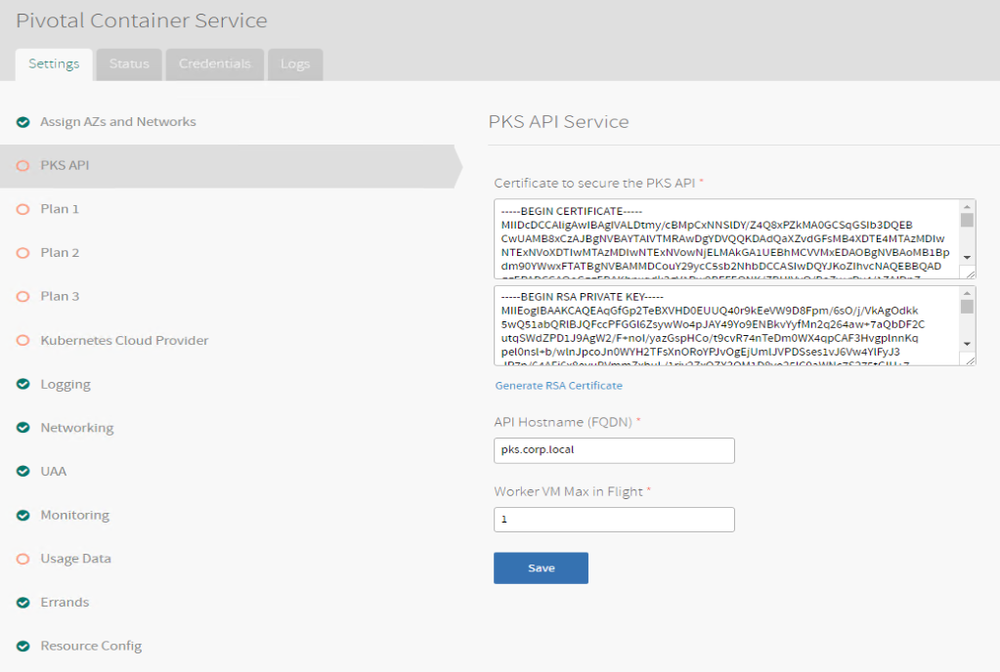

Screenshot 1.4.2

 

1.5 Select the `Plan 1` tab and enter the following values:

- Name: tiny
- Master/ETCD Availability Zones: PKS-COMP
- Worker Node Instances: 1
- Worker Persistent Disk Type: 20gb
- Worker Availability Zone: PKS-COMP
- Allow Privileged: true
- Click `Save`

Screenshot 1.5

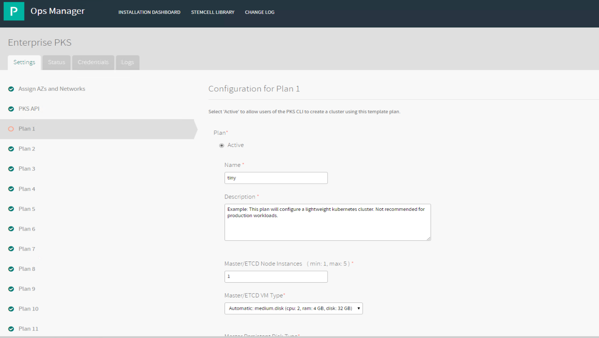

 

1.6 Select the `Plan 2` tab and enter the following values:

- Plan: Active
- Name: small
- Master/ETCD Node Instances: 1
- Master/ETCD Availability Zones: PKS-COMP
- Worker Node Instances: 2
- Worker Persistent Disk Type: 20gb
- Worker Availability Zone: PKS-COMP
- Enable Priviledged Containers: true
- Click `Save`

Screenshot 1.6

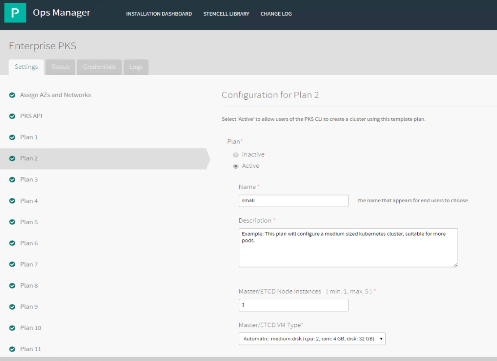

 

1.7 Select the `Plan 3` tab, ensure the value for `Plan` is set to `Inactive` and click `Save`

Screenshot 1.7

 

1.8 Select the `Kubernetes Cloud Provider` tab and enter the following values:

- Choose your IaaS: `vSphere`
- vCenter Master Credentials: `administrator@corp.local`
  - Password: `VMware1!`
- vCenter Host: `vcsa-01a.corp.local`
- Datacenter Name: `RegionA01`
- Datastore Name: `RegionA01-ISCSI02-COMP01`
- Stored VM Folder: `pks_vms`
- Click `Save`

Screenshot 1.8

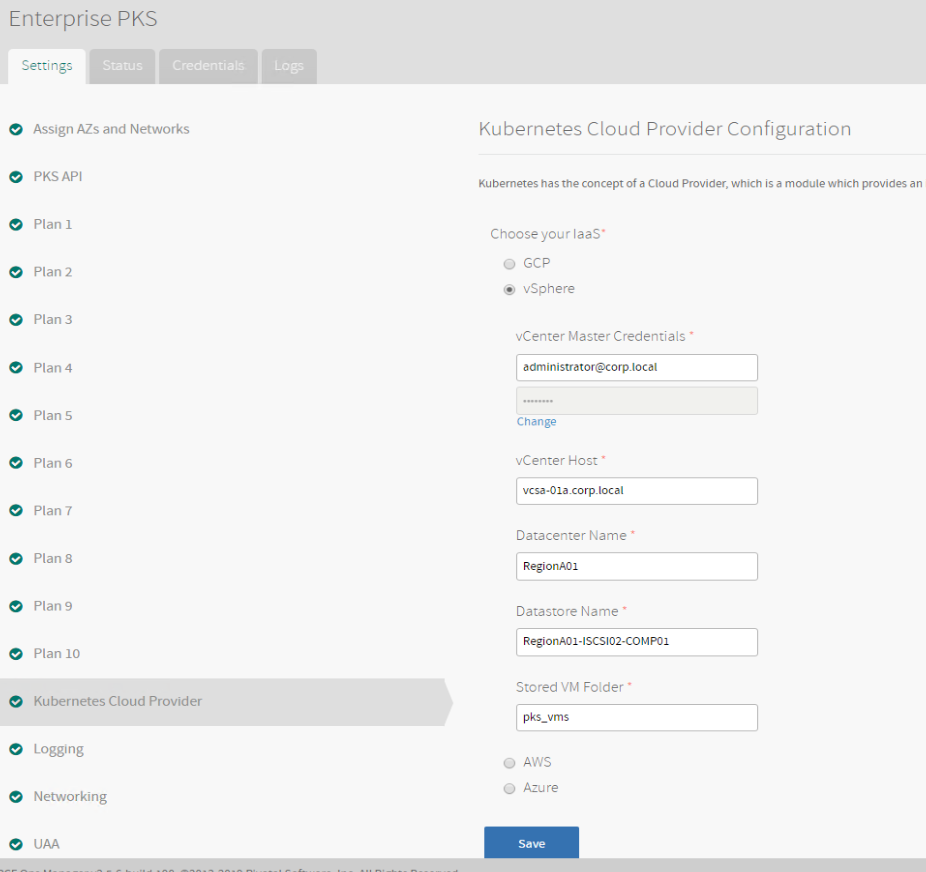

 

1.9 Prepare Variables to Configure the `Networking` tab

_Note: Use Notepad++ to keep track of the values you will locate below._

1.9.1 Log into the NSX Manager UI, go to `Advanced Networking & Security > Networking > IPAM`, and on the IPAM page and gather the ID for the `ip-block-pods-deployments` and `ip-block-nodes-deployments` and keep note of the values
Login for NSX Manager UI is: admin/VMware1!

Screenshot 1.9.1.1

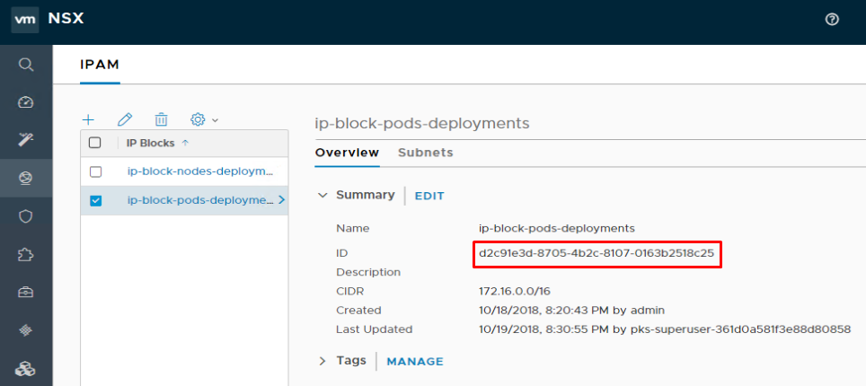

Screenshot 1.9.1.2

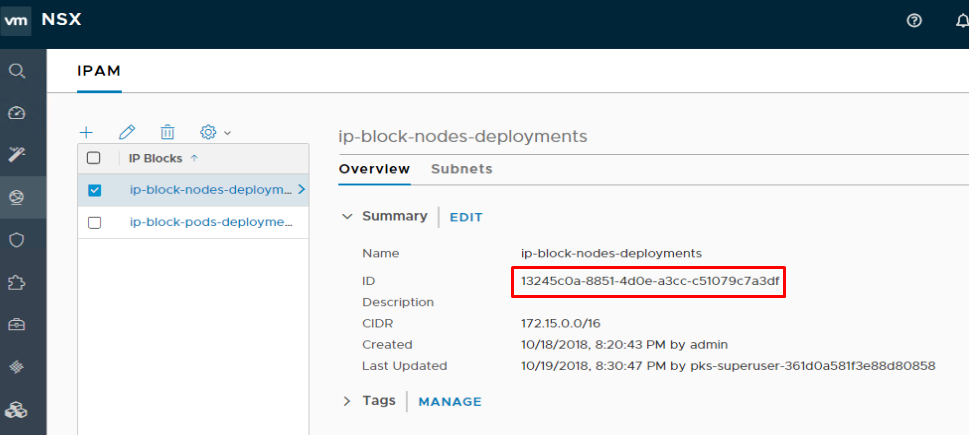

 

1.9.2 In the NSX Manager UI, go to `Advanced Networking & Security > Networking > Routers`, click on t0-pks and gather the t0-pks ID value

Screenshot 1.9.2

 

1.9.3 In the NSX Manger UI, go to the `Advanced Networking & Security > Inventory > Groups > IP Pools` click on the ID value for `ip-pool-vips` and a pop-up window will display the entire ID value, keep note of it

Screenshot 1.9.3

 

1.10 Return to the Ops Manager UI, go to the settings page for Pivotal Container Service, click on the `Networking` tab and enter the following values:

- Container Networking Interface: `NSX-T`
- NSX Manager Hostname: `192.168.110.42`
- NSX Manager Super User Principal Identity Certificate: Use the PI certificate and key values you copied to Notepad++ in the PKS Install Phase 1 lab, pasting the certificate in the first box and the key in the second box
- NSX Manager CA Cert: Use the NSX API certificate value you copied to Notepad++ in the PKS Install Phase 1 lab, this should also be saved as nsx.crt on your desktop
- Disable SSL certificate verification: `True`
- NAT mode: `True`
- Pods IP Block ID: Use the value you gathered above
- Nodes IP Block ID: Use the value you gathered above
- T0 Router ID: Use the value you gathered above
- Floating IP Pool ID: Use the value you gathered above for ip-pool-vips
- Nodes DNS: `192.168.110.10`
- vSphere Cluster Names: `RegionA01-COMP01`
- Enable outbound internet access: `True`
- Click `Save`

Screenshot 1.10.1

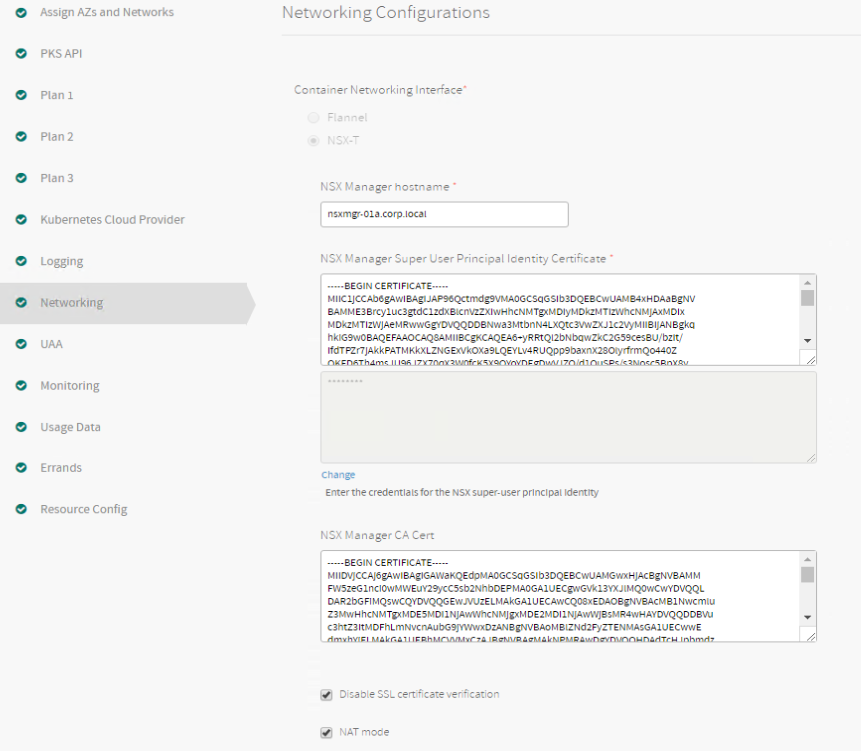

 

Screenshot 1.10.2

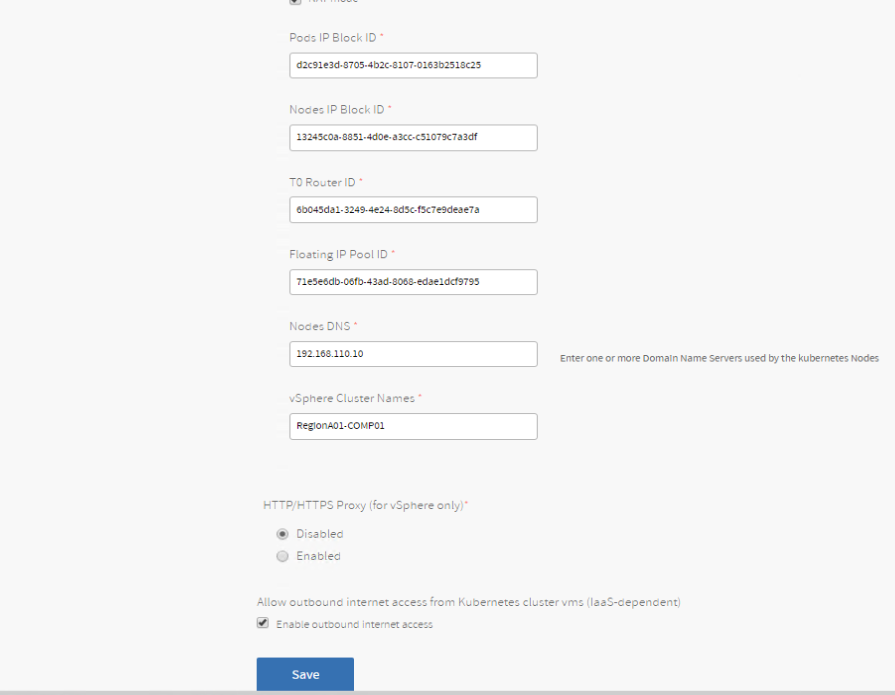

 

1.11 Select the `UAA` tab and enter the following values:

- Configure your UAA user account store with either internal or external authentication mechanisms: `Internal UAA`
- Click `Save`

Screenshot 1.11

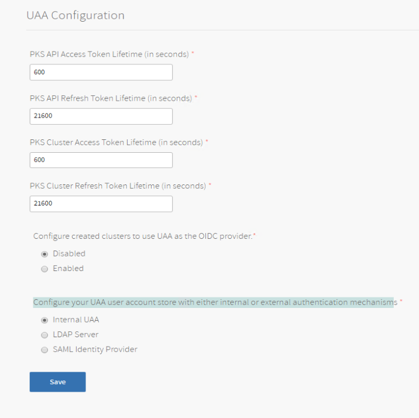

 

1.12 Select the `Host Monitoring` tab, check the box to `Enable VMware vRealize Log Insight Integration` and enter the following values:

- Host: `vrli-01a.corp.local`
- Disable SSL Certificate Validation: `True`
- Click Save

Screenshot 1.12

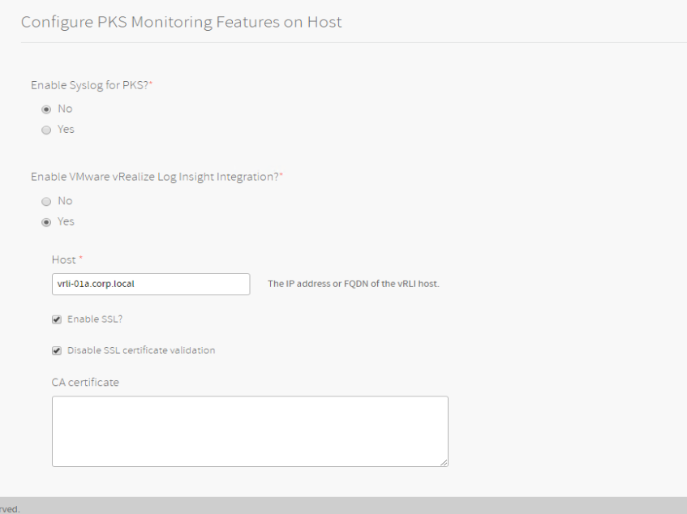

 

1.13 Select the `CEIP and Telemtetry` tab and enter the following values:

- Please select your participation level in the CEIP and Telemetry program:
  - `None: No data will be collected from your PKS installation and you will not be eligible for any benefits`
- Please select how you will be using this PKS Installation:
  - `Demo or Proof-of-concept`
- Click `Save`

Screenshot 1.13

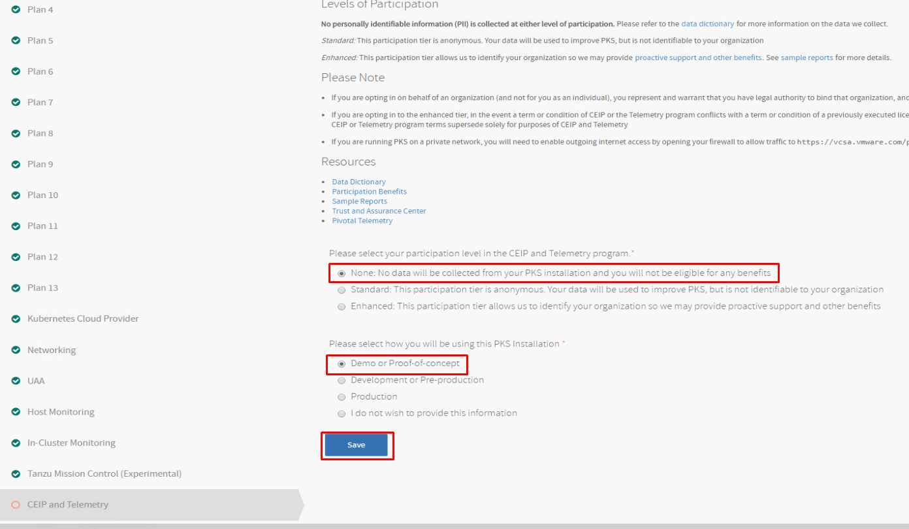

 

1.14 Select the `Resource Config` tab and set the `VM Type` for the `Pivotal Container Service` job to `medium.disk` and click `Save`

Screenshot 1.14

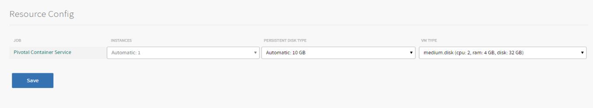

 

1.15 In the Ops Manager UI on the top menu bar click `Installation Dashboard`, next select `Review Pending Changes` and on the `Review Pending Changes`, select `Apply Changes`

Screenshot 1.15

 

_Note: After you click `Apply Changes` BOSH will begin deploying PKS and it will take a while to complete. In the nested example lab, the PKS deployment took ~1 hour to complete. Leave the `Applying Changes` window open and check it periodically for status. While waiting for the deployment, use another browser tab to open a second connection to the Ops Manager UI and use the second browser session to complete the harbor configuration in the next section._

**You have now completed the PKS installation**

***End of lab***
